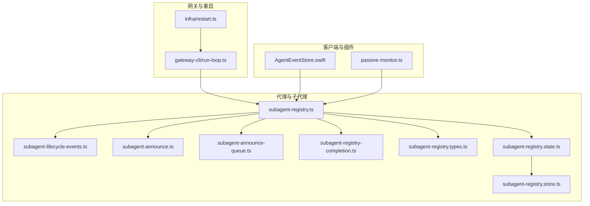
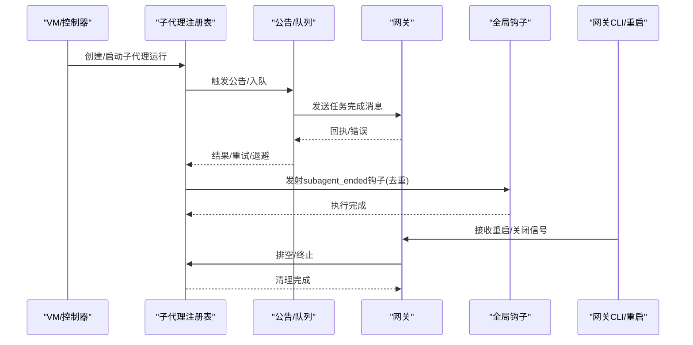
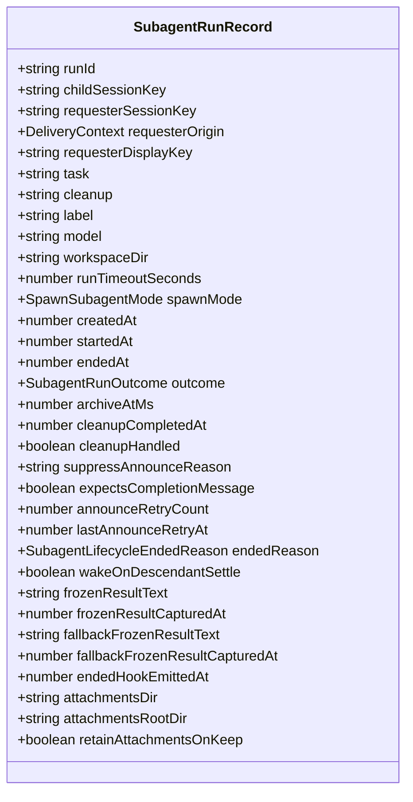
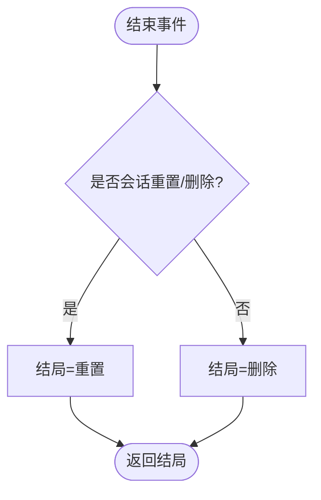
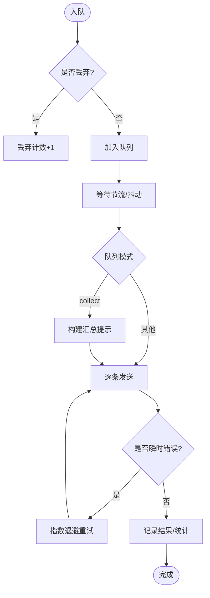
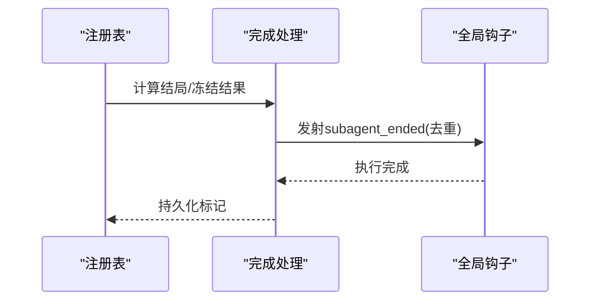
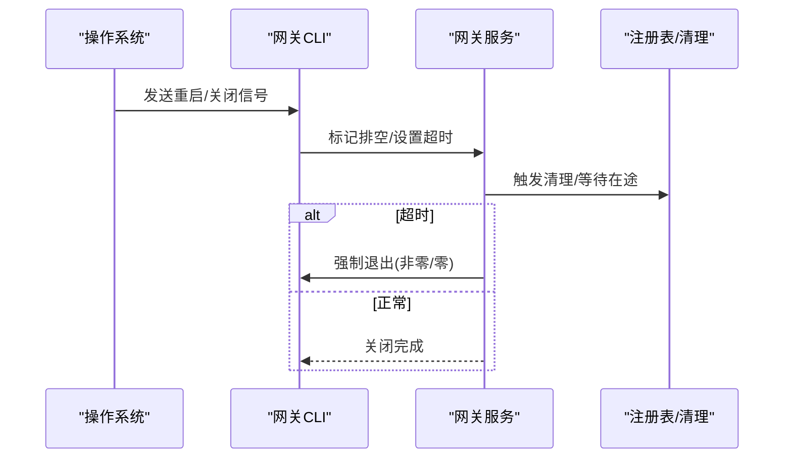
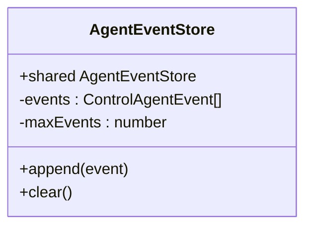
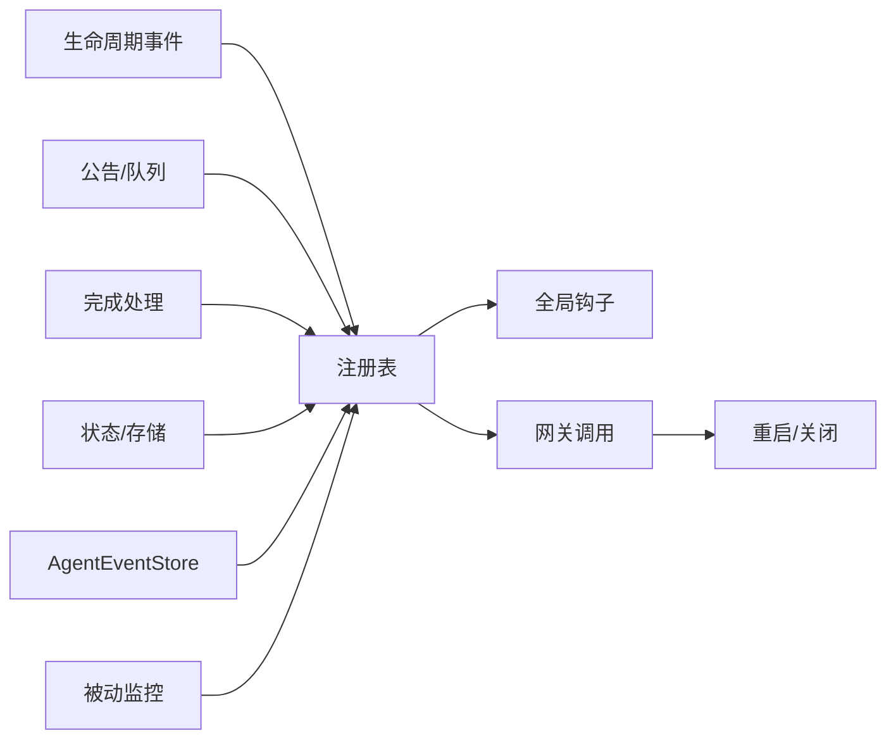
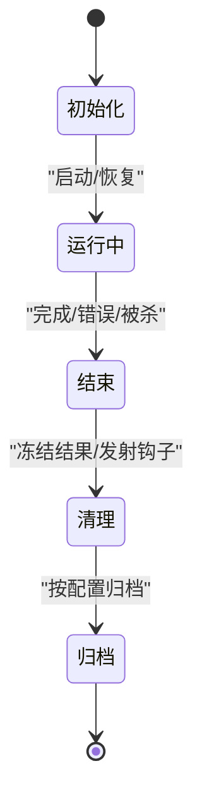

# Pi Agent 生命周期管理

<cite>
**本文引用的文件**
- [src/agents/subagent-lifecycle-events.ts](file://src/agents/subagent-lifecycle-events.ts)
- [src/agents/subagent-registry.ts](file://src/agents/subagent-registry.ts)
- [src/agents/subagent-registry.types.ts](file://src/agents/subagent-registry.types.ts)
- [src/agents/subagent-registry.state.ts](file://src/agents/subagent-registry.state.ts)
- [src/agents/subagent-registry.store.ts](file://src/agents/subagent-registry.store.ts)
- [src/agents/subagent-announce.ts](file://src/agents/subagent-announce.ts)
- [src/agents/subagent-announce-queue.ts](file://src/agents/subagent-announce-queue.ts)
- [src/agents/subagent-registry-completion.ts](file://src/agents/subagent-registry-completion.ts)
- [src/cli/gateway-cli/run-loop.ts](file://src/cli/gateway-cli/run-loop.ts)
- [src/infra/restart.ts](file://src/infra/restart.ts)
- [apps/macos/Sources/OpenClaw/AgentEventStore.swift](file://apps/macos/Sources/OpenClaw/AgentEventStore.swift)
- [extensions/shared/passive-monitor.ts](file://extensions/shared/passive-monitor.ts)
- [src/gateway/server-methods/agents-mutate.test.ts](file://src/gateway/server-methods/agents-mutate.test.ts)
- [src/cli/daemon-cli/lifecycle.test.ts](file://src/cli/daemon-cli/lifecycle.test.ts)
</cite>

## 目录
1. [引言](#引言)
2. [项目结构](#项目结构)
3. [核心组件](#核心组件)
4. [架构总览](#架构总览)
5. [详细组件分析](#详细组件分析)
6. [依赖关系分析](#依赖关系分析)
7. [性能考量](#性能考量)
8. [故障排查指南](#故障排查指南)
9. [结论](#结论)
10. [附录](#附录)

## 引言
本文件系统化阐述 Pi Agent 的生命周期管理：从创建、初始化、运行、监控到销毁的全链路机制；覆盖状态转换、内存与磁盘持久化、资源清理、异常处理、作用域与并发控制、线程安全策略、生命周期钩子与回调、事件监听、重启与故障恢复、以及优雅关闭流程。文档同时提供状态机图、序列图与流程图，并给出可操作的最佳实践。

## 项目结构
围绕代理生命周期的关键模块分布于以下位置：
- 子代理注册与运行时：src/agents 下的注册表、事件、公告、队列与完成处理等文件
- 网关运行循环与重启：src/cli/gateway-cli/run-loop.ts 与 src/infra/restart.ts
- 客户端事件存储（macOS）：apps/macos/Sources/OpenClaw/AgentEventStore.swift
- 插件侧被动监控：extensions/shared/passive-monitor.ts
- 配置与测试用例：src/gateway/server-methods/agents-mutate.test.ts、src/cli/daemon-cli/lifecycle.test.ts

**图表来源**
- [src/agents/subagent-registry.ts:1-800](file://src/agents/subagent-registry.ts#L1-L800)
- [src/agents/subagent-lifecycle-events.ts:1-48](file://src/agents/subagent-lifecycle-events.ts#L1-L48)
- [src/agents/subagent-announce.ts:1-800](file://src/agents/subagent-announce.ts#L1-L800)
- [src/agents/subagent-announce-queue.ts:1-239](file://src/agents/subagent-announce-queue.ts#L1-L239)
- [src/agents/subagent-registry-completion.ts:1-97](file://src/agents/subagent-registry-completion.ts#L1-L97)
- [src/agents/subagent-registry.types.ts:1-59](file://src/agents/subagent-registry.types.ts#L1-L59)
- [src/agents/subagent-registry.state.ts:1-57](file://src/agents/subagent-registry.state.ts#L1-L57)
- [src/agents/subagent-registry.store.ts:1-132](file://src/agents/subagent-registry.store.ts#L1-L132)
- [src/cli/gateway-cli/run-loop.ts:98-129](file://src/cli/gateway-cli/run-loop.ts#L98-L129)
- [src/infra/restart.ts:149-190](file://src/infra/restart.ts#L149-L190)
- [apps/macos/Sources/OpenClaw/AgentEventStore.swift:1-22](file://apps/macos/Sources/OpenClaw/AgentEventStore.swift#L1-L22)
- [extensions/shared/passive-monitor.ts:1-18](file://extensions/shared/passive-monitor.ts#L1-L18)

**章节来源**
- [src/agents/subagent-registry.ts:1-800](file://src/agents/subagent-registry.ts#L1-L800)
- [src/agents/subagent-announce.ts:1-800](file://src/agents/subagent-announce.ts#L1-L800)
- [src/cli/gateway-cli/run-loop.ts:98-129](file://src/cli/gateway-cli/run-loop.ts#L98-L129)

## 核心组件
- 子代理运行记录与状态：定义运行记录字段、超时、归档、冻结结果、附件等
- 生命周期事件与结局：定义结束原因、结局类型与映射
- 注册表与恢复：内存 Map + 磁盘持久化，启动恢复、孤儿运行清理、扫描器清理
- 公告与队列：直接发送、重试、退避、队列聚合与节流
- 完成与钩子：终端结局计算、去重钩子发射、错误延迟容错
- 网关运行循环与重启：重启/关闭信号、排空窗口、强制退出保护
- 客户端事件存储与插件被动监控：事件缓存、可停止监控

**章节来源**
- [src/agents/subagent-registry.types.ts:6-58](file://src/agents/subagent-registry.types.ts#L6-L58)
- [src/agents/subagent-lifecycle-events.ts:1-48](file://src/agents/subagent-lifecycle-events.ts#L1-L48)
- [src/agents/subagent-registry.ts:65-137](file://src/agents/subagent-registry.ts#L65-L137)
- [src/agents/subagent-announce.ts:75-81](file://src/agents/subagent-announce.ts#L75-L81)
- [src/agents/subagent-announce-queue.ts:38-58](file://src/agents/subagent-announce-queue.ts#L38-L58)
- [src/agents/subagent-registry-completion.ts:32-42](file://src/agents/subagent-registry-completion.ts#L32-L42)
- [src/cli/gateway-cli/run-loop.ts:98-129](file://src/cli/gateway-cli/run-loop.ts#L98-L129)
- [apps/macos/Sources/OpenClaw/AgentEventStore.swift:1-22](file://apps/macos/Sources/OpenClaw/AgentEventStore.swift#L1-L22)
- [extensions/shared/passive-monitor.ts:1-18](file://extensions/shared/passive-monitor.ts#L1-L18)

## 架构总览
Pi Agent 生命周期由“注册表驱动 + 公告分发 + 队列聚合 + 钩子回调 + 网关重启”构成闭环。注册表负责运行期状态与持久化，公告层负责对外通知与回执，队列层负责削峰与聚合，钩子层负责扩展点回调，网关层负责进程级重启与优雅关闭。

**图表来源**
- [src/agents/subagent-registry.ts:451-530](file://src/agents/subagent-registry.ts#L451-L530)
- [src/agents/subagent-announce.ts:595-630](file://src/agents/subagent-announce.ts#L595-L630)
- [src/agents/subagent-announce-queue.ts:121-210](file://src/agents/subagent-announce-queue.ts#L121-L210)
- [src/agents/subagent-registry-completion.ts:44-96](file://src/agents/subagent-registry-completion.ts#L44-L96)
- [src/cli/gateway-cli/run-loop.ts:98-129](file://src/cli/gateway-cli/run-loop.ts#L98-L129)

## 详细组件分析

### 子代理注册表与运行记录
- 运行记录字段涵盖：会话键、请求者上下文、任务、清理策略、标签、模型、工作区、超时、模式、创建/开始/结束时间、结局、归档时间、清理状态、抑制公告原因、是否期待完成消息、重试计数与时间、结局原因、唤醒等待、冻结结果文本、回退冻结结果、钩子发射时间、附件目录等
- 启动恢复：从磁盘加载并合并内存，孤儿运行检测与清理，扫描器按归档时间清理
- 结束处理：冻结最终输出、决定是否发射钩子、进入公告清理流程
- 错误延迟容错：对瞬时错误延迟发射，避免过早失败导致的不必要清理

**图表来源**
- [src/agents/subagent-registry.types.ts:6-58](file://src/agents/subagent-registry.types.ts#L6-L58)

**章节来源**
- [src/agents/subagent-registry.types.ts:6-58](file://src/agents/subagent-registry.types.ts#L6-L58)
- [src/agents/subagent-registry.ts:65-137](file://src/agents/subagent-registry.ts#L65-L137)
- [src/agents/subagent-registry.ts:451-530](file://src/agents/subagent-registry.ts#L451-L530)
- [src/agents/subagent-registry.ts:726-763](file://src/agents/subagent-registry.ts#L726-L763)

### 生命周期事件与结局
- 结束原因：完成、错误、被杀、会话重置、会话删除
- 结局类型：成功、错误、超时、被杀、重置、删除
- 会话结束结局映射：重置对应重置，否则对应删除

**图表来源**
- [src/agents/subagent-lifecycle-events.ts:40-47](file://src/agents/subagent-lifecycle-events.ts#L40-L47)

**章节来源**
- [src/agents/subagent-lifecycle-events.ts:1-48](file://src/agents/subagent-lifecycle-events.ts#L1-L48)

### 公告与队列
- 直接发送：根据目标通道与线程信息直接调用网关发送，支持幂等键与内部事件
- 重试与退避：对瞬时错误进行有限次重试，指数退避上限
- 队列聚合：跨渠道/跨账号聚合，支持收集模式与摘要提示，节流与丢弃策略
- 超时与错误分类：区分瞬时与永久性错误，避免无限重试

**图表来源**
- [src/agents/subagent-announce-queue.ts:121-210](file://src/agents/subagent-announce-queue.ts#L121-L210)
- [src/agents/subagent-announce.ts:167-197](file://src/agents/subagent-announce.ts#L167-L197)
- [src/agents/subagent-announce.ts:595-630](file://src/agents/subagent-announce.ts#L595-L630)

**章节来源**
- [src/agents/subagent-announce.ts:75-81](file://src/agents/subagent-announce.ts#L75-L81)
- [src/agents/subagent-announce.ts:104-140](file://src/agents/subagent-announce.ts#L104-L140)
- [src/agents/subagent-announce.ts:595-630](file://src/agents/subagent-announce.ts#L595-L630)
- [src/agents/subagent-announce-queue.ts:38-58](file://src/agents/subagent-announce-queue.ts#L38-L58)
- [src/agents/subagent-announce-queue.ts:121-210](file://src/agents/subagent-announce-queue.ts#L121-L210)

### 完成与钩子
- 结局比较与映射：比较两次结局是否一致，将运行结局映射为生命周期结局
- 去重钩子发射：同一运行仅发射一次 subagent_ended，避免重复回调
- 错误延迟：对嵌入式运行的瞬时错误延迟发射，等待后续 start/end 事件修正

**图表来源**
- [src/agents/subagent-registry-completion.ts:13-42](file://src/agents/subagent-registry-completion.ts#L13-L42)
- [src/agents/subagent-registry-completion.ts:44-96](file://src/agents/subagent-registry-completion.ts#L44-L96)
- [src/agents/subagent-registry.ts:279-313](file://src/agents/subagent-registry.ts#L279-L313)

**章节来源**
- [src/agents/subagent-registry-completion.ts:1-97](file://src/agents/subagent-registry-completion.ts#L1-L97)
- [src/agents/subagent-registry.ts:279-313](file://src/agents/subagent-registry.ts#L279-L313)

### 网关运行循环与重启
- 信号处理：接收重启/关闭信号，区分重启与关闭
- 排空窗口：重启时拒绝新入队，等待在途任务完成
- 强制退出：超过阈值未完成则强制退出，避免僵尸进程
- 重启授权：SIGUSR1 重启授权与消费，避免重复重启

**图表来源**
- [src/cli/gateway-cli/run-loop.ts:98-129](file://src/cli/gateway-cli/run-loop.ts#L98-L129)
- [src/infra/restart.ts:149-190](file://src/infra/restart.ts#L149-L190)

**章节来源**
- [src/cli/gateway-cli/run-loop.ts:98-129](file://src/cli/gateway-cli/run-loop.ts#L98-L129)
- [src/infra/restart.ts:149-190](file://src/infra/restart.ts#L149-L190)

### 客户端事件存储与插件被动监控
- 事件存储：单例事件数组，限制长度，追加与清空
- 被动监控：通过插件 SDK 启动/停止可停止监控器，配合生命周期钩子

**图表来源**
- [apps/macos/Sources/OpenClaw/AgentEventStore.swift:1-22](file://apps/macos/Sources/OpenClaw/AgentEventStore.swift#L1-L22)

**章节来源**
- [apps/macos/Sources/OpenClaw/AgentEventStore.swift:1-22](file://apps/macos/Sources/OpenClaw/AgentEventStore.swift#L1-L22)
- [extensions/shared/passive-monitor.ts:1-18](file://extensions/shared/passive-monitor.ts#L1-L18)

## 依赖关系分析
- 注册表依赖：事件定义、公告流程、完成处理、查询工具、状态持久化
- 公告层依赖：队列、会话路由、幂等键、内部事件、嵌入式运行
- 网关层依赖：运行循环与重启授权
- 客户端/插件：事件存储与被动监控

**图表来源**
- [src/agents/subagent-registry.ts:1-800](file://src/agents/subagent-registry.ts#L1-L800)
- [src/agents/subagent-announce.ts:1-800](file://src/agents/subagent-announce.ts#L1-L800)
- [src/agents/subagent-registry-completion.ts:1-97](file://src/agents/subagent-registry-completion.ts#L1-L97)
- [src/agents/subagent-registry.state.ts:1-57](file://src/agents/subagent-registry.state.ts#L1-L57)
- [src/cli/gateway-cli/run-loop.ts:98-129](file://src/cli/gateway-cli/run-loop.ts#L98-L129)
- [apps/macos/Sources/OpenClaw/AgentEventStore.swift:1-22](file://apps/macos/Sources/OpenClaw/AgentEventStore.swift#L1-L22)
- [extensions/shared/passive-monitor.ts:1-18](file://extensions/shared/passive-monitor.ts#L1-L18)

**章节来源**
- [src/agents/subagent-registry.ts:1-800](file://src/agents/subagent-registry.ts#L1-L800)
- [src/agents/subagent-announce.ts:1-800](file://src/agents/subagent-announce.ts#L1-L800)
- [src/agents/subagent-registry-completion.ts:1-97](file://src/agents/subagent-registry-completion.ts#L1-L97)
- [src/agents/subagent-registry.state.ts:1-57](file://src/agents/subagent-registry.state.ts#L1-L57)
- [src/cli/gateway-cli/run-loop.ts:98-129](file://src/cli/gateway-cli/run-loop.ts#L98-L129)
- [apps/macos/Sources/OpenClaw/AgentEventStore.swift:1-22](file://apps/macos/Sources/OpenClaw/AgentEventStore.swift#L1-L22)
- [extensions/shared/passive-monitor.ts:1-18](file://extensions/shared/passive-monitor.ts#L1-L18)

## 性能考量
- 内存与磁盘平衡：运行记录以内存为主，定期持久化；磁盘读写在非测试环境启用，失败不影响运行
- 队列节流与聚合：通过节流与摘要减少网络压力，避免风暴式通知
- 重试退避：指数退避上限与瞬时错误识别，降低无效重试
- 扫描器清理：按归档时间清理，避免长期占用空间
- 超时与截断：冻结结果文本截断，防止超大输出影响性能

[本节为通用指导，无需具体文件分析]

## 故障排查指南
- 创建/删除代理失败：检查保留 ID、重复名、参数校验与文件删除开关
- 重启失败或健康检查失败：确认重启授权、端口占用、健康快照
- 公告失败：检查瞬时/永久性错误模式、重试次数、幂等键
- 代理孤儿运行：查看孤儿原因（缺失会话/会话 ID），确认恢复与清理
- 优雅关闭超时：调整排空窗口与强制退出阈值，确保在途任务完成

**章节来源**
- [src/gateway/server-methods/agents-mutate.test.ts:292-345](file://src/gateway/server-methods/agents-mutate.test.ts#L292-L345)
- [src/gateway/server-methods/agents-mutate.test.ts:443-490](file://src/gateway/server-methods/agents-mutate.test.ts#L443-L490)
- [src/cli/daemon-cli/lifecycle.test.ts:209-235](file://src/cli/daemon-cli/lifecycle.test.ts#L209-L235)
- [src/agents/subagent-registry.ts:153-182](file://src/agents/subagent-registry.ts#L153-L182)
- [src/agents/subagent-announce.ts:104-140](file://src/agents/subagent-announce.ts#L104-L140)
- [src/cli/gateway-cli/run-loop.ts:98-129](file://src/cli/gateway-cli/run-loop.ts#L98-L129)

## 结论
Pi Agent 生命周期管理通过“注册表 + 公告/队列 + 钩子 + 网关重启”的协同，实现了高可用、可观测、可扩展的子代理生命周期治理。其设计强调持久化与恢复、错误容错与重试、事件去重与幂等、以及优雅关闭与重启。结合本文的状态机、序列图与流程图，可快速定位问题并优化性能与稳定性。

[本节为总结，无需具体文件分析]

## 附录

### 生命周期状态机（简化）

[本图为概念示意，无需图表来源]

### 最佳实践
- 使用幂等键避免重复公告
- 对瞬时错误采用指数退避
- 控制冻结结果大小，避免内存膨胀
- 合理设置归档时间，平衡可观测性与存储成本
- 在重启前开启排空窗口，确保在途任务完成
- 使用钩子进行扩展，但注意去重与幂等

[本节为通用指导，无需具体文件分析]