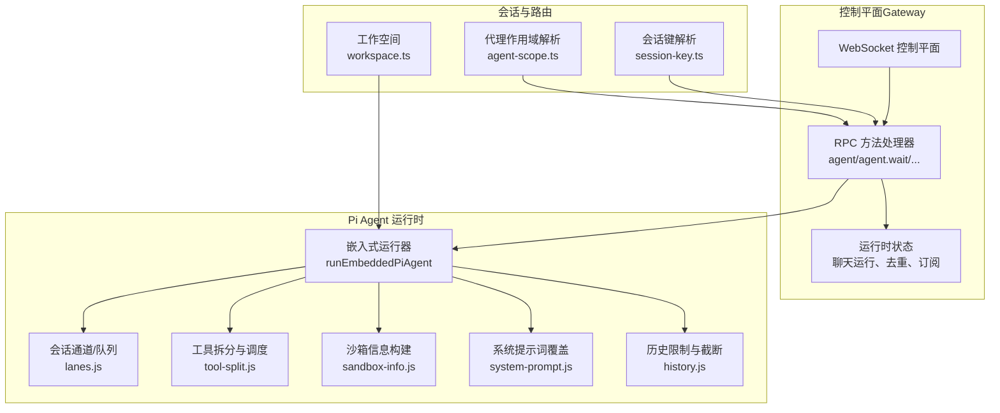
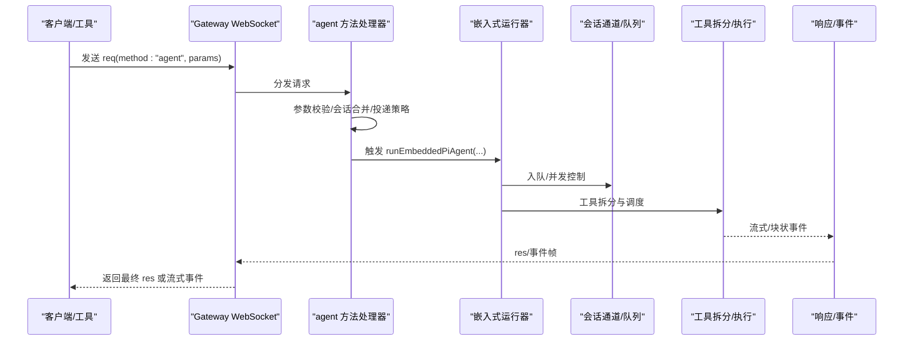
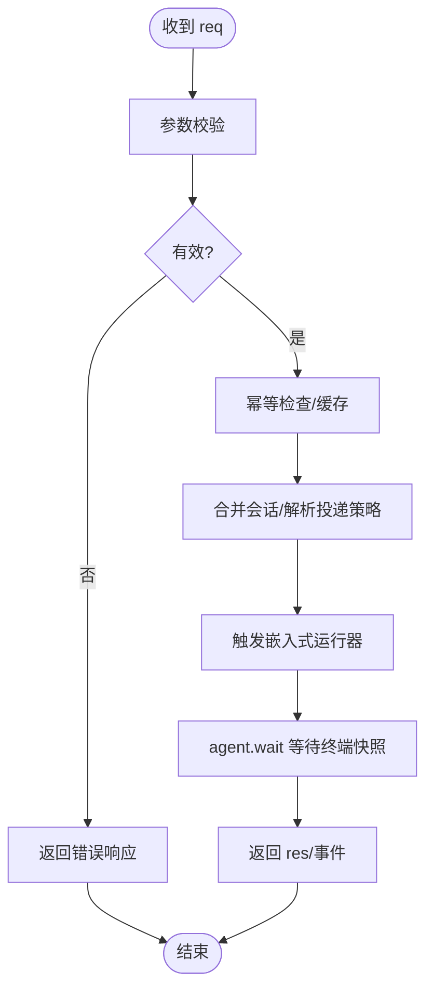
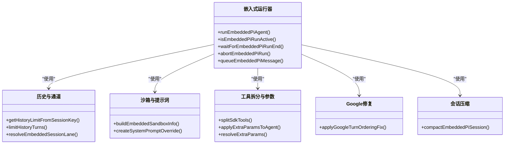
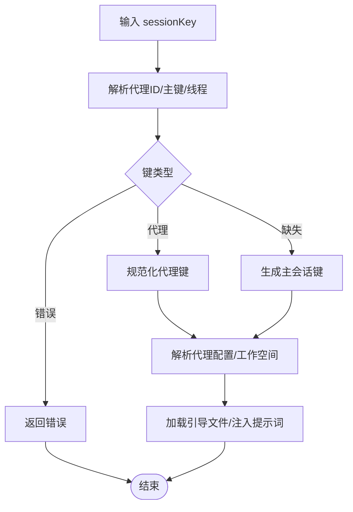
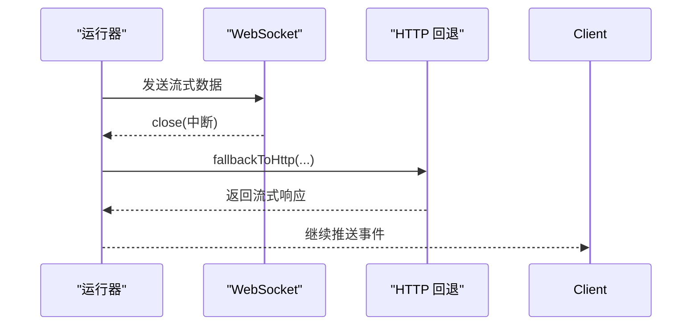
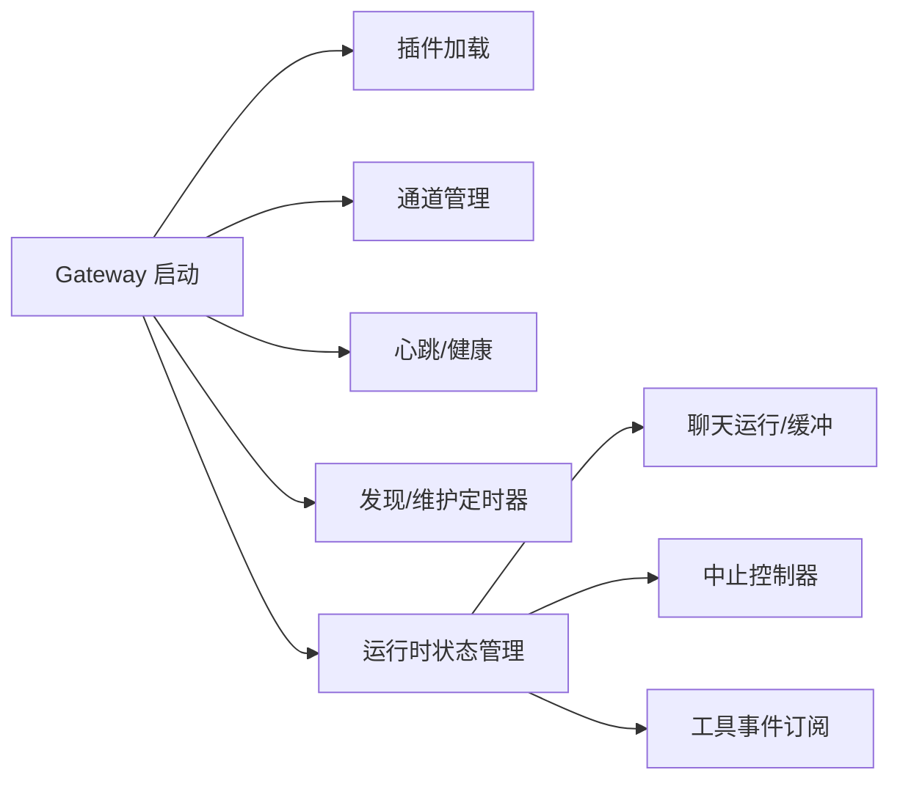

# Pi Agent 运行时

<cite>
**本文档引用的文件**
- [README.md](file://README.md)
- [src/agents/agent-scope.ts](file://src/agents/agent-scope.ts)
- [src/agents/workspace.ts](file://src/agents/workspace.ts)
- [src/routing/session-key.ts](file://src/routing/session-key.ts)
- [src/gateway/server.ts](file://src/gateway/server.ts)
- [src/gateway/server.impl.ts](file://src/gateway/server.impl.ts)
- [src/gateway/server-methods/agent.ts](file://src/gateway/server-methods/agent.ts)
- [src/agents/pi-embedded-runner.ts](file://src/agents/pi-embedded-runner.ts)
- [src/agents/pi-embedded-runner/run.js](file://src/agents/pi-embedded-runner/run.js)
- [src/agents/pi-embedded-runner/runs.js](file://src/agents/pi-embedded-runner/runs.js)
- [src/agents/pi-embedded-runner/history.js](file://src/agents/pi-embedded-runner/history.js)
- [src/agents/pi-embedded-runner/lanes.js](file://src/agents/pi-embedded-runner/lanes.js)
- [src/agents/pi-embedded-runner/sandbox-info.js](file://src/agents/pi-embedded-runner/sandbox-info.js)
- [src/agents/pi-embedded-runner/system-prompt.js](file://src/agents/pi-embedded-runner/system-prompt.js)
- [src/agents/pi-embedded-runner/tool-split.js](file://src/agents/pi-embedded-runner/tool-split.js)
- [src/agents/pi-embedded-runner/extra-params.js](file://src/agents/pi-embedded-runner/extra-params.js)
- [src/agents/pi-embedded-runner/google.js](file://src/agents/pi-embedded-runner/google.js)
- [src/agents/pi-embedded-runner/compact.js](file://src/agents/pi-embedded-runner/compact.js)
- [src/agents/pi-embedded-runner/types.js](file://src/agents/pi-embedded-runner/types.js)
- [src/gateway/server.sessions-send.test.ts](file://src/gateway/server.sessions-send.test.ts)
- [src/gateway/server-methods/agent.test.ts](file://src/gateway/server-methods/agent.test.ts)
- [src/agents/openclaw-tools.sessions.test.ts](file://src/agents/openclaw-tools.sessions.test.ts)
- [src/auto-reply/reply/session-hooks.ts](file://src/auto-reply/reply/session-hooks.ts)
- [src/gateway/server.ws-connection/message-handler.ts](file://src/gateway/server.ws-connection/message-handler.ts)
- [src/agents/openai-ws-stream.ts](file://src/agents/openai-ws-stream.ts)
- [docs/concepts/multi-agent.md](file://docs/concepts/multi-agent.md)
</cite>

## 目录
1. [简介](#简介)
2. [项目结构](#项目结构)
3. [核心组件](#核心组件)
4. [架构总览](#架构总览)
5. [详细组件分析](#详细组件分析)
6. [依赖关系分析](#依赖关系分析)
7. [性能考虑](#性能考虑)
8. [故障排除指南](#故障排除指南)
9. [结论](#结论)
10. [附录](#附录)

## 简介
本文件面向 OpenClaw 的 Pi Agent 运行时系统，系统性阐述其架构设计、运行机制与核心功能，覆盖代理生命周期管理、会话状态维护、工具调用协调与消息处理流程；同时说明与 WebSocket 控制平面的交互协议、RPC 调用机制、流式响应处理与错误恢复策略，并给出代理配置选项、性能优化技巧与调试方法。此外，文档还解释代理工作空间的概念、技能加载机制与多代理路由策略，提供可定位到源码的路径指引、流程图与故障排除建议，帮助开发者理解与扩展代理系统。

## 项目结构
OpenClaw 采用模块化分层组织：Gateway 控制平面通过 WebSocket 提供统一的 RPC 接口；Pi Agent 在嵌入式运行器中执行推理与工具调用；会话与路由围绕 session key 体系组织；工作空间负责注入引导文件（如 AGENTS.md、SOUL.md、TOOLS.md）与技能加载。

图表来源
- [src/gateway/server.impl.ts:466-487](file://src/gateway/server.impl.ts#L466-L487)
- [src/gateway/server-methods/agent.ts:148-772](file://src/gateway/server-methods/agent.ts#L148-L772)
- [src/agents/pi-embedded-runner.ts:1-29](file://src/agents/pi-embedded-runner.ts#L1-L29)
- [src/routing/session-key.ts:78-125](file://src/routing/session-key.ts#L78-L125)
- [src/agents/agent-scope.ts:106-145](file://src/agents/agent-scope.ts#L106-L145)
- [src/agents/workspace.ts:12-34](file://src/agents/workspace.ts#L12-L34)

章节来源
- [README.md:185-239](file://README.md#L185-L239)
- [src/gateway/server.impl.ts:466-487](file://src/gateway/server.impl.ts#L466-L487)
- [src/gateway/server-methods/agent.ts:148-772](file://src/gateway/server-methods/agent.ts#L148-L772)
- [src/agents/pi-embedded-runner.ts:1-29](file://src/agents/pi-embedded-runner.ts#L1-L29)
- [src/routing/session-key.ts:78-125](file://src/routing/session-key.ts#L78-L125)
- [src/agents/agent-scope.ts:106-145](file://src/agents/agent-scope.ts#L106-L145)
- [src/agents/workspace.ts:12-34](file://src/agents/workspace.ts#L12-L34)

## 核心组件
- 控制平面与 RPC 协议
  - Gateway 通过 WebSocket 暴露统一的 RPC 方法（如 agent、agent.wait），并进行参数校验、幂等缓存、会话合并与投递策略解析。
  - 参考路径：[src/gateway/server-methods/agent.ts:148-772](file://src/gateway/server-methods/agent.ts#L148-L772)

- 嵌入式 Pi Agent 运行器
  - 提供 runEmbeddedPiAgent、队列与运行状态管理（isEmbeddedPiRunActive、waitForEmbeddedPiRunEnd）、历史限制、通道/队列、沙箱信息、系统提示词覆盖、工具拆分与额外参数处理等能力。
  - 参考路径：[src/agents/pi-embedded-runner.ts:1-29](file://src/agents/pi-embedded-runner.ts#L1-L29)

- 会话与路由
  - session-key.ts 定义会话键规范、代理 ID 归一化、主会话键与群组/私聊键生成、线程会话键等。
  - 参考路径：[src/routing/session-key.ts:78-254](file://src/routing/session-key.ts#L78-L254)

- 代理作用域与工作空间
  - agent-scope.ts 解析默认/显式代理 ID、代理配置、工作空间目录解析与路径规范化。
  - workspace.ts 负责默认工作空间、引导文件注入（AGENTS.md、SOUL.md、TOOLS.md 等）、边界安全读取与缓存、额外引导文件加载与诊断。
  - 参考路径：
    - [src/agents/agent-scope.ts:106-145](file://src/agents/agent-scope.ts#L106-L145)
    - [src/agents/workspace.ts:12-34](file://src/agents/workspace.ts#L12-L34)
    - [src/agents/workspace.ts:487-547](file://src/agents/workspace.ts#L487-L547)

章节来源
- [src/gateway/server-methods/agent.ts:148-772](file://src/gateway/server-methods/agent.ts#L148-L772)
- [src/agents/pi-embedded-runner.ts:1-29](file://src/agents/pi-embedded-runner.ts#L1-L29)
- [src/routing/session-key.ts:78-254](file://src/routing/session-key.ts#L78-L254)
- [src/agents/agent-scope.ts:106-145](file://src/agents/agent-scope.ts#L106-L145)
- [src/agents/workspace.ts:12-34](file://src/agents/workspace.ts#L12-L34)
- [src/agents/workspace.ts:487-547](file://src/agents/workspace.ts#L487-L547)

## 架构总览
Pi Agent 运行时在 Gateway 控制平面内以“嵌入式运行器”形式存在，接收来自 RPC 的请求，解析会话与路由，构建运行上下文（模型、工具、沙箱、系统提示词），调度工具执行，并将结果通过 WebSocket 流式返回或最终响应。

图表来源
- [src/gateway/server-methods/agent.ts:148-772](file://src/gateway/server-methods/agent.ts#L148-L772)
- [src/agents/pi-embedded-runner/run.js](file://src/agents/pi-embedded-runner/run.js)
- [src/agents/pi-embedded-runner/runs.js](file://src/agents/pi-embedded-runner/runs.js)
- [src/agents/pi-embedded-runner/tool-split.js](file://src/agents/pi-embedded-runner/tool-split.js)

章节来源
- [src/gateway/server-methods/agent.ts:148-772](file://src/gateway/server-methods/agent.ts#L148-L772)
- [src/agents/pi-embedded-runner/run.js](file://src/agents/pi-embedded-runner/run.js)
- [src/agents/pi-embedded-runner/runs.js](file://src/agents/pi-embedded-runner/runs.js)
- [src/agents/pi-embedded-runner/tool-split.js](file://src/agents/pi-embedded-runner/tool-split.js)

## 详细组件分析

### 组件 A：RPC 与消息处理（Gateway）
- 请求进入与校验
  - 对 agent/agent.identity.get/agent.wait 等方法进行参数校验与错误格式化。
  - 参考路径：[src/gateway/server-methods/agent.ts:148-772](file://src/gateway/server-methods/agent.ts#L148-L772)

- 幂等与去重
  - 使用 idempotencyKey 缓存已接受的运行，避免重复执行。
  - 参考路径：[src/gateway/server-methods/agent.ts:207-213](file://src/gateway/server-methods/agent.ts#L207-L213)

- 会话合并与投递策略
  - 合并/更新会话存储，解析发送策略与目标，决定是否投递到外部渠道。
  - 参考路径：[src/gateway/server-methods/agent.ts:405-447](file://src/gateway/server-methods/agent.ts#L405-L447)

- 等待终端快照
  - agent.wait 支持竞态等待生命周期与去重快照，超时返回 timeout。
  - 参考路径：[src/gateway/server-methods/agent.ts:683-770](file://src/gateway/server-methods/agent.ts#L683-L770)

- WebSocket 消息处理与错误
  - 验证请求帧、构造响应、记录未授权请求与关闭策略。
  - 参考路径：[src/gateway/server.ws-connection/message-handler.ts:1062-1098](file://src/gateway/server.ws-connection/message-handler.ts#L1062-L1098)

图表来源
- [src/gateway/server-methods/agent.ts:148-772](file://src/gateway/server-methods/agent.ts#L148-L772)
- [src/gateway/server.ws-connection/message-handler.ts:1062-1098](file://src/gateway/server.ws-connection/message-handler.ts#L1062-L1098)

章节来源
- [src/gateway/server-methods/agent.ts:148-772](file://src/gateway/server-methods/agent.ts#L148-L772)
- [src/gateway/server.ws-connection/message-handler.ts:1062-1098](file://src/gateway/server.ws-connection/message-handler.ts#L1062-L1098)

### 组件 B：嵌入式运行器与工具协调
- 运行与状态管理
  - runEmbeddedPiAgent 执行推理与工具调用；isEmbeddedPiRunActive/waitForEmbeddedPiRunEnd/abortEmbeddedPiRun 管理运行生命周期。
  - 参考路径：
    - [src/agents/pi-embedded-runner.ts:12-19](file://src/agents/pi-embedded-runner.ts#L12-L19)
    - [src/agents/pi-embedded-runner/runs.js](file://src/agents/pi-embedded-runner/runs.js)

- 历史与通道
  - getHistoryLimitFromSessionKey/limitHistoryTurns 控制历史长度；resolveEmbeddedSessionLane 决定会话通道/队列。
  - 参考路径：
    - [src/agents/pi-embedded-runner/history.js:7-10](file://src/agents/pi-embedded-runner/history.js#L7-L10)
    - [src/agents/pi-embedded-runner/lanes.js](file://src/agents/pi-embedded-runner/lanes.js)

- 沙箱与系统提示词
  - buildEmbeddedSandboxInfo 构建沙箱信息；createSystemPromptOverride 覆盖系统提示词。
  - 参考路径：
    - [src/agents/pi-embedded-runner/sandbox-info.js](file://src/agents/pi-embedded-runner/sandbox-info.js)
    - [src/agents/pi-embedded-runner/system-prompt.js](file://src/agents/pi-embedded-runner/system-prompt.js)

- 工具拆分与额外参数
  - splitSdkTools 将 SDK 工具与非 SDK 工具拆分；applyExtraParamsToAgent/resolveExtraParams 处理额外参数。
  - 参考路径：
    - [src/agents/pi-embedded-runner/tool-split.js](file://src/agents/pi-embedded-runner/tool-split.js)
    - [src/agents/pi-embedded-runner/extra-params.js](file://src/agents/pi-embedded-runner/extra-params.js)

- Google 会话顺序修复
  - applyGoogleTurnOrderingFix 修复特定平台的轮次顺序问题。
  - 参考路径：[src/agents/pi-embedded-runner/google.js](file://src/agents/pi-embedded-runner/google.js)

- 会话压缩
  - compactEmbeddedPiSession 用于压缩会话上下文。
  - 参考路径：[src/agents/pi-embedded-runner/compact.js](file://src/agents/pi-embedded-runner/compact.js)

图表来源
- [src/agents/pi-embedded-runner.ts:1-29](file://src/agents/pi-embedded-runner.ts#L1-L29)
- [src/agents/pi-embedded-runner/runs.js](file://src/agents/pi-embedded-runner/runs.js)
- [src/agents/pi-embedded-runner/history.js:7-10](file://src/agents/pi-embedded-runner/history.js#L7-L10)
- [src/agents/pi-embedded-runner/lanes.js](file://src/agents/pi-embedded-runner/lanes.js)
- [src/agents/pi-embedded-runner/sandbox-info.js](file://src/agents/pi-embedded-runner/sandbox-info.js)
- [src/agents/pi-embedded-runner/system-prompt.js](file://src/agents/pi-embedded-runner/system-prompt.js)
- [src/agents/pi-embedded-runner/tool-split.js](file://src/agents/pi-embedded-runner/tool-split.js)
- [src/agents/pi-embedded-runner/extra-params.js](file://src/agents/pi-embedded-runner/extra-params.js)
- [src/agents/pi-embedded-runner/google.js](file://src/agents/pi-embedded-runner/google.js)
- [src/agents/pi-embedded-runner/compact.js](file://src/agents/pi-embedded-runner/compact.js)

章节来源
- [src/agents/pi-embedded-runner.ts:1-29](file://src/agents/pi-embedded-runner.ts#L1-L29)
- [src/agents/pi-embedded-runner/runs.js](file://src/agents/pi-embedded-runner/runs.js)
- [src/agents/pi-embedded-runner/history.js:7-10](file://src/agents/pi-embedded-runner/history.js#L7-L10)
- [src/agents/pi-embedded-runner/lanes.js](file://src/agents/pi-embedded-runner/lanes.js)
- [src/agents/pi-embedded-runner/sandbox-info.js](file://src/agents/pi-embedded-runner/sandbox-info.js)
- [src/agents/pi-embedded-runner/system-prompt.js](file://src/agents/pi-embedded-runner/system-prompt.js)
- [src/agents/pi-embedded-runner/tool-split.js](file://src/agents/pi-embedded-runner/tool-split.js)
- [src/agents/pi-embedded-runner/extra-params.js](file://src/agents/pi-embedded-runner/extra-params.js)
- [src/agents/pi-embedded-runner/google.js](file://src/agents/pi-embedded-runner/google.js)
- [src/agents/pi-embedded-runner/compact.js](file://src/agents/pi-embedded-runner/compact.js)

### 组件 C：会话与路由
- 会话键解析与归一化
  - classifySessionKeyShape 判断键类型；normalizeAgentId 归一化代理 ID；buildAgentMainSessionKey/buildAgentPeerSessionKey 生成主/私聊/群组键。
  - 参考路径：[src/routing/session-key.ts:78-174](file://src/routing/session-key.ts#L78-L174)

- 代理作用域解析
  - resolveSessionAgentId/resolveAgentConfig/resolveAgentWorkspaceDir 解析代理配置与工作空间。
  - 参考路径：[src/agents/agent-scope.ts:106-145](file://src/agents/agent-scope.ts#L106-L145)

- 工作空间引导文件
  - 加载 AGENTS/SOUL/TOOLS/IDENTITY/USER/HEARTBEAT/BOOTSTRAP/MEMORY 等引导文件，支持边界安全读取与缓存。
  - 参考路径：[src/agents/workspace.ts:487-547](file://src/agents/workspace.ts#L487-L547)

图表来源
- [src/routing/session-key.ts:78-174](file://src/routing/session-key.ts#L78-L174)
- [src/agents/agent-scope.ts:106-145](file://src/agents/agent-scope.ts#L106-L145)
- [src/agents/workspace.ts:487-547](file://src/agents/workspace.ts#L487-L547)

章节来源
- [src/routing/session-key.ts:78-174](file://src/routing/session-key.ts#L78-L174)
- [src/agents/agent-scope.ts:106-145](file://src/agents/agent-scope.ts#L106-L145)
- [src/agents/workspace.ts:487-547](file://src/agents/workspace.ts#L487-L547)

### 组件 D：流式响应与错误恢复
- WebSocket 流式回退
  - 当 WebSocket 中断时，自动回退到 HTTP 流式传输，清理过期会话并抛出明确错误。
  - 参考路径：[src/agents/openai-ws-stream.ts:656-670](file://src/agents/openai-ws-stream.ts#L656-L670)

- 代理到代理消息发送
  - sessions_send 支持“先发后等”与“仅发送”，测试覆盖了不同场景下的回复行为。
  - 参考路径：
    - [src/gateway/server.sessions-send.test.ts:101-140](file://src/gateway/server.sessions-send.test.ts#L101-L140)
    - [src/agents/openclaw-tools.sessions.test.ts:512-545](file://src/agents/openclaw-tools.sessions.test.ts#L512-L545)

图表来源
- [src/agents/openai-ws-stream.ts:656-670](file://src/agents/openai-ws-stream.ts#L656-L670)

章节来源
- [src/agents/openai-ws-stream.ts:656-670](file://src/agents/openai-ws-stream.ts#L656-L670)
- [src/gateway/server.sessions-send.test.ts:101-140](file://src/gateway/server.sessions-send.test.ts#L101-L140)
- [src/agents/openclaw-tools.sessions.test.ts:512-545](file://src/agents/openclaw-tools.sessions.test.ts#L512-L545)

### 组件 E：多代理与路由策略
- 多代理绑定示例
  - 文档提供了按频道/账号/群组/个人的路由策略示例，强调 peer 匹配优先于频道规则。
  - 参考路径：[docs/concepts/multi-agent.md:379-500](file://docs/concepts/multi-agent.md#L379-L500)

- 会话钩子上下文
  - 构建会话开始/结束钩子上下文，包含 sessionId、sessionKey、agentId。
  - 参考路径：[src/auto-reply/reply/session-hooks.ts:1-66](file://src/auto-reply/reply/session-hooks.ts#L1-L66)

章节来源
- [docs/concepts/multi-agent.md:379-500](file://docs/concepts/multi-agent.md#L379-L500)
- [src/auto-reply/reply/session-hooks.ts:1-66](file://src/auto-reply/reply/session-hooks.ts#L1-L66)

## 依赖关系分析
- 控制平面依赖
  - Gateway 启动时加载插件、初始化通道、注册心跳与健康检查、启动发现服务与维护定时器。
  - 参考路径：[src/gateway/server.impl.ts:466-790](file://src/gateway/server.impl.ts#L466-L790)

- 运行时状态
  - chatRunState/chatRunBuffers/agentRunSeq/chatAbortControllers/toolEventRecipients 管理聊天运行、缓冲区、序列号、中止控制器与工具事件订阅。
  - 参考路径：[src/gateway/server.impl.ts:603-630](file://src/gateway/server.impl.ts#L603-L630)

图表来源
- [src/gateway/server.impl.ts:466-790](file://src/gateway/server.impl.ts#L466-L790)
- [src/gateway/server.impl.ts:603-630](file://src/gateway/server.impl.ts#L603-L630)

章节来源
- [src/gateway/server.impl.ts:466-790](file://src/gateway/server.impl.ts#L466-L790)
- [src/gateway/server.impl.ts:603-630](file://src/gateway/server.impl.ts#L603-L630)

## 性能考虑
- 并发与队列
  - 通过 resolveEmbeddedSessionLane 与 Gateway Lane 并发控制，避免过载。
  - 参考路径：[src/agents/pi-embedded-runner/lanes.js](file://src/agents/pi-embedded-runner/lanes.js)
  - [src/gateway/server.impl.ts](file://src/gateway/server.impl.ts#L650)

- 历史截断
  - limitHistoryTurns 与 getHistoryLimitFromSessionKey 控制上下文大小，降低 token 消耗。
  - 参考路径：[src/agents/pi-embedded-runner/history.js:7-10](file://src/agents/pi-embedded-runner/history.js#L7-L10)

- 工具拆分
  - splitSdkTools 将阻塞/高延迟工具与 SDK 工具分离，提升整体吞吐。
  - 参考路径：[src/agents/pi-embedded-runner/tool-split.js](file://src/agents/pi-embedded-runner/tool-split.js)

- WebSocket 回退
  - 在连接中断时快速回退到 HTTP，减少等待时间与资源占用。
  - 参考路径：[src/agents/openai-ws-stream.ts:656-670](file://src/agents/openai-ws-stream.ts#L656-L670)

## 故障排除指南
- 无效/错误的会话键
  - agent/agent.identity.get 对会话键进行严格校验，若不合法直接拒绝。
  - 参考路径：[src/gateway/server-methods/agent.test.ts:615-652](file://src/gateway/server-methods/agent.test.ts#L615-L652)

- 代理到代理回复
  - sessions_send 测试覆盖了“跳过回复/公告”的场景，确保在生命周期结束前的行为符合预期。
  - 参考路径：[src/gateway/server.sessions-send.test.ts:101-140](file://src/gateway/server.sessions-send.test.ts#L101-L140)

- WebSocket 断开与回退
  - 当 WebSocket 关闭或被中途中断时，抛出明确错误并回退到 HTTP。
  - 参考路径：[src/agents/openai-ws-stream.ts:849-862](file://src/agents/openai-ws-stream.ts#L849-L862)

- 幂等与重复请求
  - 使用 idempotencyKey 缓存已接受的运行，避免重复执行；若命中缓存，直接返回缓存结果。
  - 参考路径：[src/gateway/server-methods/agent.ts:207-213](file://src/gateway/server-methods/agent.ts#L207-L213)

章节来源
- [src/gateway/server-methods/agent.test.ts:615-652](file://src/gateway/server-methods/agent.test.ts#L615-L652)
- [src/gateway/server.sessions-send.test.ts:101-140](file://src/gateway/server.sessions-send.test.ts#L101-L140)
- [src/agents/openai-ws-stream.ts:849-862](file://src/agents/openai-ws-stream.ts#L849-L862)
- [src/gateway/server-methods/agent.ts:207-213](file://src/gateway/server-methods/agent.ts#L207-L213)

## 结论
Pi Agent 运行时通过“嵌入式运行器 + 控制平面 RPC + 会话键体系 + 工作空间引导”的组合，实现了可扩展、可观测且安全的代理执行环境。其核心优势在于：
- 明确的生命周期与幂等控制；
- 灵活的会话与路由策略；
- 工具拆分与并发控制；
- 流式响应与错误回退；
- 可配置的工作空间与技能加载。

这些特性共同支撑了多代理、多通道、多设备协同的复杂场景。

## 附录
- 配置参考
  - 基础配置与最小示例可参考项目根 README 的“配置”部分。
  - 参考路径：[README.md:318-331](file://README.md#L318-L331)

- 多代理路由示例
  - 参考路径：[docs/concepts/multi-agent.md:379-500](file://docs/concepts/multi-agent.md#L379-L500)

- 类型与接口
  - 嵌入式运行器导出的元数据与运行结果类型定义可参考：
  - 参考路径：[src/agents/pi-embedded-runner/types.js](file://src/agents/pi-embedded-runner/types.js)