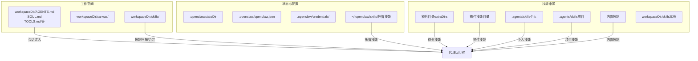
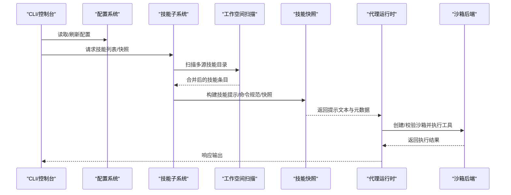
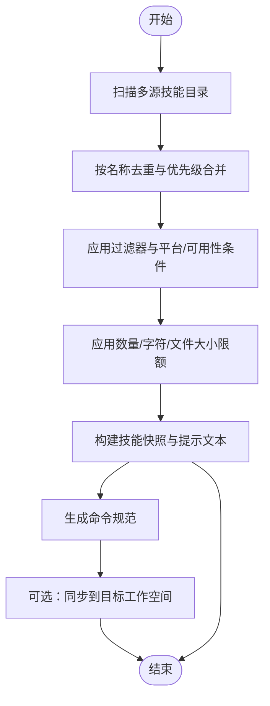
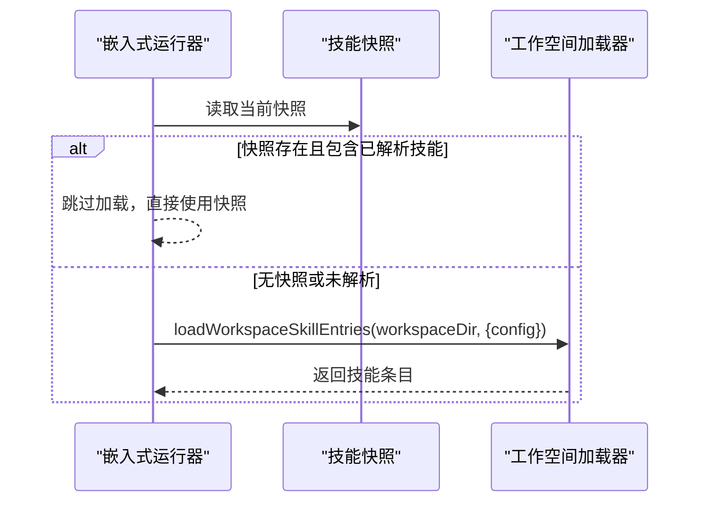
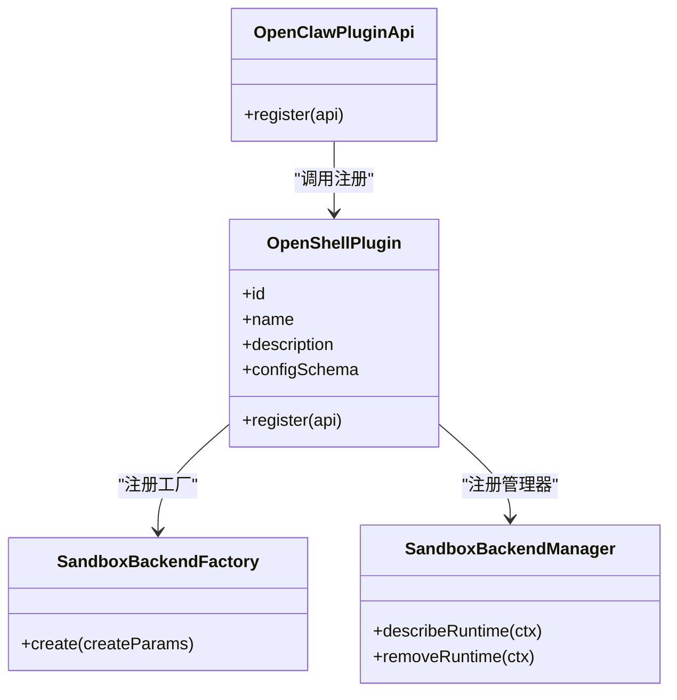
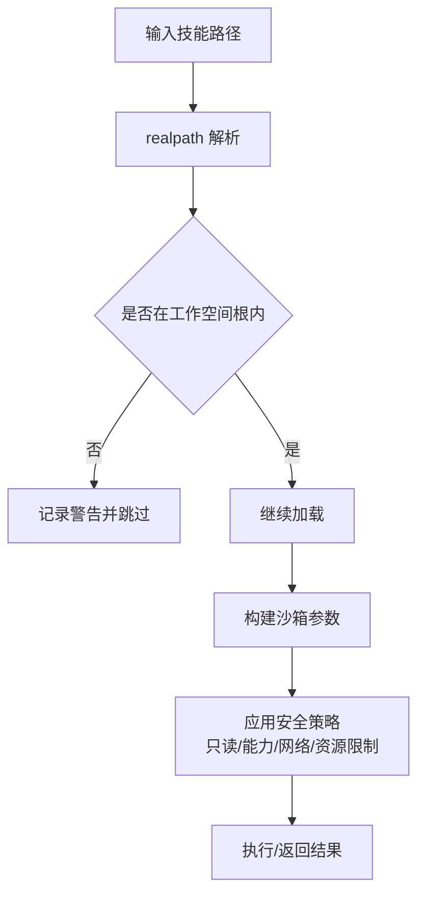
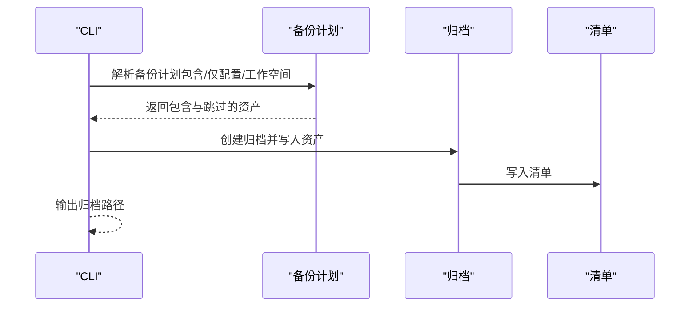
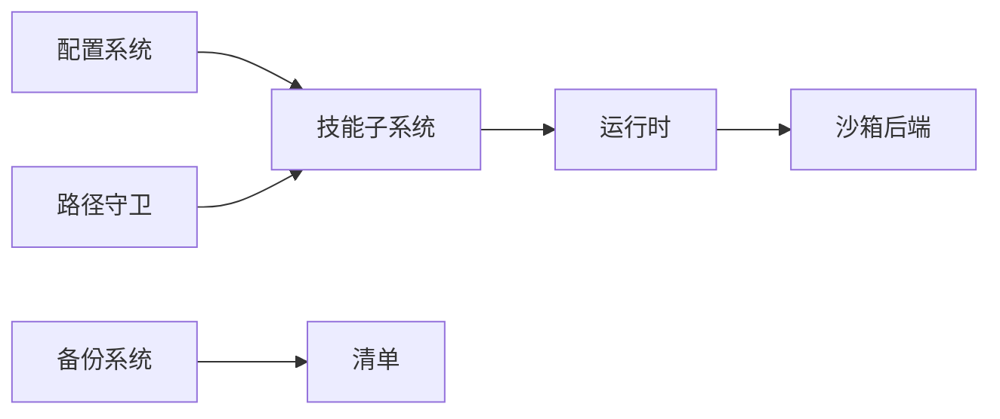

# 代理工作空间与技能系统

<cite>
**本文引用的文件**
- [agent-workspace.md](file://docs/concepts/agent-workspace.md)
- [skills.ts](file://src/agents/skills.ts)
- [workspace.ts](file://src/agents/skills/workspace.ts)
- [types.ts](file://src/agents/skills/types.ts)
- [refresh.ts](file://src/agents/skills/refresh.ts)
- [skills-runtime.ts](file://src/agents/pi-embedded-runner/skills-runtime.ts)
- [config.ts](file://src/config/config.ts)
- [pi-tools.read.ts](file://src/agents/pi-tools.read.ts)
- [docker.ts](file://src/agents/sandbox/docker.ts)
- [validate-sandbox-security.ts](file://src/agents/sandbox/validate-sandbox-security.ts)
- [backup-shared.ts](file://src/commands/backup-shared.ts)
- [backup-create.ts](file://src/infra/backup-create.ts)
- [index.ts](file://src/plugin-sdk/index.ts)
- [backend.ts](file://extensions/openshell/src/backend.ts)
- [index.ts](file://extensions/openshell/index.ts)
- [audit-extra.async.ts](file://src/security/audit-extra.async.ts)
- [fix.ts](file://src/security/fix.ts)
- [doctor-state-integrity.ts](file://src/commands/doctor-state-integrity.ts)
</cite>

## 目录
1. [简介](#简介)
2. [项目结构](#项目结构)
3. [核心组件](#核心组件)
4. [架构总览](#架构总览)
5. [详细组件分析](#详细组件分析)
6. [依赖关系分析](#依赖关系分析)
7. [性能考量](#性能考量)
8. [故障排查指南](#故障排查指南)
9. [结论](#结论)
10. [附录](#附录)

## 简介
本文件面向 Pi Agent 工作空间与技能系统的开发者与运维人员，系统性阐述工作空间的组织结构、文件系统布局与访问权限控制；技能加载机制、动态模块注入与依赖管理策略；工作空间隔离、安全边界与资源限制实现；技能开发框架、API 规范与测试方法；以及工作空间备份、恢复与迁移机制。文档同时提供配置示例、目录结构图与开发指南，帮助读者快速上手并安全可靠地扩展与维护系统。

## 项目结构
Pi Agent 将“工作空间”与“状态/配置/凭据”分离，工作空间用于存放代理的上下文与技能，状态与配置位于用户主目录下的专用目录。技能来源包括内置、托管、个人与项目级、工作空间本地等多层级，最终合并去重并按优先级覆盖。

图表来源
- [workspace.ts:1-800](file://src/agents/skills/workspace.ts#L1-L800)
- [agent-workspace.md:1-237](file://docs/concepts/agent-workspace.md#L1-L237)

章节来源
- [agent-workspace.md:1-237](file://docs/concepts/agent-workspace.md#L1-L237)
- [workspace.ts:1-800](file://src/agents/skills/workspace.ts#L1-L800)

## 核心组件
- 工作空间与技能加载
  - 加载入口与导出：统一导出技能类型、配置解析、环境覆盖、工作空间快照构建、命令规范生成与同步等能力。
  - 技能扫描与合并：从多源目录扫描技能，按名称去重并按优先级覆盖，支持过滤、限额与路径安全校验。
  - 快照与提示：构建技能提示文本、命令规范与快照，支持按需截断与远程说明注入。
- 配置与运行时
  - 配置 IO 与验证：提供配置读写、缓存、快照与校验接口。
  - 运行时 API：通过插件 SDK 暴露运行时能力，包括运行时存储、通道配置、Webhook 注册、SSRF 与限流等。
- 安全与隔离
  - 路径安全：严格限制技能路径不得逃逸工作空间根，对符号链接与真实路径进行校验。
  - 沙箱安全：构建容器时强制安全参数（只读根、丢弃全部能力、限制网络、资源限制、seccomp/apparmor 等）。
  - 权限审计与修复：对状态目录、凭据文件等进行权限检查与修复建议。
- 备份与迁移
  - 备份计划：自动识别状态、配置、凭据与工作空间，去重并生成清单。
  - 恢复与验证：创建归档并包含清单，支持验证与提取。

章节来源
- [skills.ts:1-47](file://src/agents/skills.ts#L1-L47)
- [types.ts:1-90](file://src/agents/skills/types.ts#L1-L90)
- [config.ts:1-29](file://src/config/config.ts#L1-L29)
- [index.ts:1-800](file://src/plugin-sdk/index.ts#L1-L800)

## 架构总览
下图展示工作空间与技能系统在代理运行时中的关键交互：工作空间扫描与合并、技能快照构建、提示注入、以及与插件生态和沙箱执行的衔接。

图表来源
- [workspace.ts:567-800](file://src/agents/skills/workspace.ts#L567-L800)
- [skills-runtime.ts:1-19](file://src/agents/pi-embedded-runner/skills-runtime.ts#L1-L19)
- [docker.ts:317-344](file://src/agents/sandbox/docker.ts#L317-L344)

## 详细组件分析

### 组件一：工作空间与技能加载
- 多源扫描与合并
  - 支持内置、额外目录、插件技能、托管、个人与项目级、工作空间本地等多源。
  - 合并策略：按名称去重，优先级由低到高依次覆盖，确保工作空间本地技能优先。
  - 路径安全：对每个候选技能目录与文件进行 realpath 校验，拒绝逃逸工作空间根的路径。
- 限额与截断
  - 对候选数量、单源加载数量、提示字符数与单文件大小设置上限，防止资源滥用。
  - 提示文本按字符预算二分搜索截断，并给出“已截断”提示。
- 快照与命令规范
  - 构建技能快照（含技能名、所需环境、版本等），支持按需过滤与保留。
  - 生成命令规范，保证命令名唯一、长度与描述合规。
- 同步至沙箱
  - 提供将技能复制到目标工作空间的能力，使用安全路径解析与去重命名，避免冲突。

图表来源
- [workspace.ts:292-527](file://src/agents/skills/workspace.ts#L292-L527)
- [workspace.ts:567-800](file://src/agents/skills/workspace.ts#L567-L800)

章节来源
- [workspace.ts:1-800](file://src/agents/skills/workspace.ts#L1-L800)
- [types.ts:1-90](file://src/agents/skills/types.ts#L1-L90)

### 组件二：技能加载与运行时集成
- 嵌入式运行时技能条目解析
  - 若存在技能快照且包含已解析技能，则跳过再次加载；否则从工作空间加载技能条目。
- 监视与热更新
  - 基于配置启用/禁用监视与去抖动，自动重建技能条目与快照，支持多路径组合键缓存。

图表来源
- [skills-runtime.ts:1-19](file://src/agents/pi-embedded-runner/skills-runtime.ts#L1-L19)
- [refresh.ts:124-167](file://src/agents/skills/refresh.ts#L124-L167)

章节来源
- [skills-runtime.ts:1-19](file://src/agents/pi-embedded-runner/skills-runtime.ts#L1-L19)
- [refresh.ts:124-167](file://src/agents/skills/refresh.ts#L124-L167)

### 组件三：插件生态与动态注入
- 插件 SDK
  - 暴露运行时 API、HTTP 路由注册、Webhook 目标解析、SSRF 与限流、运行时存储等能力。
- 沙箱后端注册
  - 插件可注册自定义沙箱后端工厂与管理器，统一由运行时管理与恢复。
- 示例：OpenShell 沙箱后端
  - 提供后端工厂与管理器，支持描述运行时状态与删除运行时。

图表来源
- [index.ts:1-800](file://src/plugin-sdk/index.ts#L1-L800)
- [index.ts:1-30](file://extensions/openshell/index.ts#L1-L30)
- [backend.ts:46-87](file://extensions/openshell/src/backend.ts#L46-L87)

章节来源
- [index.ts:1-800](file://src/plugin-sdk/index.ts#L1-L800)
- [index.ts:1-30](file://extensions/openshell/index.ts#L1-L30)
- [backend.ts:46-87](file://extensions/openshell/src/backend.ts#L46-L87)

### 组件四：安全边界与资源限制
- 路径安全与越界拦截
  - 对技能目录与文件进行 realpath 校验，若逃逸工作空间根则记录警告并跳过。
  - 对符号链接进行安全解析，忽略损坏链接。
- 沙箱安全参数
  - 强制只读根文件系统、丢弃全部 Linux 能力、限制网络模式、设置 CPU/内存/PIDs/ulimit 等资源限制。
  - 支持 seccomp/apparmor 策略与 DNS/hosts 注入。
- 权限审计与修复
  - 对状态目录、凭据文件等进行权限检查，提供修复建议与批量 chmod 操作。
  - 医生命令可检测缺失目录与不可写目录并引导修复。

图表来源
- [workspace.ts:179-247](file://src/agents/skills/workspace.ts#L179-L247)
- [validate-sandbox-security.ts:272-306](file://src/agents/sandbox/validate-sandbox-security.ts#L272-L306)
- [docker.ts:317-344](file://src/agents/sandbox/docker.ts#L317-L344)
- [pi-tools.read.ts:773-810](file://src/agents/pi-tools.read.ts#L773-L810)

章节来源
- [workspace.ts:179-247](file://src/agents/skills/workspace.ts#L179-L247)
- [validate-sandbox-security.ts:272-306](file://src/agents/sandbox/validate-sandbox-security.ts#L272-L306)
- [docker.ts:317-344](file://src/agents/sandbox/docker.ts#L317-L344)
- [pi-tools.read.ts:773-810](file://src/agents/pi-tools.read.ts#L773-L810)
- [audit-extra.async.ts:949-981](file://src/security/audit-extra.async.ts#L949-L981)
- [fix.ts:319-355](file://src/security/fix.ts#L319-L355)
- [doctor-state-integrity.ts:637-677](file://src/commands/doctor-state-integrity.ts#L637-L677)

### 组件五：备份、恢复与迁移
- 备份计划
  - 自动识别状态、配置、凭据与工作空间，去重并生成清单；支持仅备份配置或包含工作空间。
- 归档与清单
  - 创建 tar.gz 归档并包含备份清单，记录选项、路径与资产信息。
- 验证与提取
  - 支持验证归档完整性与定位清单，便于后续恢复。

图表来源
- [backup-shared.ts:106-211](file://src/commands/backup-shared.ts#L106-L211)
- [backup-create.ts:190-231](file://src/infra/backup-create.ts#L190-L231)

章节来源
- [backup-shared.ts:1-211](file://src/commands/backup-shared.ts#L1-L211)
- [backup-create.ts:190-231](file://src/infra/backup-create.ts#L190-L231)

## 依赖关系分析
- 组件耦合
  - 技能子系统依赖配置系统与路径守卫，确保加载过程受配置与安全策略约束。
  - 沙箱后端通过插件 SDK 注册，运行时统一管理，降低耦合度。
- 外部依赖
  - 技能扫描依赖外部技能库；备份依赖系统文件操作与压缩工具；沙箱依赖容器运行时与安全策略。
- 循环依赖
  - 未发现循环依赖迹象；各模块职责清晰，接口稳定。

图表来源
- [config.ts:1-29](file://src/config/config.ts#L1-L29)
- [workspace.ts:1-34](file://src/agents/skills/workspace.ts#L1-L34)
- [index.ts:1-800](file://src/plugin-sdk/index.ts#L1-L800)
- [backup-create.ts:190-231](file://src/infra/backup-create.ts#L190-L231)

章节来源
- [config.ts:1-29](file://src/config/config.ts#L1-L29)
- [workspace.ts:1-34](file://src/agents/skills/workspace.ts#L1-L34)
- [index.ts:1-800](file://src/plugin-sdk/index.ts#L1-L800)
- [backup-create.ts:190-231](file://src/infra/backup-create.ts#L190-L231)

## 性能考量
- 技能扫描限额
  - 候选数量、单源加载数量、提示字符数与单文件大小均有上限，避免大规模扫描导致延迟与资源占用。
- 截断策略
  - 提示文本按字符预算二分搜索截断，减少模型上下文开销。
- 监视与去抖动
  - 可配置监视与去抖动参数，平衡热更新频率与系统负载。
- 沙箱资源限制
  - 通过 CPU/内存/PIDs/ulimit 等限制，防止单个任务过度消耗宿主机资源。

章节来源
- [workspace.ts:139-149](file://src/agents/skills/workspace.ts#L139-L149)
- [workspace.ts:529-565](file://src/agents/skills/workspace.ts#L529-L565)
- [refresh.ts:132-167](file://src/agents/skills/refresh.ts#L132-L167)
- [docker.ts:317-344](file://src/agents/sandbox/docker.ts#L317-L344)

## 故障排查指南
- 路径逃逸与越界
  - 若出现“跳过技能路径…逃逸工作空间根”的警告，检查符号链接与真实路径，确保技能目录位于工作空间根内。
- 权限问题
  - 使用医生命令检查状态目录与凭据文件权限，必要时按提示修复；对不可写目录进行 chmod。
- 沙箱网络与安全
  - 禁止使用 host 网络模式与容器命名空间加入；如确需例外，需显式配置危险开关并充分信任运行时。
- 备份与恢复
  - 验证归档完整性与清单位置；确认包含/跳过的资产符合预期；恢复后检查工作空间与状态目录一致性。

章节来源
- [workspace.ts:179-247](file://src/agents/skills/workspace.ts#L179-L247)
- [doctor-state-integrity.ts:637-677](file://src/commands/doctor-state-integrity.ts#L637-L677)
- [validate-sandbox-security.ts:283-306](file://src/agents/sandbox/validate-sandbox-security.ts#L283-L306)
- [backup-create.ts:190-231](file://src/infra/backup-create.ts#L190-L231)

## 结论
Pi Agent 的工作空间与技能系统通过“多源扫描—合并去重—安全校验—限额截断—快照与命令规范—沙箱执行”的完整链路，实现了可扩展、可审计、可迁移的代理工作区。配合严格的路径安全与沙箱安全策略，以及完善的备份与恢复流程，能够在保障安全的前提下高效支撑技能开发与运行。

## 附录

### A. 工作空间文件布局与含义
- 标准文件
  - AGENTS.md、SOUL.md、TOOLS.md、USER.md、IDENTITY.md、HEARTBEAT.md、BOOT.md、BOOTSTRAP.md
  - daily memory 日志：memory/YYYY-MM-DD.md
  - 可选长期记忆：MEMORY.md
- 技能与画布
  - skills/：工作空间技能（优先级最高）
  - canvas/：节点显示 UI 文件
- 不在工作空间内的内容
  - ~/.openclaw/openclaw.json（配置）、credentials/（凭据）、agents/<agentId>/sessions/（会话）

章节来源
- [agent-workspace.md:64-137](file://docs/concepts/agent-workspace.md#L64-L137)

### B. 技能开发框架与 API 规范
- 技能元数据与调用策略
  - 元数据字段：always、primaryEnv、emoji、homepage、os、requires（bins/env/config）、install 规范。
  - 调用策略：userInvocable 控制是否允许用户触发；disableModelInvocation 控制是否允许模型自动调用。
- 命令规范
  - 命令名长度与合法性校验；唯一性冲突处理；描述长度限制。
- 运行时 API
  - 插件 SDK 暴露运行时能力（运行时存储、Webhook、SSRF 与限流、通道配置等），插件通过注册接口接入。

章节来源
- [types.ts:19-57](file://src/agents/skills/types.ts#L19-L57)
- [types.ts:59-90](file://src/agents/skills/types.ts#L59-L90)
- [index.ts:1-800](file://src/plugin-sdk/index.ts#L1-L800)

### C. 配置示例与最佳实践
- 工作空间位置
  - 默认：~/.openclaw/workspace；可通过 OPENCLAW_PROFILE 切换后缀；在配置中显式指定。
- 技能加载与监视
  - 可配置 extraDirs、watch 与去抖动时间；合理设置限额以平衡性能与功能。
- 沙箱安全
  - 禁止 host 网络与容器命名空间加入；启用只读根、丢弃能力、资源限制与安全策略。
- 备份策略
  - 建议将工作空间放入私有 Git 仓库；使用备份命令包含/排除工作空间，定期验证归档。

章节来源
- [agent-workspace.md:24-62](file://docs/concepts/agent-workspace.md#L24-L62)
- [refresh.ts:132-167](file://src/agents/skills/refresh.ts#L132-L167)
- [docker.ts:317-344](file://src/agents/sandbox/docker.ts#L317-L344)
- [backup-shared.ts:106-211](file://src/commands/backup-shared.ts#L106-L211)