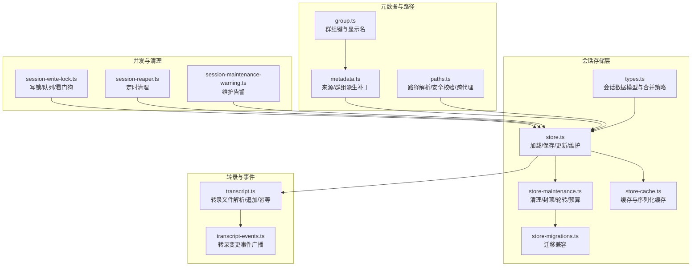
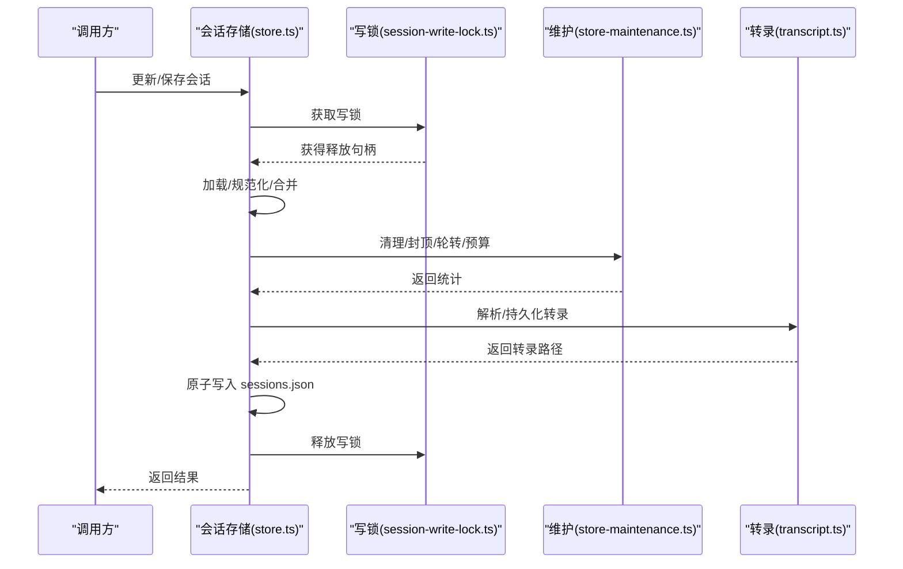
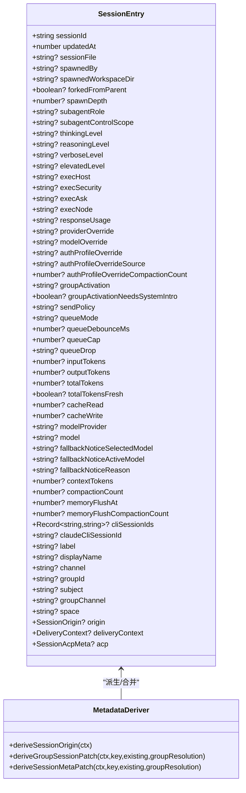
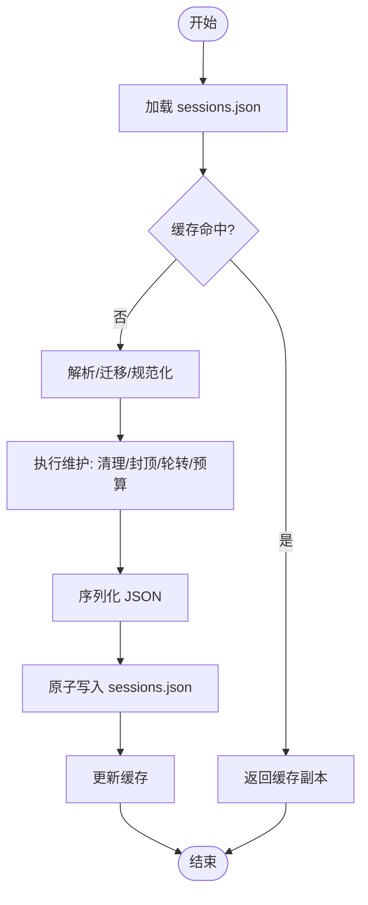
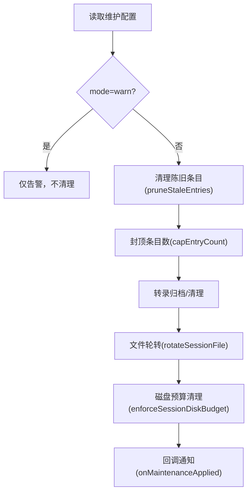
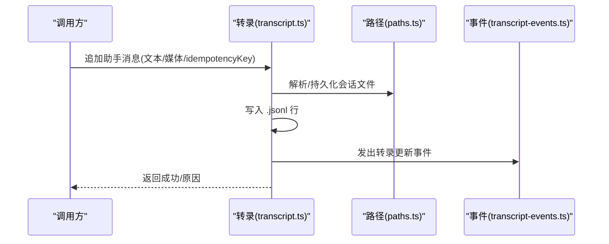
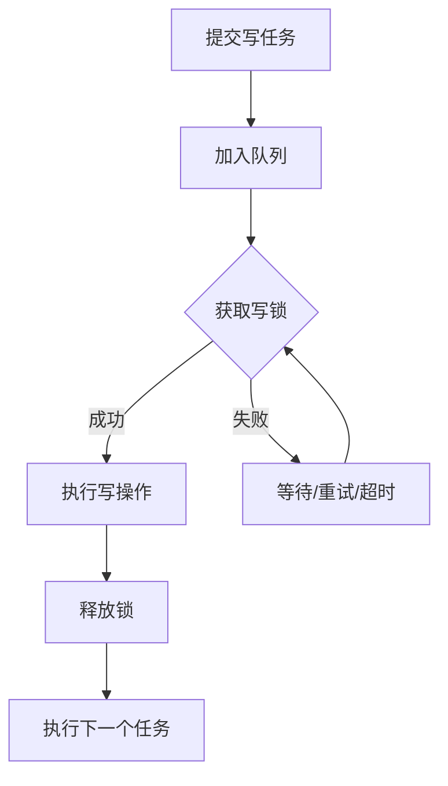
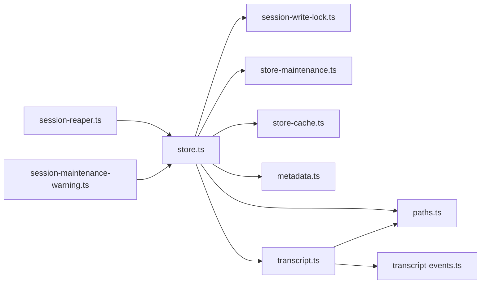
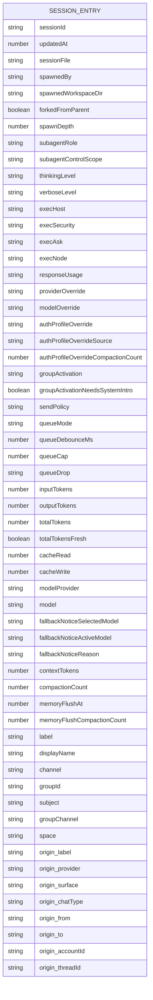

# 会话管理与状态维护

<cite>
**本文档引用的文件**
- [src/config/sessions/types.ts](file://src/config/sessions/types.ts)
- [src/config/sessions/store.ts](file://src/config/sessions/store.ts)
- [src/config/sessions/store-cache.ts](file://src/config/sessions/store-cache.ts)
- [src/config/sessions/store-maintenance.ts](file://src/config/sessions/store-maintenance.ts)
- [src/config/sessions/store-migrations.ts](file://src/config/sessions/store-migrations.ts)
- [src/config/sessions/transcript.ts](file://src/config/sessions/transcript.ts)
- [src/config/sessions/metadata.ts](file://src/config/sessions/metadata.ts)
- [src/config/sessions/paths.ts](file://src/config/sessions/paths.ts)
- [src/config/sessions/group.ts](file://src/config/sessions/group.ts)
- [src/agents/session-write-lock.ts](file://src/agents/session-write-lock.ts)
- [src/infra/session-maintenance-warning.ts](file://src/infra/session-maintenance-warning.ts)
- [src/cron/session-reaper.ts](file://src/cron/session-reaper.ts)
- [src/sessions/transcript-events.ts](file://src/sessions/transcript-events.ts)
- [apps/macos/Sources/OpenClaw/SessionActions.swift](file://apps/macos/Sources/OpenClaw/SessionActions.swift)
- [ui/src/ui/controllers/sessions.ts](file://ui/src/ui/controllers/sessions.ts)
- [docs/gateway/configuration-reference.md](file://docs/gateway/configuration-reference.md)
</cite>

## 目录
1. [简介](#简介)
2. [项目结构](#项目结构)
3. [核心组件](#核心组件)
4. [架构总览](#架构总览)
5. [详细组件分析](#详细组件分析)
6. [依赖关系分析](#依赖关系分析)
7. [性能考量](#性能考量)
8. [故障排除指南](#故障排除指南)
9. [结论](#结论)
10. [附录](#附录)

## 简介
本文件面向 Pi Agent 的会话管理与状态维护系统，系统性阐述会话的创建、维护、持久化与清理机制；详解会话状态存储格式、数据结构设计与访问模式；覆盖会话历史记录管理、消息转录处理与状态同步策略；并提供会话配置选项、性能优化技巧与数据完整性保障方案，解释会话隔离机制、并发访问控制与冲突解决策略。文档同时给出具体配置示例、数据模型图与故障排除指南，帮助开发者与运维人员高效理解与使用该系统。

## 项目结构
围绕会话管理的关键模块分布如下：
- 类型定义与合并策略：types.ts
- 会话存储与缓存：store.ts、store-cache.ts
- 维护与清理策略：store-maintenance.ts、store-migrations.ts
- 转录与消息处理：transcript.ts、transcript-events.ts
- 元数据与分组：metadata.ts、group.ts
- 路径解析与隔离：paths.ts
- 并发写锁与队列：session-write-lock.ts
- 配置参考与策略：configuration-reference.md
- 客户端与 UI 控制器：SessionActions.swift、sessions.ts

**图表来源**
- [src/config/sessions/types.ts:68-174](file://src/config/sessions/types.ts#L68-L174)
- [src/config/sessions/store.ts:195-270](file://src/config/sessions/store.ts#L195-L270)
- [src/config/sessions/store-cache.ts:41-81](file://src/config/sessions/store-cache.ts#L41-L81)
- [src/config/sessions/store-maintenance.ts:130-148](file://src/config/sessions/store-maintenance.ts#L130-L148)
- [src/config/sessions/store-migrations.ts:3-27](file://src/config/sessions/store-migrations.ts#L3-L27)
- [src/config/sessions/transcript.ts:88-131](file://src/config/sessions/transcript.ts#L88-L131)
- [src/sessions/transcript-events.ts:1-29](file://src/sessions/transcript-events.ts#L1-L29)
- [src/config/sessions/metadata.ts:153-172](file://src/config/sessions/metadata.ts#L153-L172)
- [src/config/sessions/group.ts:54-107](file://src/config/sessions/group.ts#L54-L107)
- [src/config/sessions/paths.ts:33-35](file://src/config/sessions/paths.ts#L33-L35)
- [src/agents/session-write-lock.ts:444-553](file://src/agents/session-write-lock.ts#L444-L553)
- [src/cron/session-reaper.ts:81-109](file://src/cron/session-reaper.ts#L81-L109)
- [src/infra/session-maintenance-warning.ts:59-73](file://src/infra/session-maintenance-warning.ts#L59-L73)

**章节来源**
- [src/config/sessions/store.ts:195-270](file://src/config/sessions/store.ts#L195-L270)
- [src/config/sessions/store-maintenance.ts:130-148](file://src/config/sessions/store-maintenance.ts#L130-L148)
- [src/config/sessions/transcript.ts:88-131](file://src/config/sessions/transcript.ts#L88-L131)
- [src/config/sessions/paths.ts:33-35](file://src/config/sessions/paths.ts#L33-L35)

## 核心组件
- 会话条目（SessionEntry）：承载会话运行时状态、上下文、令牌用量、执行选项、ACP 元信息等字段，支持按策略合并与规范化。
- 会话存储（sessions.json）：以键值对形式存储各会话条目，支持 TTL 缓存、序列化缓存、文件轮转与磁盘预算清理。
- 写锁与队列：基于文件锁与任务队列实现并发写入串行化，避免竞态与损坏。
- 维护策略：按时间阈值清理陈旧条目、按数量封顶、按大小轮转、按磁盘预算清理。
- 转录文件（.jsonl）：按行存储消息，支持幂等键去重、头文件版本化、镜像文本生成。
- 元数据与分组：从消息上下文推导来源、群组键、显示名，并在会话条目中持久化。

**章节来源**
- [src/config/sessions/types.ts:68-174](file://src/config/sessions/types.ts#L68-L174)
- [src/config/sessions/store.ts:195-270](file://src/config/sessions/store.ts#L195-L270)
- [src/agents/session-write-lock.ts:444-553](file://src/agents/session-write-lock.ts#L444-L553)
- [src/config/sessions/store-maintenance.ts:155-174](file://src/config/sessions/store-maintenance.ts#L155-L174)

## 架构总览
Pi Agent 的会话管理采用“存储中心 + 转录旁路 + 并发控制”的架构：
- 存储中心：以 sessions.json 为中心，集中管理会话元数据与状态。
- 转录旁路：每个会话对应一个独立的 .jsonl 转录文件，便于增量追加与历史归档。
- 并发控制：通过写锁与队列确保同一时间只有一个写操作进行，避免竞态。
- 维护策略：在写入前或写入后执行清理、封顶、轮转与磁盘预算清理，保持系统健康。

**图表来源**
- [src/config/sessions/store.ts:511-533](file://src/config/sessions/store.ts#L511-L533)
- [src/agents/session-write-lock.ts:444-553](file://src/agents/session-write-lock.ts#L444-L553)
- [src/config/sessions/store-maintenance.ts:340-455](file://src/config/sessions/store-maintenance.ts#L340-L455)
- [src/config/sessions/transcript.ts:133-218](file://src/config/sessions/transcript.ts#L133-L218)

## 详细组件分析

### 数据模型与合并策略
- SessionEntry 字段覆盖会话运行期关键状态：活动时间戳、会话标识、转录文件路径、派生/控制参数、执行与模型配置、令牌用量、ACP 元信息等。
- 合并策略：
  - 默认合并：以“触摸活动”方式更新 updatedAt。
  - 保留活动合并：当仅更新非活动字段时，保留现有 updatedAt。
  - 规范化：对模型提供者与模型名称进行空白裁剪与去空。
- 运行时模型设置：提供原子设置接口，确保提供者与模型一致性。

**图表来源**
- [src/config/sessions/types.ts:68-174](file://src/config/sessions/types.ts#L68-L174)
- [src/config/sessions/metadata.ts:153-172](file://src/config/sessions/metadata.ts#L153-L172)

**章节来源**
- [src/config/sessions/types.ts:253-291](file://src/config/sessions/types.ts#L253-L291)
- [src/config/sessions/metadata.ts:45-87](file://src/config/sessions/metadata.ts#L45-L87)

### 会话存储与缓存
- 加载流程：优先命中 TTL 缓存；未命中则从磁盘读取，解析 JSON，应用迁移，规范化，再写入缓存。
- 保存流程：在写入前执行维护（清理/封顶/轮转/预算），然后原子写入 sessions.json，并更新缓存。
- 缓存策略：对象缓存（带 mtime/size 校验）与序列化缓存（避免重复序列化）。
- 锁队列：同一 storePath 的并发写入通过队列串行化，超时与过期保护由写锁与看门狗共同保障。

**图表来源**
- [src/config/sessions/store.ts:195-270](file://src/config/sessions/store.ts#L195-L270)
- [src/config/sessions/store.ts:340-509](file://src/config/sessions/store.ts#L340-L509)
- [src/config/sessions/store-cache.ts:41-81](file://src/config/sessions/store-cache.ts#L41-L81)

**章节来源**
- [src/config/sessions/store.ts:195-270](file://src/config/sessions/store.ts#L195-L270)
- [src/config/sessions/store-cache.ts:41-81](file://src/config/sessions/store-cache.ts#L41-L81)
- [src/agents/session-write-lock.ts:695-727](file://src/agents/session-write-lock.ts#L695-L727)

### 维护与清理策略
- 清理陈旧条目：基于 updatedAt 与配置的 pruneAfterMs。
- 封顶条目数量：保留最近更新的 N 条。
- 文件轮转：超过 rotateBytes 自动备份并重命名。
- 磁盘预算清理：按 maxDiskBytes 与 highWaterBytes 执行清理，优先删除最旧内容。
- 警告模式：在 enforce 模式下才真正清理，warn 模式仅发出告警。

**图表来源**
- [src/config/sessions/store-maintenance.ts:155-174](file://src/config/sessions/store-maintenance.ts#L155-L174)
- [src/config/sessions/store-maintenance.ts:226-259](file://src/config/sessions/store-maintenance.ts#L226-L259)
- [src/config/sessions/store-maintenance.ts:275-327](file://src/config/sessions/store-maintenance.ts#L275-L327)
- [src/config/sessions/store.ts:340-455](file://src/config/sessions/store.ts#L340-L455)

**章节来源**
- [src/config/sessions/store-maintenance.ts:130-148](file://src/config/sessions/store-maintenance.ts#L130-L148)
- [src/config/sessions/store.ts:353-455](file://src/config/sessions/store.ts#L353-L455)
- [src/infra/session-maintenance-warning.ts:59-73](file://src/infra/session-maintenance-warning.ts#L59-L73)

### 转录处理与幂等
- 转录文件解析：根据会话键解析/持久化转录文件路径，确保头文件存在。
- 追加助手消息：镜像文本/媒体名，写入 .jsonl 行，支持 idempotencyKey 去重。
- 事件广播：每次转录更新触发全局事件，供 UI 或其他组件订阅。

**图表来源**
- [src/config/sessions/transcript.ts:133-218](file://src/config/sessions/transcript.ts#L133-L218)
- [src/config/sessions/paths.ts:254-277](file://src/config/sessions/paths.ts#L254-L277)
- [src/sessions/transcript-events.ts:16-29](file://src/sessions/transcript-events.ts#L16-L29)

**章节来源**
- [src/config/sessions/transcript.ts:133-218](file://src/config/sessions/transcript.ts#L133-L218)
- [src/sessions/transcript-events.ts:1-29](file://src/sessions/transcript-events.ts#L1-L29)

### 并发访问控制与冲突解决
- 写锁：基于文件锁与进程元数据（PID/starttime）检测死锁/回收锁，支持看门狗自动释放长时间占用的锁。
- 队列串行化：同一 storePath 的写请求进入队列，逐个执行，避免竞态。
- 冲突解决：超时抛错；允许孤儿自锁回收；严格路径约束防止越权访问。

**图表来源**
- [src/agents/session-write-lock.ts:444-553](file://src/agents/session-write-lock.ts#L444-L553)
- [src/config/sessions/store.ts:695-727](file://src/config/sessions/store.ts#L695-L727)

**章节来源**
- [src/agents/session-write-lock.ts:444-553](file://src/agents/session-write-lock.ts#L444-L553)
- [src/config/sessions/store.ts:695-727](file://src/config/sessions/store.ts#L695-L727)

### 会话隔离与路径安全
- 路径解析：严格限制会话文件必须位于 agents/<agentId>/sessions 下，支持相对路径与跨代理同根兼容。
- 会话 ID 校验：仅允许安全字符与长度范围。
- 多代理隔离：不同 agentId 对应不同 sessions 目录，避免交叉污染。

**章节来源**
- [src/config/sessions/paths.ts:60-68](file://src/config/sessions/paths.ts#L60-L68)
- [src/config/sessions/paths.ts:171-233](file://src/config/sessions/paths.ts#L171-L233)
- [src/config/sessions/paths.ts:314-329](file://src/config/sessions/paths.ts#L314-L329)

### 会话配置与策略
- 重置策略：按类型（direct/group/channel/thread）与空闲分钟数/每日重置时间决定重置时机。
- 维护策略：mode、pruneAfter、maxEntries、rotateBytes、resetArchiveRetention、maxDiskBytes、highWaterBytes。
- 群组绑定：线程绑定默认开关、空闲小时数、最大年龄小时数等。

**章节来源**
- [docs/gateway/configuration-reference.md:1599-1623](file://docs/gateway/configuration-reference.md#L1599-L1623)

## 依赖关系分析
- store.ts 依赖：
  - 写锁：确保并发安全
  - 维护：清理/封顶/轮转/预算
  - 缓存：对象与序列化缓存
  - 转录：解析/持久化
  - 元数据：来源/群组派生
  - 路径：解析/校验
- transcript.ts 依赖：
  - 路径解析与会话文件持久化
  - 事件广播
- session-write-lock.ts 依赖：
  - 进程存活检测、看门狗、信号处理

**图表来源**
- [src/config/sessions/store.ts:1-45](file://src/config/sessions/store.ts#L1-L45)
- [src/config/sessions/transcript.ts:1-15](file://src/config/sessions/transcript.ts#L1-L15)
- [src/agents/session-write-lock.ts:1-6](file://src/agents/session-write-lock.ts#L1-L6)

**章节来源**
- [src/config/sessions/store.ts:1-45](file://src/config/sessions/store.ts#L1-L45)
- [src/config/sessions/transcript.ts:1-15](file://src/config/sessions/transcript.ts#L1-L15)

## 性能考量
- 缓存策略：启用 TTL 缓存与序列化缓存，减少重复解析与序列化开销；Windows 上读取重试与共享内存等待提升稳定性。
- 维护时机：在写入前执行维护，避免文件过大与条目过多导致后续写入成本上升。
- 原子写入：使用原子写入与缓存更新，降低部分写入风险。
- 并发串行化：通过队列与写锁避免频繁竞争，提高吞吐稳定性。
- 磁盘预算：合理设置 maxDiskBytes 与 highWaterBytes，避免磁盘压力导致系统抖动。

[本节为通用指导，无需特定文件引用]

## 故障排除指南
- 会话存储锁超时：检查是否存在长时间占用的锁文件，确认进程是否异常退出；必要时清理过期锁。
- 会话维护警告：若处于 warn 模式，系统仅告警不清理；切换到 enforce 模式或调整维护阈值。
- 转录重复消息：确认 idempotencyKey 是否正确传递，避免重复追加。
- 路径越权访问：确保 sessionFile 在 agents/<agentId>/sessions 下，避免绝对路径越界。
- 定时清理无效：检查 cron 配置与运行环境，确认会话键前缀匹配与保留策略。

**章节来源**
- [src/agents/session-write-lock.ts:387-442](file://src/agents/session-write-lock.ts#L387-L442)
- [src/infra/session-maintenance-warning.ts:59-73](file://src/infra/session-maintenance-warning.ts#L59-L73)
- [src/config/sessions/transcript.ts:220-243](file://src/config/sessions/transcript.ts#L220-L243)
- [src/config/sessions/paths.ts:229-231](file://src/config/sessions/paths.ts#L229-L231)
- [src/cron/session-reaper.ts:81-109](file://src/cron/session-reaper.ts#L81-L109)

## 结论
Pi Agent 的会话管理通过“中心存储 + 转录旁路 + 并发控制 + 主动维护”的设计，在保证数据一致性与可维护性的前提下，兼顾了性能与可靠性。合理的配置与监控策略能够有效控制会话规模与磁盘占用，而严格的路径与并发控制确保了系统的安全性与稳定性。

[本节为总结，无需特定文件引用]

## 附录

### 配置示例（摘自配置参考）
- 重置策略：按类型与空闲分钟数/每日重置时间决定重置时机。
- 维护策略：mode、pruneAfter、maxEntries、rotateBytes、resetArchiveRetention、maxDiskBytes、highWaterBytes。
- 群组绑定：线程绑定默认开关、空闲小时数、最大年龄小时数。

**章节来源**
- [docs/gateway/configuration-reference.md:1599-1623](file://docs/gateway/configuration-reference.md#L1599-L1623)

### 数据模型图（会话条目字段概览）

**图表来源**
- [src/config/sessions/types.ts:68-174](file://src/config/sessions/types.ts#L68-L174)

### 会话操作与 UI 集成
- macOS 控制：支持 patch、reset、delete、compact 等会话操作。
- Web UI 控制：提供删除会话并刷新列表的交互流程。

**章节来源**
- [apps/macos/Sources/OpenClaw/SessionActions.swift:5-38](file://apps/macos/Sources/OpenClaw/SessionActions.swift#L5-L38)
- [ui/src/ui/controllers/sessions.ts:98-131](file://ui/src/ui/controllers/sessions.ts#L98-L131)