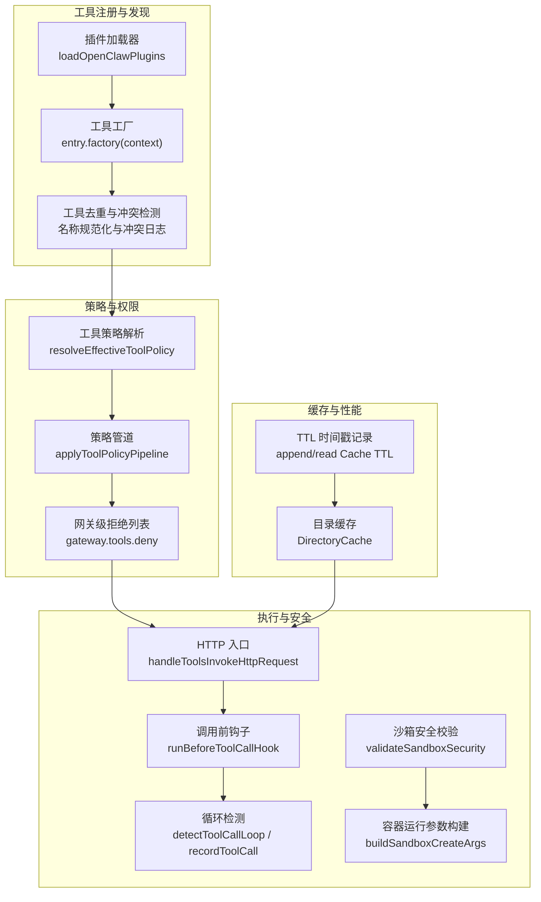
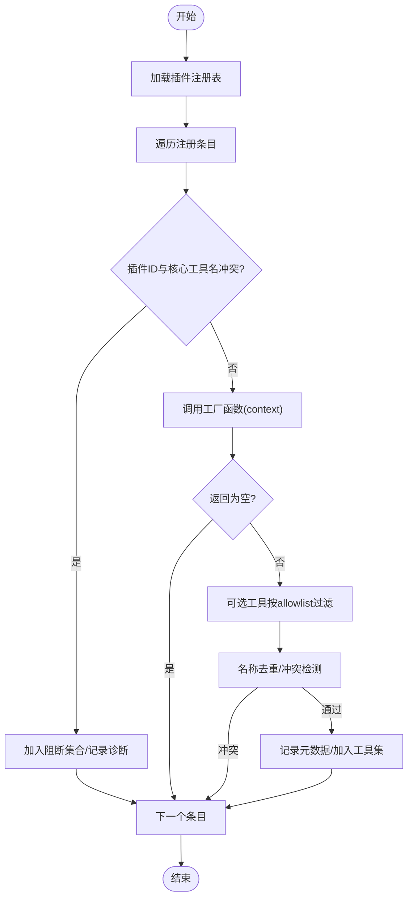
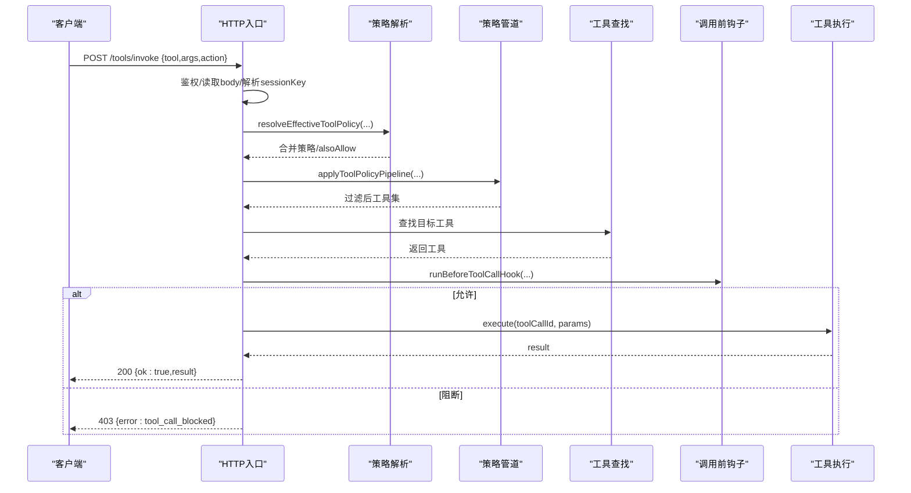
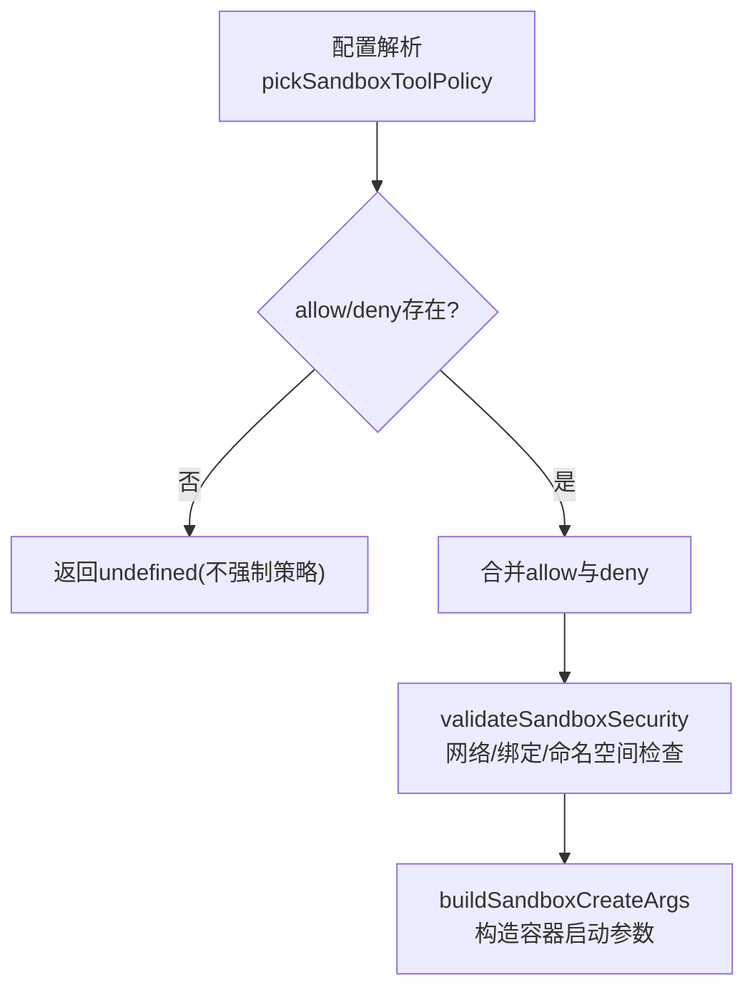
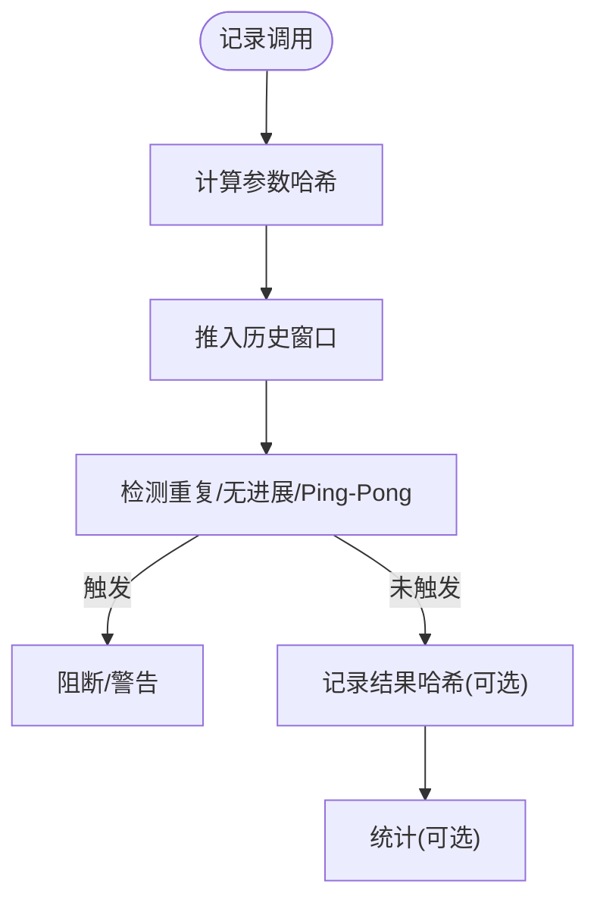
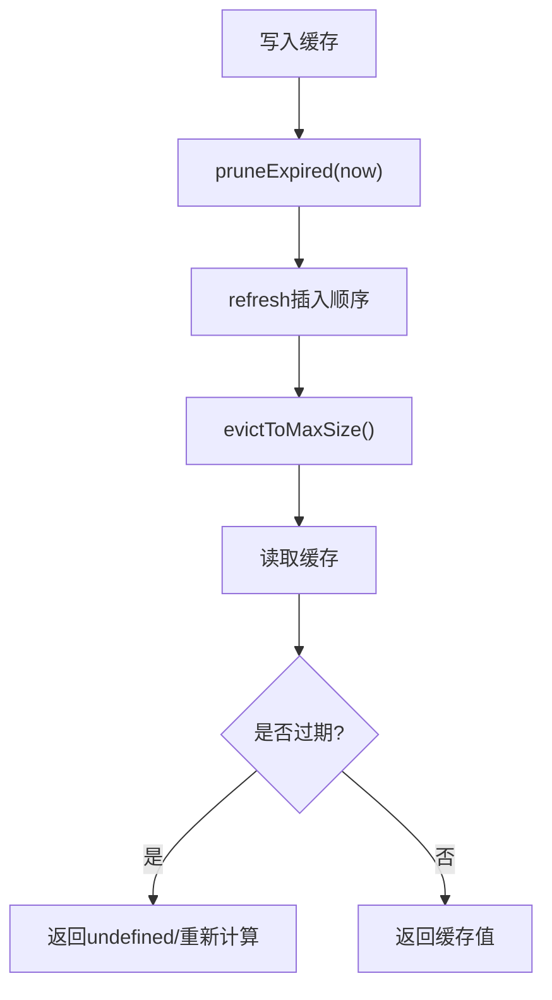
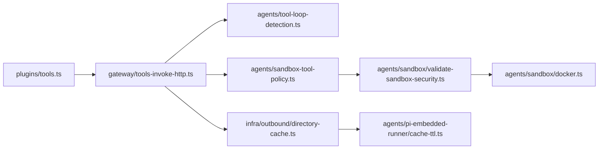

# 工具系统与调用协调

<cite>
**本文引用的文件**   
- [tools.ts](file://src/plugins/tools.ts)
- [tools-invoke-http.ts](file://src/gateway/tools-invoke-http.ts)
- [sandbox-tool-policy.ts](file://src/agents/sandbox-tool-policy.ts)
- [validate-sandbox-security.ts](file://src/agents/sandbox/validate-sandbox-security.ts)
- [docker.ts](file://src/agents/sandbox/docker.ts)
- [tool-loop-detection.ts](file://src/agents/tool-loop-detection.ts)
- [index.md](file://docs/tools/index.md)
- [exec.md](file://docs/tools/exec.md)
- [debugging.md](file://docs/help/debugging.md)
- [directory-cache.ts](file://src/infra/outbound/directory-cache.ts)
- [cache-ttl.ts](file://src/agents/pi-embedded-runner/cache-ttl.ts)
- [pi-tools-agent-config.test.ts](file://src/agents/pi-tools-agent-config.test.ts)
- [sandbox-explain.test.ts](file://src/agents/sandbox-explain.test.ts)
- [tool-factory-test-harness.ts](file://extensions/feishu/src/tool-factory-test-harness.ts)
- [openclaw-tools.owner-authorization.test.ts](file://src/agents/openclaw-tools.owner-authorization.test.ts)
</cite>

## 目录
1. [简介](#简介)
2. [项目结构](#项目结构)
3. [核心组件](#核心组件)
4. [架构总览](#架构总览)
5. [详细组件分析](#详细组件分析)
6. [依赖关系分析](#依赖关系分析)
7. [性能考量](#性能考量)
8. [故障排查指南](#故障排查指南)
9. [结论](#结论)
10. [附录](#附录)

## 简介
本文件面向 Pi Agent 的工具系统与调用协调机制，系统化阐述工具注册、发现、验证与执行的完整流程；详解工具调用协议、参数传递、结果处理与错误传播；覆盖工具安全策略、权限控制与沙箱隔离；提供工具开发指南、API 规范与最佳实践；解释工具缓存机制、性能优化与资源管理策略，并给出具体调用流程图与调试方法。

## 项目结构
Pi Agent 的工具系统由“核心工具 + 插件工具”构成，通过统一的工具注册与发现机制构建可用工具集，再经网关层进行策略过滤与调用执行。关键模块包括：
- 工具注册与发现：插件加载器与工具工厂，生成工具清单并去重与冲突检测
- 策略与权限：全局/代理/分组/提供方等多级策略叠加与管道过滤
- 执行与安全：HTTP 调用入口、循环检测、沙箱安全校验与容器运行时参数构建
- 缓存与性能：目录缓存与 TTL 记录，降低重复计算与 IO 开销
- 文档与示例：工具使用说明、执行工具配置、调试方法与测试夹具



图表来源
- [tools.ts:51-142](file://src/plugins/tools.ts#L51-L142)
- [tools-invoke-http.ts:250-360](file://src/gateway/tools-invoke-http.ts#L250-L360)
- [tool-loop-detection.ts:372-495](file://src/agents/tool-loop-detection.ts#L372-L495)
- [validate-sandbox-security.ts:283-306](file://src/agents/sandbox/validate-sandbox-security.ts#L283-L306)
- [docker.ts:317-344](file://src/agents/sandbox/docker.ts#L317-L344)
- [directory-cache.ts:44-98](file://src/infra/outbound/directory-cache.ts#L44-L98)
- [cache-ttl.ts:42-80](file://src/agents/pi-embedded-runner/cache-ttl.ts#L42-L80)

章节来源
- [tools.ts:1-143](file://src/plugins/tools.ts#L1-L143)
- [tools-invoke-http.ts:1-361](file://src/gateway/tools-invoke-http.ts#L1-L361)

## 核心组件
- 工具注册与发现
  - 插件工具解析：从插件注册表中按工厂函数产出工具，支持可选工具与允许白名单过滤，避免名称冲突与插件 ID 冲突
  - 工具元数据：记录插件来源与可选性，便于策略与诊断
- 策略与权限
  - 多级策略合并：全局、提供方、代理、分组、子代理等策略叠加，形成最终可用工具集
  - 网关级拒绝：对所有会话生效的工具黑名单
- 执行与安全
  - HTTP 入口：解析请求体、鉴权、参数合并、调用前钩子、执行与错误处理
  - 循环检测：基于调用历史与结果哈希的重复/无进展检测
  - 沙箱安全：网络模式、绑定源根路径、容器命名空间等安全校验
- 缓存与性能
  - 目录缓存：基于 TTL 与容量的 LRU 驱逐策略
  - TTL 时间戳：在会话管理器中记录与读取缓存 TTL

章节来源
- [tools.ts:45-142](file://src/plugins/tools.ts#L45-L142)
- [tools-invoke-http.ts:232-360](file://src/gateway/tools-invoke-http.ts#L232-L360)
- [tool-loop-detection.ts:106-230](file://src/agents/tool-loop-detection.ts#L106-L230)
- [validate-sandbox-security.ts:283-306](file://src/agents/sandbox/validate-sandbox-security.ts#L283-L306)
- [directory-cache.ts:44-98](file://src/infra/outbound/directory-cache.ts#L44-L98)
- [cache-ttl.ts:42-80](file://src/agents/pi-embedded-runner/cache-ttl.ts#L42-L80)

## 架构总览
下图展示从 HTTP 请求到工具执行与结果返回的关键路径，以及策略过滤与安全校验的插入点。

```mermaid
sequenceDiagram
participant Client as "客户端"
participant Gateway as "网关(HTTP)"
participant Policy as "策略解析/管道"
participant Loader as "工具加载"
participant Hook as "调用前钩子"
participant Tool as "目标工具"
participant Loop as "循环检测"
participant Sandbox as "沙箱校验"
Client->>Gateway : POST /tools/invoke {tool,args,sessionKey}
Gateway->>Gateway : 鉴权/读取请求体
Gateway->>Loader : createOpenClawTools(...)
Loader-->>Gateway : 工具列表
Gateway->>Policy : 合并策略/构建管道
Policy-->>Gateway : 过滤后的工具集合
Gateway->>Hook : runBeforeToolCallHook(toolName,params,ctx)
Hook-->>Gateway : 允许/阻断与参数调整
alt 允许
Gateway->>Tool : execute(toolCallId, params)
Tool-->>Gateway : 结果或错误
Gateway-->>Client : {ok,result}
else 阻断
Gateway-->>Client : 403 {error : tool_call_blocked}
end
Gateway->>Loop : 记录调用与结果(可选)
Gateway->>Sandbox : 安全校验(如涉及宿主/节点)
```

图表来源
- [tools-invoke-http.ts:136-360](file://src/gateway/tools-invoke-http.ts#L136-L360)
- [tool-loop-detection.ts:501-588](file://src/agents/tool-loop-detection.ts#L501-L588)
- [validate-sandbox-security.ts:283-306](file://src/agents/sandbox/validate-sandbox-security.ts#L283-L306)

## 详细组件分析

### 组件一：工具注册与发现（插件工具）
- 关键职责
  - 加载插件注册表，调用工厂函数产出工具
  - 名称规范化与冲突检测（插件 ID 与核心工具名冲突、工具名重复）
  - 可选工具按允许白名单过滤
  - 记录工具来源元数据，用于策略与诊断
- 数据结构与复杂度
  - 工具列表构建为 O(N)（N 为注册工具条目数），冲突检测与去重使用集合，平均 O(1)
  - 名称规范化与允许白名单查询均为 O(1) 均摊
- 错误处理
  - 工厂抛错或空返回将被跳过并记录诊断信息
  - 名称冲突与插件 ID 冲突会写入诊断日志并可选择性抑制冲突告警
- 性能优化
  - 在插件禁用或测试环境下快速短路，避免不必要的动态导入



图表来源
- [tools.ts:51-142](file://src/plugins/tools.ts#L51-L142)

章节来源
- [tools.ts:45-142](file://src/plugins/tools.ts#L45-L142)

### 组件二：工具调用协议与执行（HTTP 入口）
- 协议要点
  - 路径：POST /tools/invoke
  - 必填字段：tool（工具名）
  - 可选字段：action、args、sessionKey、dryRun
  - 参数合并：若工具 schema 支持 action，则自动将 body.action 注入 args
  - 会话键：支持 main 或自定义 sessionKey，默认解析为主会话键
- 权限与策略
  - 解析全局/提供方/代理/分组/子代理策略，合并 alsoAllow
  - 应用默认策略管道步骤与子代理工具限制
  - 网关级 deny 列表对所有会话生效
- 执行与错误处理
  - 调用前钩子：支持阻断与参数调整
  - 工具执行：await tool.execute(toolCallId, params)
  - 错误映射：ToolInputError 映射为 400/403，其他 500
- 结果处理
  - 成功：返回 {ok:true,result}
  - 失败：返回 {ok:false,error:{type,message}}



图表来源
- [tools-invoke-http.ts:136-360](file://src/gateway/tools-invoke-http.ts#L136-L360)

章节来源
- [tools-invoke-http.ts:136-360](file://src/gateway/tools-invoke-http.ts#L136-L360)

### 组件三：工具安全策略与沙箱隔离
- 策略合并
  - pickSandboxToolPolicy：支持 allow/alsoAllow/deny 合并，未提供时返回 undefined
  - 测试验证：优先级 agent > global > 默认；deny 优先于 allow
- 沙箱安全校验
  - 禁止 host 网络模式与容器命名空间连接
  - 绑定源路径策略：通过现有祖先路径解析并二次校验
- 容器运行参数
  - buildSandboxCreateArgs：在创建容器前执行安全校验，支持保留容器目标、允许外部绑定源等危险选项的显式开关



图表来源
- [sandbox-tool-policy.ts:21-37](file://src/agents/sandbox-tool-policy.ts#L21-L37)
- [validate-sandbox-security.ts:283-306](file://src/agents/sandbox/validate-sandbox-security.ts#L283-L306)
- [docker.ts:317-344](file://src/agents/sandbox/docker.ts#L317-L344)
- [pi-tools-agent-config.test.ts:570-611](file://src/agents/pi-tools-agent-config.test.ts#L570-L611)
- [sandbox-explain.test.ts:7-34](file://src/agents/sandbox-explain.test.ts#L7-L34)

章节来源
- [sandbox-tool-policy.ts:1-38](file://src/agents/sandbox-tool-policy.ts#L1-L38)
- [validate-sandbox-security.ts:283-306](file://src/agents/sandbox/validate-sandbox-security.ts#L283-L306)
- [docker.ts:317-344](file://src/agents/sandbox/docker.ts#L317-L344)
- [pi-tools-agent-config.test.ts:570-611](file://src/agents/pi-tools-agent-config.test.ts#L570-L611)
- [sandbox-explain.test.ts:7-34](file://src/agents/sandbox-explain.test.ts#L7-L34)

### 组件四：循环检测与结果哈希
- 检测逻辑
  - 基于调用历史窗口与参数稳定序列化哈希
  - 支持通用重复、已知轮询无进展、Ping-Pong 交替无进展三种探测器
  - 全局电路 breaker 阈值用于极端重复场景
- 结果哈希
  - 对错误与结果进行稳定序列化与哈希，忽略非确定性细节
  - 特定轮询工具（如 process 的 poll/log）提取关键字段参与哈希
- 记录与统计
  - recordToolCall/recordToolCallOutcome 维护滑动窗口
  - getToolCallStats 提供统计信息



图表来源
- [tool-loop-detection.ts:106-230](file://src/agents/tool-loop-detection.ts#L106-L230)
- [tool-loop-detection.ts:372-495](file://src/agents/tool-loop-detection.ts#L372-L495)
- [tool-loop-detection.ts:501-588](file://src/agents/tool-loop-detection.ts#L501-L588)
- [tool-loop-detection.ts:593-623](file://src/agents/tool-loop-detection.ts#L593-L623)

章节来源
- [tool-loop-detection.ts:1-624](file://src/agents/tool-loop-detection.ts#L1-L624)

### 组件五：工具缓存机制与性能优化
- 目录缓存
  - 基于 TTL 与最大容量的缓存，定期清理过期项并按插入顺序驱逐最旧项
  - 支持按配置变化清空缓存，保证一致性
- TTL 时间戳
  - 在会话管理器中追加/读取自定义缓存 TTL 条目，用于跨会话复用与失效控制
- 性能建议
  - 合理设置 TTL 与容量，避免频繁 IO
  - 将热点工具输出纳入缓存，减少重复计算



图表来源
- [directory-cache.ts:44-98](file://src/infra/outbound/directory-cache.ts#L44-L98)
- [cache-ttl.ts:42-80](file://src/agents/pi-embedded-runner/cache-ttl.ts#L42-L80)

章节来源
- [directory-cache.ts:44-98](file://src/infra/outbound/directory-cache.ts#L44-L98)
- [cache-ttl.ts:42-80](file://src/agents/pi-embedded-runner/cache-ttl.ts#L42-L80)

### 组件六：工具开发指南与 API 规范
- 工具开发
  - 使用插件 SDK 定义工具，导出工厂函数并在 openclaw.plugin.json 中声明
  - 工具需提供名称、描述与参数 schema（TypeBox）
  - 可选工具可通过 allowlist 控制启用范围
- API 规范
  - HTTP 调用：POST /tools/invoke，必填 tool，可选 action/args/sessionKey
  - 参数合并：当工具 schema 包含 action 字段时，自动注入 body.action
  - 错误码：ToolInputError -> 400/403；其他 -> 500
- 最佳实践
  - 为工具提供清晰的参数 schema 与默认值
  - 对高风险工具（如 exec）启用沙箱与审批
  - 使用循环检测配置避免无进展轮询
  - 合理使用缓存提升性能

章节来源
- [index.md:179-578](file://docs/tools/index.md#L179-L578)
- [exec.md:1-205](file://docs/tools/exec.md#L1-L205)
- [tools-invoke-http.ts:81-134](file://src/gateway/tools-invoke-http.ts#L81-L134)

## 依赖关系分析
- 组件耦合
  - 工具注册与发现依赖插件加载器与上下文
  - 策略解析与管道依赖工具元数据（插件来源、可选性）
  - HTTP 入口串联策略、工具查找、调用前钩子与循环检测
  - 沙箱安全校验贯穿容器运行时参数构建阶段
- 外部依赖
  - 配置系统（openclaw.json）提供策略与运行参数
  - 会话与通道头信息用于策略继承与消息路由
  - 日志与诊断系统用于记录冲突、阻断与循环检测结果



图表来源
- [tools.ts:1-143](file://src/plugins/tools.ts#L1-L143)
- [tools-invoke-http.ts:1-361](file://src/gateway/tools-invoke-http.ts#L1-L361)
- [tool-loop-detection.ts:1-624](file://src/agents/tool-loop-detection.ts#L1-L624)
- [sandbox-tool-policy.ts:1-38](file://src/agents/sandbox-tool-policy.ts#L1-L38)
- [validate-sandbox-security.ts:283-306](file://src/agents/sandbox/validate-sandbox-security.ts#L283-L306)
- [docker.ts:317-344](file://src/agents/sandbox/docker.ts#L317-L344)
- [directory-cache.ts:44-98](file://src/infra/outbound/directory-cache.ts#L44-L98)
- [cache-ttl.ts:42-80](file://src/agents/pi-embedded-runner/cache-ttl.ts#L42-L80)

章节来源
- [tools.ts:1-143](file://src/plugins/tools.ts#L1-L143)
- [tools-invoke-http.ts:1-361](file://src/gateway/tools-invoke-http.ts#L1-L361)

## 性能考量
- 工具注册热路径
  - 插件禁用或测试环境下的快速短路，避免动态导入开销
  - 名称规范化与集合查询为均摊 O(1)，冲突检测线性但常数较小
- 策略与管道
  - 策略合并与 alsoAllow 合并采用集合去重，避免重复匹配
  - 管道步骤按需添加，减少不必要的过滤
- 执行与 IO
  - 目录缓存与 TTL 记录降低重复计算与磁盘访问
  - 循环检测仅在启用时生效，且维护固定大小滑动窗口
- 建议
  - 合理设置循环检测阈值，避免过度阻断
  - 对高并发场景，优先使用缓存与最小化 schema 字段
  - 沙箱参数尽量复用，减少容器重建成本

## 故障排查指南
- 常见问题定位
  - 工具不可用：检查策略合并与网关 deny 列表，确认工具名大小写与分组展开
  - 参数错误：ToolInputError 映射为 400/403，核对 schema 与必填字段
  - 循环阻断：查看循环检测日志与警告键，调整阈值或停止轮询
  - 沙箱失败：核对网络模式、绑定源根路径与容器命名空间策略
- 调试方法
  - 启用原始流日志与块日志，观察模型输出与工具调用链
  - 使用 /debug 动态覆盖配置，快速验证策略与行为
  - 在测试夹具中使用工具工厂测试夹具，模拟工具解析与调用

章节来源
- [debugging.md:1-169](file://docs/help/debugging.md#L1-L169)
- [tool-loop-detection.ts:372-495](file://src/agents/tool-loop-detection.ts#L372-L495)
- [validate-sandbox-security.ts:283-306](file://src/agents/sandbox/validate-sandbox-security.ts#L283-L306)
- [tool-factory-test-harness.ts:37-76](file://extensions/feishu/src/tool-factory-test-harness.ts#L37-L76)

## 结论
Pi Agent 的工具系统以“插件 + 核心工具”的双轨设计实现灵活扩展，结合多级策略与管道过滤确保安全可控；HTTP 入口提供统一调用协议，配合循环检测与沙箱安全校验保障稳定性；缓存与性能优化策略有效降低资源消耗。通过规范的开发流程与完善的调试手段，开发者可以高效构建与维护高质量工具集。

## 附录
- 工具示例与参考
  - 执行工具（exec）：支持前台/后台执行、PTY、主机/沙箱/节点目标、审批与安全策略
  - 浏览器与画布工具：提供快照、截图、交互与节点渲染能力
  - 会话与节点工具：支持节点发现、通知、摄像头/屏幕采集与位置信息
- 权限与安全
  - 工具 owner-only 标记与测试验证
  - 网关级工具 deny 列表与 alsoAllow 策略
  - 沙箱网络模式与绑定源路径的硬性限制

章节来源
- [index.md:179-578](file://docs/tools/index.md#L179-L578)
- [exec.md:1-205](file://docs/tools/exec.md#L1-L205)
- [openclaw-tools.owner-authorization.test.ts:1-22](file://src/agents/openclaw-tools.owner-authorization.test.ts#L1-L22)