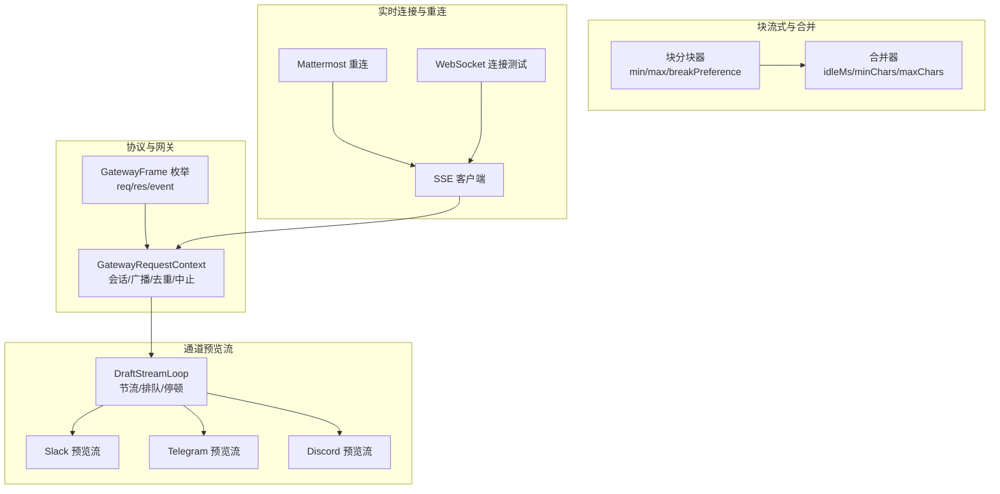
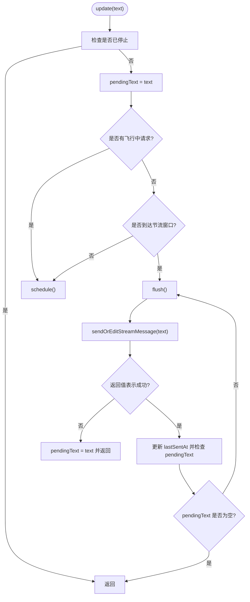
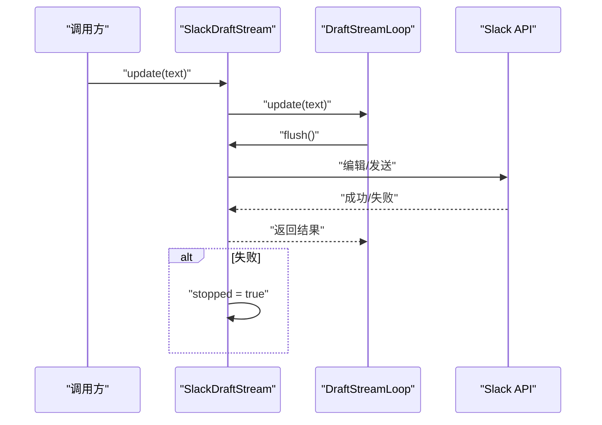
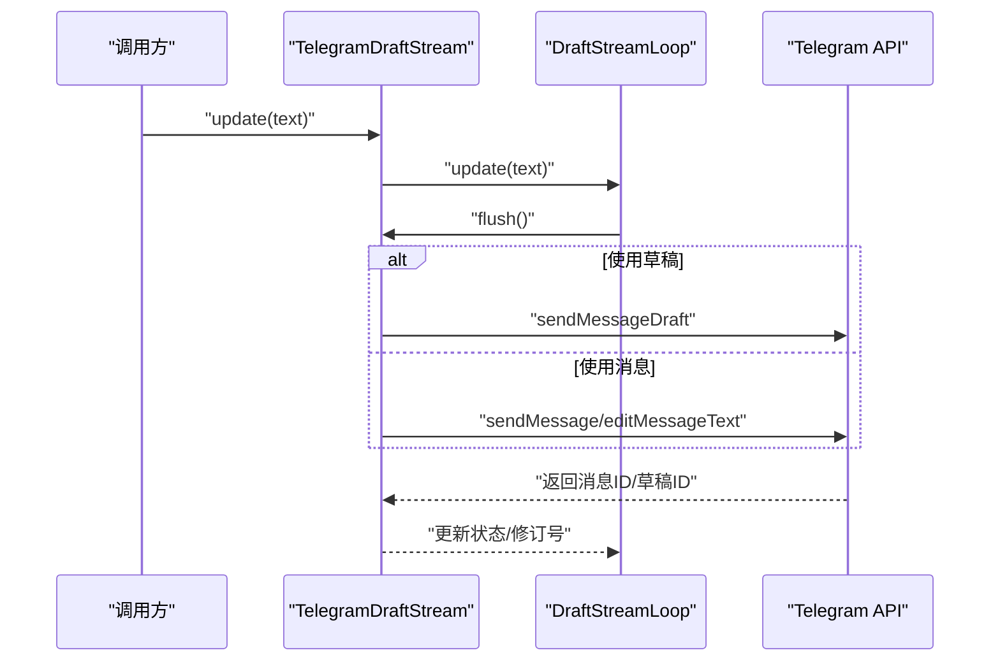
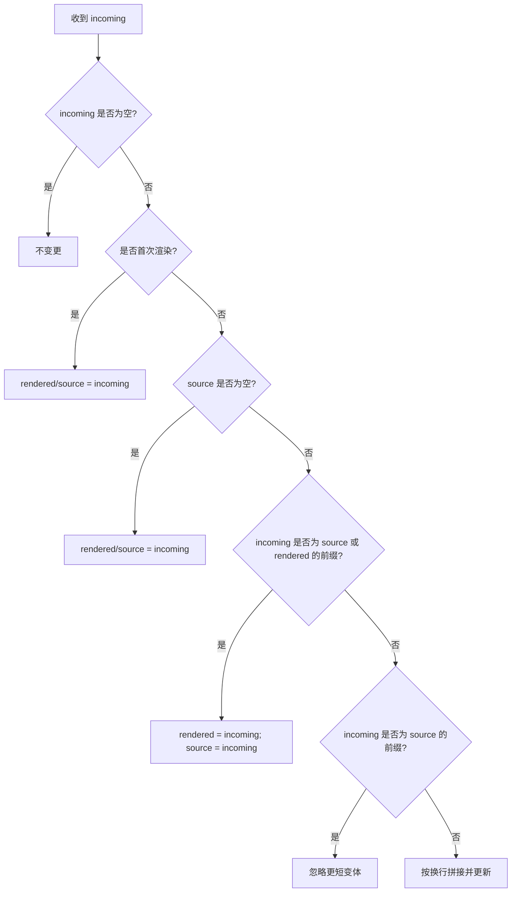
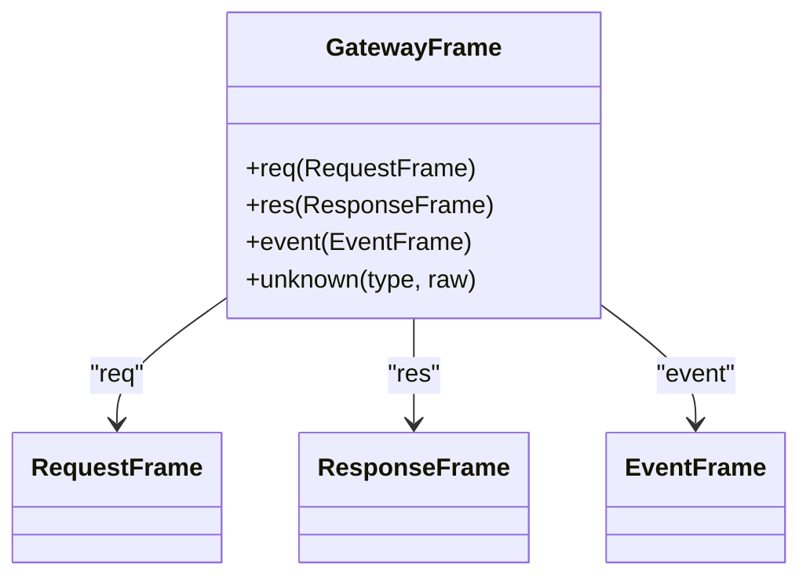
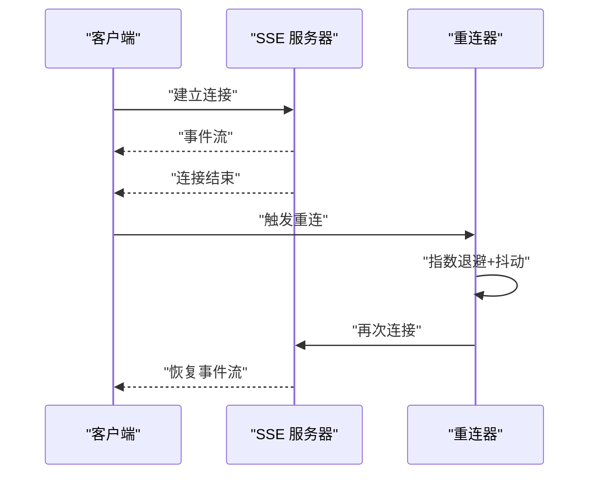
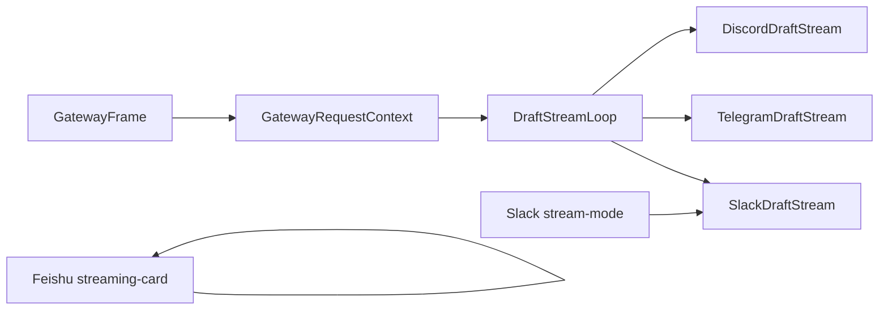

# 流式处理与实时响应

<cite>
**本文引用的文件**
- [docs/concepts/streaming.md](file://docs/concepts/streaming.md)
- [src/channels/draft-stream-loop.ts](file://src/channels/draft-stream-loop.ts)
- [extensions/slack/src/draft-stream.ts](file://extensions/slack/src/draft-stream.ts)
- [extensions/telegram/src/draft-stream.ts](file://extensions/telegram/src/draft-stream.ts)
- [extensions/discord/src/draft-stream.ts](file://extensions/discord/src/draft-stream.ts)
- [extensions/slack/src/stream-mode.ts](file://extensions/slack/src/stream-mode.ts)
- [extensions/slack/src/stream-mode.test.ts](file://extensions/slack/src/stream-mode.test.ts)
- [extensions/feishu/src/streaming-card.ts](file://extensions/feishu/src/streaming-card.ts)
- [extensions/tlon/src/urbit/sse-client.ts](file://extensions/tlon/src/urbit/sse-client.ts)
- [extensions/mattermost/src/mattermost/reconnect.ts](file://extensions/mattermost/src/mattermost/reconnect.ts)
- [extensions/mattermost/src/mattermost/reconnect.test.ts](file://extensions/mattermost/src/mattermost/reconnect.test.ts)
- [src/agents/openai-ws-connection.test.ts](file://src/agents/openai-ws-connection.test.ts)
- [apps/shared/OpenClawKit/Sources/OpenClawProtocol/GatewayModels.swift](file://apps/shared/OpenClawKit/Sources/OpenClawProtocol/GatewayModels.swift)
- [apps/macos/Sources/OpenClawProtocol/GatewayModels.swift](file://apps/macos/Sources/OpenClawProtocol/GatewayModels.swift)
- [scripts/protocol-gen-swift.ts](file://scripts/protocol-gen-swift.ts)
- [src/gateway/server-methods/types.ts](file://src/gateway/server-methods/types.ts)
- [src/auto-reply/reply/block-reply-pipeline.ts](file://src/auto-reply/reply/block-reply-pipeline.ts)
- [src/auto-reply/status.ts](file://src/auto-reply/status.ts)
- [src/hooks/internal-hooks.test.ts](file://src/hooks/internal-hooks.test.ts)
- [src/infra/system-events.ts](file://src/infra/system-events.ts)
</cite>

## 目录
1. [简介](#简介)
2. [项目结构](#项目结构)
3. [核心组件](#核心组件)
4. [架构总览](#架构总览)
5. [详细组件分析](#详细组件分析)
6. [依赖关系分析](#依赖关系分析)
7. [性能考量](#性能考量)
8. [故障排查指南](#故障排查指南)
9. [结论](#结论)
10. [附录](#附录)

## 简介
本文件面向 Pi Agent 的“流式处理与实时响应”系统，系统性阐述以下主题：
- 流式数据传输协议与帧模型（GatewayFrame 架构）
- 消息分片与重组策略（块流式分块、预览流式拼接）
- 实时响应处理、增量更新与状态同步
- 流式错误处理、断线重连与数据一致性保障
- 流式 API 接口、事件监听与回调机制
- 性能优化、缓冲管理与带宽控制策略
- 具体代码示例路径、数据流图与调试技巧

## 项目结构
围绕流式能力的关键目录与文件：
- 文档与概念：docs/concepts/streaming.md
- 通用流式循环与控制：src/channels/draft-stream-loop.ts
- 各渠道预览流实现：extensions/slack/src/draft-stream.ts、extensions/telegram/src/draft-stream.ts、extensions/discord/src/draft-stream.ts
- 预览模式映射与增量合并：extensions/slack/src/stream-mode.ts、extensions/slack/src/stream-mode.test.ts、extensions/feishu/src/streaming-card.ts
- SSE/WS 客户端与断线重连：extensions/tlon/src/urbit/sse-client.ts、extensions/mattermost/src/mattermost/reconnect.ts、extensions/mattermost/src/mattermost/reconnect.test.ts、src/agents/openai-ws-connection.test.ts
- 协议与网关帧模型：apps/shared/OpenClawKit/Sources/OpenClawProtocol/GatewayModels.swift、apps/macos/Sources/OpenClawProtocol/GatewayModels.swift、scripts/protocol-gen-swift.ts
- 网关请求上下文与运行时状态：src/gateway/server-methods/types.ts
- 块回复流水线与队列状态：src/auto-reply/reply/block-reply-pipeline.ts、src/auto-reply/status.ts
- 内部钩子与系统事件：src/hooks/internal-hooks.test.ts、src/infra/system-events.ts



**图表来源**
- [apps/shared/OpenClawKit/Sources/OpenClawProtocol/GatewayModels.swift:3547-3587](file://apps/shared/OpenClawKit/Sources/OpenClawProtocol/GatewayModels.swift#L3547-L3587)
- [src/gateway/server-methods/types.ts:33-91](file://src/gateway/server-methods/types.ts#L33-L91)
- [src/channels/draft-stream-loop.ts:10-105](file://src/channels/draft-stream-loop.ts#L10-L105)
- [extensions/slack/src/draft-stream.ts:18-141](file://extensions/slack/src/draft-stream.ts#L18-L141)
- [extensions/telegram/src/draft-stream.ts:95-460](file://extensions/telegram/src/draft-stream.ts#L95-L460)
- [extensions/discord/src/draft-stream.ts:19-146](file://extensions/discord/src/draft-stream.ts#L19-L146)
- [extensions/slack/src/stream-mode.ts:38-75](file://extensions/slack/src/stream-mode.ts#L38-L75)
- [extensions/feishu/src/streaming-card.ts:324-358](file://extensions/feishu/src/streaming-card.ts#L324-L358)
- [extensions/tlon/src/urbit/sse-client.ts:205-431](file://extensions/tlon/src/urbit/sse-client.ts#L205-L431)
- [extensions/mattermost/src/mattermost/reconnect.ts:39-103](file://extensions/mattermost/src/mattermost/reconnect.ts#L39-L103)
- [src/agents/openai-ws-connection.test.ts:521-554](file://src/agents/openai-ws-connection.test.ts#L521-L554)

**章节来源**
- [docs/concepts/streaming.md:10-156](file://docs/concepts/streaming.md#L10-L156)
- [src/channels/draft-stream-loop.ts:1-105](file://src/channels/draft-stream-loop.ts#L1-L105)

## 核心组件
- DraftStreamLoop：统一的预览流节流与批量发送循环，支持停顿、待发文本累积、飞行中请求跟踪与窗口重置。
- 渠道预览流实现：Slack、Telegram、Discord 分别封装了各自的发送/编辑/草稿 API，并在失败时进行降级或清理。
- 增量更新与模式映射：Slack 的 append-only 更新与状态最终文本生成；飞书卡片的合并与节流队列。
- 块流式分块与合并：按最小/最大字符边界与段落/换行/句子等偏好切分，支持空闲窗口合并与最终刷新。
- 协议与网关帧：GatewayFrame 统一封装 req/res/event，配合网关上下文进行广播、订阅与去重。
- 断线重连与 SSE：指数退避、抖动、最大延迟与自动重连；WebSocket 连接测试覆盖多场景。

**章节来源**
- [src/channels/draft-stream-loop.ts:10-105](file://src/channels/draft-stream-loop.ts#L10-L105)
- [extensions/slack/src/draft-stream.ts:18-141](file://extensions/slack/src/draft-stream.ts#L18-L141)
- [extensions/telegram/src/draft-stream.ts:95-460](file://extensions/telegram/src/draft-stream.ts#L95-L460)
- [extensions/discord/src/draft-stream.ts:19-146](file://extensions/discord/src/draft-stream.ts#L19-L146)
- [extensions/slack/src/stream-mode.ts:38-75](file://extensions/slack/src/stream-mode.ts#L38-L75)
- [extensions/feishu/src/streaming-card.ts:324-358](file://extensions/feishu/src/streaming-card.ts#L324-L358)
- [docs/concepts/streaming.md:19-106](file://docs/concepts/streaming.md#L19-L106)
- [apps/shared/OpenClawKit/Sources/OpenClawProtocol/GatewayModels.swift:3547-3587](file://apps/shared/OpenClawKit/Sources/OpenClawProtocol/GatewayModels.swift#L3547-L3587)
- [src/gateway/server-methods/types.ts:33-91](file://src/gateway/server-methods/types.ts#L33-L91)
- [extensions/tlon/src/urbit/sse-client.ts:205-431](file://extensions/tlon/src/urbit/sse-client.ts#L205-L431)
- [extensions/mattermost/src/mattermost/reconnect.ts:39-103](file://extensions/mattermost/src/mattermost/reconnect.ts#L39-L103)
- [src/agents/openai-ws-connection.test.ts:521-554](file://src/agents/openai-ws-connection.test.ts#L521-L554)

## 架构总览
Pi Agent 的流式系统由“协议层—网关层—通道层—客户端/前端”构成：
- 协议层：GatewayFrame 将请求、响应与事件统一封装，便于跨语言（Swift）生成与序列化。
- 网关层：GatewayRequestContext 提供会话、广播、去重、中止控制、节点订阅等能力。
- 通道层：各渠道预览流在本地循环中聚合增量文本，通过 API 发送/编辑，必要时清理残留消息。
- 客户端/前端：SSE/WebSocket 作为远端流入口，结合断线重连策略恢复数据传输。

```mermaid
sequenceDiagram
participant Provider as "模型/上游服务"
participant SSE as "SSE/WS 客户端"
participant GW as "网关(Gateway)"
participant Loop as "DraftStreamLoop"
participant Ch as "渠道预览流(Slack/TG/Discord)"
Provider->>SSE : "事件/数据流"
SSE->>GW : "GatewayFrame(req/res/event)"
GW->>Loop : "调度/节流"
Loop->>Ch : "update(text)"
Ch->>Ch : "发送/编辑/草稿"
Ch-->>Loop : "成功/失败"
Loop-->>GW : "完成/等待下一批"
```

**图表来源**
- [apps/shared/OpenClawKit/Sources/OpenClawProtocol/GatewayModels.swift:3547-3587](file://apps/shared/OpenClawKit/Sources/OpenClawProtocol/GatewayModels.swift#L3547-L3587)
- [src/gateway/server-methods/types.ts:33-91](file://src/gateway/server-methods/types.ts#L33-L91)
- [src/channels/draft-stream-loop.ts:20-52](file://src/channels/draft-stream-loop.ts#L20-L52)
- [extensions/slack/src/draft-stream.ts:43-87](file://extensions/slack/src/draft-stream.ts#L43-L87)
- [extensions/telegram/src/draft-stream.ts:266-347](file://extensions/telegram/src/draft-stream.ts#L266-L347)
- [extensions/discord/src/draft-stream.ts:44-106](file://extensions/discord/src/draft-stream.ts#L44-L106)

## 详细组件分析

### DraftStreamLoop：统一预览流循环
- 节流窗口：基于上次发送时间与 throttleMs 计算延迟，避免频繁调用。
- 待发累积：pendingText 在飞行中请求未完成时继续累积，完成后一次性 flush。
- 飞行中跟踪：inFlightPromise 用于检测当前发送是否仍在进行，防止并发冲突。
- 停止与清理：stop/resetPending/resetThrottleWindow 支持中途停止与重置窗口。
- 返回值语义：sendOrEditStreamMessage 可返回布尔或特殊标记以决定是否回填待发文本。



**图表来源**
- [src/channels/draft-stream-loop.ts:20-52](file://src/channels/draft-stream-loop.ts#L20-L52)

**章节来源**
- [src/channels/draft-stream-loop.ts:10-105](file://src/channels/draft-stream-loop.ts#L10-L105)

### Slack 预览流：增量编辑与上限保护
- 最大字符限制与停止策略：超过上限直接停止，避免重复失败。
- 首次发送防抖：minInitialChars 控制首次预览的最小长度，改善推送体验。
- 草稿/编辑切换：优先使用草稿 API，失败时回退到发送/编辑流程。
- 清理与错误处理：异常时设置 stopped 标志并记录警告，支持 clear() 删除残留消息。



**图表来源**
- [extensions/slack/src/draft-stream.ts:43-87](file://extensions/slack/src/draft-stream.ts#L43-L87)

**章节来源**
- [extensions/slack/src/draft-stream.ts:18-141](file://extensions/slack/src/draft-stream.ts#L18-L141)

### Telegram 预览流：草稿/消息双传输与首屏防抖
- 草稿 API 优先：sendMessageDraft 可减少输入框闪烁；不可用时回退到 sendMessage/editMessageText。
- 首次发送阈值：minInitialChars 未达则不发送，避免过早推送。
- 传输状态与修订号：记录 previewTransport、previewRevision、lastDeliveredText，便于调试与一致性判断。
- 物化（materialize）：将草稿转为永久消息，清理残留草稿内容。



**图表来源**
- [extensions/telegram/src/draft-stream.ts:245-347](file://extensions/telegram/src/draft-stream.ts#L245-L347)

**章节来源**
- [extensions/telegram/src/draft-stream.ts:95-460](file://extensions/telegram/src/draft-stream.ts#L95-L460)

### Discord 预览流：轻量草稿式编辑
- 2000 字符上限：超过即停止，避免反复失败。
- 首次发送阈值与回复引用：minInitialChars 与 reply_to_message_id 支持更友好的交互。
- 编辑/发送：已有消息 ID 则 patch，否则 post 并记录新 ID。

**章节来源**
- [extensions/discord/src/draft-stream.ts:19-146](file://extensions/discord/src/draft-stream.ts#L19-L146)

### Slack 增量更新与模式映射
- append-only 更新：根据 incoming 与 source/rendered 的前缀关系，决定是追加还是替换。
- 状态最终文本：progress 模式下生成“思考中”的点状提示文本，便于最终替换。
- 测试覆盖：验证从 legacy 布尔到统一枚举的映射与增量行为。



**图表来源**
- [extensions/slack/src/stream-mode.ts:38-70](file://extensions/slack/src/stream-mode.ts#L38-L70)

**章节来源**
- [extensions/slack/src/stream-mode.ts:38-75](file://extensions/slack/src/stream-mode.ts#L38-L75)
- [extensions/slack/src/stream-mode.test.ts:43-91](file://extensions/slack/src/stream-mode.test.ts#L43-L91)

### 飞书卡片流式更新：合并与节流队列
- 合并策略：mergeStreamingText 对 pendingText 与当前状态进行合并，避免重复更新。
- 节流窗口：lastUpdateTime + updateThrottleMs 控制更新频率，同时保留 pendingText。
- 队列化更新：queue.then(...) 串行化更新，确保状态一致。

**章节来源**
- [extensions/feishu/src/streaming-card.ts:324-358](file://extensions/feishu/src/streaming-card.ts#L324-L358)

### 协议与网关帧模型：GatewayFrame
- GatewayFrame 枚举：req/res/event 三类帧，未知类型保留原始字典以便扩展。
- Swift 生成：脚本自动生成 Swift 结构体与编码/解码逻辑，保证跨平台一致性。
- 网关上下文：GatewayRequestContext 提供会话、广播、去重、中止控制等能力。



**图表来源**
- [apps/shared/OpenClawKit/Sources/OpenClawProtocol/GatewayModels.swift:3547-3587](file://apps/shared/OpenClawKit/Sources/OpenClawProtocol/GatewayModels.swift#L3547-L3587)
- [scripts/protocol-gen-swift.ts:158-247](file://scripts/protocol-gen-swift.ts#L158-L247)

**章节来源**
- [apps/shared/OpenClawKit/Sources/OpenClawProtocol/GatewayModels.swift:3547-3587](file://apps/shared/OpenClawKit/Sources/OpenClawProtocol/GatewayModels.swift#L3547-L3587)
- [apps/macos/Sources/OpenClawProtocol/GatewayModels.swift:3547-3587](file://apps/macos/Sources/OpenClawProtocol/GatewayModels.swift#L3547-L3587)
- [scripts/protocol-gen-swift.ts:158-247](file://scripts/protocol-gen-swift.ts#L158-L247)
- [src/gateway/server-methods/types.ts:33-91](file://src/gateway/server-methods/types.ts#L33-L91)

### 块流式分块与合并：算法与配置
- 分块算法：低/高边界、段落/换行/句子/空白/硬切，避免代码围栏内切分。
- 合并策略：idleMs 等待、minChars/maxChars 限制、连接符来自 breakPreference。
- 人类节奏：可选随机延迟，使多气泡回复更自然。
- 配置项：agents.defaults.blockStreaming* 与通道级 textChunkLimit、chunkMode、coalesce。

**章节来源**
- [docs/concepts/streaming.md:19-106](file://docs/concepts/streaming.md#L19-L106)
- [src/auto-reply/reply/block-reply-pipeline.ts:1-211](file://src/auto-reply/reply/block-reply-pipeline.ts#L1-L211)
- [src/auto-reply/status.ts:184-209](file://src/auto-reply/status.ts#L184-L209)

### 实时连接与断线重连
- SSE：按行解析事件，支持自动重连与通道重置；结束时尝试重连。
- Mattermost：指数退避 + 抖动，最大延迟与可插拔重连决策；支持中断信号。
- WebSocket：连接失败、错误先于关闭的场景测试，确保最多重试次数。



**图表来源**
- [extensions/tlon/src/urbit/sse-client.ts:205-431](file://extensions/tlon/src/urbit/sse-client.ts#L205-L431)
- [extensions/mattermost/src/mattermost/reconnect.ts:39-103](file://extensions/mattermost/src/mattermost/reconnect.ts#L39-L103)
- [src/agents/openai-ws-connection.test.ts:521-554](file://src/agents/openai-ws-connection.test.ts#L521-L554)

**章节来源**
- [extensions/tlon/src/urbit/sse-client.ts:205-431](file://extensions/tlon/src/urbit/sse-client.ts#L205-L431)
- [extensions/mattermost/src/mattermost/reconnect.ts:39-103](file://extensions/mattermost/src/mattermost/reconnect.ts#L39-L103)
- [extensions/mattermost/src/mattermost/reconnect.test.ts:1-94](file://extensions/mattermost/src/mattermost/reconnect.test.ts#L1-L94)
- [src/agents/openai-ws-connection.test.ts:521-554](file://src/agents/openai-ws-connection.test.ts#L521-L554)

## 依赖关系分析
- DraftStreamLoop 作为通用循环被 Slack/TG/Discord 预览流复用，降低重复实现。
- Slack 的 stream-mode 与 Feishu 的卡片合并共同实现“增量更新 + 状态同步”。
- GatewayFrame 与 GatewayRequestContext 为网关侧统一契约，支撑广播、去重与节点订阅。
- 断线重连策略在 SSE 与 Mattermost 中体现，保障长连接稳定性。



**图表来源**
- [src/channels/draft-stream-loop.ts:10-105](file://src/channels/draft-stream-loop.ts#L10-L105)
- [extensions/slack/src/draft-stream.ts:88-92](file://extensions/slack/src/draft-stream.ts#L88-L92)
- [extensions/telegram/src/draft-stream.ts:349-367](file://extensions/telegram/src/draft-stream.ts#L349-L367)
- [extensions/discord/src/draft-stream.ts:117-127](file://extensions/discord/src/draft-stream.ts#L117-L127)
- [extensions/slack/src/stream-mode.ts:38-75](file://extensions/slack/src/stream-mode.ts#L38-L75)
- [extensions/feishu/src/streaming-card.ts:324-358](file://extensions/feishu/src/streaming-card.ts#L324-L358)
- [apps/shared/OpenClawKit/Sources/OpenClawProtocol/GatewayModels.swift:3547-3587](file://apps/shared/OpenClawKit/Sources/OpenClawProtocol/GatewayModels.swift#L3547-L3587)
- [src/gateway/server-methods/types.ts:33-91](file://src/gateway/server-methods/types.ts#L33-L91)

**章节来源**
- [src/channels/draft-stream-loop.ts:10-105](file://src/channels/draft-stream-loop.ts#L10-L105)
- [extensions/slack/src/draft-stream.ts:88-92](file://extensions/slack/src/draft-stream.ts#L88-L92)
- [extensions/telegram/src/draft-stream.ts:349-367](file://extensions/telegram/src/draft-stream.ts#L349-L367)
- [extensions/discord/src/draft-stream.ts:117-127](file://extensions/discord/src/draft-stream.ts#L117-L127)
- [extensions/slack/src/stream-mode.ts:38-75](file://extensions/slack/src/stream-mode.ts#L38-L75)
- [extensions/feishu/src/streaming-card.ts:324-358](file://extensions/feishu/src/streaming-card.ts#L324-L358)
- [apps/shared/OpenClawKit/Sources/OpenClawProtocol/GatewayModels.swift:3547-3587](file://apps/shared/OpenClawKit/Sources/OpenClawProtocol/GatewayModels.swift#L3547-L3587)
- [src/gateway/server-methods/types.ts:33-91](file://src/gateway/server-methods/types.ts#L33-L91)

## 性能考量
- 节流与批量：DraftStreamLoop 的 throttleMs 与 pendingText 累积减少 API 调用频率。
- 合并与空闲窗口：块流式合并器的 idleMs 与 minChars/maxChars 降低“单行刷屏”，提升用户体验。
- 上限保护：各渠道预览流对字符上限进行严格检查，避免无效重试。
- 人类节奏：可选随机延迟，改善多气泡回复的感知体验。
- 带宽控制：SSE/Mattermost 的指数退避与抖动，避免雪崩式重试。

[本节为通用指导，无需具体文件分析]

## 故障排查指南
- 预览流失败
  - Slack：检查 token、目标标识符是否存在；查看停止标志与警告日志；必要时调用 clear() 清理残留消息。
  - Telegram：区分草稿与消息传输路径；关注首次发送阈值与线程参数；使用 materialize() 将草稿物化为永久消息。
  - Discord：确认消息引用与回复参数；检查字符上限与返回 ID。
- 增量更新异常
  - Slack：核对 incoming 与 source/rendered 的前缀关系；确认模式映射是否正确。
  - 飞书：检查合并函数与节流窗口，避免重复更新。
- 断线重连
  - SSE：观察自动重连日志与通道重置；确认最大重连次数与延时策略。
  - Mattermost：验证指数退避、抖动与最大延迟；确保中断信号正确传递。
  - WebSocket：关注错误与关闭顺序，确保最多重试次数生效。
- 内部钩子与系统事件
  - 钩子错误隔离：单个处理器异常不应影响其他处理器执行。
  - 系统事件：peek/drain/reset 方法可用于调试与测试。

**章节来源**
- [extensions/slack/src/draft-stream.ts:88-141](file://extensions/slack/src/draft-stream.ts#L88-L141)
- [extensions/telegram/src/draft-stream.ts:266-460](file://extensions/telegram/src/draft-stream.ts#L266-L460)
- [extensions/discord/src/draft-stream.ts:44-146](file://extensions/discord/src/draft-stream.ts#L44-L146)
- [extensions/slack/src/stream-mode.ts:38-75](file://extensions/slack/src/stream-mode.ts#L38-L75)
- [extensions/feishu/src/streaming-card.ts:324-358](file://extensions/feishu/src/streaming-card.ts#L324-L358)
- [extensions/tlon/src/urbit/sse-client.ts:205-431](file://extensions/tlon/src/urbit/sse-client.ts#L205-L431)
- [extensions/mattermost/src/mattermost/reconnect.ts:39-103](file://extensions/mattermost/src/mattermost/reconnect.ts#L39-L103)
- [src/agents/openai-ws-connection.test.ts:521-554](file://src/agents/openai-ws-connection.test.ts#L521-L554)
- [src/hooks/internal-hooks.test.ts:194-229](file://src/hooks/internal-hooks.test.ts#L194-L229)
- [src/infra/system-events.ts:99-119](file://src/infra/system-events.ts#L99-L119)

## 结论
Pi Agent 的流式系统通过“统一循环 + 渠道适配 + 协议帧模型 + 断线重连”实现了稳定、可控且高性能的实时响应。块流式与预览流分别满足不同场景需求，配合增量更新与状态同步策略，既保证了用户体验，也兼顾了数据一致性与性能优化。

[本节为总结，无需具体文件分析]

## 附录
- 配置参考：agents.defaults.blockStreaming*、channels.*.streaming、textChunkLimit、chunkMode、coalesce 等。
- API 示例路径：各 draft-stream 文件中的 create*Stream 函数与内部 sendOrEditStreamMessage 实现。
- 调试技巧：利用 clear()/forceNewMessage/materialize() 快速定位状态问题；通过日志与警告信息定位失败原因；使用测试用例理解行为边界。

[本节为概览，无需具体文件分析]