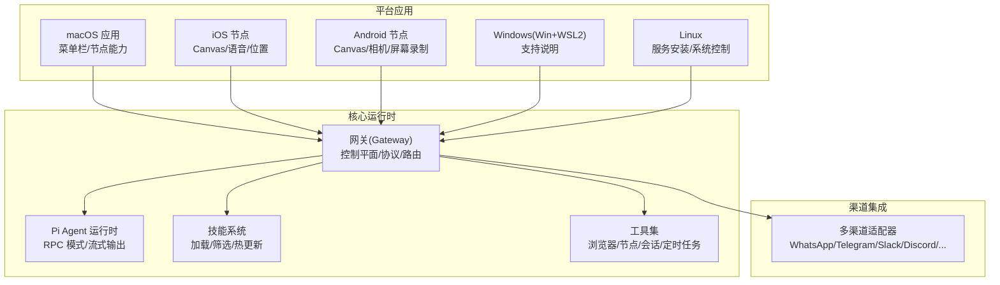
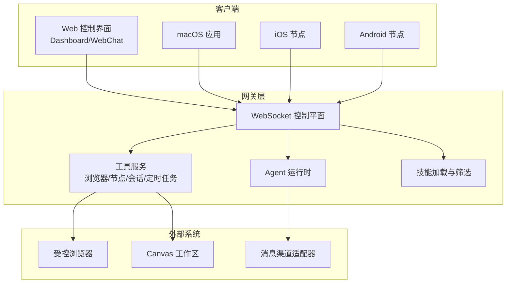
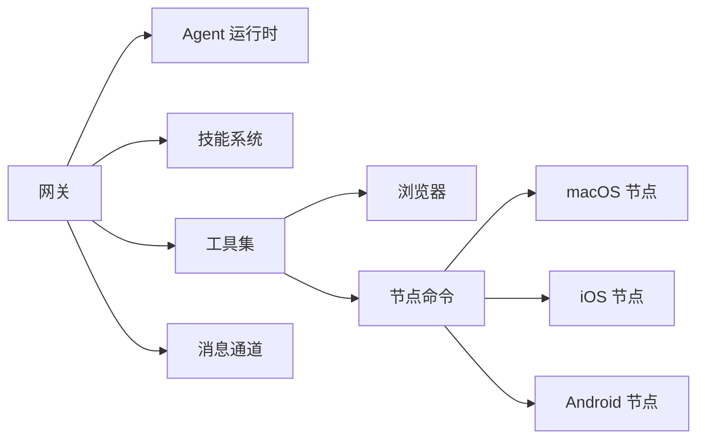

# 主要特性

<cite>
**本文引用的文件**
- [README.md](file://README.md)
- [VISION.md](file://VISION.md)
- [docs/concepts/agent.md](file://docs/concepts/agent.md)
- [docs/tools/browser.md](file://docs/tools/browser.md)
- [docs/platforms/mac/canvas.md](file://docs/platforms/mac/canvas.md)
- [docs/nodes/voicewake.md](file://docs/nodes/voicewake.md)
- [docs/nodes/index.md](file://docs/nodes/index.md)
- [docs/tools/skills.md](file://docs/tools/skills.md)
- [docs/platforms/macos.md](file://docs/platforms/macos.md)
- [docs/platforms/ios.md](file://docs/platforms/ios.md)
- [docs/platforms/android.md](file://docs/platforms/android.md)
- [docs/platforms/windows.md](file://docs/platforms/windows.md)
- [docs/platforms/linux.md](file://docs/platforms/linux.md)
</cite>

## 目录
1. [简介](#简介)
2. [项目结构](#项目结构)
3. [核心组件](#核心组件)
4. [架构总览](#架构总览)
5. [详细组件分析](#详细组件分析)
6. [依赖关系分析](#依赖关系分析)
7. [性能考量](#性能考量)
8. [故障排查指南](#故障排查指南)
9. [结论](#结论)
10. [附录](#附录)

## 简介
本章节概述 OpenClaw 的核心定位与愿景：在用户设备上运行的个人 AI 助手，强调本地优先、安全默认、多平台可用与强大的工具链生态。平台通过“网关（Gateway）+ 多节点（Nodes）+ 技能（Skills）+ 工具（Tools）”的组合，实现跨消息渠道、跨设备的统一智能体体验。

- 平台目标与优先级：安全与稳健、易用性与首次体验、跨平台支持与性能优化。
- 安全模型：默认对主会话开放能力，群组/频道会话可启用沙箱；提供明确的权限与审计路径。
- 跨平台：macOS、iOS、Android、Windows（WSL2）、Linux 均有配套支持或开发路线。

**章节来源**
- [README.md: 21-32:21-32](file://README.md#L21-L32)
- [VISION.md: 15-32:15-32](file://VISION.md#L15-L32)

## 项目结构
OpenClaw 采用模块化与平台化的组织方式：
- 核心运行时与协议：Gateway 控制平面、WebSocket 协议、通道适配器、工具与技能系统。
- 平台应用：macOS 菜单栏应用、iOS/Android 节点应用、Windows/Linux 支持说明。
- 文档体系：概念、工具、平台、安装、网关、安全等子目录，覆盖从入门到运维的全生命周期。

**图示来源**
- [README.md: 144-176:144-176](file://README.md#L144-L176)
- [docs/platforms/macos.md: 9-25:9-25](file://docs/platforms/macos.md#L9-L25)
- [docs/platforms/ios.md: 10-18:10-18](file://docs/platforms/ios.md#L10-L18)
- [docs/platforms/android.md: 10-25:10-25](file://docs/platforms/android.md#L10-L25)

**章节来源**
- [README.md: 144-184:144-184](file://README.md#L144-L184)

## 核心组件
- Pi Agent 运行时：基于嵌入式 pi-mono 的轻量运行时，支持块流式输出、队列模式与会话管理。
- 浏览器控制：专用受控浏览器实例，支持快照、截图、动作、下载、状态设置等。
- Canvas 可视化工作区：macOS 内置 WKWebView 面板，支持 A2UI 推送与脚本执行。
- 语音唤醒与通话：全局唤醒词列表由网关维护，跨节点同步；iOS/Android 提供语音与通话能力。
- 节点系统：设备节点通过设备配对连接网关，暴露 Canvas/相机/屏幕录制/系统命令等能力。
- 技能系统：AgentSkills 兼容的技能目录，支持多源加载、环境注入、安装器与远程节点能力发现。

**章节来源**
- [docs/concepts/agent.md: 66-104:66-104](file://docs/concepts/agent.md#L66-L104)
- [docs/tools/browser.md: 10-50:10-50](file://docs/tools/browser.md#L10-L50)
- [docs/platforms/mac/canvas.md: 10-50:10-50](file://docs/platforms/mac/canvas.md#L10-L50)
- [docs/nodes/voicewake.md: 9-40:9-40](file://docs/nodes/voicewake.md#L9-L40)
- [docs/nodes/index.md: 10-30:10-30](file://docs/nodes/index.md#L10-L30)
- [docs/tools/skills.md: 9-30:9-30](file://docs/tools/skills.md#L9-L30)

## 架构总览
下图展示了 OpenClaw 的端到端架构：网关作为控制平面，承载会话、通道、工具与事件；平台应用与节点通过 WebSocket 连接网关；浏览器与 Canvas 作为工具面呈现。

**图示来源**
- [README.md: 185-212:185-212](file://README.md#L185-L212)
- [docs/tools/browser.md: 519-531:519-531](file://docs/tools/browser.md#L519-L531)
- [docs/platforms/mac/canvas.md: 10-50:10-50](file://docs/platforms/mac/canvas.md#L10-L50)

**章节来源**
- [README.md: 185-212:185-212](file://README.md#L185-L212)

## 详细组件分析

### 多渠道即时通讯集成（20+ 平台）
- 覆盖范围：WhatsApp、Telegram、Slack、Discord、Google Chat、Signal、iMessage（BlueBubbles/iMessage）、IRC、Microsoft Teams、Matrix、Feishu、LINE、Mattermost、Nextcloud Talk、Nostr、Synology Chat、Tlon、Twitch、Zalo、Zalo Personal、WebChat 等。
- 安全策略：默认 DM 策略为“配对”，未知发件人需经批准；可通过配置开启公开 DM 或允许特定白名单。
- 组路由：支持提及门控、回复标签、分片与路由规则，便于企业与群组场景。

使用场景
- 企业内部：通过 Slack/Discord/Teams 等渠道统一接入，结合组路由与权限控制。
- 个人助理：通过 WhatsApp/Telegram/Signal 等渠道接收消息，按需启用公开 DM 或严格配对模式。

技术实现
- 通道适配器：各平台独立适配器，统一通过网关进行认证、路由与回执。
- DM 策略：在网关配置中设置 dmPolicy 与 allowFrom，结合配对流程完成信任建立。

用户体验优势
- 无需切换应用即可与助手交互；支持富媒体与多媒体上下文。
- 安全可控：默认最小权限，逐步放权，降低误操作风险。

配置示例（节选）
- Telegram：设置 botToken 或 channels.telegram.botToken。
- Discord：设置 token 或 channels.discord.token。
- Signal：需要 signal-cli 与 channels.signal 配置段。
- BlueBubbles：配置 serverUrl、password 与 webhook。

**章节来源**
- [README.md: 129-154:129-154](file://README.md#L129-L154)
- [README.md: 340-403:340-403](file://README.md#L340-L403)

### Pi Agent 运行时
- 运行时来源：基于 pi-mono 的嵌入式运行时，支持块流式输出与队列模式。
- 会话管理：会话存储于本地 JSONL 文件，支持激活模式、队列模式与跟随模式。
- 工具与提示：内置系统工具，技能注入提示词，支持工具策略与沙箱模式。

使用场景
- 长对话与复杂任务：通过块流式输出与队列模式提升交互稳定性。
- 多代理协作：通过会话工具在不同代理间传递消息与上下文。

技术实现
- 块流式输出：可配置边界与合并策略，减少单行刷屏。
- 队列模式：steer/followup/collect 三种模式，支持消息注入与去抖。

**章节来源**
- [docs/concepts/agent.md: 73-104:73-104](file://docs/concepts/agent.md#L73-L104)

### 浏览器控制（Agent 工具）
- 专用浏览器：openclaw 独立配置文件，隔离个人浏览；支持多配置文件（openclaw/work/remote 等）。
- 行为控制：快照、截图、导航、动作、等待、Cookie/Storage/地理/时区/语言/设备等状态设置。
- 安全策略：loopback 仅访问；远程 CDP 需加密与短期令牌；严格模式可限制私有网络访问。

使用场景
- 自动化网页操作：登录、表单填写、数据抓取与验证。
- 无头测试与截图：生成页面快照与报告。

技术实现
- CDP 驱动：通过 Chrome DevTools 协议连接浏览器；Playwright 可选增强能力。
- 代理与远程：节点主机代理、远程 CDP、Browserless/Browserbase 等。

**章节来源**
- [docs/tools/browser.md: 10-127:10-127](file://docs/tools/browser.md#L10-L127)
- [docs/tools/browser.md: 470-531:470-531](file://docs/tools/browser.md#L470-L531)

### Canvas 可视化工作区（macOS）
- 面板行为：无边框、可调整大小、随会话记忆位置；本地文件变更自动重载。
- 访问方式：自定义 openclaw-canvas:// 协议；支持本地路径与 http(s) URL。
- A2UI：支持 v0.8 消息协议，可推送 UI 更新与数据模型。

使用场景
- 低代码可视化：在 HTML/CSS/JS 中构建交互式面板。
- 快速原型与演示：通过 A2UI 快速渲染 UI 组件。

技术实现
- WKWebView 承载；Canvas 根目录位于应用支持目录；通过网关 WebSocket 暴露控制接口。

**章节来源**
- [docs/platforms/mac/canvas.md: 10-126:10-126](file://docs/platforms/mac/canvas.md#L10-L126)

### 语音唤醒与通话（跨节点）
- 全局唤醒词：由网关持有与广播，所有节点共享同一列表。
- 存储与协议：~/.openclaw/settings/voicewake.json；提供 get/set 与 changed 事件。
- 节点能力：macOS/iOS 支持；Android 当前以手动麦克风为主。

使用场景
- 语音触发：通过唤醒词启动助手或发起通话。
- 跨设备同步：在 macOS/iOS/Android 上保持一致的唤醒词体验。

技术实现
- WebSocket 方法：voicewake.get、voicewake.set、voicewake.changed。
- 节点侧：根据全局列表进行触发检测与本地 UI 同步。

**章节来源**
- [docs/nodes/voicewake.md: 9-67:9-67](file://docs/nodes/voicewake.md#L9-L67)

### 节点管理（Canvas/相机/屏幕/系统）
- 设备配对：节点通过设备身份连接网关，创建配对请求并通过 CLI/UI 批准。
- 能力暴露：canvas.*、camera.*、screen.record、location.get、system.run/notify 等。
- 远程节点主机：在另一台机器上运行节点主机，将系统命令执行转发至该主机。

使用场景
- 移动设备：iOS/Android 节点提供 Canvas、相机、屏幕录制与位置能力。
- 远程执行：在 Linux/Windows 上运行节点主机，执行系统命令与文件操作。

技术实现
- 低层 invoke：openclaw nodes invoke；高层辅助命令：canvas/screenshot、camera/clip、location/get 等。
- 远程执行：tools.exec.host=node，配合 exec-approvals 白名单。

**章节来源**
- [docs/nodes/index.md: 10-386:10-386](file://docs/nodes/index.md#L10-L386)

### 技能系统（Skills）
- 加载顺序：工作区技能 > 本地/托管技能 > 内置技能；支持额外目录与插件技能。
- 环境注入：按会话注入 env/apiKey，构建系统提示词；支持热更新与远程节点能力发现。
- 安装器：支持 brew/npm/pnpm/yarn/bun/go/download 等多种安装方式。

使用场景
- 个性化扩展：在工作区编写技能，覆盖内置或本地技能。
- 第三方集成：通过 metadata.openclaw.requires 配置二进制、环境变量与配置项。

技术实现
- SKILL.md 前言元数据：name/description/metadata；支持 command-dispatch/tool 模式。
- 装载过滤：在加载时按 os/bins/env/config 条件筛选技能。

**章节来源**
- [docs/tools/skills.md: 9-303:9-303](file://docs/tools/skills.md#L9-L303)

### 跨平台应用支持（macOS、iOS、Android、Windows、Linux）
- macOS：菜单栏应用负责权限、网关连接与节点能力；支持系统运行与通知。
- iOS：节点应用，支持 Canvas、语音唤醒、通话、位置与画布操作。
- Android：节点应用，支持 Canvas、相机、屏幕录制、语音与设备命令家族。
- Windows：推荐 WSL2；原生 Windows 支持逐步完善。
- Linux：网关完全支持；计划原生应用。

使用场景
- 远程办公：在 Linux/VPS 上运行网关，通过 macOS/iOS/Android 节点进行本地操作。
- 个人助理：在多平台上统一使用聊天、Canvas 与语音功能。

技术实现
- 发现与连接：Bonjour/NSD、Tailnet DNS-SD、手动主机端口。
- 安全与信任：设备配对、SSH 隧道、Tailscale 服务/漏斗。

**章节来源**
- [docs/platforms/macos.md: 9-227:9-227](file://docs/platforms/macos.md#L9-L227)
- [docs/platforms/ios.md: 10-217:10-217](file://docs/platforms/ios.md#L10-L217)
- [docs/platforms/android.md: 10-168:10-168](file://docs/platforms/android.md#L10-L168)
- [docs/platforms/windows.md: 9-242:9-242](file://docs/platforms/windows.md#L9-L242)
- [docs/platforms/linux.md: 9-95:9-95](file://docs/platforms/linux.md#L9-L95)

## 依赖关系分析
- 组件耦合
  - 网关与 Agent：强耦合（控制平面与运行时），通过 WebSocket 通信。
  - 网关与工具：弱耦合（工具通过方法调用），支持本地/远程/节点代理。
  - 网关与节点：弱耦合（设备配对后通过 WS 通信），节点暴露命令面。
  - 技能与 Agent：通过系统提示词注入，按会话动态装载。
- 外部依赖
  - 浏览器：Chromium 系列（Chrome/Brave/Edge/Chromium/Canary）。
  - 通道：各平台 SDK/API（如 Baileys、grammY、discord.js、Chat API、signal-cli 等）。
  - 平台：macOS（TCC 权限）、iOS（推送与 App Attest）、Android（权限与 NSD）。

**图示来源**
- [docs/tools/browser.md: 519-531:519-531](file://docs/tools/browser.md#L519-L531)
- [docs/nodes/index.md: 10-30:10-30](file://docs/nodes/index.md#L10-L30)

**章节来源**
- [docs/tools/browser.md: 519-531:519-531](file://docs/tools/browser.md#L519-L531)
- [docs/nodes/index.md: 10-30:10-30](file://docs/nodes/index.md#L10-L30)

## 性能考量
- 流式输出与块合并：通过块流式输出与合并策略减少高频小包，提升交互流畅度。
- 技能提示词开销：技能列表注入提示词具有确定性字符开销，建议按需启用与精简。
- 远程执行与网络：节点主机与远程 CDP 会引入网络延迟，建议就近部署与使用隧道优化。
- 浏览器与 Canvas：快照与截图可能产生较大负载，建议按需使用并限制尺寸。

[本节为通用指导，不直接分析具体文件]

## 故障排查指南
常见问题与定位思路
- 浏览器控制
  - 现象：浏览器未启用/不可达
  - 处理：检查 browser.enabled 与默认配置；确认 loopback 绑定与授权；必要时使用远程 CDP。
- Canvas
  - 现象：Canvas 无法显示或报错
  - 处理：确认 openclaw-canvas:// 协议与会话根目录；检查 A2UI 版本兼容性。
- 语音唤醒
  - 现象：唤醒词不同步或无效
  - 处理：检查网关 voicewake.json 与广播事件；确认节点已收到最新列表。
- 节点连接
  - 现象：节点无法连接或命令失败
  - 处理：检查设备配对、SSH 隧道、Tailnet DNS-SD；确认节点权限与前台状态。
- 技能加载
  - 现象：技能未生效或报错
  - 处理：检查 metadata.openclaw.requires 条件、环境变量与配置项；确认热更新是否启用。

**章节来源**
- [docs/tools/browser.md: 748-755:748-755](file://docs/tools/browser.md#L748-L755)
- [docs/platforms/mac/canvas.md: 121-126:121-126](file://docs/platforms/mac/canvas.md#L121-L126)
- [docs/nodes/voicewake.md: 30-67:30-67](file://docs/nodes/voicewake.md#L30-L67)
- [docs/nodes/index.md: 159-386:159-386](file://docs/nodes/index.md#L159-L386)
- [docs/tools/skills.md: 254-267:254-267](file://docs/tools/skills.md#L254-L267)

## 结论
OpenClaw 以“本地优先 + 安全默认”的理念，构建了从网关到节点、从工具到技能的完整生态。其多渠道集成、Pi Agent 运行时、浏览器与 Canvas 工具、语音唤醒与跨平台节点，共同构成了一个可扩展、可审计且贴近日常使用的个人智能助手平台。对于希望掌控数据与执行环境的用户而言，OpenClaw 提供了高自由度与强安全性的平衡方案。

[本节为总结性内容，不直接分析具体文件]

## 附录
- 快速开始参考
  - 安装与守护进程：参见 README 的安装与守护进程安装步骤。
  - 网关启动与消息发送：参见 README 的快速开始示例。
- 平台支持与运行建议
  - Windows：推荐 WSL2；原生支持逐步完善。
  - Linux：使用 systemd 用户服务；支持 Docker/Nix 等安装方式。
  - macOS：菜单栏应用负责权限与网关连接；支持远程模式与节点主机。

**章节来源**
- [README.md: 50-82:50-82](file://README.md#L50-L82)
- [docs/platforms/windows.md: 9-242:9-242](file://docs/platforms/windows.md#L9-L242)
- [docs/platforms/linux.md: 9-95:9-95](file://docs/platforms/linux.md#L9-L95)
- [docs/platforms/macos.md: 26-50:26-50](file://docs/platforms/macos.md#L26-L50)