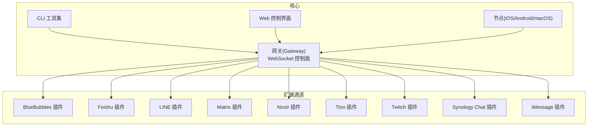
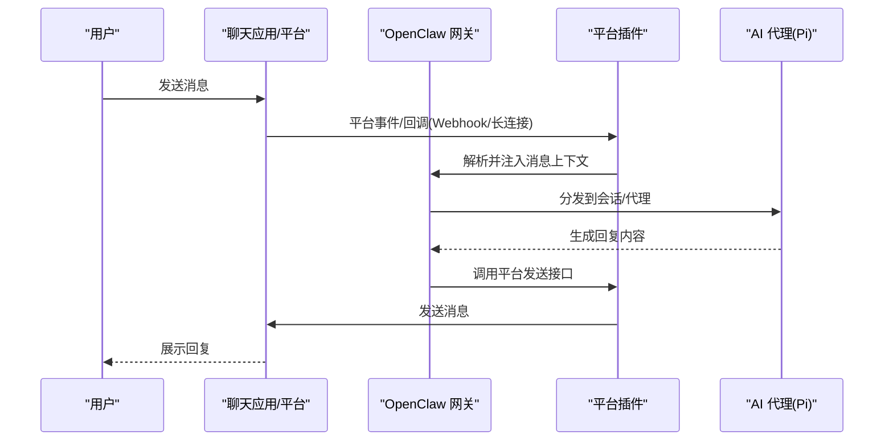
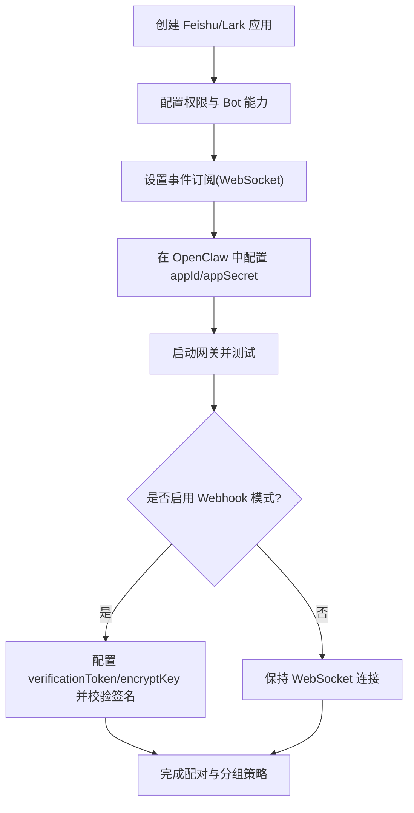
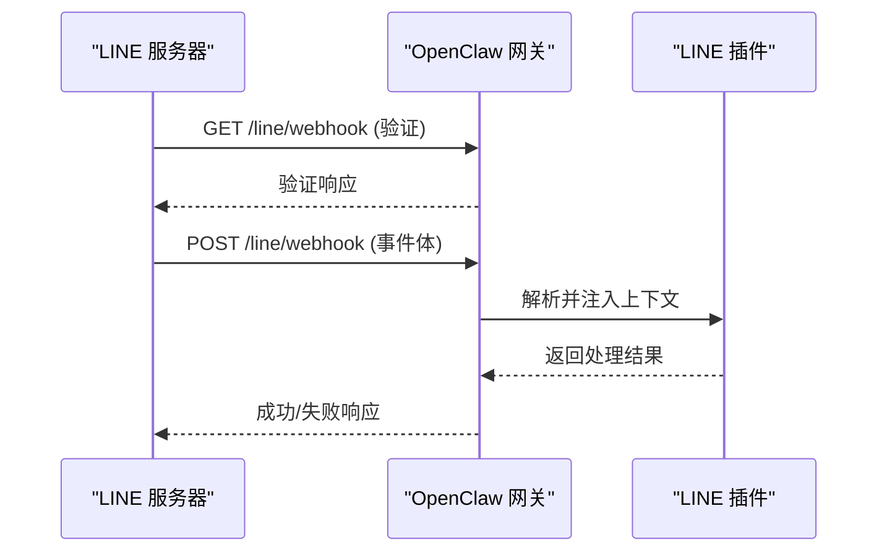
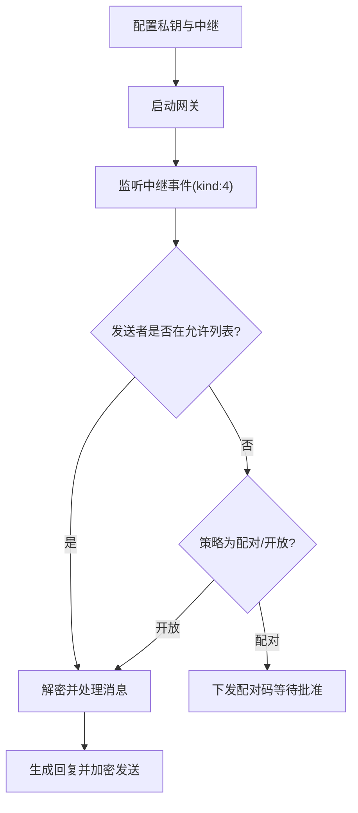
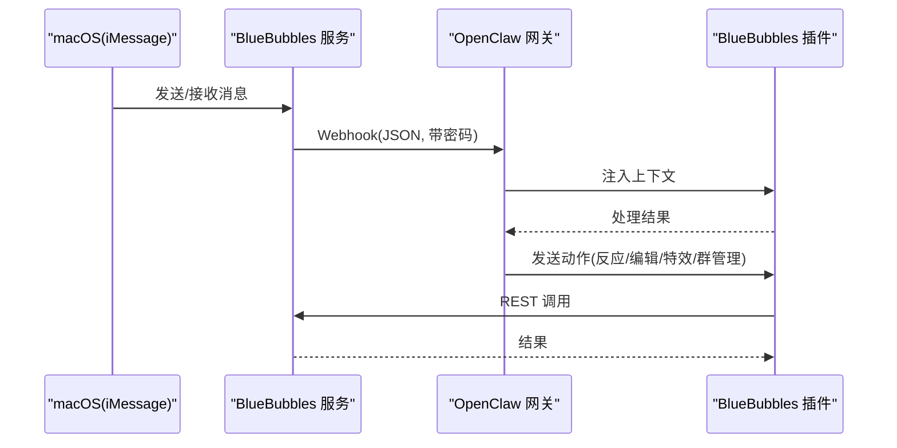

# 专业化去中心化平台

<cite>
**本文引用的文件**
- [README.md](file://README.md)
- [docs/index.md](file://docs/index.md)
- [docs/channels/index.md](file://docs/channels/index.md)
- [docs/channels/bluebubbles.md](file://docs/channels/bluebubbles.md)
- [docs/channels/feishu.md](file://docs/channels/feishu.md)
- [docs/channels/imessage.md](file://docs/channels/imessage.md)
- [docs/channels/line.md](file://docs/channels/line.md)
- [extensions/bluebubbles/README.md](file://extensions/bluebubbles/README.md)
- [extensions/nostr/README.md](file://extensions/nostr/README.md)
</cite>

## 目录
1. [简介](#简介)
2. [项目结构](#项目结构)
3. [核心组件](#核心组件)
4. [架构总览](#架构总览)
5. [详细组件分析](#详细组件分析)
6. [依赖关系分析](#依赖关系分析)
7. [性能考量](#性能考量)
8. [故障排除指南](#故障排除指南)
9. [结论](#结论)
10. [附录](#附录)

## 简介
本文件面向希望在 OpenClaw 平台上集成专业化去中心化即时通讯平台的工程师与运维人员。OpenClaw 是一个“个人 AI 助手”，可在多种聊天渠道（如 WhatsApp、Telegram、Discord、iMessage、BlueBubbles、IRC、Microsoft Teams、Matrix、Feishu、LINE、Mattermost、Nextcloud Talk、Nostr、Synology Chat、Tlon、Twitch、Zalo、Zalo Personal、WebChat）上运行，并通过单一网关控制平面连接到 AI 编码代理（Pi）。本文聚焦于 Feishu/Lark、LINE、Matrix、Nostr、Tlon、Twitch、Synology Chat、iMessage 与 BlueBubbles 的集成实现，涵盖各平台的技术架构、认证机制、消息协议、配置示例、API 规范、插件安装与自定义开发要点，并讨论去中心化平台的安全模型、隐私保护与数据主权问题。

## 项目结构
OpenClaw 采用多语言混合工程：核心以 TypeScript/Node 构建，同时包含 Swift（Swabble）、iOS/Android 应用与 macOS 节点，以及大量扩展插件（channels/plugins）。文档位于 docs 目录，覆盖从入门到高级主题的完整知识体系；扩展插件位于 extensions 目录，按平台拆分，提供独立的安装、配置与运行时能力。



图示来源
- [README.md:185-202](file://README.md#L185-L202)
- [docs/index.md:59-69](file://docs/index.md#L59-L69)

章节来源
- [README.md:21-22](file://README.md#L21-L22)
- [docs/index.md:44-71](file://docs/index.md#L44-L71)

## 核心组件
- 网关（Gateway）：统一的 WebSocket 控制平面，负责会话管理、路由、工具与事件处理。
- CLI：命令行工具，支持 onboarding、gateway 启动、消息发送、配对与诊断等。
- Web 控制界面：浏览器端仪表盘，用于聊天、配置与会话管理。
- 节点（Nodes）：iOS/Android/macOS 节点，提供 Canvas、相机、屏幕录制、通知等本地能力。
- 扩展通道（Extensions）：各平台专用插件，负责认证、事件订阅/接收、消息发送与媒体处理。

章节来源
- [README.md:128-135](file://README.md#L128-L135)
- [docs/index.md:74-94](file://docs/index.md#L74-L94)

## 架构总览
OpenClaw 的整体架构以“单一网关 + 多通道插件”为核心，所有消息流经网关进行路由与安全控制，再由相应插件对接到具体平台。下图展示典型的消息往返流程：



图示来源
- [README.md:185-202](file://README.md#L185-L202)
- [docs/index.md:59-69](file://docs/index.md#L59-L69)

## 详细组件分析

### Feishu/Lark（企业微信）
- 技术架构
  - 使用 WebSocket 长连接接收事件，无需暴露公网 Webhook。
  - 通过开放平台 App ID/App Secret 获取令牌，支持多账号与域名切换（国内版/国际版）。
- 认证机制
  - 事件订阅需启用 WebSocket 并添加事件类型；Webhook 模式需配置 verificationToken 与 encryptKey。
- 消息协议
  - 支持文本、富文本、图片、文件、音频、视频、贴纸；发送侧支持文本、图片、文件、音频与部分富文本。
- 配置要点
  - 建议使用 wizard 或 CLI 添加；可设置 typingIndicator、resolveSenderNames 优化配额。
  - 分组策略：groupPolicy（open/allowlist/disabled）、requireMention、per-group allowFrom。
- 安全与隐私
  - 事件签名验证；建议仅内网绑定或通过受信反向代理；生产环境建议开启 HTTPS 与访问控制。



图示来源
- [docs/channels/feishu.md:70-162](file://docs/channels/feishu.md#L70-L162)
- [docs/channels/feishu.md:164-264](file://docs/channels/feishu.md#L164-L264)

章节来源
- [docs/channels/feishu.md:15-26](file://docs/channels/feishu.md#L15-L26)
- [docs/channels/feishu.md:164-264](file://docs/channels/feishu.md#L164-L264)
- [docs/channels/feishu.md:301-393](file://docs/channels/feishu.md#L301-L393)
- [docs/channels/feishu.md:484-658](file://docs/channels/feishu.md#L484-L658)

### LINE（日本）
- 技术架构
  - 通过 Webhook 接收事件，使用 Channel Access Token 与 Channel Secret 进行签名验证。
- 认证机制
  - LINE 端签名验证基于原始请求体 HMAC；网关在严格预检后执行验证。
- 消息协议
  - 支持文本、图片、文件、位置、Flex 卡片、模板消息与快速回复；不支持反应与线程。
- 配置要点
  - 最小配置包括 token、secret、dmPolicy；支持多账号与自定义 webhook 路径。
  - 文本分块默认 5000 字符；Markdown 转换为 Flex 卡片；媒体上限默认 10MB。
- 安全与隐私
  - 严格限制 webhook 预检大小与超时；生产环境必须使用 HTTPS。



图示来源
- [docs/channels/line.md:10-50](file://docs/channels/line.md#L10-L50)
- [docs/channels/line.md:55-118](file://docs/channels/line.md#L55-L118)

章节来源
- [docs/channels/line.md:10-50](file://docs/channels/line.md#L10-L50)
- [docs/channels/line.md:110-143](file://docs/channels/line.md#L110-L143)
- [docs/channels/line.md:144-185](file://docs/channels/line.md#L144-L185)

### Matrix（去中心化）
- 技术架构
  - 通过 Matrix 协议与 homeserver 交互，支持房间消息与私聊。
- 认证机制
  - 通常使用访问令牌（access token）或用户名/密码登录；具体取决于部署方式。
- 消息协议
  - 支持文本、图片、文件、音频、视频等；支持房间成员管理与消息转发。
- 配置要点
  - 需安装 @openclaw/matrix 插件；配置 homeserver 地址、账户凭据与 webhook 路径（如使用）。
- 安全与隐私
  - 建议使用 TLS；对敏感房间进行权限控制；避免泄露访问令牌。

章节来源
- [docs/channels/index.md:23-23](file://docs/channels/index.md#L23-L23)

### Nostr（去中心化）
- 技术架构
  - 使用 NIP-04 加密直聊（kind:4），通过 WebSocket 中继（relay）收发事件。
- 认证机制
  - 私钥签名验证；支持配对码、白名单、开放与禁用四种 DM 策略。
- 消息协议
  - 支持 kind:4（加密 DM）；计划支持 NIP-17 gift-wrap（v2）。
- 配置要点
  - 配置 privateKey（nsec/hex）、relays 列表、dmPolicy、allowFrom；推荐使用本地 relay 测试。
- 安全与隐私
  - 私钥不落盘日志；事件签名验证；生产环境建议使用 allowlist。



图示来源
- [extensions/nostr/README.md:1-137](file://extensions/nostr/README.md#L1-L137)

章节来源
- [extensions/nostr/README.md:1-137](file://extensions/nostr/README.md#L1-L137)

### Tlon（Urbit）
- 技术架构
  - 基于 Urbit 的去中心化社交网络，通过插件接入聊天与消息。
- 认证机制
  - 通常使用 Urbit 身份与会话令牌；具体取决于部署与集成方式。
- 消息协议
  - 支持文本、富文本与媒体；支持群组与私聊。
- 配置要点
  - 需安装 @openclaw/tlon 插件；配置身份、会话令牌与中继（如需要）。
- 安全与隐私
  - 建议使用受信中继；保护身份令牌；最小权限原则。

章节来源
- [docs/channels/index.md:32-32](file://docs/channels/index.md#L32-L32)

### Twitch（游戏直播聊天）
- 技术架构
  - 通过 IRC 连接 Twitch chat，适合公开频道与直播互动。
- 认证机制
  - 使用 OAuth Token（client-id + token）进行 IRC 登录。
- 消息协议
  - 文本消息为主；支持 emote 与订阅提示。
- 配置要点
  - 需安装 @openclaw/twitch 插件；配置 client-id 与 token。
- 安全与隐私
  - 公开频道存在匿名性风险；建议配合 mention gating 与 allowlist。

章节来源
- [docs/channels/index.md:33-33](file://docs/channels/index.md#L33-L33)

### Synology Chat（NAS 自托管）
- 技术架构
  - 通过 Webhook（入站）与 API（出站）集成，适合企业内部部署。
- 认证机制
  - 使用 Webhook 密钥与 API 凭据；确保 HTTPS 与防火墙规则。
- 消息协议
  - 支持文本、图片、文件、表情；支持群组与私聊。
- 配置要点
  - 需安装 @openclaw/synology-chat 插件；配置 webhook 与 API 地址。
- 安全与隐私
  - 仅在内网或受控网络暴露；定期轮换密钥。

章节来源
- [docs/channels/index.md:29-29](file://docs/channels/index.md#L29-L29)

### iMessage（macOS）
- 技术架构
  - 传统 imsg CLI（JSON-RPC over stdio），或推荐的 BlueBubbles REST API。
- 认证机制
  - imsg 依赖 macOS 权限（自动化、全盘访问）；BlueBubbles 通过 API 密码与 webhook 密钥。
- 消息协议
  - 文本、图片、文件、语音备忘；支持打字指示与已读回执（BlueBubbles）。
- 配置要点
  - imsg：配置 cliPath、dbPath、附件根目录；支持远程 SSH 包装器。
  - BlueBubbles：配置 serverUrl、password、webhookPath；支持动作开关（反应、编辑、撤回、特效、群管理等）。
- 安全与隐私
  - BlueBubbles webhook 必须带密码；生产环境建议 HTTPS 与防火墙；注意 macOS 权限与 VM 长连稳定性。



图示来源
- [docs/channels/bluebubbles.md:10-51](file://docs/channels/bluebubbles.md#L10-L51)
- [docs/channels/imessage.md:9-30](file://docs/channels/imessage.md#L9-L30)

章节来源
- [docs/channels/imessage.md:31-115](file://docs/channels/imessage.md#L31-L115)
- [docs/channels/imessage.md:134-185](file://docs/channels/imessage.md#L134-L185)
- [docs/channels/imessage.md:187-245](file://docs/channels/imessage.md#L187-L245)
- [docs/channels/imessage.md:247-286](file://docs/channels/imessage.md#L247-L286)
- [docs/channels/imessage.md:304-360](file://docs/channels/imessage.md#L304-L360)
- [docs/channels/bluebubbles.md:25-51](file://docs/channels/bluebubbles.md#L25-L51)
- [docs/channels/bluebubbles.md:149-236](file://docs/channels/bluebubbles.md#L149-L236)
- [docs/channels/bluebubbles.md:289-348](file://docs/channels/bluebubbles.md#L289-L348)
- [extensions/bluebubbles/README.md:18-46](file://extensions/bluebubbles/README.md#L18-L46)

## 依赖关系分析
- 插件与网关：各平台插件通过 registerPluginHttpRoute 注册 HTTP 路由，或通过长连接/SDK 接收事件，再经 api.runtime 注入核心处理管线。
- 认证链路：平台侧（Feishu/LINE/Nostr/Tlon/Twitch/Synology/BlueBubbles/iMessage）的凭据与令牌在插件层完成验证与缓存，网关侧仅做路由与会话管理。
- 安全边界：网关默认对未知发送者采用配对/白名单策略；生产环境建议启用 HTTPS、访问控制与最小权限。

```mermaid
graph LR
GW["网关"] --> |HTTP/WS| FS["@openclaw/feishu"]
GW --> |HTTP/WS| LI["@openclaw/line"]
GW --> |HTTP/WS| NS["@openclaw/nostr"]
GW --> |HTTP/WS| TL["@openclaw/tlon"]
GW --> |IRC| TW["@openclaw/twitch"]
GW --> |HTTP/WS| SC["@openclaw/synology-chat"]
GW --> |REST/WS| BB["@openclaw/bluebubbles"]
GW --> |stdio(JSON-RPC)| IM["@openclaw/imessage"]
```

图示来源
- [docs/channels/index.md:14-37](file://docs/channels/index.md#L14-L37)
- [extensions/bluebubbles/README.md:9-16](file://extensions/bluebubbles/README.md#L9-L16)

章节来源
- [docs/channels/index.md:14-37](file://docs/channels/index.md#L14-L37)

## 性能考量
- 事件预检与限流：LINE 插件对 webhook 请求体进行严格预检与超时控制，避免慢注入与资源耗尽。
- 文本分块与流式输出：Feishu/BlueBubbles 支持分块与流式卡片更新，提升用户体验。
- 媒体大小限制：各插件均提供 mediaMaxMb 限制，防止大文件占用带宽与存储。
- WebSocket 与长连接：Feishu/LINE/Nostr 等建议使用长连接或受信 Webhook，减少公网暴露与中间人风险。

章节来源
- [docs/channels/line.md:51-54](file://docs/channels/line.md#L51-L54)
- [docs/channels/feishu.md:513-531](file://docs/channels/feishu.md#L513-L531)
- [docs/channels/bluebubbles.md:283-288](file://docs/channels/bluebubbles.md#L283-L288)

## 故障排除指南
- Feishu
  - 未收到消息：确认事件订阅已启用 WebSocket、权限完整、网关运行状态正常。
  - 群组未响应：检查 groupPolicy、requireMention 与 allowFrom 设置。
  - App Secret 泄露：重置并在配置中更新，重启网关。
- LINE
  - Webhook 验证失败：确保 webhook URL 为 HTTPS，且 channelSecret 与控制台一致。
  - 媒体下载错误：提高 mediaMaxMb。
- Nostr
  - 无法接收消息：检查 privateKey、relays 可达性与 enabled 开关。
  - 无法送达：核对 relays 是否使用 wss，避免限流。
- iMessage/BlueBubbles
  - BlueBubbles webhook 密码错误：核对 password 与 webhookPath 参数。
  - macOS VM 长连中断：按文档设置 AppleScript + LaunchAgent 保活。
  - imsg 权限缺失：在相同用户会话中触发一次 GUI 操作以授权自动化与全盘访问。
- 通用
  - 使用 openclaw pairing list/approve 管理配对码。
  - 使用 openclaw logs --follow 查看实时日志定位问题。

章节来源
- [docs/channels/feishu.md:452-482](file://docs/channels/feishu.md#L452-L482)
- [docs/channels/line.md:186-194](file://docs/channels/line.md#L186-L194)
- [extensions/nostr/README.md:119-133](file://extensions/nostr/README.md#L119-L133)
- [docs/channels/bluebubbles.md:337-348](file://docs/channels/bluebubbles.md#L337-L348)
- [docs/channels/imessage.md:304-360](file://docs/channels/imessage.md#L304-L360)

## 结论
OpenClaw 通过模块化的扩展插件体系，实现了对主流与去中心化即时通讯平台的统一接入。对于去中心化平台（如 Nostr），OpenClaw 提供了安全可控的接入方式（私钥管理、事件签名验证、策略化访问控制），兼顾隐私与可用性。在企业与个人场景中，结合网关的安全策略与各平台的认证机制，可构建既灵活又稳健的跨平台智能助手系统。

## 附录
- 快速开始与安装
  - 参考 README 的安装与入门步骤，使用 openclaw onboard 与 openclaw gateway 快速启动。
- 配置参考
  - 使用 openclaw wizard 或直接编辑 ~/.openclaw/openclaw.json，按需启用各通道并设置策略。
- 插件安装
  - 使用 openclaw plugins install 安装所需插件（如 @openclaw/feishu、@openclaw/line、@openclaw/nostr 等）。

章节来源
- [README.md:50-82](file://README.md#L50-L82)
- [docs/index.md:96-118](file://docs/index.md#L96-L118)