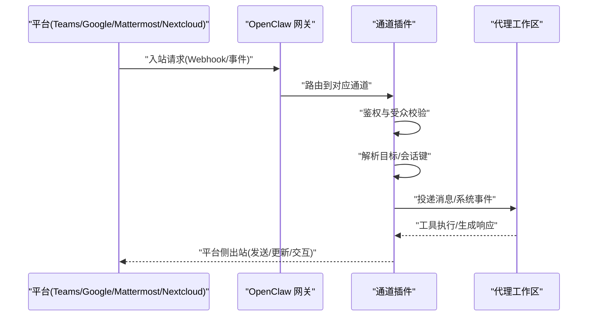
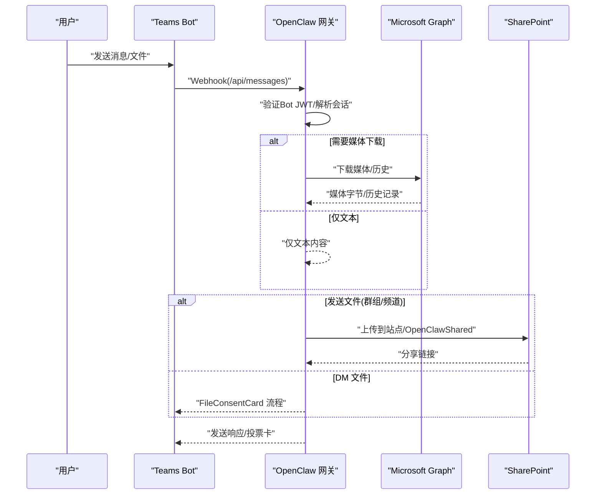
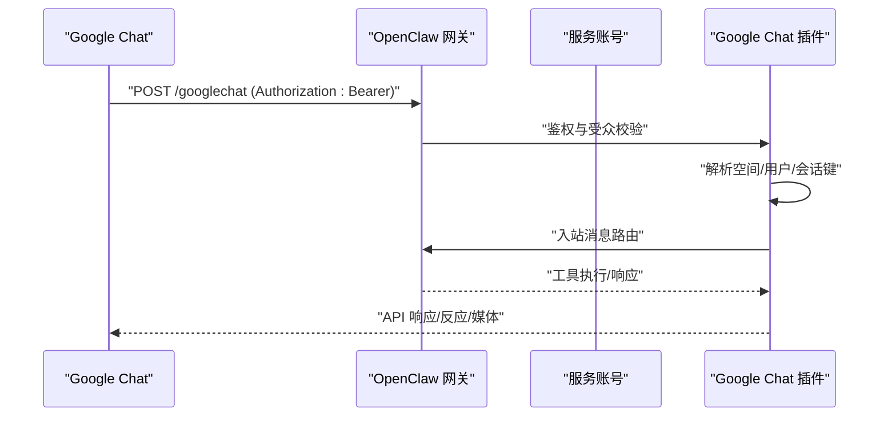
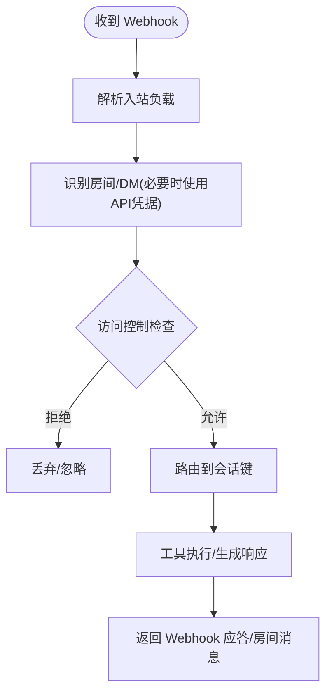
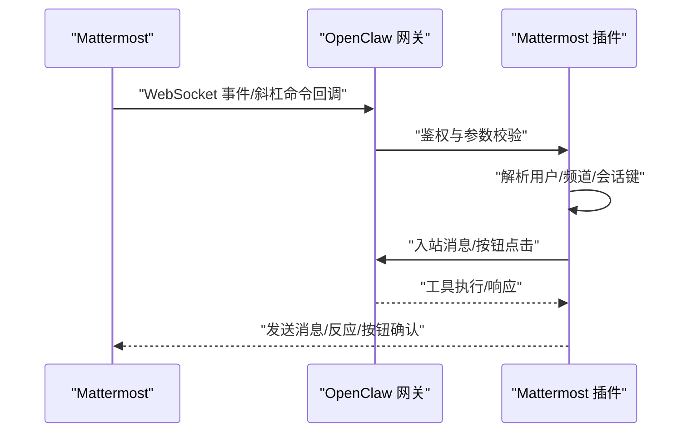
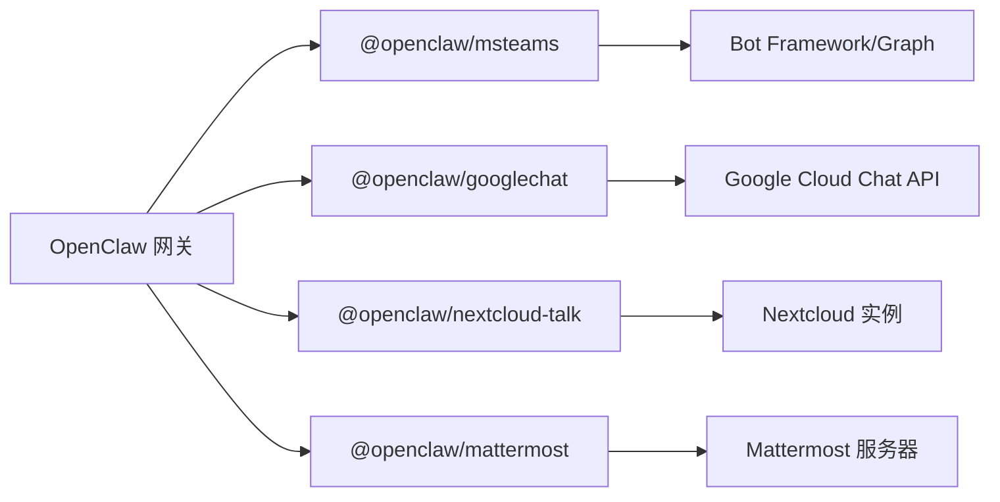

# 企业级协作平台

<cite>
**本文引用的文件**
- [docs/channels/msteams.md](file://docs/channels/msteams.md)
- [docs/channels/googlechat.md](file://docs/channels/googlechat.md)
- [docs/channels/nextcloud-talk.md](file://docs/channels/nextcloud-talk.md)
- [docs/channels/mattermost.md](file://docs/channels/mattermost.md)
- [extensions/msteams/src/index.ts](file://extensions/msteams/src/index.ts)
- [extensions/msteams/src/attachments.ts](file://extensions/msteams/src/attachments.ts)
- [extensions/msteams/src/graph-upload.ts](file://extensions/msteams/src/graph-upload.ts)
- [extensions/msteams/src/graph-chat.ts](file://extensions/msteams/src/graph-chat.ts)
- [extensions/msteams/src/file-consent.ts](file://extensions/msteams/src/file-consent.ts)
- [extensions/msteams/src/channel.ts](file://extensions/msteams/src/channel.ts)
- [extensions/msteams/src/conversation-store.ts](file://extensions/msteams/src/conversation-store.ts)
- [extensions/msteams/src/directory-live.ts](file://extensions/msteams/src/directory-live.ts)
- [extensions/googlechat/src/index.ts](file://extensions/googlechat/src/index.ts)
- [extensions/googlechat/src/auth.ts](file://extensions/googlechat/src/auth.ts)
- [extensions/googlechat/src/api.ts](file://extensions/googlechat/src/api.ts)
- [extensions/googlechat/src/channel.ts](file://extensions/googlechat/src/channel.ts)
- [extensions/googlechat/src/monitor.ts](file://extensions/googlechat/src/monitor.ts)
- [extensions/nextcloud-talk/src/index.ts](file://extensions/nextcloud-talk/src/index.ts)
- [extensions/nextcloud-talk/src/monitor.ts](file://extensions/nextcloud-talk/src/monitor.ts)
- [extensions/nextcloud-talk/src/inbound.ts](file://extensions/nextcloud-talk/src/inbound.ts)
- [extensions/nextcloud-talk/src/policy.ts](file://extensions/nextcloud-talk/src/policy.ts)
- [extensions/mattermost/src/index.ts](file://extensions/mattermost/src/index.ts)
- [extensions/mattermost/src/channel.ts](file://extensions/mattermost/src/channel.ts)
- [extensions/mattermost/src/setup-core.ts](file://extensions/mattermost/src/setup-core.ts)
- [extensions/mattermost/src/types.ts](file://extensions/mattermost/src/types.ts)
- [extensions/mattermost/src/group-mentions.ts](file://extensions/mattermost/src/group-mentions.ts)
- [extensions/mattermost/src/normalize.ts](file://extensions/mattermost/src/normalize.ts)
</cite>

## 目录
1. [简介](#简介)
2. [项目结构](#项目结构)
3. [核心组件](#核心组件)
4. [架构总览](#架构总览)
5. [详细组件分析](#详细组件分析)
6. [依赖关系分析](#依赖关系分析)
7. [性能考量](#性能考量)
8. [故障排查指南](#故障排查指南)
9. [结论](#结论)
10. [附录](#附录)

## 简介
本技术文档面向 OpenClaw 支持的企业级协作即时通讯平台，聚焦以下四大平台的集成与落地能力：
- Microsoft Teams：Bot Framework 企业认证、权限模型（资源特定权限 RSC 与 Microsoft Graph）、大规模部署要点、文件上传与历史消息读取、会话路由与回复风格。
- Google Chat：OAuth 服务账号认证、Webhook 配置与受众校验、企业安全策略与路径隔离。
- Nextcloud Talk：自托管部署、机器人 Webhook 集成、媒体以链接形式传递、房间类型识别与访问控制。
- Mattermost：开源部署、WebSocket 事件、插件系统与交互按钮、多账户与回调可达性。

文档提供从架构到实现细节、从配置到运维排障的完整视角，并给出企业级配置模板、安全最佳实践与性能调优建议。

## 项目结构
OpenClaw 将各平台通道以“插件”形式组织在 extensions 目录下，文档在 docs/channels 下提供平台级使用说明。核心目录与文件关系如下：

```mermaid
graph TB
subgraph "文档"
D1["docs/channels/msteams.md"]
D2["docs/channels/googlechat.md"]
D3["docs/channels/nextcloud-talk.md"]
D4["docs/channels/mattermost.md"]
end
subgraph "扩展(插件)"
subgraph "Teams"
TIDX["extensions/msteams/src/index.ts"]
TATT["extensions/msteams/src/attachments.ts"]
TGUP["extensions/msteams/src/graph-upload.ts"]
TGCH["extensions/msteams/src/graph-chat.ts"]
TFIL["extensions/msteams/src/file-consent.ts"]
TCHAN["extensions/msteams/src/channel.ts"]
TCONV["extensions/msteams/src/conversation-store.ts"]
TLIVE["extensions/msteams/src/directory-live.ts"]
end
subgraph "Google Chat"
GIDX["extensions/googlechat/src/index.ts"]
GAUT["extensions/googlechat/src/auth.ts"]
GAP["extensions/googlechat/src/api.ts"]
GCHAN["extensions/googlechat/src/channel.ts"]
GMON["extensions/googlechat/src/monitor.ts"]
end
subgraph "Nextcloud Talk"
NIDX["extensions/nextcloud-talk/src/index.ts"]
NMON["extensions/nextcloud-talk/src/monitor.ts"]
NINB["extensions/nextcloud-talk/src/inbound.ts"]
NPOL["extensions/nextcloud-talk/src/policy.ts"]
end
subgraph "Mattermost"
MIDX["extensions/mattermost/src/index.ts"]
MCHAN["extensions/mattermost/src/channel.ts"]
MSUP["extensions/mattermost/src/setup-core.ts"]
MTYP["extensions/mattermost/src/types.ts"]
MGRP["extensions/mattermost/src/group-mentions.ts"]
MNORM["extensions/mattermost/src/normalize.ts"]
end
end
D1 --> TIDX
D2 --> GIDX
D3 --> NIDX
D4 --> MIDX
TIDX --> TATT
TIDX --> TGUP
TIDX --> TGCH
TIDX --> TFIL
TIDX --> TCHAN
TIDX --> TCONV
TIDX --> TLIVE
GIDX --> GAUT
GIDX --> GAP
GIDX --> GCHAN
GIDX --> GMON
NIDX --> NMON
NIDX --> NINB
NIDX --> NPOL
MIDX --> MCHAN
MIDX --> MSUP
MIDX --> MTYP
MIDX --> MGRP
MIDX --> MNORM
```

图示来源
- [docs/channels/msteams.md](file://docs/channels/msteams.md)
- [docs/channels/googlechat.md](file://docs/channels/googlechat.md)
- [docs/channels/nextcloud-talk.md](file://docs/channels/nextcloud-talk.md)
- [docs/channels/mattermost.md](file://docs/channels/mattermost.md)
- [extensions/msteams/src/index.ts](file://extensions/msteams/src/index.ts)
- [extensions/googlechat/src/index.ts](file://extensions/googlechat/src/index.ts)
- [extensions/nextcloud-talk/src/index.ts](file://extensions/nextcloud-talk/src/index.ts)
- [extensions/mattermost/src/index.ts](file://extensions/mattermost/src/index.ts)

章节来源
- [docs/channels/msteams.md](file://docs/channels/msteams.md)
- [docs/channels/googlechat.md](file://docs/channels/googlechat.md)
- [docs/channels/nextcloud-talk.md](file://docs/channels/nextcloud-talk.md)
- [docs/channels/mattermost.md](file://docs/channels/mattermost.md)

## 核心组件
- Teams 插件：负责 Bot Framework Webhook 接收、RSC 权限下的消息读写、Graph 媒体下载与历史拉取、文件上传至 SharePoint、会话存储与目录解析、投票卡片发送等。
- Google Chat 插件：基于服务账号的 Webhook 认证与受众校验、空间路由、DM 配对机制、附件下载与大小限制、反应工具支持。
- Nextcloud Talk 插件：机器人 Webhook 入站处理、房间/私聊区分、访问控制、策略与历史限制、媒体以 URL 形式传递。
- Mattermost 插件：Bot Token 连接与 WebSocket 事件、通道/群组/私聊路由、聊天模式（@触发/消息触发/字符前缀）、线程回复控制、交互按钮与 HMAC 校验、多账户管理。

章节来源
- [extensions/msteams/src/index.ts](file://extensions/msteams/src/index.ts)
- [extensions/googlechat/src/index.ts](file://extensions/googlechat/src/index.ts)
- [extensions/nextcloud-talk/src/index.ts](file://extensions/nextcloud-talk/src/index.ts)
- [extensions/mattermost/src/index.ts](file://extensions/mattermost/src/index.ts)

## 架构总览
OpenClaw 通过“通道插件”抽象统一接入不同平台，核心流程包括：
- 平台侧发起入站请求（Webhook/事件推送）。
- 插件进行身份与受众校验（Teams Bot JWT、Google Chat Bearer、Mattermost 回调可达性、Nextcloud Talk Webhook）。
- 解析目标与会话键，路由到代理工作区。
- 执行工具调用、发送消息或交互（如投票卡、反应、按钮）。
- 对外输出响应（平台 API 或 Webhook 应答）。

图示来源
- [extensions/msteams/src/channel.ts](file://extensions/msteams/src/channel.ts)
- [extensions/googlechat/src/channel.ts](file://extensions/googlechat/src/channel.ts)
- [extensions/nextcloud-talk/src/monitor.ts](file://extensions/nextcloud-talk/src/monitor.ts)
- [extensions/mattermost/src/channel.ts](file://extensions/mattermost/src/channel.ts)

## 详细组件分析

### Microsoft Teams 组件分析
- 身份与部署
  - 使用 Azure Bot（单租户 App ID + 客户端密钥 + 租户 ID），配置消息端点与 Teams 应用包。
  - 支持 ngrok/Tailscale Funnel 本地开发隧道。
- 权限模型
  - RSC 权限：仅实现实时监听与发送，不支持历史消息与附件二进制下载。
  - Graph API 权限：启用 ChannelMessage.Read.All/Chat.Read.All/Sites.ReadWrite.All 后可下载媒体与历史。
- 文件与媒体
  - DM 文件：使用 FileConsentCard 流程。
  - 群组/频道文件：需 SharePoint Site ID + Graph 权限，上传后生成分享链接。
- 会话与路由
  - DM 使用主会话键；群组/频道使用对话 ID；支持按团队/频道覆盖回复风格与提及要求。
- 投票与卡片
  - 通过 Adaptive Cards 发送投票；投票结果存储于本地文件。

图示来源
- [extensions/msteams/src/graph-upload.ts](file://extensions/msteams/src/graph-upload.ts)
- [extensions/msteams/src/graph-chat.ts](file://extensions/msteams/src/graph-chat.ts)
- [extensions/msteams/src/file-consent.ts](file://extensions/msteams/src/file-consent.ts)
- [extensions/msteams/src/attachments.ts](file://extensions/msteams/src/attachments.ts)
- [extensions/msteams/src/conversation-store.ts](file://extensions/msteams/src/conversation-store.ts)

章节来源
- [docs/channels/msteams.md](file://docs/channels/msteams.md)
- [extensions/msteams/src/index.ts](file://extensions/msteams/src/index.ts)
- [extensions/msteams/src/graph-upload.ts](file://extensions/msteams/src/graph-upload.ts)
- [extensions/msteams/src/graph-chat.ts](file://extensions/msteams/src/graph-chat.ts)
- [extensions/msteams/src/file-consent.ts](file://extensions/msteams/src/file-consent.ts)
- [extensions/msteams/src/attachments.ts](file://extensions/msteams/src/attachments.ts)
- [extensions/msteams/src/conversation-store.ts](file://extensions/msteams/src/conversation-store.ts)
- [extensions/msteams/src/directory-live.ts](file://extensions/msteams/src/directory-live.ts)

### Google Chat 组件分析
- 身份与认证
  - 使用服务账号 JSON 密钥，配置受众类型（应用 URL 或项目编号），校验 Bearer Token。
- Webhook 与路径隔离
  - 仅暴露 /googlechat 路径，推荐 Tailscale Funnel 或反向代理。
- 路由与会话
  - DM 使用 direct 空间会话键；群组使用 group 空间会话键；默认 DM 配对，群组默认需要 @提及。
- 工具与能力
  - 反应工具、打字指示器、媒体大小限制、可选 botUser 辅助提及检测。

图示来源
- [extensions/googlechat/src/auth.ts](file://extensions/googlechat/src/auth.ts)
- [extensions/googlechat/src/api.ts](file://extensions/googlechat/src/api.ts)
- [extensions/googlechat/src/channel.ts](file://extensions/googlechat/src/channel.ts)
- [extensions/googlechat/src/monitor.ts](file://extensions/googlechat/src/monitor.ts)

章节来源
- [docs/channels/googlechat.md](file://docs/channels/googlechat.md)
- [extensions/googlechat/src/index.ts](file://extensions/googlechat/src/index.ts)
- [extensions/googlechat/src/auth.ts](file://extensions/googlechat/src/auth.ts)
- [extensions/googlechat/src/api.ts](file://extensions/googlechat/src/api.ts)
- [extensions/googlechat/src/channel.ts](file://extensions/googlechat/src/channel.ts)
- [extensions/googlechat/src/monitor.ts](file://extensions/googlechat/src/monitor.ts)

### Nextcloud Talk 组件分析
- 机器人与 Webhook
  - 在 Nextcloud 侧安装机器人（含共享密钥与 Webhook URL），启用目标房间。
  - 网关监听 Webhook，必要时设置公网可达 URL。
- 路由与会话
  - Webhook 不区分 DM 与房间，可通过 API 用户凭据辅助识别房间类型。
- 能力与限制
  - 支持 DM、房间、反应、Markdown；不支持线程；媒体以 URL 形式传递。
- 访问控制
  - DM 默认配对；房间默认允许列表且需要 @提及；支持 per-room 设置。

图示来源
- [extensions/nextcloud-talk/src/inbound.ts](file://extensions/nextcloud-talk/src/inbound.ts)
- [extensions/nextcloud-talk/src/policy.ts](file://extensions/nextcloud-talk/src/policy.ts)
- [extensions/nextcloud-talk/src/monitor.ts](file://extensions/nextcloud-talk/src/monitor.ts)

章节来源
- [docs/channels/nextcloud-talk.md](file://docs/channels/nextcloud-talk.md)
- [extensions/nextcloud-talk/src/index.ts](file://extensions/nextcloud-talk/src/index.ts)
- [extensions/nextcloud-talk/src/monitor.ts](file://extensions/nextcloud-talk/src/monitor.ts)
- [extensions/nextcloud-talk/src/inbound.ts](file://extensions/nextcloud-talk/src/inbound.ts)
- [extensions/nextcloud-talk/src/policy.ts](file://extensions/nextcloud-talk/src/policy.ts)

### Mattermost 组件分析
- 连接与事件
  - 使用 Bot Token 连接 Mattermost，接收 WebSocket 事件；支持原生斜杠命令回调。
- 路由与会话
  - DM 自动响应；群组默认需要 @提及；支持按团队/频道覆盖。
- 交互与按钮
  - 内联按钮通过 Mattermost 附件动作实现；回调使用 HMAC-SHA256 校验；严格限制 action id 仅字母数字。
- 多账户与可达性
  - 支持多账户；回调 URL 必须对 Mattermost 可达；必要时配置 AllowedUntrustedInternalConnections。

图示来源
- [extensions/mattermost/src/channel.ts](file://extensions/mattermost/src/channel.ts)
- [extensions/mattermost/src/setup-core.ts](file://extensions/mattermost/src/setup-core.ts)
- [extensions/mattermost/src/types.ts](file://extensions/mattermost/src/types.ts)
- [extensions/mattermost/src/group-mentions.ts](file://extensions/mattermost/src/group-mentions.ts)
- [extensions/mattermost/src/normalize.ts](file://extensions/mattermost/src/normalize.ts)

章节来源
- [docs/channels/mattermost.md](file://docs/channels/mattermost.md)
- [extensions/mattermost/src/index.ts](file://extensions/mattermost/src/index.ts)
- [extensions/mattermost/src/channel.ts](file://extensions/mattermost/src/channel.ts)
- [extensions/mattermost/src/setup-core.ts](file://extensions/mattermost/src/setup-core.ts)
- [extensions/mattermost/src/types.ts](file://extensions/mattermost/src/types.ts)
- [extensions/mattermost/src/group-mentions.ts](file://extensions/mattermost/src/group-mentions.ts)
- [extensions/mattermost/src/normalize.ts](file://extensions/mattermost/src/normalize.ts)

## 依赖关系分析
- 通道插件与网关的耦合
  - 插件通过统一的通道接口注册路由、鉴权与会话解析，降低平台差异。
- 外部依赖
  - Teams：Bot Framework Webhook、Microsoft Graph API、SharePoint。
  - Google Chat：Google Cloud Chat API、服务账号、受众校验。
  - Nextcloud Talk：自建 Nextcloud 实例、occ 命令、Webhook。
  - Mattermost：Bot Token、WebSocket、回调可达性、服务器配置项。
- 潜在循环依赖
  - 插件内部模块按职责拆分（鉴权、API、监控、会话），未见循环导入迹象。

图示来源
- [extensions/msteams/src/index.ts](file://extensions/msteams/src/index.ts)
- [extensions/googlechat/src/index.ts](file://extensions/googlechat/src/index.ts)
- [extensions/nextcloud-talk/src/index.ts](file://extensions/nextcloud-talk/src/index.ts)
- [extensions/mattermost/src/index.ts](file://extensions/mattermost/src/index.ts)

章节来源
- [extensions/msteams/src/index.ts](file://extensions/msteams/src/index.ts)
- [extensions/googlechat/src/index.ts](file://extensions/googlechat/src/index.ts)
- [extensions/nextcloud-talk/src/index.ts](file://extensions/nextcloud-talk/src/index.ts)
- [extensions/mattermost/src/index.ts](file://extensions/mattermost/src/index.ts)

## 性能考量
- Webhook 超时与重复
  - Teams Webhook 若处理耗时过长可能超时重试导致重复与丢包，应快速响应并异步处理后续逻辑。
- 媒体下载与带宽
  - Graph 下载媒体与历史查询需考虑网络抖动与速率限制；合理设置媒体大小上限与并发。
- 会话与历史
  - 合理配置历史窗口（historyLimit）避免提示上下文过大；对大消息采用分块发送。
- 回调可达性
  - Mattermost 回调必须可达，否则按钮点击无效；必要时调整服务器配置与网络策略。

## 故障排查指南
- Teams
  - 图片/文件在频道不可见：检查 Graph 权限与管理员同意；重新安装应用并重启 Teams。
  - 无响应：默认需要 @提及；关闭 mention 或配置 per-team/per-channel。
  - 版本不更新：卸载并重新添加应用，完全退出并重启 Teams。
  - Webhook 401：预期行为，使用 Azure Web Chat 验证端点。
- Google Chat
  - 405 方法不允许：检查通道配置、插件启用与网关重启；使用状态命令确认通道运行。
  - Webhook 路径错误：确保仅暴露 /googlechat，其他端口保持私有。
- Nextcloud Talk
  - Webhook 无法识别 DM/房间：启用 API 用户凭据以辅助房间类型判断。
  - 媒体以链接传递：符合协议设计，无法直接下载二进制。
- Mattermost
  - 按钮点击 404：检查 action id 是否仅包含字母数字；确认 Mattermost 服务器允许回调地址。
  - HMAC 校验失败：确保签名字段完整、排序键、紧凑 JSON 输出一致。

章节来源
- [docs/channels/msteams.md](file://docs/channels/msteams.md)
- [docs/channels/googlechat.md](file://docs/channels/googlechat.md)
- [docs/channels/nextcloud-talk.md](file://docs/channels/nextcloud-talk.md)
- [docs/channels/mattermost.md](file://docs/channels/mattermost.md)

## 结论
OpenClaw 通过标准化的通道插件架构，为企业级协作平台提供了统一的接入与运维体验。Teams 侧重企业级权限与 Graph 能力，Google Chat 强调服务账号与路径隔离，Nextcloud Talk 提供自托管与 Webhook 简洁集成，Mattermost 则以开源生态与交互能力见长。结合本文的安全与性能建议，可在企业环境中稳定落地。

## 附录
- 企业级配置模板与最佳实践
  - Teams
    - 凭证：appId、appPassword、tenantId；Webhook 端口与路径；RSC 权限清单；Graph 权限（可选）。
    - 访问控制：dmPolicy、groupPolicy、allowFrom、teams.allowlist；replyStyle、requireMention。
    - 文件：sharePointSiteId（群组/频道文件上传）。
  - Google Chat
    - 凭证：serviceAccountFile 或 inline JSON；audienceType 与 audience；webhookPath。
    - 访问控制：dm.policy、groupPolicy、groups.allow；typingIndicator、actions.reactions。
  - Nextcloud Talk
    - 基础：baseUrl、botSecret；webhookPublicUrl（若被代理）。
    - 访问控制：dmPolicy、groupPolicy、rooms.allow；historyLimit、mediaMaxMb。
  - Mattermost
    - 基础：botToken、baseUrl；chatmode/oncharPrefixes；replyToMode。
    - 交互：capabilities.inlineButtons；interactions.callbackBaseUrl；HMAC 校验。
- 安全最佳实践
  - 仅暴露必要路径（如 /googlechat），其余端点私有化。
  - 使用服务账号与受限受众校验，避免泄露凭证。
  - 对回调 URL 进行可达性测试，配置 Mattermost 服务器允许内部地址。
  - 合理设置媒体大小上限与历史窗口，避免资源滥用。
- 性能调优
  - 缓存与会话：复用会话键，减少重复解析。
  - 分块发送：对长文本按换行或长度切分。
  - 异步处理：Webhook 快速应答，后台完成复杂任务。