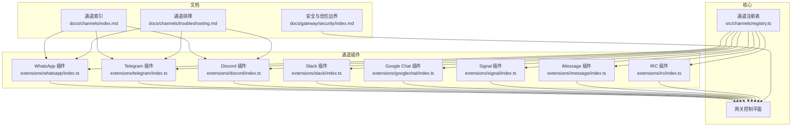
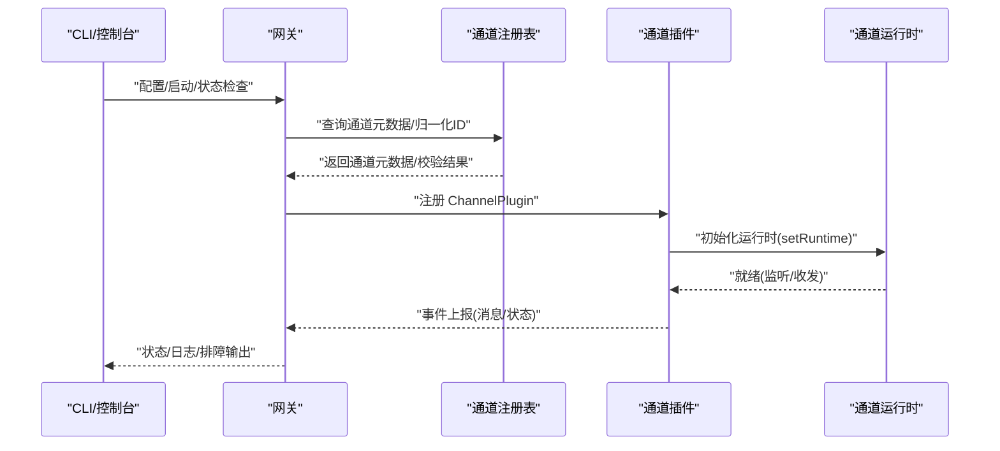
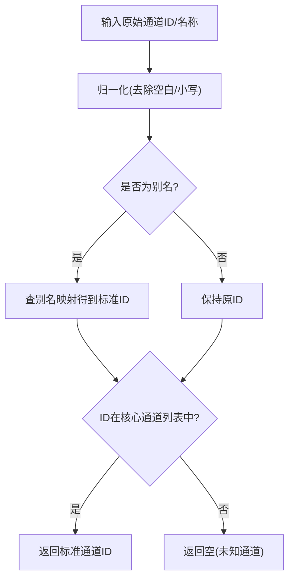
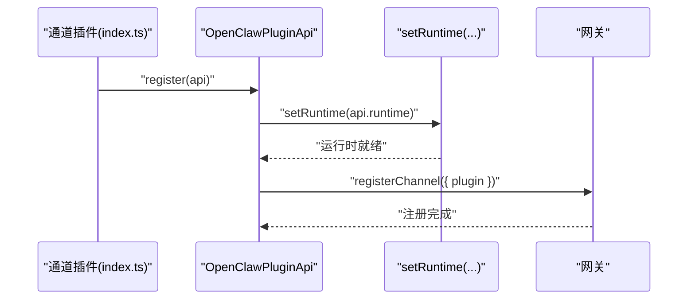
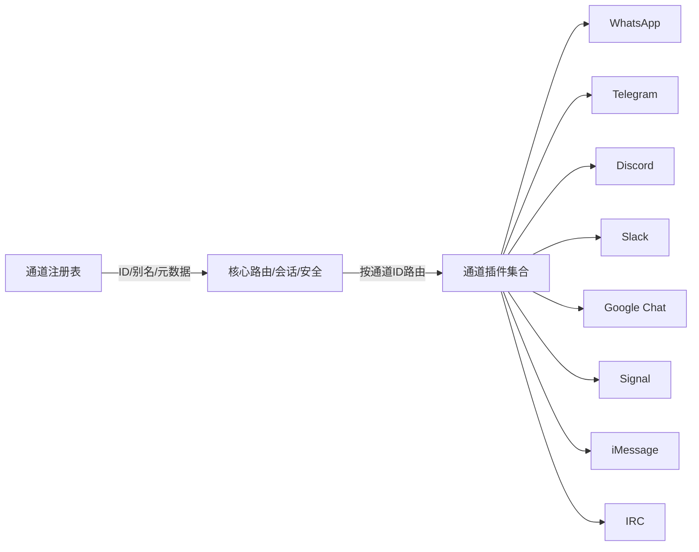

# 多渠道即时通讯集成

<cite>
**本文引用的文件**
- [src/channels/registry.ts](file://src/channels/registry.ts)
- [docs/channels/index.md](file://docs/channels/index.md)
- [docs/channels/troubleshooting.md](file://docs/channels/troubleshooting.md)
- [docs/gateway/security/index.md](file://docs/gateway/security/index.md)
- [extensions/whatsapp/index.ts](file://extensions/whatsapp/index.ts)
- [extensions/telegram/index.ts](file://extensions/telegram/index.ts)
- [extensions/discord/index.ts](file://extensions/discord/index.ts)
- [extensions/signal/index.ts](file://extensions/signal/index.ts)
- [extensions/imessage/index.ts](file://extensions/imessage/index.ts)
- [extensions/irc/index.ts](file://extensions/irc/index.ts)
- [extensions/googlechat/index.ts](file://extensions/googlechat/index.ts)
- [extensions/slack/index.ts](file://extensions/slack/index.ts)
</cite>

## 目录
1. [简介](#简介)
2. [项目结构](#项目结构)
3. [核心组件](#核心组件)
4. [架构总览](#架构总览)
5. [详细组件分析](#详细组件分析)
6. [依赖关系分析](#依赖关系分析)
7. [性能考量](#性能考量)
8. [故障排除指南](#故障排除指南)
9. [结论](#结论)
10. [附录](#附录)

## 简介
本技术文档系统性阐述 OpenClaw 的多渠道即时通讯集成方案，覆盖 20+ 平台（如 WhatsApp、Telegram、Discord、Slack、Google Chat、Signal、iMessage、BlueBubbles、IRC、Microsoft Teams、Matrix、Feishu、LINE、Mattermost、Nextcloud Talk、Nostr、Synology Chat、Tlon、Twitch、Zalo、Zalo Personal、WebChat）。文档从架构设计、通道注册与发现、统一消息模型、会话管理、路由与安全策略、API 规范、错误处理与故障排除等方面进行深入解析，并提供部署实践与最佳实践建议。

## 项目结构
OpenClaw 将“通道能力”以插件形式组织在 extensions 目录下，每个通道插件负责自身协议接入、运行时初始化与事件桥接；核心通道元数据与注册顺序由 src/channels/registry.ts 统一管理；文档层在 docs/channels 提供各通道的使用说明与排障指引；安全与信任边界在 docs/gateway/security 中给出权威指导。

图表来源
- [src/channels/registry.ts:1-201](file://src/channels/registry.ts#L1-L201)
- [extensions/whatsapp/index.ts:1-18](file://extensions/whatsapp/index.ts#L1-L18)
- [extensions/telegram/index.ts:1-18](file://extensions/telegram/index.ts#L1-L18)
- [extensions/discord/index.ts:1-23](file://extensions/discord/index.ts#L1-L23)
- [extensions/slack/index.ts:1-18](file://extensions/slack/index.ts#L1-L18)
- [extensions/googlechat/index.ts:1-18](file://extensions/googlechat/index.ts#L1-L18)
- [extensions/signal/index.ts:1-18](file://extensions/signal/index.ts#L1-L18)
- [extensions/imessage/index.ts:1-18](file://extensions/imessage/index.ts#L1-L18)
- [extensions/irc/index.ts:1-18](file://extensions/irc/index.ts#L1-L18)
- [docs/channels/index.md:1-48](file://docs/channels/index.md#L1-L48)
- [docs/channels/troubleshooting.md:1-119](file://docs/channels/troubleshooting.md#L1-L119)
- [docs/gateway/security/index.md:1-800](file://docs/gateway/security/index.md#L1-L800)

章节来源
- [src/channels/registry.ts:1-201](file://src/channels/registry.ts#L1-L201)
- [docs/channels/index.md:14-37](file://docs/channels/index.md#L14-L37)

## 核心组件
- 通道注册表与元数据：定义通道顺序、别名映射、选择文案与文档链接，提供标准化的通道 ID 归一化与查询工具。
- 通道插件：每个通道以独立插件形式存在，负责注册自身 ChannelPlugin、初始化运行时、可选地注册子代理钩子或 Dock（如 Google Chat）。
- 网关控制平面：负责路由、会话、安全策略、工具策略与执行审批等跨通道一致性的控制面逻辑。
- 文档与排障：提供通道级快速排障清单、安全审计要点与部署建议。

章节来源
- [src/channels/registry.ts:7-121](file://src/channels/registry.ts#L7-L121)
- [src/channels/registry.ts:135-201](file://src/channels/registry.ts#L135-L201)
- [extensions/whatsapp/index.ts:6-15](file://extensions/whatsapp/index.ts#L6-L15)
- [extensions/telegram/index.ts:6-15](file://extensions/telegram/index.ts#L6-L15)
- [extensions/discord/index.ts:7-20](file://extensions/discord/index.ts#L7-L20)
- [extensions/googlechat/index.ts:6-15](file://extensions/googlechat/index.ts#L6-L15)
- [extensions/signal/index.ts:6-15](file://extensions/signal/index.ts#L6-L15)
- [extensions/imessage/index.ts:6-15](file://extensions/imessage/index.ts#L6-L15)
- [extensions/irc/index.ts:6-15](file://extensions/irc/index.ts#L6-L15)
- [extensions/slack/index.ts:6-15](file://extensions/slack/index.ts#L6-L15)

## 架构总览
OpenClaw 采用“插件化通道 + 统一网关”的架构。通道插件通过 OpenClaw Plugin SDK 注册 ChannelPlugin，网关侧仅依赖轻量的通道 ID 归一化与插件注册表，避免在核心路径中加载重型通道实现，从而降低启动与运行时开销。

图表来源
- [src/channels/registry.ts:162-183](file://src/channels/registry.ts#L162-L183)
- [extensions/whatsapp/index.ts:11-14](file://extensions/whatsapp/index.ts#L11-L14)
- [extensions/telegram/index.ts:11-14](file://extensions/telegram/index.ts#L11-L14)
- [extensions/discord/index.ts:12-14](file://extensions/discord/index.ts#L12-L14)
- [extensions/googlechat/index.ts:11-14](file://extensions/googlechat/index.ts#L11-L14)
- [extensions/signal/index.ts:11-14](file://extensions/signal/index.ts#L11-L14)
- [extensions/imessage/index.ts:11-14](file://extensions/imessage/index.ts#L11-L14)
- [extensions/irc/index.ts:11-14](file://extensions/irc/index.ts#L11-L14)
- [extensions/slack/index.ts:11-14](file://extensions/slack/index.ts#L11-L14)

## 详细组件分析

### 通道注册与发现（统一入口）
- 通道顺序与别名：通过 CHAT_CHANNEL_ORDER 与 CHAT_CHANNEL_ALIASES 实现稳定排序与别名兼容，normalizeChatChannelId/normalizeAnyChannelId 提供 ID 归一化与跨插件识别。
- 元数据与文案：label、selectionLabel、detailLabel、docsPath、blurb、systemImage 等字段统一用于 UI 选择与引导。
- 通道扩展点：部分通道（如 Google Chat）支持 dock 模式，允许更灵活的桥接策略。

图表来源
- [src/channels/registry.ts:147-160](file://src/channels/registry.ts#L147-L160)
- [src/channels/registry.ts:166-183](file://src/channels/registry.ts#L166-L183)
- [src/channels/registry.ts:123-128](file://src/channels/registry.ts#L123-L128)

章节来源
- [src/channels/registry.ts:7-121](file://src/channels/registry.ts#L7-L121)
- [src/channels/registry.ts:123-128](file://src/channels/registry.ts#L123-L128)
- [src/channels/registry.ts:135-160](file://src/channels/registry.ts#L135-L160)
- [src/channels/registry.ts:162-183](file://src/channels/registry.ts#L162-L183)

### 通道插件通用注册流程
所有通道插件遵循一致的注册模式：导入 ChannelPlugin、调用 setRuntime 初始化运行时、通过 api.registerChannel 注册到网关。部分通道（如 Discord、Google Chat）还支持额外的钩子或 Dock 扩展。

图表来源
- [extensions/whatsapp/index.ts:11-14](file://extensions/whatsapp/index.ts#L11-L14)
- [extensions/telegram/index.ts:11-14](file://extensions/telegram/index.ts#L11-L14)
- [extensions/discord/index.ts:12-14](file://extensions/discord/index.ts#L12-L14)
- [extensions/googlechat/index.ts:11-14](file://extensions/googlechat/index.ts#L11-L14)
- [extensions/signal/index.ts:11-14](file://extensions/signal/index.ts#L11-L14)
- [extensions/imessage/index.ts:11-14](file://extensions/imessage/index.ts#L11-L14)
- [extensions/irc/index.ts:11-14](file://extensions/irc/index.ts#L11-L14)
- [extensions/slack/index.ts:11-14](file://extensions/slack/index.ts#L11-L14)

章节来源
- [extensions/whatsapp/index.ts:1-18](file://extensions/whatsapp/index.ts#L1-L18)
- [extensions/telegram/index.ts:1-18](file://extensions/telegram/index.ts#L1-L18)
- [extensions/discord/index.ts:1-23](file://extensions/discord/index.ts#L1-L23)
- [extensions/googlechat/index.ts:1-18](file://extensions/googlechat/index.ts#L1-L18)
- [extensions/signal/index.ts:1-18](file://extensions/signal/index.ts#L1-L18)
- [extensions/imessage/index.ts:1-18](file://extensions/imessage/index.ts#L1-L18)
- [extensions/irc/index.ts:1-18](file://extensions/irc/index.ts#L1-L18)
- [extensions/slack/index.ts:1-18](file://extensions/slack/index.ts#L1-L18)

### 统一消息模型与会话管理
- 会话隔离：支持 per-channel-peer 或 per-account-channel-peer 等隔离级别，避免跨用户上下文泄露。
- DM 访问模型：pairing/allowlist/open/disabled 四种 DM 策略，配合 allowFrom 与 groupPolicy 实现细粒度入站控制。
- 跨平台一致性：通过通道插件暴露统一的 ChannelPlugin 接口，网关侧按通道 ID 路由消息，确保行为一致性。

章节来源
- [docs/gateway/security/index.md:456-497](file://docs/gateway/security/index.md#L456-L497)
- [docs/gateway/security/index.md:498-514](file://docs/gateway/security/index.md#L498-L514)

### 安全策略与信任边界
- 个人助理模型：单操作者边界假设，不支持多租户强隔离；混合信任团队应拆分信任边界。
- 网关与节点信任概念：Gateway 控制面与 Node 执行面角色分离，sessionKey 仅为路由键而非授权令牌。
- 工具与浏览器控制：默认收紧工具策略，严格限制 exec/browser 等高风险能力；远程节点需显式配对与审批。
- 反向代理与 HSTS：明确受信代理配置与头处理，避免身份伪造与 DNS 重绑定风险。

章节来源
- [docs/gateway/security/index.md:8-48](file://docs/gateway/security/index.md#L8-L48)
- [docs/gateway/security/index.md:98-123](file://docs/gateway/security/index.md#L98-L123)
- [docs/gateway/security/index.md:319-360](file://docs/gateway/security/index.md#L319-L360)

### API 接口规范（通道侧）
- 通道插件通过 OpenClaw Plugin SDK 导出 ChannelPlugin，并在 register 中完成运行时注入与注册。
- 通道插件导出的运行时初始化函数（如 setWhatsAppRuntime、setTelegramRuntime 等）负责建立与平台的连接、事件监听与消息转发。
- 部分通道（如 Google Chat）提供 dock 能力，允许更灵活的桥接与路由策略。

章节来源
- [extensions/whatsapp/index.ts:1-18](file://extensions/whatsapp/index.ts#L1-L18)
- [extensions/telegram/index.ts:1-18](file://extensions/telegram/index.ts#L1-L18)
- [extensions/discord/index.ts:1-23](file://extensions/discord/index.ts#L1-L23)
- [extensions/googlechat/index.ts:1-18](file://extensions/googlechat/index.ts#L1-L18)
- [extensions/signal/index.ts:1-18](file://extensions/signal/index.ts#L1-L18)
- [extensions/imessage/index.ts:1-18](file://extensions/imessage/index.ts#L1-L18)
- [extensions/irc/index.ts:1-18](file://extensions/irc/index.ts#L1-L18)
- [extensions/slack/index.ts:1-18](file://extensions/slack/index.ts#L1-L18)

### 错误处理与故障排除
- 通道级排障清单：针对 WhatsApp、Telegram、Discord、Slack、iMessage/BlueBubbles、Signal、Matrix 等提供症状-检查-修复三段式清单。
- 命令阶梯：openclaw status/gateway status/logs/doctor/channels status --probe 作为快速诊断路径。
- 安全审计：定期运行 openclaw security audit，定位网络暴露、权限、工具策略、插件可达性等高风险项。

章节来源
- [docs/channels/troubleshooting.md:13-23](file://docs/channels/troubleshooting.md#L13-L23)
- [docs/channels/troubleshooting.md:31-119](file://docs/channels/troubleshooting.md#L31-L119)
- [docs/gateway/security/index.md:26-37](file://docs/gateway/security/index.md#L26-L37)

## 依赖关系分析
- 低耦合：核心仅依赖通道 ID 归一化与插件注册表，不直接导入通道实现，避免“核心路径”被重型通道拉垮。
- 可扩展：新增通道只需在 registry.ts 增补顺序与元数据、在 extensions 下实现插件并注册 ChannelPlugin。
- 文档驱动：通道元数据中的 docsPath 与 selectionLabel 为 UI 与 CLI 提供一致的导航与说明。

图表来源
- [src/channels/registry.ts:1-201](file://src/channels/registry.ts#L1-L201)
- [extensions/whatsapp/index.ts:1-18](file://extensions/whatsapp/index.ts#L1-L18)
- [extensions/telegram/index.ts:1-18](file://extensions/telegram/index.ts#L1-L18)
- [extensions/discord/index.ts:1-23](file://extensions/discord/index.ts#L1-L23)
- [extensions/slack/index.ts:1-18](file://extensions/slack/index.ts#L1-L18)
- [extensions/googlechat/index.ts:1-18](file://extensions/googlechat/index.ts#L1-L18)
- [extensions/signal/index.ts:1-18](file://extensions/signal/index.ts#L1-L18)
- [extensions/imessage/index.ts:1-18](file://extensions/imessage/index.ts#L1-L18)
- [extensions/irc/index.ts:1-18](file://extensions/irc/index.ts#L1-L18)

章节来源
- [src/channels/registry.ts:1-201](file://src/channels/registry.ts#L1-L201)

## 性能考量
- 启动与内存：通过延迟加载通道实现、仅在需要时初始化运行时，减少启动时间与常驻内存占用。
- 路由与并发：通道事件经由统一网关路由，结合会话隔离策略，避免跨通道状态竞争。
- 网络与代理：反向代理需正确透传 X-Forwarded-For，避免客户端 IP 误判导致的鉴权绕过与风控失效。

## 故障排除指南
- 快速命令阶梯：openclaw status → openclaw gateway status → openclaw logs --follow → openclaw doctor → openclaw channels status --probe。
- 通道级排障：按通道症状清单逐项核对，优先检查配对/允许名单、提及策略、网络连通性与凭证健康度。
- 安全审计：定期运行 openclaw security audit，修复高危问题（如公开绑定、弱认证、危险工具策略、插件可达性等）。

章节来源
- [docs/channels/troubleshooting.md:13-23](file://docs/channels/troubleshooting.md#L13-L23)
- [docs/channels/troubleshooting.md:31-119](file://docs/channels/troubleshooting.md#L31-L119)
- [docs/gateway/security/index.md:26-37](file://docs/gateway/security/index.md#L26-L37)

## 结论
OpenClaw 通过“通道插件 + 统一网关”的架构，实现了对 20+ 即时通讯平台的一致接入与治理。通道注册表提供稳定的元数据与 ID 归一化，通道插件遵循统一的注册与运行时初始化流程，网关侧则集中处理路由、会话、安全与工具策略，确保跨平台一致性与可运维性。配合完善的文档与排障体系，OpenClaw 能够在个人助理与团队协作场景中提供安全、可控且高性能的多渠道消息体验。

## 附录
- 通道清单与文档索引：参见 [docs/channels/index.md:14-37](file://docs/channels/index.md#L14-L37)。
- 安全基线与审计：参见 [docs/gateway/security/index.md:146-171](file://docs/gateway/security/index.md#L146-L171)。
- 通道排障速查：参见 [docs/channels/troubleshooting.md:31-119](file://docs/channels/troubleshooting.md#L31-L119)。