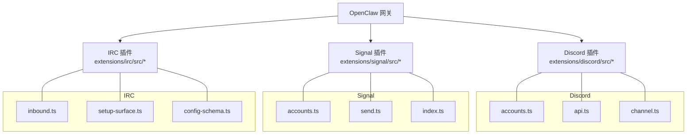
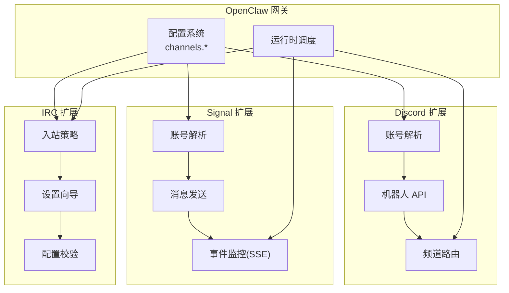
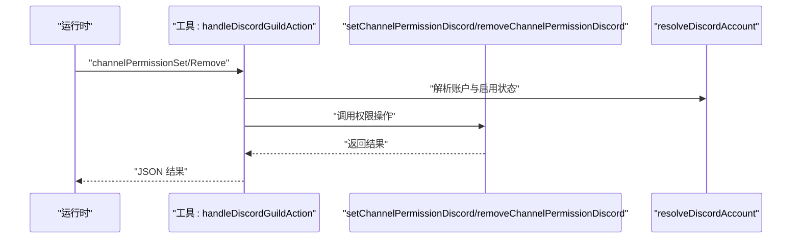
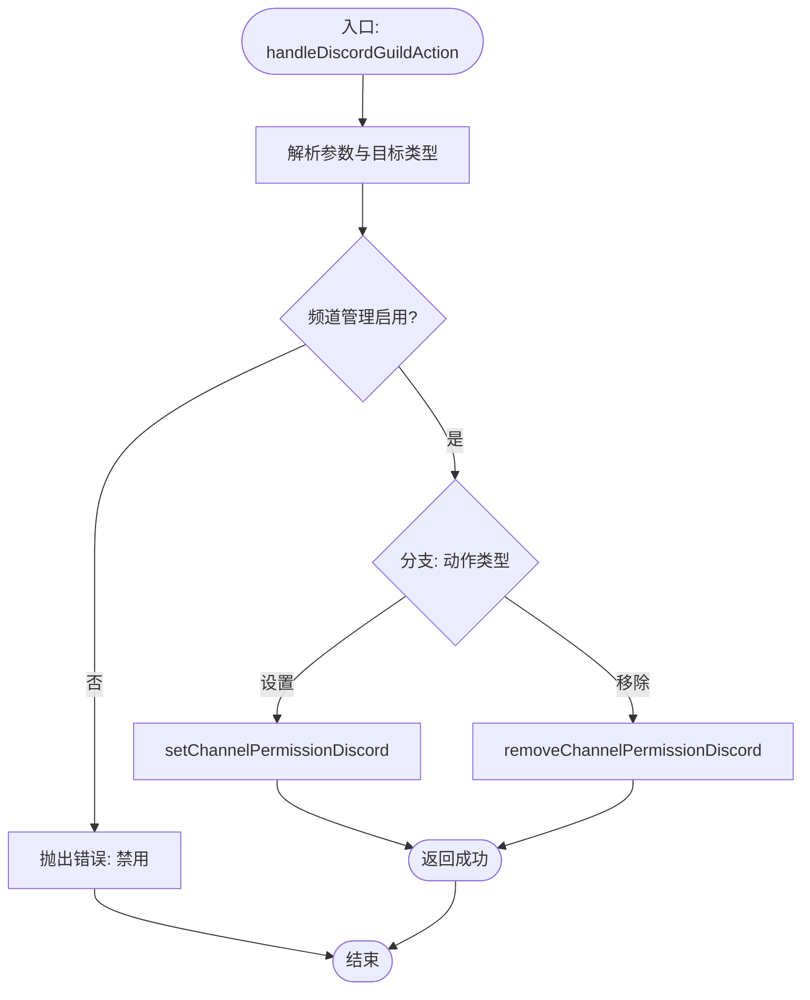
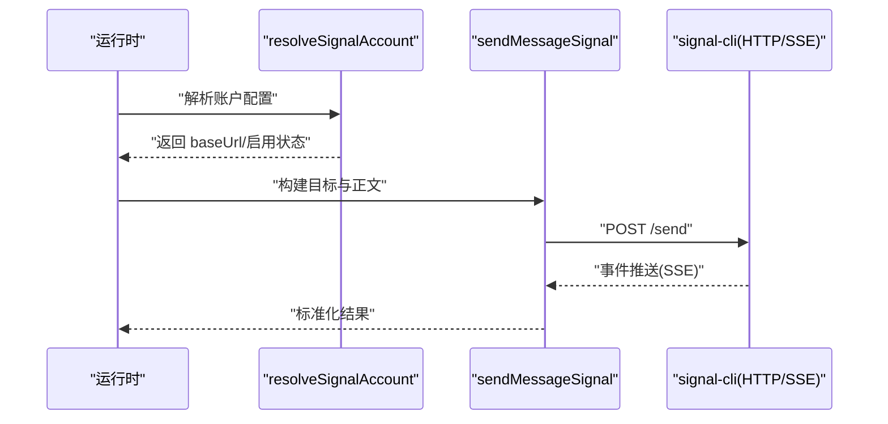
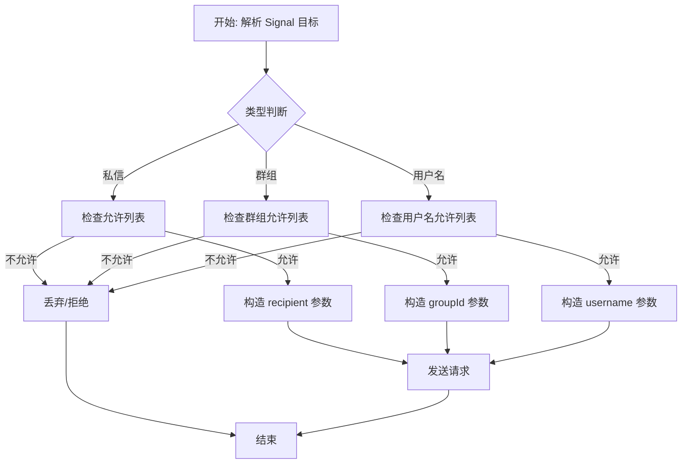
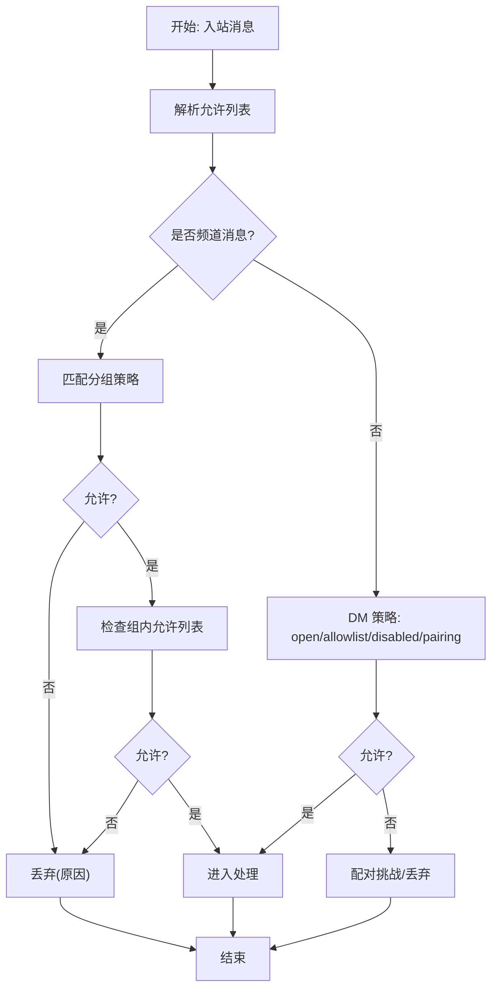
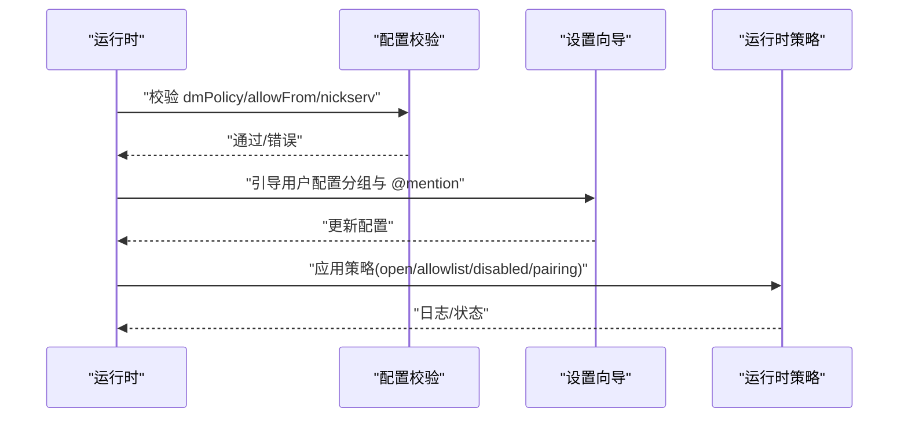
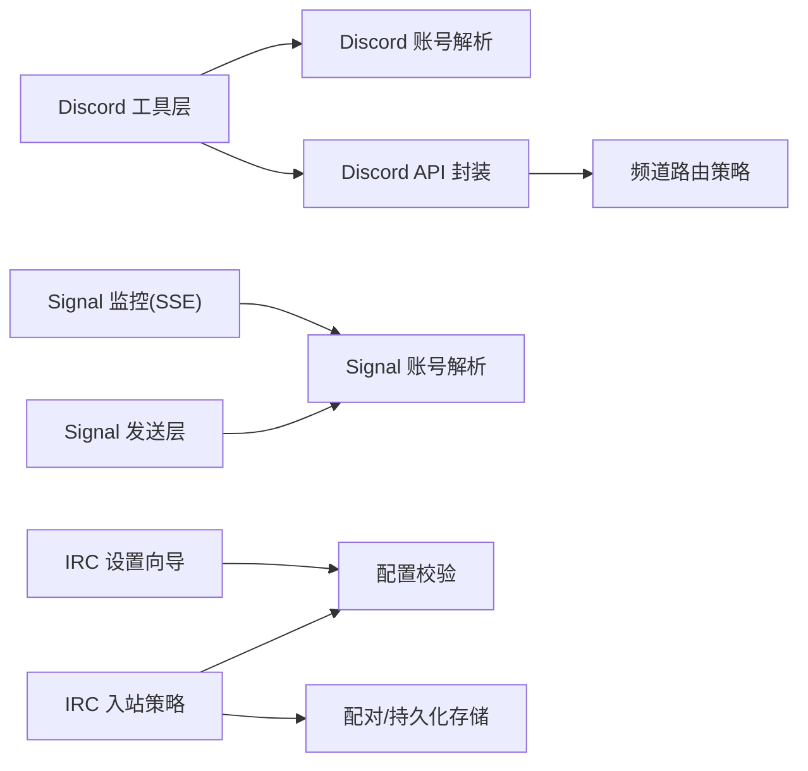

# 桌面端社交平台

<cite>
**本文引用的文件**
- [extensions/discord/src/channel.ts](file://extensions/discord/src/channel.ts)
- [extensions/discord/src/accounts.ts](file://extensions/discord/src/accounts.ts)
- [extensions/discord/src/api.ts](file://extensions/discord/src/api.ts)
- [src/agents/tools/discord-actions-guild.ts](file://src/agents/tools/discord-actions-guild.ts)
- [src/agents/tools/discord-actions.test.ts](file://src/agents/tools/discord-actions.test.ts)
- [extensions/signal/src/index.ts](file://extensions/signal/src/index.ts)
- [extensions/signal/src/accounts.ts](file://extensions/signal/src/accounts.ts)
- [extensions/signal/src/send.ts](file://extensions/signal/src/send.ts)
- [docs/zh-CN/channels/signal.md](file://docs/zh-CN/channels/signal.md)
- [extensions/irc/src/inbound.ts](file://extensions/irc/src/inbound.ts)
- [extensions/irc/src/setup-surface.ts](file://extensions/irc/src/setup-surface.ts)
- [extensions/irc/src/config-schema.ts](file://extensions/irc/src/config-schema.ts)
- [src/config/zod-schema.providers-core.ts](file://src/config/zod-schema.providers-core.ts)
</cite>

## 目录
1. [简介](#简介)
2. [项目结构](#项目结构)
3. [核心组件](#核心组件)
4. [架构总览](#架构总览)
5. [详细组件分析](#详细组件分析)
6. [依赖关系分析](#依赖关系分析)
7. [性能考量](#性能考量)
8. [故障排除指南](#故障排除指南)
9. [结论](#结论)
10. [附录](#附录)

## 简介
本技术文档面向桌面端社交即时通讯平台的集成与运维，聚焦于 Discord、Signal 与 IRC 三大渠道在 OpenClaw 生态中的实现与最佳实践。内容涵盖：
- Discord 机器人 API 的配置、权限管理、服务器与频道路由策略
- Signal 的 signal-cli 集成、隐私保护机制与消息加密要点
- IRC 的连接管理、频道加入与 DM 处理
- 配置示例、API 调用规范、错误处理与安全建议
- 实际部署案例与常见问题排查

## 项目结构
OpenClaw 采用“核心网关 + 插件通道”的模块化设计。桌面端社交平台通过扩展插件接入，分别位于：
- Discord 扩展：extensions/discord
- Signal 扩展：extensions/signal
- IRC 扩展：extensions/irc

各扩展负责：
- 连接建立与事件监听
- 入站消息解析与出站消息发送
- 访问控制与路由策略
- 配置校验与运行时参数解析

图表来源
- [extensions/discord/src/accounts.ts](file://extensions/discord/src/accounts.ts)
- [extensions/discord/src/api.ts](file://extensions/discord/src/api.ts)
- [extensions/discord/src/channel.ts](file://extensions/discord/src/channel.ts)
- [extensions/signal/src/accounts.ts](file://extensions/signal/src/accounts.ts)
- [extensions/signal/src/send.ts](file://extensions/signal/src/send.ts)
- [extensions/signal/src/index.ts](file://extensions/signal/src/index.ts)
- [extensions/irc/src/inbound.ts](file://extensions/irc/src/inbound.ts)
- [extensions/irc/src/setup-surface.ts](file://extensions/irc/src/setup-surface.ts)
- [extensions/irc/src/config-schema.ts](file://extensions/irc/src/config-schema.ts)

章节来源
- [extensions/discord/src/accounts.ts](file://extensions/discord/src/accounts.ts)
- [extensions/discord/src/api.ts](file://extensions/discord/src/api.ts)
- [extensions/discord/src/channel.ts](file://extensions/discord/src/channel.ts)
- [extensions/signal/src/accounts.ts](file://extensions/signal/src/accounts.ts)
- [extensions/signal/src/send.ts](file://extensions/signal/src/send.ts)
- [extensions/signal/src/index.ts](file://extensions/signal/src/index.ts)
- [extensions/irc/src/inbound.ts](file://extensions/irc/src/inbound.ts)
- [extensions/irc/src/setup-surface.ts](file://extensions/irc/src/setup-surface.ts)
- [extensions/irc/src/config-schema.ts](file://extensions/irc/src/config-schema.ts)

## 核心组件
- Discord
  - 账号解析与启用判定：解析账户配置、合并全局与账户级配置、计算启用状态与基础访问控制
  - 机器人 API：封装频道与权限操作，支持分类编辑、删除、权限设置与移除
  - 频道路由：基于服务器与频道的策略解析，结合 allowlist 与系统提示控制
- Signal
  - 账户解析：统一 httpHost/httpPort/httpUrl/cliPath/autoStart 等参数，生成可访问的 baseUrl
  - 目标解析：支持私信、群组、用户名三种投递目标，结合 allowlist 控制发送范围
  - 工作流：通过 signal-cli 守护进程（HTTP JSON-RPC + SSE）收发消息，支持输入指示器与已读回执
- IRC
  - 入站策略：综合配置 allowFrom/groupAllowFrom 与持久化存储的允许列表，区分频道与私聊策略
  - 运行时策略：支持 open/allowlist/disabled/pairing 等 DM 策略，结合 NickServ 注册与分组策略
  - 配置校验：对 dmPolicy 与 allowFrom 的组合进行严格校验，确保安全策略一致

章节来源
- [extensions/discord/src/accounts.ts](file://extensions/discord/src/accounts.ts)
- [extensions/discord/src/api.ts](file://extensions/discord/src/api.ts)
- [src/agents/tools/discord-actions-guild.ts](file://src/agents/tools/discord-actions-guild.ts)
- [extensions/signal/src/accounts.ts](file://extensions/signal/src/accounts.ts)
- [extensions/signal/src/send.ts](file://extensions/signal/src/send.ts)
- [extensions/irc/src/inbound.ts](file://extensions/irc/src/inbound.ts)
- [extensions/irc/src/setup-surface.ts](file://extensions/irc/src/setup-surface.ts)
- [src/config/zod-schema.providers-core.ts](file://src/config/zod-schema.providers-core.ts)

## 架构总览
下图展示 OpenClaw 网关与三大社交平台扩展的交互关系与数据流。

图表来源
- [extensions/discord/src/accounts.ts](file://extensions/discord/src/accounts.ts)
- [extensions/discord/src/api.ts](file://extensions/discord/src/api.ts)
- [extensions/discord/src/channel.ts](file://extensions/discord/src/channel.ts)
- [extensions/signal/src/accounts.ts](file://extensions/signal/src/accounts.ts)
- [extensions/signal/src/send.ts](file://extensions/signal/src/send.ts)
- [extensions/signal/src/index.ts](file://extensions/signal/src/index.ts)
- [extensions/irc/src/inbound.ts](file://extensions/irc/src/inbound.ts)
- [extensions/irc/src/setup-surface.ts](file://extensions/irc/src/setup-surface.ts)
- [extensions/irc/src/config-schema.ts](file://extensions/irc/src/config-schema.ts)

## 详细组件分析

### Discord 组件分析
- 账号解析与启用判定
  - 合并全局与账户级配置，计算启用状态与基础访问控制
  - 依据配置决定是否启用频道管理类动作
- 机器人 API 动作
  - 支持分类编辑、删除、权限设置与移除
  - 参数校验与类型转换（如 targetType 由字符串映射为数值）
- 频道路由策略
  - 基于服务器与频道的策略解析，结合 allowlist 与系统提示控制
  - 测试覆盖了不同 target 类型与 allow/deny 权限的预期行为

图表来源
- [src/agents/tools/discord-actions-guild.ts](file://src/agents/tools/discord-actions-guild.ts)
- [extensions/discord/src/accounts.ts](file://extensions/discord/src/accounts.ts)

图表来源
- [src/agents/tools/discord-actions-guild.ts](file://src/agents/tools/discord-actions-guild.ts)

章节来源
- [extensions/discord/src/accounts.ts](file://extensions/discord/src/accounts.ts)
- [extensions/discord/src/api.ts](file://extensions/discord/src/api.ts)
- [src/agents/tools/discord-actions-guild.ts](file://src/agents/tools/discord-actions-guild.ts)
- [src/agents/tools/discord-actions.test.ts](file://src/agents/tools/discord-actions.test.ts)

### Signal 组件分析
- 账号解析
  - 解析 httpHost/httpPort/httpUrl/cliPath/autoStart 等参数，生成可访问的 baseUrl
  - 判断是否已配置，用于后续启动或外部守护进程模式
- 目标解析与发送
  - 支持私信(recipient)、群组(groupId)、用户名(username)三种目标
  - 结合 allowlist 控制发送范围，避免越权
- 工作流与能力
  - 通过 signal-cli 守护进程(HTTP JSON-RPC + SSE)收发消息
  - 支持输入指示器与已读回执（私信），群组不暴露已读回执
  - 文本分块、媒体限制、附件处理等能力由配置项控制

图表来源
- [extensions/signal/src/accounts.ts](file://extensions/signal/src/accounts.ts)
- [extensions/signal/src/send.ts](file://extensions/signal/src/send.ts)
- [extensions/signal/src/index.ts](file://extensions/signal/src/index.ts)

图表来源
- [extensions/signal/src/send.ts](file://extensions/signal/src/send.ts)

章节来源
- [extensions/signal/src/accounts.ts](file://extensions/signal/src/accounts.ts)
- [extensions/signal/src/send.ts](file://extensions/signal/src/send.ts)
- [extensions/signal/src/index.ts](file://extensions/signal/src/index.ts)
- [docs/zh-CN/channels/signal.md](file://docs/zh-CN/channels/signal.md)

### IRC 组件分析
- 入站策略
  - 综合 channels.allowFrom 与账户级 groupAllowFrom、持久化存储的 allowFrom
  - 区分频道与私聊策略，频道场景不回退到 allowFrom
- 运行时策略
  - 支持 open/allowlist/disabled/pairing 等 DM 策略
  - 支持 NickServ 注册邮箱校验与分组策略
- 配置校验
  - 对 dmPolicy 与 allowFrom 的组合进行严格校验，确保策略一致性

图表来源
- [extensions/irc/src/inbound.ts](file://extensions/irc/src/inbound.ts)
- [src/config/zod-schema.providers-core.ts](file://src/config/zod-schema.providers-core.ts)

图表来源
- [extensions/irc/src/setup-surface.ts](file://extensions/irc/src/setup-surface.ts)
- [extensions/irc/src/config-schema.ts](file://extensions/irc/src/config-schema.ts)
- [src/config/zod-schema.providers-core.ts](file://src/config/zod-schema.providers-core.ts)

章节来源
- [extensions/irc/src/inbound.ts](file://extensions/irc/src/inbound.ts)
- [extensions/irc/src/setup-surface.ts](file://extensions/irc/src/setup-surface.ts)
- [extensions/irc/src/config-schema.ts](file://extensions/irc/src/config-schema.ts)
- [src/config/zod-schema.providers-core.ts](file://src/config/zod-schema.providers-core.ts)

## 依赖关系分析
- 组件耦合
  - Discord：工具层依赖账户解析与 API 层；频道路由依赖配置解析
  - Signal：发送层依赖账户解析；监控层依赖 SSE 事件
  - IRC：入站策略依赖配置与持久化存储；设置向导依赖运行时策略
- 外部依赖
  - Discord：Discord Bot API
  - Signal：signal-cli 守护进程(HTTP + SSE)
  - IRC：IRC 服务器、NickServ、TLS/认证

图表来源
- [extensions/discord/src/accounts.ts](file://extensions/discord/src/accounts.ts)
- [extensions/discord/src/api.ts](file://extensions/discord/src/api.ts)
- [extensions/signal/src/accounts.ts](file://extensions/signal/src/accounts.ts)
- [extensions/signal/src/index.ts](file://extensions/signal/src/index.ts)
- [extensions/irc/src/inbound.ts](file://extensions/irc/src/inbound.ts)
- [extensions/irc/src/setup-surface.ts](file://extensions/irc/src/setup-surface.ts)
- [extensions/irc/src/config-schema.ts](file://extensions/irc/src/config-schema.ts)

## 性能考量
- Signal
  - 文本分块与媒体限制：通过 textChunkLimit、chunkMode、mediaMaxMb 控制吞吐与带宽
  - 启动等待：startupTimeoutMs 控制自动启动等待时间，避免长时间阻塞
- IRC
  - 允许列表缓存与匹配：减少每次入站消息的复杂度
  - 分组策略：仅在频道场景启用，降低私聊策略开销
- Discord
  - 权限批量设置：在工具层聚合权限变更，减少 API 调用次数

## 故障排除指南
- Signal
  - 现象：无法接收/发送消息
  - 排查：确认 signal-cli 守护进程运行、HTTP 地址可达、autoStart 配置正确
  - 参考：[docs/zh-CN/channels/signal.md](file://docs/zh-CN/channels/signal.md)
- IRC
  - 现象：私聊被拒绝或需要配对
  - 排查：检查 channels.irc.dmPolicy 与 allowFrom；使用 openclaw pairing 列表与批准
  - 参考：[extensions/irc/src/inbound.ts](file://extensions/irc/src/inbound.ts)
- Discord
  - 现象：频道管理类动作失败
  - 排查：确认 channels.enabled 与动作开关；检查 targetType 与权限位
  - 参考：[src/agents/tools/discord-actions-guild.ts](file://src/agents/tools/discord-actions-guild.ts)

章节来源
- [docs/zh-CN/channels/signal.md](file://docs/zh-CN/channels/signal.md)
- [extensions/irc/src/inbound.ts](file://extensions/irc/src/inbound.ts)
- [src/agents/tools/discord-actions-guild.ts](file://src/agents/tools/discord-actions-guild.ts)

## 结论
OpenClaw 通过模块化的扩展架构，为 Discord、Signal 与 IRC 提供了统一的接入与治理能力。在安全方面，三者均采用严格的 allowlist 与策略控制；在可用性方面，提供了完善的配置校验、运行时策略与可观测性。建议在生产环境中：
- 明确各渠道的 DM 与群组策略，优先使用 allowlist
- 合理配置 Signal 的分块与媒体限制，优化吞吐
- 为 IRC 正确设置 NickServ 与分组策略，确保稳定与安全

## 附录
- 配置参考与示例
  - Signal：见 [docs/zh-CN/channels/signal.md](file://docs/zh-CN/channels/signal.md)
  - IRC：见 [extensions/irc/src/config-schema.ts](file://extensions/irc/src/config-schema.ts)
  - Discord：见 [extensions/discord/src/accounts.ts](file://extensions/discord/src/accounts.ts) 与 [extensions/discord/src/api.ts](file://extensions/discord/src/api.ts)