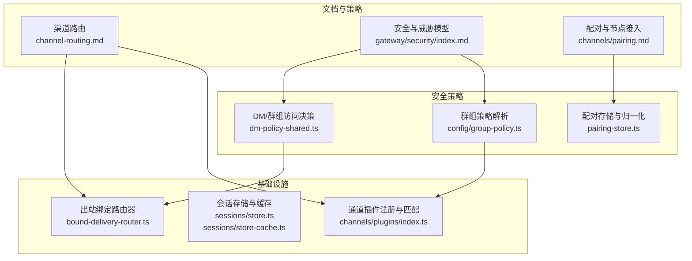
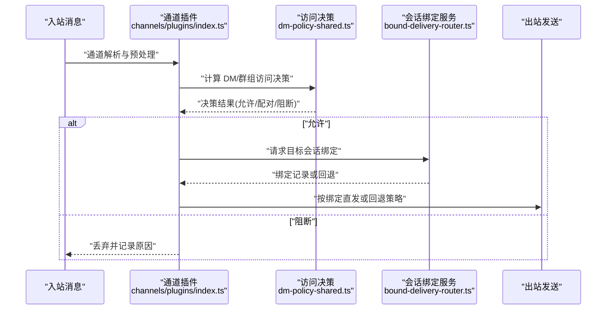
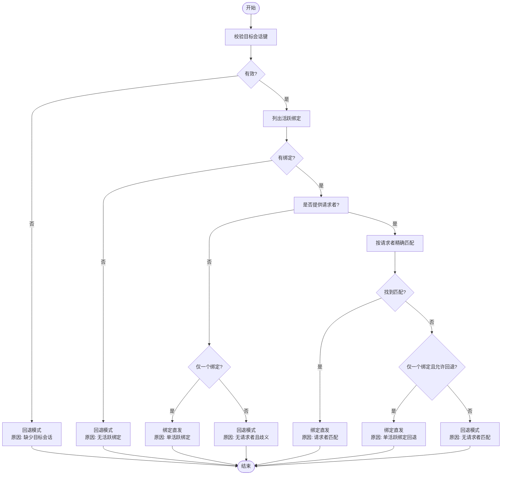
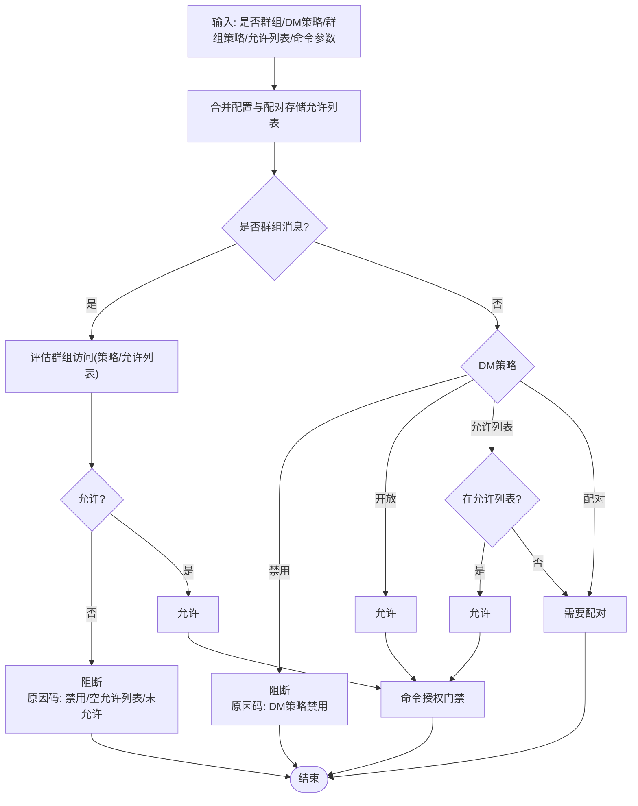
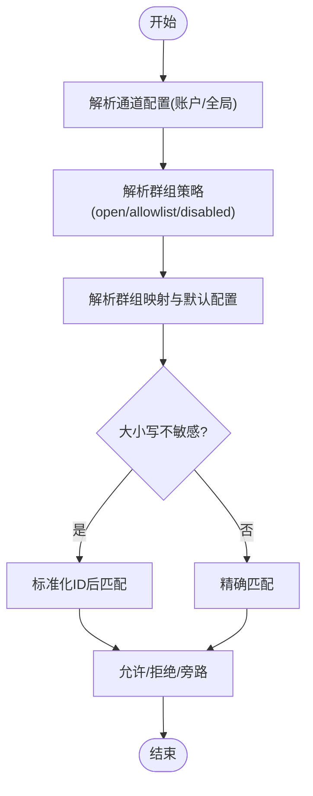
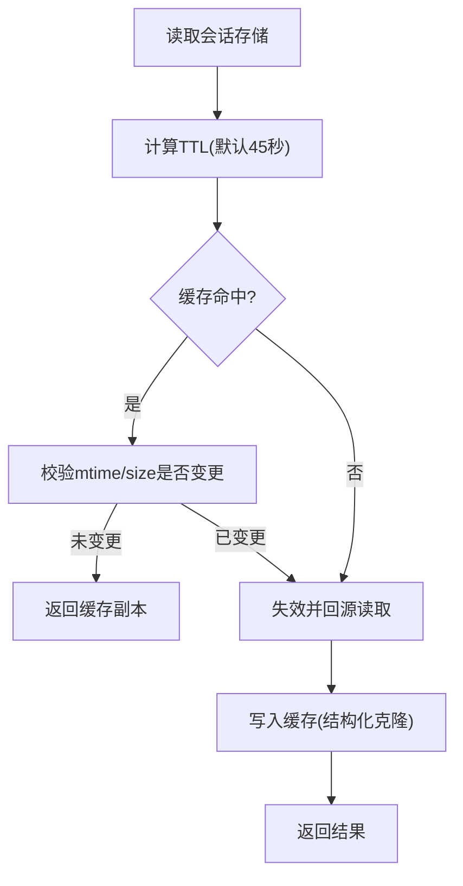
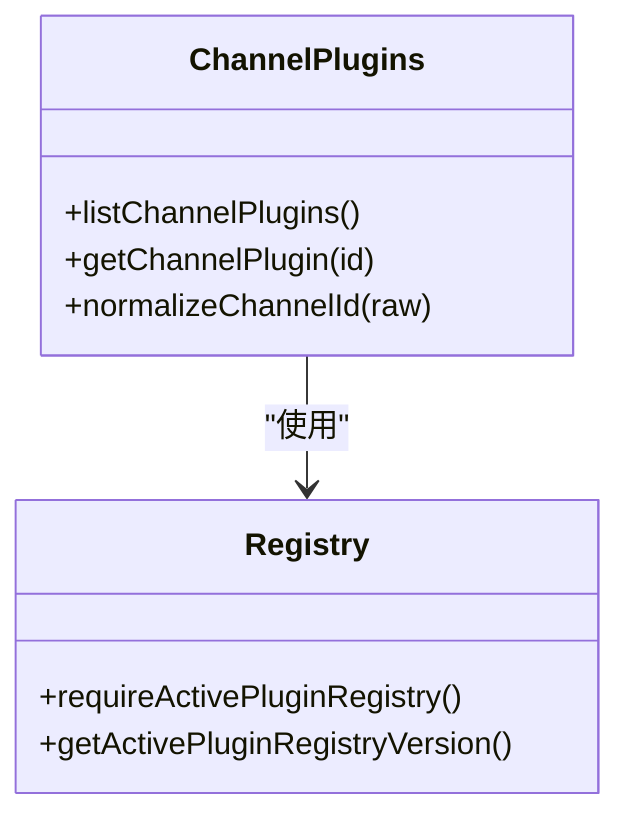
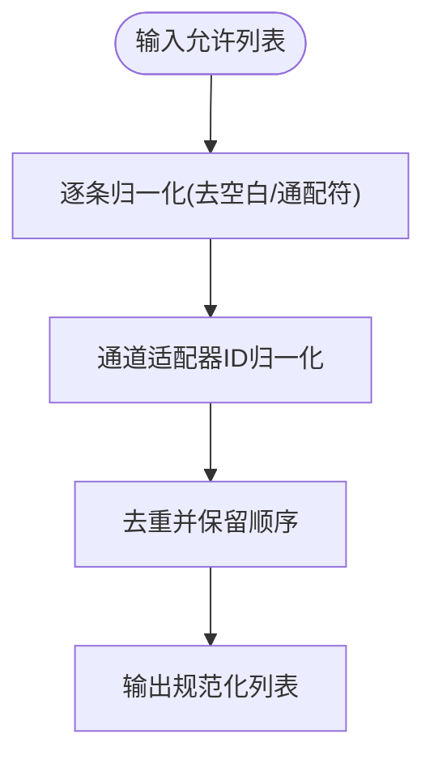
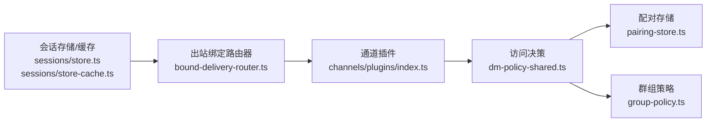

# 渠道路由与安全策略

<cite>
**本文引用的文件**
- [channel-routing.md](file://docs/channels/channel-routing.md)
- [index.md](file://docs/gateway/security/index.md)
- [dm-policy-shared.ts](file://src/security/dm-policy-shared.ts)
- [bound-delivery-router.ts](file://src/infra/outbound/bound-delivery-router.ts)
- [helpers.ts](file://src/channels/plugins/helpers.ts)
- [setup-wizard.ts](file://src/channels/plugins/setup-wizard.ts)
- [policy.ts](file://extensions/slack/src/monitor/policy.ts)
- [group-policy.ts](file://src/config/group-policy.ts)
- [store.ts](file://src/config/sessions/store.ts)
- [store-cache.ts](file://src/config/sessions/store-cache.ts)
- [session-manager-cache.ts](file://src/agents/pi-embedded-runner/session-manager-cache.ts)
- [pairing-store.ts](file://src/pairing/pairing-store.ts)
- [dm-policy-channel-smoke.test.ts](file://src/security/dm-policy-channel-smoke.test.ts)
- [monitor.ts](file://extensions/zalouser/src/monitor.ts)
- [monitor-access.ts](file://extensions/googlechat/src/monitor-access.ts)
- [audit-channel.ts](file://src/security/audit-channel.ts)
- [pairing.md](file://docs/channels/pairing.md)
</cite>

## 目录
1. [引言](#引言)
2. [项目结构](#项目结构)
3. [核心组件](#核心组件)
4. [架构总览](#架构总览)
5. [详细组件分析](#详细组件分析)
6. [依赖关系分析](#依赖关系分析)
7. [性能考量](#性能考量)
8. [故障排查指南](#故障排查指南)
9. [结论](#结论)
10. [附录](#附录)

## 引言
本文件面向 OpenClaw 的多渠道消息路由与安全策略，系统化阐述以下主题：
- 多渠道消息路由机制：入站消息如何被识别、绑定到会话与代理，以及回复路径的确定性路由原则。
- 会话管理与跨平台一致性：会话键生成规则、主 DM 路由固定、广播组策略与跨通道上下文一致性。
- 渠道配对机制：DM 配对（允许列表）与节点配对（设备接入）的存储与审批流程。
- 允许列表控制：DM 允许列表、群组允许列表与命令授权的协同决策模型。
- 地理位置限制与安全访问策略：结合网关绑定、认证、反向代理与 HSTS 等部署面安全实践。
- 群组消息处理、DM 安全性与企业级合规：分层访问控制、提示注入缓解、工具策略与沙箱。
- 安全审计指南、威胁防护与应急响应流程：基于官方安全审计检查项与风险矩阵。

## 项目结构
OpenClaw 将“路由”与“安全”两大能力分别沉淀在文档、基础设施与插件监控模块中：
- 文档层：渠道路由与安全策略的权威说明与最佳实践。
- 基础设施层：出站绑定路由器、会话存储与缓存、通道插件注册与匹配。
- 安全策略层：DM/群组访问决策、命令授权门禁、审计与告警。

图表来源
- [channel-routing.md:1-140](file://docs/channels/channel-routing.md#L1-L140)
- [index.md:1-800](file://docs/gateway/security/index.md#L1-L800)
- [bound-delivery-router.ts:1-132](file://src/infra/outbound/bound-delivery-router.ts#L1-L132)
- [store.ts:46-67](file://src/config/sessions/store.ts#L46-L67)
- [store-cache.ts:37-81](file://src/config/sessions/store-cache.ts#L37-L81)
- [dm-policy-shared.ts:1-333](file://src/security/dm-policy-shared.ts#L1-L333)
- [group-policy.ts:282-359](file://src/config/group-policy.ts#L282-L359)
- [pairing-store.ts:239-275](file://src/pairing/pairing-store.ts#L239-L275)

章节来源
- [channel-routing.md:1-140](file://docs/channels/channel-routing.md#L1-L140)
- [index.md:1-800](file://docs/gateway/security/index.md#L1-L800)

## 核心组件
- 出站绑定路由器：根据目标会话键与请求者信息解析绑定记录，决定“绑定直发”或“回退”模式，确保回复路径与会话绑定一致。
- DM/群组访问决策：统一处理 DM 策略（开放/配对/允许列表/禁用）、群组策略（开放/允许列表/禁用）与命令授权门禁，输出可审计的决策原因码。
- 群组策略解析：按账户维度解析群组默认配置、允许列表与通配符策略，支持大小写不敏感匹配与发送方过滤旁路。
- 会话存储与缓存：提供会话存储的 TTL 缓存、对象缓存与序列化缓存，降低磁盘 IO 并提升启动与查询性能。
- 通道插件注册与匹配：集中化管理通道插件，按顺序与元数据排序，提供通道规范化与匹配配置解析。
- 配对存储与归一化：通道级允许列表的归一化、去重与兼容性处理，支持默认账户与非默认账户的隔离写入。

章节来源
- [bound-delivery-router.ts:1-132](file://src/infra/outbound/bound-delivery-router.ts#L1-L132)
- [dm-policy-shared.ts:1-333](file://src/security/dm-policy-shared.ts#L1-L333)
- [group-policy.ts:282-359](file://src/config/group-policy.ts#L282-L359)
- [store.ts:46-67](file://src/config/sessions/store.ts#L46-L67)
- [store-cache.ts:37-81](file://src/config/sessions/store-cache.ts#L37-L81)
- [channels/plugins/index.ts:1-118](file://src/channels/plugins/index.ts#L1-L118)
- [pairing-store.ts:239-275](file://src/pairing/pairing-store.ts#L239-L275)

## 架构总览
下图展示从入站消息到出站回复的关键路径：通道插件负责解析与安全决策，会话绑定服务决定路由目标，出站绑定路由器确保回复路径与会话绑定一致。

图表来源
- [channels/plugins/index.ts:1-118](file://src/channels/plugins/index.ts#L1-L118)
- [dm-policy-shared.ts:105-225](file://src/security/dm-policy-shared.ts#L105-L225)
- [bound-delivery-router.ts:55-132](file://src/infra/outbound/bound-delivery-router.ts#L55-L132)

## 详细组件分析

### 组件A：出站绑定路由器
- 功能要点
  - 输入包含事件类型、目标会话键与请求者信息；输出包含绑定记录、模式（绑定直发/回退）与原因。
  - 支持按请求者精确匹配、单绑定回退与失败关闭策略。
- 关键流程
  - 校验目标会话键与请求者合法性。
  - 列举该会话的活跃绑定，优先精确匹配请求者；否则在单绑定且允许回退时直发；否则回退。
- 性能与可靠性
  - 通过会话绑定服务快速定位目标绑定，避免跨会话误发。
  - 失败关闭策略保障在歧义场景下的安全回退。

图表来源
- [bound-delivery-router.ts:59-130](file://src/infra/outbound/bound-delivery-router.ts#L59-L130)

章节来源
- [bound-delivery-router.ts:1-132](file://src/infra/outbound/bound-delivery-router.ts#L1-L132)

### 组件B：DM/群组访问决策与命令授权
- 决策模型
  - DM 策略：禁用/开放/允许列表/配对；群组策略：开放/允许列表/禁用。
  - 合并配置与配对存储的允许列表，区分 DM 与群组的生效范围。
  - 命令授权门禁：根据配置的 DM/群组允许列表与控制命令判定是否放行。
- 决策原因码
  - 包含群组策略禁用、空允许列表、未在允许列表、DM 策略禁用、开放、需要配对等。
- 测试与验证
  - 提供通道烟雾测试，覆盖 sender 仅在配对存储中的典型阻断场景。

图表来源
- [dm-policy-shared.ts:105-292](file://src/security/dm-policy-shared.ts#L105-L292)
- [dm-policy-channel-smoke.test.ts:47-66](file://src/security/dm-policy-channel-smoke.test.ts#L47-L66)

章节来源
- [dm-policy-shared.ts:1-333](file://src/security/dm-policy-shared.ts#L1-L333)
- [dm-policy-channel-smoke.test.ts:47-66](file://src/security/dm-policy-channel-smoke.test.ts#L47-L66)

### 组件C：群组策略解析与通道配置
- 群组策略解析
  - 支持账户级与全局级群组策略与默认配置；支持通配符“*”与大小写不敏感匹配。
  - 当启用 groupAllowFrom 且未显式配置群组时，允许列表旁路由发送方过滤承担。
- 通道配置
  - 按通道键与账户 ID 解析 groups 与 groupPolicy，支持 accounts 下的账户级覆盖。

图表来源
- [group-policy.ts:282-359](file://src/config/group-policy.ts#L282-L359)

章节来源
- [group-policy.ts:282-359](file://src/config/group-policy.ts#L282-L359)

### 组件D：会话存储与缓存
- 存储与 TTL
  - 默认会话存储 TTL 为约 45 秒；可通过环境变量覆盖。
  - 通过缓存命中与失效策略减少重复读取。
- 对象与序列化缓存
  - 结构化克隆写入与读取，支持 mtime 与 size 变更触发失效。
- 会话管理器缓存
  - 预热与缓存跟踪，降低频繁访问带来的 IO 压力。

图表来源
- [store.ts:46-67](file://src/config/sessions/store.ts#L46-L67)
- [store-cache.ts:37-81](file://src/config/sessions/store-cache.ts#L37-L81)
- [session-manager-cache.ts:13-54](file://src/agents/pi-embedded-runner/session-manager-cache.ts#L13-L54)

章节来源
- [store.ts:46-67](file://src/config/sessions/store.ts#L46-L67)
- [store-cache.ts:37-81](file://src/config/sessions/store-cache.ts#L37-L81)
- [session-manager-cache.ts:13-54](file://src/agents/pi-embedded-runner/session-manager-cache.ts#L13-L54)

### 组件E：通道插件注册与匹配
- 插件注册
  - 基于活动插件注册表构建去重后的通道插件列表，并按顺序与元数据排序。
- 匹配与规范化
  - 提供通道 ID 规范化、目录枚举与匹配配置解析，支撑后续路由与绑定。

图表来源
- [channels/plugins/index.ts:1-118](file://src/channels/plugins/index.ts#L1-L118)

章节来源
- [channels/plugins/index.ts:1-118](file://src/channels/plugins/index.ts#L1-L118)

### 组件F：配对存储与归一化
- 归一化策略
  - 去除空白与通配符“*”，适配不同通道的 ID 正则与归一化函数。
- 账户隔离
  - 默认账户与非默认账户分别读写其允许列表文件，避免跨账户隐式批准。
- 输入归一化
  - 支持字符串/数字输入的统一归一化与去重。

图表来源
- [pairing-store.ts:239-275](file://src/pairing/pairing-store.ts#L239-L275)

章节来源
- [pairing-store.ts:239-275](file://src/pairing/pairing-store.ts#L239-L275)

### 组件G：渠道配对与安全策略模板
- DM 配对
  - 配对代码有效期 1 小时，每小时最多 3 个待处理请求；状态存储于 credentials 目录。
- 节点配对
  - 设备首次配对通过 Telegram 等渠道完成，随后在网关侧审批。
- 安全策略模板
  - 基于官方安全审计建议，提供最小暴露、本地绑定、严格工具策略与沙箱的基线配置。

章节来源
- [pairing.md:1-111](file://docs/channels/pairing.md#L1-L111)
- [index.md:146-174](file://docs/gateway/security/index.md#L146-L174)

### 组件H：群组消息处理与 DM 安全性
- 群组策略
  - 通过通道插件的策略评估函数判断群组消息是否允许；当允许列表为空或未命中时阻断。
- DM 安全
  - DM 策略与允许列表合并生效；命令授权门禁独立于群组策略，避免命令滥用。
- 扩展插件示例
  - Slack 与 Google Chat 的监控模块均调用统一的策略评估函数，确保跨渠道一致性。

章节来源
- [policy.ts:1-13](file://extensions/slack/src/monitor/policy.ts#L1-L13)
- [monitor-access.ts:230-260](file://extensions/googlechat/src/monitor-access.ts#L230-L260)
- [monitor.ts:350-386](file://extensions/zalouser/src/monitor.ts#L350-L386)

## 依赖关系分析
- 通道插件依赖配置解析与安全策略模块，以实现路由与访问控制的一致性。
- 出站绑定路由器依赖会话绑定服务，确保回复路径与会话绑定一致。
- 安全策略模块依赖配对存储与通道允许列表，形成“配置 + 存储”的双源合并模型。

图表来源
- [channels/plugins/index.ts:1-118](file://src/channels/plugins/index.ts#L1-L118)
- [dm-policy-shared.ts:1-333](file://src/security/dm-policy-shared.ts#L1-L333)
- [pairing-store.ts:239-275](file://src/pairing/pairing-store.ts#L239-L275)
- [group-policy.ts:282-359](file://src/config/group-policy.ts#L282-L359)
- [bound-delivery-router.ts:1-132](file://src/infra/outbound/bound-delivery-router.ts#L1-L132)
- [store.ts:46-67](file://src/config/sessions/store.ts#L46-L67)
- [store-cache.ts:37-81](file://src/config/sessions/store-cache.ts#L37-L81)

章节来源
- [channels/plugins/index.ts:1-118](file://src/channels/plugins/index.ts#L1-L118)
- [dm-policy-shared.ts:1-333](file://src/security/dm-policy-shared.ts#L1-L333)
- [pairing-store.ts:239-275](file://src/pairing/pairing-store.ts#L239-L275)
- [group-policy.ts:282-359](file://src/config/group-policy.ts#L282-L359)
- [bound-delivery-router.ts:1-132](file://src/infra/outbound/bound-delivery-router.ts#L1-L132)
- [store.ts:46-67](file://src/config/sessions/store.ts#L46-L67)
- [store-cache.ts:37-81](file://src/config/sessions/store-cache.ts#L37-L81)

## 性能考量
- 会话存储缓存：通过 TTL 与对象缓存降低磁盘 IO，建议在高并发场景下合理设置 TTL。
- 绑定解析：单绑定直发与失败关闭策略减少歧义带来的额外查找成本。
- 插件注册缓存：通道插件列表按注册版本缓存，避免重复构建排序开销。
- 命令授权门禁：独立于群组策略，避免在群组允许列表为空时的重复计算。

## 故障排查指南
- 安全审计
  - 使用官方安全审计命令检查常见风险（开放权限、网络暴露、浏览器控制暴露、权限不当等），并按严重级别优先修复。
- 访问控制阻断
  - 若群组消息被阻断，检查群组策略与允许列表；若 DM 被阻断，检查 DM 策略与配对存储。
- 配对问题
  - 查看配对存储文件（默认账户与非默认账户）与待处理请求上限；确认通道适配器的 ID 归一化逻辑。
- 会话与路由
  - 检查会话存储缓存是否过期或被错误失效；确认出站绑定路由器的请求者信息是否完整。

章节来源
- [index.md:26-37](file://docs/gateway/security/index.md#L26-L37)
- [audit-channel.ts:560-587](file://src/security/audit-channel.ts#L560-L587)
- [pairing.md:41-56](file://docs/channels/pairing.md#L41-L56)

## 结论
OpenClaw 在“路由确定性 + 安全分层”的设计下，实现了跨渠道的一致性与可控性：
- 路由层面：通过会话绑定与出站绑定路由器确保回复路径与会话一致。
- 安全层面：DM/群组策略与命令授权门禁共同构成“身份 + 范围 + 模型”的三段式控制。
- 运维层面：通过审计、基线配置与缓存优化，兼顾安全性与性能。

## 附录

### 渠道路由配置示例（节选）
- 代理绑定与广播组策略示例参见渠道路由文档中的示例片段。
- 会话键形状与 WebChat 行为说明参见渠道路由文档。

章节来源
- [channel-routing.md:75-110](file://docs/channels/channel-routing.md#L75-L110)
- [channel-routing.md:126-140](file://docs/channels/channel-routing.md#L126-L140)

### 安全策略模板（基线）
- 最小暴露基线：本地绑定、严格工具策略、禁用高危工具、最小化权限。
- 共享收件箱规则：多用户共享 DM 时采用 per-channel-peer 隔离与严格 DM 策略。

章节来源
- [index.md:146-182](file://docs/gateway/security/index.md#L146-L182)

### 访问控制清单（建议）
- DM 策略：默认配对，必要时允许列表；禁止开放。
- 群组策略：优先允许列表；公共房间避免“常开”。
- 命令授权：严格控制命令作者集，避免命令滥用。
- 工具策略：最小化工具集，启用沙箱与工作区限制。
- 网络暴露：仅本地绑定或受控隧道；严格反向代理与 HSTS 配置。

章节来源
- [index.md:456-514](file://docs/gateway/security/index.md#L456-L514)
- [index.md:613-785](file://docs/gateway/security/index.md#L613-L785)