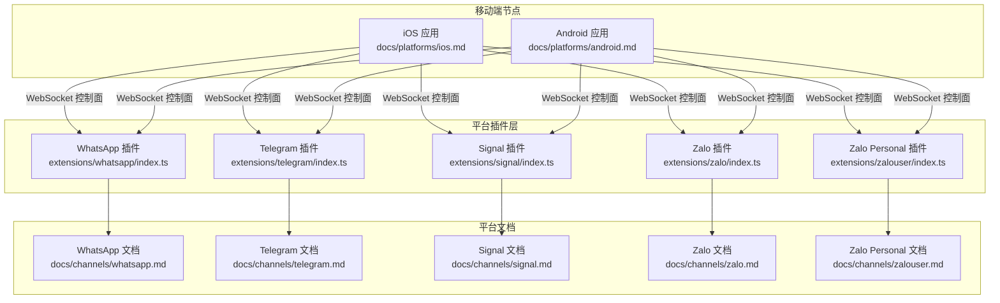
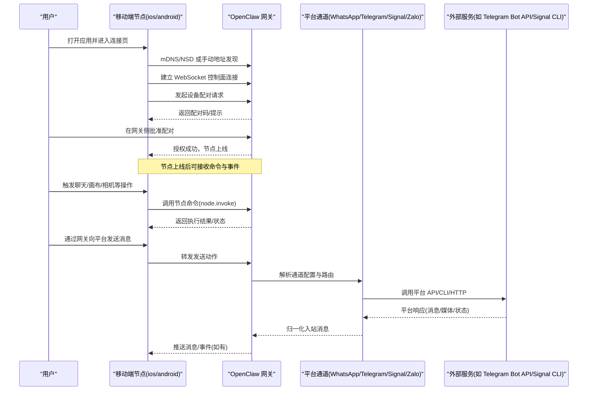
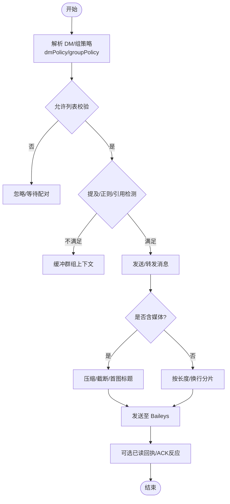
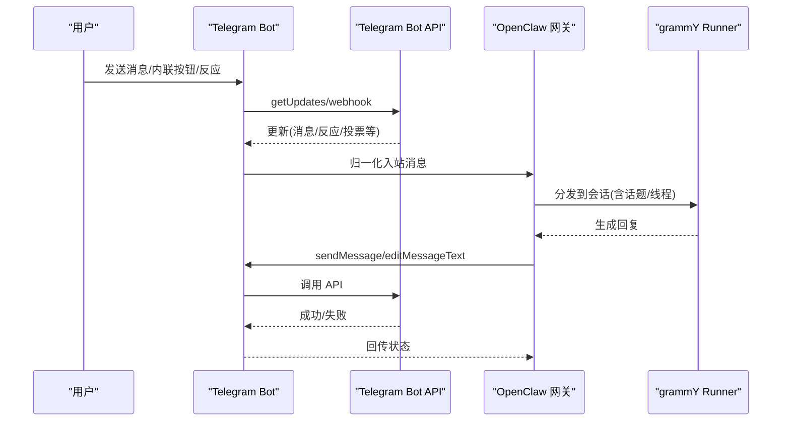
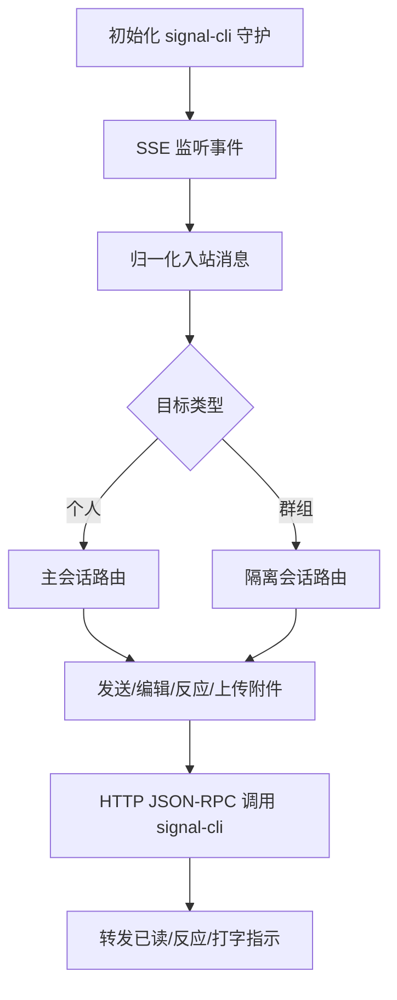
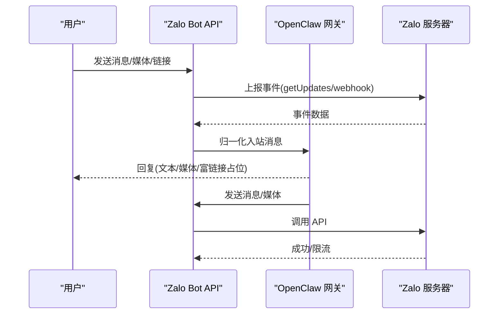
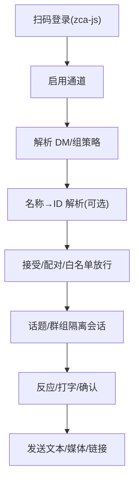
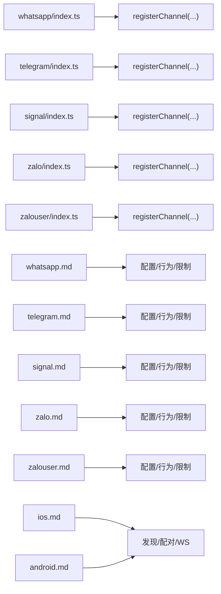

# 移动端即时通讯平台

<cite>
**本文引用的文件**
- [docs/channels/whatsapp.md](file://docs/channels/whatsapp.md)
- [docs/channels/telegram.md](file://docs/channels/telegram.md)
- [docs/channels/signal.md](file://docs/channels/signal.md)
- [docs/channels/zalo.md](file://docs/channels/zalo.md)
- [docs/channels/zalouser.md](file://docs/channels/zalouser.md)
- [extensions/whatsapp/index.ts](file://extensions/whatsapp/index.ts)
- [extensions/telegram/index.ts](file://extensions/telegram/index.ts)
- [extensions/signal/index.ts](file://extensions/signal/index.ts)
- [extensions/zalo/index.ts](file://extensions/zalo/index.ts)
- [extensions/zalouser/index.ts](file://extensions/zalouser/index.ts)
- [docs/platforms/android.md](file://docs/platforms/android.md)
- [docs/platforms/ios.md](file://docs/platforms/ios.md)
</cite>

## 目录
1. [简介](#简介)
2. [项目结构](#项目结构)
3. [核心组件](#核心组件)
4. [架构总览](#架构总览)
5. [详细组件分析](#详细组件分析)
6. [依赖关系分析](#依赖关系分析)
7. [性能考量](#性能考量)
8. [故障排查指南](#故障排查指南)
9. [结论](#结论)
10. [附录](#附录)

## 简介
本文件面向在 OpenClaw 中集成移动端即时通讯平台（WhatsApp、Telegram、Signal、Zalo、Zalo Personal）的工程与运维人员，系统化阐述各平台的接入方式、配对流程（QR 登录/验证码）、认证与令牌管理、消息传输协议、媒体与离线处理策略，并给出部署建议、常见问题与最佳实践。文档同时覆盖 iOS/Android 节点侧的连接与控制面交互，帮助读者完成从“本地网关到移动端”的全链路联调。

## 项目结构
OpenClaw 将各平台作为插件扩展（plugin）进行组织，每个平台在 extensions/<platform>/index.ts 中注册自身通道与运行时；平台能力与配置参考位于 docs/channels/<platform>.md。此外，移动端节点（iOS/Android）通过网关的 WebSocket 控制面进行发现、配对与命令交互，相关说明见 docs/platforms/<platform>.md。

**图表来源**
- [extensions/whatsapp/index.ts:1-18](file://extensions/whatsapp/index.ts#L1-L18)
- [extensions/telegram/index.ts:1-18](file://extensions/telegram/index.ts#L1-L18)
- [extensions/signal/index.ts:1-18](file://extensions/signal/index.ts#L1-L18)
- [extensions/zalo/index.ts:1-18](file://extensions/zalo/index.ts#L1-L18)
- [extensions/zalouser/index.ts:1-33](file://extensions/zalouser/index.ts#L1-L33)
- [docs/channels/whatsapp.md:1-446](file://docs/channels/whatsapp.md#L1-L446)
- [docs/channels/telegram.md:1-982](file://docs/channels/telegram.md#L1-L982)
- [docs/channels/signal.md:1-330](file://docs/channels/signal.md#L1-L330)
- [docs/channels/zalo.md:1-244](file://docs/channels/zalo.md#L1-L244)
- [docs/channels/zalouser.md:1-182](file://docs/channels/zalouser.md#L1-L182)
- [docs/platforms/ios.md:1-217](file://docs/platforms/ios.md#L1-L217)
- [docs/platforms/android.md:1-168](file://docs/platforms/android.md#L1-L168)

**章节来源**
- [extensions/whatsapp/index.ts:1-18](file://extensions/whatsapp/index.ts#L1-L18)
- [extensions/telegram/index.ts:1-18](file://extensions/telegram/index.ts#L1-L18)
- [extensions/signal/index.ts:1-18](file://extensions/signal/index.ts#L1-L18)
- [extensions/zalo/index.ts:1-18](file://extensions/zalo/index.ts#L1-L18)
- [extensions/zalouser/index.ts:1-33](file://extensions/zalouser/index.ts#L1-L33)
- [docs/channels/whatsapp.md:1-446](file://docs/channels/whatsapp.md#L1-L446)
- [docs/channels/telegram.md:1-982](file://docs/channels/telegram.md#L1-L982)
- [docs/channels/signal.md:1-330](file://docs/channels/signal.md#L1-L330)
- [docs/channels/zalo.md:1-244](file://docs/channels/zalo.md#L1-L244)
- [docs/channels/zalouser.md:1-182](file://docs/channels/zalouser.md#L1-L182)
- [docs/platforms/ios.md:1-217](file://docs/platforms/ios.md#L1-L217)
- [docs/platforms/android.md:1-168](file://docs/platforms/android.md#L1-L168)

## 核心组件
- 平台插件注册：各平台在 index.ts 中通过 OpenClaw 插件 SDK 注册通道与运行时，统一暴露给网关。
- 平台通道文档：各平台在 docs/channels/<platform>.md 中提供配置项、行为、限制与排障要点。
- 移动端节点：iOS/Android 通过 Bonjour/Tailscale 或手动地址发现网关，建立 WebSocket 连接，使用设备配对完成节点侧授权。

**章节来源**
- [extensions/whatsapp/index.ts:1-18](file://extensions/whatsapp/index.ts#L1-L18)
- [extensions/telegram/index.ts:1-18](file://extensions/telegram/index.ts#L1-L18)
- [extensions/signal/index.ts:1-18](file://extensions/signal/index.ts#L1-L18)
- [extensions/zalo/index.ts:1-18](file://extensions/zalo/index.ts#L1-L18)
- [extensions/zalouser/index.ts:1-33](file://extensions/zalouser/index.ts#L1-L33)
- [docs/platforms/ios.md:1-217](file://docs/platforms/ios.md#L1-L217)
- [docs/platforms/android.md:1-168](file://docs/platforms/android.md#L1-L168)

## 架构总览
下图展示移动端节点与网关之间的发现、配对与消息流转路径，以及各平台通道在网关内的职责边界。

**图表来源**
- [docs/platforms/ios.md:28-51](file://docs/platforms/ios.md#L28-L51)
- [docs/platforms/android.md:26-100](file://docs/platforms/android.md#L26-L100)
- [docs/channels/telegram.md:24-69](file://docs/channels/telegram.md#L24-L69)
- [docs/channels/whatsapp.md:24-76](file://docs/channels/whatsapp.md#L24-L76)
- [docs/channels/signal.md:20-44](file://docs/channels/signal.md#L20-L44)
- [docs/channels/zalo.md:20-48](file://docs/channels/zalo.md#L20-L48)

## 详细组件分析

### WhatsApp（Web 通道）
- 运行模式：基于 Baileys 的 WhatsApp Web 通道，网关持有会话与重连循环。
- 连接与配对：通过 CLI 启动登录流程生成二维码，支持按账户选择。
- 访问控制：
  - DM 策略：pairing/allowlist/open/disabled，默认 pairing。
  - 组策略：groupPolicy + groupAllowFrom，支持组成员白名单与发送者白名单。
  - 提及触发：默认需要提及或正则匹配，支持会话级 /activation 切换。
- 自聊保护：当自联系号码在 allowFrom 中时，跳过自聊已读回执、避免自我提醒。
- 消息归一化：回复上下文、媒体占位符、位置/联系人文本化、群组历史注入。
- 媒体与分片：文本分片长度与换行优先策略；支持图片/视频/音频/文档；自动压缩与首图标题；媒体上限与失败降级。
- 配置写入：默认允许通道发起的配置变更（如群迁移、/config set/unset）。
- 故障排查：未链接/断线/无监听/组消息被忽略/Bun 兼容性提示。

**图表来源**
- [docs/channels/whatsapp.md:126-316](file://docs/channels/whatsapp.md#L126-L316)

**章节来源**
- [docs/channels/whatsapp.md:1-446](file://docs/channels/whatsapp.md#L1-L446)
- [extensions/whatsapp/index.ts:1-18](file://extensions/whatsapp/index.ts#L1-L18)

### Telegram（Bot API）
- 运行模式：grammY 长轮询为主，可选 webhook；生产可用。
- 配置与令牌：通过 BotFather 获取 token，支持环境变量回退；无需 login 流程。
- 访问控制：
  - DM：pairing/allowlist/open/disabled；允许 numeric 用户 ID，支持 @username 解析。
  - 组：groups 白名单 + groupPolicy + groupAllowFrom；隐私模式与管理员权限影响可见性。
  - 提及：默认 requireMention，支持会话级 /activation 切换。
- 行为特性：
  - 确定性路由：入站回送到 Telegram。
  - 话题/论坛主题隔离：topic 会话键带 :topic:<threadId>。
  - 实时预览流：partial/progress 映射；复杂内容回退为最终交付并清理预览。
  - 内联按钮：capabilities.inlineButtons 支持 off/dm/group/all/allowlist。
  - 命令菜单：setMyCommands 注册；native/custom 命令规则与冲突处理。
  - 反应通知：message_reaction 更新；级别与范围可配置。
  - 配置写入：默认允许；支持群迁移与 /config set/unset。
- 限制与工具：文本分片、媒体上限、超时、历史限制、投票 CLI、动作门控。

**图表来源**
- [docs/channels/telegram.md:24-246](file://docs/channels/telegram.md#L24-L246)

**章节来源**
- [docs/channels/telegram.md:1-982](file://docs/channels/telegram.md#L1-L982)
- [extensions/telegram/index.ts:1-18](file://extensions/telegram/index.ts#L1-L18)

### Signal（signal-cli JSON-RPC + SSE）
- 运行模式：外部 CLI 集成，网关通过 HTTP JSON-RPC + SSE 监听事件。
- 设备模型：网关连接的是 signal-cli 设备账号；建议使用独立机器人号以避免自对话环。
- 配置与启动：
  - QR 链接：signal-cli link -n "OpenClaw" 扫码。
  - SMS 注册：captcha + 验证码；注意可能解除主应用会话。
  - 外部守护：可自管 signal-cli，通过 httpUrl 指向已启动实例。
- 访问控制：DM 默认 pairing；组 groupPolicy/groupAllowFrom/requireMention；UUID 来源存储为 uuid:<id>。
- 行为与限制：确定性路由；DM 主会话；群隔离；typing/read receipts；媒体下载与大小限制；文本分片与换行优先；反应工具；历史上下文。
- 故障排查：状态检查、日志跟踪、配对列表、进程与端口确认。

**图表来源**
- [docs/channels/signal.md:1-330](file://docs/channels/signal.md#L1-L330)

**章节来源**
- [docs/channels/signal.md:1-330](file://docs/channels/signal.md#L1-L330)
- [extensions/signal/index.ts:1-18](file://extensions/signal/index.ts#L1-L18)

### Zalo（Bot API）
- 运行模式：实验性；支持 1:1 DM；当前 Marketplace Bot 不支持群组。
- 插件安装：openclaw plugins install @openclaw/zalo；支持多账户。
- 配置与令牌：环境变量或 config 指定 botToken；默认 pairing DM 策略。
- 行为与限制：确定性路由回 Zalo；长轮询默认；webhook 可选；文本 2000 字分片；媒体上限；流式阻断；能力现状以表格为准。
- 访问控制：dmPolicy/allowFrom；组策略存在但当前不可用；webhook 安全头与重复事件去重。

**图表来源**
- [docs/channels/zalo.md:1-244](file://docs/channels/zalo.md#L1-L244)

**章节来源**
- [docs/channels/zalo.md:1-244](file://docs/channels/zalo.md#L1-L244)
- [extensions/zalo/index.ts:1-18](file://extensions/zalo/index.ts#L1-L18)

### Zalo Personal（非官方，zca-js）
- 运行模式：非官方自动化，完全在进程内运行，使用原生事件监听与 JS API 发送。
- 配置与登录：插件安装后通过 openclaw channels login --channel zalouser 扫码登录；启用后默认 pairing DM 策略。
- 访问控制：dmPolicy/allowFrom 支持 numeric ID/名称；组策略可选 allowlist/disabled/open，支持按名称/ID 解析与提及要求。
- 行为特性：文本约 2000 字分片；流式阻断；打字/反应/送达/已读确认；群组历史缓冲；多账户 profile 映射。
- 风险提示：非官方集成，存在封号风险。

**图表来源**
- [docs/channels/zalouser.md:25-182](file://docs/channels/zalouser.md#L25-L182)

**章节来源**
- [docs/channels/zalouser.md:1-182](file://docs/channels/zalouser.md#L1-L182)
- [extensions/zalouser/index.ts:1-33](file://extensions/zalouser/index.ts#L1-L33)

## 依赖关系分析
- 插件注册：各平台在 index.ts 中注册通道与运行时，确保网关加载对应通道实现。
- 文档与配置：各平台文档提供配置键、行为与限制，指导网关配置与运维排障。
- 移动端节点：iOS/Android 通过 Bonjour/Tailscale 或手动地址发现网关，使用设备配对完成授权，随后通过节点命令与网关交互。

**图表来源**
- [extensions/whatsapp/index.ts:1-18](file://extensions/whatsapp/index.ts#L1-L18)
- [extensions/telegram/index.ts:1-18](file://extensions/telegram/index.ts#L1-L18)
- [extensions/signal/index.ts:1-18](file://extensions/signal/index.ts#L1-L18)
- [extensions/zalo/index.ts:1-18](file://extensions/zalo/index.ts#L1-L18)
- [extensions/zalouser/index.ts:1-33](file://extensions/zalouser/index.ts#L1-L33)
- [docs/channels/whatsapp.md:1-446](file://docs/channels/whatsapp.md#L1-L446)
- [docs/channels/telegram.md:1-982](file://docs/channels/telegram.md#L1-L982)
- [docs/channels/signal.md:1-330](file://docs/channels/signal.md#L1-L330)
- [docs/channels/zalo.md:1-244](file://docs/channels/zalo.md#L1-L244)
- [docs/channels/zalouser.md:1-182](file://docs/channels/zalouser.md#L1-L182)
- [docs/platforms/ios.md:1-217](file://docs/platforms/ios.md#L1-L217)
- [docs/platforms/android.md:1-168](file://docs/platforms/android.md#L1-L168)

**章节来源**
- [extensions/whatsapp/index.ts:1-18](file://extensions/whatsapp/index.ts#L1-L18)
- [extensions/telegram/index.ts:1-18](file://extensions/telegram/index.ts#L1-L18)
- [extensions/signal/index.ts:1-18](file://extensions/signal/index.ts#L1-L18)
- [extensions/zalo/index.ts:1-18](file://extensions/zalo/index.ts#L1-L18)
- [extensions/zalouser/index.ts:1-33](file://extensions/zalouser/index.ts#L1-L33)
- [docs/channels/whatsapp.md:1-446](file://docs/channels/whatsapp.md#L1-L446)
- [docs/channels/telegram.md:1-982](file://docs/channels/telegram.md#L1-L982)
- [docs/channels/signal.md:1-330](file://docs/channels/signal.md#L1-L330)
- [docs/channels/zalo.md:1-244](file://docs/channels/zalo.md#L1-L244)
- [docs/channels/zalouser.md:1-182](file://docs/channels/zalouser.md#L1-L182)
- [docs/platforms/ios.md:1-217](file://docs/platforms/ios.md#L1-L217)
- [docs/platforms/android.md:1-168](file://docs/platforms/android.md#L1-L168)

## 性能考量
- 文本分片与换行优先：减少单次发送长度，提升平台兼容性与稳定性。
- 媒体压缩与上限：自动优化图片质量与尺寸，避免超限导致丢包；失败时首项降级为文本提示。
- 会话隔离与历史注入：群组上下文缓冲减少重复信息，提高回复质量。
- 长轮询与 webhook：根据平台能力选择模式，合理设置超时与重试；webhook 需要 HTTPS 与安全头验证。
- 通道并发与限流：遵循平台速率限制，避免 burst 导致 429；必要时引入退避策略。
- 移动端节点：Canvas/A2UI/相机/语音等命令需前台运行，后台受限；尽量在前台执行高耗时任务。

[本节为通用建议，无需特定文件来源]

## 故障排查指南
- 通用诊断：
  - openclaw status / openclaw gateway status / openclaw doctor
  - openclaw logs --follow
  - openclaw channels status --probe
- WhatsApp
  - 未链接：openclaw channels login --channel whatsapp；确认 Baileys 凭据目录与备份。
  - 断线/重连：doctor 与日志定位；必要时重新登录。
  - 无活动监听：确保网关运行且账户已链接。
  - 组消息被忽略：核对 groupPolicy/groupAllowFrom/groups/mention 要求。
  - Bun 兼容性：建议使用 Node 运行。
- Telegram
  - 令牌解析顺序：配置值优先于环境变量；仅默认账户支持环境变量。
  - 隐私模式/管理员：若看不到群消息，关闭隐私模式或设为管理员。
  - 命令菜单溢出：减少命令数量或禁用 native 命令。
  - webhook 网络错误：检查出站 DNS/HTTPS 至 api.telegram.org。
- Signal
  - 守护可达但无回复：检查 account/httpUrl/receiveMode。
  - DM 被忽略：待配对批准。
  - 注册/验证码：注意 captcha 过期与 IP 一致性。
- Zalo/Zalo Personal
  - 令牌/URL/密钥：确认 HTTPS 与长度范围；webhook 重复事件去重。
  - 能力现状：部分媒体/流式/贴纸/投票等需按现状验证。
  - 非官方风险：Zalo Personal 存在封号风险，谨慎使用。

**章节来源**
- [docs/channels/whatsapp.md:374-424](file://docs/channels/whatsapp.md#L374-L424)
- [docs/channels/telegram.md:338-342](file://docs/channels/telegram.md#L338-L342)
- [docs/channels/signal.md:253-287](file://docs/channels/signal.md#L253-L287)
- [docs/channels/zalo.md:194-208](file://docs/channels/zalo.md#L194-L208)
- [docs/channels/zalouser.md:167-182](file://docs/channels/zalouser.md#L167-L182)

## 结论
OpenClaw 通过插件化架构将 WhatsApp、Telegram、Signal、Zalo 与 Zalo Personal 有机整合进统一的网关控制面，配合移动端节点的发现与配对，形成从“本地网关到移动客户端”的完整链路。各平台在访问控制、消息归一化、媒体处理与离线策略上各有侧重，建议结合业务场景选择合适平台与模式，并严格遵循配置与排障指引，以获得稳定可靠的移动端即时通讯体验。

[本节为总结性内容，无需特定文件来源]

## 附录
- 配置参考与示例：各平台文档中提供了关键配置键、默认值与示例，建议在生产前逐项核对。
- 多账户与凭据：支持 per-account 配置与凭据目录；注意迁移与备份。
- 移动端节点：iOS/Android 通过 Bonjour/Tailscale 或手动地址发现网关，使用设备配对完成授权；Canvas/A2UI/相机/语音等命令需前台运行。

[本节为补充说明，无需特定文件来源]