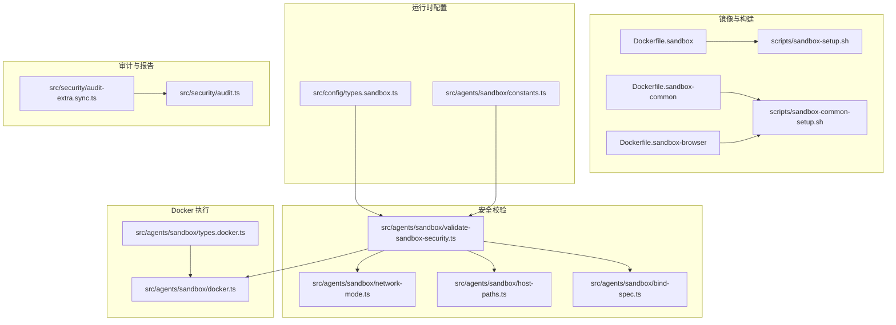
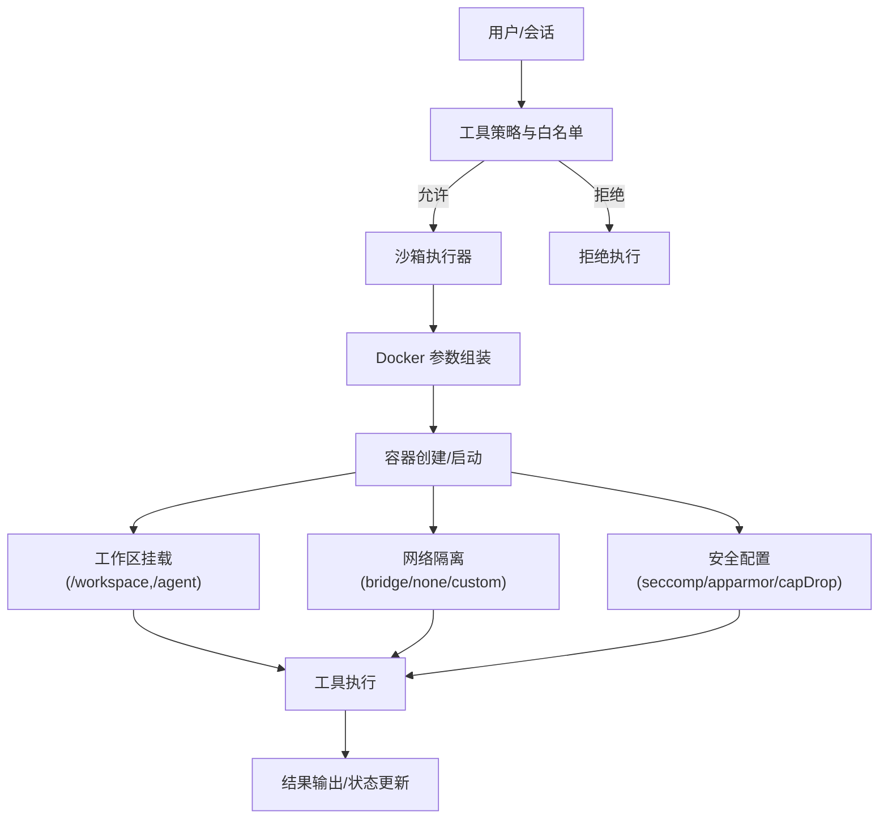
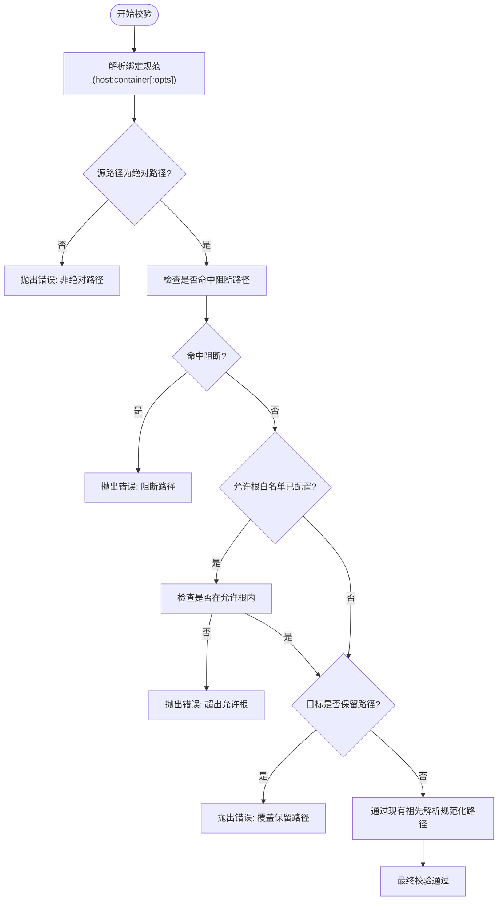
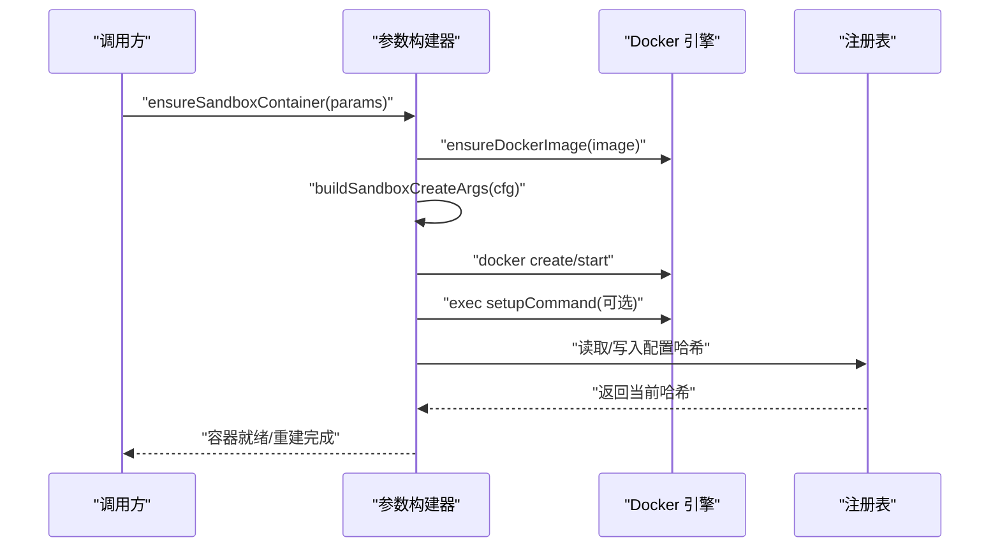
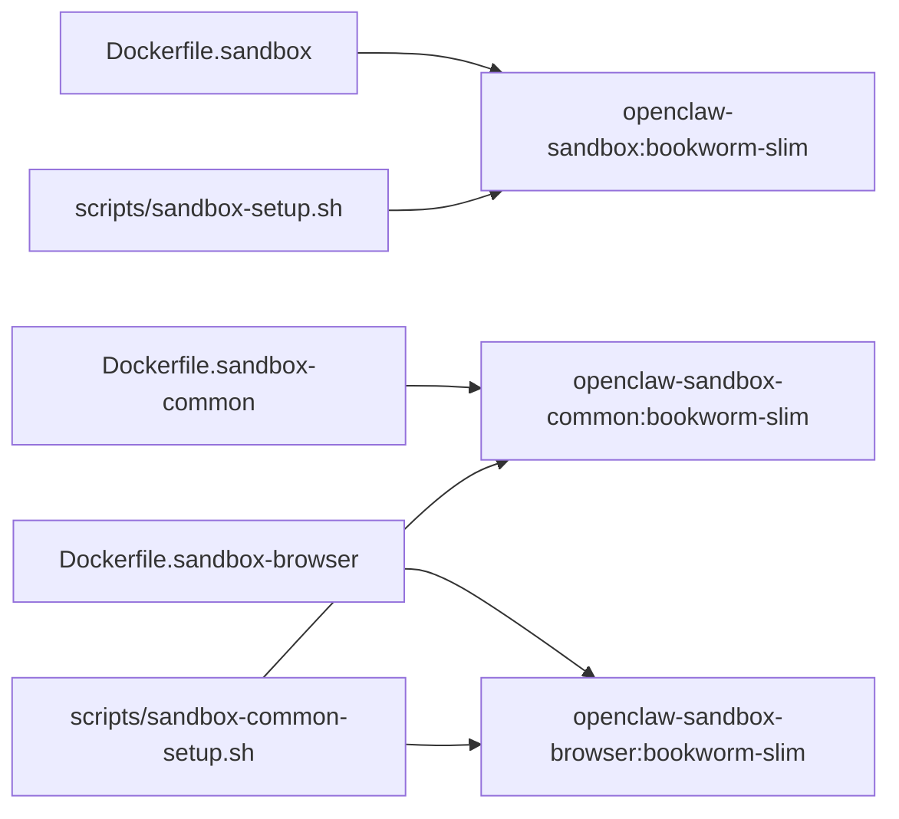
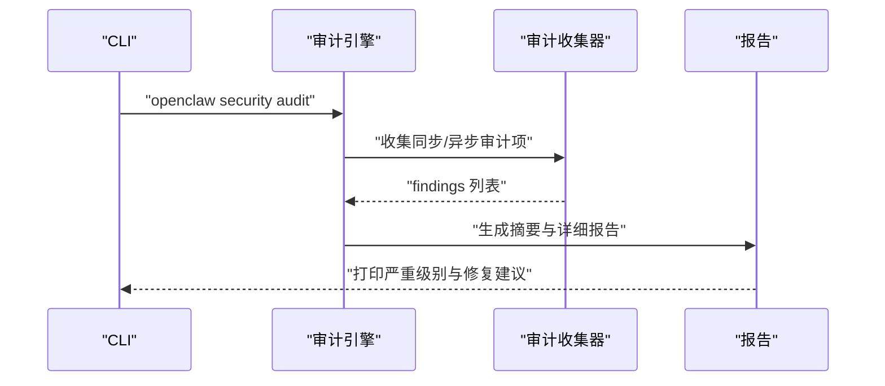
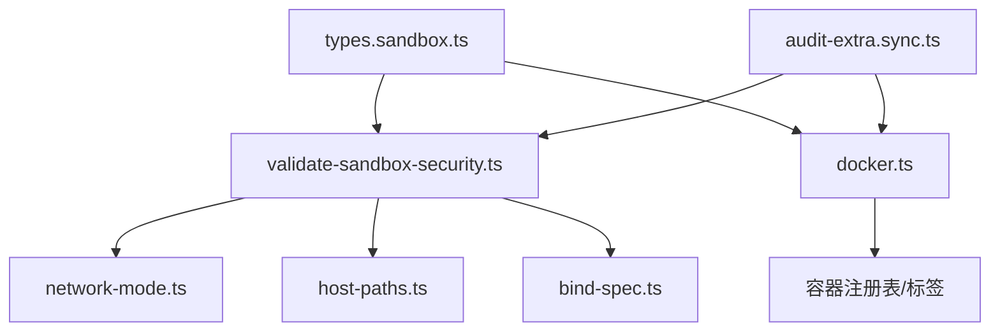

# 安全沙箱

<cite>
**本文引用的文件**
- [Dockerfile.sandbox](file://Dockerfile.sandbox)
- [Dockerfile.sandbox-common](file://Dockerfile.sandbox-common)
- [Dockerfile.sandbox-browser](file://Dockerfile.sandbox-browser)
- [scripts/sandbox-setup.sh](file://scripts/sandbox-setup.sh)
- [scripts/sandbox-common-setup.sh](file://scripts/sandbox-common-setup.sh)
- [src/agents/sandbox/constants.ts](file://src/agents/sandbox/constants.ts)
- [src/agents/sandbox/types.docker.ts](file://src/agents/sandbox/types.docker.ts)
- [src/agents/sandbox/validate-sandbox-security.ts](file://src/agents/sandbox/validate-sandbox-security.ts)
- [src/agents/sandbox/network-mode.ts](file://src/agents/sandbox/network-mode.ts)
- [src/agents/sandbox/host-paths.ts](file://src/agents/sandbox/host-paths.ts)
- [src/agents/sandbox/bind-spec.ts](file://src/agents/sandbox/bind-spec.ts)
- [src/agents/sandbox/docker.ts](file://src/agents/sandbox/docker.ts)
- [src/config/types.sandbox.ts](file://src/config/types.sandbox.ts)
- [src/security/audit-extra.sync.ts](file://src/security/audit-extra.sync.ts)
- [src/security/audit.ts](file://src/security/audit.ts)
- [docs/zh-CN/gateway/security/index.md](file://docs/zh-CN/gateway/security/index.md)
</cite>

## 目录
1. [简介](#简介)
2. [项目结构](#项目结构)
3. [核心组件](#核心组件)
4. [架构总览](#架构总览)
5. [详细组件分析](#详细组件分析)
6. [依赖关系分析](#依赖关系分析)
7. [性能考量](#性能考量)
8. [故障排查指南](#故障排查指南)
9. [结论](#结论)
10. [附录](#附录)

## 简介
本文件面向 OpenClaw 的安全沙箱系统，系统化阐述本地优先的安全架构、容器沙箱隔离与权限控制策略，覆盖 Docker 容器沙箱的配置要点、工具执行限制、文件系统隔离、安全策略配置、权限白名单/黑名单管理、审计日志与合规建议，并给出不同会话的安全级别设置、敏感操作保护与数据隔离机制的最佳实践与应急响应流程。

## 项目结构
OpenClaw 的沙箱能力由“镜像构建脚本 + 运行时配置类型 + 安全校验 + Docker 创建与生命周期管理 + 审计与报告”构成，关键位置如下：
- 镜像层：Dockerfile.sandbox、Dockerfile.sandbox-common、Dockerfile.sandbox-browser 及其构建脚本
- 运行时层：沙箱常量、Docker 配置类型、绑定规范解析、主机路径归一化、网络模式判定、安全校验
- 执行层：容器创建参数组装、容器生命周期管理、工作区挂载策略
- 审计层：同步/异步安全审计收集器与 CLI 报告

图示来源
- [Dockerfile.sandbox:1-25](file://Dockerfile.sandbox#L1-L25)
- [Dockerfile.sandbox-common:1-49](file://Dockerfile.sandbox-common#L1-L49)
- [Dockerfile.sandbox-browser:1-36](file://Dockerfile.sandbox-browser#L1-L36)
- [scripts/sandbox-setup.sh:1-8](file://scripts/sandbox-setup.sh#L1-L8)
- [scripts/sandbox-common-setup.sh:1-55](file://scripts/sandbox-common-setup.sh#L1-L55)
- [src/config/types.sandbox.ts:1-124](file://src/config/types.sandbox.ts#L1-L124)
- [src/agents/sandbox/constants.ts:1-56](file://src/agents/sandbox/constants.ts#L1-L56)
- [src/agents/sandbox/validate-sandbox-security.ts:1-344](file://src/agents/sandbox/validate-sandbox-security.ts#L1-L344)
- [src/agents/sandbox/network-mode.ts:1-29](file://src/agents/sandbox/network-mode.ts#L1-L29)
- [src/agents/sandbox/host-paths.ts:1-44](file://src/agents/sandbox/host-paths.ts#L1-L44)
- [src/agents/sandbox/bind-spec.ts:1-35](file://src/agents/sandbox/bind-spec.ts#L1-L35)
- [src/agents/sandbox/docker.ts:292-528](file://src/agents/sandbox/docker.ts#L292-L528)
- [src/agents/sandbox/types.docker.ts:1-13](file://src/agents/sandbox/types.docker.ts#L1-L13)
- [src/security/audit-extra.sync.ts:1-800](file://src/security/audit-extra.sync.ts#L1-L800)
- [src/security/audit.ts:59-1179](file://src/security/audit.ts#L59-L1179)

章节来源
- [Dockerfile.sandbox:1-25](file://Dockerfile.sandbox#L1-L25)
- [Dockerfile.sandbox-common:1-49](file://Dockerfile.sandbox-common#L1-L49)
- [Dockerfile.sandbox-browser:1-36](file://Dockerfile.sandbox-browser#L1-L36)
- [scripts/sandbox-setup.sh:1-8](file://scripts/sandbox-setup.sh#L1-L8)
- [scripts/sandbox-common-setup.sh:1-55](file://scripts/sandbox-common-setup.sh#L1-L55)
- [src/config/types.sandbox.ts:1-124](file://src/config/types.sandbox.ts#L1-L124)
- [src/agents/sandbox/constants.ts:1-56](file://src/agents/sandbox/constants.ts#L1-L56)
- [src/agents/sandbox/validate-sandbox-security.ts:1-344](file://src/agents/sandbox/validate-sandbox-security.ts#L1-L344)
- [src/agents/sandbox/network-mode.ts:1-29](file://src/agents/sandbox/network-mode.ts#L1-L29)
- [src/agents/sandbox/host-paths.ts:1-44](file://src/agents/sandbox/host-paths.ts#L1-L44)
- [src/agents/sandbox/bind-spec.ts:1-35](file://src/agents/sandbox/bind-spec.ts#L1-L35)
- [src/agents/sandbox/docker.ts:292-528](file://src/agents/sandbox/docker.ts#L292-L528)
- [src/agents/sandbox/types.docker.ts:1-13](file://src/agents/sandbox/types.docker.ts#L1-L13)
- [src/security/audit-extra.sync.ts:1-800](file://src/security/audit-extra.sync.ts#L1-L800)
- [src/security/audit.ts:59-1179](file://src/security/audit.ts#L59-L1179)

## 核心组件
- 镜像与构建
  - 基础沙箱镜像：最小化 Debian 基础、安装常用工具、非 root 用户运行
  - 通用工具镜像：在基础镜像之上安装 Node/Bun/Linuxbrew 等开发工具链
  - 浏览器沙箱镜像：预装 Chromium、VNC/novnc/Xvfb 等浏览器控制环境
  - 构建脚本：自动化构建与缓存优化，支持 BuildKit 与多阶段缓存
- 运行时配置类型
  - Docker 参数：镜像、容器前缀、工作目录、只读根文件系统、tmpfs、网络、能力降级、用户、seccomp/apparmor、DNS、额外主机映射、bind 挂载、危险覆盖开关等
  - 浏览器参数：网络、端口、CDP 入口范围、自动启动、是否允许宿主控制等
  - 裁剪策略：空闲/最大年龄裁剪
  - SSH 参数：目标主机、命令、严格 HostKey 校验、证书/密钥/known_hosts 管理
- 安全校验
  - 绑定挂载：禁止挂载系统关键路径、保留目标路径、绝对路径检查、允许根白名单、危险覆盖开关
  - 网络模式：禁止 host 模式与容器命名空间 join，默认阻断
  - 安全配置：禁止 unconfined seccomp/apparmor
- Docker 执行
  - 参数组装：基于配置生成 docker create/start/exec 命令
  - 生命周期：确保镜像存在、创建容器、挂载工作区、执行 setup 命令、按需重建
  - 配置哈希：容器标签与注册表记录用于检测配置变更并触发重建
- 审计与报告
  - 同步审计：收集沙箱 Docker 配置风险、网络模式、绑定挂载、工具暴露面等
  - 异步审计：文件权限、日志可读性、会话存储可读性等
  - CLI 报告：汇总严重程度、输出修复建议

章节来源
- [Dockerfile.sandbox:1-25](file://Dockerfile.sandbox#L1-L25)
- [Dockerfile.sandbox-common:1-49](file://Dockerfile.sandbox-common#L1-L49)
- [Dockerfile.sandbox-browser:1-36](file://Dockerfile.sandbox-browser#L1-L36)
- [scripts/sandbox-setup.sh:1-8](file://scripts/sandbox-setup.sh#L1-L8)
- [scripts/sandbox-common-setup.sh:1-55](file://scripts/sandbox-common-setup.sh#L1-L55)
- [src/config/types.sandbox.ts:1-124](file://src/config/types.sandbox.ts#L1-L124)
- [src/agents/sandbox/validate-sandbox-security.ts:1-344](file://src/agents/sandbox/validate-sandbox-security.ts#L1-L344)
- [src/agents/sandbox/network-mode.ts:1-29](file://src/agents/sandbox/network-mode.ts#L1-L29)
- [src/agents/sandbox/docker.ts:292-528](file://src/agents/sandbox/docker.ts#L292-L528)
- [src/security/audit-extra.sync.ts:898-915](file://src/security/audit-extra.sync.ts#L898-L915)
- [src/security/audit.ts:59-1179](file://src/security/audit.ts#L59-L1179)

## 架构总览
OpenClaw 的沙箱采用“本地优先 + 容器隔离”的双层安全策略：
- 本地优先：默认仅在宿主机上运行受控工具，通过沙箱策略与白名单限制工具调用范围
- 容器隔离：对需要外部环境的工具，使用 Docker 容器执行，强制只读根文件系统、能力降级、受限网络与安全配置

图示来源
- [src/agents/sandbox/docker.ts:292-528](file://src/agents/sandbox/docker.ts#L292-L528)
- [src/agents/sandbox/validate-sandbox-security.ts:283-343](file://src/agents/sandbox/validate-sandbox-security.ts#L283-L343)
- [src/agents/sandbox/constants.ts:51-56](file://src/agents/sandbox/constants.ts#L51-L56)
- [src/config/types.sandbox.ts:3-62](file://src/config/types.sandbox.ts#L3-L62)

## 详细组件分析

### 组件 A：安全校验与绑定挂载策略
- 目标路径阻断：禁止挂载 /etc、/proc、/sys、/dev、/root、/boot、/run*、Docker 套接字等
- 绑定源路径策略：要求绝对路径；支持允许根白名单；通过现有祖先解析避免符号链接绕过
- 保留目标路径：禁止覆盖 /workspace 与 /agent
- 危险覆盖开关：仅在完全信任运行时下允许
- 网络模式阻断：host 与 container:* 默认阻断，除非显式允许
- 安全配置阻断：禁止 unconfined seccomp/apparmor

图示来源
- [src/agents/sandbox/validate-sandbox-security.ts:96-281](file://src/agents/sandbox/validate-sandbox-security.ts#L96-L281)
- [src/agents/sandbox/bind-spec.ts:7-24](file://src/agents/sandbox/bind-spec.ts#L7-L24)
- [src/agents/sandbox/host-paths.ts:25-43](file://src/agents/sandbox/host-paths.ts#L25-L43)

章节来源
- [src/agents/sandbox/validate-sandbox-security.ts:1-344](file://src/agents/sandbox/validate-sandbox-security.ts#L1-L344)
- [src/agents/sandbox/network-mode.ts:1-29](file://src/agents/sandbox/network-mode.ts#L1-L29)
- [src/agents/sandbox/host-paths.ts:1-44](file://src/agents/sandbox/host-paths.ts#L1-L44)
- [src/agents/sandbox/bind-spec.ts:1-35](file://src/agents/sandbox/bind-spec.ts#L1-L35)

### 组件 B：Docker 参数组装与容器生命周期
- 参数组装：合并 Docker 配置、工作区挂载、自定义绑定、网络模式、安全配置
- 容器创建：确保镜像存在、生成创建参数、挂载工作区、执行 setup 命令
- 配置哈希：容器标签与注册表记录，检测配置变更并重建
- 工作区挂载策略：根据 workspaceAccess 决定挂载到 /workspace 或 /agent，以及读写权限

图示来源
- [src/agents/sandbox/docker.ts:429-528](file://src/agents/sandbox/docker.ts#L429-L528)
- [src/agents/sandbox/docker.ts:492-528](file://src/agents/sandbox/docker.ts#L492-L528)
- [src/agents/sandbox/types.docker.ts:1-13](file://src/agents/sandbox/types.docker.ts#L1-L13)

章节来源
- [src/agents/sandbox/docker.ts:292-528](file://src/agents/sandbox/docker.ts#L292-L528)
- [src/agents/sandbox/types.docker.ts:1-13](file://src/agents/sandbox/types.docker.ts#L1-L13)
- [src/agents/sandbox/constants.ts:5-11](file://src/agents/sandbox/constants.ts#L5-L11)

### 组件 C：镜像与构建脚本
- 基础镜像：最小 Debian、安装 bash/curl/git/jq/python/ripgrep 等
- 通用镜像：在基础镜像上安装 Node/Bun/Linuxbrew 等，支持构建参数定制
- 浏览器镜像：预装 Chromium、novnc/websockify/x11vnc/xvfb，暴露必要端口
- 构建脚本：自动检查基础镜像、支持 BuildKit 缓存、输出使用提示

图示来源
- [Dockerfile.sandbox:1-25](file://Dockerfile.sandbox#L1-L25)
- [Dockerfile.sandbox-common:1-49](file://Dockerfile.sandbox-common#L1-L49)
- [Dockerfile.sandbox-browser:1-36](file://Dockerfile.sandbox-browser#L1-L36)
- [scripts/sandbox-setup.sh:1-8](file://scripts/sandbox-setup.sh#L1-L8)
- [scripts/sandbox-common-setup.sh:1-55](file://scripts/sandbox-common-setup.sh#L1-L55)

章节来源
- [Dockerfile.sandbox:1-25](file://Dockerfile.sandbox#L1-L25)
- [Dockerfile.sandbox-common:1-49](file://Dockerfile.sandbox-common#L1-L49)
- [Dockerfile.sandbox-browser:1-36](file://Dockerfile.sandbox-browser#L1-L36)
- [scripts/sandbox-setup.sh:1-8](file://scripts/sandbox-setup.sh#L1-L8)
- [scripts/sandbox-common-setup.sh:1-55](file://scripts/sandbox-common-setup.sh#L1-L55)

### 组件 D：审计与报告
- 同步审计：识别沙箱 Docker 配置中的危险项（网络 host/container:*、seccomp/apparmor unconfined、阻断路径绑定、保留路径覆盖），并给出修复建议
- 异步审计：检查日志文件、会话存储文件的权限问题
- CLI 报告：汇总严重程度、列出关键发现并提供修复指引

图示来源
- [src/security/audit.ts:1173-1179](file://src/security/audit.ts#L1173-L1179)
- [src/security/audit-extra.sync.ts:898-915](file://src/security/audit-extra.sync.ts#L898-L915)
- [src/security/audit.ts:59-1179](file://src/security/audit.ts#L59-L1179)

章节来源
- [src/security/audit-extra.sync.ts:898-915](file://src/security/audit-extra.sync.ts#L898-L915)
- [src/security/audit.ts:59-1179](file://src/security/audit.ts#L59-L1179)

## 依赖关系分析
- 配置类型依赖：SandboxDockerSettings 与 SandboxBrowserSettings 作为运行时输入，驱动安全校验与参数组装
- 安全校验依赖：绑定解析、主机路径规范化、网络模式判定共同构成安全策略
- 执行依赖：Docker 参数组装依赖安全校验结果，容器生命周期依赖注册表与配置哈希
- 审计依赖：同步/异步审计器依赖配置解析与运行时环境信息

图示来源
- [src/config/types.sandbox.ts:1-124](file://src/config/types.sandbox.ts#L1-L124)
- [src/agents/sandbox/validate-sandbox-security.ts:1-344](file://src/agents/sandbox/validate-sandbox-security.ts#L1-L344)
- [src/agents/sandbox/network-mode.ts:1-29](file://src/agents/sandbox/network-mode.ts#L1-L29)
- [src/agents/sandbox/host-paths.ts:1-44](file://src/agents/sandbox/host-paths.ts#L1-L44)
- [src/agents/sandbox/bind-spec.ts:1-35](file://src/agents/sandbox/bind-spec.ts#L1-L35)
- [src/agents/sandbox/docker.ts:292-528](file://src/agents/sandbox/docker.ts#L292-L528)
- [src/security/audit-extra.sync.ts:898-915](file://src/security/audit-extra.sync.ts#L898-L915)

章节来源
- [src/config/types.sandbox.ts:1-124](file://src/config/types.sandbox.ts#L1-L124)
- [src/agents/sandbox/validate-sandbox-security.ts:1-344](file://src/agents/sandbox/validate-sandbox-security.ts#L1-L344)
- [src/agents/sandbox/docker.ts:292-528](file://src/agents/sandbox/docker.ts#L292-L528)
- [src/security/audit-extra.sync.ts:898-915](file://src/security/audit-extra.sync.ts#L898-L915)

## 性能考量
- 镜像构建缓存：通过 BuildKit 与 apt 缓存目录提升重复构建速度
- 只读根文件系统 + tmpfs：减少磁盘写入，提高容器启动与切换效率
- 网络隔离：bridge/none 自定义网络降低不必要的网络开销
- 配置哈希与注册表：避免无谓重建，缩短容器生命周期管理时间

## 故障排查指南
- 绑定挂载被拒
  - 现象：报错提示阻断路径或保留路径
  - 排查：确认绑定源路径是否在允许根内；避免挂载系统关键路径；如确需覆盖，使用危险覆盖开关并充分评估风险
- 网络模式被拒
  - 现象：host 或 container:* 被阻断
  - 排查：改用 bridge/none 或自定义网络；如必须 join，请使用危险覆盖开关并确保信任边界
- 安全配置被拒
  - 现象：seccomp/apparmor 设置为 unconfined 被拒绝
  - 排查：提供自定义安全档案或移除该设置
- 容器未重建
  - 现象：修改配置后容器未更新
  - 排查：检查配置哈希标签与注册表记录；必要时手动删除旧容器或触发重建
- 权限问题导致审计警告
  - 现象：日志文件或会话存储对其他用户可读
  - 排查：调整文件权限至 0600 并确保仅宿主用户可读

章节来源
- [src/agents/sandbox/validate-sandbox-security.ts:201-227](file://src/agents/sandbox/validate-sandbox-security.ts#L201-L227)
- [src/agents/sandbox/network-mode.ts:25-28](file://src/agents/sandbox/network-mode.ts#L25-L28)
- [src/agents/sandbox/docker.ts:492-528](file://src/agents/sandbox/docker.ts#L492-L528)
- [src/security/audit-extra.sync.ts:1069-1127](file://src/security/audit-extra.sync.ts#L1069-L1127)

## 结论
OpenClaw 的安全沙箱通过“最小化镜像 + 严格绑定与网络策略 + 安全配置阻断 + 审计与报告”的组合拳，实现了本地优先与容器隔离的双重安全保障。遵循本文的最佳实践与排障流程，可在保证可用性的前提下最大化降低攻击面与数据泄露风险。

## 附录

### 安全策略配置清单（示例要点）
- Docker 安全基线
  - 只读根文件系统、能力降级、受限网络、seccomp/apparmor 限制
  - 禁止 host 与 container:* 网络模式
  - 禁止挂载系统关键路径与 Docker 套接字
- 工具执行限制
  - 默认允许 exec/process/read/write/edit/apply_patch 等基础工具
  - 默认拒绝 browser/canvas/nodes/cron/gateway 等高危工具
  - 通过工具策略与会话级别白名单/黑名单精细化控制
- 文件系统隔离
  - /workspace 与 /agent 分离挂载，按需设置只读/读写
  - 严格限制绑定源路径在允许根内
- 审计与合规
  - 定期运行安全审计，关注日志与会话存储权限
  - 将敏感凭据置于环境变量，避免明文写入配置文件

章节来源
- [src/agents/sandbox/constants.ts:13-38](file://src/agents/sandbox/constants.ts#L13-L38)
- [src/agents/sandbox/validate-sandbox-security.ts:18-37](file://src/agents/sandbox/validate-sandbox-security.ts#L18-L37)
- [src/agents/sandbox/network-mode.ts:25-28](file://src/agents/sandbox/network-mode.ts#L25-L28)
- [src/security/audit-extra.sync.ts:1069-1127](file://src/security/audit-extra.sync.ts#L1069-L1127)

### 不同会话的安全级别设置
- 会话隔离级别
  - agent：单智能体隔离
  - session：单会话隔离
  - shared：共享容器/工作区（风险较高）
- 工作区访问策略
  - none：默认，不可访问
  - ro：以只读挂载 /agent，禁用写/编辑/补丁应用
  - rw：以读写挂载 /workspace，谨慎使用

章节来源
- [docs/zh-CN/gateway/security/index.md:551-568](file://docs/zh-CN/gateway/security/index.md#L551-L568)
- [src/agents/sandbox/constants.ts:51-56](file://src/agents/sandbox/constants.ts#L51-L56)

### 应急响应流程
- 发现异常
  - 触发安全审计，定位高危配置与权限问题
- 快速处置
  - 禁用危险网络模式与绑定；收紧工具策略；修正权限
- 复盘与加固
  - 更新镜像与安全基线；完善审计规则；加强巡检

章节来源
- [src/security/audit.ts:1173-1179](file://src/security/audit.ts#L1173-L1179)
- [src/security/audit-extra.sync.ts:898-915](file://src/security/audit-extra.sync.ts#L898-L915)