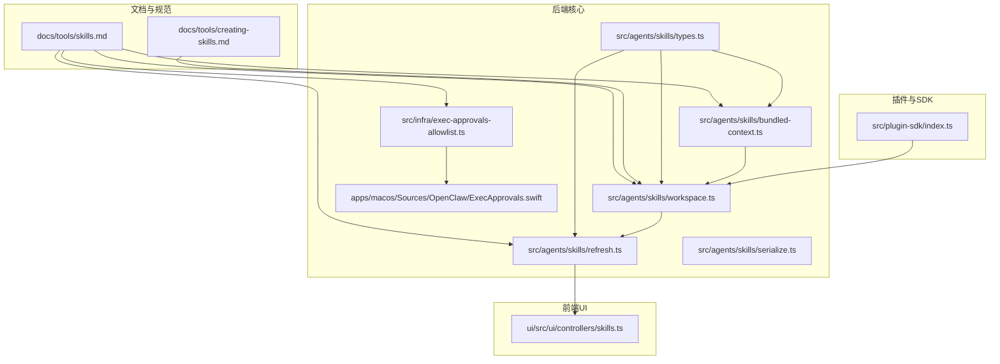
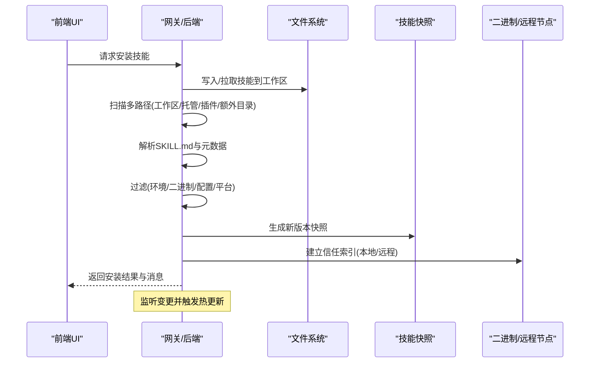
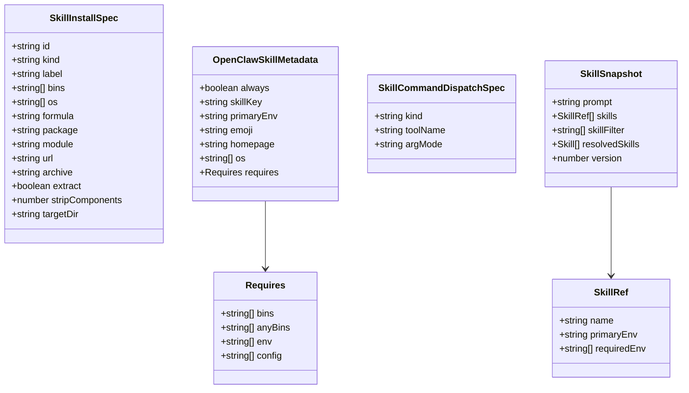
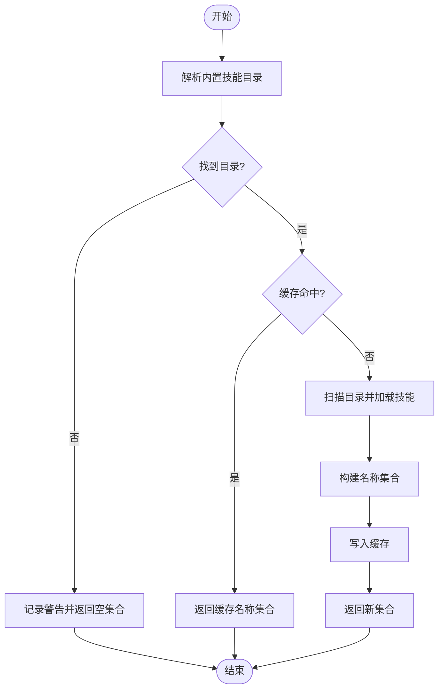
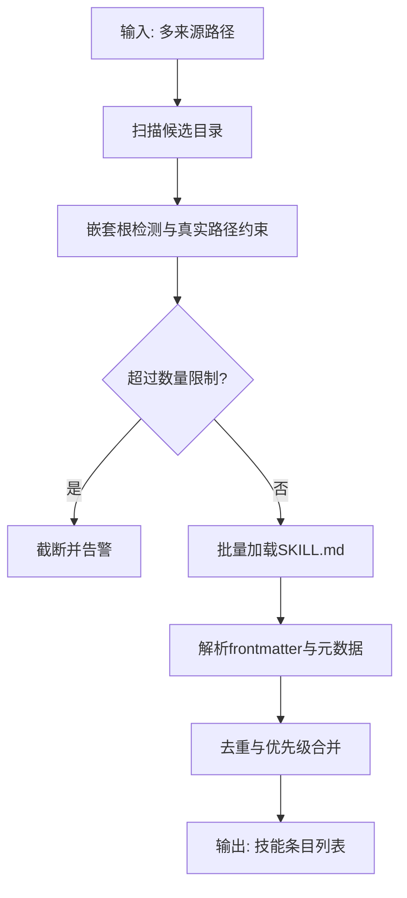
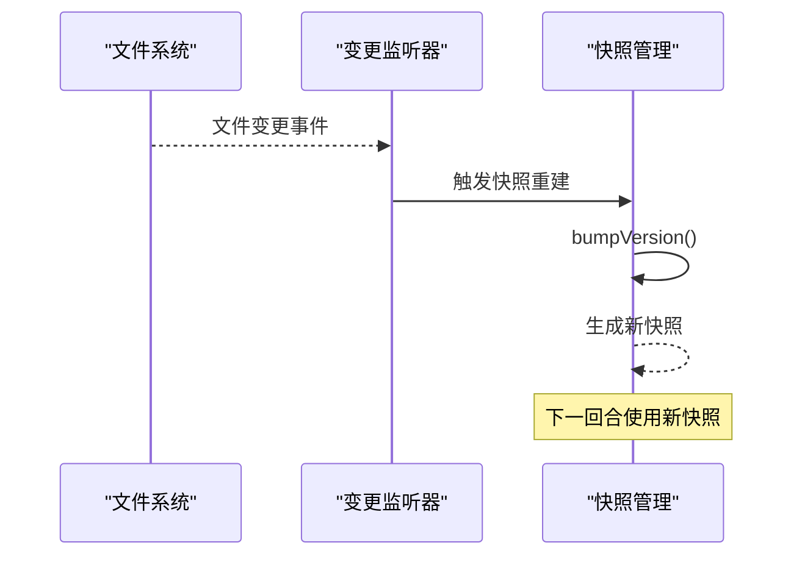
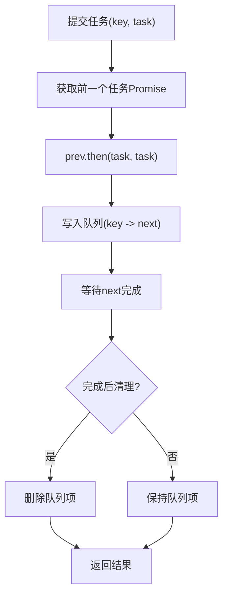
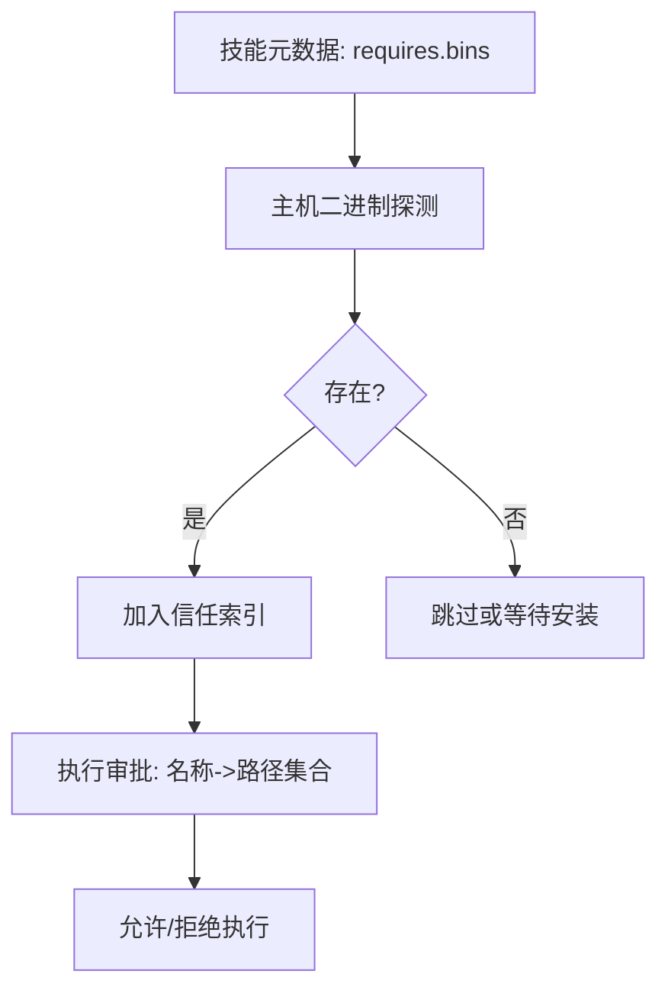
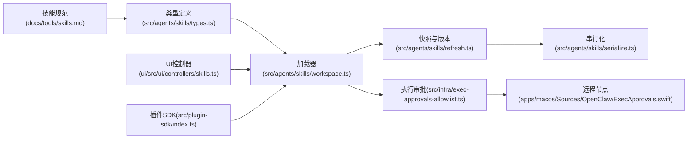

# 技能系统

<cite>
**本文引用的文件**
- [docs/tools/skills.md](file://docs/tools/skills.md)
- [docs/tools/creating-skills.md](file://docs/tools/creating-skills.md)
- [src/agents/skills/types.ts](file://src/agents/skills/types.ts)
- [src/agents/skills/bundled-context.ts](file://src/agents/skills/bundled-context.ts)
- [src/agents/skills/workspace.ts](file://src/agents/skills/workspace.ts)
- [src/agents/skills/refresh.ts](file://src/agents/skills/refresh.ts)
- [src/agents/skills/serialize.ts](file://src/agents/skills/serialize.ts)
- [src/infra/exec-approvals-allowlist.ts](file://src/infra/exec-approvals-allowlist.ts)
- [apps/macos/Sources/OpenClaw/ExecApprovals.swift](file://apps/macos/Sources/OpenClaw/ExecApprovals.swift)
- [src/plugin-sdk/index.ts](file://src/plugin-sdk/index.ts)
- [ui/src/ui/controllers/skills.ts](file://ui/src/ui/controllers/skills.ts)
</cite>

## 目录
1. [简介](#简介)
2. [项目结构](#项目结构)
3. [核心组件](#核心组件)
4. [架构总览](#架构总览)
5. [详细组件分析](#详细组件分析)
6. [依赖关系分析](#依赖关系分析)
7. [性能考量](#性能考量)
8. [故障排查指南](#故障排查指南)
9. [结论](#结论)
10. [附录](#附录)

## 简介
本文件面向 OpenClaw 的“技能系统”，系统性阐述技能的概念、架构设计与实现机制，覆盖技能注册流程、加载机制、权限控制与版本管理策略；并提供技能开发框架、API 规范、配置管理与调试工具说明。文档同时解释技能与代理系统的集成方式、调用机制与结果处理，并给出最佳实践、性能优化建议与安全注意事项，辅以具体示例与发布流程指引，帮助开发者创建高质量的技能模块。

## 项目结构
OpenClaw 的技能系统围绕“AgentSkills 兼容”的目录结构组织，支持多来源叠加（内置、本地托管、工作区、插件），并在运行时按环境、二进制存在与配置进行筛选与注入。前端 UI 提供安装与刷新能力，后端负责扫描、解析、缓存与变更监听。

**图表来源**
- [docs/tools/skills.md:1-303](file://docs/tools/skills.md#L1-L303)
- [docs/tools/creating-skills.md:1-59](file://docs/tools/creating-skills.md#L1-L59)
- [src/agents/skills/types.ts:1-90](file://src/agents/skills/types.ts#L1-L90)
- [src/agents/skills/bundled-context.ts:1-40](file://src/agents/skills/bundled-context.ts#L1-L40)
- [src/agents/skills/workspace.ts:270-378](file://src/agents/skills/workspace.ts#L270-L378)
- [src/agents/skills/refresh.ts:44-82](file://src/agents/skills/refresh.ts#L44-L82)
- [src/agents/skills/serialize.ts:1-14](file://src/agents/skills/serialize.ts#L1-L14)
- [src/infra/exec-approvals-allowlist.ts:142-172](file://src/infra/exec-approvals-allowlist.ts#L142-L172)
- [apps/macos/Sources/OpenClaw/ExecApprovals.swift:809-888](file://apps/macos/Sources/OpenClaw/ExecApprovals.swift#L809-L888)
- [src/plugin-sdk/index.ts:1-800](file://src/plugin-sdk/index.ts#L1-L800)
- [ui/src/ui/controllers/skills.ts:125-157](file://ui/src/ui/controllers/skills.ts#L125-L157)

**章节来源**
- [docs/tools/skills.md:1-303](file://docs/tools/skills.md#L1-L303)
- [docs/tools/creating-skills.md:1-59](file://docs/tools/creating-skills.md#L1-L59)

## 核心组件
- 技能类型与元数据：定义技能条目、命令分发、安装规格等结构化信息，用于构建系统提示、过滤与安装。
- 内置技能上下文：解析并缓存内置技能集合，避免重复扫描。
- 工作区/托管/插件技能加载：从多路径扫描、去重、限制数量、解析 SKILL.md 并合并优先级。
- 变更监听与快照：监听多路径变更，生成版本号并触发热更新。
- 序列化执行：对同一键的任务进行串行化，保证并发安全。
- 权限与信任索引：基于二进制名称与解析路径建立信任映射，用于执行审批与远程节点能力探测。
- 插件技能集成：插件可声明技能目录，启用时参与加载与优先级规则。
- UI 安装与刷新：通过 RPC 调用安装技能并刷新状态。

**章节来源**
- [src/agents/skills/types.ts:1-90](file://src/agents/skills/types.ts#L1-L90)
- [src/agents/skills/bundled-context.ts:1-40](file://src/agents/skills/bundled-context.ts#L1-L40)
- [src/agents/skills/workspace.ts:270-378](file://src/agents/skills/workspace.ts#L270-L378)
- [src/agents/skills/refresh.ts:44-82](file://src/agents/skills/refresh.ts#L44-L82)
- [src/agents/skills/serialize.ts:1-14](file://src/agents/skills/serialize.ts#L1-L14)
- [src/infra/exec-approvals-allowlist.ts:142-172](file://src/infra/exec-approvals-allowlist.ts#L142-L172)
- [apps/macos/Sources/OpenClaw/ExecApprovals.swift:809-888](file://apps/macos/Sources/OpenClaw/ExecApprovals.swift#L809-L888)
- [src/plugin-sdk/index.ts:1-800](file://src/plugin-sdk/index.ts#L1-L800)
- [ui/src/ui/controllers/skills.ts:125-157](file://ui/src/ui/controllers/skills.ts#L125-L157)

## 架构总览
技能系统由“发现—解析—过滤—注入—执行—监控”构成闭环。多来源路径按优先级合并，运行时根据环境变量、二进制存在与配置进行筛选，并在会话内快照复用以降低开销。变更监听支持热更新，序列化队列保障并发一致性。

**图表来源**
- [ui/src/ui/controllers/skills.ts:125-157](file://ui/src/ui/controllers/skills.ts#L125-L157)
- [src/agents/skills/workspace.ts:270-378](file://src/agents/skills/workspace.ts#L270-L378)
- [src/agents/skills/refresh.ts:44-82](file://src/agents/skills/refresh.ts#L44-L82)
- [src/infra/exec-approvals-allowlist.ts:142-172](file://src/infra/exec-approvals-allowlist.ts#L142-L172)
- [apps/macos/Sources/OpenClaw/ExecApprovals.swift:809-888](file://apps/macos/Sources/OpenClaw/ExecApprovals.swift#L809-L888)

## 详细组件分析

### 组件A：技能类型与元数据
- 结构要点
  - 安装规格：brew/node/go/uv/download 等多种安装器，支持平台过滤、目标目录、解压参数等。
  - 元数据：always、skillKey、primaryEnv、os、requires(bins/anyBins/env/config)、install 列表等。
  - 命令分发：用户命令直接路由到工具或禁用模型调用。
  - 快照：包含系统提示片段、技能清单、过滤条件与版本号。
- 复杂度与性能
  - 类型定义集中，便于静态校验与工具链集成。
  - 元数据字段扁平化，利于快速过滤与渲染。

**图表来源**
- [src/agents/skills/types.ts:1-90](file://src/agents/skills/types.ts#L1-L90)

**章节来源**
- [src/agents/skills/types.ts:1-90](file://src/agents/skills/types.ts#L1-L90)

### 组件B：内置技能上下文与缓存
- 功能
  - 解析内置技能根目录，使用缓存避免重复扫描。
  - 将技能名称收集到集合，供后续去重与优先级判定。
- 性能
  - 缓存命中时直接返回副本，减少 IO 与解析成本。

**图表来源**
- [src/agents/skills/bundled-context.ts:1-40](file://src/agents/skills/bundled-context.ts#L1-L40)

**章节来源**
- [src/agents/skills/bundled-context.ts:1-40](file://src/agents/skills/bundled-context.ts#L1-L40)

### 组件C：工作区/托管/插件技能加载与优先级
- 发现与扫描
  - 支持工作区、托管、额外目录与插件技能目录。
  - 对每个来源进行嵌套根检测、真实路径约束与大小限制。
- 解析与合并
  - 解析 SKILL.md，提取 frontmatter 与元数据，构建技能条目。
  - 按优先级合并：工作区 > 托管 > 内置；同名冲突时后者覆盖前者。
- 安全与限制
  - 路径必须位于允许范围内，防止逃逸。
  - 对候选数量与加载数量设置上限，避免性能退化。

**图表来源**
- [src/agents/skills/workspace.ts:270-378](file://src/agents/skills/workspace.ts#L270-L378)

**章节来源**
- [src/agents/skills/workspace.ts:270-378](file://src/agents/skills/workspace.ts#L270-L378)

### 组件D：变更监听与快照版本管理
- 监听范围
  - 工作区 skills、.agents/skills、全局配置目录、额外目录、插件技能目录。
- 版本号
  - 使用时间戳单调递增，确保快照版本唯一且可排序。
- 热更新
  - 监听事件触发后，生成新快照并在下一次会话回合生效。

**图表来源**
- [src/agents/skills/refresh.ts:44-82](file://src/agents/skills/refresh.ts#L44-L82)

**章节来源**
- [src/agents/skills/refresh.ts:44-82](file://src/agents/skills/refresh.ts#L44-L82)

### 组件E：并发串行化与执行队列
- 作用
  - 避免同一键的并发任务竞争，保证状态一致与幂等。
- 实现
  - 基于 Map 存储键到 Promise 的队列，串行执行并清理完成项。

**图表来源**
- [src/agents/skills/serialize.ts:1-14](file://src/agents/skills/serialize.ts#L1-L14)

**章节来源**
- [src/agents/skills/serialize.ts:1-14](file://src/agents/skills/serialize.ts#L1-L14)

### 组件F：权限控制与信任索引（主机与远程）
- 主机侧
  - 基于配置条目构建“名称→可执行路径集合”的信任映射，用于执行审批。
- macOS 远程节点
  - 网关在 Linux 上可通过远程节点能力报告与命令探测，将 macOS 专属技能纳入候选。
  - 若节点离线，技能仍可见但调用可能失败，需等待重连。

**图表来源**
- [src/infra/exec-approvals-allowlist.ts:142-172](file://src/infra/exec-approvals-allowlist.ts#L142-L172)
- [apps/macos/Sources/OpenClaw/ExecApprovals.swift:809-888](file://apps/macos/Sources/OpenClaw/ExecApprovals.swift#L809-L888)

**章节来源**
- [src/infra/exec-approvals-allowlist.ts:142-172](file://src/infra/exec-approvals-allowlist.ts#L142-L172)
- [apps/macos/Sources/OpenClaw/ExecApprovals.swift:809-888](file://apps/macos/Sources/OpenClaw/ExecApprovals.swift#L809-L888)

### 组件G：插件技能集成
- 插件声明
  - 在 openclaw.plugin.json 中列出技能目录，启用时参与加载。
- 加载与安全
  - 路径必须位于插件根内，避免逃逸；同名已见路径会被跳过。

**章节来源**
- [src/plugin-sdk/index.ts:1-800](file://src/plugin-sdk/index.ts#L1-L800)

### 组件H：UI 安装与刷新
- 流程
  - 前端发起安装请求，等待响应后重新加载技能列表并展示消息。
- 超时与错误处理
  - 设置合理超时，捕获异常并反馈给用户。

**章节来源**
- [ui/src/ui/controllers/skills.ts:125-157](file://ui/src/ui/controllers/skills.ts#L125-L157)

## 依赖关系分析
- 文档驱动：技能规范与加载规则由文档统一约束，确保实现与期望一致。
- 后端耦合：类型定义、加载器、快照与权限控制紧密协作，形成闭环。
- 前后端交互：UI 通过 RPC 触发安装与刷新，后端负责实际变更与状态回传。
- 平台差异：主机与远程节点在二进制可用性上存在差异，需分别建立信任索引。

**图表来源**
- [docs/tools/skills.md:1-303](file://docs/tools/skills.md#L1-L303)
- [src/agents/skills/types.ts:1-90](file://src/agents/skills/types.ts#L1-L90)
- [src/agents/skills/workspace.ts:270-378](file://src/agents/skills/workspace.ts#L270-L378)
- [src/agents/skills/refresh.ts:44-82](file://src/agents/skills/refresh.ts#L44-L82)
- [src/agents/skills/serialize.ts:1-14](file://src/agents/skills/serialize.ts#L1-L14)
- [src/infra/exec-approvals-allowlist.ts:142-172](file://src/infra/exec-approvals-allowlist.ts#L142-L172)
- [apps/macos/Sources/OpenClaw/ExecApprovals.swift:809-888](file://apps/macos/Sources/OpenClaw/ExecApprovals.swift#L809-L888)
- [ui/src/ui/controllers/skills.ts:125-157](file://ui/src/ui/controllers/skills.ts#L125-L157)
- [src/plugin-sdk/index.ts:1-800](file://src/plugin-sdk/index.ts#L1-L800)

**章节来源**
- [docs/tools/skills.md:1-303](file://docs/tools/skills.md#L1-L303)
- [src/agents/skills/workspace.ts:270-378](file://src/agents/skills/workspace.ts#L270-L378)
- [src/agents/skills/refresh.ts:44-82](file://src/agents/skills/refresh.ts#L44-L82)
- [src/agents/skills/serialize.ts:1-14](file://src/agents/skills/serialize.ts#L1-L14)
- [src/infra/exec-approvals-allowlist.ts:142-172](file://src/infra/exec-approvals-allowlist.ts#L142-L172)
- [apps/macos/Sources/OpenClaw/ExecApprovals.swift:809-888](file://apps/macos/Sources/OpenClaw/ExecApprovals.swift#L809-L888)
- [ui/src/ui/controllers/skills.ts:125-157](file://ui/src/ui/controllers/skills.ts#L125-L157)
- [src/plugin-sdk/index.ts:1-800](file://src/plugin-sdk/index.ts#L1-L800)

## 性能考量
- 快照复用：会话启动时快照技能列表，后续回合复用，避免重复解析。
- 数量限制：对单源候选与加载数量设限，防止大规模目录导致扫描耗时。
- 缓存：内置技能目录名称集合缓存，减少重复 IO。
- 串行化：对同一键的任务串行执行，避免竞态与重复工作。
- 监听抖动：变更监听支持去抖，降低频繁刷新带来的开销。

[本节为通用指导，无需列出具体文件来源]

## 故障排查指南
- 技能未出现
  - 检查 SKILL.md 是否存在、frontmatter 是否正确、路径是否在允许范围内。
  - 查看优先级：工作区覆盖托管，托管覆盖内置。
- 二进制缺失
  - 确认 requires.bins 或 anyBins 在 PATH 或容器中可用。
  - 若为远程节点，确认节点具备对应二进制并通过探测。
- 安装失败
  - 检查安装器配置（brew/node/go/uv/download）与平台过滤。
  - 关注 UI 错误消息与后端日志。
- 并发问题
  - 若出现竞态或重复执行，检查串行化队列是否正常工作。
- 权限被拒
  - 核对信任索引中的名称与路径映射，确保解析后的路径有效。

**章节来源**
- [docs/tools/skills.md:1-303](file://docs/tools/skills.md#L1-L303)
- [src/agents/skills/workspace.ts:270-378](file://src/agents/skills/workspace.ts#L270-L378)
- [src/agents/skills/refresh.ts:44-82](file://src/agents/skills/refresh.ts#L44-L82)
- [src/agents/skills/serialize.ts:1-14](file://src/agents/skills/serialize.ts#L1-L14)
- [src/infra/exec-approvals-allowlist.ts:142-172](file://src/infra/exec-approvals-allowlist.ts#L142-L172)
- [apps/macos/Sources/OpenClaw/ExecApprovals.swift:809-888](file://apps/macos/Sources/OpenClaw/ExecApprovals.swift#L809-L888)
- [ui/src/ui/controllers/skills.ts:125-157](file://ui/src/ui/controllers/skills.ts#L125-L157)

## 结论
OpenClaw 的技能系统以 AgentSkills 兼容规范为基础，结合多来源加载、运行时过滤、快照复用与变更监听，实现了高扩展、可维护与高性能的技能生态。通过明确的类型定义、严格的路径与二进制约束以及前后端协同的 UI 安装流程，开发者可以高效地创建与发布高质量技能模块。

[本节为总结性内容，无需列出具体文件来源]

## 附录

### 技能开发框架与最佳实践
- 目录结构
  - 每个技能为独立目录，包含 SKILL.md 与可选脚本/资源。
- Frontmatter 规范
  - 至少包含 name 与 description；metadata 采用单行 JSON。
  - 支持 user-invocable、disable-model-invocation、command-dispatch 等字段。
- 安全
  - 第三方技能视为不受信代码，谨慎启用。
  - 避免在提示词与日志中泄露密钥；优先使用配置注入而非明文。
- 性能
  - 控制技能数量与字段长度，减少系统提示开销。
  - 使用快照复用与监听热更新，避免频繁全量扫描。

**章节来源**
- [docs/tools/skills.md:78-187](file://docs/tools/skills.md#L78-L187)
- [docs/tools/creating-skills.md:17-59](file://docs/tools/creating-skills.md#L17-L59)

### API 与配置参考
- 安装接口（RPC）
  - 方法名：skills.install
  - 参数：name、installId、timeoutMs
  - 成功返回：message 字段
- 配置项
  - skills.entries.<key>: enabled、apiKey、env、config、allowBundled
  - skills.load.extraDirs：额外技能目录
  - skills.load.watch/watchDebounceMs：监听与去抖

**章节来源**
- [ui/src/ui/controllers/skills.ts:125-157](file://ui/src/ui/controllers/skills.ts#L125-L157)
- [docs/tools/skills.md:189-267](file://docs/tools/skills.md#L189-L267)

### 开发模板与发布流程
- 模板步骤
  - 创建目录与 SKILL.md，定义 frontmatter 与指令。
  - 可选：添加工具或系统命令。
  - 刷新或重启后生效。
- 发布与同步
  - 使用 ClawHub 进行安装、更新与备份。
  - 插件可打包技能目录，随插件启用自动加载。

**章节来源**
- [docs/tools/creating-skills.md:17-59](file://docs/tools/creating-skills.md#L17-L59)
- [docs/tools/skills.md:50-68](file://docs/tools/skills.md#L50-L68)