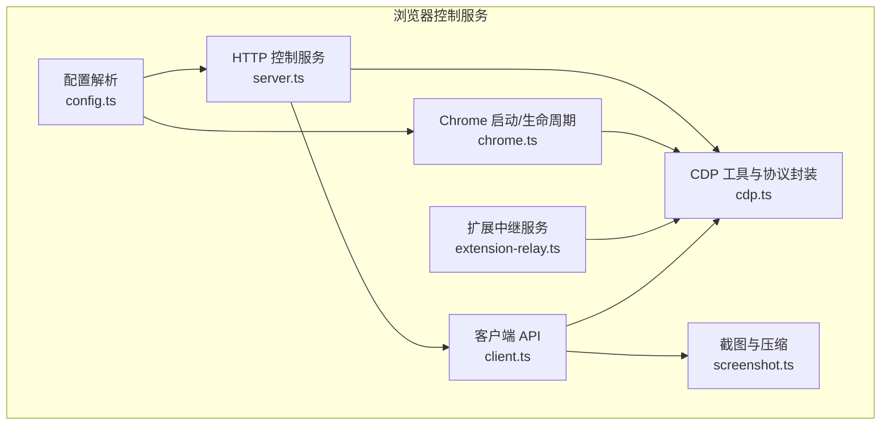
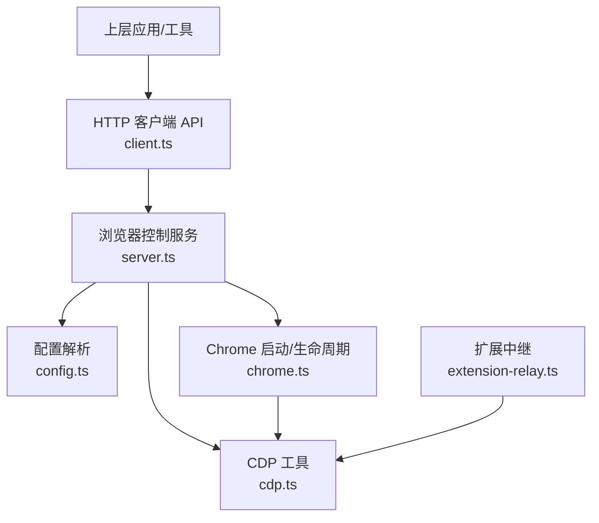
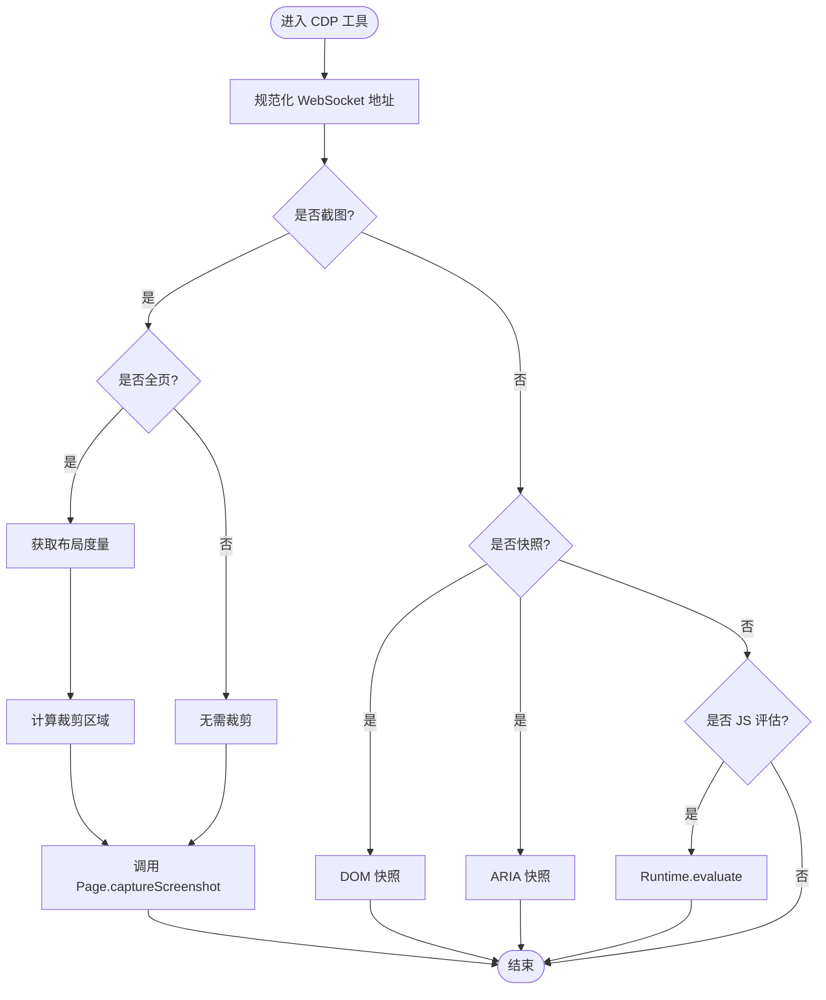
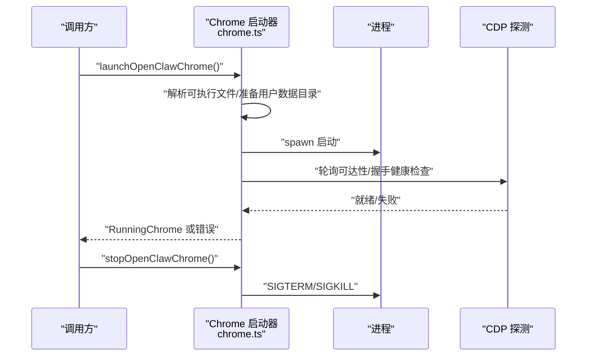
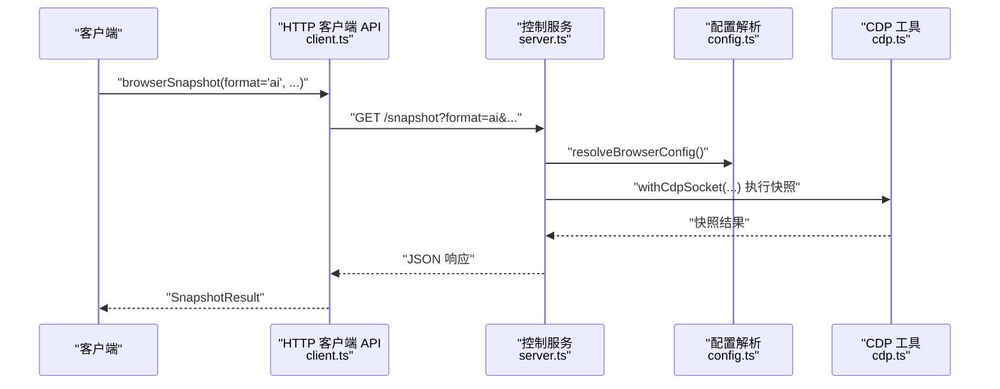
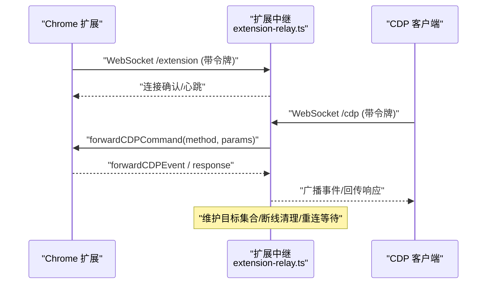
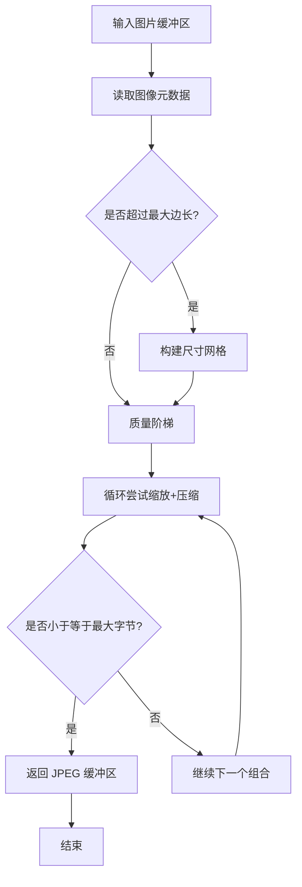
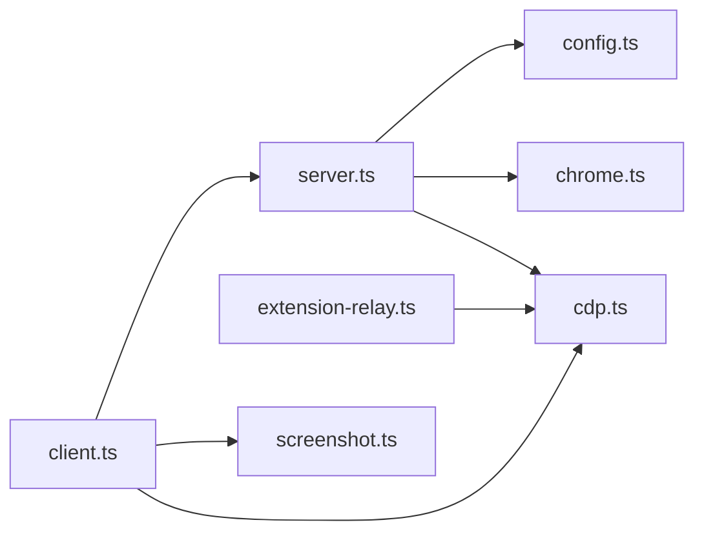

# 浏览器控制

<cite>
**本文引用的文件**
- [src/browser/cdp.ts](file://src/browser/cdp.ts)
- [src/browser/chrome.ts](file://src/browser/chrome.ts)
- [src/browser/client.ts](file://src/browser/client.ts)
- [src/browser/config.ts](file://src/browser/config.ts)
- [src/browser/screenshot.ts](file://src/browser/screenshot.ts)
- [src/browser/server.ts](file://src/browser/server.ts)
- [src/browser/extension-relay.ts](file://src/browser/extension-relay.ts)
- [assets/chrome-extension/manifest.json](file://assets/chrome-extension/manifest.json)
- [src/browser/constants.ts](file://src/browser/constants.ts)
</cite>

## 目录
1. [简介](#简介)
2. [项目结构](#项目结构)
3. [核心组件](#核心组件)
4. [架构总览](#架构总览)
5. [详细组件分析](#详细组件分析)
6. [依赖关系分析](#依赖关系分析)
7. [性能考量](#性能考量)
8. [故障排查指南](#故障排查指南)
9. [结论](#结论)
10. [附录](#附录)

## 简介
本文件面向 OpenClaw 的浏览器控制系统，聚焦于基于 Chrome/Chromium 的浏览器控制实现，涵盖以下方面：
- CDP（Chrome DevTools Protocol）连接管理与重写规则
- 页面操作自动化能力（截图、全页截图、DOM 快照、ARIA 快照、查询选择器等）
- 截图与录屏能力（截图压缩与尺寸归一化）
- 浏览器配置选项、用户代理与扩展管理
- 服务端代理与本地回环桥接机制
- API 接口规范、命令执行流程与错误处理策略
- 沙箱安全模型、权限控制与跨平台兼容性
- 实际使用场景示例、性能优化建议与常见问题解决方案

## 项目结构
OpenClaw 的浏览器控制子系统主要由以下模块构成：
- 配置解析与默认值：负责从全局配置派生浏览器控制端口、CDP 端口范围、默认配置等
- Chrome 启动与生命周期：负责在本地启动/停止 Chrome，探测 CDP 就绪状态，注入启动参数与沙箱策略
- CDP 工具与协议封装：负责 CDP 连接、WebSocket 地址规范化、截图、DOM/ARIA 快照、JS 评估等
- HTTP 控制服务：提供浏览器状态、标签页、快照等只读/可选写接口
- 扩展中继服务：在本地回环上建立 Chrome 扩展与外部 CDP 客户端之间的桥接通道
- 客户端 API：提供统一的 HTTP 客户端方法，便于上层工具调用

**图表来源**
- [src/browser/config.ts:200-306](file://src/browser/config.ts#L200-L306)
- [src/browser/server.ts:20-86](file://src/browser/server.ts#L20-L86)
- [src/browser/chrome.ts:256-433](file://src/browser/chrome.ts#L256-L433)
- [src/browser/cdp.ts:19-140](file://src/browser/cdp.ts#L19-L140)
- [src/browser/extension-relay.ts:225-350](file://src/browser/extension-relay.ts#L225-L350)
- [src/browser/client.ts:109-346](file://src/browser/client.ts#L109-L346)
- [src/browser/screenshot.ts:11-59](file://src/browser/screenshot.ts#L11-L59)

**章节来源**
- [src/browser/config.ts:200-306](file://src/browser/config.ts#L200-L306)
- [src/browser/server.ts:20-86](file://src/browser/server.ts#L20-L86)

## 核心组件
- 配置解析与默认值
  - 解析浏览器启用状态、控制端口、CDP 端口范围、远程超时、颜色、可执行路径、无沙箱模式、仅附加模式、默认配置文件名、SSRF 策略、额外启动参数、中继绑定主机等
  - 自动确保内置默认配置文件存在，并兼容旧版 CDP 端口/URL
- Chrome 启动与生命周期
  - 解析浏览器可执行文件，准备用户数据目录，必要时先启动一次以生成默认偏好，再进行装饰与清理退出策略
  - 启动参数支持 headless、无沙箱、Linux 特定参数、附加参数等
  - 提供可达性探测、WebSocket 握手健康检查、启动失败诊断与优雅停止
- CDP 工具与协议封装
  - 规范化 CDP WebSocket 地址（处理 0.0.0.0/[::]、HTTPS 协议、认证信息、查询参数）
  - 截图：PNG/JPEG、全页截图、按布局度量裁剪
  - DOM/ARIA 快照：限制节点数量与文本长度，格式化输出
  - JS 评估：支持 awaitPromise、返回值序列化、异常详情
  - 目标创建：通过 Target.createTarget 创建新目标
- HTTP 控制服务
  - 提供浏览器状态、配置文件列表、启动/停止、重置配置文件、标签页管理、快照等接口
  - 支持按配置文件隔离多实例
- 扩展中继服务
  - 在本地回环暴露 /json/* 与 /cdp、/extension 端点，转发 CDP 命令到扩展并回传响应
  - 维护已连接目标集合，处理自动附加/发现、会话丢失清理、断线宽限与重连等待
- 客户端 API
  - 对外暴露浏览器控制 HTTP API 的封装函数，便于上层工具直接调用
- 截图与压缩
  - 基于图像元数据与尺寸网格进行 JPEG 压缩，保证最大边长与字节上限

**章节来源**
- [src/browser/config.ts:200-372](file://src/browser/config.ts#L200-L372)
- [src/browser/chrome.ts:256-466](file://src/browser/chrome.ts#L256-L466)
- [src/browser/cdp.ts:19-486](file://src/browser/cdp.ts#L19-L486)
- [src/browser/server.ts:20-100](file://src/browser/server.ts#L20-L100)
- [src/browser/extension-relay.ts:225-800](file://src/browser/extension-relay.ts#L225-L800)
- [src/browser/client.ts:109-349](file://src/browser/client.ts#L109-L349)
- [src/browser/screenshot.ts:11-59](file://src/browser/screenshot.ts#L11-L59)

## 架构总览
下图展示浏览器控制系统的整体交互：上层通过 HTTP 客户端调用控制服务；控制服务根据配置解析结果，协调 Chrome 启动与 CDP 连接；扩展中继服务在本地回环桥接 Chrome 扩展与外部 CDP 客户端；CDP 工具负责具体协议操作。

**图表来源**
- [src/browser/client.ts:109-349](file://src/browser/client.ts#L109-L349)
- [src/browser/server.ts:20-86](file://src/browser/server.ts#L20-L86)
- [src/browser/config.ts:200-306](file://src/browser/config.ts#L200-L306)
- [src/browser/chrome.ts:256-433](file://src/browser/chrome.ts#L256-L433)
- [src/browser/cdp.ts:19-140](file://src/browser/cdp.ts#L19-L140)
- [src/browser/extension-relay.ts:225-350](file://src/browser/extension-relay.ts#L225-L350)

## 详细组件分析

### CDP 工具与协议封装
- 功能要点
  - 规范化 CDP WebSocket 地址：将容器化浏览器报告的 0.0.0.0/[::] 重写为外部主机与端口，同步 HTTPS 协议、认证信息与查询参数
  - 截图：支持 PNG/JPEG、全页截图（基于布局度量）、裁剪区域、质量参数
  - DOM/ARIA 快照：限制节点数与文本长度，格式化输出，便于 AI 可读
  - JS 评估：支持 awaitPromise、返回值序列化、异常详情
  - 目标创建：Target.createTarget
- 错误处理
  - 缺失数据或返回为空时抛出明确错误
  - 未找到目标/会话时进行清理并广播 detached 事件
- 性能特性
  - 截图前先获取布局度量，避免不必要的全页渲染
  - 限制快照节点与文本长度，降低内存与传输开销

**图表来源**
- [src/browser/cdp.ts:19-140](file://src/browser/cdp.ts#L19-L140)
- [src/browser/cdp.ts:49-101](file://src/browser/cdp.ts#L49-L101)
- [src/browser/cdp.ts:282-295](file://src/browser/cdp.ts#L282-L295)
- [src/browser/cdp.ts:307-364](file://src/browser/cdp.ts#L307-L364)
- [src/browser/cdp.ts:159-187](file://src/browser/cdp.ts#L159-L187)

**章节来源**
- [src/browser/cdp.ts:19-486](file://src/browser/cdp.ts#L19-L486)

### Chrome 启动与生命周期
- 功能要点
  - 解析浏览器可执行文件（macOS/Linux/Windows），准备用户数据目录
  - 首次启动生成默认偏好，随后进行装饰（如着色）与清理退出策略
  - 启动参数支持 headless、无沙箱、Linux 特定参数、附加参数
  - 可达性探测与握手健康检查，失败时收集 stderr 诊断信息
  - 优雅停止：优先 SIGTERM，超时后 SIGKILL
- 安全与兼容性
  - Linux 默认禁用 dev/shm 使用，必要时可开启无沙箱模式
  - 仅允许本地回环 CDP 端口用于本地启动
- 故障排查
  - 启动失败时提示可能的沙箱问题与 stderr 摘要

**图表来源**
- [src/browser/chrome.ts:256-433](file://src/browser/chrome.ts#L256-L433)
- [src/browser/chrome.ts:435-466](file://src/browser/chrome.ts#L435-L466)

**章节来源**
- [src/browser/chrome.ts:256-466](file://src/browser/chrome.ts#L256-L466)

### HTTP 控制服务与客户端 API
- 控制服务
  - 路由注册、中间件安装（通用与鉴权）
  - 从配置解析得到控制端口，监听 127.0.0.1
  - 失败关闭策略：鉴权引导失败且无显式鉴权时拒绝启动
- 客户端 API
  - 浏览器状态、配置文件列表、启动/停止、重置配置文件
  - 标签页管理：打开、聚焦、关闭、动作（列表/新建/关闭/选择）
  - 快照：ARIA/AI 格式，支持限制节点数、文本长度、交互元素、标签等
- 错误处理
  - 超时控制、参数校验、错误返回码

**图表来源**
- [src/browser/client.ts:285-346](file://src/browser/client.ts#L285-L346)
- [src/browser/server.ts:20-86](file://src/browser/server.ts#L20-L86)
- [src/browser/config.ts:200-306](file://src/browser/config.ts#L200-L306)
- [src/browser/cdp.ts:282-295](file://src/browser/cdp.ts#L282-L295)

**章节来源**
- [src/browser/server.ts:20-100](file://src/browser/server.ts#L20-L100)
- [src/browser/client.ts:109-349](file://src/browser/client.ts#L109-L349)

### 扩展中继服务
- 功能要点
  - 在本地回环暴露 /json/*、/json/version、/json/list、/json/activate/...、/json/close/... 等端点
  - /cdp 与 /extension WebSocket 通道，转发 CDP 命令与事件
  - 维护已连接目标集合，自动附加/发现策略，会话丢失清理
  - 断线宽限与重连等待，支持扩展 MV3 worker 断线重连
- 安全与权限
  - 严格校验 Origin（chrome-extension://），要求中继令牌头或查询参数
  - 仅允许本地回环地址访问（除非显式绑定非回环主机）

**图表来源**
- [src/browser/extension-relay.ts:538-750](file://src/browser/extension-relay.ts#L538-L750)
- [src/browser/extension-relay.ts:751-800](file://src/browser/extension-relay.ts#L751-L800)

**章节来源**
- [src/browser/extension-relay.ts:225-800](file://src/browser/extension-relay.ts#L225-L800)

### 截图与录屏能力
- 截图
  - 归一化：按最大边长与最大字节限制进行 JPEG 压缩，构建尺寸网格与质量阶梯
  - 返回最小满足条件的 JPEG，否则抛出错误
- 录屏
  - 当前代码库未提供录屏专用实现；可通过扩展中继或外部工具配合实现

**图表来源**
- [src/browser/screenshot.ts:11-59](file://src/browser/screenshot.ts#L11-L59)

**章节来源**
- [src/browser/screenshot.ts:11-59](file://src/browser/screenshot.ts#L11-L59)

### 浏览器配置选项、用户代理与扩展管理
- 配置选项
  - 启用开关、控制端口、CDP 端口范围、协议、主机、颜色、可执行路径、headless、无沙箱、仅附加、默认配置文件名、SSRF 策略、额外启动参数、中继绑定主机
  - 自动确保默认与 user 配置文件存在，兼容旧版 CDP 端口/URL
- 用户代理
  - 通过启动参数与扩展注入实现，可在 extraArgs 中传入相关标志
- 扩展管理
  - 通过扩展中继服务与 Chrome 扩展协作，实现本地回环桥接
  - 扩展清单声明 debugger、tabs、activeTab、storage、alarms、webNavigation 权限与回环主机访问

**章节来源**
- [src/browser/config.ts:200-306](file://src/browser/config.ts#L200-L306)
- [assets/chrome-extension/manifest.json:1-26](file://assets/chrome-extension/manifest.json#L1-L26)

## 依赖关系分析
- 组件耦合
  - server.ts 依赖 config.ts 与 runtime 生命周期，间接依赖 chrome.ts 与 cdp.ts
  - client.ts 仅依赖 HTTP 接口，不直接耦合底层实现
  - extension-relay.ts 独立运行，通过本地回环与外部 CDP 客户端通信
- 外部依赖
  - Express、ws、Node 子进程、WebSocket、HTTP/HTTPS 请求
- 循环依赖
  - 未见循环依赖迹象；各模块职责清晰

**图表来源**
- [src/browser/client.ts:109-349](file://src/browser/client.ts#L109-L349)
- [src/browser/server.ts:20-86](file://src/browser/server.ts#L20-L86)
- [src/browser/config.ts:200-306](file://src/browser/config.ts#L200-L306)
- [src/browser/chrome.ts:256-433](file://src/browser/chrome.ts#L256-L433)
- [src/browser/cdp.ts:19-140](file://src/browser/cdp.ts#L19-L140)
- [src/browser/extension-relay.ts:225-350](file://src/browser/extension-relay.ts#L225-L350)
- [src/browser/screenshot.ts:11-59](file://src/browser/screenshot.ts#L11-L59)

**章节来源**
- [src/browser/client.ts:109-349](file://src/browser/client.ts#L109-L349)
- [src/browser/server.ts:20-100](file://src/browser/server.ts#L20-L100)

## 性能考量
- 截图优化
  - 先获取布局度量，避免全页渲染；按最大边长与字节上限进行 JPEG 压缩
- 快照限制
  - DOM/ARIA 快照限制节点数与文本长度，AI 快照提供高效模式与深度限制
- CDP 连接
  - 规范化 WebSocket 地址，减少重定向与握手失败
- 启动参数
  - headless/new、禁用组件更新、禁用翻译/媒体路由器等可降低资源占用
- Linux 平台
  - 禁用 dev/shm 使用，必要时考虑无沙箱模式以提升稳定性

[本节为通用指导，无需特定文件来源]

## 故障排查指南
- 启动失败
  - 检查 stderr 输出与沙箱提示；Linux 下可尝试设置无沙箱模式
  - 确认端口可用与回环可达性
- CDP 不可用
  - 使用可达性探测与握手健康检查；确认 CDP URL 协议与端口正确
  - 若为容器化环境，确保将 0.0.0.0/[::] 重写为外部主机与端口
- 扩展中继
  - 确认令牌头/查询参数正确；检查 Origin 是否为 chrome-extension://
  - 关注断线宽限与重连等待，避免频繁重建连接
- 截图过大
  - 调整最大边长与最大字节数；若仍超限，检查图像质量阶梯与尺寸网格

**章节来源**
- [src/browser/chrome.ts:388-414](file://src/browser/chrome.ts#L388-L414)
- [src/browser/cdp.ts:19-47](file://src/browser/cdp.ts#L19-L47)
- [src/browser/extension-relay.ts:538-750](file://src/browser/extension-relay.ts#L538-L750)
- [src/browser/screenshot.ts:11-59](file://src/browser/screenshot.ts#L11-L59)

## 结论
OpenClaw 的浏览器控制系统以 CDP 为核心，结合本地 Chrome 启动、HTTP 控制服务与扩展中继，提供了稳定、可扩展的浏览器控制能力。通过严格的配置解析、安全的鉴权与权限控制、以及针对性能与兼容性的优化，系统能够满足多种自动化与监控场景的需求。建议在生产环境中启用鉴权、合理设置快照与截图参数，并根据平台差异调整启动参数与沙箱策略。

[本节为总结，无需特定文件来源]

## 附录

### API 接口规范（摘要）
- 浏览器状态
  - GET /?profile={name}
- 配置文件
  - GET /profiles
  - POST /profiles/create
  - DELETE /profiles/{name}
- 启动/停止
  - POST /start?profile={name}
  - POST /stop?profile={name}
- 重置配置文件
  - POST /reset-profile?profile={name}
- 标签页
  - GET /tabs?profile={name}
  - POST /tabs/open?profile={name}
  - POST /tabs/focus?profile={name}
  - DELETE /tabs/{targetId}?profile={name}
  - POST /tabs/action?profile={name}
- 快照
  - GET /snapshot?format=aria|ai&targetId&limit&maxChars&refs&interactive&compact&depth&selector&frame&labels&mode&profile

**章节来源**
- [src/browser/client.ts:109-349](file://src/browser/client.ts#L109-L349)

### 使用场景示例
- 自动化登录与表单填写
  - 通过快照与查询选择器定位元素，触发交互
- 页面内容提取
  - 使用 DOM/ARIA 快照与文本提取，结合 AI 快照进行结构化输出
- 截图归档
  - 对关键页面进行全页截图，按最大边长与字节上限压缩
- 扩展桥接
  - 通过扩展中继服务将外部 CDP 客户端接入本地 Chrome

[本节为概念性示例，无需特定文件来源]