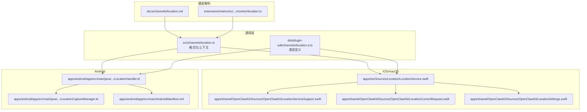
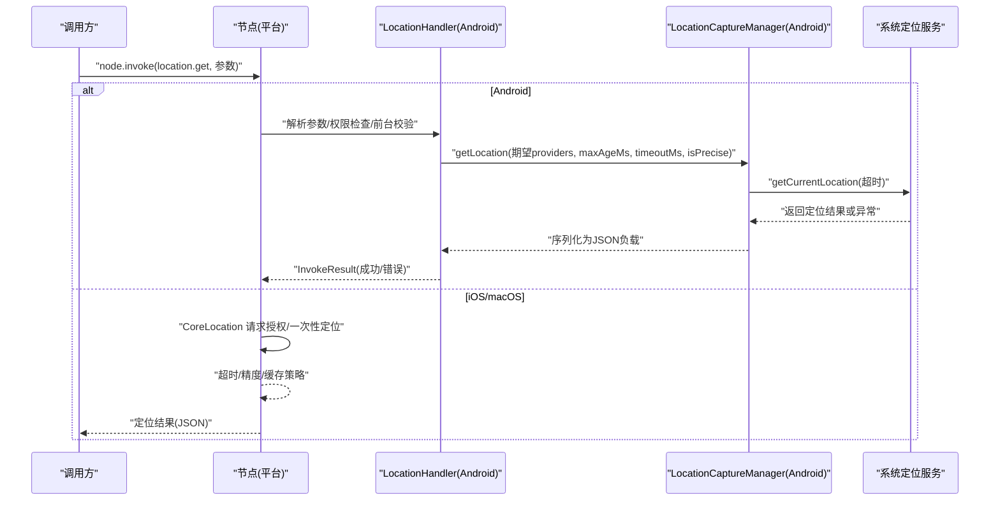
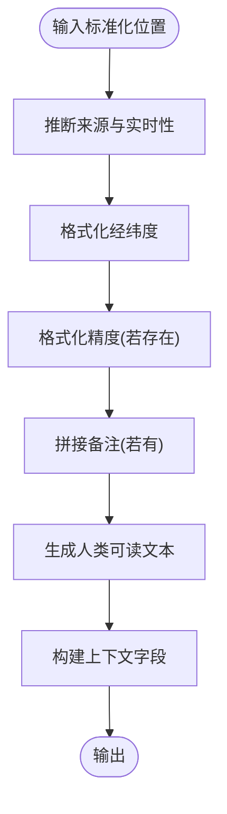
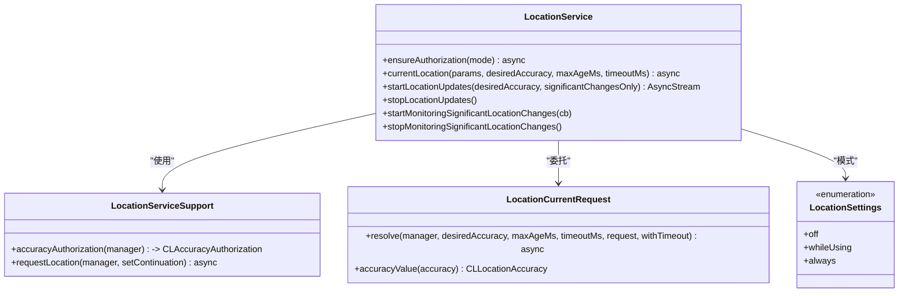
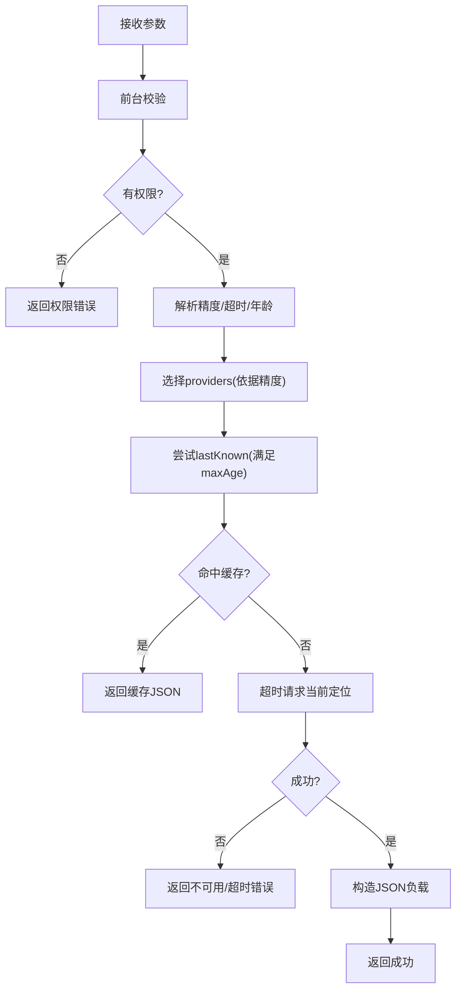
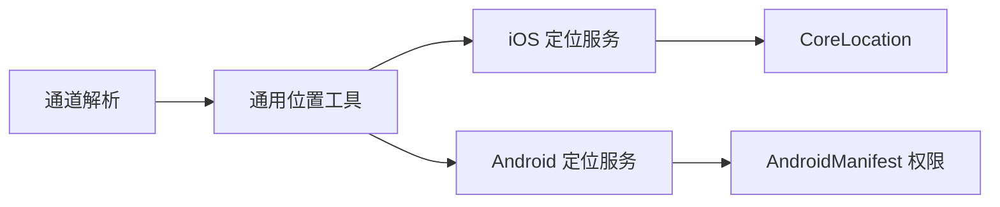

# 位置操作

<cite>
**本文引用的文件**
- [src/channels/location.ts](file://src/channels/location.ts)
- [src/channels/location.test.ts](file://src/channels/location.test.ts)
- [dist/plugin-sdk/channels/location.d.ts](file://dist/plugin-sdk/channels/location.d.ts)
- [docs/nodes/location-command.md](file://docs/nodes/location-command.md)
- [docs/channels/location.md](file://docs/channels/location.md)
- [apps/ios/Sources/Location/LocationService.swift](file://apps/ios/Sources/Location/LocationService.swift)
- [apps/shared/OpenClawKit/Sources/OpenClawKit/LocationServiceSupport.swift](file://apps/shared/OpenClawKit/Sources/OpenClawKit/LocationServiceSupport.swift)
- [apps/shared/OpenClawKit/Sources/OpenClawKit/LocationCurrentRequest.swift](file://apps/shared/OpenClawKit/Sources/OpenClawKit/LocationCurrentRequest.swift)
- [apps/shared/OpenClawKit/Sources/OpenClawKit/LocationSettings.swift](file://apps/shared/OpenClawKit/Sources/OpenClawKit/LocationSettings.swift)
- [apps/android/app/src/main/java/ai/openclaw/app/node/LocationHandler.kt](file://apps/android/app/src/main/java/ai/openclaw/app/node/LocationHandler.kt)
- [apps/android/app/src/main/java/ai/openclaw/app/node/LocationCaptureManager.kt](file://apps/android/app/src/main/java/ai/openclaw/app/node/LocationCaptureManager.kt)
- [apps/android/app/src/main/AndroidManifest.xml](file://apps/android/app/src/main/AndroidManifest.xml)
- [extensions/matrix/src/matrix/monitor/location.ts](file://extensions/matrix/src/matrix/monitor/location.ts)
</cite>

## 目录
1. [简介](#简介)
2. [项目结构](#项目结构)
3. [核心组件](#核心组件)
4. [架构总览](#架构总览)
5. [详细组件分析](#详细组件分析)
6. [依赖关系分析](#依赖关系分析)
7. [性能考量](#性能考量)
8. [故障排查指南](#故障排查指南)
9. [结论](#结论)
10. [附录](#附录)

## 简介
本文件面向 OpenClaw 的“位置操作”能力，系统化阐述位置服务的架构设计、跨平台实现、权限与隐私策略、定位精度与时间戳管理、后台定位支持、缓存与离线能力，以及 API 使用示例与调试排障方法。重点覆盖节点侧位置命令 location.get 的实现原理、参数与返回结构、错误码与边界条件，以及通道侧位置消息解析与上下文注入。

## 项目结构
围绕位置能力的关键模块分布如下：
- 通用位置格式化与上下文注入：位于共享层，供各平台复用
- 平台实现：
  - iOS/macOS：基于 CoreLocation 的定位服务与授权流程
  - Android：基于 LocationManager 的前台定位与权限检查
- 通道位置解析：将第三方渠道的原始位置消息标准化为统一上下文字段
- 插件 SDK 类型定义：导出位置相关类型与工具函数

图表来源
- [src/channels/location.ts:1-77](file://src/channels/location.ts#L1-L77)
- [dist/plugin-sdk/channels/location.d.ts:1-22](file://dist/plugin-sdk/channels/location.d.ts#L1-L22)
- [apps/ios/Sources/Location/LocationService.swift:1-179](file://apps/ios/Sources/Location/LocationService.swift#L1-L179)
- [apps/shared/OpenClawKit/Sources/OpenClawKit/LocationServiceSupport.swift:1-50](file://apps/shared/OpenClawKit/Sources/OpenClawKit/LocationServiceSupport.swift#L1-L50)
- [apps/shared/OpenClawKit/Sources/OpenClawKit/LocationCurrentRequest.swift:1-44](file://apps/shared/OpenClawKit/Sources/OpenClawKit/LocationCurrentRequest.swift#L1-L44)
- [apps/shared/OpenClawKit/Sources/OpenClawKit/LocationSettings.swift:1-8](file://apps/shared/OpenClawKit/Sources/OpenClawKit/LocationSettings.swift#L1-L8)
- [apps/android/app/src/main/java/ai/openclaw/app/node/LocationHandler.kt:1-100](file://apps/android/app/src/main/java/ai/openclaw/app/node/LocationHandler.kt#L1-L100)
- [apps/android/app/src/main/java/ai/openclaw/app/node/LocationCaptureManager.kt:1-118](file://apps/android/app/src/main/java/ai/openclaw/app/node/LocationCaptureManager.kt#L1-L118)
- [apps/android/app/src/main/AndroidManifest.xml:1-21](file://apps/android/app/src/main/AndroidManifest.xml#L1-L21)
- [docs/channels/location.md:1-57](file://docs/channels/location.md#L1-L57)
- [extensions/matrix/src/matrix/monitor/location.ts](file://extensions/matrix/src/matrix/monitor/location.ts)

章节来源
- [src/channels/location.ts:1-77](file://src/channels/location.ts#L1-L77)
- [apps/ios/Sources/Location/LocationService.swift:1-179](file://apps/ios/Sources/Location/LocationService.swift#L1-L179)
- [apps/android/app/src/main/java/ai/openclaw/app/node/LocationHandler.kt:1-100](file://apps/android/app/src/main/java/ai/openclaw/app/node/LocationHandler.kt#L1-L100)
- [apps/android/app/src/main/java/ai/openclaw/app/node/LocationCaptureManager.kt:1-118](file://apps/android/app/src/main/java/ai/openclaw/app/node/LocationCaptureManager.kt#L1-L118)
- [docs/channels/location.md:1-57](file://docs/channels/location.md#L1-L57)

## 核心组件
- 通用位置格式化与上下文注入
  - 提供统一的地理位置文本格式化、来源与是否实时判定、以及标准化上下文字段输出
  - 支持 pin、place、live 三种来源，自动推断 isLive
- iOS/macOS 定位服务
  - 基于 CoreLocation，封装授权状态、一次性定位请求、超时控制、显著变化监听与持续更新
  - 支持 While Using 与 Always 授权模式切换
- Android 定位服务
  - 基于 LocationManager，前台执行定位，支持 GPS 与网络混合策略
  - 权限检查、最近一次已知位置缓存、超时与异常处理
- 通道位置解析
  - 将 Telegram/WhatsApp/Matrix 等渠道的原始位置消息标准化为统一上下文字段，便于提示词与工具使用

章节来源
- [src/channels/location.ts:1-77](file://src/channels/location.ts#L1-L77)
- [apps/ios/Sources/Location/LocationService.swift:1-179](file://apps/ios/Sources/Location/LocationService.swift#L1-L179)
- [apps/android/app/src/main/java/ai/openclaw/app/node/LocationHandler.kt:1-100](file://apps/android/app/src/main/java/ai/openclaw/app/node/LocationHandler.kt#L1-L100)
- [apps/android/app/src/main/java/ai/openclaw/app/node/LocationCaptureManager.kt:1-118](file://apps/android/app/src/main/java/ai/openclaw/app/node/LocationCaptureManager.kt#L1-L118)
- [docs/channels/location.md:1-57](file://docs/channels/location.md#L1-L57)

## 架构总览
下图展示位置命令在节点侧的调用链路与平台差异：

图表来源
- [apps/android/app/src/main/java/ai/openclaw/app/node/LocationHandler.kt:35-100](file://apps/android/app/src/main/java/ai/openclaw/app/node/LocationHandler.kt#L35-L100)
- [apps/android/app/src/main/java/ai/openclaw/app/node/LocationCaptureManager.kt:22-118](file://apps/android/app/src/main/java/ai/openclaw/app/node/LocationCaptureManager.kt#L22-L118)
- [apps/ios/Sources/Location/LocationService.swift:56-121](file://apps/ios/Sources/Location/LocationService.swift#L56-L121)

## 详细组件分析

### 通用位置格式化与上下文注入
- 功能要点
  - 自动推断来源与实时性：优先使用显式 source/isLive，否则根据 name/address/pin/live 规则推断
  - 文本格式化：支持 pin、place（含名称与地址）、live 三类，自动拼接经纬度与精度
  - 上下文字段：输出标准化键值，便于下游工具与提示词使用
- 复杂度
  - 时间复杂度 O(1)，空间复杂度 O(1)
- 测试覆盖
  - 包含 pin、place、live 三类场景与 caption 追加的测试用例

图表来源
- [src/channels/location.ts:19-76](file://src/channels/location.ts#L19-L76)

章节来源
- [src/channels/location.ts:1-77](file://src/channels/location.ts#L1-L77)
- [src/channels/location.test.ts:1-58](file://src/channels/location.test.ts#L1-L58)
- [dist/plugin-sdk/channels/location.d.ts:1-22](file://dist/plugin-sdk/channels/location.d.ts#L1-L22)

### iOS/macOS 定位服务
- 授权与模式
  - 支持 off/whileUsing/always 三种模式；whenInUse 下若请求 always 则触发授权升级
  - 通过 CoreLocation 的授权状态与回调进行授权变更通知
- 一次性定位与超时
  - 统一使用 LocationCurrentRequest.resolve 控制 desiredAccuracy、maxAgeMs、timeoutMs
  - 通过 AsyncTimeout 实现超时控制，避免阻塞
- 持续更新与显著变化
  - 支持 startUpdatingLocation 与 startMonitoringSignificantLocationChanges
  - 更新流在终止时自动清理
- 精度映射
  - coarse → 千米级，balanced → 百米级，precise → 最佳精度

图表来源
- [apps/ios/Sources/Location/LocationService.swift:6-179](file://apps/ios/Sources/Location/LocationService.swift#L6-L179)
- [apps/shared/OpenClawKit/Sources/OpenClawKit/LocationServiceSupport.swift:1-50](file://apps/shared/OpenClawKit/Sources/OpenClawKit/LocationServiceSupport.swift#L1-L50)
- [apps/shared/OpenClawKit/Sources/OpenClawKit/LocationCurrentRequest.swift:1-44](file://apps/shared/OpenClawKit/Sources/OpenClawKit/LocationCurrentRequest.swift#L1-L44)
- [apps/shared/OpenClawKit/Sources/OpenClawKit/LocationSettings.swift:1-8](file://apps/shared/OpenClawKit/Sources/OpenClawKit/LocationSettings.swift#L1-L8)

章节来源
- [apps/ios/Sources/Location/LocationService.swift:1-179](file://apps/ios/Sources/Location/LocationService.swift#L1-L179)
- [apps/shared/OpenClawKit/Sources/OpenClawKit/LocationServiceSupport.swift:1-50](file://apps/shared/OpenClawKit/Sources/OpenClawKit/LocationServiceSupport.swift#L1-L50)
- [apps/shared/OpenClawKit/Sources/OpenClawKit/LocationCurrentRequest.swift:1-44](file://apps/shared/OpenClawKit/Sources/OpenClawKit/LocationCurrentRequest.swift#L1-L44)
- [apps/shared/OpenClawKit/Sources/OpenClawKit/LocationSettings.swift:1-8](file://apps/shared/OpenClawKit/Sources/OpenClawKit/LocationSettings.swift#L1-L8)

### Android 定位服务
- 权限与前台限制
  - 需要 ACCESS_FINE_LOCATION 或 ACCESS_COARSE_LOCATION；后台禁止发起定位请求
- 参数解析与策略
  - 解析 timeoutMs/maxAgeMs/desiredAccuracy；根据 preciseEnabled 决定是否使用精确定位
  - providers 顺序：precise 时优先 GPS，其次网络；coarse/balanced 时网络优先
- 缓存与回退
  - 优先使用 lastKnownLocation 且满足 maxAgeMs；否则发起 getCurrentLocation 超时请求
- 返回结构
  - 包含 lat/lon/accuracyMeters/altitudeMeters/speedMps/headingDeg/timestamp/isPrecise/source

图表来源
- [apps/android/app/src/main/java/ai/openclaw/app/node/LocationHandler.kt:35-100](file://apps/android/app/src/main/java/ai/openclaw/app/node/LocationHandler.kt#L35-L100)
- [apps/android/app/src/main/java/ai/openclaw/app/node/LocationCaptureManager.kt:22-118](file://apps/android/app/src/main/java/ai/openclaw/app/node/LocationCaptureManager.kt#L22-L118)

章节来源
- [apps/android/app/src/main/java/ai/openclaw/app/node/LocationHandler.kt:1-100](file://apps/android/app/src/main/java/ai/openclaw/app/node/LocationHandler.kt#L1-L100)
- [apps/android/app/src/main/java/ai/openclaw/app/node/LocationCaptureManager.kt:1-118](file://apps/android/app/src/main/java/ai/openclaw/app/node/LocationCaptureManager.kt#L1-L118)
- [apps/android/app/src/main/AndroidManifest.xml:1-21](file://apps/android/app/src/main/AndroidManifest.xml#L1-L21)

### 通道位置解析与上下文注入
- 支持渠道
  - Telegram（位置点/场所/实时共享）、WhatsApp（位置消息/实时位置）、Matrix（geo_uri）
- 文本渲染
  - 人类可读文本：pin/place/live 三类，自动拼接精度与备注
- 上下文字段
  - LocationLat/Lon/Accuracy/Name/Address/Source/IsLive，便于工具与提示词直接使用
- 渠道差异
  - Telegram 场所映射为 name/address；WhatsApp 位置消息与实时位置的备注行追加到正文
  - Matrix geo_uri 解析为 pin，忽略海拔，IsLive 恒为 false

章节来源
- [docs/channels/location.md:1-57](file://docs/channels/location.md#L1-L57)
- [src/channels/location.ts:1-77](file://src/channels/location.ts#L1-L77)
- [extensions/matrix/src/matrix/monitor/location.ts](file://extensions/matrix/src/matrix/monitor/location.ts)

## 依赖关系分析
- 平台耦合
  - iOS/macOS 依赖 CoreLocation，Android 依赖 LocationManager
  - 通用层仅依赖平台无关的数据结构与工具函数
- 外部依赖
  - Android 需要前台服务与定位权限声明
  - iOS 需要 Info.plist 中的定位描述与后台定位权限配置
- 错误传播
  - 平台侧将异常转换为统一错误码，上抛至节点调用方

图表来源
- [src/channels/location.ts:1-77](file://src/channels/location.ts#L1-L77)
- [apps/ios/Sources/Location/LocationService.swift:1-179](file://apps/ios/Sources/Location/LocationService.swift#L1-L179)
- [apps/android/app/src/main/java/.../LocationHandler.kt:1-100](file://apps/android/app/src/main/java/ai/openclaw/app/node/LocationHandler.kt#L1-L100)
- [apps/android/app/src/main/AndroidManifest.xml:1-21](file://apps/android/app/src/main/AndroidManifest.xml#L1-L21)
- [docs/channels/location.md:1-57](file://docs/channels/location.md#L1-L57)

## 性能考量
- 缓存优先
  - Android 与 iOS 均支持基于 maxAgeMs 的最近已知位置缓存，减少重复定位开销
- 超时控制
  - 统一设置合理 timeoutMs，避免长时间阻塞；Android 对超时进行捕获并返回 LOCATION_TIMEOUT
- 精度权衡
  - coarse/balanced/precise 三档精度对应不同的定位源与耗电策略；按需选择
- 后台限制
  - Android 明确要求前台执行定位；iOS 在后台需 Always 授权并启用后台定位模式

## 故障排查指南
- 常见错误码
  - LOCATION_DISABLED：selector 关闭
  - LOCATION_PERMISSION_REQUIRED：缺少所需权限
  - LOCATION_BACKGROUND_UNAVAILABLE：后台请求被拒绝（Android）
  - LOCATION_TIMEOUT：超时无定位
  - LOCATION_UNAVAILABLE：系统失败/无可用定位提供者
- 排查步骤
  - Android
    - 确认前台执行；检查 ACCESS_FINE_LOCATION/ACCESS_COARSE_LOCATION 是否授予
    - 检查 GPS 与网络定位开关是否开启；确认 providers 可用
  - iOS/macOS
    - 确认授权状态为 WhenUsing/Always；必要时触发授权升级
    - 检查 Info.plist 定位描述与后台定位权限配置
- 日志与监控
  - 记录参数（timeoutMs/maxAgeMs/desiredAccuracy）与实际返回字段（timestamp/source/accuracyMeters）
  - 对超时与不可用错误进行分类统计

章节来源
- [docs/nodes/location-command.md:74-81](file://docs/nodes/location-command.md#L74-L81)
- [apps/android/app/src/main/java/ai/openclaw/app/node/LocationHandler.kt:35-100](file://apps/android/app/src/main/java/ai/openclaw/app/node/LocationHandler.kt#L35-L100)
- [apps/android/app/src/main/java/ai/openclaw/app/node/LocationCaptureManager.kt:22-118](file://apps/android/app/src/main/java/ai/openclaw/app/node/LocationCaptureManager.kt#L22-L118)
- [apps/ios/Sources/Location/LocationService.swift:56-121](file://apps/ios/Sources/Location/LocationService.swift#L56-L121)

## 结论
OpenClaw 的位置能力通过“通用格式化层 + 平台原生实现”的方式，在保证一致性的同时兼顾了各平台的授权与权限差异。通过 maxAgeMs、timeoutMs、desiredAccuracy 的组合，开发者可在精度、能耗与体验之间取得平衡；通过统一的错误码与上下文字段，便于在工具与提示词中稳定使用。

## 附录

### API 使用示例（路径指引）
- 节点侧调用
  - 通过 node.invoke 调用 location.get，参考参数与返回结构
  - 参考路径：[docs/nodes/location-command.md:44-72](file://docs/nodes/location-command.md#L44-L72)
- 通道侧位置解析
  - 将第三方渠道位置消息标准化为上下文字段
  - 参考路径：[docs/channels/location.md:16-51](file://docs/channels/location.md#L16-L51)
- 通用工具函数
  - 文本格式化与上下文构建
  - 参考路径：[src/channels/location.ts:38-76](file://src/channels/location.ts#L38-L76)

### 跨平台差异与兼容性
- 授权模式
  - iOS/macOS：支持 While Using 与 Always；首次请求 whenInUse，如需 always 则触发升级
  - Android：前台仅支持 While Using；精确位置需要单独的 ACCESS_FINE_LOCATION 授权
- 后台定位
  - iOS：需要 Always 授权与后台定位模式；静默推送可能受限
  - Android：后台定位通常需要前台服务或特殊权限，否则会被系统拒绝
- 权限声明
  - Android Manifest 需要 INTERNET、ACCESS_NETWORK_STATE、ACCESS_FINE_LOCATION、ACCESS_COARSE_LOCATION 等
  - 参考路径：[apps/android/app/src/main/AndroidManifest.xml:1-21](file://apps/android/app/src/main/AndroidManifest.xml#L1-L21)

### 精度级别与适用场景
- 粗糙（coarse）
  - 适合对精度要求不高的场景，如城市级定位、概览地图
- 平衡（balanced）
  - 适合大多数日常场景，兼顾精度与能耗
- 精确（precise）
  - 适合导航、POI 精准匹配等高精度需求，能耗较高

### 时间戳与缓存策略
- 时间戳
  - Android 使用 ISO Instant 格式；iOS/macOS 使用 Date 时间戳
- 缓存
  - 优先使用 lastKnownLocation 且满足 maxAgeMs；否则发起新请求
  - 参考路径：[apps/android/app/src/main/java/.../LocationCaptureManager.kt:64-84](file://apps/android/app/src/main/java/ai/openclaw/app/node/LocationCaptureManager.kt#L64-L84)