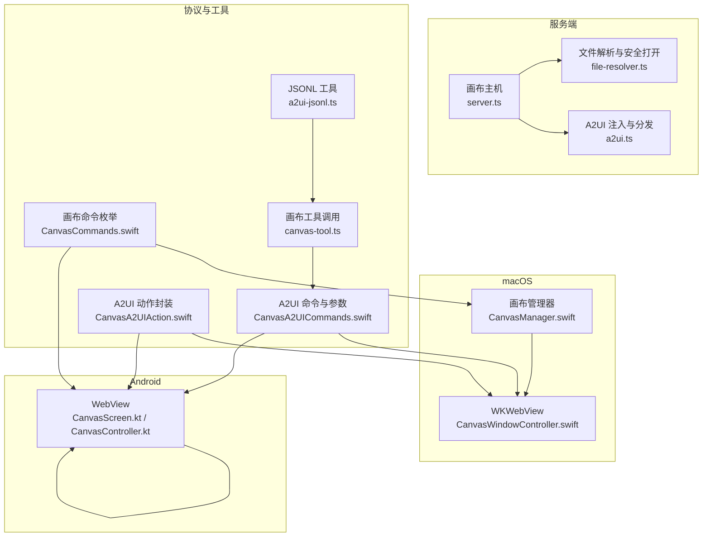
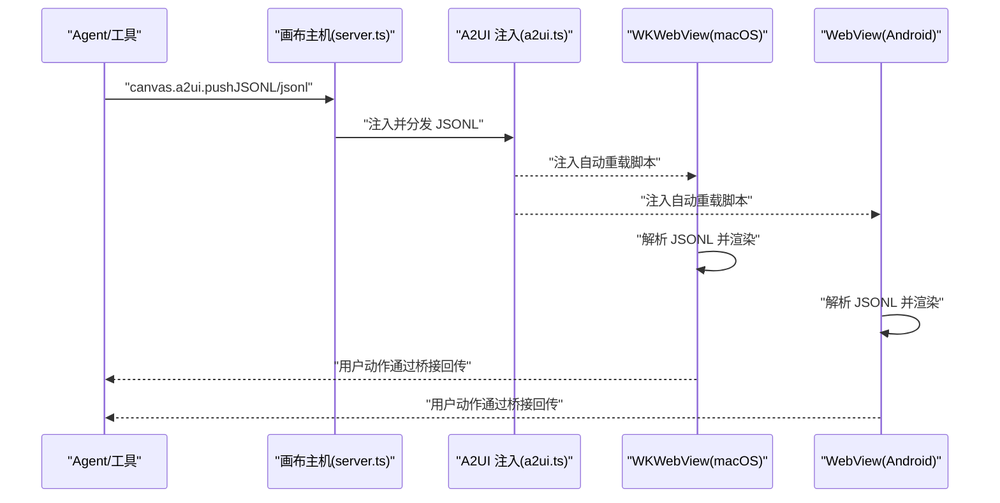
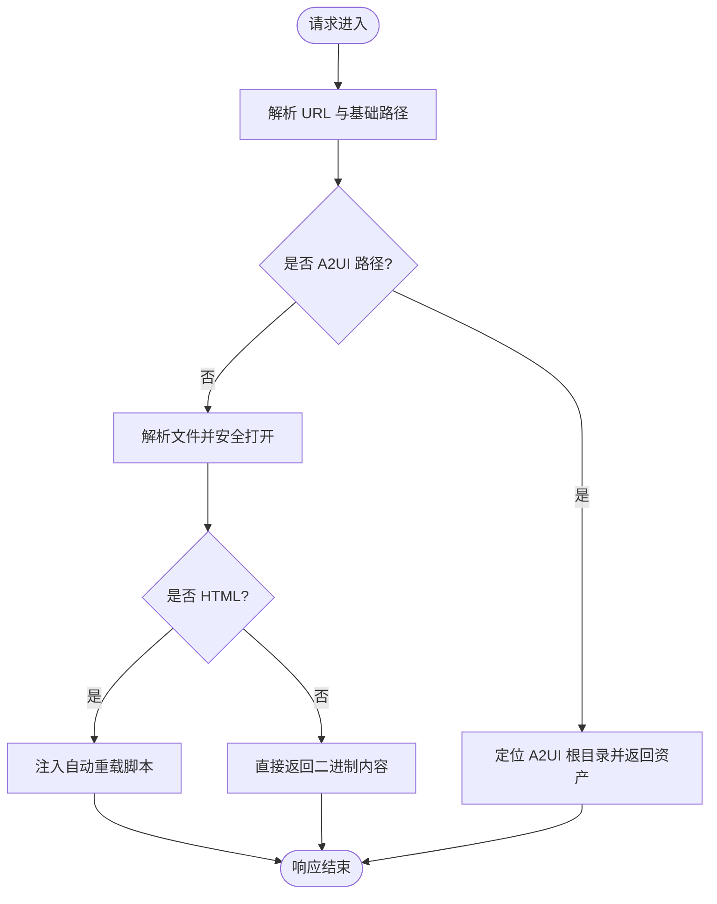
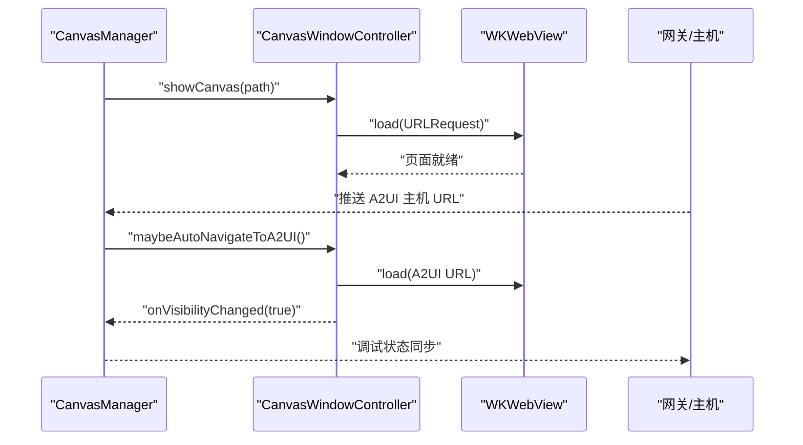
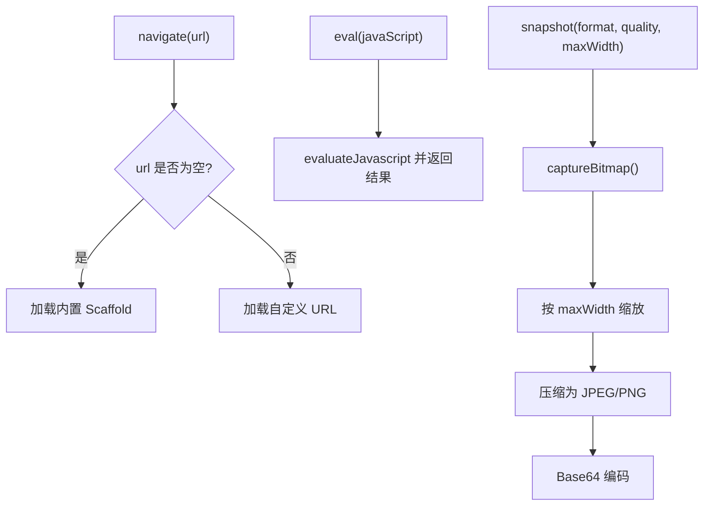
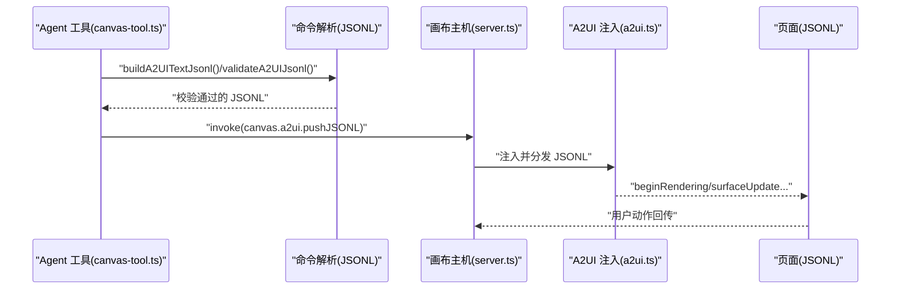
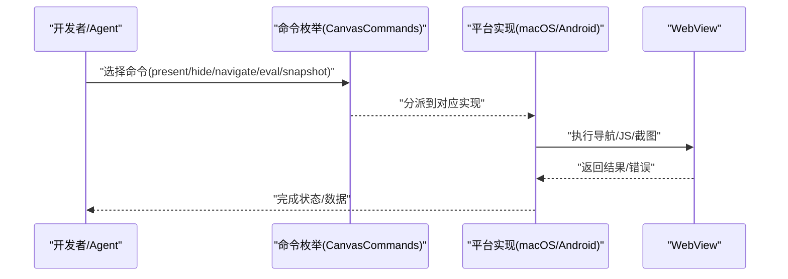
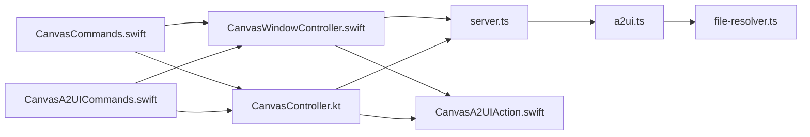

# 画布操作

<cite>
**本文引用的文件**
- [a2ui.ts](file://src/canvas-host/a2ui.ts)
- [server.ts](file://src/canvas-host/server.ts)
- [file-resolver.ts](file://src/canvas-host/file-resolver.ts)
- [CanvasWindowController.swift](file://apps/macos/Sources/OpenClaw/CanvasWindowController.swift)
- [CanvasManager.swift](file://apps/macos/Sources/OpenClaw/CanvasManager.swift)
- [CanvasScreen.kt](file://apps/android/app/src/main/java/ai/openclaw/app/ui/CanvasScreen.kt)
- [CanvasController.kt](file://apps/android/app/src/main/java/ai/openclaw/app/node/CanvasController.kt)
- [CanvasA2UICommands.swift](file://apps/shared/OpenClawKit/Sources/OpenClawKit/CanvasA2UICommands.swift)
- [CanvasA2UIAction.swift](file://apps/shared/OpenClawKit/Sources/OpenClawKit/CanvasA2UIAction.swift)
- [CanvasCommands.swift](file://apps/shared/OpenClawKit/Sources/OpenClawKit/CanvasCommands.swift)
- [a2ui-jsonl.ts](file://src/cli/nodes-cli/a2ui-jsonl.ts)
- [canvas-tool.ts](file://src/agents/tools/canvas-tool.ts)
- [android-node.capabilities.live.test.ts](file://src/gateway/android-node.capabilities.live.test.ts)
</cite>

## 目录
1. [简介](#简介)
2. [项目结构](#项目结构)
3. [核心组件](#核心组件)
4. [架构总览](#架构总览)
5. [详细组件分析](#详细组件分析)
6. [依赖关系分析](#依赖关系分析)
7. [性能考量](#性能考量)
8. [故障排查指南](#故障排查指南)
9. [结论](#结论)
10. [附录](#附录)

## 简介
本文件系统化阐述 OpenClaw 画布操作能力：Canvas 系统的架构设计、WebView 集成与实时渲染机制、画布快照（canvas.snapshot）与屏幕截图生成、A2UI 协议与 JSONL 数据流处理、以及画布控制命令（present、hide、navigate、eval）的实现与使用。文档同时覆盖权限与安全沙箱策略、跨平台兼容性要点，并提供开发示例、调试技巧与性能优化建议。

## 项目结构
OpenClaw 的画布能力由“服务端画布主机”、“平台 WebView 容器”、“A2UI 渲染管线”三部分协同构成：
- 服务端画布主机：提供静态资源托管、自动重载、WebSocket 实时推送、A2UI 资产分发与注入。
- 平台 WebView 容器：macOS 使用 WKWebView，Android 使用 WebView，负责加载本地/远程内容、执行 JS、生成截图。
- A2UI 协议：以 JSONL 消息流描述界面状态变更，通过桥接脚本在页面与原生侧之间传递用户动作。

图表来源
- [server.ts:205-397](file://src/canvas-host/server.ts#L205-L397)
- [a2ui.ts:142-210](file://src/canvas-host/a2ui.ts#L142-L210)
- [file-resolver.ts:11-50](file://src/canvas-host/file-resolver.ts#L11-L50)
- [CanvasWindowController.swift:1-170](file://apps/macos/Sources/OpenClaw/CanvasWindowController.swift#L1-L170)
- [CanvasManager.swift:32-114](file://apps/macos/Sources/OpenClaw/CanvasManager.swift#L32-L114)
- [CanvasScreen.kt:26-131](file://apps/android/app/src/main/java/ai/openclaw/app/ui/CanvasScreen.kt#L26-L131)
- [CanvasController.kt:56-125](file://apps/android/app/src/main/java/ai/openclaw/app/node/CanvasController.kt#L56-L125)
- [CanvasCommands.swift:3-9](file://apps/shared/OpenClawKit/Sources/OpenClawKit/CanvasCommands.swift#L3-L9)
- [CanvasA2UICommands.swift:3-10](file://apps/shared/OpenClawKit/Sources/OpenClawKit/CanvasA2UICommands.swift#L3-L10)
- [CanvasA2UIAction.swift:3-38](file://apps/shared/OpenClawKit/Sources/OpenClawKit/CanvasA2UIAction.swift#L3-L38)
- [a2ui-jsonl.ts:11-36](file://src/cli/nodes-cli/a2ui-jsonl.ts#L11-L36)
- [canvas-tool.ts:199-215](file://src/agents/tools/canvas-tool.ts#L199-L215)

章节来源
- [server.ts:205-397](file://src/canvas-host/server.ts#L205-L397)
- [a2ui.ts:142-210](file://src/canvas-host/a2ui.ts#L142-L210)
- [file-resolver.ts:11-50](file://src/canvas-host/file-resolver.ts#L11-L50)
- [CanvasWindowController.swift:1-170](file://apps/macos/Sources/OpenClaw/CanvasWindowController.swift#L1-L170)
- [CanvasManager.swift:32-114](file://apps/macos/Sources/OpenClaw/CanvasManager.swift#L32-L114)
- [CanvasScreen.kt:26-131](file://apps/android/app/src/main/java/ai/openclaw/app/ui/CanvasScreen.kt#L26-L131)
- [CanvasController.kt:56-125](file://apps/android/app/src/main/java/ai/openclaw/app/node/CanvasController.kt#L56-L125)
- [CanvasCommands.swift:3-9](file://apps/shared/OpenClawKit/Sources/OpenClawKit/CanvasCommands.swift#L3-L9)
- [CanvasA2UICommands.swift:3-10](file://apps/shared/OpenClawKit/Sources/OpenClawKit/CanvasA2UICommands.swift#L3-L10)
- [CanvasA2UIAction.swift:3-38](file://apps/shared/OpenClawKit/Sources/OpenClawKit/CanvasA2UIAction.swift#L3-L38)
- [a2ui-jsonl.ts:11-36](file://src/cli/nodes-cli/a2ui-jsonl.ts#L11-L36)
- [canvas-tool.ts:199-215](file://src/agents/tools/canvas-tool.ts#L199-L215)

## 核心组件
- 画布主机（Canvas Host）
  - 提供静态资源服务、自动重载、WebSocket 推送、A2UI 资产注入与分发。
  - 关键路径：[server.ts:205-397](file://src/canvas-host/server.ts#L205-L397)、[a2ui.ts:142-210](file://src/canvas-host/a2ui.ts#L142-L210)、[file-resolver.ts:11-50](file://src/canvas-host/file-resolver.ts#L11-L50)
- macOS 画布窗口控制器（WKWebView）
  - 管理 WKWebView 生命周期、注入 A2UI 桥接脚本、监听文件变化自动刷新、执行 JS、生成 PNG 截图。
  - 关键路径：[CanvasWindowController.swift:1-170](file://apps/macos/Sources/OpenClaw/CanvasWindowController.swift#L1-L170)、[CanvasManager.swift:132-138](file://apps/macos/Sources/OpenClaw/CanvasManager.swift#L132-L138)
- Android 画布控制器（WebView）
  - 管理 WebView 生命周期、导航、JS 执行、JPEG/PNG 截图与缩放、参数解析。
  - 关键路径：[CanvasScreen.kt:26-131](file://apps/android/app/src/main/java/ai/openclaw/app/ui/CanvasScreen.kt#L26-L131)、[CanvasController.kt:56-204](file://apps/android/app/src/main/java/ai/openclaw/app/node/CanvasController.kt#L56-L204)
- A2UI 协议与工具
  - 命令定义、消息校验、JSONL 构造与校验、动作上下文封装。
  - 关键路径：[CanvasA2UICommands.swift:3-10](file://apps/shared/OpenClawKit/Sources/OpenClawKit/CanvasA2UICommands.swift#L3-L10)、[CanvasA2UIAction.swift:3-38](file://apps/shared/OpenClawKit/Sources/OpenClawKit/CanvasA2UIAction.swift#L3-L38)、[a2ui-jsonl.ts:11-36](file://src/cli/nodes-cli/a2ui-jsonl.ts#L11-L36)
- 画布命令
  - present、hide、navigate、eval、snapshot；A2UI push/reset。
  - 关键路径：[CanvasCommands.swift:3-9](file://apps/shared/OpenClawKit/Sources/OpenClawKit/CanvasCommands.swift#L3-L9)、[canvas-tool.ts:199-215](file://src/agents/tools/canvas-tool.ts#L199-L215)

章节来源
- [server.ts:205-397](file://src/canvas-host/server.ts#L205-L397)
- [a2ui.ts:142-210](file://src/canvas-host/a2ui.ts#L142-L210)
- [file-resolver.ts:11-50](file://src/canvas-host/file-resolver.ts#L11-L50)
- [CanvasWindowController.swift:1-170](file://apps/macos/Sources/OpenClaw/CanvasWindowController.swift#L1-L170)
- [CanvasManager.swift:132-138](file://apps/macos/Sources/OpenClaw/CanvasManager.swift#L132-L138)
- [CanvasScreen.kt:26-131](file://apps/android/app/src/main/java/ai/openclaw/app/ui/CanvasScreen.kt#L26-L131)
- [CanvasController.kt:56-204](file://apps/android/app/src/main/java/ai/openclaw/app/node/CanvasController.kt#L56-L204)
- [CanvasA2UICommands.swift:3-10](file://apps/shared/OpenClawKit/Sources/OpenClawKit/CanvasA2UICommands.swift#L3-L10)
- [CanvasA2UIAction.swift:3-38](file://apps/shared/OpenClawKit/Sources/OpenClawKit/CanvasA2UIAction.swift#L3-L38)
- [a2ui-jsonl.ts:11-36](file://src/cli/nodes-cli/a2ui-jsonl.ts#L11-L36)
- [CanvasCommands.swift:3-9](file://apps/shared/OpenClawKit/Sources/OpenClawKit/CanvasCommands.swift#L3-L9)
- [canvas-tool.ts:199-215](file://src/agents/tools/canvas-tool.ts#L199-L215)

## 架构总览
OpenClaw 画布采用“服务端静态资源 + 平台 WebView + A2UI 消息流”的三层架构：
- 服务端画布主机负责托管 A2UI 资产与本地 Canvas 内容，注入自动重载脚本并通过 WebSocket 推送变更。
- 平台 WebView 容器负责加载内容、执行 JS、生成截图，并通过桥接脚本将用户动作回传到原生侧。
- A2UI 协议以 JSONL 描述界面状态，工具链负责构造与校验，Agent 通过命令触发渲染或重置。

图表来源
- [server.ts:416-478](file://src/canvas-host/server.ts#L416-L478)
- [a2ui.ts:81-140](file://src/canvas-host/a2ui.ts#L81-L140)
- [CanvasWindowController.swift:55-118](file://apps/macos/Sources/OpenClaw/CanvasWindowController.swift#L55-L118)
- [CanvasScreen.kt:124-127](file://apps/android/app/src/main/java/ai/openclaw/app/ui/CanvasScreen.kt#L124-L127)

## 详细组件分析

### 画布主机与实时渲染
- 静态资源与自动重载
  - 解析基础路径、准备根目录、监听文件变更并通过 WebSocket 推送“reload”事件，客户端收到后自动刷新。
  - 关键路径：[server.ts:205-397](file://src/canvas-host/server.ts#L205-L397)
- A2UI 资产分发与注入
  - 解析 A2UI 资产根目录，提供 GET/HEAD 请求；对 HTML 注入自动重载脚本与跨平台桥接函数。
  - 关键路径：[a2ui.ts:142-210](file://src/canvas-host/a2ui.ts#L142-L210)
- 文件解析与安全打开
  - 规范化 URL 路径，限制相对路径逃逸，仅允许安全打开文件，避免符号链接与越界访问。
  - 关键路径：[file-resolver.ts:11-50](file://src/canvas-host/file-resolver.ts#L11-L50)

图表来源
- [server.ts:301-379](file://src/canvas-host/server.ts#L301-L379)
- [a2ui.ts:142-210](file://src/canvas-host/a2ui.ts#L142-L210)
- [file-resolver.ts:11-50](file://src/canvas-host/file-resolver.ts#L11-L50)

章节来源
- [server.ts:205-397](file://src/canvas-host/server.ts#L205-L397)
- [a2ui.ts:142-210](file://src/canvas-host/a2ui.ts#L142-L210)
- [file-resolver.ts:11-50](file://src/canvas-host/file-resolver.ts#L11-L50)

### macOS 画布窗口与 WKWebView 集成
- 桥接脚本注入
  - 在文档开始注入跨平台消息发送函数，检测是否已存在 A2UI 主机，决定直接转发还是拒绝暴露深链凭证。
  - 关键路径：[CanvasWindowController.swift:55-118](file://apps/macos/Sources/OpenClaw/CanvasWindowController.swift#L55-L118)
- 自动重载与文件监控
  - 监控会话目录，仅在本地 Canvas Scheme 下触发 reload，避免外部 URL 误刷新。
  - 关键路径：[CanvasWindowController.swift:126-149](file://apps/macos/Sources/OpenClaw/CanvasWindowController.swift#L126-L149)
- JS 执行与截图
  - 提供 JS 评估接口；截图生成 PNG 并写入临时路径。
  - 关键路径：[CanvasWindowController.swift:277-317](file://apps/macos/Sources/OpenClaw/CanvasWindowController.swift#L277-L317)
- 画布管理器
  - 统一展示/隐藏逻辑、目标自动导航至 A2UI 主机、调试状态同步。
  - 关键路径：[CanvasManager.swift:32-114](file://apps/macos/Sources/OpenClaw/CanvasManager.swift#L32-L114)

图表来源
- [CanvasManager.swift:142-200](file://apps/macos/Sources/OpenClaw/CanvasManager.swift#L142-L200)
- [CanvasWindowController.swift:188-254](file://apps/macos/Sources/OpenClaw/CanvasWindowController.swift#L188-L254)

章节来源
- [CanvasWindowController.swift:55-170](file://apps/macos/Sources/OpenClaw/CanvasWindowController.swift#L55-L170)
- [CanvasManager.swift:32-114](file://apps/macos/Sources/OpenClaw/CanvasManager.swift#L32-L114)

### Android 画布与 WebView 集成
- 生命周期与桥接
  - 通过 addJavascriptInterface 暴露桥接对象，页面通过 window.openclawCanvasA2UIAction.postMessage 回传动作。
  - 关键路径：[CanvasScreen.kt:124-127](file://apps/android/app/src/main/java/ai/openclaw/app/ui/CanvasScreen.kt#L124-L127)
- 导航与 JS 执行
  - 支持默认 Scaffold 或自定义 URL；JS 评估在主线程执行。
  - 关键路径：[CanvasController.kt:69-177](file://apps/android/app/src/main/java/ai/openclaw/app/node/CanvasController.kt#L69-L177)
- 截图与参数解析
  - 支持 JPEG/PNG、质量与最大宽度参数；按最大宽度等比缩放；Base64 返回。
  - 关键路径：[CanvasController.kt:179-204](file://apps/android/app/src/main/java/ai/openclaw/app/node/CanvasController.kt#L179-L204)

图表来源
- [CanvasController.kt:69-204](file://apps/android/app/src/main/java/ai/openclaw/app/node/CanvasController.kt#L69-L204)
- [CanvasScreen.kt:124-127](file://apps/android/app/src/main/java/ai/openclaw/app/ui/CanvasScreen.kt#L124-L127)

章节来源
- [CanvasScreen.kt:26-131](file://apps/android/app/src/main/java/ai/openclaw/app/ui/CanvasScreen.kt#L26-L131)
- [CanvasController.kt:69-204](file://apps/android/app/src/main/java/ai/openclaw/app/node/CanvasController.kt#L69-L204)

### A2UI 协议与 JSONL 处理
- 命令与参数
  - canvas.a2ui.push / pushJSONL / reset；pushJSONL 兼容旧版别名。
  - 关键路径：[CanvasA2UICommands.swift:3-10](file://apps/shared/OpenClawKit/Sources/OpenClawKit/CanvasA2UICommands.swift#L3-L10)
- JSONL 校验与版本识别
  - 校验每行 JSON 对象、限定单一动作键、禁止混合 v0.8/v0.9；支持构建纯文本 JSONL。
  - 关键路径：[a2ui-jsonl.ts:38-89](file://src/cli/nodes-cli/a2ui-jsonl.ts#L38-L89)
- 动作上下文与日志格式
  - 封装动作名称、会话、组件、上下文等信息，生成可读日志串。
  - 关键路径：[CanvasA2UIAction.swift:69-81](file://apps/shared/OpenClawKit/Sources/OpenClawKit/CanvasA2UIAction.swift#L69-L81)
- Agent 工具调用
  - 通过 invoke(canvas.a2ui.pushJSONL) 发送 JSONL；reset 重置渲染状态。
  - 关键路径：[canvas-tool.ts:199-215](file://src/agents/tools/canvas-tool.ts#L199-L215)

图表来源
- [canvas-tool.ts:199-215](file://src/agents/tools/canvas-tool.ts#L199-L215)
- [a2ui-jsonl.ts:11-36](file://src/cli/nodes-cli/a2ui-jsonl.ts#L11-L36)
- [server.ts:416-478](file://src/canvas-host/server.ts#L416-L478)
- [a2ui.ts:81-140](file://src/canvas-host/a2ui.ts#L81-L140)

章节来源
- [CanvasA2UICommands.swift:3-10](file://apps/shared/OpenClawKit/Sources/OpenClawKit/CanvasA2UICommands.swift#L3-L10)
- [a2ui-jsonl.ts:38-89](file://src/cli/nodes-cli/a2ui-jsonl.ts#L38-L89)
- [CanvasA2UIAction.swift:69-81](file://apps/shared/OpenClawKit/Sources/OpenClawKit/CanvasA2UIAction.swift#L69-L81)
- [canvas-tool.ts:199-215](file://src/agents/tools/canvas-tool.ts#L199-L215)

### 画布控制命令实现与使用
- 命令枚举
  - canvas.present、canvas.hide、canvas.navigate、canvas.eval、canvas.snapshot。
  - 关键路径：[CanvasCommands.swift:3-9](file://apps/shared/OpenClawKit/Sources/OpenClawKit/CanvasCommands.swift#L3-L9)
- 测试与行为验证
  - 单测覆盖命令参数、超时、成功回调与快照格式/尺寸校验。
  - 关键路径：[android-node.capabilities.live.test.ts:73-120](file://src/gateway/android-node.capabilities.live.test.ts#L73-L120)
- 命令在平台侧的落地
  - macOS：CanvasManager.show/hide/load/eval/snapshot；Android：CanvasController.navigate/eval/snapshot。
  - 关键路径：[CanvasManager.swift:126-138](file://apps/macos/Sources/OpenClaw/CanvasManager.swift#L126-L138)、[CanvasController.kt:69-204](file://apps/android/app/src/main/java/ai/openclaw/app/node/CanvasController.kt#L69-L204)

图表来源
- [CanvasCommands.swift:3-9](file://apps/shared/OpenClawKit/Sources/OpenClawKit/CanvasCommands.swift#L3-L9)
- [CanvasManager.swift:126-138](file://apps/macos/Sources/OpenClaw/CanvasManager.swift#L126-L138)
- [CanvasController.kt:69-204](file://apps/android/app/src/main/java/ai/openclaw/app/node/CanvasController.kt#L69-L204)

章节来源
- [CanvasCommands.swift:3-9](file://apps/shared/OpenClawKit/Sources/OpenClawKit/CanvasCommands.swift#L3-L9)
- [android-node.capabilities.live.test.ts:73-120](file://src/gateway/android-node.capabilities.live.test.ts#L73-L120)
- [CanvasManager.swift:126-138](file://apps/macos/Sources/OpenClaw/CanvasManager.swift#L126-L138)
- [CanvasController.kt:69-204](file://apps/android/app/src/main/java/ai/openclaw/app/node/CanvasController.kt#L69-L204)

## 依赖关系分析
- 低耦合高内聚
  - 画布主机与平台容器通过标准 HTTP/WebSocket 协议交互，不直接依赖彼此实现细节。
- 关键依赖链
  - server.ts 依赖 a2ui.ts 进行注入与资产分发；a2ui.ts 依赖 file-resolver.ts 进行安全打开。
  - 平台 WebView 通过桥接脚本与原生侧通信，动作上下文由 CanvasA2UIAction 封装。
- 可能的循环依赖
  - 未发现直接循环；各模块职责清晰，通过命令与事件解耦。

图表来源
- [server.ts:205-397](file://src/canvas-host/server.ts#L205-L397)
- [a2ui.ts:142-210](file://src/canvas-host/a2ui.ts#L142-L210)
- [file-resolver.ts:11-50](file://src/canvas-host/file-resolver.ts#L11-L50)
- [CanvasWindowController.swift:55-118](file://apps/macos/Sources/OpenClaw/CanvasWindowController.swift#L55-L118)
- [CanvasController.kt:56-125](file://apps/android/app/src/main/java/ai/openclaw/app/node/CanvasController.kt#L56-L125)
- [CanvasA2UIAction.swift:3-38](file://apps/shared/OpenClawKit/Sources/OpenClawKit/CanvasA2UIAction.swift#L3-L38)
- [CanvasCommands.swift:3-9](file://apps/shared/OpenClawKit/Sources/OpenClawKit/CanvasCommands.swift#L3-L9)
- [CanvasA2UICommands.swift:3-10](file://apps/shared/OpenClawKit/Sources/OpenClawKit/CanvasA2UICommands.swift#L3-L10)

章节来源
- [server.ts:205-397](file://src/canvas-host/server.ts#L205-L397)
- [a2ui.ts:142-210](file://src/canvas-host/a2ui.ts#L142-L210)
- [file-resolver.ts:11-50](file://src/canvas-host/file-resolver.ts#L11-L50)
- [CanvasWindowController.swift:55-118](file://apps/macos/Sources/OpenClaw/CanvasWindowController.swift#L55-L118)
- [CanvasController.kt:56-125](file://apps/android/app/src/main/java/ai/openclaw/app/node/CanvasController.kt#L56-L125)
- [CanvasA2UIAction.swift:3-38](file://apps/shared/OpenClawKit/Sources/OpenClawKit/CanvasA2UIAction.swift#L3-L38)
- [CanvasCommands.swift:3-9](file://apps/shared/OpenClawKit/Sources/OpenClawKit/CanvasCommands.swift#L3-L9)
- [CanvasA2UICommands.swift:3-10](file://apps/shared/OpenClawKit/Sources/OpenClawKit/CanvasA2UICommands.swift#L3-L10)

## 性能考量
- 自动重载与 WebSocket
  - 通过节流与稳定性阈值减少频繁刷新；测试模式下降低抖动与轮询间隔。
  - 关键路径：[server.ts:224-258](file://src/canvas-host/server.ts#L224-L258)
- 截图与压缩
  - Android 截图先按最大宽度缩放再压缩，避免大图内存压力；macOS PNG 编码前进行 TIFF->PNG 转换。
  - 关键路径：[CanvasController.kt:179-204](file://apps/android/app/src/main/java/ai/openclaw/app/node/CanvasController.kt#L179-L204)、[CanvasWindowController.swift:281-317](file://apps/macos/Sources/OpenClaw/CanvasWindowController.swift#L281-L317)
- 文件监听与忽略规则
  - 忽略 .dotfiles 与 node_modules，降低无效事件；在测试模式启用轮询。
  - 关键路径：[server.ts:261-275](file://src/canvas-host/server.ts#L261-L275)
- JS 执行与线程切换
  - Android 在主线程执行 JS；macOS 通过专用支持类封装，避免阻塞 UI。
  - 关键路径：[CanvasController.kt:169-177](file://apps/android/app/src/main/java/ai/openclaw/app/node/CanvasController.kt#L169-L177)、[CanvasWindowController.swift:277-279](file://apps/macos/Sources/OpenClaw/CanvasWindowController.swift#L277-L279)

## 故障排查指南
- 无法加载 A2UI 资产
  - 检查 A2UI 根目录是否存在 index.html 与打包产物；确认路径解析与权限。
  - 关键路径：[a2ui.ts:19-79](file://src/canvas-host/a2ui.ts#L19-L79)
- 页面无自动重载
  - 确认 WebSocket 路径与连接状态；检查 liveReload 开关与文件监听错误日志。
  - 关键路径：[server.ts:287-299](file://src/canvas-host/server.ts#L287-L299)、[server.ts:276-285](file://src/canvas-host/server.ts#L276-L285)
- 截图失败或为空
  - Android：确保 WebView 已完成绘制且尺寸有效；macOS：检查 TIFF->PNG 转换与磁盘写入权限。
  - 关键路径：[CanvasController.kt:206-216](file://apps/android/app/src/main/java/ai/openclaw/app/node/CanvasController.kt#L206-L216)、[CanvasWindowController.swift:281-317](file://apps/macos/Sources/OpenClaw/CanvasWindowController.swift#L281-L317)
- 用户动作未回传
  - 确认桥接脚本已注入、原生侧已注册消息处理器、页面未被深链凭证绕过。
  - 关键路径：[CanvasWindowController.swift:55-118](file://apps/macos/Sources/OpenClaw/CanvasWindowController.swift#L55-L118)、[CanvasScreen.kt:124-127](file://apps/android/app/src/main/java/ai/openclaw/app/ui/CanvasScreen.kt#L124-L127)
- JSONL 校验失败
  - 检查每行是否为合法 JSON 对象、是否仅含一个动作键、版本是否混用。
  - 关键路径：[a2ui-jsonl.ts:38-89](file://src/cli/nodes-cli/a2ui-jsonl.ts#L38-L89)

章节来源
- [a2ui.ts:19-79](file://src/canvas-host/a2ui.ts#L19-L79)
- [server.ts:276-299](file://src/canvas-host/server.ts#L276-L299)
- [CanvasController.kt:206-216](file://apps/android/app/src/main/java/ai/openclaw/app/node/CanvasController.kt#L206-L216)
- [CanvasWindowController.swift:281-317](file://apps/macos/Sources/OpenClaw/CanvasWindowController.swift#L281-L317)
- [CanvasScreen.kt:124-127](file://apps/android/app/src/main/java/ai/openclaw/app/ui/CanvasScreen.kt#L124-L127)
- [a2ui-jsonl.ts:38-89](file://src/cli/nodes-cli/a2ui-jsonl.ts#L38-L89)

## 结论
OpenClaw 画布系统通过服务端画布主机与平台 WebView 的协作，实现了跨平台一致的界面渲染与交互体验。A2UI JSONL 协议提供了简洁而强大的界面描述能力，配合自动重载与安全的文件访问策略，既保证了开发效率也兼顾了安全性。通过对截图、JS 执行与桥接脚本的细致实现，系统在 macOS 与 Android 上均具备良好的可用性与扩展性。

## 附录
- 开发示例
  - 发送 JSONL 渲染：参考 [canvas-tool.ts:199-215](file://src/agents/tools/canvas-tool.ts#L199-L215) 与 [a2ui-jsonl.ts:11-36](file://src/cli/nodes-cli/a2ui-jsonl.ts#L11-L36)
  - 展示/隐藏/导航/JS/截图：参考 [CanvasManager.swift:126-138](file://apps/macos/Sources/OpenClaw/CanvasManager.swift#L126-L138)、[CanvasController.kt:69-204](file://apps/android/app/src/main/java/ai/openclaw/app/node/CanvasController.kt#L69-L204)
- 调试技巧
  - 启用自动重载与 WebSocket 日志；在 Android 中开启调试日志输出；macOS 中通过调试状态栏查看连接状态。
  - 关键路径：[CanvasScreen.kt:111-122](file://apps/android/app/src/main/java/ai/openclaw/app/ui/CanvasScreen.kt#L111-L122)、[CanvasManager.swift:202-229](file://apps/macos/Sources/OpenClaw/CanvasManager.swift#L202-L229)
- 安全与权限
  - 文件解析严格限制相对路径逃逸；桥接脚本仅在受信 Canvas Scheme 下安装；未暴露深链凭证给页面。
  - 关键路径：[file-resolver.ts:17-19](file://src/canvas-host/file-resolver.ts#L17-L19)、[CanvasWindowController.swift:55-118](file://apps/macos/Sources/OpenClaw/CanvasWindowController.swift#L55-L118)