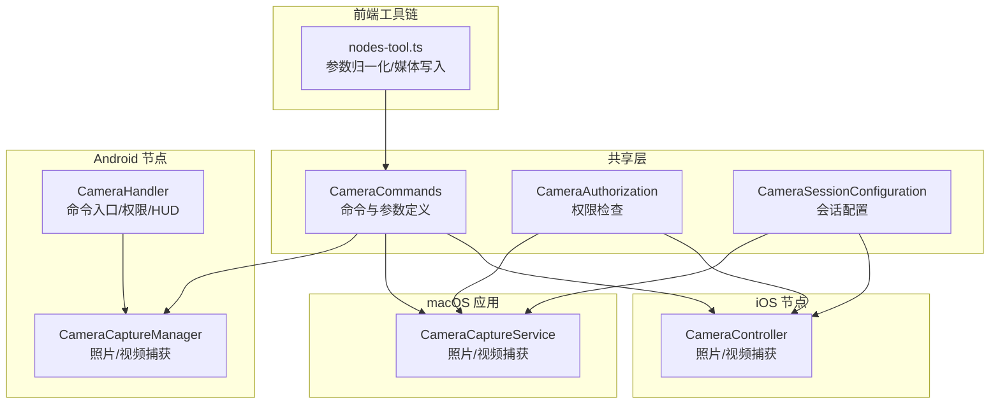
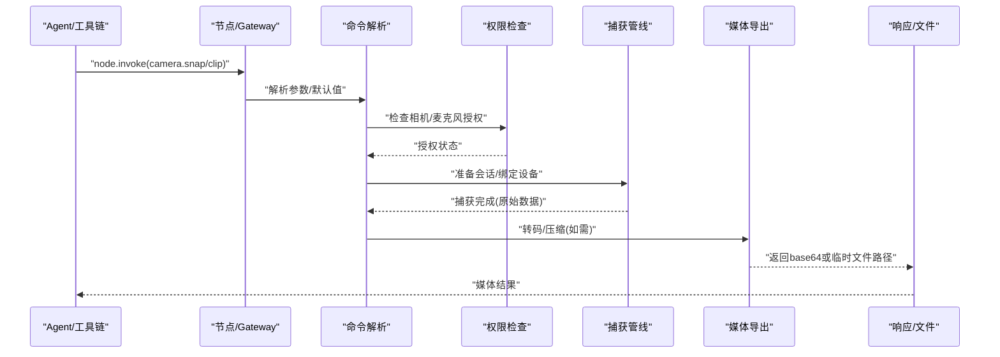
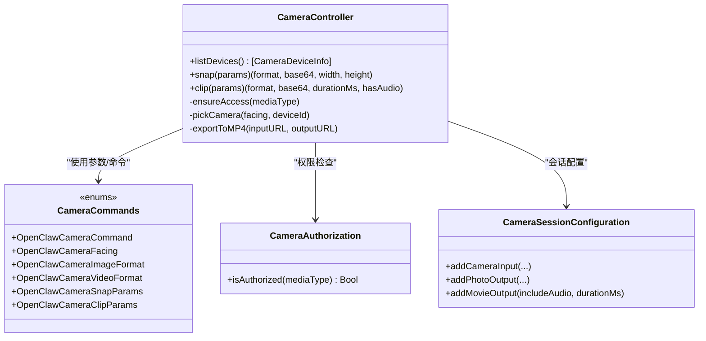
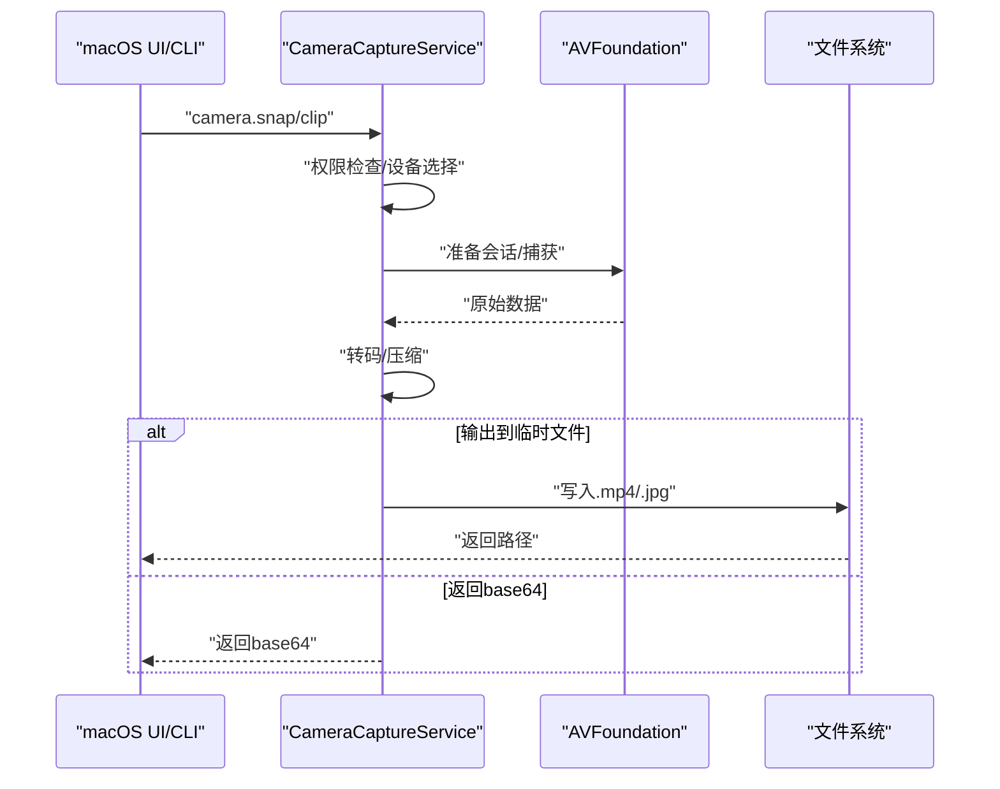
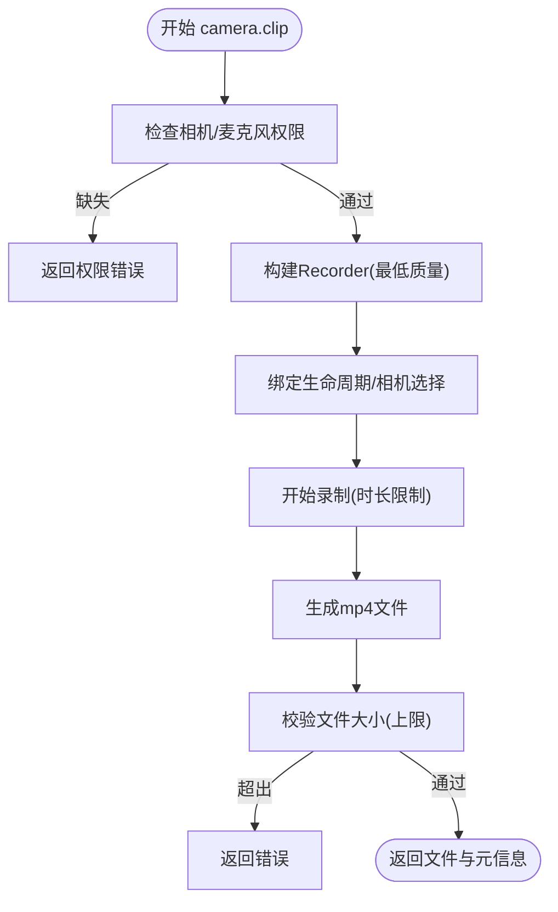
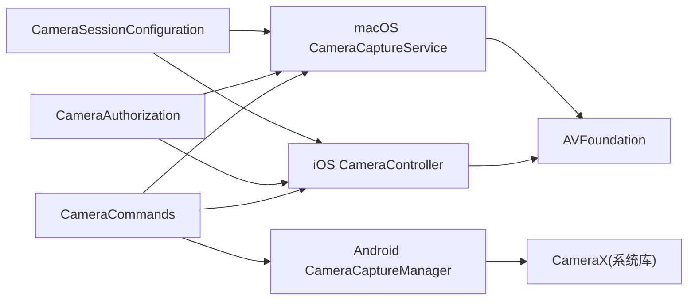

# 相机操作

<cite>
**本文引用的文件**
- [apps/ios/Sources/Camera/CameraController.swift](file://apps/ios/Sources/Camera/CameraController.swift)
- [apps/macos/Sources/OpenClaw/CameraCaptureService.swift](file://apps/macos/Sources/OpenClaw/CameraCaptureService.swift)
- [apps/android/app/src/main/java/ai/openclaw/app/node/CameraCaptureManager.kt](file://apps/android/app/src/main/java/ai/openclaw/app/node/CameraCaptureManager.kt)
- [apps/android/app/src/main/java/ai/openclaw/app/node/CameraHandler.kt](file://apps/android/app/src/main/java/ai/openclaw/app/node/CameraHandler.kt)
- [apps/shared/OpenClawKit/Sources/OpenClawKit/CameraCommands.swift](file://apps/shared/OpenClawKit/Sources/OpenClawKit/CameraCommands.swift)
- [apps/shared/OpenClawKit/Sources/OpenClawKit/CameraSessionConfiguration.swift](file://apps/shared/OpenClawKit/Sources/OpenClawKit/CameraSessionConfiguration.swift)
- [apps/shared/OpenClawKit/Sources/OpenClawKit/CameraAuthorization.swift](file://apps/shared/OpenClawKit/Sources/OpenClawKit/CameraAuthorization.swift)
- [apps/macos/Sources/OpenClaw/PermissionManager.swift](file://apps/macos/Sources/OpenClaw/PermissionManager.swift)
- [src/agents/tools/nodes-tool.ts](file://src/agents/tools/nodes-tool.ts)
- [docs/nodes/camera.md](file://docs/nodes/camera.md)
- [docs/nodes/images.md](file://docs/nodes/images.md)
- [apps/android/app/src/test/java/ai/openclaw/app/node/CameraHandlerTest.kt](file://apps/android/app/src/test/java/ai/openclaw/app/node/CameraHandlerTest.kt)
- [apps/macos/Tests/OpenClawIPCTests/CameraCaptureServiceTests.swift](file://apps/macos/Tests/OpenClawIPCTests/CameraCaptureServiceTests.swift)
</cite>

## 目录
1. [简介](#简介)
2. [项目结构](#项目结构)
3. [核心组件](#核心组件)
4. [架构总览](#架构总览)
5. [详细组件分析](#详细组件分析)
6. [依赖关系分析](#依赖关系分析)
7. [性能考量](#性能考量)
8. [故障排除指南](#故障排除指南)
9. [结论](#结论)
10. [附录](#附录)

## 简介
本技术文档围绕 OpenClaw 的相机操作能力，系统阐述相机 API 的架构设计、设备访问权限与媒体捕获机制，深入解析照片拍摄（camera.snap）与视频录制（camera.clip）的实现原理，并覆盖相机列表查询、设备选择与多摄像头支持、媒体格式转换与质量控制、文件存储策略、权限请求流程、用户授权管理与隐私保护、跨平台兼容性、错误处理与性能优化，以及 API 使用示例、调试方法与故障排除建议。

## 项目结构
OpenClaw 在 iOS、macOS 与 Android 三端分别实现了相机能力，并通过统一的命令模型与参数约定对外暴露。共享层提供跨平台通用的数据结构与会话配置接口；各平台节点负责具体设备访问、权限检查与媒体导出；前端工具链负责参数归一化与媒体写入临时文件。

**图表来源**
- [apps/shared/OpenClawKit/Sources/OpenClawKit/CameraCommands.swift:1-69](file://apps/shared/OpenClawKit/Sources/OpenClawKit/CameraCommands.swift#L1-L69)
- [apps/shared/OpenClawKit/Sources/OpenClawKit/CameraAuthorization.swift:1-21](file://apps/shared/OpenClawKit/Sources/OpenClawKit/CameraAuthorization.swift#L1-L21)
- [apps/shared/OpenClawKit/Sources/OpenClawKit/CameraSessionConfiguration.swift:1-71](file://apps/shared/OpenClawKit/Sources/OpenClawKit/CameraSessionConfiguration.swift#L1-L71)
- [apps/ios/Sources/Camera/CameraController.swift:1-354](file://apps/ios/Sources/Camera/CameraController.swift#L1-L354)
- [apps/macos/Sources/OpenClaw/CameraCaptureService.swift:1-377](file://apps/macos/Sources/OpenClaw/CameraCaptureService.swift#L1-L377)
- [apps/android/app/src/main/java/ai/openclaw/app/node/CameraCaptureManager.kt:44-335](file://apps/android/app/src/main/java/ai/openclaw/app/node/CameraCaptureManager.kt#L44-L335)
- [apps/android/app/src/main/java/ai/openclaw/app/node/CameraHandler.kt:19-123](file://apps/android/app/src/main/java/ai/openclaw/app/node/CameraHandler.kt#L19-L123)
- [src/agents/tools/nodes-tool.ts:246-328](file://src/agents/tools/nodes-tool.ts#L246-L328)

**章节来源**
- [apps/shared/OpenClawKit/Sources/OpenClawKit/CameraCommands.swift:1-69](file://apps/shared/OpenClawKit/Sources/OpenClawKit/CameraCommands.swift#L1-L69)
- [apps/shared/OpenClawKit/Sources/OpenClawKit/CameraAuthorization.swift:1-21](file://apps/shared/OpenClawKit/Sources/OpenClawKit/CameraAuthorization.swift#L1-L21)
- [apps/shared/OpenClawKit/Sources/OpenClawKit/CameraSessionConfiguration.swift:1-71](file://apps/shared/OpenClawKit/Sources/OpenClawKit/CameraSessionConfiguration.swift#L1-L71)
- [apps/ios/Sources/Camera/CameraController.swift:1-354](file://apps/ios/Sources/Camera/CameraController.swift#L1-L354)
- [apps/macos/Sources/OpenClaw/CameraCaptureService.swift:1-377](file://apps/macos/Sources/OpenClaw/CameraCaptureService.swift#L1-L377)
- [apps/android/app/src/main/java/ai/openclaw/app/node/CameraCaptureManager.kt:44-335](file://apps/android/app/src/main/java/ai/openclaw/app/node/CameraCaptureManager.kt#L44-L335)
- [apps/android/app/src/main/java/ai/openclaw/app/node/CameraHandler.kt:19-123](file://apps/android/app/src/main/java/ai/openclaw/app/node/CameraHandler.kt#L19-L123)
- [src/agents/tools/nodes-tool.ts:246-328](file://src/agents/tools/nodes-tool.ts#L246-L328)

## 核心组件
- 命令与参数模型：定义 camera.list/snap/clip 及其参数类型，确保跨平台一致的调用契约。
- 权限检查：在各平台对相机与麦克风进行授权状态检查与交互式授权请求。
- 会话配置：构建 AV 捕获会话，添加输入输出，设置录制时长与音频开关。
- 捕获执行：iOS/macOS 使用 AVFoundation 进行照片与视频捕获；Android 使用 CameraX 进行拍照与录制。
- 媒体导出与格式转换：将原始媒体转码为 mp4，必要时进行 JPEG 压缩以控制载荷大小。
- 设备发现与选择：枚举可用摄像头，按朝向或设备 ID 选择目标设备。
- 参数归一化与安全限制：默认值、范围约束、最大时长与最大载荷限制。

**章节来源**
- [apps/shared/OpenClawKit/Sources/OpenClawKit/CameraCommands.swift:1-69](file://apps/shared/OpenClawKit/Sources/OpenClawKit/CameraCommands.swift#L1-L69)
- [apps/shared/OpenClawKit/Sources/OpenClawKit/CameraAuthorization.swift:1-21](file://apps/shared/OpenClawKit/Sources/OpenClawKit/CameraAuthorization.swift#L1-L21)
- [apps/shared/OpenClawKit/Sources/OpenClawKit/CameraSessionConfiguration.swift:1-71](file://apps/shared/OpenClawKit/Sources/OpenClawKit/CameraSessionConfiguration.swift#L1-L71)
- [apps/ios/Sources/Camera/CameraController.swift:40-142](file://apps/ios/Sources/Camera/CameraController.swift#L40-L142)
- [apps/macos/Sources/OpenClaw/CameraCaptureService.swift:51-164](file://apps/macos/Sources/OpenClaw/CameraCaptureService.swift#L51-L164)
- [apps/android/app/src/main/java/ai/openclaw/app/node/CameraCaptureManager.kt:97-266](file://apps/android/app/src/main/java/ai/openclaw/app/node/CameraCaptureManager.kt#L97-L266)

## 架构总览
下图展示从命令到设备访问与媒体导出的整体流程，以及跨平台差异点。

**图表来源**
- [apps/ios/Sources/Camera/CameraController.swift:40-142](file://apps/ios/Sources/Camera/CameraController.swift#L40-L142)
- [apps/macos/Sources/OpenClaw/CameraCaptureService.swift:51-164](file://apps/macos/Sources/OpenClaw/CameraCaptureService.swift#L51-L164)
- [apps/android/app/src/main/java/ai/openclaw/app/node/CameraCaptureManager.kt:97-266](file://apps/android/app/src/main/java/ai/openclaw/app/node/CameraCaptureManager.kt#L97-L266)
- [apps/shared/OpenClawKit/Sources/OpenClawKit/CameraCommands.swift:1-69](file://apps/shared/OpenClawKit/Sources/OpenClawKit/CameraCommands.swift#L1-L69)

## 详细组件分析

### iOS 相机组件
- 模块职责
  - 提供 list/snap/clip 三类 API，内部封装 AVFoundation 捕获与导出。
  - 支持设备选择（按朝向或设备 ID）、延时拍摄、质量与尺寸控制。
  - 录制时可选音频，最终导出为 mp4。
- 关键流程
  - 权限检查：通过 CameraAuthorization 判断并请求相机/麦克风授权。
  - 会话准备：使用 CameraCapturePipelineSupport 配置输入输出与超时/时长限制。
  - 导出：视频采用 AVAssetExportSession 转码为 mp4，照片进行 JPEG 压缩以控制载荷。
- 错误处理
  - 明确区分“权限拒绝”“设备不可用”“捕获失败”“导出失败”等错误类型，便于上层提示与重试。

**图表来源**
- [apps/ios/Sources/Camera/CameraController.swift:6-260](file://apps/ios/Sources/Camera/CameraController.swift#L6-L260)
- [apps/shared/OpenClawKit/Sources/OpenClawKit/CameraCommands.swift:1-69](file://apps/shared/OpenClawKit/Sources/OpenClawKit/CameraCommands.swift#L1-L69)
- [apps/shared/OpenClawKit/Sources/OpenClawKit/CameraAuthorization.swift:1-21](file://apps/shared/OpenClawKit/Sources/OpenClawKit/CameraAuthorization.swift#L1-L21)
- [apps/shared/OpenClawKit/Sources/OpenClawKit/CameraSessionConfiguration.swift:1-71](file://apps/shared/OpenClawKit/Sources/OpenClawKit/CameraSessionConfiguration.swift#L1-L71)

**章节来源**
- [apps/ios/Sources/Camera/CameraController.swift:40-260](file://apps/ios/Sources/Camera/CameraController.swift#L40-L260)
- [apps/shared/OpenClawKit/Sources/OpenClawKit/CameraCommands.swift:1-69](file://apps/shared/OpenClawKit/Sources/OpenClawKit/CameraCommands.swift#L1-L69)
- [apps/shared/OpenClawKit/Sources/OpenClawKit/CameraAuthorization.swift:1-21](file://apps/shared/OpenClawKit/Sources/OpenClawKit/CameraAuthorization.swift#L1-L21)
- [apps/shared/OpenClawKit/Sources/OpenClawKit/CameraSessionConfiguration.swift:1-71](file://apps/shared/OpenClawKit/Sources/OpenClawKit/CameraSessionConfiguration.swift#L1-L71)

### macOS 相机组件
- 模块职责
  - 与 iOS 类似，提供 list/snap/clip，但默认关闭用户开关，需要显式允许。
  - 支持外部摄像头（macOS 14+），自动发现并可按设备 ID 选择。
- 关键流程
  - 权限检查：通过 PermissionManager 与 CameraAuthorization 协作，必要时引导用户前往系统设置。
  - 捕获与导出：与 iOS 一致，先捕获后转码为 mp4，照片进行 JPEG 压缩。
- 文件存储
  - 默认写入临时目录，也可由调用方指定输出路径。

**图表来源**
- [apps/macos/Sources/OpenClaw/CameraCaptureService.swift:51-164](file://apps/macos/Sources/OpenClaw/CameraCaptureService.swift#L51-L164)
- [apps/macos/Sources/OpenClaw/PermissionManager.swift:134-150](file://apps/macos/Sources/OpenClaw/PermissionManager.swift#L134-L150)

**章节来源**
- [apps/macos/Sources/OpenClaw/CameraCaptureService.swift:51-296](file://apps/macos/Sources/OpenClaw/CameraCaptureService.swift#L51-L296)
- [apps/macos/Sources/OpenClaw/PermissionManager.swift:134-150](file://apps/macos/Sources/OpenClaw/PermissionManager.swift#L134-L150)

### Android 相机组件
- 模块职责
  - 通过 CameraCaptureManager 统一实现 list/snap/clip；CameraHandler 作为 Gateway 入口，负责 HUD、权限与错误映射。
  - 支持设备选择与前置/后置摄像头切换；录制时可选音频。
- 关键流程
  - 权限：运行时申请 CAMERA/RECORD_AUDIO；缺失时抛出明确错误。
  - 捕获：使用 CameraX 的 ImageCapture/VideoCapture；录制采用最低质量以减小载荷。
  - 导出：视频直接生成 mp4（CameraX Recorder 已内置导出）。
- 安全与限制
  - 对 clip 的原始字节大小进行上限校验，避免网关消息过大。
  - 对 clip 时长进行上限限制，防止超大文件。

**图表来源**
- [apps/android/app/src/main/java/ai/openclaw/app/node/CameraCaptureManager.kt:162-266](file://apps/android/app/src/main/java/ai/openclaw/app/node/CameraCaptureManager.kt#L162-L266)
- [apps/android/app/src/main/java/ai/openclaw/app/node/CameraHandler.kt:96-123](file://apps/android/app/src/main/java/ai/openclaw/app/node/CameraHandler.kt#L96-L123)

**章节来源**
- [apps/android/app/src/main/java/ai/openclaw/app/node/CameraCaptureManager.kt:65-266](file://apps/android/app/src/main/java/ai/openclaw/app/node/CameraCaptureManager.kt#L65-L266)
- [apps/android/app/src/main/java/ai/openclaw/app/node/CameraHandler.kt:19-123](file://apps/android/app/src/main/java/ai/openclaw/app/node/CameraHandler.kt#L19-L123)

### 参数归一化与媒体写入
- 工具链负责将节点返回的 payload 写入临时文件，并在需要时注入图像内容，便于下游模型理解。
- 默认参数与范围约束在工具链侧统一处理，保证不同平台行为一致。

**章节来源**
- [src/agents/tools/nodes-tool.ts:246-328](file://src/agents/tools/nodes-tool.ts#L246-L328)
- [apps/macos/Tests/OpenClawIPCTests/CameraCaptureServiceTests.swift:5-19](file://apps/macos/Tests/OpenClawIPCTests/CameraCaptureServiceTests.swift#L5-L19)

## 依赖关系分析
- 命令与参数
  - 所有平台共享 OpenClawCameraCommand 与参数结构，确保调用一致性。
- 权限与会话
  - iOS/macOS 使用 AVFoundation 与 CameraAuthorization；Android 使用 CameraX 与系统权限框架。
- 导出与格式
  - 视频统一导出为 mp4；照片统一转码为 JPEG 并控制尺寸与质量，以满足网关载荷限制。

**图表来源**
- [apps/shared/OpenClawKit/Sources/OpenClawKit/CameraCommands.swift:1-69](file://apps/shared/OpenClawKit/Sources/OpenClawKit/CameraCommands.swift#L1-L69)
- [apps/shared/OpenClawKit/Sources/OpenClawKit/CameraAuthorization.swift:1-21](file://apps/shared/OpenClawKit/Sources/OpenClawKit/CameraAuthorization.swift#L1-L21)
- [apps/shared/OpenClawKit/Sources/OpenClawKit/CameraSessionConfiguration.swift:1-71](file://apps/shared/OpenClawKit/Sources/OpenClawKit/CameraSessionConfiguration.swift#L1-L71)
- [apps/ios/Sources/Camera/CameraController.swift:1-354](file://apps/ios/Sources/Camera/CameraController.swift#L1-L354)
- [apps/macos/Sources/OpenClaw/CameraCaptureService.swift:1-377](file://apps/macos/Sources/OpenClaw/CameraCaptureService.swift#L1-L377)
- [apps/android/app/src/main/java/ai/openclaw/app/node/CameraCaptureManager.kt:1-335](file://apps/android/app/src/main/java/ai/openclaw/app/node/CameraCaptureManager.kt#L1-L335)

**章节来源**
- [apps/shared/OpenClawKit/Sources/OpenClawKit/CameraCommands.swift:1-69](file://apps/shared/OpenClawKit/Sources/OpenClawKit/CameraCommands.swift#L1-L69)
- [apps/shared/OpenClawKit/Sources/OpenClawKit/CameraAuthorization.swift:1-21](file://apps/shared/OpenClawKit/Sources/OpenClawKit/CameraAuthorization.swift#L1-L21)
- [apps/shared/OpenClawKit/Sources/OpenClawKit/CameraSessionConfiguration.swift:1-71](file://apps/shared/OpenClawKit/Sources/OpenClawKit/CameraSessionConfiguration.swift#L1-L71)
- [apps/ios/Sources/Camera/CameraController.swift:1-354](file://apps/ios/Sources/Camera/CameraController.swift#L1-L354)
- [apps/macos/Sources/OpenClaw/CameraCaptureService.swift:1-377](file://apps/macos/Sources/OpenClaw/CameraCaptureService.swift#L1-L377)
- [apps/android/app/src/main/java/ai/openclaw/app/node/CameraCaptureManager.kt:1-335](file://apps/android/app/src/main/java/ai/openclaw/app/node/CameraCaptureManager.kt#L1-L335)

## 性能考量
- 时长与载荷限制
  - 视频录制默认最大时长限制，避免超大文件；Android 对 clip 的原始字节上限进行校验。
- 质量与尺寸
  - 照片默认最大宽度与质量在各平台均有合理默认值，避免过大的 base64 载荷。
- 导出策略
  - 视频统一转码为 mp4，优先网络优化；照片 JPEG 压缩以控制体积。
- 设备选择
  - 通过设备 ID 或朝向快速定位目标摄像头，减少无效尝试。

**章节来源**
- [apps/ios/Sources/Camera/CameraController.swift:211-215](file://apps/ios/Sources/Camera/CameraController.swift#L211-L215)
- [apps/macos/Sources/OpenClaw/CameraCaptureService.swift:227-230](file://apps/macos/Sources/OpenClaw/CameraCaptureService.swift#L227-L230)
- [apps/android/app/src/main/java/ai/openclaw/app/node/CameraHandler.kt:19-20](file://apps/android/app/src/main/java/ai/openclaw/app/node/CameraHandler.kt#L19-L20)
- [apps/android/app/src/test/java/ai/openclaw/app/node/CameraHandlerTest.kt:10-24](file://apps/android/app/src/test/java/ai/openclaw/app/node/CameraHandlerTest.kt#L10-L24)

## 故障排除指南
- 权限相关
  - iOS/macOS：若提示权限被拒，根据平台指引前往系统设置开启相机/麦克风授权。
  - Android：缺少 CAMERA/RECORD_AUDIO 权限时会触发权限请求；拒绝后需手动授权。
- 设备不可用
  - 确认设备 ID 是否仍有效；更换朝向或重新扫描设备列表。
- 录制失败
  - 检查时长是否超过上限；确认音频开关与麦克风可用性。
- 载荷过大
  - 减小 maxWidth 或降低 quality；缩短录制时长。
- 工具链问题
  - 确认 payload 格式与 MIME 类型；检查临时文件写入权限。

**章节来源**
- [apps/macos/Sources/OpenClaw/PermissionManager.swift:134-150](file://apps/macos/Sources/OpenClaw/PermissionManager.swift#L134-L150)
- [apps/ios/Sources/Camera/CameraController.swift:14-38](file://apps/ios/Sources/Camera/CameraController.swift#L14-L38)
- [apps/macos/Sources/OpenClaw/CameraCaptureService.swift:16-37](file://apps/macos/Sources/OpenClaw/CameraCaptureService.swift#L16-L37)
- [apps/android/app/src/main/java/ai/openclaw/app/node/CameraHandler.kt:52-55](file://apps/android/app/src/main/java/ai/openclaw/app/node/CameraHandler.kt#L52-L55)

## 结论
OpenClaw 的相机能力在 iOS、macOS 与 Android 三端保持一致的命令语义与参数模型，同时针对各平台特性进行适配：iOS/macOS 强化 AVFoundation 的稳定性与导出质量；Android 通过 CameraX 实现更广泛的设备兼容与更低的传输开销。配合严格的权限管理、设备选择与安全限制，相机功能在保障用户体验的同时兼顾了安全性与性能。

## 附录

### API 使用示例（概述）
- iOS/macOS 节点
  - 列表：camera.list
  - 照片：camera.snap（默认前摄、最大宽度 1600、质量 0.9）
  - 视频：camera.clip（默认 3 秒、含音频、导出 mp4）
- Android 节点
  - 列表：camera.list
  - 照片：camera.snap（需 CAMERA 权限）
  - 视频：camera.clip（需 CAMERA/RECORD_AUDIO 权限）
- 工具链
  - 通过 CLI 将 payload 写入临时文件，便于后续处理与回复。

**章节来源**
- [docs/nodes/camera.md:11-163](file://docs/nodes/camera.md#L11-L163)
- [src/agents/tools/nodes-tool.ts:246-328](file://src/agents/tools/nodes-tool.ts#L246-L328)

### 媒体格式与存储策略
- 图像：默认 JPEG，尺寸与质量受控，base64 载荷限制。
- 视频：统一导出为 mp4，时长与质量受控，避免超大文件。
- 存储：默认写入临时目录，也可指定输出路径。

**章节来源**
- [docs/nodes/images.md:28-31](file://docs/nodes/images.md#L28-L31)
- [apps/ios/Sources/Camera/CameraController.swift:217-252](file://apps/ios/Sources/Camera/CameraController.swift#L217-L252)
- [apps/macos/Sources/OpenClaw/CameraCaptureService.swift:239-274](file://apps/macos/Sources/OpenClaw/CameraCaptureService.swift#L239-L274)