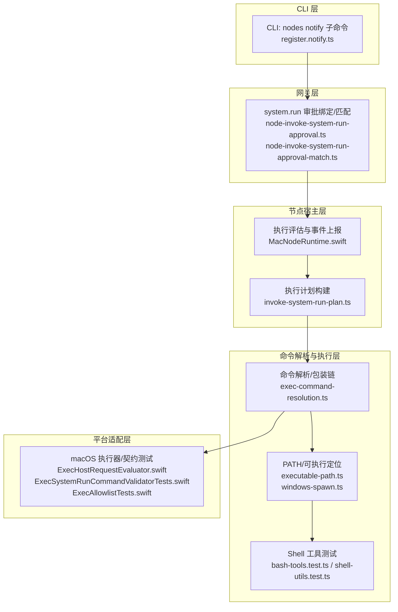
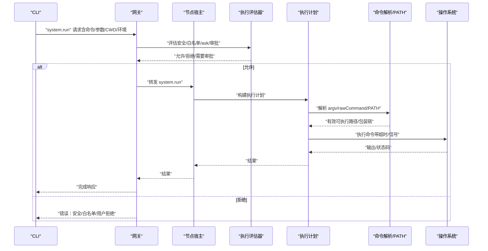
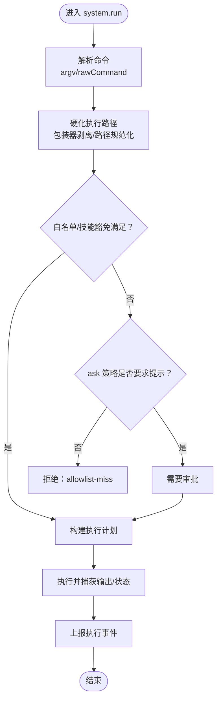
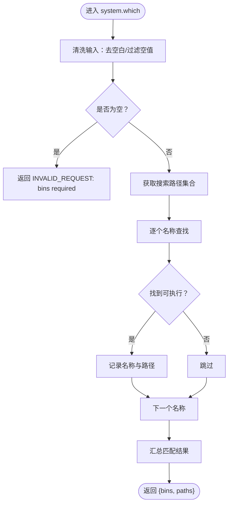
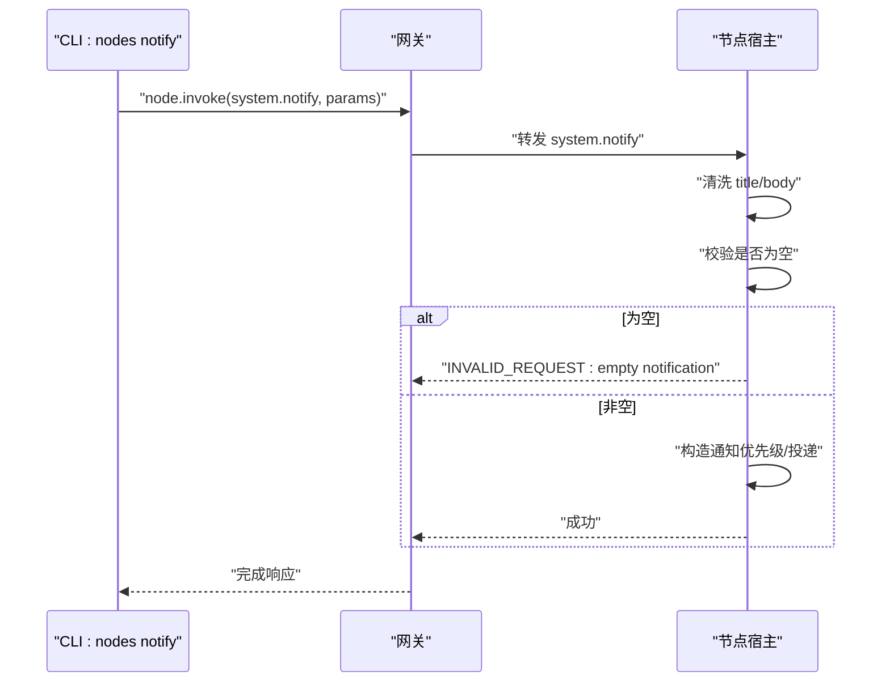
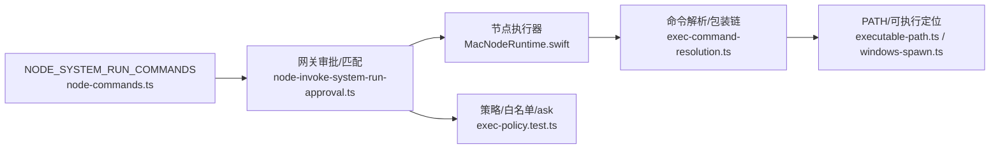

# 系统命令

<cite>
**本文引用的文件**
- [src/infra/node-commands.ts](file://src/infra/node-commands.ts)
- [apps/macos/Sources/OpenClaw/NodeMode/MacNodeRuntime.swift](file://apps/macos/Sources/OpenClaw/NodeMode/MacNodeRuntime.swift)
- [apps/macos/Sources/OpenClaw/NodeMode/MacNodeRuntime.swift](file://apps/macos/Sources/OpenClaw/NodeMode/MacNodeRuntime.swift)
- [apps/macos/Sources/OpenClaw/NodeMode/MacNodeRuntime.swift](file://apps/macos/Sources/OpenClaw/NodeMode/MacNodeRuntime.swift)
- [apps/macos/Sources/OpenClaw/NodeMode/MacNodeRuntime.swift](file://apps/macos/Sources/OpenClaw/NodeMode/MacNodeRuntime.swift)
- [apps/macos/Sources/OpenClaw/NodeMode/MacNodeRuntime.swift](file://apps/macos/Sources/OpenClaw/NodeMode/MacNodeRuntime.swift)
- [apps/macos/Sources/OpenClaw/NodeMode/MacNodeRuntime.swift](file://apps/macos/Sources/OpenClaw/NodeMode/MacNodeRuntime.swift)
- [apps/macos/Sources/OpenClaw/NodeMode/MacNodeRuntime.swift](file://apps/macos/Sources/OpenClaw/NodeMode/MacNodeRuntime.swift)
- [apps/macos/Sources/OpenClaw/NodeMode/MacNodeRuntime.swift](file://apps/macos/Sources/OpenClaw/NodeMode/MacNodeRuntime.swift)
- [apps/macos/Sources/OpenClaw/NodeMode/MacNodeRuntime.swift](file://apps/macos/Sources/OpenClaw/NodeMode/MacNodeRuntime.swift)
- [apps/macos/Sources/OpenClaw/NodeMode/MacNodeRuntime.swift](file://apps/macos/Sources/OpenClaw/NodeMode/MacNodeRuntime.swift)
- [apps/macos/Sources/OpenClaw/NodeMode/MacNodeRuntime.swift](file://apps/macos/Sources/OpenClaw/NodeMode/MacNodeRuntime.swift)
- [apps/macos/Sources/OpenClaw/NodeMode/MacNodeRuntime.swift](file://apps/macos/Sources/OpenClaw/NodeMode/MacNodeRuntime.swift)
- [apps/macos/Sources/OpenClaw/NodeMode/MacNodeRuntime.swift](file://apps/macos/Sources/OpenClaw/NodeMode/MacNodeRuntime.swift)
- [apps/macos/Sources/OpenClaw/NodeMode/MacNodeRuntime.swift](file://apps/macos/Sources/OpenClaw/NodeMode/MacNodeRuntime.swift)
- [apps/macos/Sources/OpenClaw/NodeMode/MacNodeRuntime.swift](file://apps......)
- [src/infra/exec-command-resolution.ts](file://src/infra/exec-command-resolution.ts)
- [src/infra/executable-path.ts](file://src/infra/executable-path.ts)
- [src/plugin-sdk/windows-spawn.ts](file://src/plugin-sdk/windows-spawn.ts)
- [src/agents/bash-tools.test.ts](file://src/agents/bash-tools.test.ts)
- [src/agents/shell-utils.test.ts](file://src/agents/shell-utils.test.ts)
- [src/infra/exec-approvals-analysis.ts](file://src/infra/exec-approvals-analysis.ts)
- [src/infra/exec-command-resolution.test.ts](file://src/infra/exec-command-resolution.test.ts)
- [extensions/diffs/src/browser.ts](file://extensions/diffs/src/browser.ts)
- [apps/macos/Sources/OpenClaw/ExecCommandResolution.swift](file://apps/macos/Sources/OpenClaw/ExecCommandResolution.swift)
- [apps/macos/Tests/OpenClawIPCTests/ExecSystemRunCommandValidatorTests.swift](file://apps/macos/Tests/OpenClawIPCTests/ExecSystemRunCommandValidatorTests.swift)
- [apps/macos/Tests/OpenClawIPCTests/ExecAllowlistTests.swift](file://apps/macos/Tests/OpenClawIPCTests/ExecAllowlistTests.swift)
- [src/gateway/node-invoke-system-run-approval.ts](file://src/gateway/node-invoke-system-run-approval.ts)
- [src/gateway/node-invoke-system-run-approval-match.ts](file://src/gateway/node-invoke-system-run-approval-match.ts)
- [src/gateway/node-invoke-system-run-approval-errors.ts](file://src/gateway/node-invoke-system-run-approval-errors.ts)
- [src/gateway/system-run-approval-binding.contract.test.ts](file://src/gateway/system-run-approval-binding.contract.test.ts)
- [src/node-host/invoke-system-run-plan.ts](file://src/node-host/invoke-system-run-plan.ts)
- [src/node-host/exec-policy.test.ts](file://src/node-host/exec-policy.test.ts)
- [apps/macos/Sources/OpenClaw/ExecHostRequestEvaluator.swift](file://apps/macos/Sources/OpenClaw/ExecHostRequestEvaluator.swift)
- [src/cli/nodes-cli/register.notify.ts](file://src/cli/nodes-cli/register.notify.ts)
- [src/commands/systemd-linger.ts](file://src/commands/systemd-linger.ts)
- [src/agents/openclaw-tools.camera.test.ts](file://src/agents/openclaw-tools.camera.test.ts)
- [src/infra/node-commands.ts](file://src/infra/node-commands.ts)
</cite>

## 目录
1. [简介](#简介)
2. [项目结构](#项目结构)
3. [核心组件](#核心组件)
4. [架构总览](#架构总览)
5. [组件详解](#组件详解)
6. [依赖关系分析](#依赖关系分析)
7. [性能考量](#性能考量)
8. [故障排除指南](#故障排除指南)
9. [结论](#结论)
10. [附录](#附录)

## 简介
本文件面向 OpenClaw 的“系统命令”能力，系统性阐述 system.run、system.which、system.notify 三类命令的架构设计、权限控制与安全沙箱机制。内容覆盖命令解析与 PATH 解析、跨平台 Shell 包装器处理、白名单与审批流程、超时与输出捕获、错误处理策略，并提供可操作的使用示例、安全配置建议与排障指引。

## 项目结构
围绕系统命令的关键代码分布在以下层次：
- CLI 层：节点侧 CLI 对 system.notify 的封装调用
- 网关层：system.run 的审批绑定、匹配与转发
- 节点宿主层：system.run 的安全评估、执行计划与事件上报
- 命令解析与执行层：PATH 解析、可执行文件定位、跨平台包装器处理
- 平台适配层：macOS Swift 执行器与测试契约校验

图表来源
- [src/cli/nodes-cli/register.notify.ts:1-57](file://src/cli/nodes-cli/register.notify.ts#L1-L57)
- [src/gateway/node-invoke-system-run-approval.ts](file://src/gateway/node-invoke-system-run-approval.ts)
- [src/gateway/node-invoke-system-run-approval-match.ts](file://src/gateway/node-invoke-system-run-approval-match.ts)
- [apps/macos/Sources/OpenClaw/NodeMode/MacNodeRuntime.swift:458-763](file://apps/macos/Sources/OpenClaw/NodeMode/MacNodeRuntime.swift#L458-L763)
- [src/node-host/invoke-system-run-plan.ts:1036-1087](file://src/node-host/invoke-system-run-plan.ts#L1036-L1087)
- [src/infra/exec-command-resolution.ts:50-141](file://src/infra/exec-command-resolution.ts#L50-L141)
- [src/infra/executable-path.ts:64-100](file://src/infra/executable-path.ts#L64-L100)
- [src/plugin-sdk/windows-spawn.ts:60-97](file://src/plugin-sdk/windows-spawn.ts#L60-L97)
- [apps/macos/Sources/OpenClaw/ExecHostRequestEvaluator.swift:40-84](file://apps/macos/Sources/OpenClaw/ExecHostRequestEvaluator.swift#L40-L84)
- [apps/macos/Tests/OpenClawIPCTests/ExecSystemRunCommandValidatorTests.swift:1-40](file://apps/macos/Tests/OpenClawIPCTests/ExecSystemRunCommandValidatorTests.swift#L1-L40)
- [apps/macos/Tests/OpenClawIPCTests/ExecAllowlistTests.swift:174-201](file://apps/macos/Tests/OpenClawIPCTests/ExecAllowlistTests.swift#L174-L201)

章节来源
- [src/infra/node-commands.ts:1-14](file://src/infra/node-commands.ts#L1-L14)
- [src/cli/nodes-cli/register.notify.ts:1-57](file://src/cli/nodes-cli/register.notify.ts#L1-L57)

## 核心组件
- system.run：在节点侧执行任意命令，前置安全评估与审批流程，支持白名单、技能豁免、ask 提示策略与审批决策
- system.which：查询 PATH 中可执行文件路径，返回匹配结果
- system.notify：向 macOS 发送本地通知（通过 CLI 调用节点执行）

章节来源
- [src/infra/node-commands.ts:1-14](file://src/infra/node-commands.ts#L1-L14)
- [apps/macos/Sources/OpenClaw/NodeMode/MacNodeRuntime.swift:556-763](file://apps/macos/Sources/OpenClaw/NodeMode/MacNodeRuntime.swift#L556-L763)
- [src/cli/nodes-cli/register.notify.ts:1-57](file://src/cli/nodes-cli/register.notify.ts#L1-L57)

## 架构总览
system.run 的端到端执行流如下：

图表来源
- [apps/macos/Sources/OpenClaw/NodeMode/MacNodeRuntime.swift:458-763](file://apps/macos/Sources/OpenClaw/NodeMode/MacNodeRuntime.swift#L458-L763)
- [src/node-host/invoke-system-run-plan.ts:1036-1087](file://src/node-host/invoke-system-run-plan.ts#L1036-L1087)
- [src/infra/exec-command-resolution.ts:50-141](file://src/infra/exec-command-resolution.ts#L50-L141)
- [src/infra/executable-path.ts:64-100](file://src/infra/executable-path.ts#L64-L100)

## 组件详解

### system.run：执行与审批
- 参数与请求体
  - 支持 command（argv 列表）与 rawCommand（原始字符串），二者用于不同解析路径
  - 可选 cwd、agentId、sessionKey、env 覆盖等
- 安全评估与审批
  - 评估阶段会进行命令解析、包装器链剥离、白名单匹配、ask 策略判断
  - 若安全策略为 deny 或白名单不满足且无技能豁免，则直接拒绝
  - 需要用户审批时返回“需要审批”，否则允许执行
- 执行计划
  - 构建 argv、cwd、显示命令文本与预览、可变文件操作快照等
  - 将计划传递给节点执行器，执行后上报事件
- 错误处理
  - 安全拒绝、用户拒绝、白名单未命中、超时或无效审批决策均会抛出明确错误

图表来源
- [src/node-host/invoke-system-run-plan.ts:1036-1087](file://src/node-host/invoke-system-run-plan.ts#L1036-L1087)
- [apps/macos/Sources/OpenClaw/NodeMode/MacNodeRuntime.swift:458-763](file://apps/macos/Sources/OpenClaw/NodeMode/MacNodeRuntime.swift#L458-L763)
- [apps/macos/Sources/OpenClaw/ExecHostRequestEvaluator.swift:40-84](file://apps/macos/Sources/OpenClaw/ExecHostRequestEvaluator.swift#L40-L84)

章节来源
- [src/gateway/node-invoke-system-run-approval.ts](file://src/gateway/node-invoke-system-run-approval.ts)
- [src/gateway/node-invoke-system-run-approval-match.ts](file://src/gateway/node-invoke-system-run-approval-match.ts)
- [src/gateway/node-invoke-system-run-approval-errors.ts](file://src/gateway/node-invoke-system-run-approval-errors.ts)
- [src/gateway/system-run-approval-binding.contract.test.ts:51-90](file://src/gateway/system-run-approval-binding.contract.test.ts#L51-L90)
- [src/node-host/invoke-system-run-plan.ts:1036-1087](file://src/node-host/invoke-system-run-plan.ts#L1036-L1087)
- [apps/macos/Sources/OpenClaw/ExecHostRequestEvaluator.swift:40-84](file://apps/macos/Sources/OpenClaw/ExecHostRequestEvaluator.swift#L40-L84)
- [apps/macos/Tests/OpenClawIPCTests/ExecSystemRunCommandValidatorTests.swift:1-40](file://apps/macos/Tests/OpenClawIPCTests/ExecSystemRunCommandValidatorTests.swift#L1-L40)

### system.which：PATH 查询
- 输入：可执行名称数组
- 行为：遍历 preferredPaths（由 CommandResolver 提供），查找每个名称对应的可执行路径
- 输出：匹配成功的名称列表与对应路径映射
- 错误：当输入为空时返回无效请求错误

图表来源
- [apps/macos/Sources/OpenClaw/NodeMode/MacNodeRuntime.swift:556-580](file://apps/macos/Sources/OpenClaw/NodeMode/MacNodeRuntime.swift#L556-L580)

章节来源
- [apps/macos/Sources/OpenClaw/NodeMode/MacNodeRuntime.swift:556-580](file://apps/macos/Sources/OpenClaw/NodeMode/MacNodeRuntime.swift#L556-L580)

### system.notify：本地通知
- CLI 使用：nodes notify 子命令封装 system.notify 调用，支持标题、正文、声音、优先级、投递模式与超时
- 节点侧行为：对标题/正文进行清洗；若两者均为空则返回无效请求；根据优先级与投递模式构造通知并发送

图表来源
- [src/cli/nodes-cli/register.notify.ts:1-57](file://src/cli/nodes-cli/register.notify.ts#L1-L57)
- [apps/macos/Sources/OpenClaw/NodeMode/MacNodeRuntime.swift:753-763](file://apps/macos/Sources/OpenClaw/NodeMode/MacNodeRuntime.swift#L753-L763)

章节来源
- [src/cli/nodes-cli/register.notify.ts:1-57](file://src/cli/nodes-cli/register.notify.ts#L1-L57)
- [apps/macos/Sources/OpenClaw/NodeMode/MacNodeRuntime.swift:753-763](file://apps/macos/Sources/OpenClaw/NodeMode/MacNodeRuntime.swift#L753-L763)

## 依赖关系分析
- 命令注册与路由
  - 节点侧系统命令集合包含 system.run.prepare、system.run、system.which
  - system.notify 作为独立节点命令存在
- 执行前解析
  - 命令解析器负责从 argv 或 rawCommand 中提取首个 token，识别包装器链（如 env、nice 等），并剥离透明包装以还原真实可执行
  - PATH 解析器在跨平台环境下分别处理 Unix 风格与 Windows 分号分隔、扩展名匹配
- 审批与白名单
  - 网关侧对 argv 进行分析，结合安全策略、ask 策略、白名单与技能豁免决定是否放行
  - 节点侧执行器根据评估结果返回允许/拒绝/需要审批

图表来源
- [src/infra/node-commands.ts:1-14](file://src/infra/node-commands.ts#L1-L14)
- [src/gateway/node-invoke-system-run-approval.ts](file://src/gateway/node-invoke-system-run-approval.ts)
- [apps/macos/Sources/OpenClaw/NodeMode/MacNodeRuntime.swift:458-763](file://apps/macos/Sources/OpenClaw/NodeMode/MacNodeRuntime.swift#L458-L763)
- [src/infra/exec-command-resolution.ts:50-141](file://src/infra/exec-command-resolution.ts#L50-L141)
- [src/infra/executable-path.ts:64-100](file://src/infra/executable-path.ts#L64-L100)
- [src/plugin-sdk/windows-spawn.ts:60-97](file://src/plugin-sdk/windows-spawn.ts#L60-L97)
- [src/node-host/exec-policy.test.ts:1-46](file://src/node-host/exec-policy.test.ts#L1-L46)

章节来源
- [src/infra/node-commands.ts:1-14](file://src/infra/node-commands.ts#L1-L14)
- [src/infra/exec-command-resolution.ts:50-141](file://src/infra/exec-command-resolution.ts#L50-L141)
- [src/infra/executable-path.ts:64-100](file://src/infra/executable-path.ts#L64-L100)
- [src/plugin-sdk/windows-spawn.ts:60-97](file://src/plugin-sdk/windows-spawn.ts#L60-L97)
- [src/node-host/exec-policy.test.ts:1-46](file://src/node-host/exec-policy.test.ts#L1-L46)

## 性能考量
- 命令解析与 PATH 查找
  - 在 PATH 较长或 Windows 多扩展名场景下，查找成本线性增长；建议合理组织 PATH，避免冗余条目
- 包装器链剥离
  - 透明包装器（如 env、nice）会增加一次解析开销；非必要不引入深层包装链
- 执行超时与资源限制
  - 建议为命令执行设置合理超时，防止长时间阻塞；在容器/沙箱中配合 CPU/内存限额
- 事件上报与日志
  - 执行事件上报应异步化，避免阻塞主执行路径

## 故障排除指南
- system.run 返回“安全禁用”
  - 检查安全策略是否为 deny；若为 allowlist，请确认命令已满足白名单或具备技能豁免
- system.run 返回“需要审批”
  - 触发 ask 策略；在网关侧完成审批或调整 ask 设置
- system.run 返回“白名单未命中”
  - 将目标命令加入白名单或临时提升 ask 策略；核对 argv 与包装器链是否被正确剥离
- system.run 返回“用户拒绝”
  - 用户在审批流程中拒绝；重新发起或调整审批策略
- system.which 无结果
  - 确认名称存在于 PATH；检查大小写与扩展名；在 Windows 下确认 PATHEXT 配置
- system.notify 无效
  - 确保标题或正文至少一项非空；检查优先级与投递模式参数

章节来源
- [apps/macos/Sources/OpenClaw/ExecHostRequestEvaluator.swift:40-84](file://apps/macos/Sources/OpenClaw/ExecHostRequestEvaluator.swift#L40-L84)
- [apps/macos/Tests/OpenClawIPCTests/ExecSystemRunCommandValidatorTests.swift:1-40](file://apps/macos/Tests/OpenClawIPCTests/ExecSystemRunCommandValidatorTests.swift#L1-L40)
- [apps/macos/Tests/OpenClawIPCTests/ExecAllowlistTests.swift:174-201](file://apps/macos/Tests/OpenClawIPCTests/ExecAllowlistTests.swift#L174-L201)
- [src/agents/openclaw-tools.camera.test.ts:684-720](file://src/agents/openclaw-tools.camera.test.ts#L684-L720)

## 结论
OpenClaw 的系统命令体系以“先评估、后执行”的原则为核心，结合白名单、ask 策略与审批流程实现强约束的安全控制；通过命令解析与 PATH 处理确保跨平台一致性；借助事件上报与错误语义化便于可观测与排障。system.run、system.which、system.notify 三者协同，既满足日常运维自动化需求，又严格遵循最小权限与可审计原则。

## 附录

### 命令使用示例（路径引用）
- system.run（节点侧）
  - 示例路径：[apps/macos/Sources/OpenClaw/NodeMode/MacNodeRuntime.swift:458-763](file://apps/macos/Sources/OpenClaw/NodeMode/MacNodeRuntime.swift#L458-L763)
- system.which（节点侧）
  - 示例路径：[apps/macos/Sources/OpenClaw/NodeMode/MacNodeRuntime.swift:556-580](file://apps/macos/Sources/OpenClaw/NodeMode/MacNodeRuntime.swift#L556-L580)
- system.notify（CLI）
  - 示例路径：[src/cli/nodes-cli/register.notify.ts:1-57](file://src/cli/nodes-cli/register.notify.ts#L1-L57)

### 安全配置要点
- 白名单与 ask 策略
  - 通过网关侧审批绑定与策略配置，限定可执行命令范围与触发条件
  - 参考：[src/gateway/system-run-approval-binding.contract.test.ts:51-90](file://src/gateway/system-run-approval-binding.contract.test.ts#L51-L90)
- 跨平台 PATH 与扩展名
  - Unix：PATH 以冒号分隔；Windows：PATHEXT 与分号分隔
  - 参考：[src/infra/executable-path.ts:64-100](file://src/infra/executable-path.ts#L64-L100)、[src/plugin-sdk/windows-spawn.ts:60-97](file://src/plugin-sdk/windows-spawn.ts#L60-L97)
- systemd 用户挂起（Linux）
  - 确保登录后服务持续运行，避免因注销导致网关中断
  - 参考：[src/commands/systemd-linger.ts:1-122](file://src/commands/systemd-linger.ts#L1-L122)