# 节点故障排除

<cite>
**本文引用的文件**
- [docs/help/troubleshooting.md](file://docs/help/troubleshooting.md)
- [docs/gateway/troubleshooting.md](file://docs/gateway/troubleshooting.md)
- [docs/nodes/troubleshooting.md](file://docs/nodes/troubleshooting.md)
- [docs/cli/health.md](file://docs/cli/health.md)
- [docs/gateway/health.md](file://docs/gateway/health.md)
- [docs/cli/logs.md](file://docs/cli/logs.md)
- [docs/logging.md](file://docs/logging.md)
- [docs/network.md](file://docs/network.md)
- [docs/debug/node-issue.md](file://docs/debug/node-issue.md)
- [src/shared/node-match.ts](file://src/shared/node-match.ts)
- [src/infra/skills-remote.ts](file://src/infra/skills-remote.ts)
- [src/logging/diagnostic.ts](file://src/logging/diagnostic.ts)
- [src/logging/diagnostic-session-state.ts](file://src/logging/diagnostic-session-state.ts)
- [src/gateway/channel-health-policy.ts](file://src/gateway/channel-health-policy.ts)
- [src/gateway/server-channels.ts](file://src/gateway/server-channels.ts)
- [src/infra/ports-types.ts](file://src/infra/ports-types.ts)
- [apps/macos/Sources/OpenClaw/PortGuardian.swift](file://apps/macos/Sources/OpenClaw/PortGuardian.swift)
- [apps/macos/Sources/OpenClaw/GatewayProcessManager.swift](file://apps/macos/Sources/OpenClaw/GatewayProcessManager.swift)
- [apps/macos/Sources/OpenClaw/DebugSettings.swift](file://apps/macos/Sources/OpenClaw/DebugSettings.swift)
- [extensions/nostr/src/nostr-bus.integration.test.ts](file://extensions/nostr/src/nostr-bus.integration.test.ts)
- [extensions/shared/channel-status-summary.ts](file://extensions/shared/channel-status-summary.ts)
- [src/config/zod-schema.channels.ts](file://src/config/zod-schema.channels.ts)
- [docs/zh-CN/diagnostics/flags.md](file://docs/zh-CN/diagnostics/flags.md)
</cite>

## 目录
1. 引言
2. 项目结构
3. 核心组件
4. 架构总览
5. 详细组件分析
6. 依赖分析
7. 性能考虑
8. 故障排除指南
9. 结论
10. 附录

## 引言
本指南面向 OpenClaw 节点系统的运维与开发人员，聚焦“节点”相关问题的诊断与修复。内容覆盖连接、权限、功能异常与性能问题的识别与处理，提供日志收集、调试工具使用、问题报告流程、跨平台差异、网络与端口冲突、自动化诊断与健康检查、监控指标、预防性维护与升级迁移等。

## 项目结构
OpenClaw 将“故障排除”作为多层级文档与代码能力的结合体：
- 文档层：帮助入口、网关深度排障、节点排障、日志与诊断、网络与安全等。
- 代码层：节点匹配与错误提示、远程工具探测与日志策略、诊断事件与会话状态、通道健康策略与监控、端口占用与隧道诊断、OTLP 指标导出等。

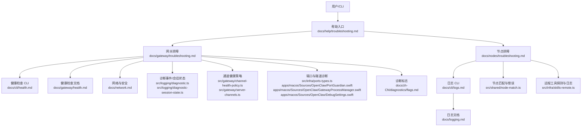

**图表来源**
- [docs/help/troubleshooting.md:1-299](file://docs/help/troubleshooting.md#L1-L299)
- [docs/gateway/troubleshooting.md:1-380](file://docs/gateway/troubleshooting.md#L1-L380)
- [docs/nodes/troubleshooting.md:1-115](file://docs/nodes/troubleshooting.md#L1-L115)
- [docs/cli/health.md:1-22](file://docs/cli/health.md#L1-L22)
- [docs/gateway/health.md:1-45](file://docs/gateway/health.md#L1-L45)
- [docs/cli/logs.md:1-29](file://docs/cli/logs.md#L1-L29)
- [docs/logging.md:1-353](file://docs/logging.md#L1-L353)
- [docs/network.md:1-55](file://docs/network.md#L1-L55)
- [src/logging/diagnostic.ts:229-433](file://src/logging/diagnostic.ts#L229-L433)
- [src/logging/diagnostic-session-state.ts:50-112](file://src/logging/diagnostic-session-state.ts#L50-L112)
- [src/gateway/channel-health-policy.ts:57-81](file://src/gateway/channel-health-policy.ts#L57-L81)
- [src/gateway/server-channels.ts:136-175](file://src/gateway/server-channels.ts#L136-L175)
- [src/infra/ports-types.ts:1-21](file://src/infra/ports-types.ts#L1-L21)
- [apps/macos/Sources/OpenClaw/PortGuardian.swift:399-439](file://apps/macos/Sources/OpenClaw/PortGuardian.swift#L399-L439)
- [apps/macos/Sources/OpenClaw/GatewayProcessManager.swift:238-265](file://apps/macos/Sources/OpenClaw/GatewayProcessManager.swift#L238-L265)
- [apps/macos/Sources/OpenClaw/DebugSettings.swift:302-333](file://apps/macos/Sources/OpenClaw/DebugSettings.swift#L302-L333)
- [src/shared/node-match.ts:57-79](file://src/shared/node-match.ts#L57-L79)
- [src/infra/skills-remote.ts:32-75](file://src/infra/skills-remote.ts#L32-L75)
- [docs/zh-CN/diagnostics/flags.md:1-84](file://docs/zh-CN/diagnostics/flags.md#L1-L84)

**章节来源**
- [docs/help/troubleshooting.md:1-299](file://docs/help/troubleshooting.md#L1-L299)
- [docs/gateway/troubleshooting.md:1-380](file://docs/gateway/troubleshooting.md#L1-L380)
- [docs/nodes/troubleshooting.md:1-115](file://docs/nodes/troubleshooting.md#L1-L115)
- [docs/cli/health.md:1-22](file://docs/cli/health.md#L1-L22)
- [docs/gateway/health.md:1-45](file://docs/gateway/health.md#L1-L45)
- [docs/cli/logs.md:1-29](file://docs/cli/logs.md#L1-L29)
- [docs/logging.md:1-353](file://docs/logging.md#L1-L353)
- [docs/network.md:1-55](file://docs/network.md#L1-L55)
- [src/logging/diagnostic.ts:229-433](file://src/logging/diagnostic.ts#L229-L433)
- [src/logging/diagnostic-session-state.ts:50-112](file://src/logging/diagnostic-session-state.ts#L50-L112)
- [src/gateway/channel-health-policy.ts:57-81](file://src/gateway/channel-health-policy.ts#L57-L81)
- [src/gateway/server-channels.ts:136-175](file://src/gateway/server-channels.ts#L136-L175)
- [src/infra/ports-types.ts:1-21](file://src/infra/ports-types.ts#L1-L21)
- [apps/macos/Sources/OpenClaw/PortGuardian.swift:399-439](file://apps/macos/Sources/OpenClaw/PortGuardian.swift#L399-L439)
- [apps/macos/Sources/OpenClaw/GatewayProcessManager.swift:238-265](file://apps/macos/Sources/OpenClaw/GatewayProcessManager.swift#L238-L265)
- [apps/macos/Sources/OpenClaw/DebugSettings.swift:302-333](file://apps/macos/Sources/OpenClaw/DebugSettings.swift#L302-L333)
- [src/shared/node-match.ts:57-79](file://src/shared/node-match.ts#L57-L79)
- [src/infra/skills-remote.ts:32-75](file://src/infra/skills-remote.ts#L32-L75)
- [docs/zh-CN/diagnostics/flags.md:1-84](file://docs/zh-CN/diagnostics/flags.md#L1-L84)

## 核心组件
- 健康检查与诊断
  - CLI 健康检查：openclaw health，支持 JSON 输出与按账户展示探针时延。
  - 网关健康文档：提供快速检查、深度诊断、通道健康监控配置与失败处置。
  - 诊断事件与会话状态：队列、会话、运行尝试、卡顿告警等事件的结构化输出。
  - 诊断标志：按子系统定向开启调试日志，避免提升全局日志级别。
- 日志与远程日志尾随
  - openclaw logs 支持远程尾随、JSON 输出、本地时间显示等。
  - 日志文档：文件日志位置、格式、控制台样式、敏感信息脱敏、OTLP 导出。
- 节点排障
  - 命令阶梯：status、gateway status、logs、doctor、channels status --probe、nodes status/describe/approvals。
  - 权限矩阵：iOS/Android/macOS 节点对相机/屏幕/位置/系统运行的权限差异。
  - 错误码映射：后台不可用、权限缺失、系统运行拒绝等。
- 网络与安全
  - 网络枢纽：绑定模式、发现与传输、节点桥接协议、配对与身份、安全与医生检查。
- 端口与隧道诊断
  - 端口占用类型与监听者信息；macOS 守护进程与隧道重置；端口诊断按钮与状态反馈。
- 通道健康策略
  - 通道健康评估、账户级覆盖、健康监控配置项与重启阈值。
- 远程工具探测
  - 远程二进制探测失败的分类日志：节点未连接/断开、超时、未知错误等。

**章节来源**
- [docs/cli/health.md:1-22](file://docs/cli/health.md#L1-L22)
- [docs/gateway/health.md:1-45](file://docs/gateway/health.md#L1-L45)
- [src/logging/diagnostic.ts:229-433](file://src/logging/diagnostic.ts#L229-L433)
- [src/logging/diagnostic-session-state.ts:50-112](file://src/logging/diagnostic-session-state.ts#L50-L112)
- [docs/zh-CN/diagnostics/flags.md:1-84](file://docs/zh-CN/diagnostics/flags.md#L1-L84)
- [docs/cli/logs.md:1-29](file://docs/cli/logs.md#L1-L29)
- [docs/logging.md:1-353](file://docs/logging.md#L1-L353)
- [docs/nodes/troubleshooting.md:1-115](file://docs/nodes/troubleshooting.md#L1-L115)
- [docs/network.md:1-55](file://docs/network.md#L1-L55)
- [src/infra/ports-types.ts:1-21](file://src/infra/ports-types.ts#L1-L21)
- [apps/macos/Sources/OpenClaw/PortGuardian.swift:399-439](file://apps/macos/Sources/OpenClaw/PortGuardian.swift#L399-L439)
- [apps/macos/Sources/OpenClaw/GatewayProcessManager.swift:238-265](file://apps/macos/Sources/OpenClaw/GatewayProcessManager.swift#L238-L265)
- [apps/macos/Sources/OpenClaw/DebugSettings.swift:302-333](file://apps/macos/Sources/OpenClaw/DebugSettings.swift#L302-L333)
- [src/gateway/channel-health-policy.ts:57-81](file://src/gateway/channel-health-policy.ts#L57-L81)
- [src/gateway/server-channels.ts:136-175](file://src/gateway/server-channels.ts#L136-L175)
- [src/infra/skills-remote.ts:32-75](file://src/infra/skills-remote.ts#L32-L75)

## 架构总览
下图展示了“症状—命令阶梯—健康信号—定位修复”的排障闭环，以及关键诊断与监控组件如何协同工作。

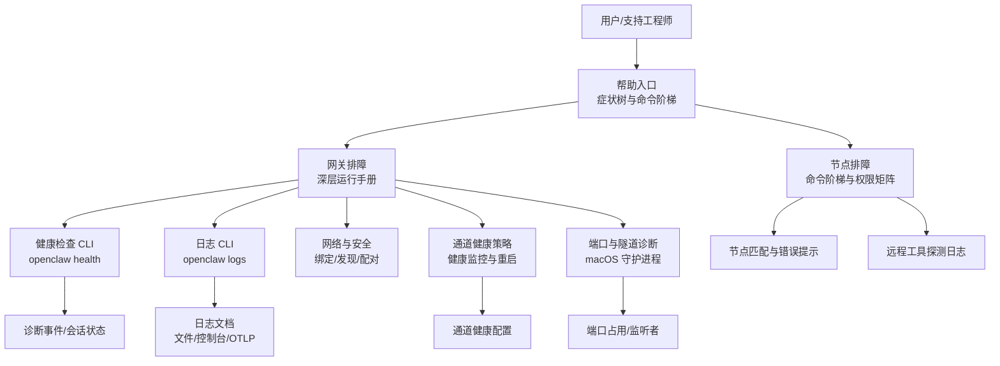

**图表来源**
- [docs/help/troubleshooting.md:68-299](file://docs/help/troubleshooting.md#L68-L299)
- [docs/gateway/troubleshooting.md:14-380](file://docs/gateway/troubleshooting.md#L14-L380)
- [docs/nodes/troubleshooting.md:13-115](file://docs/nodes/troubleshooting.md#L13-L115)
- [docs/cli/health.md:10-22](file://docs/cli/health.md#L10-L22)
- [docs/cli/logs.md:9-29](file://docs/cli/logs.md#L9-L29)
- [docs/logging.md:10-353](file://docs/logging.md#L10-L353)
- [docs/network.md:10-55](file://docs/network.md#L10-L55)
- [src/gateway/channel-health-policy.ts:57-81](file://src/gateway/channel-health-policy.ts#L57-L81)
- [src/gateway/server-channels.ts:136-175](file://src/gateway/server-channels.ts#L136-L175)
- [src/infra/ports-types.ts:1-21](file://src/infra/ports-types.ts#L1-L21)
- [apps/macos/Sources/OpenClaw/PortGuardian.swift:399-439](file://apps/macos/Sources/OpenClaw/PortGuardian.swift#L399-L439)
- [src/shared/node-match.ts:57-79](file://src/shared/node-match.ts#L57-L79)
- [src/infra/skills-remote.ts:32-75](file://src/infra/skills-remote.ts#L32-L75)

## 详细组件分析

### 健康检查与诊断组件
- openclaw health
  - 作用：从运行中的网关获取健康快照，支持 JSON 与详细输出。
  - 使用场景：快速确认网关运行、RPC 探针、通道探针与会话摘要。
- 诊断事件与会话状态
  - 事件类型：队列入队/出队、运行尝试、会话状态变更、会话卡顿告警等。
  - 会话状态管理：按会话键/会话 ID 跟踪状态，带上限裁剪与活动标记。
- 诊断标志
  - 通过配置或环境变量启用子系统定向调试日志，支持通配符，输出到标准日志文件。
- OTLP 指标导出
  - 模型用量、消息流、队列与会话等指标与追踪，支持采样与刷新间隔配置。

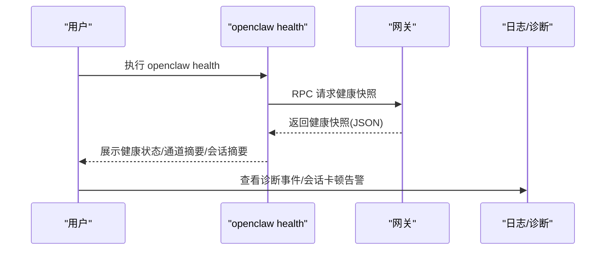

**图表来源**
- [docs/cli/health.md:10-22](file://docs/cli/health.md#L10-L22)
- [src/logging/diagnostic.ts:229-433](file://src/logging/diagnostic.ts#L229-L433)
- [src/logging/diagnostic-session-state.ts:50-112](file://src/logging/diagnostic-session-state.ts#L50-L112)
- [docs/zh-CN/diagnostics/flags.md:18-84](file://docs/zh-CN/diagnostics/flags.md#L18-L84)

**章节来源**
- [docs/cli/health.md:1-22](file://docs/cli/health.md#L1-L22)
- [src/logging/diagnostic.ts:229-433](file://src/logging/diagnostic.ts#L229-L433)
- [src/logging/diagnostic-session-state.ts:50-112](file://src/logging/diagnostic-session-state.ts#L50-L112)
- [docs/zh-CN/diagnostics/flags.md:1-84](file://docs/zh-CN/diagnostics/flags.md#L1-L84)

### 日志与远程日志尾随
- openclaw logs
  - 远程尾随：无需 SSH 即可查看网关日志，支持 JSON、本地时间、限制条数等。
- 日志文档
  - 文件位置、滚动策略、控制台样式、敏感信息脱敏、OTLP 导出与采样。
- 通道日志
  - 针对 WhatsApp/Telegram 等通道的筛选与定位。

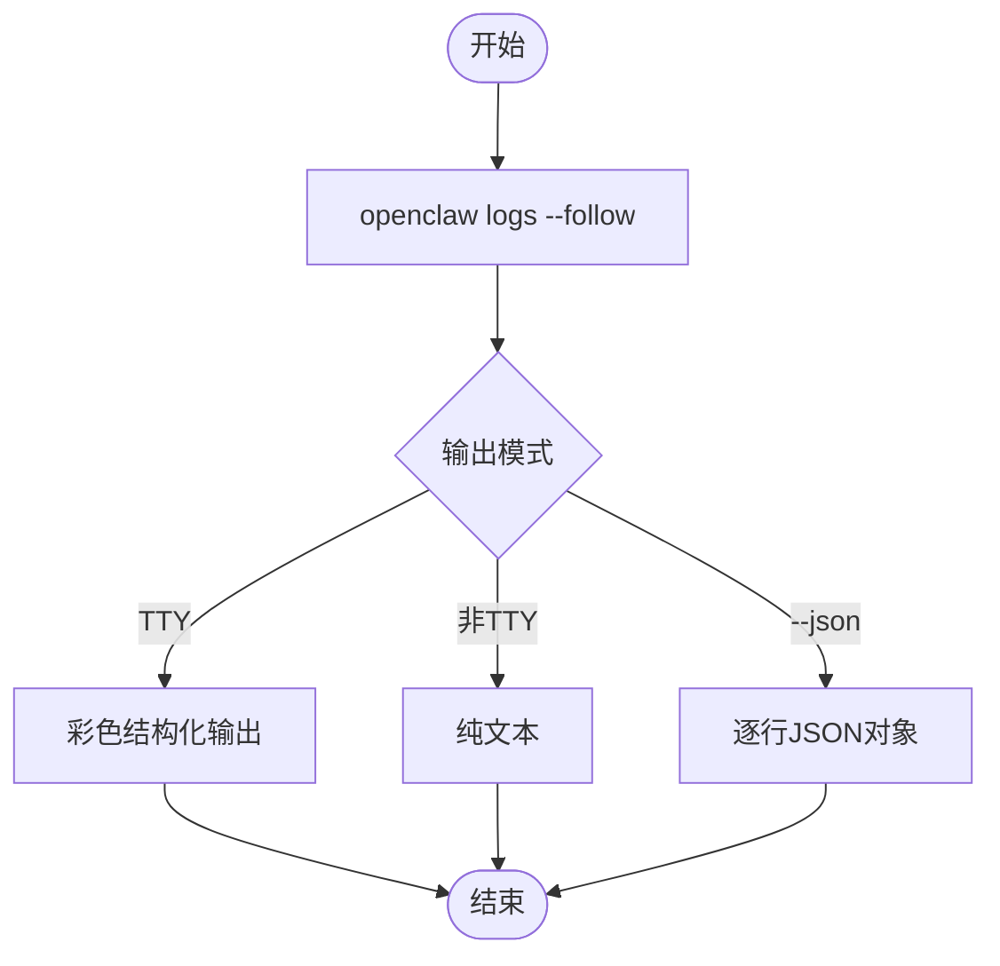

**图表来源**
- [docs/cli/logs.md:9-29](file://docs/cli/logs.md#L9-L29)
- [docs/logging.md:38-141](file://docs/logging.md#L38-L141)

**章节来源**
- [docs/cli/logs.md:1-29](file://docs/cli/logs.md#L1-L29)
- [docs/logging.md:1-353](file://docs/logging.md#L1-L353)

### 节点排障组件
- 命令阶梯与健康信号
  - 命令阶梯：status、gateway status、logs、doctor、channels status --probe、nodes status/describe/approvals。
  - 健康信号：节点已连接且配对为 node 角色；capabilities 存在；exec approvals 的模式与白名单。
- 权限矩阵与错误码
  - 平台差异：iOS/Android/macOS 对相机/屏幕/位置/系统运行的权限与失败代码。
  - 常见错误码：后台不可用、权限缺失、系统运行拒绝（含允许列表缺失）。
- 节点匹配与错误提示
  - 当查询不到节点或存在歧义时，给出“未知节点/模糊节点”的提示，并列出已知节点或 IP。

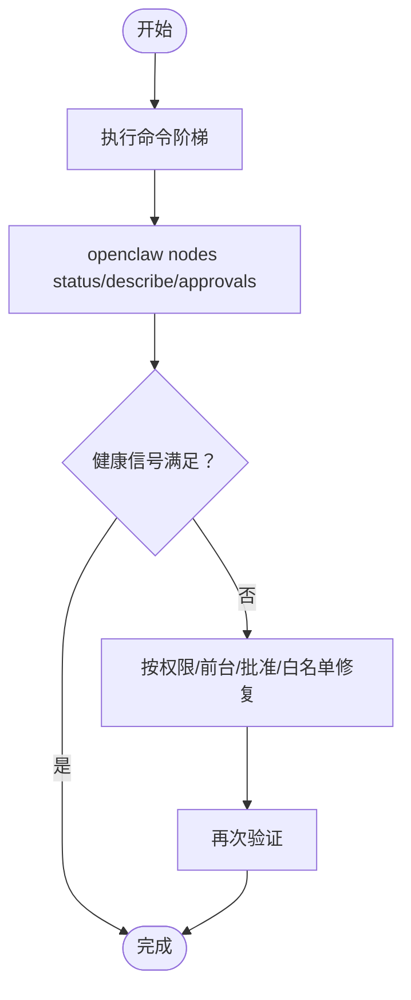

**图表来源**
- [docs/nodes/troubleshooting.md:13-115](file://docs/nodes/troubleshooting.md#L13-L115)
- [src/shared/node-match.ts:57-79](file://src/shared/node-match.ts#L57-L79)

**章节来源**
- [docs/nodes/troubleshooting.md:1-115](file://docs/nodes/troubleshooting.md#L1-L115)
- [src/shared/node-match.ts:57-79](file://src/shared/node-match.ts#L57-L79)

### 网络与安全
- 网络枢纽
  - 网关架构、协议、运行手册、Web 表面与绑定模式、发现与传输、配对与身份、安全与医生检查。
- 症状定位
  - 控制 UI/仪表板无法连接：URL、认证模式、设备身份与安全上下文问题；nonce/signature 流程校验。

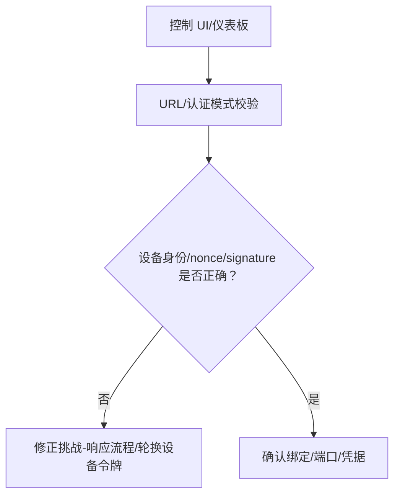

**图表来源**
- [docs/network.md:10-55](file://docs/network.md#L10-L55)
- [docs/gateway/troubleshooting.md:91-151](file://docs/gateway/troubleshooting.md#L91-L151)

**章节来源**
- [docs/network.md:1-55](file://docs/network.md#L1-L55)
- [docs/gateway/troubleshooting.md:1-380](file://docs/gateway/troubleshooting.md#L1-L380)

### 端口与隧道诊断
- 端口占用
  - 端口使用状态、监听者信息、占用原因与建议。
- macOS 守护进程与隧道
  - 守护进程记录与报告生成、隧道重置、端口诊断按钮与状态反馈。
- 运行时描述
  - 健康快照中的通道链接状态、认证年龄与实例描述。

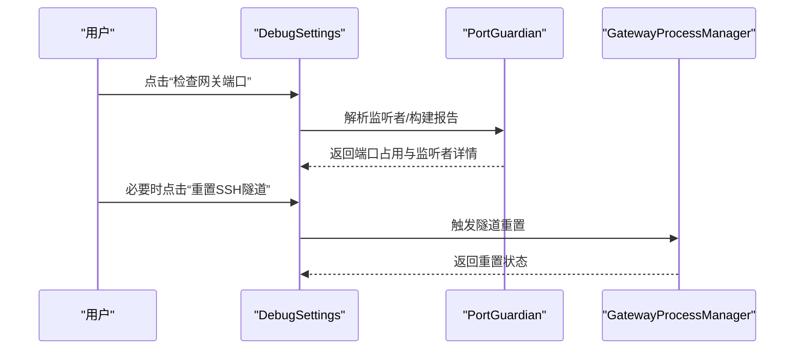

**图表来源**
- [src/infra/ports-types.ts:1-21](file://src/infra/ports-types.ts#L1-L21)
- [apps/macos/Sources/OpenClaw/PortGuardian.swift:399-439](file://apps/macos/Sources/OpenClaw/PortGuardian.swift#L399-L439)
- [apps/macos/Sources/OpenClaw/GatewayProcessManager.swift:238-265](file://apps/macos/Sources/OpenClaw/GatewayProcessManager.swift#L238-L265)
- [apps/macos/Sources/OpenClaw/DebugSettings.swift:302-333](file://apps/macos/Sources/OpenClaw/DebugSettings.swift#L302-L333)

**章节来源**
- [src/infra/ports-types.ts:1-21](file://src/infra/ports-types.ts#L1-L21)
- [apps/macos/Sources/OpenClaw/PortGuardian.swift:399-439](file://apps/macos/Sources/OpenClaw/PortGuardian.swift#L399-L439)
- [apps/macos/Sources/OpenClaw/GatewayProcessManager.swift:238-265](file://apps/macos/Sources/OpenClaw/GatewayProcessManager.swift#L238-L265)
- [apps/macos/Sources/OpenClaw/DebugSettings.swift:302-333](file://apps/macos/Sources/OpenClaw/DebugSettings.swift#L302-L333)

### 通道健康策略
- 健康评估
  - 未托管账户视为健康；运行状态、忙碌态、最近启动/活动时间等综合判断。
- 账户级覆盖
  - 通道级与账户级健康监控开关优先级与解析逻辑。
- 配置项
  - 全局健康检查周期、空闲阈值、每小时最大重启次数，以及按通道/账户覆盖。

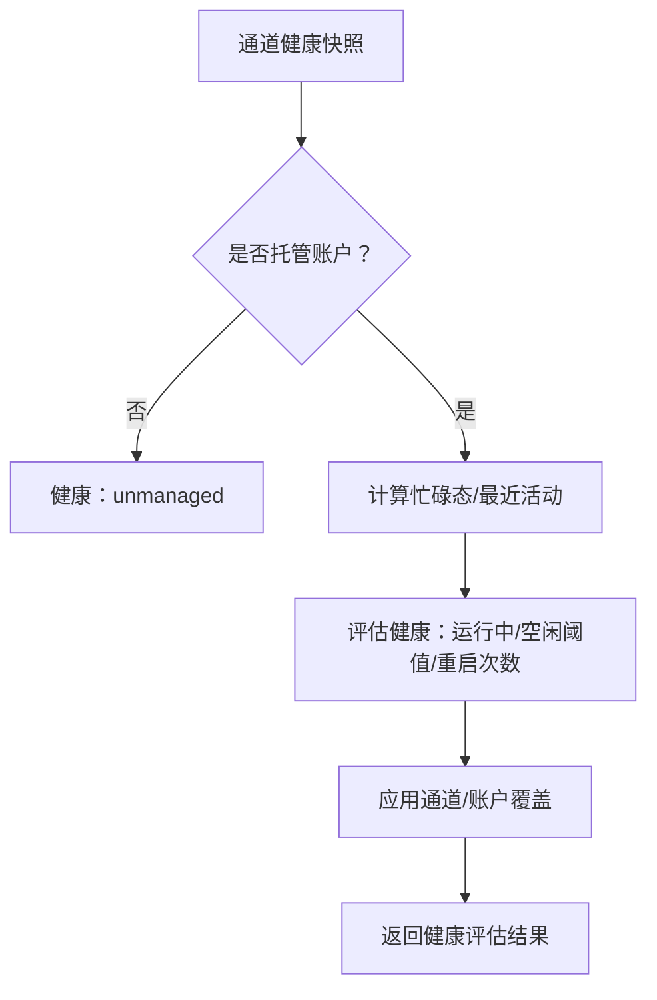

**图表来源**
- [src/gateway/channel-health-policy.ts:57-81](file://src/gateway/channel-health-policy.ts#L57-L81)
- [src/gateway/server-channels.ts:136-175](file://src/gateway/server-channels.ts#L136-L175)
- [src/config/zod-schema.channels.ts:1-17](file://src/config/zod-schema.channels.ts#L1-L17)

**章节来源**
- [src/gateway/channel-health-policy.ts:1-81](file://src/gateway/channel-health-policy.ts#L1-L81)
- [src/gateway/server-channels.ts:136-175](file://src/gateway/server-channels.ts#L136-L175)
- [src/config/zod-schema.channels.ts:1-17](file://src/config/zod-schema.channels.ts#L1-L17)

### 远程工具探测与日志
- 失败分类
  - 节点未连接/断开：以 info 记录，预期于瞬态连接场景。
  - 超时：以 warn 记录，提示检查节点连通性。
  - 其他：以 warn 记录，附带错误信息。
- 节点描述
  - 将节点 ID 映射为可读标签，便于日志与告警。

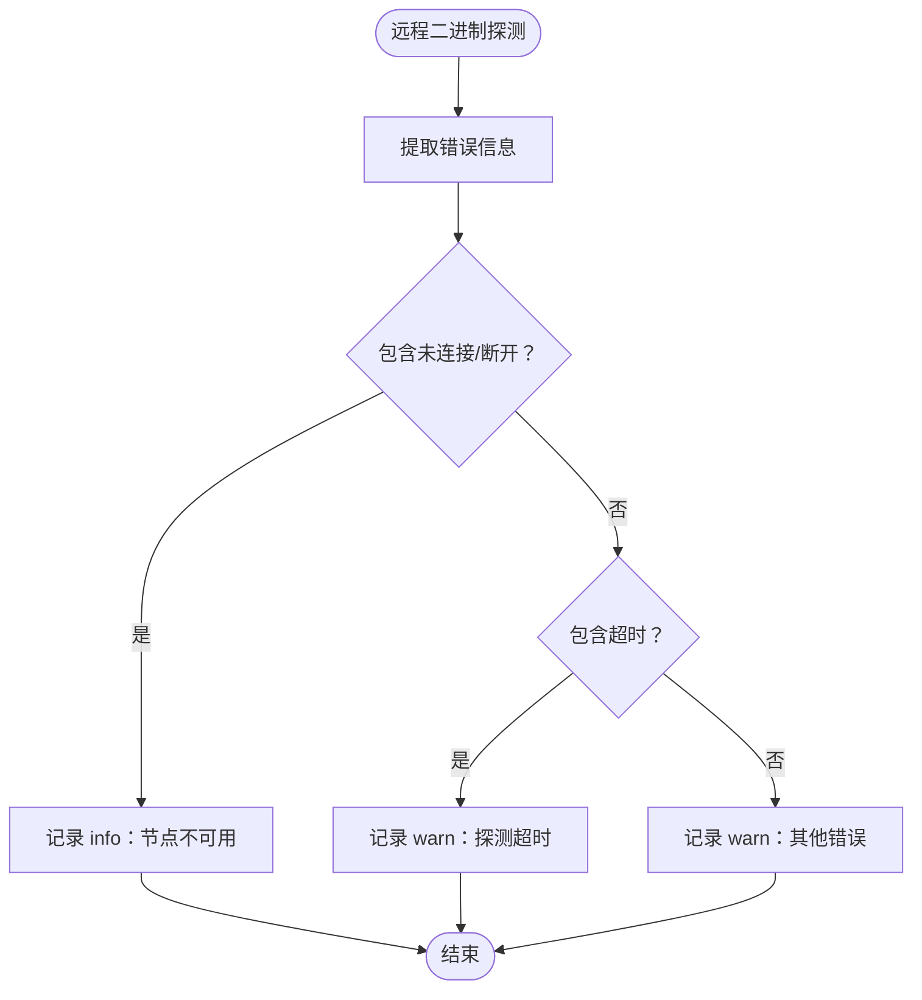

**图表来源**
- [src/infra/skills-remote.ts:32-75](file://src/infra/skills-remote.ts#L32-L75)

**章节来源**
- [src/infra/skills-remote.ts:1-75](file://src/infra/skills-remote.ts#L1-L75)

### 诊断事件与会话状态
- 事件类型
  - 队列：lane enqueue/dequeue。
  - 运行：run attempt。
  - 会话：state transition、stuck。
  - Webhook/message：received/processed/error。
- 会话状态
  - 按会话键/会话 ID 跟踪状态，上限裁剪与活动标记，确保内存可控。

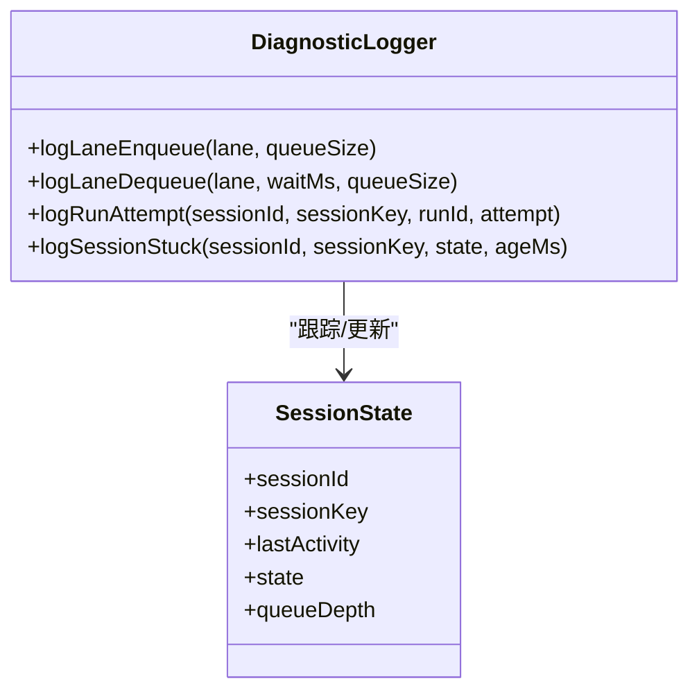

**图表来源**
- [src/logging/diagnostic.ts:229-433](file://src/logging/diagnostic.ts#L229-L433)
- [src/logging/diagnostic-session-state.ts:50-112](file://src/logging/diagnostic-session-state.ts#L50-L112)

**章节来源**
- [src/logging/diagnostic.ts:1-433](file://src/logging/diagnostic.ts#L1-L433)
- [src/logging/diagnostic-session-state.ts:1-112](file://src/logging/diagnostic-session-state.ts#L1-L112)

## 依赖分析
- 组件耦合
  - 健康检查 CLI 依赖网关 RPC；日志 CLI 依赖网关文件日志；诊断事件依赖诊断模块；通道健康策略依赖配置与通道实现。
- 外部依赖
  - OTLP 导出依赖外部收集器/后端；macOS 守护进程依赖系统进程与隧道服务；远程工具探测依赖节点可达性。
- 循环依赖
  - 诊断模块与会话状态管理相互独立，无循环依赖迹象。

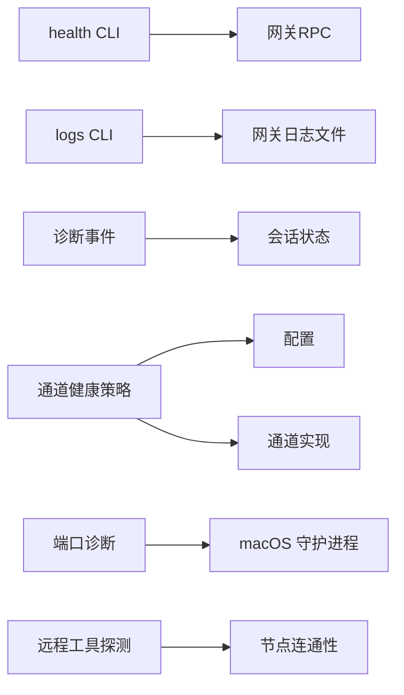

**图表来源**
- [docs/cli/health.md:10-22](file://docs/cli/health.md#L10-L22)
- [docs/cli/logs.md:9-29](file://docs/cli/logs.md#L9-L29)
- [src/logging/diagnostic.ts:229-433](file://src/logging/diagnostic.ts#L229-L433)
- [src/logging/diagnostic-session-state.ts:50-112](file://src/logging/diagnostic-session-state.ts#L50-L112)
- [src/gateway/channel-health-policy.ts:57-81](file://src/gateway/channel-health-policy.ts#L57-L81)
- [src/gateway/server-channels.ts:136-175](file://src/gateway/server-channels.ts#L136-L175)
- [src/infra/ports-types.ts:1-21](file://src/infra/ports-types.ts#L1-L21)
- [apps/macos/Sources/OpenClaw/PortGuardian.swift:399-439](file://apps/macos/Sources/OpenClaw/PortGuardian.swift#L399-L439)
- [src/infra/skills-remote.ts:32-75](file://src/infra/skills-remote.ts#L32-L75)

**章节来源**
- [docs/cli/health.md:1-22](file://docs/cli/health.md#L1-L22)
- [docs/cli/logs.md:1-29](file://docs/cli/logs.md#L1-L29)
- [src/logging/diagnostic.ts:1-433](file://src/logging/diagnostic.ts#L1-L433)
- [src/logging/diagnostic-session-state.ts:1-112](file://src/logging/diagnostic-session-state.ts#L1-L112)
- [src/gateway/channel-health-policy.ts:1-81](file://src/gateway/channel-health-policy.ts#L1-L81)
- [src/gateway/server-channels.ts:136-175](file://src/gateway/server-channels.ts#L136-L175)
- [src/infra/ports-types.ts:1-21](file://src/infra/ports-types.ts#L1-L21)
- [apps/macos/Sources/OpenClaw/PortGuardian.swift:399-439](file://apps/macos/Sources/OpenClaw/PortGuardian.swift#L399-L439)
- [src/infra/skills-remote.ts:1-75](file://src/infra/skills-remote.ts#L1-L75)

## 性能考虑
- 诊断事件与日志
  - OTLP 导出可能带来高吞吐，建议在高负载环境中启用采样与后端过滤。
  - 诊断标志仅定向开启，避免提升全局日志级别导致性能下降。
- 通道健康监控
  - 合理设置健康检查周期与空闲阈值，避免频繁重启影响稳定性。
- 队列与会话
  - 诊断模块对会话状态进行上限裁剪，防止内存膨胀；关注队列深度与等待时间指标。

[本节为通用指导，无需具体文件分析]

## 故障排除指南

### 一、连接问题
- 症状
  - 控制 UI/仪表板无法连接；网关不可达；RPC 探针失败。
- 诊断步骤
  - 使用帮助入口的命令阶梯快速验证：status、gateway status、logs、doctor、channels status --probe。
  - 检查 URL、认证模式、设备身份与安全上下文；核对 nonce/signature 流程。
  - 若为远程模式，检查绑定模式与认证配置。
- 解决方案
  - 修正 URL/端口；确保共享令牌/设备令牌一致；必要时轮换设备令牌。
  - 在 macOS 上使用“检查网关端口”与“重置 SSH 隧道”。

**章节来源**
- [docs/help/troubleshooting.md:13-36](file://docs/help/troubleshooting.md#L13-L36)
- [docs/gateway/troubleshooting.md:91-151](file://docs/gateway/troubleshooting.md#L91-L151)
- [apps/macos/Sources/OpenClaw/DebugSettings.swift:302-333](file://apps/macos/Sources/OpenClaw/DebugSettings.swift#L302-L333)

### 二、权限问题
- 症状
  - 相机/屏幕/位置/系统运行失败；出现权限缺失或后台不可用错误。
- 诊断步骤
  - 使用节点排障命令阶梯：nodes status、describe、approvals。
  - 核对权限矩阵：iOS/Android/macOS 平台差异与典型失败代码。
- 解决方案
  - 在前台运行节点应用；授予所需系统权限；调整 exec approvals 与 allowlist。

**章节来源**
- [docs/nodes/troubleshooting.md:37-115](file://docs/nodes/troubleshooting.md#L37-L115)

### 三、功能异常
- 症状
  - 节点已配对但工具调用失败；远程工具探测报错。
- 诊断步骤
  - 使用 openclaw nodes status/describe/approvals 获取节点能力与批准状态。
  - 查看远程工具探测日志：节点未连接/断开、超时、未知错误。
- 解决方案
  - 重新配对设备；在前台运行节点；重新授予权限；重建/调整 exec 批准策略。

**章节来源**
- [docs/nodes/troubleshooting.md:23-115](file://docs/nodes/troubleshooting.md#L23-L115)
- [src/infra/skills-remote.ts:32-75](file://src/infra/skills-remote.ts#L32-L75)

### 四、性能问题
- 症状
  - 队列积压、会话卡顿、消息处理延迟。
- 诊断步骤
  - 使用 openclaw health 查看 per-account 探针时延与会话摘要。
  - 查看诊断事件：queue.lane.enqueue/dequeue、session.stuck、run.attempt。
  - 启用诊断标志以定向捕获子系统日志。
- 解决方案
  - 优化模型与通道配置；调整健康监控阈值；启用 OTLP 导出并设置采样。

**章节来源**
- [docs/cli/health.md:10-22](file://docs/cli/health.md#L10-L22)
- [src/logging/diagnostic.ts:229-433](file://src/logging/diagnostic.ts#L229-L433)
- [docs/zh-CN/diagnostics/flags.md:18-84](file://docs/zh-CN/diagnostics/flags.md#L18-L84)

### 五、日志收集与调试工具
- 日志收集
  - 使用 openclaw logs --follow 远程尾随；--json 获取结构化日志；--local-time 显示本地时间。
  - 日志文件位置与脱敏规则详见日志文档。
- 调试工具
  - 诊断标志：按子系统定向开启调试日志。
  - OTLP 导出：启用 diagnostics-otel 插件，配置端点与采样率。

**章节来源**
- [docs/cli/logs.md:1-29](file://docs/cli/logs.md#L1-L29)
- [docs/logging.md:10-353](file://docs/logging.md#L10-L353)
- [docs/zh-CN/diagnostics/flags.md:18-84](file://docs/zh-CN/diagnostics/flags.md#L18-L84)

### 六、问题报告流程
- 步骤
  - 使用 openclaw status --all 生成完整诊断报告；复制粘贴至问题单。
  - 附带 openclaw logs --json 输出与诊断标志日志。
  - 说明症状、操作步骤、环境信息（平台、版本、绑定模式）。
- 参考
  - 帮助入口的决策树与各专题深度排障页。

**章节来源**
- [docs/help/troubleshooting.md:68-299](file://docs/help/troubleshooting.md#L68-L299)

### 七、跨平台差异与兼容性
- 平台特性
  - iOS/Android 节点的前台限制；macOS 节点应用权限；Windows 节点主机上的 shell 包装在白名单模式下的行为。
- 兼容性检查
  - doctor 命令可检测并提示兼容性问题（如 Docker 不可用、模型嵌入凭证缺失）。

**章节来源**
- [docs/nodes/troubleshooting.md:37-115](file://docs/nodes/troubleshooting.md#L37-L115)
- [docs/gateway/troubleshooting.md:307-380](file://docs/gateway/troubleshooting.md#L307-L380)

### 八、网络连接、防火墙与端口冲突
- 症状
  - 网关无法启动；端口被占用；RPC 探针失败。
- 诊断步骤
  - 使用端口诊断按钮与 macOS 守护进程报告；检查绑定模式与认证配置。
  - 查看 doctor 报告中的端口冲突提示。
- 解决方案
  - 释放被占用端口或更换端口；确保非回环绑定时配置认证；必要时重置隧道。

**章节来源**
- [docs/gateway/troubleshooting.md:152-181](file://docs/gateway/troubleshooting.md#L152-L181)
- [apps/macos/Sources/OpenClaw/DebugSettings.swift:302-333](file://apps/macos/Sources/OpenClaw/DebugSettings.swift#L302-L333)
- [src/infra/ports-types.ts:1-21](file://src/infra/ports-types.ts#L1-L21)

### 九、自动化诊断与健康检查
- 自动化诊断
  - 通道健康策略：定期检查通道健康，空闲过久自动重启；支持全局与账户级覆盖。
  - 诊断事件：队列、会话、运行尝试、卡顿告警等事件驱动的可观测性。
- 健康检查命令
  - openclaw health：获取网关健康快照；openclaw health --json：机器可读输出。
  - openclaw channels status --probe：通道连通性探测。

**章节来源**
- [src/gateway/channel-health-policy.ts:57-81](file://src/gateway/channel-health-policy.ts#L57-L81)
- [src/gateway/server-channels.ts:136-175](file://src/gateway/server-channels.ts#L136-L175)
- [docs/cli/health.md:10-22](file://docs/cli/health.md#L10-L22)
- [docs/gateway/health.md:12-45](file://docs/gateway/health.md#L12-L45)

### 十、监控指标
- 指标类别
  - 模型用量：tokens、cost、duration、context。
  - 消息流：webhook/received/processed/error、message.queued/processed。
  - 队列与会话：queue.lane.enqueue/dequeue、depth/wait、session.state/stuck。
- 导出方式
  - 通过 diagnostics-otel 插件导出至 OTLP 收集器/后端，支持采样与刷新间隔配置。

**章节来源**
- [docs/logging.md:268-326](file://docs/logging.md#L268-L326)
- [docs/logging.md:224-267](file://docs/logging.md#L224-L267)

### 十一、预防性维护与最佳实践
- 预防性维护
  - 定期运行 doctor；检查通道健康监控配置；清理旧会话与转录文件。
- 最佳实践
  - 启用诊断标志进行定向调试；合理设置日志级别与脱敏；使用 OTLP 采样降低开销。
- 升级迁移
  - 升级后优先检查绑定模式、认证配置与设备身份状态；必要时强制安装服务元数据并重启。

**章节来源**
- [docs/gateway/troubleshooting.md:307-380](file://docs/gateway/troubleshooting.md#L307-L380)
- [docs/logging.md:142-353](file://docs/logging.md#L142-L353)

### 十二、Node + tsx 特定崩溃
- 症状
  - Node + tsx 启动时报错“__name is not a function”。
- 原因与临时方案
  - esbuild keepNames 生成的 __name 辅助函数在 Node 25 加载路径中缺失或被覆盖；建议使用 Bun 或 tsc watch + 编译产物运行。
- 参考
  - Node + tsx 崩溃文档。

**章节来源**
- [docs/debug/node-issue.md:1-86](file://docs/debug/node-issue.md#L1-L86)

## 结论
通过症状—命令阶梯—健康信号—定位修复的闭环，结合健康检查、诊断事件、日志与 OTLP 指标，OpenClaw 能够高效定位并解决节点相关问题。建议在日常运维中常态化使用 doctor、health、logs 与诊断标志，配合通道健康策略与端口/隧道诊断工具，形成完善的可观测与自愈体系。

[本节为总结，无需具体文件分析]

## 附录

### A. 常用命令速查
- openclaw status / --all / --deep
- openclaw gateway status / probe
- openclaw doctor [--repair] [--deep]
- openclaw channels status --probe
- openclaw health [--json] [--verbose]
- openclaw logs [--follow] [--json] [--limit N] [--local-time]

**章节来源**
- [docs/help/troubleshooting.md:13-36](file://docs/help/troubleshooting.md#L13-L36)
- [docs/cli/health.md:10-22](file://docs/cli/health.md#L10-L22)
- [docs/cli/logs.md:9-29](file://docs/cli/logs.md#L9-L29)

### B. 通道健康监控配置要点
- 全局与账户级覆盖优先级
- 健康检查周期、空闲阈值、每小时最大重启次数
- 支持的通道与覆盖范围

**章节来源**
- [src/gateway/server-channels.ts:136-175](file://src/gateway/server-channels.ts#L136-L175)
- [src/config/zod-schema.channels.ts:1-17](file://src/config/zod-schema.channels.ts#L1-L17)

### C. 诊断事件与会话状态关键字段
- 队列：lane、queueSize、waitMs
- 会话：state、ageMs、queueDepth、sessionId、sessionKey
- 运行：runId、attempt

**章节来源**
- [src/logging/diagnostic.ts:229-433](file://src/logging/diagnostic.ts#L229-L433)
- [src/logging/diagnostic-session-state.ts:50-112](file://src/logging/diagnostic-session-state.ts#L50-L112)