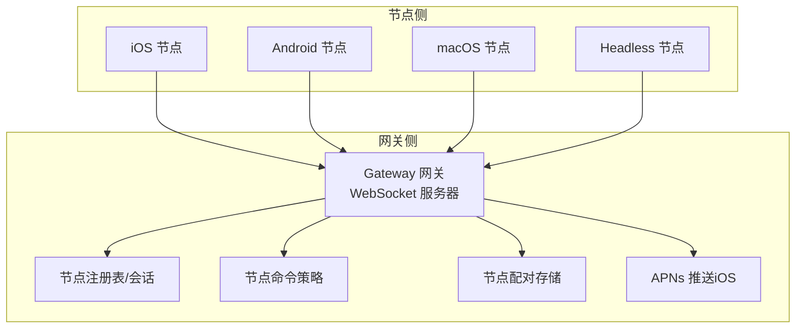
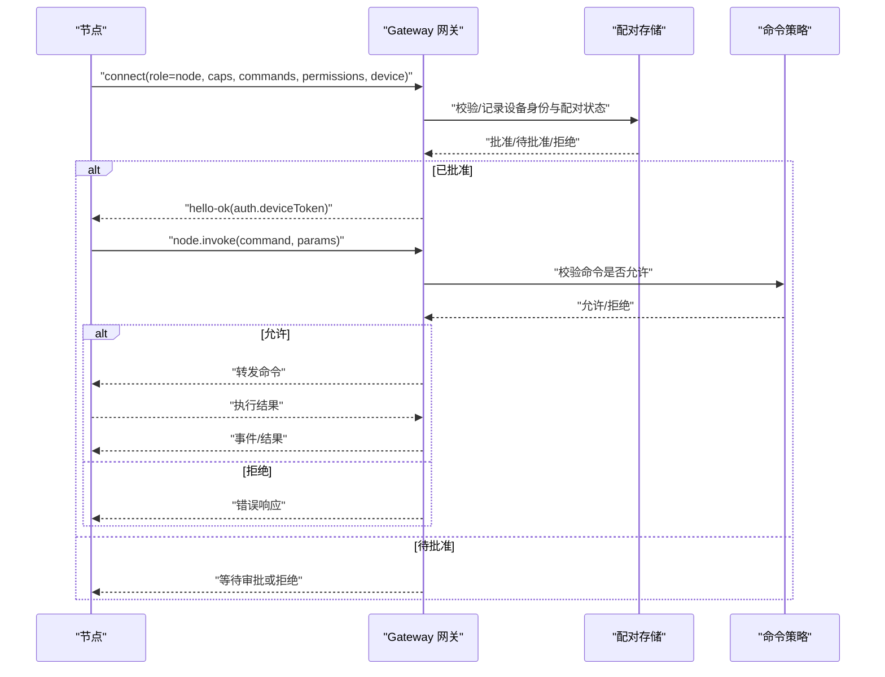
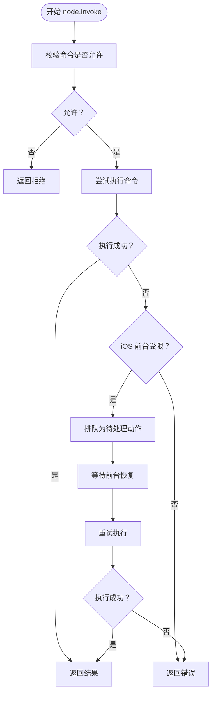
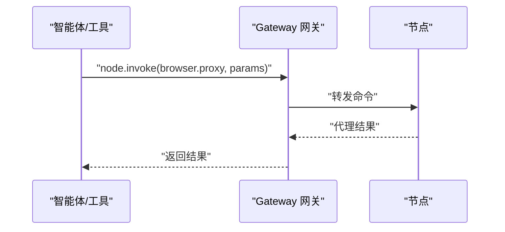
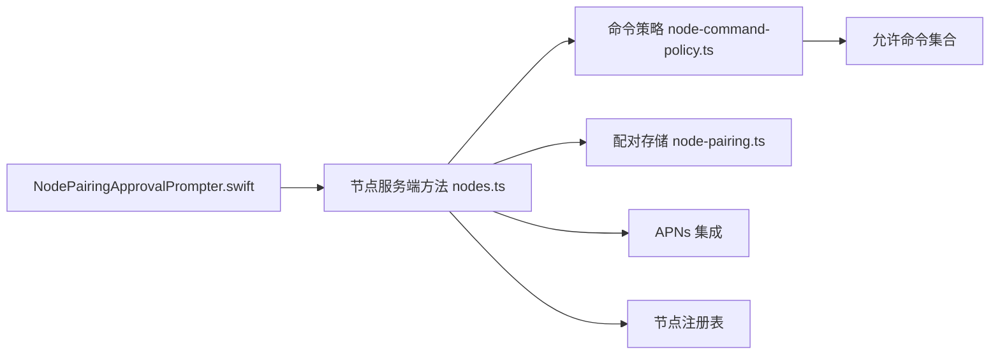

# 节点概述

<cite>
**本文引用的文件**   
- [架构.md](file://docs/zh-CN/concepts/architecture.md)
- [协议.md](file://docs/zh-CN/gateway/protocol.md)
- [节点工具 nodes-tool.ts](file://src/agents/tools/nodes-tool.ts)
- [节点服务端方法 nodes.ts](file://src/gateway/server-methods/nodes.ts)
- [节点配对基础设施 node-pairing.ts](file://src/infra/node-pairing.ts)
- [节点配对提示器 NodePairingApprovalPrompter.swift](file://apps/macos/Sources/OpenClaw/NodePairingApprovalPrompter.swift)
- [节点命令策略 node-command-policy.ts](file://src/gateway/node-command-policy.ts)
- [节点菜单 NodesMenu.swift](file://apps/macos/Sources/OpenClaw/NodesMenu.swift)
- [节点主机配置 config.ts](file://src/node-host/config.ts)
- [iOS 平台说明 ios.md](file://docs/zh-CN/platforms/ios.md)
- [Android 平台说明 android.md](file://docs/zh-CN/platforms/android.md)
- [节点 CLI 入口 nodes-cli.ts](file://src/cli/nodes-cli.ts)
- [移动节点检测 server-mobile-nodes.ts](file://src/gateway/server-mobile-nodes.ts)
- [浏览器代理工具 browser-tool.ts](file://src/agents/tools/browser-tool.ts)
- [医生平台笔记 doctor-platform-notes.ts](file://src/commands/doctor-platform-notes.ts)
</cite>

## 目录
1. [引言](#引言)
2. [项目结构](#项目结构)
3. [核心组件](#核心组件)
4. [架构总览](#架构总览)
5. [详细组件分析](#详细组件分析)
6. [依赖关系分析](#依赖关系分析)
7. [性能考量](#性能考量)
8. [故障排查指南](#故障排查指南)
9. [结论](#结论)
10. [附录](#附录)

## 引言
本文件面向 OpenClaw 节点系统，提供从概念、架构到实现细节的全景式说明。重点覆盖：
- 节点与网关的角色边界与通信协议
- 节点发现、配对与权限管理
- 多平台节点（macOS、iOS、Android、headless）的实现差异
- 节点状态管理、连接维护与故障恢复
- 节点配置、性能优化与最佳实践
- 节点与代理系统的协作与数据流

## 项目结构
OpenClaw 采用“网关为中心”的架构：Gateway 网关负责消息平台连接与统一 API，节点作为能力宿主通过 WebSocket 连接网关，执行本地能力（如 Canvas、摄像头、屏幕录制、位置、系统运行等）。

图示来源
- [架构.md:15-47](file://docs/zh-CN/concepts/architecture.md#L15-L47)

章节来源
- [架构.md:15-47](file://docs/zh-CN/concepts/architecture.md#L15-L47)

## 核心组件
- 节点与网关的协议与角色
  - 节点以 role: node 连接，声明 capabilities、commands、permissions，并携带设备身份进行配对与鉴权。
  - 网关负责设备令牌颁发、配对审批、命令白名单校验、事件广播与节点唤醒。
- 节点配对与权限
  - 新设备需经网关批准，本地连接可自动批准，远程连接需签名挑战。
  - 配对成功后，网关为节点颁发设备令牌，节点凭 token 与网关建立受控通道。
- 节点命令策略
  - 基于平台前缀与设备族识别节点平台，按平台默认命令集与网关配置的 allow/deny 列表生成允许命令集合。
- 节点状态与连接维护
  - 网关维护节点会话列表、连接状态、最近连接时间；支持节点唤醒（iOS 通过 APNs）、等待重连、超时与节流。
- 代理协作与数据流
  - 智能体通过网关调用 node.invoke，节点侧执行命令并将结果回传；浏览器代理场景中，网关转发 node.invoke 到节点，节点返回代理结果。

章节来源
- [协议.md:139-221](file://docs/zh-CN/gateway/protocol.md#L139-L221)
- [节点服务端方法 nodes.ts:132-140](file://src/gateway/server-methods/nodes.ts#L132-L140)
- [节点配对基础设施 node-pairing.ts:1-182](file://src/infra/node-pairing.ts#L1-L182)
- [节点命令策略 node-command-policy.ts:176-215](file://src/gateway/node-command-policy.ts#L176-L215)
- [浏览器代理工具 browser-tool.ts:202-382](file://src/agents/tools/browser-tool.ts#L202-L382)

## 架构总览
下图展示节点与网关的交互序列：连接握手、配对、命令下发与结果回传。

图示来源
- [协议.md:96-129](file://docs/zh-CN/gateway/protocol.md#L96-L129)
- [节点服务端方法 nodes.ts:542-577](file://src/gateway/server-methods/nodes.ts#L542-L577)
- [节点命令策略 node-command-policy.ts:194-215](file://src/gateway/node-command-policy.ts#L194-L215)

## 详细组件分析

### 节点与网关的角色与协议
- 角色
  - operator：控制平面客户端（CLI/UI/自动化）
  - node：能力宿主（Canvas、摄像头、屏幕、位置、系统运行等）
- 帧格式与握手
  - 首帧必须是 connect；后续为 req/res 与 event。
  - connect 中需包含 client、role、scopes、caps、commands、permissions、auth、device 等字段。
- 设备身份与配对
  - 节点需提供稳定的设备指纹；新设备需批准；本地连接可自动批准；远程连接需签名挑战。
- TLS 与证书固定
  - 支持 WS+TLS，客户端可固定证书指纹。

章节来源
- [架构.md:42-95](file://docs/zh-CN/concepts/architecture.md#L42-L95)
- [协议.md:131-221](file://docs/zh-CN/gateway/protocol.md#L131-L221)

### 节点发现机制
- Bonjour/LAN：Gateway 在 local. 广播 _openclaw-gw._tcp，iOS 自动发现。
- Tailnet：通过单播 DNS-SD 与 Tailscale Split DNS 实现跨网络发现。
- 手动主机/端口：在设置中指定主机与端口直连。

章节来源
- [iOS 平台说明 ios.md:59-87](file://docs/zh-CN/platforms/ios.md#L59-L87)
- [Android 平台说明 android.md:31-88](file://docs/zh-CN/platforms/android.md#L31-L88)

### 配对流程与权限管理
- 流程
  - 节点发起 connect，网关记录待批准请求。
  - 控制端（CLI/macOS UI）查看 node.pair.list，批准 node.pair.approve 或拒绝 node.pair.reject。
  - 批准后网关颁发设备令牌，节点凭 token 连接。
- 权限
  - 节点在 connect 时声明 permissions，网关按策略校验；命令执行前再次校验。
- 本地/远程差异
  - 本地连接（loopback/tailnet）可自动批准；远程连接需签名挑战。

章节来源
- [节点工具 nodes-tool.ts:187-220](file://src/agents/tools/nodes-tool.ts#L187-L220)
- [节点服务端方法 nodes.ts:531-577](file://src/gateway/server-methods/nodes.ts#L531-L577)
- [节点配对基础设施 node-pairing.ts:146-182](file://src/infra/node-pairing.ts#L146-L182)
- [节点配对提示器 NodePairingApprovalPrompter.swift:138-171](file://apps/macos/Sources/OpenClaw/NodePairingApprovalPrompter.swift#L138-L171)
- [协议.md:199-210](file://docs/zh-CN/gateway/protocol.md#L199-L210)

### 不同平台节点的实现差异
- iOS
  - 通过 WKWebView 渲染 Canvas；前台限制严格，部分命令（canvas/camera/screen/talk）需前台。
  - 支持语音唤醒与对话模式，后台可能受限。
- Android
  - 通过前台服务维持长连；支持 mDNS/NSD 发现或 Tailnet；Canvas/A2UI 与网关协同。
- macOS/headless
  - 作为通用能力宿主，支持更丰富的系统命令与权限；菜单中区分 headless 平台并提供图标标识。

章节来源
- [iOS 平台说明 ios.md:17-115](file://docs/zh-CN/platforms/ios.md#L17-L115)
- [Android 平台说明 android.md:17-156](file://docs/zh-CN/platforms/android.md#L17-L156)
- [节点菜单 NodesMenu.swift:131-156](file://apps/macos/Sources/OpenClaw/NodesMenu.swift#L131-L156)

### 节点状态管理、连接维护与故障恢复
- 状态与会话
  - 网关维护节点列表、连接状态、最近连接时间；支持按 last-connected 过滤。
- 连接维护
  - 节点通过 WebSocket 与网关保持长连；iOS 通过 APNs 推送实现唤醒。
- 故障恢复
  - 网关在 node.invoke 失败时，针对 iOS 前台受限场景，支持排队为待处理动作并在前台恢复后重试。
  - 提供节点唤醒流程：尝试 APNs 唤醒 → 等待重连 → 超时/节流 → 发送轻推提示（nudge）。

图示来源
- [节点服务端方法 nodes.ts:157-176](file://src/gateway/server-methods/nodes.ts#L157-L176)
- [节点命令策略 node-command-policy.ts:194-215](file://src/gateway/node-command-policy.ts#L194-L215)

章节来源
- [节点服务端方法 nodes.ts:54-98](file://src/gateway/server-methods/nodes.ts#L54-L98)
- [节点服务端方法 nodes.ts:933-984](file://src/gateway/server-methods/nodes.ts#L933-L984)
- [节点命令策略 node-command-policy.ts:146-176](file://src/gateway/node-command-policy.ts#L146-L176)

### 节点配置选项与性能考虑
- 节点主机配置
  - 包含节点 ID、显示名、网关地址与 TLS 参数；配置文件原子写入并严格权限。
- 性能优化建议
  - 低功耗/小主机建议设置编译缓存目录、避免自重生带来的额外启动开销。
- 平台差异
  - iOS 前台限制影响命令执行；Android 需要前台服务；macOS/headless 可能具备更强系统能力。

章节来源
- [节点主机配置 config.ts:14-66](file://src/node-host/config.ts#L14-L66)
- [医生平台笔记 doctor-platform-notes.ts:188-221](file://src/commands/doctor-platform-notes.ts#L188-L221)

### 节点与代理系统的协作模式与数据流
- 代理场景
  - 智能体通过网关调用 node.invoke，节点侧执行命令并将结果回传。
  - 浏览器代理工具封装 node.invoke，设置超时与幂等键，解析返回结果。
- 数据流向
  - 控制端 → 网关 → 节点 → 执行结果 → 网关 → 控制端

图示来源
- [浏览器代理工具 browser-tool.ts:202-382](file://src/agents/tools/browser-tool.ts#L202-L382)
- [节点服务端方法 nodes.ts:190-200](file://src/gateway/server-methods/nodes.ts#L190-L200)

## 依赖关系分析
- 节点命令策略依赖设备元数据归一化与网关配置，决定允许命令集合。
- 网关节点模块依赖配对存储、APNs 集成、Canvas 能力与节点注册表。
- macOS UI 侧依赖网关连接进行配对列表同步与审批。

图示来源
- [节点命令策略 node-command-policy.ts:176-215](file://src/gateway/node-command-policy.ts#L176-L215)
- [节点服务端方法 nodes.ts:1-52](file://src/gateway/server-methods/nodes.ts#L1-L52)
- [节点配对基础设施 node-pairing.ts:1-47](file://src/infra/node-pairing.ts#L1-L47)
- [节点配对提示器 NodePairingApprovalPrompter.swift:154-160](file://apps/macos/Sources/OpenClaw/NodePairingApprovalPrompter.swift#L154-L160)

章节来源
- [节点命令策略 node-command-policy.ts:1-215](file://src/gateway/node-command-policy.ts#L1-L215)
- [节点服务端方法 nodes.ts:1-1180](file://src/gateway/server-methods/nodes.ts#L1-L1180)
- [节点配对基础设施 node-pairing.ts:1-182](file://src/infra/node-pairing.ts#L1-L182)
- [节点配对提示器 NodePairingApprovalPrompter.swift:138-171](file://apps/macos/Sources/OpenClaw/NodePairingApprovalPrompter.swift#L138-L171)

## 性能考量
- 启动与编译缓存
  - 在低功耗/小主机上设置编译缓存目录，避免重复编译；必要时禁用自重生以减少启动开销。
- 连接与唤醒
  - iOS 节点通过 APNs 唤醒，配合等待与节流策略降低无效唤醒；移动端网络波动时优先使用本地自动批准。
- 前台限制
  - iOS 前台受限命令需排队等待前台恢复后再执行，避免阻塞主流程。

章节来源
- [医生平台笔记 doctor-platform-notes.ts:188-221](file://src/commands/doctor-platform-notes.ts#L188-L221)
- [节点服务端方法 nodes.ts:54-98](file://src/gateway/server-methods/nodes.ts#L54-L98)
- [iOS 平台说明 ios.md:98-108](file://docs/zh-CN/platforms/ios.md#L98-L108)

## 故障排查指南
- 常见问题
  - iOS 前台受限：命令返回 NODE_BACKGROUND_UNAVAILABLE，需将应用置于前台。
  - Canvas 主机未配置：A2UI_HOST_NOT_CONFIGURED，检查网关 canvasHost 配置。
  - 配对提示未出现：运行 openclaw nodes pending 并手动批准。
  - 重新安装后重连失败：钥匙串配对令牌被清除，需重新配对。
- 诊断步骤
  - 使用 openclaw nodes status 查看节点状态与最近连接时间。
  - 通过 node.list 与 node.describe 验证节点信息与命令列表。
  - 检查网关日志中的握手、配对与唤醒阶段输出。

章节来源
- [iOS 平台说明 ios.md:103-109](file://docs/zh-CN/platforms/ios.md#L103-L109)
- [节点工具 nodes-tool.ts:187-220](file://src/agents/tools/nodes-tool.ts#L187-L220)
- [节点服务端方法 nodes.ts:933-984](file://src/gateway/server-methods/nodes.ts#L933-L984)

## 结论
OpenClaw 节点系统以“网关为中心”的统一协议承载多平台能力宿主，通过严格的设备身份、配对与权限控制确保安全；借助命令策略与前台限制适配不同平台特性；通过 APNs 唤醒与待处理队列提升移动端可靠性。结合合理的配置与性能优化，可在多平台环境下稳定运行并高效协作。

## 附录
- 节点 CLI
  - 节点子命令入口与工具集成，支持状态查询、描述、配对列表与审批等。
- 移动节点检测
  - 识别已连接的移动节点，辅助 UI 与策略判断。

章节来源
- [节点 CLI 入口 nodes-cli.ts:1-1](file://src/cli/nodes-cli.ts#L1-L1)
- [移动节点检测 server-mobile-nodes.ts:1-14](file://src/gateway/server-mobile-nodes.ts#L1-L14)