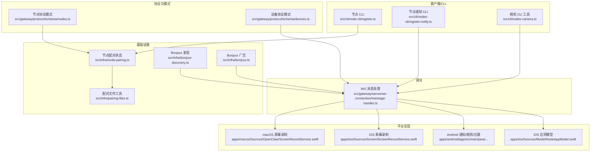
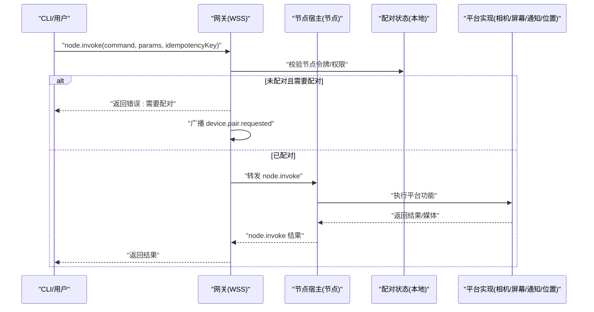
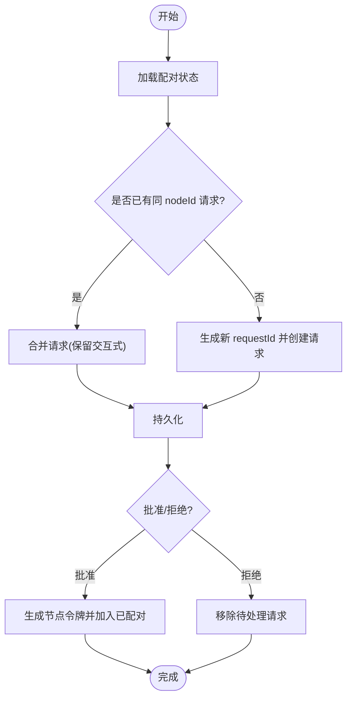
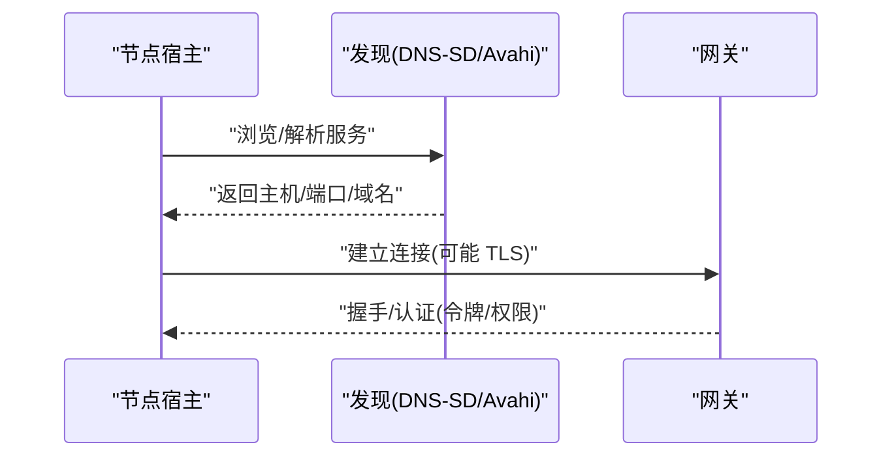
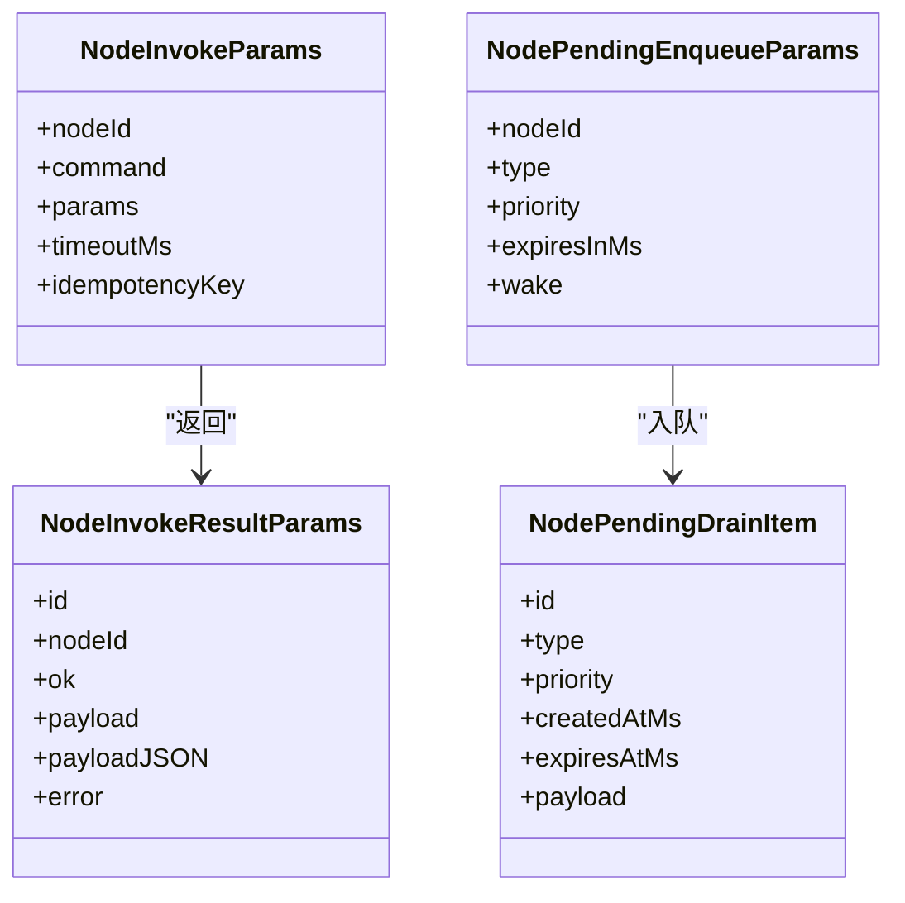
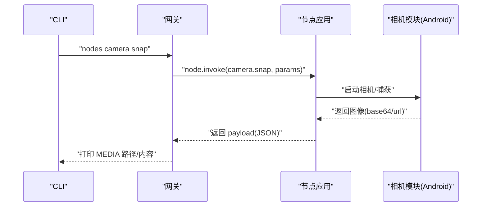
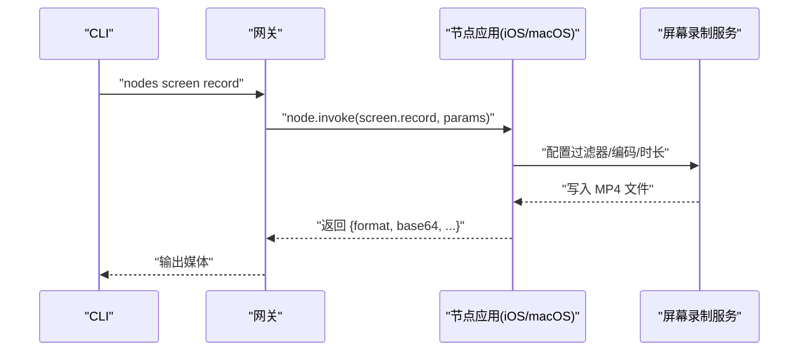
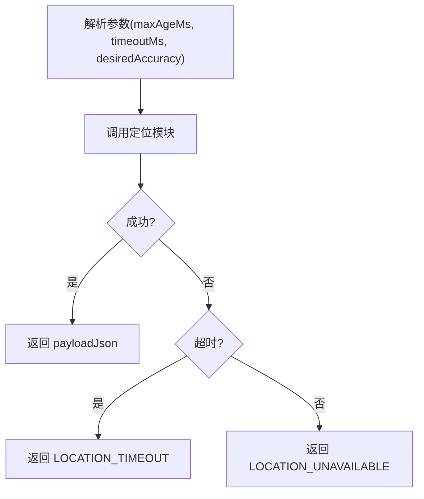
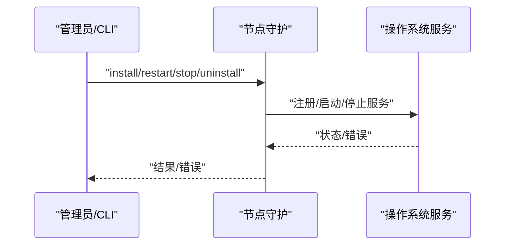
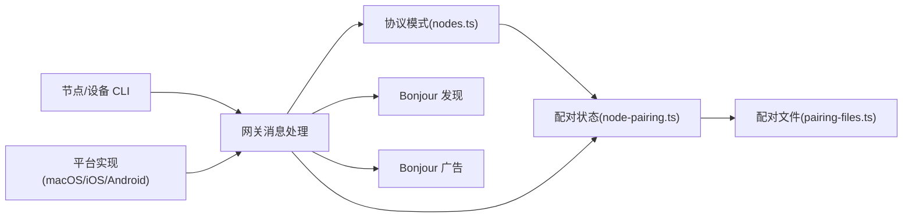

# 节点管理

<cite>
**本文引用的文件**
- [src/gateway/protocol/schema/nodes.ts](file://src/gateway/protocol/schema/nodes.ts)
- [src/infra/node-pairing.ts](file://src/infra/node-pairing.ts)
- [src/infra/pairing-files.ts](file://src/infra/pairing-files.ts)
- [src/infra/bonjour-discovery.ts](file://src/infra/bonjour-discovery.ts)
- [src/infra/bonjour.ts](file://src/infra/bonjour.ts)
- [src/gateway/server/ws-connection/message-handler.ts](file://src/gateway/server/ws-connection/message-handler.ts)
- [src/cli/nodes-cli/register.notify.ts](file://src/cli/nodes-cli/register.notify.ts)
- [src/cli/nodes-camera.ts](file://src/cli/nodes-camera.ts)
- [apps/macos/Sources/OpenClaw/ScreenRecordService.swift](file://apps/macos/Sources/OpenClaw/ScreenRecordService.swift)
- [apps/ios/Sources/Screen/ScreenRecordService.swift](file://apps/ios/Sources/Screen/ScreenRecordService.swift)
- [apps/ios/Sources/Model/NodeAppModel.swift](file://apps/ios/Sources/Model/NodeAppModel.swift)
- [apps/android/app/src/main/java/ai/openclaw/app/node/NotificationsHandler.kt](file://apps/android/app/src/main/java/ai/openclaw/app/node/NotificationsHandler.kt)
- [apps/android/app/src/main/java/ai/openclaw/app/node/CameraCaptureManager.kt](file://apps/android/app/src/main/java/ai/openclaw/app/node/CameraCaptureManager.kt)
- [apps/android/app/src/main/java/ai/openclaw/app/node/LocationHandler.kt](file://apps/android/app/src/main/java/ai/openclaw/app/node/LocationHandler.kt)
- [extensions/device-pair/notify.ts](file://extensions/device-pair/notify.ts)
- [apps/macos/Sources/OpenClaw/DevicePairingApprovalPrompter.swift](file://apps/macos/Sources/OpenClaw/DevicePairingApprovalPrompter.swift)
- [src/cli/devices-cli.ts](file://src/cli/devices-cli.ts)
- [src/daemon/node-service.ts](file://src/daemon/node-service.ts)
- [src/daemon/service-env.ts](file://src/daemon/service-env.ts)
- [src/cli/node-cli/register.ts](file://src/cli/node-cli/register.ts)
- [apps/macos/Sources/OpenClaw/NodeServiceManager.swift](file://apps/macos/Sources/OpenClaw/NodeServiceManager.swift)
- [src/agents/tools/nodes-tool.ts](file://src/agents/tools/nodes-tool.ts)
- [src/gateway/protocol/schema/devices.ts](file://src/gateway/protocol/schema/devices.ts)
</cite>

## 目录
1. [简介](#简介)
2. [项目结构](#项目结构)
3. [核心组件](#核心组件)
4. [架构总览](#架构总览)
5. [详细组件分析](#详细组件分析)
6. [依赖关系分析](#依赖关系分析)
7. [性能考量](#性能考量)
8. [故障排除指南](#故障排除指南)
9. [结论](#结论)
10. [附录](#附录)

## 简介
本文件面向 OpenClaw 的“节点管理”子系统，系统性阐述设备节点的概念、架构设计与管理机制，并覆盖以下能力：
- 节点发现与配对（含跨平台差异）
- 权限与安全控制（令牌校验、静默配对、修复配对）
- 命令路由与结果反馈（node.invoke、事件与待处理队列）
- 功能实现：相机抓拍、屏幕录制、位置获取、通知管理、系统命令执行
- 平台差异化实现（macOS/iOS/Android）
- 数据传输协议与状态同步
- 节点配置、性能监控与故障排除
- 与代理系统的协作模式与命令路由

## 项目结构
OpenClaw 将“节点管理”相关代码分布在多个层次：
- 协议与模式层：定义节点配对、调用、事件等协议与参数模式
- 基础设施层：配对状态持久化、Bonjour 发现与广告、服务环境构建
- 客户端/CLI 层：节点 CLI、设备 CLI、通知 CLI
- 平台实现层：各平台节点应用中的具体功能实现（相机、屏幕录制、通知、位置）
- 网关层：WebSocket 连接处理、配对请求拦截与广播

**图表来源**
- [src/gateway/protocol/schema/nodes.ts:1-167](file://src/gateway/protocol/schema/nodes.ts#L1-L167)
- [src/gateway/protocol/schema/devices.ts:1-68](file://src/gateway/protocol/schema/devices.ts#L1-L68)
- [src/infra/node-pairing.ts:1-274](file://src/infra/node-pairing.ts#L1-L274)
- [src/infra/pairing-files.ts:1-51](file://src/infra/pairing-files.ts#L1-L51)
- [src/infra/bonjour-discovery.ts:258-557](file://src/infra/bonjour-discovery.ts#L258-L557)
- [src/infra/bonjour.ts:148-190](file://src/infra/bonjour.ts#L148-L190)
- [src/cli/node-cli/register.ts:1-110](file://src/cli/node-cli/register.ts#L1-L110)
- [src/cli/nodes-cli/register.notify.ts:1-37](file://src/cli/nodes-cli/register.notify.ts#L1-L37)
- [src/cli/nodes-camera.ts:1-45](file://src/cli/nodes-camera.ts#L1-L45)
- [apps/macos/Sources/OpenClaw/ScreenRecordService.swift:1-114](file://apps/macos/Sources/OpenClaw/ScreenRecordService.swift#L1-L114)
- [apps/ios/Sources/Screen/ScreenRecordService.swift:44-124](file://apps/ios/Sources/Screen/ScreenRecordService.swift#L44-L124)
- [apps/ios/Sources/Model/NodeAppModel.swift:1047-1076](file://apps/ios/Sources/Model/NodeAppModel.swift#L1047-L1076)
- [apps/android/app/src/main/java/ai/openclaw/app/node/NotificationsHandler.kt:54-91](file://apps/android/app/src/main/java/ai/openclaw/app/node/NotificationsHandler.kt#L54-L91)
- [apps/android/app/src/main/java/ai/openclaw/app/node/CameraCaptureManager.kt:85-112](file://apps/android/app/src/main/java/ai/openclaw/app/node/CameraCaptureManager.kt#L85-L112)
- [apps/android/app/src/main/java/ai/openclaw/app/node/LocationHandler.kt:61-100](file://apps/android/app/src/main/java/ai/openclaw/app/node/LocationHandler.kt#L61-L100)
- [src/gateway/server/ws-connection/message-handler.ts:770-795](file://src/gateway/server/ws-connection/message-handler.ts#L770-L795)

**章节来源**
- [src/gateway/protocol/schema/nodes.ts:1-167](file://src/gateway/protocol/schema/nodes.ts#L1-L167)
- [src/infra/node-pairing.ts:1-274](file://src/infra/node-pairing.ts#L1-L274)
- [src/infra/bonjour-discovery.ts:258-557](file://src/infra/bonjour-discovery.ts#L258-L557)
- [src/cli/node-cli/register.ts:1-110](file://src/cli/node-cli/register.ts#L1-L110)

## 核心组件
- 节点配对与状态管理：负责节点配对请求的接收、合并、批准/拒绝、令牌验证与元数据更新；持久化在本地状态目录。
- 节点调用与事件：定义 node.invoke 请求/响应、事件载荷、待处理队列入队/出队与唤醒触发。
- 节点发现：通过 DNS-SD/Avahi/Tailscale 等方式发现网关实例，解析端口与主机信息。
- 平台功能实现：相机抓拍、屏幕录制、通知、位置获取等在各平台节点应用中实现。
- CLI 与网关交互：CLI 通过网关 RPC 调用节点命令，网关进行配对拦截与广播。

**章节来源**
- [src/infra/node-pairing.ts:87-274](file://src/infra/node-pairing.ts#L87-L274)
- [src/gateway/protocol/schema/nodes.ts:12-167](file://src/gateway/protocol/schema/nodes.ts#L12-L167)
- [src/infra/bonjour-discovery.ts:545-557](file://src/infra/bonjour-discovery.ts#L545-L557)
- [src/cli/nodes-camera.ts:1-45](file://src/cli/nodes-camera.ts#L1-L45)

## 架构总览
下图展示从 CLI 到节点应用的命令路由与结果反馈路径，以及配对请求在网关侧的拦截与广播。

**图表来源**
- [src/gateway/server/ws-connection/message-handler.ts:770-795](file://src/gateway/server/ws-connection/message-handler.ts#L770-L795)
- [src/infra/node-pairing.ts:203-215](file://src/infra/node-pairing.ts#L203-L215)
- [src/gateway/protocol/schema/nodes.ts:66-95](file://src/gateway/protocol/schema/nodes.ts#L66-L95)

## 详细组件分析

### 节点配对与权限管理
- 配对状态模型：包含待处理请求与已配对节点两部分，支持按时间排序、过期清理、原子写入。
- 合并与修复：新请求与现有请求合并时，保留交互式请求可见性，修复场景标记 isRepair。
- 令牌校验：使用一次性令牌进行节点身份验证，失败则拒绝访问。
- 设备配对通知：Telegram 等渠道可订阅配对请求通知，支持一次性提醒与状态查询。

**图表来源**
- [src/infra/node-pairing.ts:104-144](file://src/infra/node-pairing.ts#L104-L144)
- [src/infra/node-pairing.ts:146-201](file://src/infra/node-pairing.ts#L146-L201)
- [src/infra/node-pairing.ts:203-215](file://src/infra/node-pairing.ts#L203-L215)
- [src/infra/pairing-files.ts:34-50](file://src/infra/pairing-files.ts#L34-L50)

**章节来源**
- [src/infra/node-pairing.ts:1-274](file://src/infra/node-pairing.ts#L1-L274)
- [src/infra/pairing-files.ts:1-51](file://src/infra/pairing-files.ts#L1-L51)
- [extensions/device-pair/notify.ts:385-425](file://extensions/device-pair/notify.ts#L385-L425)
- [apps/macos/Sources/OpenClaw/DevicePairingApprovalPrompter.swift:219-256](file://apps/macos/Sources/OpenClaw/DevicePairingApprovalPrompter.swift#L219-L256)

### 节点发现与网关连接
- 发现：通过 dns-sd/avahi/Tailscale 解析网关服务，支持本地域与广域域组合。
- 广告：Bonjour 广告器发布服务记录，监听名称/主机名冲突并记录警告。
- 端口选择：优先使用解析到的服务端口，否则回退到 TXT 记录中的端口。

**图表来源**
- [src/infra/bonjour-discovery.ts:264-284](file://src/infra/bonjour-discovery.ts#L264-L284)
- [src/infra/bonjour-discovery.ts:528-543](file://src/infra/bonjour-discovery.ts#L528-L543)
- [src/infra/bonjour.ts:148-190](file://src/infra/bonjour.ts#L148-L190)

**章节来源**
- [src/infra/bonjour-discovery.ts:258-557](file://src/infra/bonjour-discovery.ts#L258-L557)
- [src/infra/bonjour.ts:148-190](file://src/infra/bonjour.ts#L148-L190)

### 节点调用与事件协议
- node.invoke 请求/结果：支持超时、幂等键、payload 或 payloadJSON 二选一。
- 待处理队列：入队/出队支持优先级、过期时间、唤醒触发。
- 事件：通用事件载荷，用于节点向网关上报状态或异步事件。

**图表来源**
- [src/gateway/protocol/schema/nodes.ts:66-95](file://src/gateway/protocol/schema/nodes.ts#L66-L95)
- [src/gateway/protocol/schema/nodes.ts:135-144](file://src/gateway/protocol/schema/nodes.ts#L135-L144)
- [src/gateway/protocol/schema/nodes.ts:113-133](file://src/gateway/protocol/schema/nodes.ts#L113-L133)

**章节来源**
- [src/gateway/protocol/schema/nodes.ts:1-167](file://src/gateway/protocol/schema/nodes.ts#L1-L167)

### 相机抓拍（跨平台）
- CLI 参数解析与校验：支持格式、质量、最大宽度、延迟、设备 ID、朝向等。
- 平台实现：
  - Android：检查相机/麦克风权限，绑定生命周期，使用相机2 API 拍照。
  - iOS/macOS：通过节点应用模型调用屏幕录制服务，返回媒体数据。
- 结果处理：将 base64 或 URL 媒体写入临时文件，供后续模型理解或输出。

**图表来源**
- [src/cli/nodes-camera.ts:1-45](file://src/cli/nodes-camera.ts#L1-L45)
- [apps/android/app/src/main/java/ai/openclaw/app/node/CameraCaptureManager.kt:85-112](file://apps/android/app/src/main/java/ai/openclaw/app/node/CameraCaptureManager.kt#L85-L112)
- [src/agents/tools/nodes-tool.ts:246-328](file://src/agents/tools/nodes-tool.ts#L246-L328)

**章节来源**
- [src/cli/nodes-camera.ts:1-45](file://src/cli/nodes-camera.ts#L1-L45)
- [apps/android/app/src/main/java/ai/openclaw/app/node/CameraCaptureManager.kt:85-112](file://apps/android/app/src/main/java/ai/openclaw/app/node/CameraCaptureManager.kt#L85-L112)
- [src/agents/tools/nodes-tool.ts:246-328](file://src/agents/tools/nodes-tool.ts#L246-L328)

### 屏幕录制（跨平台）
- macOS：使用 ScreenCaptureKit，支持屏幕索引、帧率、时长、音频采集，输出 MP4。
- iOS：限制仅主屏，较低帧率上限，输出 MP4。
- 节点应用模型：在调用前设置状态指示，结束后读取临时文件并以 base64 返回。

**图表来源**
- [apps/macos/Sources/OpenClaw/ScreenRecordService.swift:31-99](file://apps/macos/Sources/OpenClaw/ScreenRecordService.swift#L31-L99)
- [apps/ios/Sources/Screen/ScreenRecordService.swift:44-124](file://apps/ios/Sources/Screen/ScreenRecordService.swift#L44-L124)
- [apps/ios/Sources/Model/NodeAppModel.swift:1047-1076](file://apps/ios/Sources/Model/NodeAppModel.swift#L1047-L1076)

**章节来源**
- [apps/macos/Sources/OpenClaw/ScreenRecordService.swift:1-114](file://apps/macos/Sources/OpenClaw/ScreenRecordService.swift#L1-L114)
- [apps/ios/Sources/Screen/ScreenRecordService.swift:44-124](file://apps/ios/Sources/Screen/ScreenRecordService.swift#L44-L124)
- [apps/ios/Sources/Model/NodeAppModel.swift:1047-1076](file://apps/ios/Sources/Model/NodeAppModel.swift#L1047-L1076)

### 位置获取（Android）
- 参数解析：支持最大年龄、超时、精度（精确/模糊）。
- 定位：根据提供商、精度与超时获取位置，返回 JSON 载荷。
- 错误处理：超时与不可用错误映射为标准错误码。

**图表来源**
- [apps/android/app/src/main/java/ai/openclaw/app/node/LocationHandler.kt:61-100](file://apps/android/app/src/main/java/ai/openclaw/app/node/LocationHandler.kt#L61-L100)

**章节来源**
- [apps/android/app/src/main/java/ai/openclaw/app/node/LocationHandler.kt:61-100](file://apps/android/app/src/main/java/ai/openclaw/app/node/LocationHandler.kt#L61-L100)

### 通知管理（Android）
- 参数校验：要求 key 与 action(open/dismiss/reply)，回复需携带 replyText。
- 行为分派：根据 action 执行打开、关闭或回复操作，返回统一 InvokeResult。

**章节来源**
- [apps/android/app/src/main/java/ai/openclaw/app/node/NotificationsHandler.kt:54-91](file://apps/android/app/src/main/java/ai/openclaw/app/node/NotificationsHandler.kt#L54-L91)

### 节点服务与守护进程
- 服务安装/卸载/重启/停止：封装平台特定的 launchd/systemd/schtasks 管理。
- 环境变量：注入网关令牌、服务标签、版本号、日志前缀等。
- macOS 服务管理器：通过命令行调用 node 子命令，记录错误并返回消息。

**图表来源**
- [src/cli/node-cli/register.ts:71-110](file://src/cli/node-cli/register.ts#L71-L110)
- [src/daemon/node-service.ts:44-66](file://src/daemon/node-service.ts#L44-L66)
- [src/daemon/service-env.ts:271-311](file://src/daemon/service-env.ts#L271-L311)
- [apps/macos/Sources/OpenClaw/NodeServiceManager.swift:7-29](file://apps/macos/Sources/OpenClaw/NodeServiceManager.swift#L7-L29)

**章节来源**
- [src/cli/node-cli/register.ts:1-110](file://src/cli/node-cli/register.ts#L1-L110)
- [src/daemon/node-service.ts:44-66](file://src/daemon/node-service.ts#L44-L66)
- [src/daemon/service-env.ts:271-311](file://src/daemon/service-env.ts#L271-L311)
- [apps/macos/Sources/OpenClaw/NodeServiceManager.swift:1-48](file://apps/macos/Sources/OpenClaw/NodeServiceManager.swift#L1-L48)

### 设备配对 CLI 与网关交互
- 设备列表与批准：支持回退到本地配对状态，避免远端网关不可用时阻塞。
- 静默配对：silent 字段影响握手失败策略，允许静默等待或直接断开。
- 通知服务：Telegram 等渠道可订阅配对请求，支持一次性提醒与状态查询。

**章节来源**
- [src/cli/devices-cli.ts:129-169](file://src/cli/devices-cli.ts#L129-L169)
- [src/gateway/server/ws-connection/message-handler.ts:770-795](file://src/gateway/server/ws-connection/message-handler.ts#L770-L795)
- [extensions/device-pair/notify.ts:385-425](file://extensions/device-pair/notify.ts#L385-L425)

## 依赖关系分析
- 协议层依赖基础设施层的配对状态与文件工具。
- CLI 依赖网关 RPC 与协议模式，网关依赖消息处理器与配对状态。
- 平台实现依赖节点应用模型与系统框架（AVFoundation、ScreenCaptureKit、Android CameraX/Location）。
- 发现与广告模块独立于业务逻辑，但被网关连接流程使用。

**图表来源**
- [src/gateway/protocol/schema/nodes.ts:1-167](file://src/gateway/protocol/schema/nodes.ts#L1-L167)
- [src/infra/node-pairing.ts:1-274](file://src/infra/node-pairing.ts#L1-L274)
- [src/infra/pairing-files.ts:1-51](file://src/infra/pairing-files.ts#L1-L51)
- [src/infra/bonjour-discovery.ts:258-557](file://src/infra/bonjour-discovery.ts#L258-L557)
- [src/infra/bonjour.ts:148-190](file://src/infra/bonjour.ts#L148-L190)
- [src/gateway/server/ws-connection/message-handler.ts:770-795](file://src/gateway/server/ws-connection/message-handler.ts#L770-L795)

**章节来源**
- [src/gateway/protocol/schema/nodes.ts:1-167](file://src/gateway/protocol/schema/nodes.ts#L1-L167)
- [src/infra/node-pairing.ts:1-274](file://src/infra/node-pairing.ts#L1-L274)
- [src/infra/bonjour-discovery.ts:258-557](file://src/infra/bonjour-discovery.ts#L258-L557)

## 性能考量
- 屏幕录制帧率与时长：平台侧对 FPS 和时长进行钳制，避免过高资源占用。
- 相机抓拍质量与尺寸：限制最大宽度与质量范围，减少内存与 I/O 压力。
- 待处理队列：支持高/普通优先级与过期时间，避免无限堆积。
- 发现与广告：DNS-SD/Avahi 解析存在超时控制，建议合理设置超时与重试策略。

[本节为通用指导，不直接分析具体文件]

## 故障排除指南
- 未配对导致连接失败：检查设备配对状态与令牌，必要时通过 /pair notify 查询待处理请求。
- 屏幕录制无画面：确认屏幕索引有效、权限授予、输出路径可写。
- 相机抓拍失败：检查相机/麦克风权限，确保设备 ID 与朝向参数合法。
- 位置获取超时：增大 timeoutMs，降低 desiredAccuracy，确认定位服务可用。
- 服务安装/卸载失败：查看服务标签、运行时与环境变量，确认系统服务状态。

**章节来源**
- [apps/macos/Sources/OpenClaw/ScreenRecordService.swift:10-27](file://apps/macos/Sources/OpenClaw/ScreenRecordService.swift#L10-L27)
- [apps/android/app/src/main/java/ai/openclaw/app/node/CameraCaptureManager.kt:85-95](file://apps/android/app/src/main/java/ai/openclaw/app/node/CameraCaptureManager.kt#L85-L95)
- [apps/android/app/src/main/java/ai/openclaw/app/node/LocationHandler.kt:71-79](file://apps/android/app/src/main/java/ai/openclaw/app/node/LocationHandler.kt#L71-L79)
- [extensions/device-pair/notify.ts:427-460](file://extensions/device-pair/notify.ts#L427-L460)

## 结论
OpenClaw 的节点管理以协议驱动、状态持久化与平台适配为核心，结合网关的配对拦截与广播机制，实现了跨平台的功能扩展与统一的命令路由。通过严格的令牌校验与权限模型，保障了节点访问的安全性；通过待处理队列与唤醒机制，提升了任务调度的灵活性。CLI 与平台实现的解耦设计，使得新增功能与平台适配更为便捷。

[本节为总结性内容，不直接分析具体文件]

## 附录

### 节点 CLI 使用示例
- 发送本地通知（macOS）：通过节点 CLI 调用 system.notify，指定标题、正文、音效与投递模式。
- 相机抓拍：指定节点、朝向、质量、最大宽度等参数，输出媒体路径。
- 屏幕录制：指定屏幕索引、时长、帧率、是否包含音频，输出 MP4 文件。

**章节来源**
- [src/cli/nodes-cli/register.notify.ts:8-37](file://src/cli/nodes-cli/register.notify.ts#L8-L37)
- [src/cli/nodes-camera.ts:1-45](file://src/cli/nodes-camera.ts#L1-L45)
- [apps/macos/Sources/OpenClaw/ScreenRecordService.swift:31-99](file://apps/macos/Sources/OpenClaw/ScreenRecordService.swift#L31-L99)

### 设备配对 CLI 回退机制
- 当远端网关不可用时，CLI 自动回退到本地配对状态，保证基本操作可用。
- 支持批准/拒绝请求，支持修复配对场景。

**章节来源**
- [src/cli/devices-cli.ts:129-169](file://src/cli/devices-cli.ts#L129-L169)