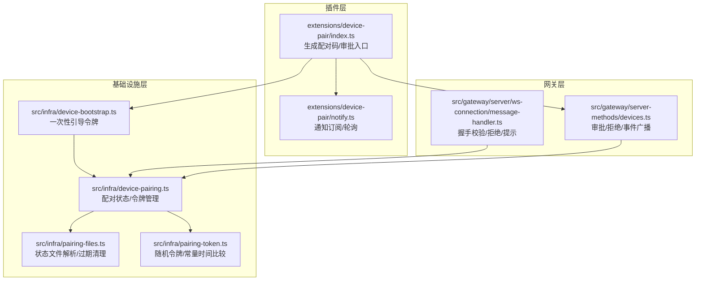
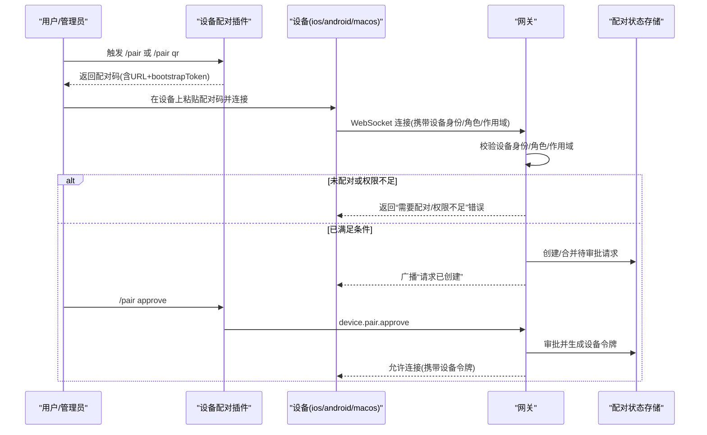
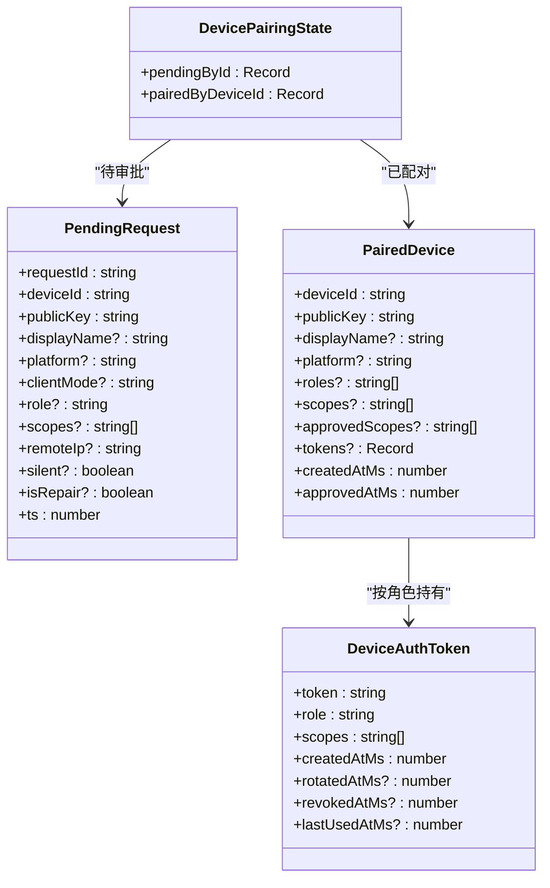
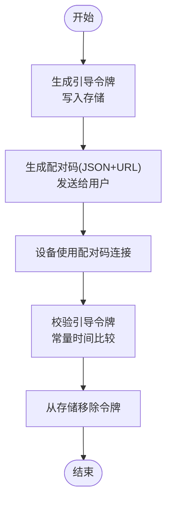
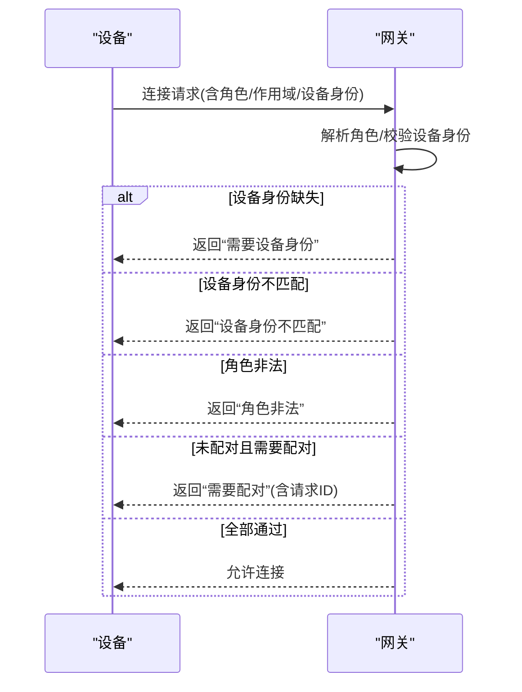
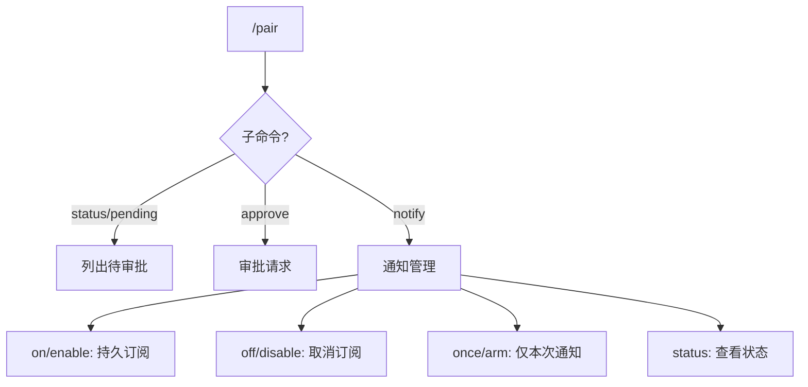
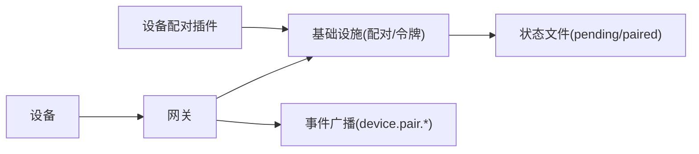

# 节点配对

<cite>
**本文引用的文件**
- [extensions/device-pair/index.ts](file://extensions/device-pair/index.ts)
- [extensions/device-pair/notify.ts](file://extensions/device-pair/notify.ts)
- [src/infra/device-bootstrap.ts](file://src/infra/device-bootstrap.ts)
- [src/infra/device-pairing.ts](file://src/infra/device-pairing.ts)
- [src/infra/pairing-files.ts](file://src/infra/pairing-files.ts)
- [src/infra/pairing-token.ts](file://src/infra/pairing-token.ts)
- [src/gateway/server/ws-connection/message-handler.ts](file://src/gateway/server/ws-connection/message-handler.ts)
- [src/gateway/server-methods/devices.ts](file://src/gateway/server-methods/devices.ts)
- [src/pairing/setup-code.ts](file://src/pairing/setup-code.ts)
- [docs/channels/pairing.md](file://docs/channels/pairing.md)
- [docs/gateway/pairing.md](file://docs/gateway/pairing.md)
- [apps/macos/Sources/OpenClaw/DevicePairingApprovalPrompter.swift](file://apps/macos/Sources/OpenClaw/DevicePairingApprovalPrompter.swift)
- [apps/macos/Sources/OpenClaw/PairingAlertSupport.swift](file://apps/macos/Sources/OpenClaw/PairingAlertSupport.swift)
- [apps/macos/Sources/OpenClaw/PlatformLabelFormatter.swift](file://apps/macos/Sources/OpenClaw/PlatformLabelFormatter.swift)
- [apps/ios/Sources/Device/DeviceInfoHelper.swift](file://apps/ios/Sources/Device/DeviceInfoHelper.swift)
- [apps/shared/OpenClawKit/Sources/OpenClawKit/GatewayChannel.swift](file://apps/shared/OpenClawKit/Sources/OpenClawKit/GatewayChannel.swift)
</cite>

## 目录
1. [简介](#简介)
2. [项目结构](#项目结构)
3. [核心组件](#核心组件)
4. [架构总览](#架构总览)
5. [详细组件分析](#详细组件分析)
6. [依赖关系分析](#依赖关系分析)
7. [性能考量](#性能考量)
8. [故障排除指南](#故障排除指南)
9. [结论](#结论)
10. [附录](#附录)

## 简介
本文件系统性阐述 OpenClaw 的“节点配对（设备配对）”能力：从架构设计、握手与认证、到配对状态管理、存储与撤销；覆盖多平台实现差异、权限与体验设计；并给出密钥与加密通信、防重放机制、故障排查与批量管理等实践指南。目标是帮助开发者与运维人员在不同平台上正确实现与维护设备配对流程。

## 项目结构
OpenClaw 将“设备配对”拆分为三层：
- 插件层：负责生成配对码、通知与审批入口（如 Telegram 插件）。
- 基础设施层：负责配对状态持久化、令牌签发与校验、过期清理。
- 网关层：负责握手阶段的身份校验、权限绑定与事件广播。

图示来源
- [extensions/device-pair/index.ts:328-551](file://extensions/device-pair/index.ts#L328-L551)
- [extensions/device-pair/notify.ts:427-461](file://extensions/device-pair/notify.ts#L427-L461)
- [src/infra/device-bootstrap.ts:1-117](file://src/infra/device-bootstrap.ts#L1-L117)
- [src/infra/device-pairing.ts:1-745](file://src/infra/device-pairing.ts#L1-L745)
- [src/infra/pairing-files.ts:1-51](file://src/infra/pairing-files.ts#L1-L51)
- [src/infra/pairing-token.ts:1-16](file://src/infra/pairing-token.ts#L1-L16)
- [src/gateway/server/ws-connection/message-handler.ts:387-795](file://src/gateway/server/ws-connection/message-handler.ts#L387-L795)
- [src/gateway/server-methods/devices.ts:113-156](file://src/gateway/server-methods/devices.ts#L113-L156)

章节来源
- [extensions/device-pair/index.ts:328-551](file://extensions/device-pair/index.ts#L328-L551)
- [src/infra/device-pairing.ts:102-122](file://src/infra/device-pairing.ts#L102-L122)
- [src/infra/pairing-files.ts:6-14](file://src/infra/pairing-files.ts#L6-L14)

## 核心组件
- 设备配对状态机与令牌管理
  - 配对状态：待审批（pending）与已配对（paired），分别持久化于 devices/pending.json 与 devices/paired.json。
  - 令牌：一次性引导令牌（bootstrap token）用于初始握手；后续按角色颁发独立设备令牌（device token），支持轮换与撤销。
- 插件入口与通知
  - 插件命令 /pair 生成配对码（含 Gateway URL 与 bootstrap token），并在 Telegram 上支持一次性/持久通知。
- 网关握手与权限
  - 握手阶段强制设备身份（公钥派生 ID 校验）、角色与作用域解析，并在未配对或权限不足时返回明确错误码与提示。

章节来源
- [src/infra/device-pairing.ts:14-122](file://src/infra/device-pairing.ts#L14-L122)
- [src/infra/device-bootstrap.ts:11-117](file://src/infra/device-bootstrap.ts#L11-L117)
- [extensions/device-pair/index.ts:398-551](file://extensions/device-pair/index.ts#L398-L551)
- [src/gateway/server/ws-connection/message-handler.ts:387-795](file://src/gateway/server/ws-connection/message-handler.ts#L387-L795)

## 架构总览
下图展示一次完整的设备配对流程：从插件生成配对码，到设备发起握手，再到网关侧校验与审批，最终下发设备令牌并建立连接。

图示来源
- [extensions/device-pair/index.ts:398-551](file://extensions/device-pair/index.ts#L398-L551)
- [src/gateway/server/ws-connection/message-handler.ts:387-795](file://src/gateway/server/ws-connection/message-handler.ts#L387-L795)
- [src/gateway/server-methods/devices.ts:113-156](file://src/gateway/server-methods/devices.ts#L113-L156)
- [src/infra/device-pairing.ts:303-475](file://src/infra/device-pairing.ts#L303-L475)

## 详细组件分析

### 组件A：设备配对状态与令牌管理
- 状态模型
  - 待审批请求：包含设备标识、公钥、显示名、平台、客户端信息、角色、作用域、远端 IP、静默标记、修复标记与时间戳。
  - 已配对设备：包含设备标识、公钥、元数据、角色/作用域集合、令牌表（按角色索引）、创建/批准时间等。
- 关键操作
  - 请求配对：若同设备已有待审批则合并，否则新建并持久化。
  - 审批配对：校验调用者作用域是否允许授予的角色/作用域，生成新令牌并移除待审批项。
  - 拒绝/删除：拒绝待审批或移除已配对设备。
  - 令牌校验：基于角色查找对应令牌，执行常量时间比较与有效期/撤销检查，同时校验请求作用域在批准基线内。
  - 令牌轮换/撤销：按角色轮换生成新令牌，或撤销指定角色令牌。
- 存储与过期
  - 使用原子写入与异步锁保证并发安全；待审批项默认 5 分钟过期清理；引导令牌 TTL 10 分钟且单次使用。

图示来源
- [src/infra/device-pairing.ts:14-96](file://src/infra/device-pairing.ts#L14-L96)

章节来源
- [src/infra/device-pairing.ts:102-122](file://src/infra/device-pairing.ts#L102-L122)
- [src/infra/device-pairing.ts:303-475](file://src/infra/device-pairing.ts#L303-L475)
- [src/infra/device-pairing.ts:526-574](file://src/infra/device-pairing.ts#L526-L574)
- [src/infra/device-pairing.ts:656-731](file://src/infra/device-pairing.ts#L656-L731)

### 组件B：一次性引导令牌与配对码
- 引导令牌
  - 生成：使用安全随机源生成固定长度 base64url 字符串，带创建时间戳与过期时间。
  - 校验：常量时间比较，单次使用后即从存储中移除，防止重放。
- 配对码
  - 结构：包含 Gateway URL 与 bootstrap token 的 JSON 编码，便于设备直接导入。
  - 渲染：支持 ASCII QR 与纯文本两种形式；在 Telegram 上可自动发送 QR 并启用“一次性通知”。

图示来源
- [src/infra/device-bootstrap.ts:63-117](file://src/infra/device-bootstrap.ts#L63-L117)
- [extensions/device-pair/index.ts:398-551](file://extensions/device-pair/index.ts#L398-L551)

章节来源
- [src/infra/device-bootstrap.ts:11-117](file://src/infra/device-bootstrap.ts#L11-L117)
- [src/infra/pairing-token.ts:1-16](file://src/infra/pairing-token.ts#L1-L16)
- [extensions/device-pair/index.ts:398-551](file://extensions/device-pair/index.ts#L398-L551)

### 组件C：网关握手与权限绑定
- 握手阶段
  - 角色解析：严格校验角色合法性，空/缺失角色默认拒绝。
  - 设备身份：若缺少设备身份，直接返回“需要设备身份”错误；若提供则校验公钥派生 ID 一致性。
  - 权限绑定：未携带设备身份时，清空作用域以避免自声明权限。
  - 未配对处理：若请求需要配对但设备未配对，返回“需要配对”错误并携带请求 ID，便于后续审批。
- 事件与广播
  - 创建待审批请求时广播“device.pair.requested”，审批完成后广播“device.pair.resolved”。

图示来源
- [src/gateway/server/ws-connection/message-handler.ts:387-795](file://src/gateway/server/ws-connection/message-handler.ts#L387-L795)

章节来源
- [src/gateway/server/ws-connection/message-handler.ts:387-795](file://src/gateway/server/ws-connection/message-handler.ts#L387-L795)
- [src/gateway/server-methods/devices.ts:113-156](file://src/gateway/server-methods/devices.ts#L113-L156)

### 组件D：插件命令与通知
- 命令行为
  - /pair status/pending：列出待审批请求。
  - /pair approve [requestId|latest]：审批指定或最新请求。
  - /pair notify on/off/once/status：在 Telegram 上开启/关闭/一次性通知。
- 通知机制
  - 订阅者持久化于本地文件，按订阅模式（一次性/持久）与时间戳过滤，定时轮询并发送消息。
  - 支持在发送 QR 后自动“一次性通知”设备请求到达。

图示来源
- [extensions/device-pair/index.ts:331-551](file://extensions/device-pair/index.ts#L331-L551)
- [extensions/device-pair/notify.ts:427-461](file://extensions/device-pair/notify.ts#L427-L461)

章节来源
- [extensions/device-pair/index.ts:331-551](file://extensions/device-pair/index.ts#L331-L551)
- [extensions/device-pair/notify.ts:250-311](file://extensions/device-pair/notify.ts#L250-L311)

### 组件E：平台差异与权限要求
- 平台差异
  - iOS：设备信息（平台字符串、设备家族）由应用侧提供，便于在审批界面展示。
  - macOS：提供图形化配对弹窗与审批队列管理，支持“稍后/批准/拒绝”三态交互。
  - 共享库：统一的网关通道错误码映射，便于客户端识别“需要配对/设备身份缺失”等场景。
- 权限要求
  - 审批配对时，调用者的作用域必须允许授予的目标角色与作用域；否则返回“缺少作用域”。
  - 未携带设备身份时，作用域默认清空，避免自声明权限。

章节来源
- [apps/ios/Sources/Device/DeviceInfoHelper.swift:1-40](file://apps/ios/Sources/Device/DeviceInfoHelper.swift#L1-L40)
- [apps/macos/Sources/OpenClaw/DevicePairingApprovalPrompter.swift:219-256](file://apps/macos/Sources/OpenClaw/DevicePairingApprovalPrompter.swift#L219-L256)
- [apps/macos/Sources/OpenClaw/PairingAlertSupport.swift:53-189](file://apps/macos/Sources/OpenClaw/PairingAlertSupport.swift#L53-L189)
- [apps/shared/OpenClawKit/Sources/OpenClawKit/GatewayChannel.swift:151-163](file://apps/shared/OpenClawKit/Sources/OpenClawKit/GatewayChannel.swift#L151-L163)
- [src/gateway/server/ws-connection/message-handler.ts:387-795](file://src/gateway/server/ws-connection/message-handler.ts#L387-L795)

## 依赖关系分析
- 组件耦合
  - 插件依赖基础设施提供的“生成引导令牌/列表/审批”接口；网关依赖配对状态进行握手校验与事件广播。
- 外部依赖
  - 文件系统：状态文件读写（原子写入、异步锁）。
  - 网络：WebSocket 握手、事件广播。
  - 平台：设备侧公钥/平台信息、macOS 弹窗框架。

图示来源
- [extensions/device-pair/index.ts:328-551](file://extensions/device-pair/index.ts#L328-L551)
- [src/infra/device-pairing.ts:102-122](file://src/infra/device-pairing.ts#L102-L122)
- [src/gateway/server-methods/devices.ts:113-156](file://src/gateway/server-methods/devices.ts#L113-L156)

章节来源
- [src/infra/pairing-files.ts:4-14](file://src/infra/pairing-files.ts#L4-L14)
- [src/infra/device-pairing.ts:102-122](file://src/infra/device-pairing.ts#L102-L122)

## 性能考量
- 并发与锁
  - 所有状态变更均通过异步锁保护，避免竞态；文件读写采用原子写入，降低损坏风险。
- 过期策略
  - 待审批请求与引导令牌均有 TTL，减少无效状态堆积。
- 通知轮询
  - 通知服务按固定间隔轮询，避免频繁 IO；一次性订阅在首次送达后自动取消，降低噪声。

章节来源
- [src/infra/device-bootstrap.ts:26-61](file://src/infra/device-bootstrap.ts#L26-L61)
- [src/infra/device-pairing.ts:98-122](file://src/infra/device-pairing.ts#L98-L122)
- [extensions/device-pair/notify.ts:427-461](file://extensions/device-pair/notify.ts#L427-L461)

## 故障排除指南
- 常见错误与定位
  - 设备身份缺失：确认设备在握手时携带了正确的公钥与设备 ID；网关会直接拒绝无设备身份的连接。
  - 设备身份不匹配：检查设备公钥与派生 ID 是否一致；不一致会导致握手失败。
  - 需要配对：设备未被审批，网关会返回“需要配对”并附带请求 ID；在插件侧使用 /pair approve 完成审批。
  - 权限不足：审批时调用者作用域不足；需提升调用者作用域或调整审批范围。
  - 令牌错误：设备令牌不匹配/已撤销/不在批准基线内；可通过轮换或撤销后重新审批解决。
- 重新配对流程
  - 若设备已配对但需要更新权限/角色，可在网关侧进行“修复配对”（isRepair 标记），审批时会合并角色与作用域并生成新令牌。
  - 若设备丢失或不再可信，可在网关侧撤销/删除设备条目，再重新审批。
- 批量管理
  - 列出待审批与已配对设备，按需批量审批/拒绝/删除；注意审批会生成新令牌，旧令牌自动失效。

章节来源
- [src/gateway/server/ws-connection/message-handler.ts:387-795](file://src/gateway/server/ws-connection/message-handler.ts#L387-L795)
- [src/gateway/server-methods/devices.ts:113-156](file://src/gateway/server-methods/devices.ts#L113-L156)
- [src/infra/device-pairing.ts:303-475](file://src/infra/device-pairing.ts#L303-L475)

## 结论
OpenClaw 的设备配对体系以“显式审批+最小权限”为核心原则：通过一次性引导令牌完成初始握手，借助严格的设备身份与作用域校验确保安全边界；配合插件化的配对码生成与通知机制，实现跨平台的一致体验。基础设施层提供高可靠的状态管理与令牌生命周期控制，网关层在握手阶段即刻阻断未授权访问，形成端到端的安全闭环。

## 附录
- 文档参考
  - 通道配对概览与状态存储位置：[通道配对:1-111](file://docs/channels/pairing.md#L1-L111)
  - 网关自有配对（CLI/UI）与 API 表面：[网关配对:1-100](file://docs/gateway/pairing.md#L1-L100)
- 操作示例（路径）
  - 生成配对码与审批：[extensions/device-pair/index.ts:398-551](file://extensions/device-pair/index.ts#L398-L551)
  - 审批/拒绝设备配对：[src/gateway/server-methods/devices.ts:113-156](file://src/gateway/server-methods/devices.ts#L113-L156)
  - 列出/移除设备：[src/cli/devices-cli.ts:284-362](file://src/cli/devices-cli.ts#L284-L362)
- 安全配置要点
  - 引导令牌 TTL 与单次使用：[src/infra/device-bootstrap.ts:11-117](file://src/infra/device-bootstrap.ts#L11-L117)
  - 常量时间令牌比较：[src/infra/pairing-token.ts:1-16](file://src/infra/pairing-token.ts#L1-L16)
  - 作用域基线与最小权限：[src/infra/device-pairing.ts:236-276](file://src/infra/device-pairing.ts#L236-L276)