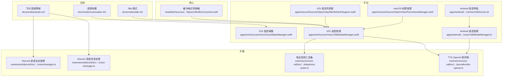
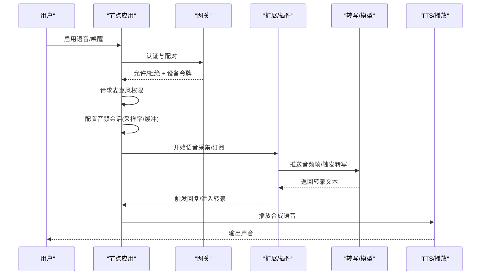
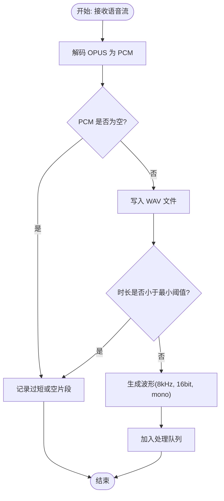
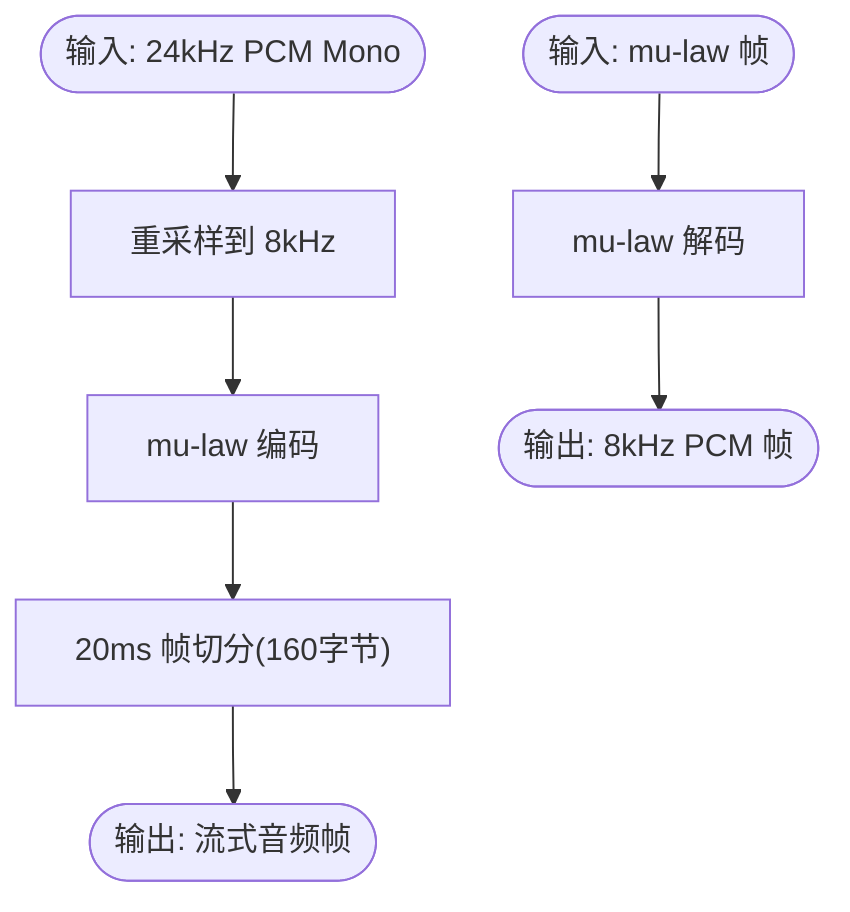
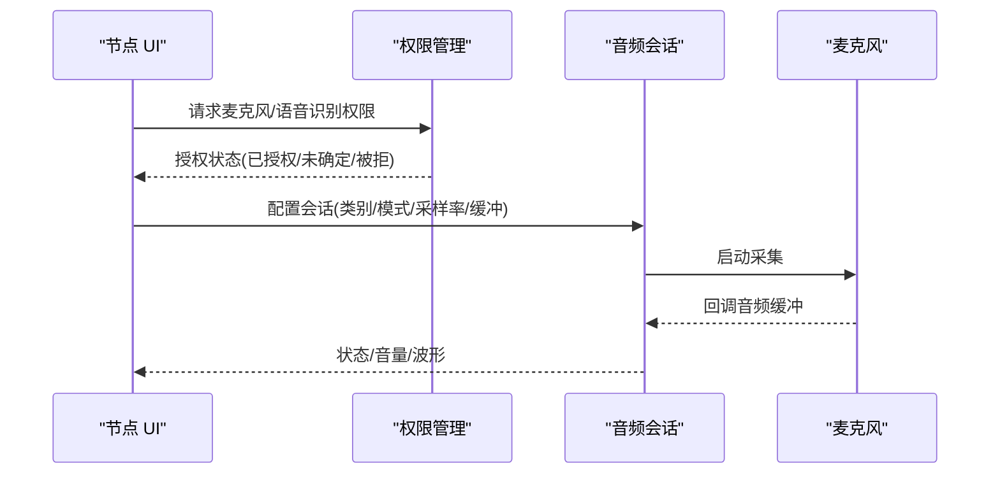
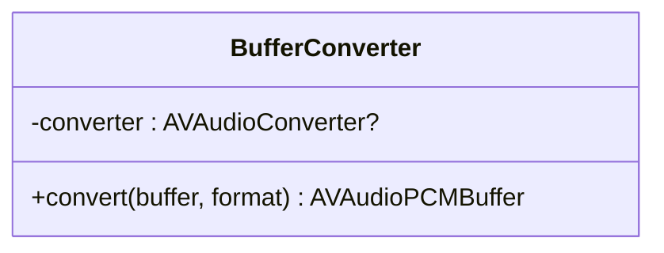
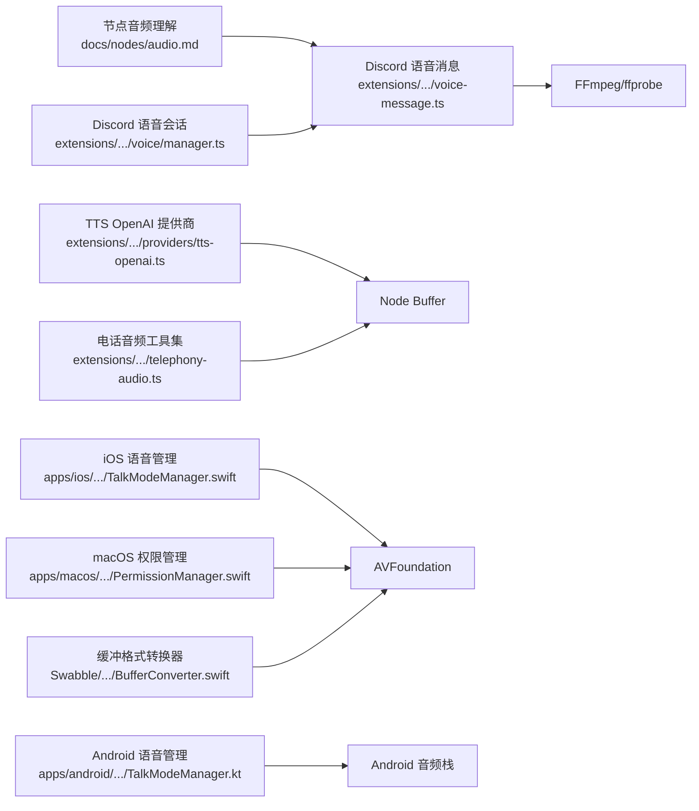

# 音频操作

<cite>
**本文引用的文件**
- [docs/nodes/audio.md](file://docs/nodes/audio.md)
- [docs/nodes/talk.md](file://docs/nodes/talk.md)
- [docs/nodes/voicewake.md](file://docs/nodes/voicewake.md)
- [extensions/discord/src/voice/manager.ts](file://extensions/discord/src/voice/manager.ts)
- [extensions/discord/src/voice-message.ts](file://extensions/discord/src/voice-message.ts)
- [extensions/voice-call/src/providers/tts-openai.ts](file://extensions/voice-call/src/providers/tts-openai.ts)
- [extensions/voice-call/src/telephony-audio.ts](file://extensions/voice-call/src/telephony-audio.ts)
- [apps/ios/Sources/Voice/TalkModeManager.swift](file://apps/ios/Sources/Voice/TalkModeManager.swift)
- [apps/ios/Sources/Voice/VoiceWakeManager.swift](file://apps/ios/Sources/Voice/VoiceWakeManager.swift)
- [apps/macos/Sources/OpenClaw/MicRefreshSupport.swift](file://apps/macos/Sources/OpenClaw/MicRefreshSupport.swift)
- [apps/macos/Sources/OpenClaw/PermissionManager.swift](file://apps/macos/Sources/OpenClaw/PermissionManager.swift)
- [apps/android/app/src/main/java/ai/openclaw/app/voice/TalkModeManager.kt](file://apps/android/app/src/main/java/ai/openclaw/app/voice/TalkModeManager.kt)
- [apps/android/app/src/main/java/ai/openclaw/app/ui/VoiceTabScreen.kt](file://apps/android/app/src/main/java/ai/openclaw/app/ui/VoiceTabScreen.kt)
- [Swabble/Sources/SwabbleCore/Speech/BufferConverter.swift](file://Swabble/Sources/SwabbleCore/Speech/BufferConverter.swift)
</cite>

## 目录
1. [简介](#简介)
2. [项目结构](#项目结构)
3. [核心组件](#核心组件)
4. [架构总览](#架构总览)
5. [详细组件分析](#详细组件分析)
6. [依赖关系分析](#依赖关系分析)
7. [性能考量](#性能考量)
8. [故障排查指南](#故障排查指南)
9. [结论](#结论)
10. [附录](#附录)

## 简介
本文件面向 OpenClaw 的音频操作能力，系统化梳理从“麦克风访问与权限”到“音频流采集与处理”的完整链路，覆盖跨平台（macOS、iOS、Android）的差异与兼容性、实时转写与 TTS 播放、采样率与编码格式选择、文件格式支持与存储优化、以及隐私与授权流程。文档以“节点（Node）+ 网关（Gateway）+ 插件/扩展”的分层视角组织，并通过图示展示关键流程与数据路径。

## 项目结构
OpenClaw 的音频相关能力分布在多个层次：
- 文档层：提供节点音频理解、语音唤醒、Talk 模式等行为规范与配置参考
- 扩展层：如 Discord 语音消息处理、语音通话 TTS/STT 提供商适配
- 平台层：iOS/macOS/Android 的语音会话、权限请求、设备刷新与音频格式转换
- 核心库层：如 Swabble 的音频缓冲转换器，用于格式与采样率转换

**图表来源**
- [docs/nodes/audio.md:1-188](file://docs/nodes/audio.md#L1-L188)
- [extensions/discord/src/voice/manager.ts:563-614](file://extensions/discord/src/voice/manager.ts#L563-L614)
- [extensions/discord/src/voice-message.ts:76-187](file://extensions/discord/src/voice-message.ts#L76-L187)
- [extensions/voice-call/src/providers/tts-openai.ts:148-221](file://extensions/voice-call/src/providers/tts-openai.ts#L148-L221)
- [extensions/voice-call/src/telephony-audio.ts:1-90](file://extensions/voice-call/src/telephony-audio.ts#L1-L90)
- [apps/ios/Sources/Voice/TalkModeManager.swift:2044-2108](file://apps/ios/Sources/Voice/TalkModeManager.swift#L2044-L2108)
- [apps/ios/Sources/Voice/VoiceWakeManager.swift:394-419](file://apps/ios/Sources/Voice/VoiceWakeManager.swift#L394-L419)
- [apps/macos/Sources/OpenClaw/MicRefreshSupport.swift:1-46](file://apps/macos/Sources/OpenClaw/MicRefreshSupport.swift#L1-L46)
- [apps/macos/Sources/OpenClaw/PermissionManager.swift:122-150](file://apps/macos/Sources/OpenClaw/PermissionManager.swift#L122-L150)
- [apps/android/app/src/main/java/ai/openclaw/app/voice/TalkModeManager.kt:1664-1696](file://apps/android/app/src/main/java/ai/openclaw/app/voice/TalkModeManager.kt#L1664-L1696)
- [apps/android/app/src/main/java/ai/openclaw/app/ui/VoiceTabScreen.kt:327-354](file://apps/android/app/src/main/java/ai/openclaw/app/ui/VoiceTabScreen.kt#L327-L354)
- [Swabble/Sources/SwabbleCore/Speech/BufferConverter.swift:1-31](file://Swabble/Sources/SwabbleCore/Speech/BufferConverter.swift#L1-L31)

**章节来源**
- [docs/nodes/audio.md:1-188](file://docs/nodes/audio.md#L1-L188)
- [extensions/discord/src/voice/manager.ts:563-614](file://extensions/discord/src/voice/manager.ts#L563-L614)
- [extensions/discord/src/voice-message.ts:76-187](file://extensions/discord/src/voice-message.ts#L76-L187)
- [extensions/voice-call/src/providers/tts-openai.ts:148-221](file://extensions/voice-call/src/providers/tts-openai.ts#L148-L221)
- [extensions/voice-call/src/telephony-audio.ts:1-90](file://extensions/voice-call/src/telephony-audio.ts#L1-L90)
- [apps/ios/Sources/Voice/TalkModeManager.swift:2044-2108](file://apps/ios/Sources/Voice/TalkModeManager.swift#L2044-L2108)
- [apps/ios/Sources/Voice/VoiceWakeManager.swift:394-419](file://apps/ios/Sources/Voice/VoiceWakeManager.swift#L394-L419)
- [apps/macos/Sources/OpenClaw/MicRefreshSupport.swift:1-46](file://apps/macos/Sources/OpenClaw/MicRefreshSupport.swift#L1-L46)
- [apps/macos/Sources/OpenClaw/PermissionManager.swift:122-150](file://apps/macos/Sources/OpenClaw/PermissionManager.swift#L122-L150)
- [apps/android/app/src/main/java/ai/openclaw/app/voice/TalkModeManager.kt:1664-1696](file://apps/android/app/src/main/java/ai/openclaw/app/voice/TalkModeManager.kt#L1664-L1696)
- [apps/android/app/src/main/java/ai/openclaw/app/ui/VoiceTabScreen.kt:327-354](file://apps/android/app/src/main/java/ai/openclaw/app/ui/VoiceTabScreen.kt#L327-L354)
- [Swabble/Sources/SwabbleCore/Speech/BufferConverter.swift:1-31](file://Swabble/Sources/SwabbleCore/Speech/BufferConverter.swift#L1-L31)

## 核心组件
- 节点音频理解与转写：负责识别并下载音频附件，按模型顺序尝试本地 CLI 或云端提供商进行转写；支持回显转录文本、大小限制与代理环境变量。
- Discord 语音消息处理：将接收的 OPUS 流解码为 PCM，必要时写入 WAV 文件，生成波形图，执行后续处理队列。
- 语音通话 TTS/STT 适配：提供 OpenAI 实时 STT 配置接口、PCM 到 mu-law 编码、重采样至 8kHz、20ms 帧切片等工具函数。
- 平台语音会话与权限：iOS/macOS/Android 分别管理音频会话、权限请求、设备刷新与 UI 反馈；支持噪声阈值动态调整、采样率与输出格式配置。
- 缓冲格式转换器：在 AVFoundation 上对音频缓冲进行格式与采样率转换，确保下游处理一致性。

**章节来源**
- [docs/nodes/audio.md:10-188](file://docs/nodes/audio.md#L10-L188)
- [extensions/discord/src/voice/manager.ts:563-614](file://extensions/discord/src/voice/manager.ts#L563-L614)
- [extensions/discord/src/voice-message.ts:76-187](file://extensions/discord/src/voice-message.ts#L76-L187)
- [extensions/voice-call/src/providers/tts-openai.ts:148-221](file://extensions/voice-call/src/providers/tts-openai.ts#L148-L221)
- [extensions/voice-call/src/telephony-audio.ts:1-90](file://extensions/voice-call/src/telephony-audio.ts#L1-L90)
- [apps/ios/Sources/Voice/TalkModeManager.swift:2044-2108](file://apps/ios/Sources/Voice/TalkModeManager.swift#L2044-L2108)
- [apps/macos/Sources/OpenClaw/MicRefreshSupport.swift:1-46](file://apps/macos/Sources/OpenClaw/MicRefreshSupport.swift#L1-L46)
- [Swabble/Sources/SwabbleCore/Speech/BufferConverter.swift:1-31](file://Swabble/Sources/SwabbleCore/Speech/BufferConverter.swift#L1-L31)

## 架构总览
OpenClaw 的音频处理采用“网关编排 + 节点执行 + 扩展插件”的分层架构：
- 网关负责协议、事件广播与设备配对；节点通过 WebSocket 连接并上报状态
- 节点侧完成麦克风采集、实时转写与 TTS 播放；跨平台差异由各平台语音管理器与权限模块处理
- 扩展层提供特定渠道（如 Discord）的消息处理与格式转换逻辑

**图表来源**
- [docs/nodes/talk.md:1-93](file://docs/nodes/talk.md#L1-L93)
- [extensions/discord/src/voice/manager.ts:563-614](file://extensions/discord/src/voice/manager.ts#L563-L614)
- [extensions/voice-call/src/providers/tts-openai.ts:148-221](file://extensions/voice-call/src/providers/tts-openai.ts#L148-L221)

## 详细组件分析

### 组件一：Discord 语音消息处理与波形生成
该组件负责将 Discord 语音接收流解码为 PCM，必要时写入 WAV，随后生成固定长度的波形数组（Base64），并进入处理队列。同时包含 OGG/Opus 格式校验与必要时的重编码逻辑，确保采样率与编解码器满足平台要求。

**图表来源**
- [extensions/discord/src/voice/manager.ts:563-614](file://extensions/discord/src/voice/manager.ts#L563-L614)
- [extensions/discord/src/voice-message.ts:76-187](file://extensions/discord/src/voice-message.ts#L76-L187)

**章节来源**
- [extensions/discord/src/voice/manager.ts:563-614](file://extensions/discord/src/voice/manager.ts#L563-L614)
- [extensions/discord/src/voice-message.ts:76-187](file://extensions/discord/src/voice-message.ts#L76-L187)

### 组件二：语音通话 TTS/STT 工具链（采样率与编码）
该工具链提供：
- 从 24kHz PCM 重采样到 8kHz（线性插值）
- 将 8kHz PCM 编码为 mu-law（G.711）
- 将 mu-law 解码回线性 PCM
- 将音频切分为 20ms 帧（160 字节，8kHz 单声道）

**图表来源**
- [extensions/voice-call/src/providers/tts-openai.ts:148-221](file://extensions/voice-call/src/providers/tts-openai.ts#L148-L221)
- [extensions/voice-call/src/telephony-audio.ts:1-90](file://extensions/voice-call/src/telephony-audio.ts#L1-L90)

**章节来源**
- [extensions/voice-call/src/providers/tts-openai.ts:148-221](file://extensions/voice-call/src/providers/tts-openai.ts#L148-L221)
- [extensions/voice-call/src/telephony-audio.ts:1-90](file://extensions/voice-call/src/telephony-audio.ts#L1-L90)

### 组件三：平台语音会话与权限管理（iOS/macOS/Android）
- iOS：配置音频会话类别/模式（优先口语化场景）、首选采样率与 IO 缓冲时长；动态噪声阈值估计；提供音频缓冲诊断回调。
- macOS：麦克风刷新支持（去抖动调度）、语音唤醒绑定；权限管理中对语音识别与相机权限的请求与引导。
- Android：语音参数校验（语言、输出格式、延迟等级、PCM 采样率）、麦克风权限提示与设置入口。

**图表来源**
- [apps/ios/Sources/Voice/TalkModeManager.swift:2044-2108](file://apps/ios/Sources/Voice/TalkModeManager.swift#L2044-L2108)
- [apps/macos/Sources/OpenClaw/MicRefreshSupport.swift:1-46](file://apps/macos/Sources/OpenClaw/MicRefreshSupport.swift#L1-L46)
- [apps/macos/Sources/OpenClaw/PermissionManager.swift:122-150](file://apps/macos/Sources/OpenClaw/PermissionManager.swift#L122-L150)
- [apps/android/app/src/main/java/ai/openclaw/app/voice/TalkModeManager.kt:1664-1696](file://apps/android/app/src/main/java/ai/openclaw/app/voice/TalkModeManager.kt#L1664-L1696)
- [apps/android/app/src/main/java/ai/openclaw/app/ui/VoiceTabScreen.kt:327-354](file://apps/android/app/src/main/java/ai/openclaw/app/ui/VoiceTabScreen.kt#L327-L354)

**章节来源**
- [apps/ios/Sources/Voice/TalkModeManager.swift:2044-2108](file://apps/ios/Sources/Voice/TalkModeManager.swift#L2044-L2108)
- [apps/macos/Sources/OpenClaw/MicRefreshSupport.swift:1-46](file://apps/macos/Sources/OpenClaw/MicRefreshSupport.swift#L1-L46)
- [apps/macos/Sources/OpenClaw/PermissionManager.swift:122-150](file://apps/macos/Sources/OpenClaw/PermissionManager.swift#L122-L150)
- [apps/android/app/src/main/java/ai/openclaw/app/voice/TalkModeManager.kt:1664-1696](file://apps/android/app/src/main/java/ai/openclaw/app/voice/TalkModeManager.kt#L1664-L1696)
- [apps/android/app/src/main/java/ai/openclaw/app/ui/VoiceTabScreen.kt:327-354](file://apps/android/app/src/main/java/ai/openclaw/app/ui/VoiceTabScreen.kt#L327-L354)

### 组件四：缓冲格式转换器（Swabble）
该组件封装 AVAudioConverter，根据目标格式进行采样率与通道数转换，确保后续处理的一致性。

**图表来源**
- [Swabble/Sources/SwabbleCore/Speech/BufferConverter.swift:1-31](file://Swabble/Sources/SwabbleCore/Speech/BufferConverter.swift#L1-L31)

**章节来源**
- [Swabble/Sources/SwabbleCore/Speech/BufferConverter.swift:1-31](file://Swabble/Sources/SwabbleCore/Speech/BufferConverter.swift#L1-L31)

## 依赖关系分析
- 节点音频理解依赖于“媒体理解工具链”，支持多种提供商与本地 CLI，具备回显转录、大小限制与代理配置
- Discord 扩展依赖 FFmpeg/ffprobe 进行格式与采样率检查，必要时重编码为 OGG/Opus
- 语音通话扩展依赖 Node.js 的 Buffer 与原生模块（如 opusscript）进行音频编解码
- 平台层依赖系统框架（AVAudioSession、AVCaptureDevice 等）进行权限与会话管理
- 核心库层提供跨平台一致的音频缓冲转换能力

**图表来源**
- [docs/nodes/audio.md:1-188](file://docs/nodes/audio.md#L1-L188)
- [extensions/discord/src/voice-message.ts:76-187](file://extensions/discord/src/voice-message.ts#L76-L187)
- [extensions/discord/src/voice/manager.ts:563-614](file://extensions/discord/src/voice/manager.ts#L563-L614)
- [extensions/voice-call/src/providers/tts-openai.ts:148-221](file://extensions/voice-call/src/providers/tts-openai.ts#L148-L221)
- [extensions/voice-call/src/telephony-audio.ts:1-90](file://extensions/voice-call/src/telephony-audio.ts#L1-L90)
- [apps/ios/Sources/Voice/TalkModeManager.swift:2044-2108](file://apps/ios/Sources/Voice/TalkModeManager.swift#L2044-L2108)
- [apps/macos/Sources/OpenClaw/PermissionManager.swift:122-150](file://apps/macos/Sources/OpenClaw/PermissionManager.swift#L122-L150)
- [apps/android/app/src/main/java/ai/openclaw/app/voice/TalkModeManager.kt:1664-1696](file://apps/android/app/src/main/java/ai/openclaw/app/voice/TalkModeManager.kt#L1664-L1696)
- [Swabble/Sources/SwabbleCore/Speech/BufferConverter.swift:1-31](file://Swabble/Sources/SwabbleCore/Speech/BufferConverter.swift#L1-L31)

**章节来源**
- [docs/nodes/audio.md:1-188](file://docs/nodes/audio.md#L1-L188)
- [extensions/discord/src/voice-message.ts:76-187](file://extensions/discord/src/voice-message.ts#L76-L187)
- [extensions/discord/src/voice/manager.ts:563-614](file://extensions/discord/src/voice/manager.ts#L563-L614)
- [extensions/voice-call/src/providers/tts-openai.ts:148-221](file://extensions/voice-call/src/providers/tts-openai.ts#L148-L221)
- [extensions/voice-call/src/telephony-audio.ts:1-90](file://extensions/voice-call/src/telephony-audio.ts#L1-L90)
- [apps/ios/Sources/Voice/TalkModeManager.swift:2044-2108](file://apps/ios/Sources/Voice/TalkModeManager.swift#L2044-L2108)
- [apps/macos/Sources/OpenClaw/PermissionManager.swift:122-150](file://apps/macos/Sources/OpenClaw/PermissionManager.swift#L122-L150)
- [apps/android/app/src/main/java/ai/openclaw/app/voice/TalkModeManager.kt:1664-1696](file://apps/android/app/src/main/java/ai/openclaw/app/voice/TalkModeManager.kt#L1664-L1696)
- [Swabble/Sources/SwabbleCore/Speech/BufferConverter.swift:1-31](file://Swabble/Sources/SwabbleCore/Speech/BufferConverter.swift#L1-L31)

## 性能考量
- 采样率与帧长：Talk 模式默认使用 8kHz 单声道（电话带宽）以降低带宽与延迟；部分平台允许更高采样率（如 Android 支持 pcm_16000/22050/24000/44100）。20ms 帧长在 8kHz 下为 160 字节，便于流式传输与低延迟播放。
- 编码格式：OPUS 在 Discord 场景下作为首选；若非 48kHz 或非 OPUS，则通过 FFmpeg 重编码以满足平台要求。
- 音频会话参数：iOS 优先口语化场景，设置采样率与 IO 缓冲时长以平衡延迟与稳定性；Android 支持多采样率输出格式，便于在不同设备上优化延迟。
- 动态噪声阈值：iOS 在监听阶段动态估计噪声底噪并自适应阈值，减少背景噪声导致的误触发。
- 缓冲转换：使用 AVAudioConverter 进行格式与采样率转换，避免重复拷贝与额外开销。

**章节来源**
- [extensions/voice-call/src/telephony-audio.ts:1-90](file://extensions/voice-call/src/telephony-audio.ts#L1-L90)
- [extensions/discord/src/voice-message.ts:76-187](file://extensions/discord/src/voice-message.ts#L76-L187)
- [apps/ios/Sources/Voice/TalkModeManager.swift:2044-2108](file://apps/ios/Sources/Voice/TalkModeManager.swift#L2044-L2108)
- [apps/android/app/src/main/java/ai/openclaw/app/voice/TalkModeManager.kt:1664-1696](file://apps/android/app/src/main/java/ai/openclaw/app/voice/TalkModeManager.kt#L1664-L1696)
- [Swabble/Sources/SwabbleCore/Speech/BufferConverter.swift:1-31](file://Swabble/Sources/SwabbleCore/Speech/BufferConverter.swift#L1-L31)

## 故障排查指南
- 权限相关
  - iOS：麦克风与语音识别授权状态需为“已授权”，否则无法启动录音或转写；可在设置中重新请求授权。
  - macOS：若授权被拒，可引导打开系统设置；语音识别授权与相机授权分别处理。
  - Android：若麦克风权限被拒，界面会提示打开设置启用；建议在交互模式下请求授权。
- 会话与设备
  - iOS：音频会话配置错误会导致无声或高延迟；检查类别/模式/采样率/缓冲时长设置。
  - macOS：麦克风设备变更后需刷新；使用去抖动调度避免频繁刷新。
- 转写与播放
  - Discord：若语音片段过短或为空，会被跳过；检查 OPUS 解码与 WAV 写入流程。
  - Talk 模式：若中断无效或延迟过高，检查采样率与帧长配置，确认平台默认静默窗口设置。
- 编码与格式
  - Discord：确保 OGG/Opus 为 48kHz；否则通过 FFmpeg 重编码；注意输入必须为本地文件路径。
- 存储与清理
  - 临时 PCM 文件应在使用后清理，避免磁盘占用。

**章节来源**
- [apps/ios/Sources/Voice/VoiceWakeManager.swift:394-419](file://apps/ios/Sources/Voice/VoiceWakeManager.swift#L394-L419)
- [apps/macos/Sources/OpenClaw/PermissionManager.swift:122-150](file://apps/macos/Sources/OpenClaw/PermissionManager.swift#L122-L150)
- [apps/android/app/src/main/java/ai/openclaw/app/ui/VoiceTabScreen.kt:327-354](file://apps/android/app/src/main/java/ai/openclaw/app/ui/VoiceTabScreen.kt#L327-L354)
- [extensions/discord/src/voice/manager.ts:563-614](file://extensions/discord/src/voice/manager.ts#L563-L614)
- [extensions/discord/src/voice-message.ts:76-187](file://extensions/discord/src/voice-message.ts#L76-L187)

## 结论
OpenClaw 的音频操作体系以“网关编排 + 节点执行 + 扩展插件”为核心，结合跨平台权限与会话管理，实现了从麦克风采集、实时转写、TTS 播放到格式转换与存储优化的全链路能力。通过对采样率、编码格式与帧长的精细化控制，以及动态噪声阈值与缓冲转换等优化手段，在保证质量的同时兼顾了低延迟与资源效率。建议在实际部署中根据目标平台与网络条件调整参数，并完善权限引导与异常处理流程。

## 附录
- 配置参考
  - 节点音频理解与转写配置、回显与代理设置参见节点音频文档
  - Talk 模式语音参数、输出格式与中断行为参见 Talk 模式文档
  - 语音唤醒列表同步与存储位置参见语音唤醒文档
- 开发与测试
  - 使用平台提供的权限请求与音频会话配置接口进行集成测试
  - 对转写与 TTS 流程进行端到端验证，关注静默窗口、中断与回放延迟
  - 在 Discord 环境下验证 OPUS 采样率与格式校验逻辑

**章节来源**
- [docs/nodes/audio.md:1-188](file://docs/nodes/audio.md#L1-L188)
- [docs/nodes/talk.md:1-93](file://docs/nodes/talk.md#L1-L93)
- [docs/nodes/voicewake.md:1-67](file://docs/nodes/voicewake.md#L1-L67)