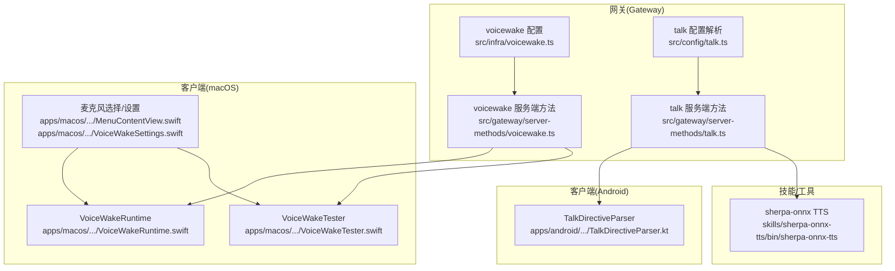
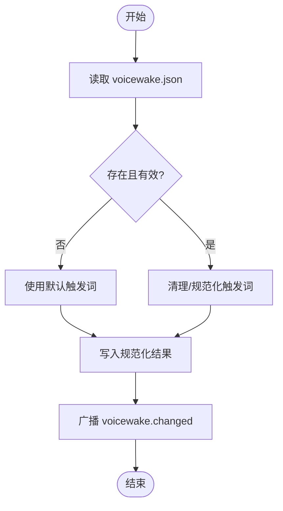
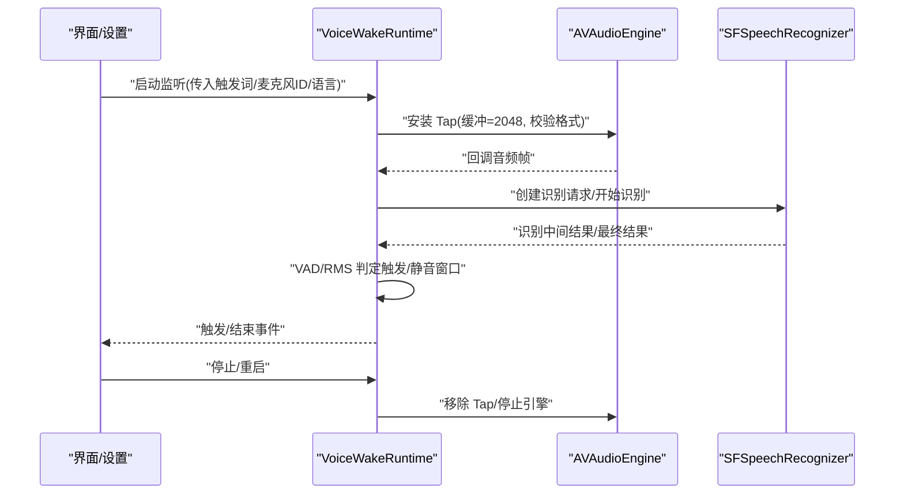
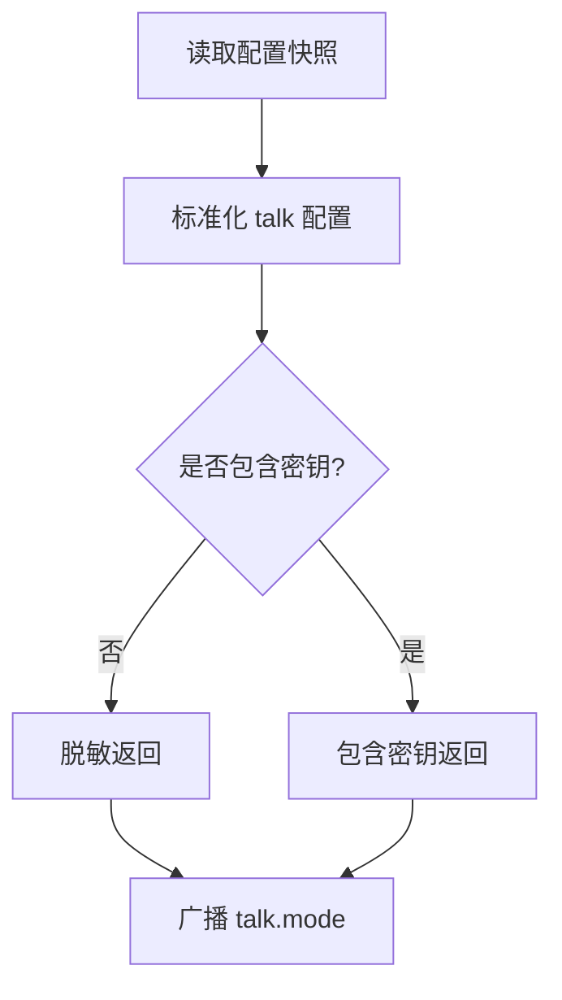
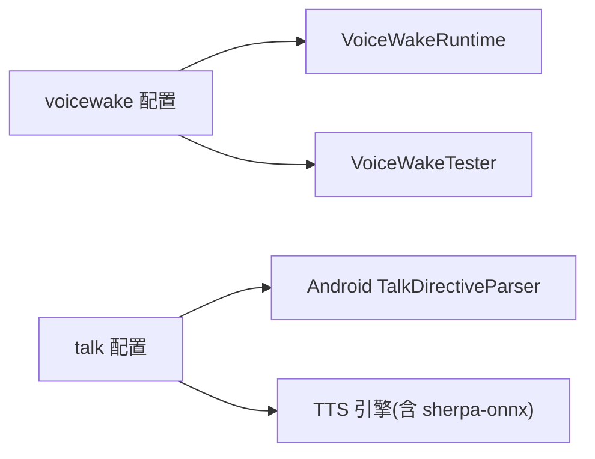

# 语音交互

<cite>
**本文引用的文件**
- [docs/nodes/voicewake.md](file://docs/nodes/voicewake.md)
- [src/infra/voicewake.ts](file://src/infra/voicewake.ts)
- [src/gateway/server-methods/voicewake.ts](file://src/gateway/server-methods/voicewake.ts)
- [src/gateway/server-methods/talk.ts](file://src/gateway/server-methods/talk.ts)
- [src/config/talk.ts](file://src/config/talk.ts)
- [apps/macos/Sources/OpenClaw/VoiceWakeRuntime.swift](file://apps/macos/Sources/OpenClaw/VoiceWakeRuntime.swift)
- [apps/macos/Sources/OpenClaw/VoiceWakeTester.swift](file://apps/macos/Sources/OpenClaw/VoiceWakeTester.swift)
- [apps/macos/Sources/OpenClaw/MenuContentView.swift](file://apps/macos/Sources/OpenClaw/MenuContentView.swift)
- [apps/macos/Sources/OpenClaw/VoiceWakeSettings.swift](file://apps/macos/Sources/OpenClaw/VoiceWakeSettings.swift)
- [apps/android/app/src/main/java/ai/openclaw/app/voice/TalkDirectiveParser.kt](file://apps/android/app/src/main/java/ai/openclaw/app/voice/TalkDirectiveParser.kt)
- [skills/sherpa-onnx-tts/bin/sherpa-onnx-tts](file://skills/sherpa-onnx-tts/bin/sherpa-onnx-tts)
</cite>

## 目录
1. [简介](#简介)
2. [项目结构](#项目结构)
3. [核心组件](#核心组件)
4. [架构总览](#架构总览)
5. [详细组件分析](#详细组件分析)
6. [依赖关系分析](#依赖关系分析)
7. [性能考量](#性能考量)
8. [故障排查指南](#故障排查指南)
9. [结论](#结论)
10. [附录](#附录)

## 简介
本技术文档面向 OpenClaw 的语音交互系统，覆盖以下能力与主题：
- 语音唤醒：全局唤醒词列表、跨节点同步、触发检测与去抖、静音窗口与超时控制
- 连续语音识别：麦克风音频采集、实时流式处理、VAD 检测、识别请求生命周期管理
- 文本转语音：TTS 配置解析、多提供商兼容、输出格式与参数透传、中断策略
- 平台差异：macOS/iOS 的内置唤醒与识别、Android 的手动麦克风流程
- 上下文感知与多轮对话：通过网关广播事件与会话状态驱动
- 配置参数、音频格式支持与第三方 TTS 引擎集成
- 使用场景示例、调试技巧与常见问题解决

## 项目结构
围绕语音交互的关键目录与文件：
- 网关侧配置与协议
  - 唤醒词配置与服务端方法：src/infra/voicewake.ts、src/gateway/server-methods/voicewake.ts
  - TTS 配置解析与响应构建：src/config/talk.ts、src/gateway/server-methods/talk.ts
- 客户端实现（macOS）
  - 唤醒运行时与测试器：apps/macos/Sources/OpenClaw/VoiceWakeRuntime.swift、apps/macos/Sources/OpenClaw/VoiceWakeTester.swift
  - 麦克风设备枚举与设置：apps/macos/Sources/OpenClaw/MenuContentView.swift、apps/macos/Sources/OpenClaw/VoiceWakeSettings.swift
- 客户端实现（Android）
  - TTS 指令解析：apps/android/app/src/main/java/ai/openclaw/app/voice/TalkDirectiveParser.kt
- 技能与工具
  - 第三方 TTS 引擎（sherpa-onnx）：skills/sherpa-onnx-tts/bin/sherpa-onnx-tts



**图表来源**
- [src/infra/voicewake.ts:1-60](file://src/infra/voicewake.ts#L1-L60)
- [src/gateway/server-methods/voicewake.ts:1-35](file://src/gateway/server-methods/voicewake.ts#L1-L35)
- [src/config/talk.ts:1-354](file://src/config/talk.ts#L1-L354)
- [src/gateway/server-methods/talk.ts:1-97](file://src/gateway/server-methods/talk.ts#L1-L97)
- [apps/macos/Sources/OpenClaw/VoiceWakeRuntime.swift:51-77](file://apps/macos/Sources/OpenClaw/VoiceWakeRuntime.swift#L51-L77)
- [apps/macos/Sources/OpenClaw/VoiceWakeTester.swift:36-131](file://apps/macos/Sources/OpenClaw/VoiceWakeTester.swift#L36-L131)
- [apps/macos/Sources/OpenClaw/MenuContentView.swift:529-570](file://apps/macos/Sources/OpenClaw/MenuContentView.swift#L529-L570)
- [apps/macos/Sources/OpenClaw/VoiceWakeSettings.swift:507-529](file://apps/macos/Sources/OpenClaw/VoiceWakeSettings.swift#L507-L529)
- [apps/android/app/src/main/java/ai/openclaw/app/voice/TalkDirectiveParser.kt:47-68](file://apps/android/app/src/main/java/ai/openclaw/app/voice/TalkDirectiveParser.kt#L47-L68)
- [skills/sherpa-onnx-tts/bin/sherpa-onnx-tts](file://skills/sherpa-onnx-tts/bin/sherpa-onnx-tts)

**章节来源**
- [docs/nodes/voicewake.md:1-67](file://docs/nodes/voicewake.md#L1-L67)
- [src/infra/voicewake.ts:1-60](file://src/infra/voicewake.ts#L1-L60)
- [src/gateway/server-methods/voicewake.ts:1-35](file://src/gateway/server-methods/voicewake.ts#L1-L35)
- [src/config/talk.ts:1-354](file://src/config/talk.ts#L1-L354)
- [src/gateway/server-methods/talk.ts:1-97](file://src/gateway/server-methods/talk.ts#L1-L97)
- [apps/macos/Sources/OpenClaw/VoiceWakeRuntime.swift:51-77](file://apps/macos/Sources/OpenClaw/VoiceWakeRuntime.swift#L51-L77)
- [apps/macos/Sources/OpenClaw/VoiceWakeTester.swift:36-131](file://apps/macos/Sources/OpenClaw/VoiceWakeTester.swift#L36-L131)
- [apps/macos/Sources/OpenClaw/MenuContentView.swift:529-570](file://apps/macos/Sources/OpenClaw/MenuContentView.swift#L529-L570)
- [apps/macos/Sources/OpenClaw/VoiceWakeSettings.swift:507-529](file://apps/macos/Sources/OpenClaw/VoiceWakeSettings.swift#L507-L529)
- [apps/android/app/src/main/java/ai/openclaw/app/voice/TalkDirectiveParser.kt:47-68](file://apps/android/app/src/main/java/ai/openclaw/app/voice/TalkDirectiveParser.kt#L47-L68)
- [skills/sherpa-onnx-tts/bin/sherpa-onnx-tts](file://skills/sherpa-onnx-tts/bin/sherpa-onnx-tts)

## 核心组件
- 唤醒词配置与同步
  - 网关负责存储与规范化唤醒词列表，并通过 WebSocket 广播变更；各节点订阅并应用到本地唤醒逻辑
  - 默认唤醒词集合与文件路径解析在网关侧完成
- 语音识别（macOS）
  - 使用系统语音识别框架进行实时识别；通过音频引擎 tap 获取 PCM 流，结合 VAD 与静音窗口判定触发与结束
  - 支持麦克风设备选择与可用性检测
- 文本转语音（TTS）
  - 网关侧统一解析 TTS 提供商配置，支持多提供商与兼容字段映射
  - 客户端按指令参数执行 TTS 输出，支持速率、音色、语言等参数透传
- 第三方 TTS 引擎
  - 提供 sherpa-onnx 等本地化 TTS 可选方案，便于离线或隐私敏感场景

**章节来源**
- [src/infra/voicewake.ts:10-43](file://src/infra/voicewake.ts#L10-L43)
- [src/gateway/server-methods/voicewake.ts:7-34](file://src/gateway/server-methods/voicewake.ts#L7-L34)
- [apps/macos/Sources/OpenClaw/VoiceWakeRuntime.swift:51-77](file://apps/macos/Sources/OpenClaw/VoiceWakeRuntime.swift#L51-L77)
- [apps/macos/Sources/OpenClaw/VoiceWakeTester.swift:108-131](file://apps/macos/Sources/OpenClaw/VoiceWakeTester.swift#L108-L131)
- [apps/macos/Sources/OpenClaw/MenuContentView.swift:529-570](file://apps/macos/Sources/OpenClaw/MenuContentView.swift#L529-L570)
- [src/config/talk.ts:204-313](file://src/config/talk.ts#L204-L313)
- [src/gateway/server-methods/talk.ts:21-96](file://src/gateway/server-methods/talk.ts#L21-L96)
- [skills/sherpa-onnx-tts/bin/sherpa-onnx-tts](file://skills/sherpa-onnx-tts/bin/sherpa-onnx-tts)

## 架构总览
OpenClaw 的语音交互采用“网关集中配置 + 节点本地执行”的分层架构：
- 网关负责：
  - 唤醒词持久化与广播
  - TTS 配置解析与安全返回
  - 会话模式广播（talk.enabled/phase）
- 客户端负责：
  - macOS：基于系统框架的唤醒检测、音频采集、识别与 VAD 控制
  - Android：基于指令解析的 TTS 执行与参数透传

```mermaid
sequenceDiagram
participant GW as "网关"
participant MAC as "macOS 客户端"
participant AND as "Android 客户端"
GW->>GW : "加载/更新唤醒词配置"
GW-->>MAC : "广播 voicewake.changed"
GW-->>AND : "广播 voicewake.changed"
MAC->>MAC : "VoiceWakeRuntime 检测触发词"
MAC->>GW : "talk.mode(enabled=true)"
GW-->>MAC : "广播 talk.mode"
GW-->>AND : "广播 talk.mode"
AND->>GW : "talk.config 请求"
GW-->>AND : "返回 TTS 配置(含提供商/参数)"
```

**图表来源**
- [src/gateway/server-methods/voicewake.ts:26-33](file://src/gateway/server-methods/voicewake.ts#L26-L33)
- [src/gateway/server-methods/talk.ts:68-95](file://src/gateway/server-methods/talk.ts#L68-L95)
- [apps/macos/Sources/OpenClaw/VoiceWakeRuntime.swift:51-77](file://apps/macos/Sources/OpenClaw/VoiceWakeRuntime.swift#L51-L77)

## 详细组件分析

### 唤醒词配置与同步
- 存储位置与默认值
  - 文件路径：~/.openclaw/settings/voicewake.json
  - 默认触发词：["openclaw","claude","computer"]
- 规范化与限制
  - 去空格、过滤空串；空列表回退默认值
  - 更新时间戳记录
- 协议方法
  - 查询：voicewake.get → { triggers: string[] }
  - 设置：voicewake.set({ triggers: string[] }) → { triggers: string[] }
  - 事件：voicewake.changed({ triggers: string[] }) 广播给所有连接客户端



**图表来源**
- [src/infra/voicewake.ts:30-59](file://src/infra/voicewake.ts#L30-L59)
- [src/gateway/server-methods/voicewake.ts:8-33](file://src/gateway/server-methods/voicewake.ts#L8-L33)

**章节来源**
- [docs/nodes/voicewake.md:18-49](file://docs/nodes/voicewake.md#L18-L49)
- [src/infra/voicewake.ts:10-43](file://src/infra/voicewake.ts#L10-L43)
- [src/gateway/server-methods/voicewake.ts:7-34](file://src/gateway/server-methods/voicewake.ts#L7-L34)

### macOS 语音识别与唤醒
- 音频采集与格式
  - 通过 AVAudioEngine 输入节点安装 Tap，缓冲区大小 2048，获取 PCM 音频帧
  - 校验通道数与采样率有效性
- 识别与触发
  - 使用 SFSpeechRecognizer 进行实时识别，默认任务提示为 dictation
  - 通过 VAD（RMS 阈值、预检测静默窗口、触发后静音窗口）判定说话开始与结束
  - 支持触发词匹配与防抖（debounceAfterSend）
- 生命周期管理
  - 识别任务生成号递增以丢弃过期回调
  - 正确结束音频、移除 Tap、停止引擎并释放资源



**图表来源**
- [apps/macos/Sources/OpenClaw/VoiceWakeTester.swift:40-131](file://apps/macos/Sources/OpenClaw/VoiceWakeTester.swift#L40-L131)
- [apps/macos/Sources/OpenClaw/VoiceWakeRuntime.swift:51-77](file://apps/macos/Sources/OpenClaw/VoiceWakeRuntime.swift#L51-L77)

**章节来源**
- [apps/macos/Sources/OpenClaw/VoiceWakeTester.swift:36-131](file://apps/macos/Sources/OpenClaw/VoiceWakeTester.swift#L36-L131)
- [apps/macos/Sources/OpenClaw/VoiceWakeRuntime.swift:51-77](file://apps/macos/Sources/OpenClaw/VoiceWakeRuntime.swift#L51-L77)
- [apps/macos/Sources/OpenClaw/MenuContentView.swift:529-570](file://apps/macos/Sources/OpenClaw/MenuContentView.swift#L529-L570)
- [apps/macos/Sources/OpenClaw/VoiceWakeSettings.swift:507-529](file://apps/macos/Sources/OpenClaw/VoiceWakeSettings.swift#L507-L529)

### 文本转语音（TTS）配置与执行
- 配置解析
  - 支持 provider 与 providers 两种形态；单提供商标准化为 providers 映射
  - 兼容历史字段（voiceId/modelId/outputFormat/apiKey/voiceAliases/silenceTimeoutMs 等）
  - 安全返回：可按需隐藏密钥类字段
- 客户端执行
  - Android 通过 TalkDirectiveParser 解析 head 中的 TTS 参数（如 voice/model/speed/rate/stability/similarity/style/speakerBoost/seed/language/output_format/latency_tier/once 等），并将参数透传至 TTS 引擎
- 网关广播
  - talk.mode 用于开启/关闭语音交互并携带 phase 与时间戳，客户端据此调整状态



**图表来源**
- [src/config/talk.ts:204-313](file://src/config/talk.ts#L204-L313)
- [src/gateway/server-methods/talk.ts:21-66](file://src/gateway/server-methods/talk.ts#L21-L66)
- [apps/android/app/src/main/java/ai/openclaw/app/voice/TalkDirectiveParser.kt:47-68](file://apps/android/app/src/main/java/ai/openclaw/app/voice/TalkDirectiveParser.kt#L47-L68)

**章节来源**
- [src/config/talk.ts:204-313](file://src/config/talk.ts#L204-L313)
- [src/gateway/server-methods/talk.ts:21-96](file://src/gateway/server-methods/talk.ts#L21-L96)
- [apps/android/app/src/main/java/ai/openclaw/app/voice/TalkDirectiveParser.kt:47-68](file://apps/android/app/src/main/java/ai/openclaw/app/voice/TalkDirectiveParser.kt#L47-L68)

### 第三方 TTS 引擎集成（sherpa-onnx）
- 仓库提供 sherpa-onnx 的可执行脚本入口，可用于本地化 TTS 推理，适合低延迟、离线或隐私敏感场景
- 集成方式建议
  - 在网关侧通过技能或外部进程调用该二进制，将文本与参数（如语言、音色、采样率）传递给引擎
  - 将引擎输出的音频流回传给客户端播放或进一步处理

**章节来源**
- [skills/sherpa-onnx-tts/bin/sherpa-onnx-tts](file://skills/sherpa-onnx-tts/bin/sherpa-onnx-tts)

## 依赖关系分析
- 组件耦合
  - 网关侧：voicewake 与 talk 配置相互独立但共同驱动客户端行为
  - 客户端：macOS 的 VoiceWakeRuntime/Tester 依赖系统框架与网关广播；Android 的 TalkDirectiveParser 依赖网关返回的 talk.config
- 外部依赖
  - macOS：AVFoundation/Speech 框架
  - Android：应用内语音指令解析与 TTS 引擎
  - 第三方：sherpa-onnx 等本地 TTS 工具



**图表来源**
- [src/infra/voicewake.ts:1-60](file://src/infra/voicewake.ts#L1-L60)
- [apps/macos/Sources/OpenClaw/VoiceWakeRuntime.swift:51-77](file://apps/macos/Sources/OpenClaw/VoiceWakeRuntime.swift#L51-L77)
- [apps/macos/Sources/OpenClaw/VoiceWakeTester.swift:36-131](file://apps/macos/Sources/OpenClaw/VoiceWakeTester.swift#L36-L131)
- [src/config/talk.ts:204-313](file://src/config/talk.ts#L204-L313)
- [apps/android/app/src/main/java/ai/openclaw/app/voice/TalkDirectiveParser.kt:47-68](file://apps/android/app/src/main/java/ai/openclaw/app/voice/TalkDirectiveParser.kt#L47-L68)
- [skills/sherpa-onnx-tts/bin/sherpa-onnx-tts](file://skills/sherpa-onnx-tts/bin/sherpa-onnx-tts)

**章节来源**
- [src/infra/voicewake.ts:1-60](file://src/infra/voicewake.ts#L1-L60)
- [src/config/talk.ts:204-313](file://src/config/talk.ts#L204-L313)
- [apps/macos/Sources/OpenClaw/VoiceWakeRuntime.swift:51-77](file://apps/macos/Sources/OpenClaw/VoiceWakeRuntime.swift#L51-L77)
- [apps/macos/Sources/OpenClaw/VoiceWakeTester.swift:36-131](file://apps/macos/Sources/OpenClaw/VoiceWakeTester.swift#L36-L131)
- [apps/android/app/src/main/java/ai/openclaw/app/voice/TalkDirectiveParser.kt:47-68](file://apps/android/app/src/main/java/ai/openclaw/app/voice/TalkDirectiveParser.kt#L47-L68)
- [skills/sherpa-onnx-tts/bin/sherpa-onnx-tts](file://skills/sherpa-onnx-tts/bin/sherpa-onnx-tts)

## 性能考量
- 麦克风与音频
  - 缓冲区大小与采样率直接影响延迟与 CPU 占用；Tap 安装后及时移除避免资源泄漏
  - RMS 阈值与静音窗口应根据环境噪声动态调整，减少误触发与漏检
- 识别与合成
  - 识别请求的生命周期管理（endAudio/cancel）有助于降低后台占用
  - TTS 参数（如 latency_tier、output_format）影响延迟与质量，需按场景权衡
- 广播与网络
  - talk.mode 与 voicewake.changed 使用广播推送，注意丢弃慢消费者策略以保证实时性

[本节为通用指导，无需具体文件来源]

## 故障排查指南
- 唤醒词无效或未生效
  - 检查网关 voicewake.json 是否存在与格式正确；确认已广播到客户端
  - 确认客户端当前语言与麦克风设备可用
- 无法识别语音
  - 确认系统语音识别可用性与权限；检查音频输入格式（通道数/采样率）
  - 调整 RMS 阈值与静音窗口参数，避免环境噪声干扰
- TTS 无声音或参数不生效
  - 检查 talk.config 返回中提供商与参数是否正确；确认客户端解析逻辑
  - 对于 Android，核对 TalkDirectiveParser 的参数键名映射（如 speakerBoost、latency_tier 等）
- 资源未释放导致卡顿
  - 确保识别结束后调用 endAudio、移除 Tap、停止引擎并释放对象

**章节来源**
- [src/infra/voicewake.ts:30-59](file://src/infra/voicewake.ts#L30-L59)
- [apps/macos/Sources/OpenClaw/VoiceWakeTester.swift:108-131](file://apps/macos/Sources/OpenClaw/VoiceWakeTester.swift#L108-L131)
- [apps/macos/Sources/OpenClaw/VoiceWakeRuntime.swift:66-77](file://apps/macos/Sources/OpenClaw/VoiceWakeRuntime.swift#L66-L77)
- [apps/android/app/src/main/java/ai/openclaw/app/voice/TalkDirectiveParser.kt:47-68](file://apps/android/app/src/main/java/ai/openclaw/app/voice/TalkDirectiveParser.kt#L47-L68)

## 结论
OpenClaw 的语音交互体系以网关为中心，结合平台特性在客户端实现高效稳定的唤醒与识别、灵活可控的 TTS 输出。通过全局唤醒词同步与会话模式广播，系统实现了跨节点一致的上下文感知与多轮对话基础。针对不同平台的硬件与生态差异，系统提供了清晰的扩展点与集成路径，便于在性能、隐私与易用性之间取得平衡。

[本节为总结，无需具体文件来源]

## 附录

### 平台差异与硬件适配要点
- macOS/iOS
  - 使用系统框架进行唤醒与识别；支持麦克风设备枚举与可用性检测
  - VAD 与静音窗口参数可调，满足不同环境噪声条件
- Android
  - 当前禁用自动唤醒；通过 Voice 页的手动麦克风流程参与语音交互
  - TTS 参数由客户端解析并透传至引擎，确保与网关配置一致

**章节来源**
- [docs/nodes/voicewake.md:53-67](file://docs/nodes/voicewake.md#L53-L67)
- [apps/macos/Sources/OpenClaw/MenuContentView.swift:529-570](file://apps/macos/Sources/OpenClaw/MenuContentView.swift#L529-L570)
- [apps/macos/Sources/OpenClaw/VoiceWakeSettings.swift:507-529](file://apps/macos/Sources/OpenClaw/VoiceWakeSettings.swift#L507-L529)

### 配置参数与第三方引擎集成参考
- TTS 配置解析与兼容字段
  - provider/providers、voiceId/modelId/outputFormat/apiKey/voiceAliases/silenceTimeoutMs 等
- Android TTS 指令参数
  - voice、model、speed、rate/wpm、stability、similarity/similarity_boost/similarityBoost、style、speakerBoost/noSpeakerBoost、seed、normalize/apply_text_normalization、lang/language_code/language、output_format/format、latency/latency_tier/latencyTier、once
- 第三方 TTS 引擎
  - 使用 sherpa-onnx 可执行脚本作为本地化 TTS 方案

**章节来源**
- [src/config/talk.ts:204-313](file://src/config/talk.ts#L204-L313)
- [apps/android/app/src/main/java/ai/openclaw/app/voice/TalkDirectiveParser.kt:47-68](file://apps/android/app/src/main/java/ai/openclaw/app/voice/TalkDirectiveParser.kt#L47-L68)
- [skills/sherpa-onnx-tts/bin/sherpa-onnx-tts](file://skills/sherpa-onnx-tts/bin/sherpa-onnx-tts)