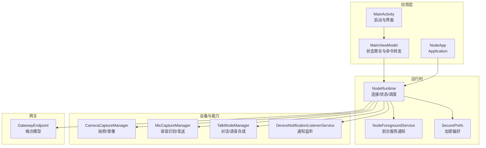
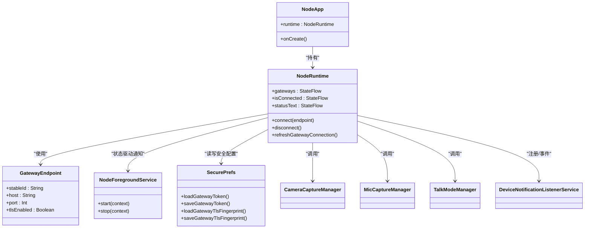
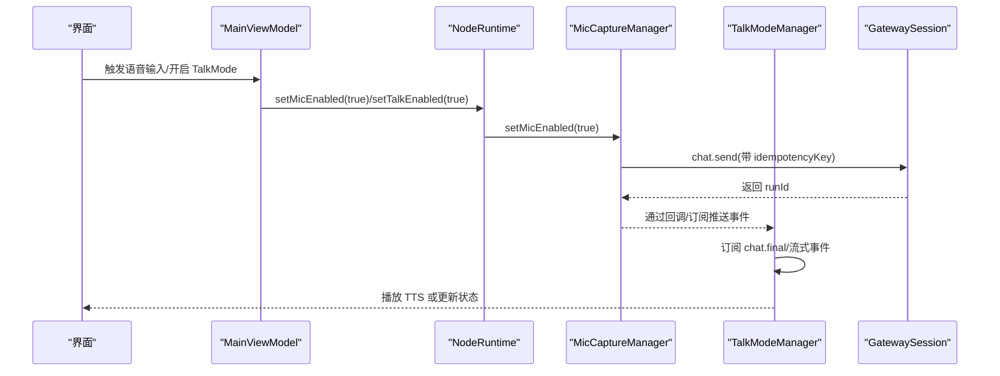
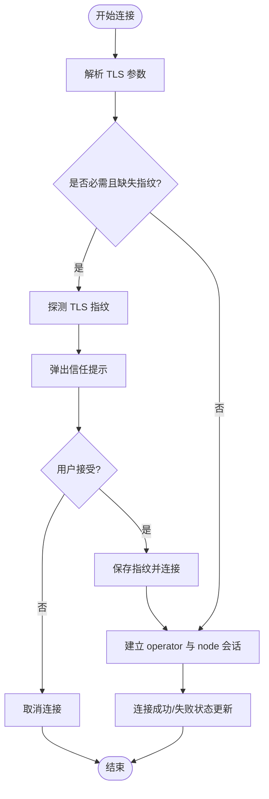
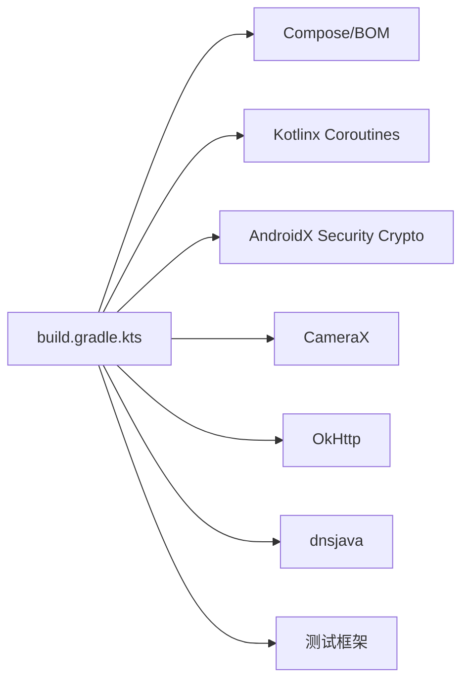

# Android 应用

<cite>
**本文引用的文件**
- [apps/android/app/src/main/java/ai/openclaw/app/MainActivity.kt](file://apps/android/app/src/main/java/ai/openclaw/app/MainActivity.kt)
- [apps/android/app/src/main/java/ai/openclaw/app/MainViewModel.kt](file://apps/android/app/src/main/java/ai/openclaw/app/MainViewModel.kt)
- [apps/android/app/src/main/java/ai/openclaw/app/NodeApp.kt](file://apps/android/app/src/main/java/ai/openclaw/app/NodeApp.kt)
- [apps/android/app/src/main/java/ai/openclaw/app/NodeForegroundService.kt](file://apps/android/app/src/main/java/ai/openclaw/app/NodeForegroundService.kt)
- [apps/android/app/src/main/AndroidManifest.xml](file://apps/android/app/src/main/AndroidManifest.xml)
- [apps/android/app/src/main/java/ai/openclaw/app/NodeRuntime.kt](file://apps/android/app/src/main/java/ai/openclaw/app/NodeRuntime.kt)
- [apps/android/app/src/main/java/ai/openclaw/app/gateway/GatewayEndpoint.kt](file://apps/android/app/src/main/java/ai/openclaw/app/gateway/GatewayEndpoint.kt)
- [apps/android/app/src/main/java/ai/openclaw/app/node/CameraCaptureManager.kt](file://apps/android/app/src/main/java/ai/openclaw/app/node/CameraCaptureManager.kt)
- [apps/android/app/src/main/java/ai/openclaw/app/voice/MicCaptureManager.kt](file://apps/android/app/src/main/java/ai/openclaw/app/voice/MicCaptureManager.kt)
- [apps/android/app/src/main/java/ai/openclaw/app/voice/TalkModeManager.kt](file://apps/android/app/src/main/java/ai/openclaw/app/voice/TalkModeManager.kt)
- [apps/android/app/src/main/java/ai/openclaw/app/node/DeviceNotificationListenerService.kt](file://apps/android/app/src/main/java/ai/openclaw/app/node/DeviceNotificationListenerService.kt)
- [apps/android/app/src/main/java/ai/openclaw/app/SecurePrefs.kt](file://apps/android/app/src/main/java/ai/openclaw/app/SecurePrefs.kt)
- [apps/android/app/build.gradle.kts](file://apps/android/app/build.gradle.kts)
</cite>

## 目录
1. [简介](#简介)
2. [项目结构](#项目结构)
3. [核心组件](#核心组件)
4. [架构总览](#架构总览)
5. [详细组件分析](#详细组件分析)
6. [依赖关系分析](#依赖关系分析)
7. [性能考虑](#性能考虑)
8. [故障排查指南](#故障排查指南)
9. [结论](#结论)
10. [附录](#附录)

## 简介
本文件面向 OpenClaw Android 应用，系统性阐述其架构设计、权限管理、后台服务与前台服务、通知与无障碍服务集成、与网关的连接建立与状态同步、数据传输协议要点、以及开发最佳实践（性能监控、内存管理、崩溃处理）、构建配置与签名发布、应用商店优化等主题。文档以代码为依据，辅以图示帮助理解。

## 项目结构
Android 应用位于 apps/android/app，采用 Kotlin + Jetpack Compose UI，使用 Gradle 构建，核心入口为 MainActivity，运行时由 NodeApp 初始化并注入 NodeRuntime，负责设备能力调用、网关会话、语音与相机、通知监听、安全存储等。

图表来源
- [apps/android/app/src/main/java/ai/openclaw/app/MainActivity.kt:18-64](file://apps/android/app/src/main/java/ai/openclaw/app/MainActivity.kt#L18-L64)
- [apps/android/app/src/main/java/ai/openclaw/app/MainViewModel.kt:13-211](file://apps/android/app/src/main/java/ai/openclaw/app/MainViewModel.kt#L13-L211)
- [apps/android/app/src/main/java/ai/openclaw/app/NodeApp.kt:6-27](file://apps/android/app/src/main/java/ai/openclaw/app/NodeApp.kt#L6-L27)
- [apps/android/app/src/main/java/ai/openclaw/app/NodeRuntime.kt:46-626](file://apps/android/app/src/main/java/ai/openclaw/app/NodeRuntime.kt#L46-L626)
- [apps/android/app/src/main/java/ai/openclaw/app/NodeForegroundService.kt:20-159](file://apps/android/app/src/main/java/ai/openclaw/app/NodeForegroundService.kt#L20-L159)
- [apps/android/app/src/main/java/ai/openclaw/app/SecurePrefs.kt:18-352](file://apps/android/app/src/main/java/ai/openclaw/app/SecurePrefs.kt#L18-L352)
- [apps/android/app/src/main/java/ai/openclaw/app/node/CameraCaptureManager.kt:44-420](file://apps/android/app/src/main/java/ai/openclaw/app/node/CameraCaptureManager.kt#L44-L420)
- [apps/android/app/src/main/java/ai/openclaw/app/voice/MicCaptureManager.kt:39-574](file://apps/android/app/src/main/java/ai/openclaw/app/voice/MicCaptureManager.kt#L39-L574)
- [apps/android/app/src/main/java/ai/openclaw/app/voice/TalkModeManager.kt:51-800](file://apps/android/app/src/main/java/ai/openclaw/app/voice/TalkModeManager.kt#L51-L800)
- [apps/android/app/src/main/java/ai/openclaw/app/node/DeviceNotificationListenerService.kt:128-378](file://apps/android/app/src/main/java/ai/openclaw/app/node/DeviceNotificationListenerService.kt#L128-L378)
- [apps/android/app/src/main/java/ai/openclaw/app/gateway/GatewayEndpoint.kt:3-27](file://apps/android/app/src/main/java/ai/openclaw/app/gateway/GatewayEndpoint.kt#L3-L27)

章节来源
- [apps/android/app/src/main/java/ai/openclaw/app/MainActivity.kt:18-64](file://apps/android/app/src/main/java/ai/openclaw/app/MainActivity.kt#L18-L64)
- [apps/android/app/src/main/java/ai/openclaw/app/NodeApp.kt:6-27](file://apps/android/app/src/main/java/ai/openclaw/app/NodeApp.kt#L6-L27)
- [apps/android/app/src/main/AndroidManifest.xml:33-77](file://apps/android/app/src/main/AndroidManifest.xml#L33-L77)

## 核心组件
- MainActivity：设置窗口与主题、绑定生命周期、启动前台服务、注入 MainViewModel 并渲染根界面。
- MainViewModel：桥接 UI 与 NodeRuntime，暴露状态流与控制方法。
- NodeApp：Application，初始化 NodeRuntime，并在调试模式启用 StrictMode。
- NodeRuntime：核心运行时，管理网关发现与连接、设备能力调用、语音/相机/通知/位置/短信等处理器、Canvas/A2UI 状态、会话与事件分发。
- NodeForegroundService：前台服务，持续显示连接状态通知，支持断开操作。
- SecurePrefs：基于 EncryptedSharedPreferences 的安全偏好存储，持久化令牌、TLS 指纹、唤醒词等敏感信息。
- 设备能力模块：CameraCaptureManager、MicCaptureManager、TalkModeManager、DeviceNotificationListenerService。
- 网关端点：GatewayEndpoint，封装主机、端口、TLS 等信息。

章节来源
- [apps/android/app/src/main/java/ai/openclaw/app/MainActivity.kt:18-64](file://apps/android/app/src/main/java/ai/openclaw/app/MainActivity.kt#L18-L64)
- [apps/android/app/src/main/java/ai/openclaw/app/MainViewModel.kt:13-211](file://apps/android/app/src/main/java/ai/openclaw/app/MainViewModel.kt#L13-L211)
- [apps/android/app/src/main/java/ai/openclaw/app/NodeApp.kt:6-27](file://apps/android/app/src/main/java/ai/openclaw/app/NodeApp.kt#L6-L27)
- [apps/android/app/src/main/java/ai/openclaw/app/NodeRuntime.kt:46-626](file://apps/android/app/src/main/java/ai/openclaw/app/NodeRuntime.kt#L46-L626)
- [apps/android/app/src/main/java/ai/openclaw/app/NodeForegroundService.kt:20-159](file://apps/android/app/src/main/java/ai/openclaw/app/NodeForegroundService.kt#L20-L159)
- [apps/android/app/src/main/java/ai/openclaw/app/SecurePrefs.kt:18-352](file://apps/android/app/src/main/java/ai/openclaw/app/SecurePrefs.kt#L18-L352)
- [apps/android/app/src/main/java/ai/openclaw/app/gateway/GatewayEndpoint.kt:3-27](file://apps/android/app/src/main/java/ai/openclaw/app/gateway/GatewayEndpoint.kt#L3-L27)

## 架构总览
应用采用 MVVM + 响应式状态流（Kotlin Flow）组织 UI 与业务逻辑；NodeRuntime 作为中枢，协调各子系统并通过 GatewaySession 与网关交互。前台服务确保连接稳定与用户可见的状态提示。

图表来源
- [apps/android/app/src/main/java/ai/openclaw/app/NodeApp.kt:6-27](file://apps/android/app/src/main/java/ai/openclaw/app/NodeApp.kt#L6-L27)
- [apps/android/app/src/main/java/ai/openclaw/app/NodeRuntime.kt:46-626](file://apps/android/app/src/main/java/ai/openclaw/app/NodeRuntime.kt#L46-L626)
- [apps/android/app/src/main/java/ai/openclaw/app/gateway/GatewayEndpoint.kt:3-27](file://apps/android/app/src/main/java/ai/openclaw/app/gateway/GatewayEndpoint.kt#L3-L27)
- [apps/android/app/src/main/java/ai/openclaw/app/NodeForegroundService.kt:20-159](file://apps/android/app/src/main/java/ai/openclaw/app/NodeForegroundService.kt#L20-L159)
- [apps/android/app/src/main/java/ai/openclaw/app/SecurePrefs.kt:18-352](file://apps/android/app/src/main/java/ai/openclaw/app/SecurePrefs.kt#L18-L352)
- [apps/android/app/src/main/java/ai/openclaw/app/node/CameraCaptureManager.kt:44-420](file://apps/android/app/src/main/java/ai/openclaw/app/node/CameraCaptureManager.kt#L44-L420)
- [apps/android/app/src/main/java/ai/openclaw/app/voice/MicCaptureManager.kt:39-574](file://apps/android/app/src/main/java/ai/openclaw/app/voice/MicCaptureManager.kt#L39-L574)
- [apps/android/app/src/main/java/ai/openclaw/app/voice/TalkModeManager.kt:51-800](file://apps/android/app/src/main/java/ai/openclaw/app/voice/TalkModeManager.kt#L51-L800)
- [apps/android/app/src/main/java/ai/openclaw/app/node/DeviceNotificationListenerService.kt:128-378](file://apps/android/app/src/main/java/ai/openclaw/app/node/DeviceNotificationListenerService.kt#L128-L378)

## 详细组件分析

### 权限管理与安全存储
- 安全存储：SecurePrefs 使用 EncryptedSharedPreferences 存储令牌、密码、TLS 指纹等敏感数据，避免明文持久化。
- 权限请求：CameraCaptureManager 在需要时通过 PermissionRequester 请求相机/麦克风权限，未授权则抛出明确错误。
- 隐私与最小化：仅在必要时申请权限，避免过度索取。

章节来源
- [apps/android/app/src/main/java/ai/openclaw/app/SecurePrefs.kt:18-352](file://apps/android/app/src/main/java/ai/openclaw/app/SecurePrefs.kt#L18-L352)
- [apps/android/app/src/main/java/ai/openclaw/app/node/CameraCaptureManager.kt:73-95](file://apps/android/app/src/main/java/ai/openclaw/app/node/CameraCaptureManager.kt#L73-L95)

### 后台服务与前台服务
- NodeForegroundService：启动时创建低重要性的通知通道，展示连接状态与服务器名；根据 NodeRuntime 的状态流动态更新通知；支持“断开”动作触发断连。
- 生命周期：在 onCreate 中订阅状态流并启动前台；onStartCommand 处理断开动作；onDestroy 取消协程作用域。
- 通知类型：使用 FOREGROUND_SERVICE_TYPE_DATA_SYNC，符合现代 Android 对数据同步类前台服务的要求。

章节来源
- [apps/android/app/src/main/java/ai/openclaw/app/NodeForegroundService.kt:20-159](file://apps/android/app/src/main/java/ai/openclaw/app/NodeForegroundService.kt#L20-L159)

### 通知与无障碍服务
- DeviceNotificationListenerService：继承 NotificationListenerService，监听通知发布/移除事件，转换为 JSON 结构并通过 NodeRuntime 发送到网关。
- 能力边界：对通知文本长度裁剪，避免过大载荷；区分可清除与不可清除通知，拒绝不合法操作。
- 访问检查：提供 isAccessEnabled 与 requestRebind 辅助，便于 UI 提示与重连。

章节来源
- [apps/android/app/src/main/java/ai/openclaw/app/node/DeviceNotificationListenerService.kt:128-378](file://apps/android/app/src/main/java/ai/openclaw/app/node/DeviceNotificationListenerService.kt#L128-L378)

### 语音与对话
- MicCaptureManager：基于 Android SpeechRecognizer 实现语音识别，具备会话拼接、静音检测、队列发送、超时保护与事件回放。
- TalkModeManager：支持订阅聊天、流式 TTS（ElevenLabs）、系统 TTS 回退、音频焦点管理、中断策略与播放生成器版本控制。
- 协作机制：MicCaptureManager 将用户语音转为消息并发起 chat.send，TalkModeManager 订阅 chat.final 等事件后进行 TTS 播放或流式播放。

图表来源
- [apps/android/app/src/main/java/ai/openclaw/app/voice/MicCaptureManager.kt:39-574](file://apps/android/app/src/main/java/ai/openclaw/app/voice/MicCaptureManager.kt#L39-L574)
- [apps/android/app/src/main/java/ai/openclaw/app/voice/TalkModeManager.kt:51-800](file://apps/android/app/src/main/java/ai/openclaw/app/voice/TalkModeManager.kt#L51-L800)
- [apps/android/app/src/main/java/ai/openclaw/app/NodeRuntime.kt:333-361](file://apps/android/app/src/main/java/ai/openclaw/app/NodeRuntime.kt#L333-L361)

章节来源
- [apps/android/app/src/main/java/ai/openclaw/app/voice/MicCaptureManager.kt:39-574](file://apps/android/app/src/main/java/ai/openclaw/app/voice/MicCaptureManager.kt#L39-L574)
- [apps/android/app/src/main/java/ai/openclaw/app/voice/TalkModeManager.kt:51-800](file://apps/android/app/src/main/java/ai/openclaw/app/voice/TalkModeManager.kt#L51-L800)

### 相机与媒体
- CameraCaptureManager：基于 CameraX 进行拍照与视频录制，自动旋转与 EXIF 方向修正，按需压缩到 5MB 以内，支持外部麦克风音频录制。
- 参数解析与设备选择：支持 facing、deviceId、maxWidth、durationMs、includeAudio 等参数，提供设备列表查询。

章节来源
- [apps/android/app/src/main/java/ai/openclaw/app/node/CameraCaptureManager.kt:44-420](file://apps/android/app/src/main/java/ai/openclaw/app/node/CameraCaptureManager.kt#L44-L420)

### 网关连接与状态同步
- GatewayEndpoint：统一描述网关端点，支持手动端点与 TLS 指纹校验。
- NodeRuntime：维护两个 GatewaySession（operator 与 node），分别负责控制面与节点面；首次连接探测 TLS 指纹，引导用户确认后缓存指纹；自动重连与手动重连并存。
- 状态同步：combine 多个状态流，计算最终状态文本与颜色，驱动 UI 与通知。

图表来源
- [apps/android/app/src/main/java/ai/openclaw/app/NodeRuntime.kt:745-796](file://apps/android/app/src/main/java/ai/openclaw/app/NodeRuntime.kt#L745-L796)
- [apps/android/app/src/main/java/ai/openclaw/app/gateway/GatewayEndpoint.kt:3-27](file://apps/android/app/src/main/java/ai/openclaw/app/gateway/GatewayEndpoint.kt#L3-L27)

章节来源
- [apps/android/app/src/main/java/ai/openclaw/app/NodeRuntime.kt:228-300](file://apps/android/app/src/main/java/ai/openclaw/app/NodeRuntime.kt#L228-L300)
- [apps/android/app/src/main/java/ai/openclaw/app/gateway/GatewayEndpoint.kt:3-27](file://apps/android/app/src/main/java/ai/openclaw/app/gateway/GatewayEndpoint.kt#L3-L27)

### 电池优化与后台限制
- 前台服务类型：使用 FOREGROUND_SERVICE_TYPE_DATA_SYNC，满足数据同步场景的后台运行要求。
- 通知通道：声明 IMPORTANCE_LOW，避免打扰，同时保持状态可见。
- 屏幕常亮：MainViewModel 通过状态流控制窗口 FLAG_KEEP_SCREEN_ON，避免因系统节电导致 UI 不可用。

章节来源
- [apps/android/app/src/main/java/ai/openclaw/app/NodeForegroundService.kt:131-139](file://apps/android/app/src/main/java/ai/openclaw/app/NodeForegroundService.kt#L131-L139)
- [apps/android/app/src/main/java/ai/openclaw/app/MainActivity.kt:30-40](file://apps/android/app/src/main/java/ai/openclaw/app/MainActivity.kt#L30-L40)

### 数据传输协议与状态同步
- 会话与事件：NodeRuntime 维护 operator 与 node 两路会话，operator 用于控制与聊天，node 用于节点能力与 A2UI。
- 事件分发：InvokeDispatcher 将网关 invoke 请求路由到具体处理器（相机、通知、联系人、日历、短信、运动、系统等）。
- 状态流：所有状态以 StateFlow 暴露，UI 通过收集状态流实现响应式更新；通知与 Canvas 状态也受状态流驱动。

章节来源
- [apps/android/app/src/main/java/ai/openclaw/app/NodeRuntime.kt:144-174](file://apps/android/app/src/main/java/ai/openclaw/app/NodeRuntime.kt#L144-L174)
- [apps/android/app/src/main/java/ai/openclaw/app/NodeRuntime.kt:409-428](file://apps/android/app/src/main/java/ai/openclaw/app/NodeRuntime.kt#L409-L428)

## 依赖关系分析
- 构建与打包：Gradle 配置包含 Compose、Kotlin 协程、安全加密、CameraX、OkHttp、dnsjava 等依赖；release 启用混淆与资源收缩。
- 输出命名：变体输出文件名包含版本名与构建类型，便于分发与归档。
- 本地签名：通过 gradle.properties 注入签名参数，缺失时构建阶段直接报错，确保发布安全。

图表来源
- [apps/android/app/build.gradle.kts:164-216](file://apps/android/app/build.gradle.kts#L164-L216)

章节来源
- [apps/android/app/build.gradle.kts:42-134](file://apps/android/app/build.gradle.kts#L42-L134)
- [apps/android/app/build.gradle.kts:164-216](file://apps/android/app/build.gradle.kts#L164-L216)

## 性能考虑
- 协程与线程：NodeRuntime 使用 SupervisorJob + IO 线程池执行网络与 I/O 密集任务；UI 更新通过主线程协程作用域。
- 状态合并：使用 combine 与 distinctUntilChanged 减少无效 UI 刷新。
- 图像处理：拍照前按最大宽度缩放与压缩，避免超过 5MB 限制；EXIF 方向修正减少额外旋转成本。
- 语音识别：Cloud 识别模型更适于自然停顿，结合静音监测减少误触发。
- 通知处理：对文本长度裁剪，避免大对象序列化与传输。
- 构建优化：release 启用 R8 混淆与资源收缩，NDK 支持多 ABI，减少包体与加载时间。

## 故障排查指南
- 无麦克风权限：MicCaptureManager 会在权限不足时禁用并提示；检查权限请求流程与用户授权。
- 语音识别错误码：根据 SpeechRecognizer 错误码分类处理（语言不支持、权限不足、服务不可用等），必要时禁用麦克风并提示。
- 通知访问未开启：DeviceNotificationListenerService 提供 isAccessEnabled 与错误码，引导用户在系统设置中开启。
- TLS 指纹问题：首次连接若缺少指纹，会弹出信任提示；若用户拒绝，连接会被取消。
- 前台服务断开：通过通知中的“断开”动作触发 NodeRuntime.disconnect，验证网关端点与网络状态。

章节来源
- [apps/android/app/src/main/java/ai/openclaw/app/voice/MicCaptureManager.kt:505-546](file://apps/android/app/src/main/java/ai/openclaw/app/voice/MicCaptureManager.kt#L505-L546)
- [apps/android/app/src/main/java/ai/openclaw/app/node/DeviceNotificationListenerService.kt:242-255](file://apps/android/app/src/main/java/ai/openclaw/app/node/DeviceNotificationListenerService.kt#L242-L255)
- [apps/android/app/src/main/java/ai/openclaw/app/NodeRuntime.kt:747-795](file://apps/android/app/src/main/java/ai/openclaw/app/NodeRuntime.kt#L747-L795)
- [apps/android/app/src/main/java/ai/openclaw/app/NodeForegroundService.kt:60-69](file://apps/android/app/src/main/java/ai/openclaw/app/NodeForegroundService.kt#L60-L69)

## 结论
OpenClaw Android 应用以 NodeRuntime 为核心，结合前台服务、安全存储与设备能力模块，实现了稳定的网关连接、丰富的设备交互与语音体验。通过响应式状态流与严格的权限与安全策略，应用在可用性与安全性之间取得平衡。建议在后续迭代中继续完善性能监控与崩溃上报体系，强化异常路径的用户提示与重试策略。

## 附录

### Android 权限清单与服务声明
- 权限：INTERNET、ACCESS_NETWORK_STATE、FOREGROUND_SERVICE、FOREGROUND_SERVICE_DATA_SYNC、POST_NOTIFICATIONS、NEARBY_WIFI_DEVICES、ACCESS_FINE/COARSE_LOCATION、CAMERA、RECORD_AUDIO、SEND_SMS、READ_MEDIA_*、READ_EXTERNAL_STORAGE（<=32）、READ_CONTACTS/WRITE_CONTACTS、READ_CALL_LOG、READ_CALENDAR/WRITE_CALENDAR、ACTIVITY_RECOGNITION。
- 服务：NodeForegroundService（前台数据同步）、DeviceNotificationListenerService（通知监听）、FileProvider（文件分享）。
- 活动：MainActivity（Launcher）。

章节来源
- [apps/android/app/src/main/AndroidManifest.xml:1-78](file://apps/android/app/src/main/AndroidManifest.xml#L1-L78)

### 构建配置与签名发布
- 最小 SDK：31；目标 SDK：36；编译 SDK：36。
- Kotlin JVM 目标：17；所有警告视为错误。
- Release：启用混淆与资源收缩；NDK ABI 支持 armeabi-v7a/arm64-v8a/x86/x86_64。
- 输出命名：openclaw-{versionName}-{buildType}.apk。
- 签名：通过 gradle.properties 注入 keystore 路径与口令，缺失时构建报错。

章节来源
- [apps/android/app/build.gradle.kts:42-134](file://apps/android/app/build.gradle.kts#L42-L134)
- [apps/android/app/build.gradle.kts:164-216](file://apps/android/app/build.gradle.kts#L164-L216)