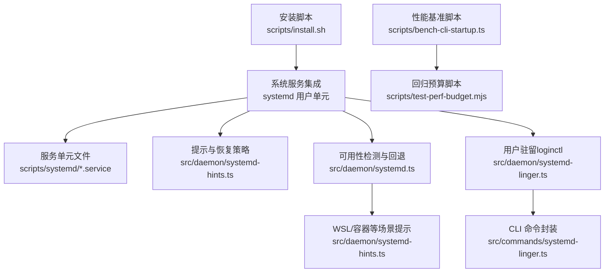
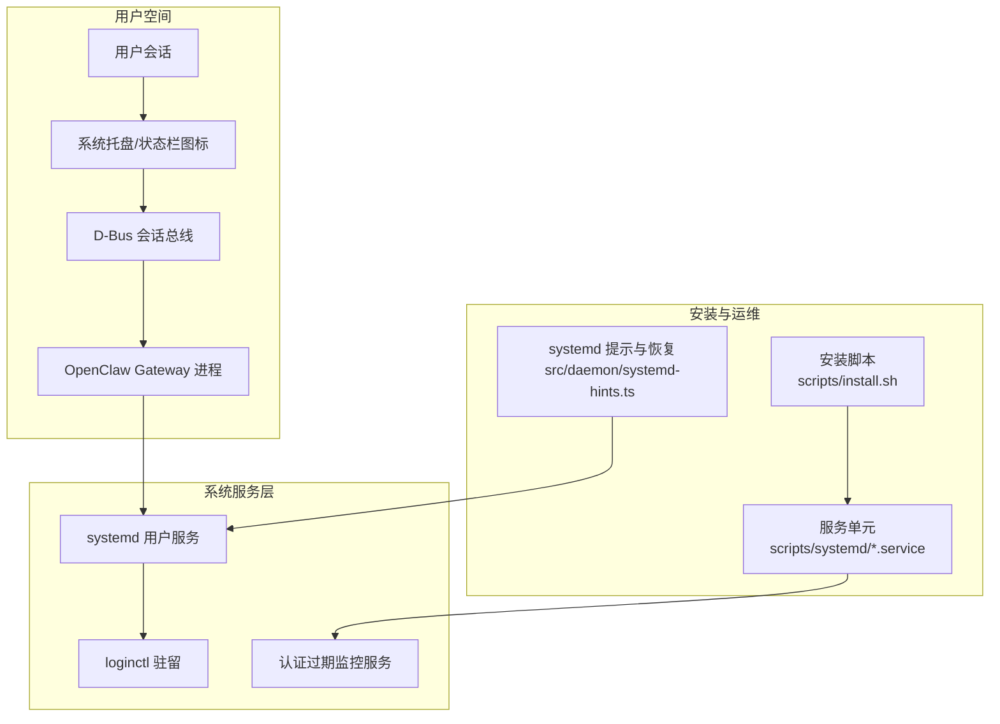
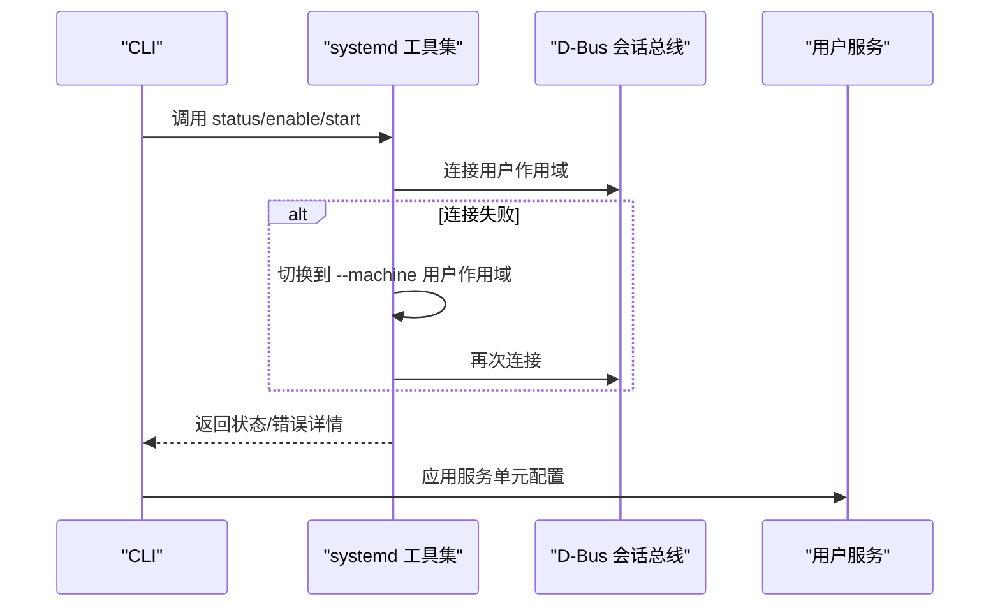
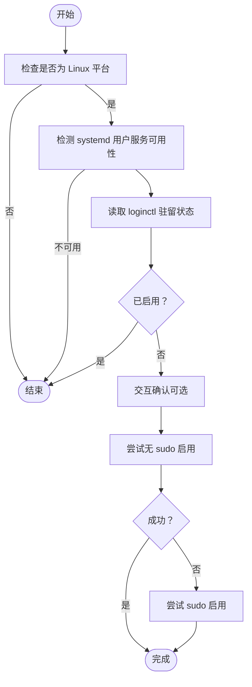
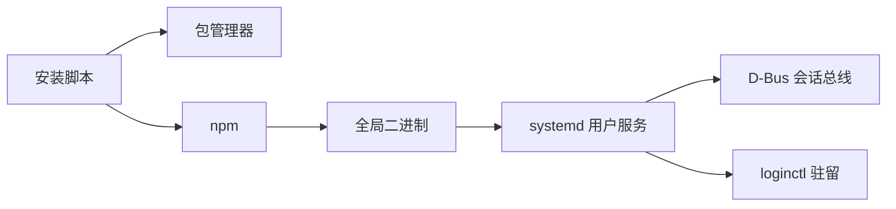

# Linux 应用

<cite>
**本文引用的文件**
- [docs/platforms/linux.md](file://docs/platforms/linux.md)
- [scripts/install.sh](file://scripts/install.sh)
- [src/daemon/systemd.ts](file://src/daemon/systemd.ts)
- [src/daemon/systemd-hints.ts](file://src/daemon/systemd-hints.ts)
- [src/daemon/systemd-linger.ts](file://src/daemon/systemd-linger.ts)
- [src/commands/systemd-linger.ts](file://src/commands/systemd-linger.ts)
- [scripts/systemd/openclaw-auth-monitor.service](file://scripts/systemd/openclaw-auth-monitor.service)
- [src/daemon/systemd.test.ts](file://src/daemon/systemd.test.ts)
- [scripts/bench-cli-startup.ts](file://scripts/bench-cli-startup.ts)
- [scripts/test-perf-budget.mjs](file://scripts/test-perf-budget.mjs)
</cite>

## 目录
1. [简介](#简介)
2. [项目结构](#项目结构)
3. [核心组件](#核心组件)
4. [架构总览](#架构总览)
5. [组件详解](#组件详解)
6. [依赖关系分析](#依赖关系分析)
7. [性能考量](#性能考量)
8. [故障排查指南](#故障排查指南)
9. [结论](#结论)
10. [附录](#附录)

## 简介
本文件面向在 Linux 上运行 OpenClaw 的开发者与运维人员，系统性阐述 Linux 桌面应用的架构设计、系统集成与用户界面实现要点；重点覆盖以下主题：
- Linux 特有的窗口管理、系统托盘、D-Bus 通信与桌面环境适配
- 包管理、系统服务集成与权限提升机制
- 开发环境配置、GTK/Wayland 支持、X11 兼容性与多发行版适配
- 性能监控、内存管理与跨发行版测试指南

说明：当前仓库未包含 Linux 桌面应用的 UI 实现源码（如 GTK/Wayland/X11 集成），本文基于现有系统服务与安装脚本能力进行架构与流程层面的说明，并提供可操作的集成建议。

## 项目结构
围绕 Linux 平台的关键目录与文件如下：
- 文档与平台说明：docs/platforms/linux.md
- 安装与包管理：scripts/install.sh
- systemd 用户服务与提示：src/daemon/systemd.ts、src/daemon/systemd-hints.ts、scripts/systemd/openclaw-auth-monitor.service
- 用户驻留（lingering）与 CLI 命令：src/daemon/systemd-linger.ts、src/commands/systemd-linger.ts
- 测试与性能基准：src/daemon/systemd.test.ts、scripts/bench-cli-startup.ts、scripts/test-perf-budget.mjs

图示来源
- [scripts/install.sh:569-621](file://scripts/install.sh#L569-L621)
- [src/daemon/systemd.ts:420-450](file://src/daemon/systemd.ts#L420-L450)
- [src/daemon/systemd-hints.ts:1-29](file://src/daemon/systemd-hints.ts#L1-L29)
- [src/daemon/systemd-linger.ts:46-73](file://src/daemon/systemd-linger.ts#L46-L73)
- [src/commands/systemd-linger.ts:92-121](file://src/commands/systemd-linger.ts#L92-L121)
- [scripts/systemd/openclaw-auth-monitor.service:1-15](file://scripts/systemd/openclaw-auth-monitor.service#L1-L15)
- [scripts/bench-cli-startup.ts:59-111](file://scripts/bench-cli-startup.ts#L59-L111)
- [scripts/test-perf-budget.mjs:98-127](file://scripts/test-perf-budget.mjs#L98-L127)

章节来源
- [docs/platforms/linux.md:1-95](file://docs/platforms/linux.md#L1-L95)
- [scripts/install.sh:569-621](file://scripts/install.sh#L569-L621)

## 核心组件
- 系统服务集成（systemd 用户单元）
  - 默认安装 systemd 用户服务，支持开机自启、自动重启与端口配置
  - 提供可用性检测、错误归因与 WSL/容器场景提示
- 用户驻留（Lingering）
  - 通过 loginctl enable-linger 保持用户会话退出后服务仍可运行
  - 提供交互式与非交互式两种启用方式
- 安装与包管理
  - 统一的安装脚本，自动识别发行版并安装构建工具
  - 支持 npm 全局安装与失败诊断
- 性能与测试
  - CLI 启动时间基准与回归预算脚本，便于跨版本对比

章节来源
- [docs/platforms/linux.md:65-95](file://docs/platforms/linux.md#L65-L95)
- [src/daemon/systemd.ts:420-450](file://src/daemon/systemd.ts#L420-L450)
- [src/daemon/systemd-hints.ts:17-29](file://src/daemon/systemd-hints.ts#L17-L29)
- [src/daemon/systemd-linger.ts:46-73](file://src/daemon/systemd-linger.ts#L46-L73)
- [src/commands/systemd-linger.ts:92-121](file://src/commands/systemd-linger.ts#L92-L121)
- [scripts/install.sh:569-621](file://scripts/install.sh#L569-L621)
- [scripts/bench-cli-startup.ts:59-111](file://scripts/bench-cli-startup.ts#L59-L111)
- [scripts/test-perf-budget.mjs:98-127](file://scripts/test-perf-budget.mjs#L98-L127)

## 架构总览
下图展示 Linux 平台上的系统服务与安装流程的整体关系：

图示来源
- [scripts/install.sh:569-621](file://scripts/install.sh#L569-L621)
- [src/daemon/systemd-hints.ts:17-29](file://src/daemon/systemd-hints.ts#L17-L29)
- [scripts/systemd/openclaw-auth-monitor.service:1-15](file://scripts/systemd/openclaw-auth-monitor.service#L1-L15)

## 组件详解

### systemd 用户服务集成
- 默认安装用户服务，支持自定义 ExecStart、重启策略与目标
- 可用性检测：优先直接调用 --user 子命令，若失败则尝试 --machine 用户作用域
- 错误归类：对缺失 systemctl、连接会话总线失败、未使用 systemd 等场景给出明确提示
- WSL/容器提示：针对 WSL2 与容器环境提供修复步骤

图示来源
- [src/daemon/systemd.ts:388-418](file://src/daemon/systemd.ts#L388-L418)
- [src/daemon/systemd.ts:434-450](file://src/daemon/systemd.ts#L434-L450)
- [src/daemon/systemd-hints.ts:17-29](file://src/daemon/systemd-hints.ts#L17-L29)

章节来源
- [docs/platforms/linux.md:65-95](file://docs/platforms/linux.md#L65-L95)
- [src/daemon/systemd.ts:420-450](file://src/daemon/systemd.ts#L420-L450)
- [src/daemon/systemd.test.ts:311-343](file://src/daemon/systemd.test.ts#L311-L343)

### 用户驻留（Lingering）
- 作用：允许用户会话注销或空闲后，systemd 用户服务仍可继续运行
- 机制：通过 loginctl enable-linger 写入 /var/lib/systemd/linger
- CLI 封装：提供交互式与非交互式两种启用方式，必要时以 sudo 执行

图示来源
- [src/commands/systemd-linger.ts:14-90](file://src/commands/systemd-linger.ts#L14-L90)
- [src/daemon/systemd-linger.ts:46-73](file://src/daemon/systemd-linger.ts#L46-L73)

章节来源
- [src/commands/systemd-linger.ts:92-121](file://src/commands/systemd-linger.ts#L92-L121)
- [src/daemon/systemd-linger.ts:46-73](file://src/daemon/systemd-linger.ts#L46-L73)

### 安装与包管理（Linux）
- 自动识别发行版并安装构建工具（apt/pacman/dnf/yum/apk）
- npm 全局安装失败时输出诊断信息与重试逻辑
- 支持非交互模式与详细日志输出

章节来源
- [scripts/install.sh:569-621](file://scripts/install.sh#L569-L621)
- [scripts/install.sh:785-800](file://scripts/install.sh#L785-L800)

### 认证过期监控服务（systemd）
- 单次执行型服务，用于在认证过期前发出告警
- 可通过环境变量配置告警阈值与通知通道

章节来源
- [scripts/systemd/openclaw-auth-monitor.service:1-15](file://scripts/systemd/openclaw-auth-monitor.service#L1-L15)

### 性能监控与基准
- CLI 启动时间基准：统计多次启动的均值、中位数、分位数与最大/最小值
- 回归预算：基于基线与允许波动范围判断是否超限

章节来源
- [scripts/bench-cli-startup.ts:59-111](file://scripts/bench-cli-startup.ts#L59-L111)
- [scripts/test-perf-budget.mjs:98-127](file://scripts/test-perf-budget.mjs#L98-L127)

## 依赖关系分析
- 安装脚本依赖发行版包管理器与网络下载器
- systemd 集成依赖 D-Bus 会话总线与 loginctl
- 驻留功能依赖系统级 /var/lib/systemd/linger 文件写入权限

图示来源
- [scripts/install.sh:569-621](file://scripts/install.sh#L569-L621)
- [src/daemon/systemd.ts:420-450](file://src/daemon/systemd.ts#L420-L450)
- [src/daemon/systemd-linger.ts:46-73](file://src/daemon/systemd-linger.ts#L46-L73)

章节来源
- [scripts/install.sh:569-621](file://scripts/install.sh#L569-L621)
- [src/daemon/systemd.ts:420-450](file://src/daemon/systemd.ts#L420-L450)
- [src/daemon/systemd-linger.ts:46-73](file://src/daemon/systemd-linger.ts#L46-L73)

## 性能考量
- 启动性能：使用基准脚本定期采集启动耗时，结合回归预算避免性能倒退
- 内存管理：建议在服务单元中设置 MemoryAccounting、MemoryMax 等参数（需根据实际需求调整）
- 跨发行版测试：在 Debian/Ubuntu、Fedora、Arch 等主流发行版上验证安装与服务行为一致性

章节来源
- [scripts/bench-cli-startup.ts:59-111](file://scripts/bench-cli-startup.ts#L59-L111)
- [scripts/test-perf-budget.mjs:98-127](file://scripts/test-perf-budget.mjs#L98-L127)

## 故障排查指南
- systemd 用户服务不可用
  - 现象：提示 systemctl 不可用或无法连接会话总线
  - 处理：参考提示信息启用 systemd 或在 supervisor 下运行；WSL2 需在 /etc/wsl.conf 中开启 systemd
- 服务未启用或未找到
  - 现象：is-enabled 返回 not-found 或 disabled/static
  - 处理：检查单元文件路径与权限，确认已启用并处于活动状态
- 登录态变化导致服务停止
  - 现象：注销或空闲后服务退出
  - 处理：启用 loginctl 驻留；非交互场景可使用非交互式启用
- 安装失败
  - 现象：npm 安装失败且缺少构建工具
  - 处理：按安装脚本提示自动安装构建工具后重试

章节来源
- [src/daemon/systemd-hints.ts:17-29](file://src/daemon/systemd-hints.ts#L17-L29)
- [src/daemon/systemd.ts:268-309](file://src/daemon/systemd.ts#L268-L309)
- [src/daemon/systemd.test.ts:311-343](file://src/daemon/systemd.test.ts#L311-L343)
- [src/commands/systemd-linger.ts:92-121](file://src/commands/systemd-linger.ts#L92-L121)
- [scripts/install.sh:785-800](file://scripts/install.sh#L785-L800)

## 结论
OpenClaw 在 Linux 平台通过 systemd 用户服务与 loginctl 驻留实现了可靠的后台运行能力，并提供了完善的安装、诊断与性能监控工具链。对于桌面 UI 层（窗口管理、系统托盘、D-Bus 通信与桌面环境适配），当前仓库未包含具体实现源码，建议在遵循上述系统集成规范的基础上，结合 GTK/Wayland/X11 技术栈进行扩展开发。

## 附录
- 快速开始（VPS）：安装 Node、全局安装 openclaw、启用守护进程并通过 SSH 端口转发访问
- 推荐实践：在 systemd 用户服务中配置 RestartSec、MemoryMax 等参数；使用登录态驻留确保服务持续运行；定期运行性能基准脚本

章节来源
- [docs/platforms/linux.md:16-25](file://docs/platforms/linux.md#L16-L25)