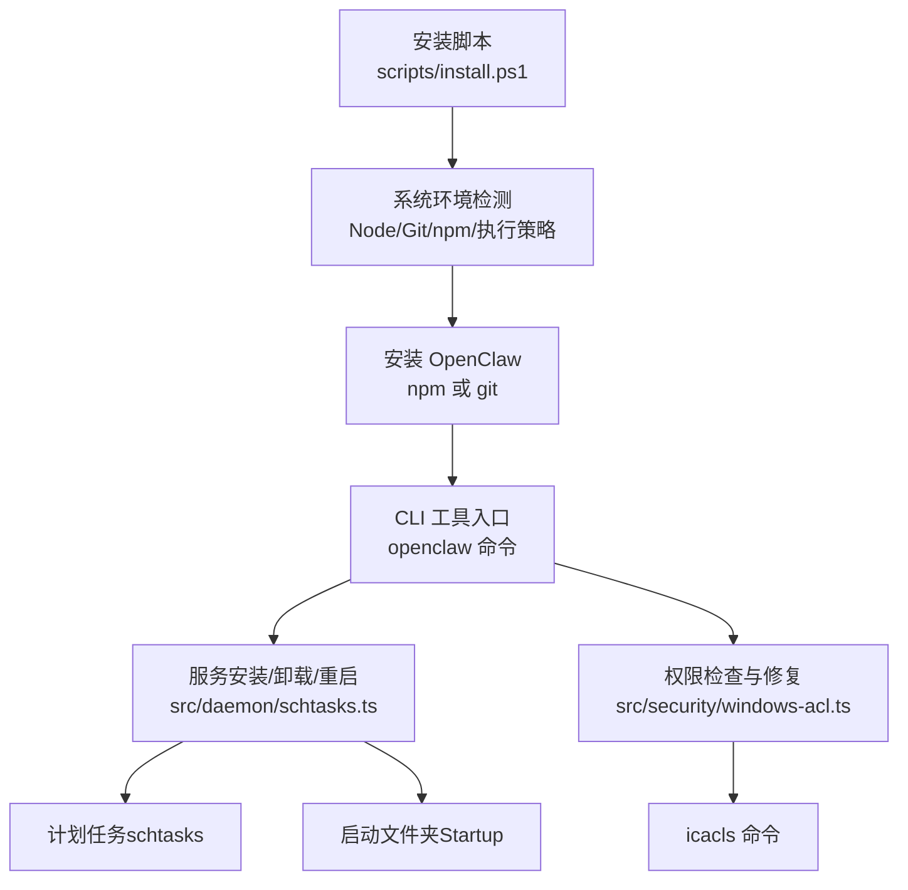
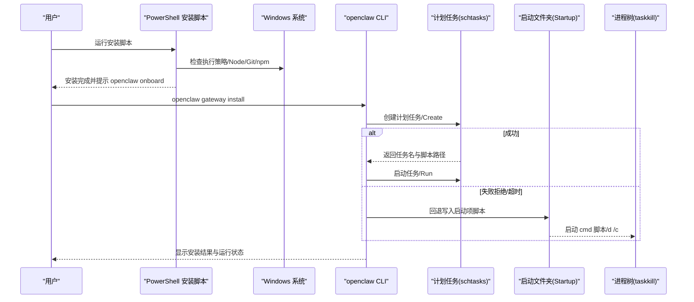
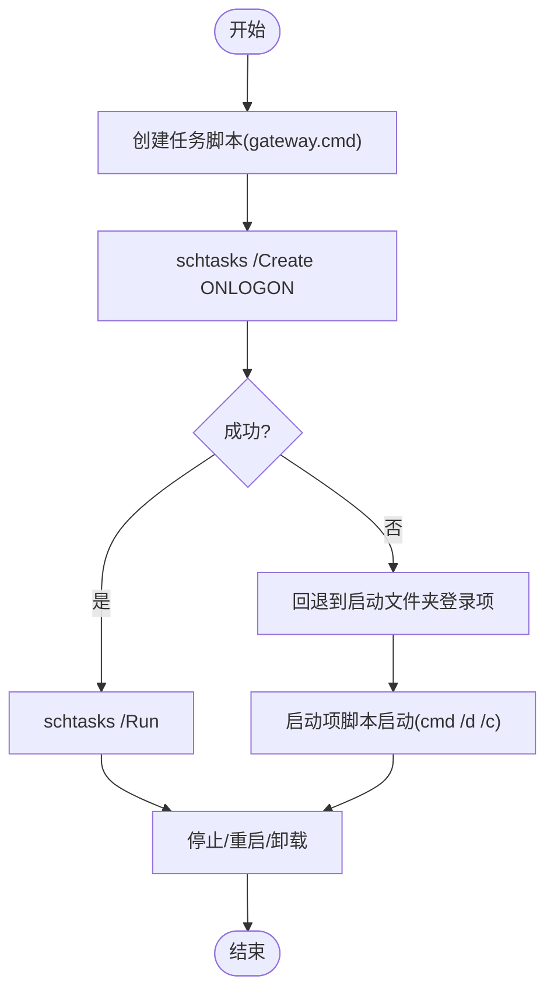
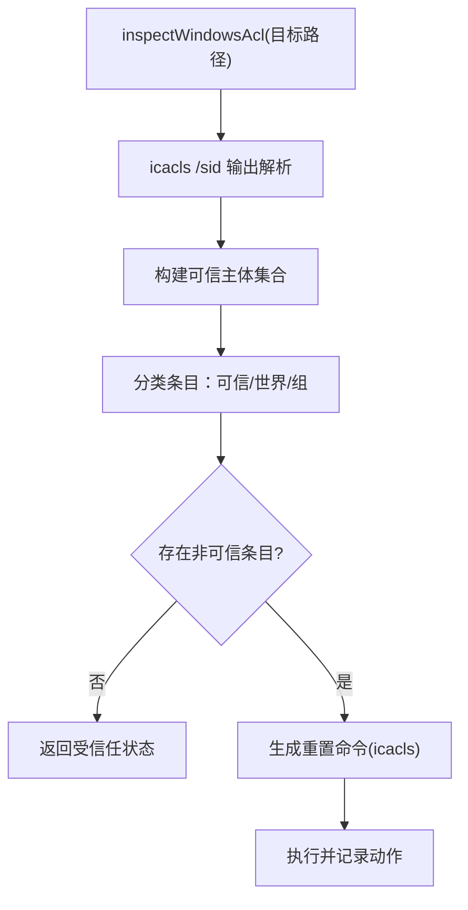
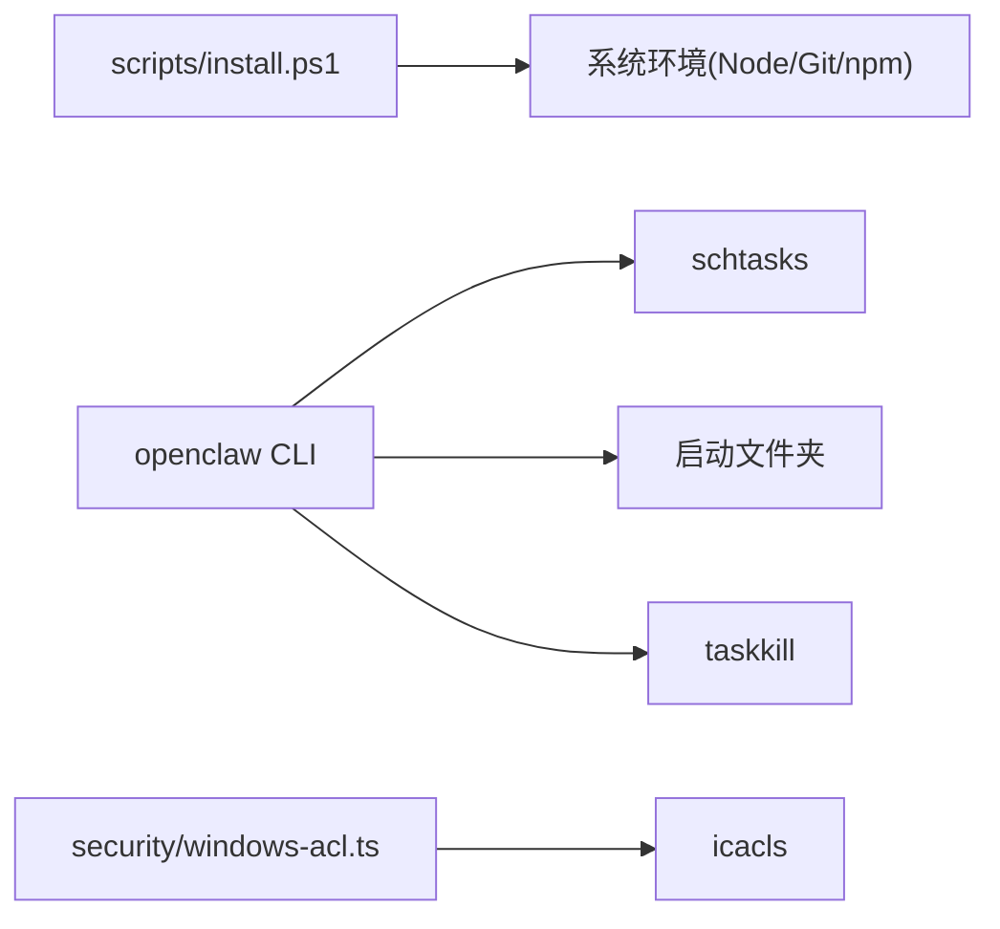

# Windows 应用

<cite>
**本文引用的文件**
- [scripts/install.ps1](file://scripts/install.ps1)
- [src/daemon/schtasks.ts](file://src/daemon/schtasks.ts)
- [src/daemon/constants.ts](file://src/daemon/constants.ts)
- [src/commands/daemon-install-helpers.ts](file://src/commands/daemon-install-helpers.ts)
- [src/security/windows-acl.ts](file://src/security/windows-acl.ts)
- [src/security/fix.ts](file://src/security/fix.ts)
- [docs/zh-CN/platforms/windows.md](file://docs/zh-CN/platforms/windows.md)
</cite>

## 目录
1. [简介](#简介)
2. [项目结构](#项目结构)
3. [核心组件](#核心组件)
4. [架构总览](#架构总览)
5. [详细组件分析](#详细组件分析)
6. [依赖关系分析](#依赖关系分析)
7. [性能考量](#性能考量)
8. [故障排查指南](#故障排查指南)
9. [结论](#结论)
10. [附录](#附录)

## 简介
本文件面向 OpenClaw 的 Windows 桌面应用技术文档，聚焦于 Windows 平台下的配套应用能力现状、系统集成方式与用户界面设计思路，并结合仓库中已实现的 Windows 相关模块，系统阐述以下主题：
- Windows 特有的权限处理与安全策略（基于 ACL 与 icacls 的审计与重置）
- 服务管理与启动项配置（基于计划任务与“启动”文件夹的双轨回退）
- 注册表与系统 API 调用（通过命令行工具与进程管理实现）
- 安装卸载流程、启动项配置与更新机制（PowerShell 安装脚本与 CLI 工具）
- 开发环境搭建、WPF/XAML 界面开发、Win32 API 使用与 UWP/WinUI 技术栈建议
- 性能优化、安全考虑与兼容性测试指南

说明：根据仓库文档，目前尚未提供原生 Windows 配套应用，本文在“概念性概述”部分给出技术路线与最佳实践，帮助后续开发者快速落地。

## 项目结构
围绕 Windows 支持，仓库中与之直接相关的关键文件与职责如下：
- 安装脚本：PowerShell 安装器负责检测执行策略、Node/Git/npm 环境、自动安装与路径注入等
- 服务管理：基于计划任务（schtasks）与“启动”文件夹的双轨安装/停止/重启/查询
- 权限与安全：基于 Windows ACL 的审计与重置命令生成，确保最小权限与可信主体
- 常量与提示：服务名称、描述格式化、错误提示与回退策略

**图表来源**
- [scripts/install.ps1:300-360](file://scripts/install.ps1#L300-L360)
- [src/daemon/schtasks.ts:550-623](file://src/daemon/schtasks.ts#L550-L623)
- [src/security/windows-acl.ts:280-319](file://src/security/windows-acl.ts#L280-L319)

**章节来源**
- [scripts/install.ps1:1-360](file://scripts/install.ps1#L1-L360)
- [src/daemon/schtasks.ts:1-781](file://src/daemon/schtasks.ts#L1-L781)
- [src/security/windows-acl.ts:1-364](file://src/security/windows-acl.ts#L1-L364)

## 核心组件
- 安装与环境准备（PowerShell）
  - 执行策略检测与临时放宽、Node/Git/npm 检测与自动安装、PATH 注入、包装器创建
- 服务安装与控制（Windows）
  - 计划任务安装（失败时回退至“启动”文件夹登录项）、停止/重启/卸载、运行状态查询
- 权限与安全（Windows）
  - ACL 审计（icacls 输出解析）、可信主体识别、世界可写/组可写条目分类、重置命令生成
- 常量与提示（Windows）
  - 服务名称、描述格式化、错误提示与回退策略

**章节来源**
- [scripts/install.ps1:50-80](file://scripts/install.ps1#L50-L80)
- [src/daemon/schtasks.ts:36-43](file://src/daemon/schtasks.ts#L36-L43)
- [src/security/windows-acl.ts:100-148](file://src/security/windows-acl.ts#L100-L148)
- [src/commands/daemon-install-helpers.ts:106-110](file://src/commands/daemon-install-helpers.ts#L106-L110)

## 架构总览
下图展示 Windows 安装与服务管理的整体流程，包括安装脚本、CLI 工具与系统服务之间的交互：

**图表来源**
- [scripts/install.ps1:300-360](file://scripts/install.ps1#L300-L360)
- [src/daemon/schtasks.ts:550-623](file://src/daemon/schtasks.ts#L550-L623)
- [src/daemon/schtasks.ts:266-275](file://src/daemon/schtasks.ts#L266-L275)

## 详细组件分析

### 安装脚本（PowerShell）
- 功能要点
  - 执行策略检测与临时放宽（Process Scope）
  - 自动安装 Node.js（winget/choco/scoop 优先级）与 Git
  - npm 安装或 git clone/pnpm 安装并构建
  - 将 npm 全局 bin 目录加入用户 PATH
  - 创建 openclaw.cmd 包装器（用于 .cmd 解析链）
- 关键行为
  - 严格错误处理与用户提示
  - DryRun 模式支持
  - 安装完成后提示 openclaw onboard

**章节来源**
- [scripts/install.ps1:42-80](file://scripts/install.ps1#L42-L80)
- [scripts/install.ps1:102-162](file://scripts/install.ps1#L102-L162)
- [scripts/install.ps1:202-260](file://scripts/install.ps1#L202-L260)
- [scripts/install.ps1:300-360](file://scripts/install.ps1#L300-L360)

### 服务安装与控制（Windows）
- 计划任务安装
  - 生成任务脚本（gateway.cmd），写入状态目录
  - 使用 schtasks 创建 ONLOGON 任务，限制为 LIMITED 权限
  - 用户上下文存在时指定 /RU /NP /IT，否则回退无凭据模式
  - 失败条件：拒绝访问、超时、无输出 → 回退到“启动”文件夹登录项
- 启动项回退
  - 生成启动项脚本（.cmd），调用 cmd /d /c 执行任务脚本
  - 启动时以 /min 隐藏窗口并脱离父进程
- 停止/重启/卸载
  - 停止：结束任务、终止监听进程、等待端口释放、清理启动项脚本
  - 重启：先停止再运行 schtasks /Run，或回退到启动项脚本
  - 卸载：删除计划任务、启动项脚本与任务脚本
- 运行状态查询
  - 解析 schtasks 查询输出，推导运行状态
  - 若 schtasks 不可用且存在启动项，则通过端口占用与监听进程判断运行状态

**图表来源**
- [src/daemon/schtasks.ts:550-623](file://src/daemon/schtasks.ts#L550-L623)
- [src/daemon/schtasks.ts:266-275](file://src/daemon/schtasks.ts#L266-L275)
- [src/daemon/schtasks.ts:625-649](file://src/daemon/schtasks.ts#L625-L649)
- [src/daemon/schtasks.ts:743-780](file://src/daemon/schtasks.ts#L743-L780)

**章节来源**
- [src/daemon/schtasks.ts:36-43](file://src/daemon/schtasks.ts#L36-L43)
- [src/daemon/schtasks.ts:550-623](file://src/daemon/schtasks.ts#L550-L623)
- [src/daemon/schtasks.ts:625-649](file://src/daemon/schtasks.ts#L625-L649)
- [src/daemon/schtasks.ts:743-780](file://src/daemon/schtasks.ts#L743-L780)

### 权限与安全（Windows）
- ACL 审计
  - 调用 icacls /sid 获取安全标识符（SID）输出，解析 ACE 条目
  - 分类可信主体（系统/管理员/当前用户/SID）、世界可写/组可写条目
- 重置命令生成
  - 生成带继承禁用与授予的 icacls 命令，针对文件/目录分别设置不同标志位
  - 支持从环境变量解析当前用户名与域，回退到 os.userInfo
- 安全修复流程
  - 针对状态目录与配置路径进行 ACL 检查与重置，记录变更与错误

**图表来源**
- [src/security/windows-acl.ts:280-319](file://src/security/windows-acl.ts#L280-L319)
- [src/security/windows-acl.ts:332-363](file://src/security/windows-acl.ts#L332-L363)
- [src/security/fix.ts:1-41](file://src/security/fix.ts#L1-L41)

**章节来源**
- [src/security/windows-acl.ts:100-148](file://src/security/windows-acl.ts#L100-L148)
- [src/security/windows-acl.ts:332-363](file://src/security/windows-acl.ts#L332-L363)
- [src/security/fix.ts:1-41](file://src/security/fix.ts#L1-L41)

### 常量与提示（Windows）
- 服务名称与脚本命名
  - Windows 计划任务名称、Node 任务脚本名等常量定义
- 描述格式化
  - 服务描述包含 profile/version 等信息
- 错误提示与回退
  - 安装失败时提示回退到“启动”文件夹登录项，并建议以提升权限运行

**章节来源**
- [src/daemon/constants.ts:1-114](file://src/daemon/constants.ts#L1-L114)
- [src/commands/daemon-install-helpers.ts:106-110](file://src/commands/daemon-install-helpers.ts#L106-L110)

## 依赖关系分析
- 安装脚本依赖系统工具（PowerShell 执行策略、winget/choco/scoop、Node/Git/npm）
- 服务管理依赖 Windows 系统服务（schtasks）与进程管理（taskkill）
- 权限审计依赖 Windows 文件系统 ACL（icacls）

**图表来源**
- [scripts/install.ps1:102-162](file://scripts/install.ps1#L102-L162)
- [src/daemon/schtasks.ts:434-458](file://src/daemon/schtasks.ts#L434-L458)
- [src/security/windows-acl.ts:280-319](file://src/security/windows-acl.ts#L280-L319)

**章节来源**
- [scripts/install.ps1:102-162](file://scripts/install.ps1#L102-L162)
- [src/daemon/schtasks.ts:434-458](file://src/daemon/schtasks.ts#L434-L458)
- [src/security/windows-acl.ts:280-319](file://src/security/windows-acl.ts#L280-L319)

## 性能考量
- 启动项隐藏与脱钩
  - 启动项脚本使用 cmd /d /c 并以 /min 隐藏窗口，避免前台干扰
  - 子进程以 detached 模式启动，避免阻塞父进程
- 端口占用与进程终止
  - 停止/重启前尝试优雅终止进程树，若失败则强制终止并等待端口释放
- 任务状态解析
  - 通过 schtasks 输出解析与端口占用诊断，减少无效轮询

**章节来源**
- [src/daemon/schtasks.ts:266-275](file://src/daemon/schtasks.ts#L266-L275)
- [src/daemon/schtasks.ts:434-458](file://src/daemon/schtasks.ts#L434-L458)
- [src/daemon/schtasks.ts:743-780](file://src/daemon/schtasks.ts#L743-L780)

## 故障排查指南
- 安装失败（PowerShell 执行策略受限）
  - 临时放宽执行策略或以管理员身份运行
  - 确保 Node/Git/npm 可用，必要时手动安装
- 计划任务安装失败
  - schtasks 返回“拒绝访问/超时/无输出”时，自动回退到“启动”文件夹登录项
  - 建议以提升权限的 PowerShell 运行安装命令
- 服务无法停止/重启
  - 检查端口占用与监听进程，必要时强制终止并等待端口释放
- 权限问题
  - 使用 ACL 审计定位世界可写/组可写条目，生成并执行重置命令

**章节来源**
- [scripts/install.ps1:56-80](file://scripts/install.ps1#L56-L80)
- [src/daemon/schtasks.ts:36-43](file://src/daemon/schtasks.ts#L36-L43)
- [src/daemon/schtasks.ts:656-692](file://src/daemon/schtasks.ts#L656-L692)
- [src/security/windows-acl.ts:280-319](file://src/security/windows-acl.ts#L280-L319)

## 结论
- 当前仓库未提供原生 Windows 配套应用，但已具备完善的 Windows 平台安装、服务管理与安全策略实现
- 安装脚本覆盖主流包管理器与环境准备流程；服务管理通过计划任务与启动项回退保障可用性
- 权限审计与重置命令生成为安全合规提供基础能力
- 后续可在现有基础上扩展 WPF/XAML 界面与 WinUI/UWP 技术栈，以实现桌面应用的图形化体验与系统深度集成

## 附录

### 开发环境搭建（Windows）
- 必备工具
  - PowerShell（执行策略允许脚本）
  - Node.js 22+、Git、pnpm（可选）
- 安装方式
  - 使用 npm 全局安装或 git clone/pnpm 安装并构建
  - 安装脚本会自动处理依赖与 PATH 注入

**章节来源**
- [scripts/install.ps1:151-162](file://scripts/install.ps1#L151-L162)
- [scripts/install.ps1:202-260](file://scripts/install.ps1#L202-L260)

### WPF/XAML 界面开发与 Win32 API 使用
- 建议采用 WPF（XAML）作为桌面 UI 技术栈，结合 .NET（C#/VB.NET）与 Win32 API 实现系统集成
- 与现有 CLI 工具联动：通过进程启动与参数传递调用 openclaw 命令
- 注意权限与沙箱：遵循最小权限原则，必要时以提升权限运行关键操作

[本节为概念性内容，不直接分析具体文件]

### UWP/WinUI 技术栈建议
- UWP 适合现代 Windows Store 场景，WinUI 3 更适合传统桌面应用
- 与现有安装脚本配合，实现应用商店分发与自动更新

[本节为概念性内容，不直接分析具体文件]

### 安全与合规
- 使用 ACL 审计与重置命令，确保状态目录与配置文件仅对可信主体开放
- 安装与服务管理尽量避免全局范围修改，优先使用 per-user 路径与权限

**章节来源**
- [src/security/windows-acl.ts:280-319](file://src/security/windows-acl.ts#L280-L319)
- [src/security/fix.ts:1-41](file://src/security/fix.ts#L1-L41)

### 兼容性测试指南
- 测试场景
  - 不同 Windows 版本（家庭版/专业版/服务器版）下的执行策略与权限差异
  - 计划任务与启动项回退路径的稳定性
  - 端口占用与进程终止的健壮性
- 建议工具
  - Windows SDK 中的进程与网络诊断工具
  - PowerShell 测试框架（Pester）辅助自动化验证

[本节为通用指导，不直接分析具体文件]