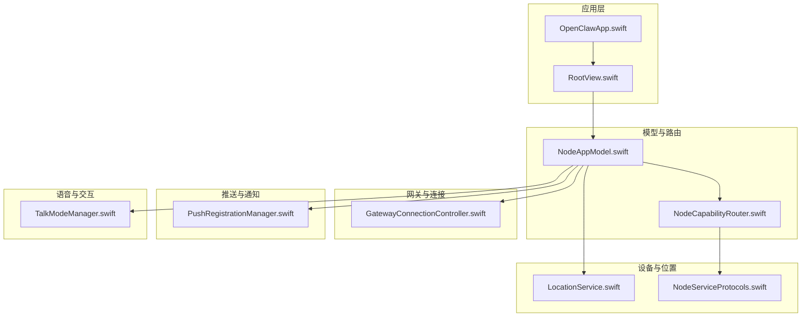
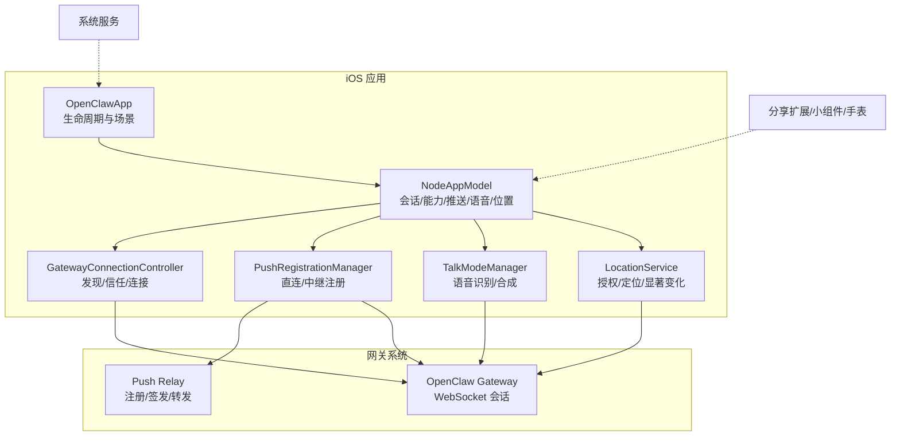
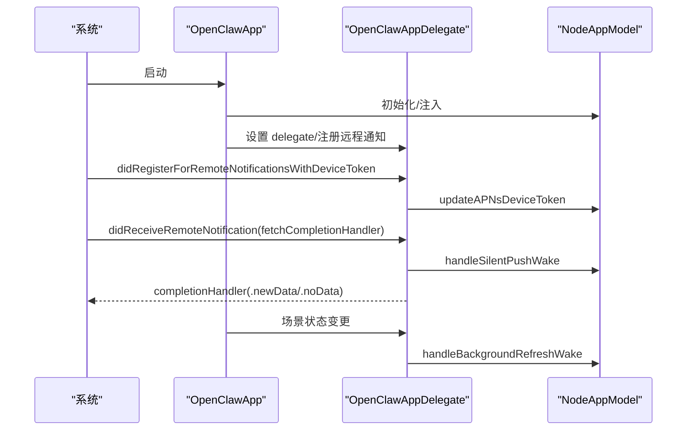
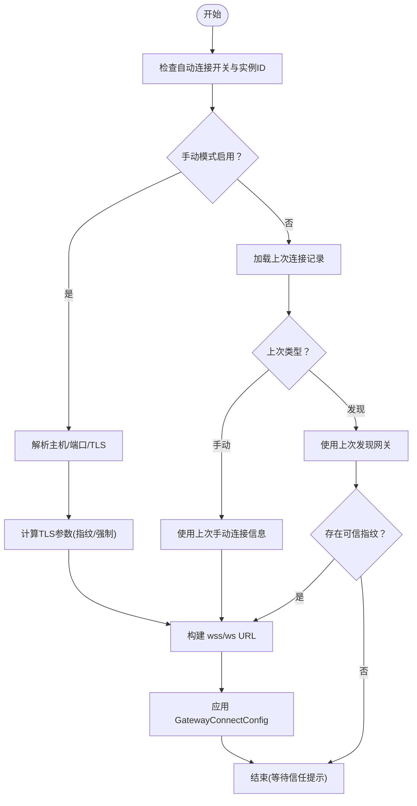
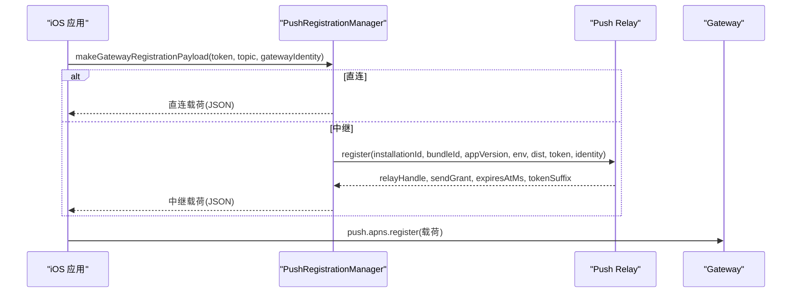
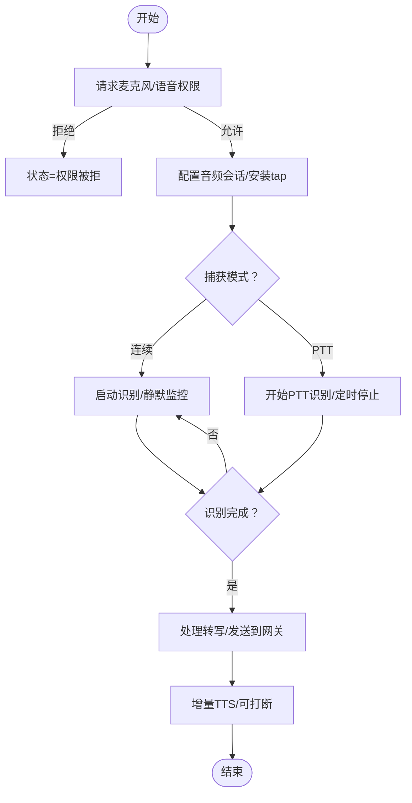
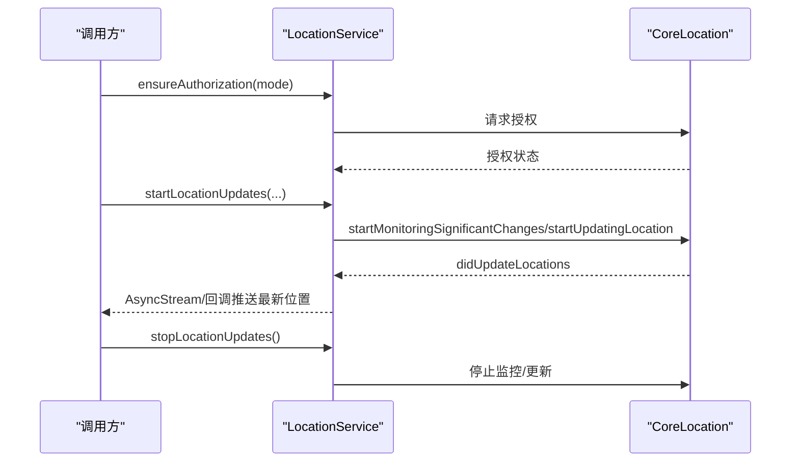
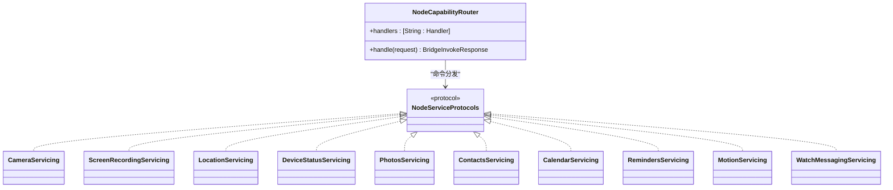
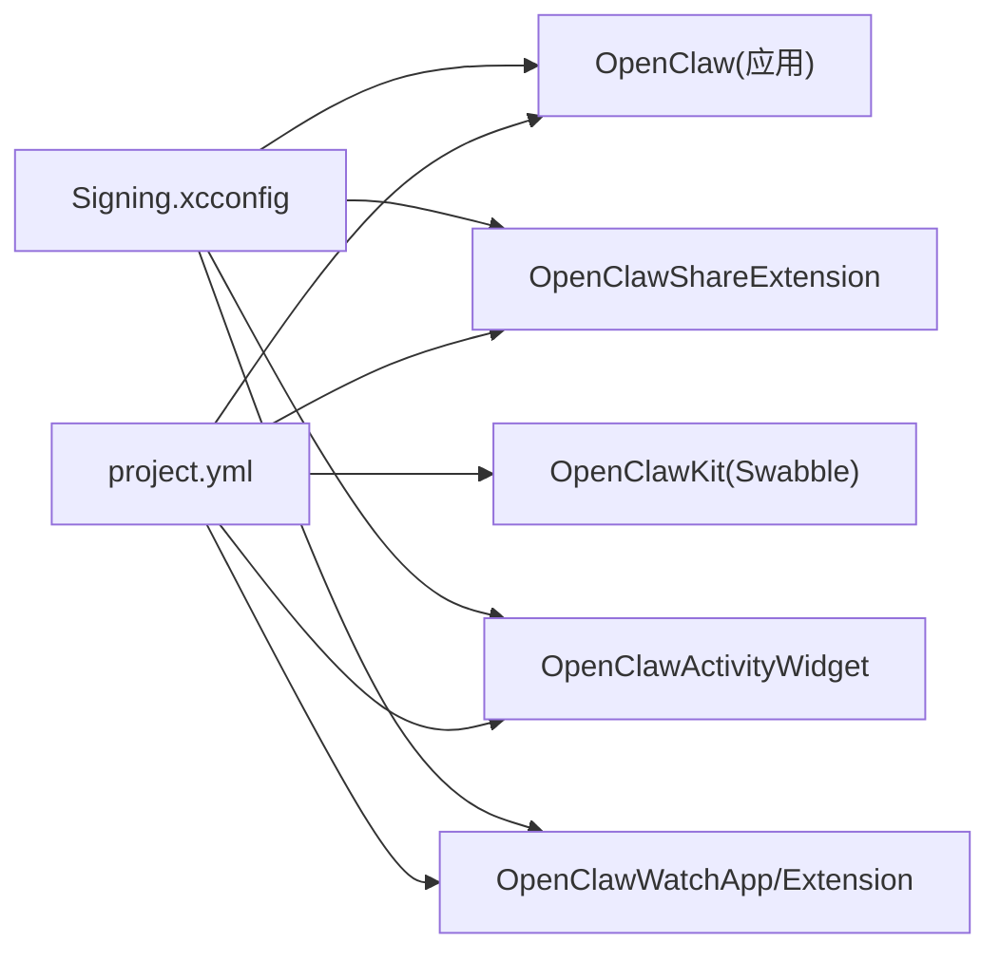

# iOS 应用

<cite>
**本文引用的文件**
- [apps/ios/README.md](file://apps/ios/README.md)
- [apps/ios/project.yml](file://apps/ios/project.yml)
- [apps/ios/Sources/OpenClawApp.swift](file://apps/ios/Sources/OpenClawApp.swift)
- [apps/ios/Sources/RootView.swift](file://apps/ios/Sources/RootView.swift)
- [apps/ios/Sources/Gateway/GatewayConnectionController.swift](file://apps/ios/Sources/Gateway/GatewayConnectionController.swift)
- [apps/ios/Sources/Push/PushRegistrationManager.swift](file://apps/ios/Sources/Push/PushRegistrationManager.swift)
- [apps/ios/Sources/Voice/TalkModeManager.swift](file://apps/ios/Sources/Voice/TalkModeManager.swift)
- [apps/ios/Sources/Model/NodeAppModel.swift](file://apps/ios/Sources/Model/NodeAppModel.swift)
- [apps/ios/Sources/Capabilities/NodeCapabilityRouter.swift](file://apps/ios/Sources/Capabilities/NodeCapabilityRouter.swift)
- [apps/ios/Sources/Location/LocationService.swift](file://apps/ios/Sources/Location/LocationService.swift)
- [apps/ios/Sources/Services/NodeServiceProtocols.swift](file://apps/ios/Sources/Services/NodeServiceProtocols.swift)
- [apps/ios/Config/Signing.xcconfig](file://apps/ios/Config/Signing.xcconfig)
</cite>

## 目录
1. [引言](#引言)
2. [项目结构](#项目结构)
3. [核心组件](#核心组件)
4. [架构总览](#架构总览)
5. [详细组件分析](#详细组件分析)
6. [依赖关系分析](#依赖关系分析)
7. [性能考量](#性能考量)
8. [故障排查指南](#故障排查指南)
9. [结论](#结论)
10. [附录](#附录)

## 引言
本文件面向 OpenClaw 的 iOS 应用，系统化梳理其功能架构、用户界面设计、系统集成与平台特性（权限、后台任务、推送通知、设备能力访问）、与网关系统的通信协议与数据同步策略、离线处理与重连机制，并覆盖 iOS 生态与 App Store 发布流程、性能优化与兼容性处理、开发环境配置与调试技巧。文档以“从代码到实践”的方式组织，既适合开发者深入理解实现细节，也便于非技术读者把握整体运作。

## 项目结构
iOS 应用位于 apps/ios 目录，采用 Swift 与 SwiftUI 构建，通过 xcodegen 基于 project.yml 管理工程配置；应用主体由 OpenClawApp.swift 驱动，根视图 RootView.swift 包裹主画布 RootCanvas；核心业务逻辑集中在 Sources/Model/NodeAppModel.swift 及各服务模块（如 Gateway、Push、Voice、Location 等）。

图表来源
- [apps/ios/Sources/OpenClawApp.swift:500-533](file://apps/ios/Sources/OpenClawApp.swift#L500-L533)
- [apps/ios/Sources/RootView.swift:1-8](file://apps/ios/Sources/RootView.swift#L1-L8)
- [apps/ios/Sources/Model/NodeAppModel.swift:56-200](file://apps/ios/Sources/Model/NodeAppModel.swift#L56-L200)
- [apps/ios/Sources/Capabilities/NodeCapabilityRouter.swift:4-26](file://apps/ios/Sources/Capabilities/NodeCapabilityRouter.swift#L4-L26)
- [apps/ios/Sources/Gateway/GatewayConnectionController.swift:20-80](file://apps/ios/Sources/Gateway/GatewayConnectionController.swift#L20-L80)
- [apps/ios/Sources/Push/PushRegistrationManager.swift:28-40](file://apps/ios/Sources/Push/PushRegistrationManager.swift#L28-L40)
- [apps/ios/Sources/Voice/TalkModeManager.swift:32-50](file://apps/ios/Sources/Voice/TalkModeManager.swift#L32-L50)
- [apps/ios/Sources/Location/LocationService.swift:5-25](file://apps/ios/Sources/Location/LocationService.swift#L5-L25)
- [apps/ios/Sources/Services/NodeServiceProtocols.swift:1-25](file://apps/ios/Sources/Services/NodeServiceProtocols.swift#L1-L25)

章节来源
- [apps/ios/project.yml:1-340](file://apps/ios/project.yml#L1-L340)
- [apps/ios/README.md:1-218](file://apps/ios/README.md#L1-L218)

## 核心组件
- 应用入口与生命周期：OpenClawApp.swift 负责初始化 NodeAppModel、GatewayConnectionController，设置场景状态监听与深链处理；OpenClawAppDelegate 实现 APNs 注册、静默唤醒、后台刷新任务调度与手表提示动作桥接。
- 模型与路由：NodeAppModel 统一协调节点与操作者会话、设备能力调用、推送注册、语音唤醒与对话、位置事件、手表消息等；NodeCapabilityRouter 将命令分发至具体处理器。
- 网关连接：GatewayConnectionController 负责发现、信任提示、TLS 指纹校验、自动重连与能力/命令/权限注册。
- 推送与通知：PushRegistrationManager 支持直连与中继两种传输模式，负责生成注册载荷、与中继服务交互并持久化状态；OpenClawApp.swift 中的 UNUserNotificationCenterDelegate 处理远程通知与本地通知分类。
- 语音交互：TalkModeManager 管理麦克风授权、连续/按压说话识别、静默检测、增量 TTS 流式播放、与网关会话交互。
- 设备与位置：LocationService 提供授权、一次性定位、显著位置变化监控与持续更新流；NodeServiceProtocols 定义各类服务协议与结果类型。

章节来源
- [apps/ios/Sources/OpenClawApp.swift:16-263](file://apps/ios/Sources/OpenClawApp.swift#L16-L263)
- [apps/ios/Sources/Model/NodeAppModel.swift:56-200](file://apps/ios/Sources/Model/NodeAppModel.swift#L56-L200)
- [apps/ios/Sources/Capabilities/NodeCapabilityRouter.swift:4-26](file://apps/ios/Sources/Capabilities/NodeCapabilityRouter.swift#L4-L26)
- [apps/ios/Sources/Gateway/GatewayConnectionController.swift:20-80](file://apps/ios/Sources/Gateway/GatewayConnectionController.swift#L20-L80)
- [apps/ios/Sources/Push/PushRegistrationManager.swift:28-40](file://apps/ios/Sources/Push/PushRegistrationManager.swift#L28-L40)
- [apps/ios/Sources/Voice/TalkModeManager.swift:32-50](file://apps/ios/Sources/Voice/TalkModeManager.swift#L32-L50)
- [apps/ios/Sources/Location/LocationService.swift:5-25](file://apps/ios/Sources/Location/LocationService.swift#L5-L25)
- [apps/ios/Sources/Services/NodeServiceProtocols.swift:1-25](file://apps/ios/Sources/Services/NodeServiceProtocols.swift#L1-L25)

## 架构总览
下图展示 iOS 应用与网关、推送中继、系统服务之间的交互路径与职责边界。

图表来源
- [apps/ios/Sources/OpenClawApp.swift:500-533](file://apps/ios/Sources/OpenClawApp.swift#L500-L533)
- [apps/ios/Sources/Model/NodeAppModel.swift:105-152](file://apps/ios/Sources/Model/NodeAppModel.swift#L105-L152)
- [apps/ios/Sources/Gateway/GatewayConnectionController.swift:90-158](file://apps/ios/Sources/Gateway/GatewayConnectionController.swift#L90-L158)
- [apps/ios/Sources/Push/PushRegistrationManager.swift:41-62](file://apps/ios/Sources/Push/PushRegistrationManager.swift#L41-L62)
- [apps/ios/Sources/Voice/TalkModeManager.swift:166-208](file://apps/ios/Sources/Voice/TalkModeManager.swift#L166-L208)
- [apps/ios/Sources/Location/LocationService.swift:56-72](file://apps/ios/Sources/Location/LocationService.swift#L56-L72)

## 详细组件分析

### 应用入口与生命周期（OpenClawApp）
- 初始化：安装未捕获异常记录器、引导网关设置存储、创建 NodeAppModel 与 GatewayConnectionController，并在窗口组中注入环境。
- 场景状态：监听 scenePhase 变化，联动 GatewayConnectionController 与 AppDelegate 的后台唤醒调度。
- 深链：统一处理 onOpenURL，交由 NodeAppModel 处理。
- 通知代理：实现 UNUserNotificationCenterDelegate，处理远程静默通知唤醒与本地通知分类动作（含手表提示镜像）。

图表来源
- [apps/ios/Sources/OpenClawApp.swift:50-156](file://apps/ios/Sources/OpenClawApp.swift#L50-L156)

章节来源
- [apps/ios/Sources/OpenClawApp.swift:16-263](file://apps/ios/Sources/OpenClawApp.swift#L16-L263)
- [apps/ios/Sources/RootView.swift:1-8](file://apps/ios/Sources/RootView.swift#L1-L8)

### 网关连接与自动重连（GatewayConnectionController）
- 发现与信任：基于 Bonjour/服务解析获取主机端口，必要时探测 TLS 指纹并通过 TrustPrompt 展示给用户确认。
- 自动连接：依据用户偏好与上次连接记录，优先可信已存指纹的网关；支持手动/自动模式切换与首选稳定 ID。
- 能力注册：根据当前设备能力、命令与权限动态构建 GatewayConnectOptions 并应用到活动连接。
- 重连策略：在场景激活或网络恢复后尝试自动重连，避免重复启动连接循环。

图表来源
- [apps/ios/Sources/Gateway/GatewayConnectionController.swift:315-439](file://apps/ios/Sources/Gateway/GatewayConnectionController.swift#L315-L439)

章节来源
- [apps/ios/Sources/Gateway/GatewayConnectionController.swift:20-800](file://apps/ios/Sources/Gateway/GatewayConnectionController.swift#L20-L800)

### 推送注册与中继信任模型（PushRegistrationManager）
- 传输模式：
  - 直连：直接向网关发送 APNs token、topic、环境。
  - 中继：向官方中继注册，换取中继句柄与发送授权，随后向网关发布该注册信息。
- 中继信任：要求正式版分发与生产环境 APNs；注册信息包含网关身份、安装标识、令牌哈希与过期时间；支持复用有效注册并按需刷新。
- 错误处理：缺失网关身份、分发/环境不匹配、缺少基础信息时抛出错误。

图表来源
- [apps/ios/Sources/Push/PushRegistrationManager.swift:41-142](file://apps/ios/Sources/Push/PushRegistrationManager.swift#L41-L142)

章节来源
- [apps/ios/Sources/Push/PushRegistrationManager.swift:28-170](file://apps/ios/Sources/Push/PushRegistrationManager.swift#L28-L170)

### 语音交互与 TTS（TalkModeManager）
- 权限与会话：请求麦克风与语音识别权限，配置音频会话，建立 AVAudioEngine 输入 tap，启动 SFSpeechRecognizer 识别任务。
- 捕获模式：连续识别与按压说话（PTT），支持静默超时自动停止、错误恢复与自动重启。
- 输出与中断：支持增量 TTS 流式播放，可按需打断；与语音唤醒互斥，避免资源竞争。
- 生命周期：后台暂停/恢复时正确释放音频会话与订阅，前台恢复后按需重启识别。

图表来源
- [apps/ios/Sources/Voice/TalkModeManager.swift:166-208](file://apps/ios/Sources/Voice/TalkModeManager.swift#L166-L208)
- [apps/ios/Sources/Voice/TalkModeManager.swift:287-290](file://apps/ios/Sources/Voice/TalkModeManager.swift#L287-L290)

章节来源
- [apps/ios/Sources/Voice/TalkModeManager.swift:32-800](file://apps/ios/Sources/Voice/TalkModeManager.swift#L32-L800)

### 位置服务与显著位置变化（LocationService）
- 授权：支持“使用期间/始终”两种授权模式，必要时触发升级授权。
- 定位：提供一次性定位、显著位置变化监控与持续位置流；内部封装超时与年龄过滤。
- 回调：通过异步流与回调分发最新位置，支持终止清理。

图表来源
- [apps/ios/Sources/Location/LocationService.swift:34-121](file://apps/ios/Sources/Location/LocationService.swift#L34-L121)
- [apps/ios/Sources/Location/LocationService.swift:147-168](file://apps/ios/Sources/Location/LocationService.swift#L147-L168)

章节来源
- [apps/ios/Sources/Location/LocationService.swift:5-179](file://apps/ios/Sources/Location/LocationService.swift#L5-L179)

### 设备能力与协议抽象（NodeServiceProtocols 与 NodeCapabilityRouter）
- 协议抽象：定义相机、屏幕录制、位置、设备状态、照片、联系人、日历、提醒事项、运动、手表消息等服务协议，统一返回值结构。
- 能力路由：NodeCapabilityRouter 将命令映射到具体处理器，支持未知命令与处理器不可用错误。

图表来源
- [apps/ios/Sources/Capabilities/NodeCapabilityRouter.swift:4-26](file://apps/ios/Sources/Capabilities/NodeCapabilityRouter.swift#L4-L26)
- [apps/ios/Sources/Services/NodeServiceProtocols.swift:1-108](file://apps/ios/Sources/Services/NodeServiceProtocols.swift#L1-L108)

章节来源
- [apps/ios/Sources/Capabilities/NodeCapabilityRouter.swift:4-26](file://apps/ios/Sources/Capabilities/NodeCapabilityRouter.swift#L4-L26)
- [apps/ios/Sources/Services/NodeServiceProtocols.swift:1-108](file://apps/ios/Sources/Services/NodeServiceProtocols.swift#L1-L108)

### 模型与状态（NodeAppModel）
- 会话管理：维护节点与操作者双会话，分别用于设备能力调用与聊天/语音/配置等；支持会话键切换与订阅管理。
- 推送与通知：持有 PushRegistrationManager，处理深链、静默唤醒、位置唤醒、手表快速回复镜像等。
- 能力与命令：通过 NodeCapabilityRouter 分发设备能力调用；与 GatewayConnectionController 协作完成能力/命令/权限注册。
- 生命周期：跟踪后台/前台状态、后台任务保活、重连抑制与恢复、位置事件去重与稳定性保障。

章节来源
- [apps/ios/Sources/Model/NodeAppModel.swift:56-200](file://apps/ios/Sources/Model/NodeAppModel.swift#L56-L200)

## 依赖关系分析
- 工程配置：project.yml 定义目标产物、依赖包（OpenClawKit、Swabble）、Info.plist 字段、Entitlements、后台模式、权限描述与推送配置。
- 签名配置：Signing.xcconfig 提供默认团队与 Bundle ID，支持本地覆盖；Beta 流程通过临时 xcconfig 切换正式 Bundle ID 与推送配置。
- 目标依赖：主应用依赖分享扩展、小组件、手表应用与 OpenClawKit；测试目标依赖 SwabbleKit 与 AppIntents。

图表来源
- [apps/ios/project.yml:38-340](file://apps/ios/project.yml#L38-L340)
- [apps/ios/Config/Signing.xcconfig:1-22](file://apps/ios/Config/Signing.xcconfig#L1-L22)

章节来源
- [apps/ios/project.yml:1-340](file://apps/ios/project.yml#L1-L340)
- [apps/ios/Config/Signing.xcconfig:1-22](file://apps/ios/Config/Signing.xcconfig#L1-L22)

## 性能考量
- 语音识别与音频引擎：避免在错误状态下反复重启识别任务；静默检测与噪声阈值动态调整减少误触；PTT 自动停止与超时控制防止资源占用。
- 后台任务：合理设置 BGAppRefreshTask 的最早触发时间，避免过于频繁的任务提交；在后台唤醒完成后及时取消挂起任务。
- 网络与连接：仅对已存可信指纹的网关进行自动连接，降低握手失败与重试成本；在场景切换时暂停/恢复发现与连接，减少无效开销。
- 位置服务：显著位置变化监控在后台更省电；前台使用持续更新时注意精度与频率平衡，避免过度采样。
- 推送注册：中继注册复用有效状态并提前刷新，减少重复注册与网络往返。

## 故障排查指南
- 构建与签名基线
  - 重新生成项目（xcodegen generate），核对选择的团队与 Bundle ID。
  - 检查 Info.plist 中推送相关键值（OpenClawPushTransport、OpenClawPushDistribution、OpenClawPushRelayBaseURL、OpenClawPushAPNsEnvironment）。
- 网关连接
  - 在“设置 -> 网关”查看状态文本、服务器与远端地址；若显示配对/认证阻塞，先在 Telegram 执行配对批准再重连。
  - 若发现不稳定，开启“发现调试日志”，在设置页查看日志输出。
  - 网络路径不明确时，切换到手动主机/端口 + TLS 并验证指纹。
- 推送与通知
  - 本地/手动构建默认直连且 APNs 环境为沙盒；确保推送能力与配置文件匹配团队。
  - 正式/官方构建使用中继模式，需满足生产环境与官方分发条件；若中继 URL 变更，应用会刷新注册。
  - 若首次授权后仍无法注册，可在授权后立即重新注册远程通知。
- 语音与位置
  - 语音权限被拒或识别错误时，检查授权状态与系统设置；错误后自动尝试重启识别。
  - 位置权限需“始终”才能在后台接收显著位置变化；建议在 QA 中验证移动/地理围栏触发与资源影响。
- 调试日志
  - 使用 Xcode 过滤子系统/类别信号：ai.openclaw.ios、GatewayDiag、APNs registration failed。
  - 先在前台复现，再测试后台切回后的重连与唤醒行为。

章节来源
- [apps/ios/README.md:196-218](file://apps/ios/README.md#L196-L218)

## 结论
OpenClaw iOS 应用以 NodeAppModel 为核心，围绕网关连接、推送注册、语音交互与设备能力展开，结合系统级权限与后台任务管理，形成一套可扩展、可调试、可发布的完整方案。通过直连与中继两种推送路径、严格的 TLS 信任与自动重连策略、以及对后台限制的适配，应用在当前 Alpha 阶段实现了关键功能闭环，并为后续的稳定性与用户体验优化奠定了坚实基础。

## 附录
- 开发环境与发布
  - 本地开发：Xcode 16+、pnpm、xcodegen；运行脚本生成项目并打开工程。
  - Beta 发布：Fastlane 自动归档与上传；通过临时 xcconfig 切换正式 Bundle ID 与推送配置；版本号来自根目录 package.json。
  - 签名与权限：Signing.xcconfig 提供默认团队与 Bundle ID，支持本地覆盖；Entitlements 中包含 aps-environment；Info.plist 中声明后台模式与权限描述。
- 功能清单（当前可用）
  - 配对与发现：通过设置码配对，Bonjour 发现网关；TLS 指纹信任提示。
  - 会话与命令：节点会话用于设备能力调用，操作者会话用于聊天/语音/配置。
  - 语音：连续识别与 PTT，支持静默检测与增量 TTS。
  - 位置：显著位置变化与后台定位（需“始终”授权）。
  - 推送：直连与中继两种模式，支持手表提示镜像与本地通知分类。
  - 扩展：分享扩展与小组件、手表应用。

章节来源
- [apps/ios/README.md:18-186](file://apps/ios/README.md#L18-L186)
- [apps/ios/project.yml:88-158](file://apps/ios/project.yml#L88-L158)
- [apps/ios/Config/Signing.xcconfig:1-22](file://apps/ios/Config/Signing.xcconfig#L1-L22)