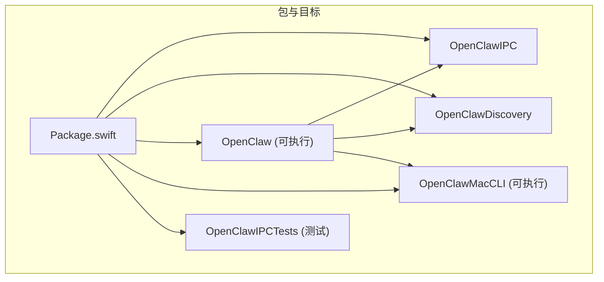
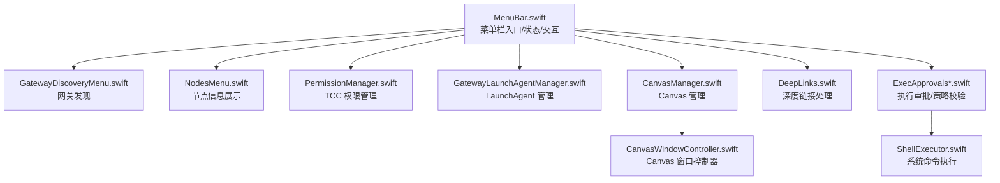
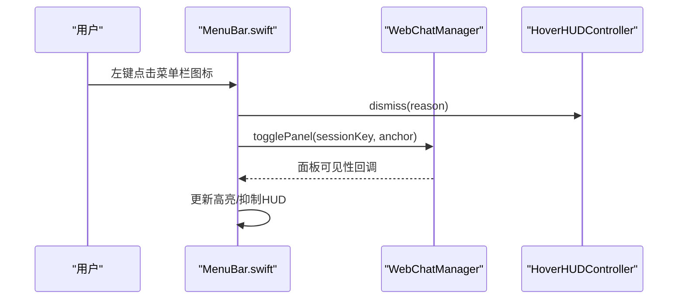
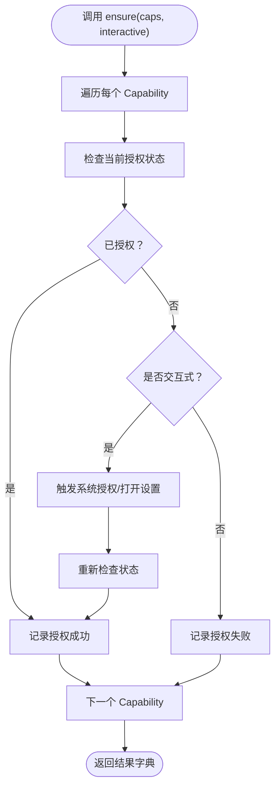
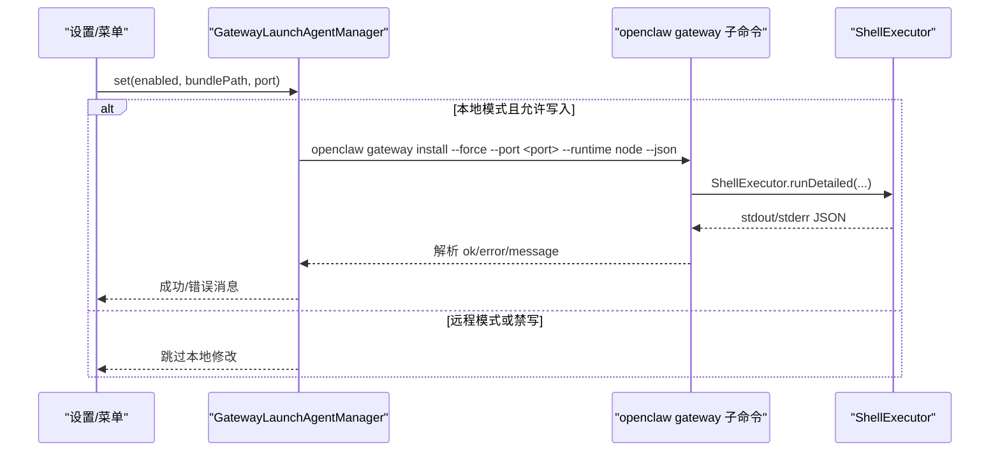
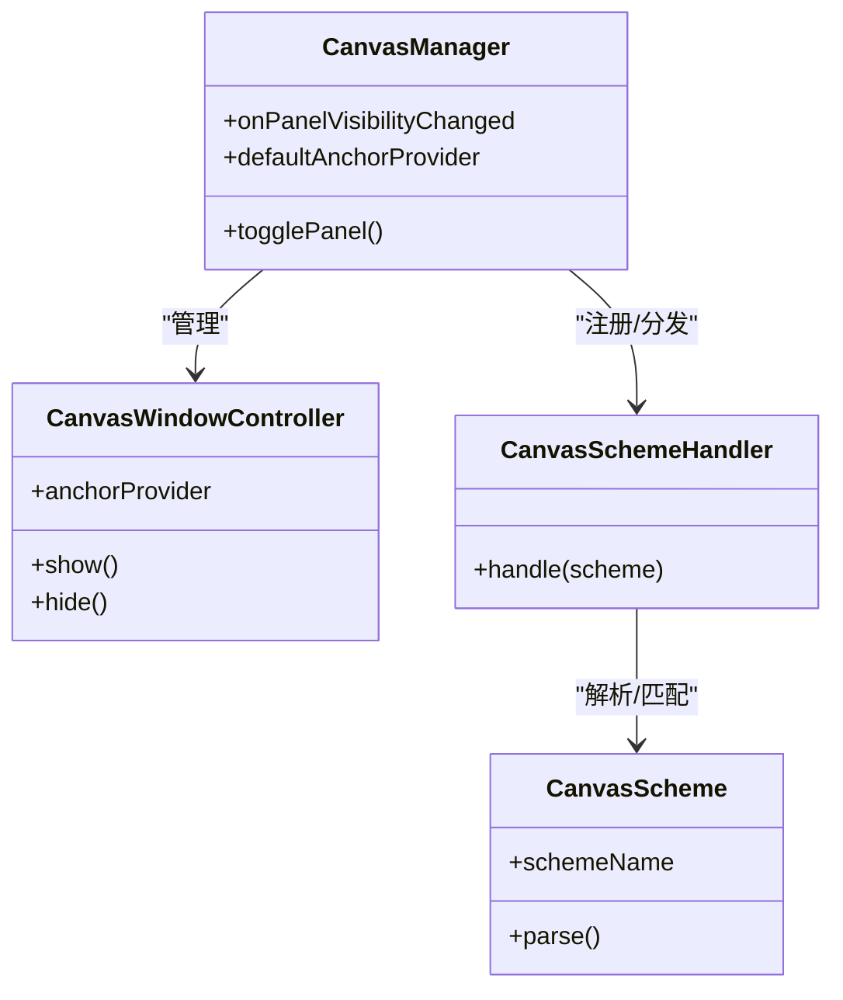
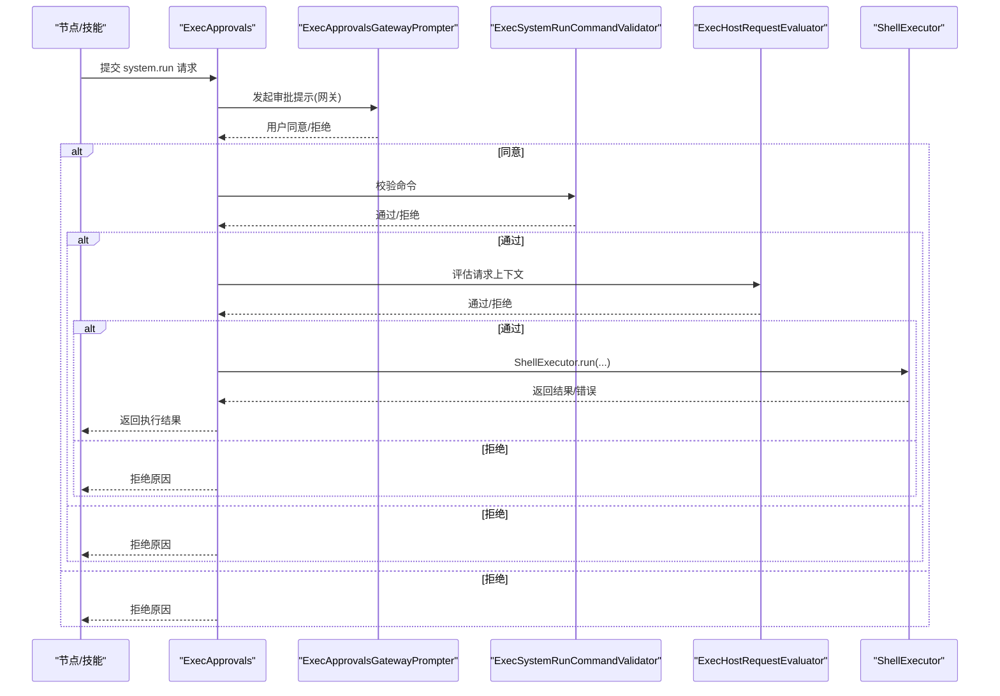
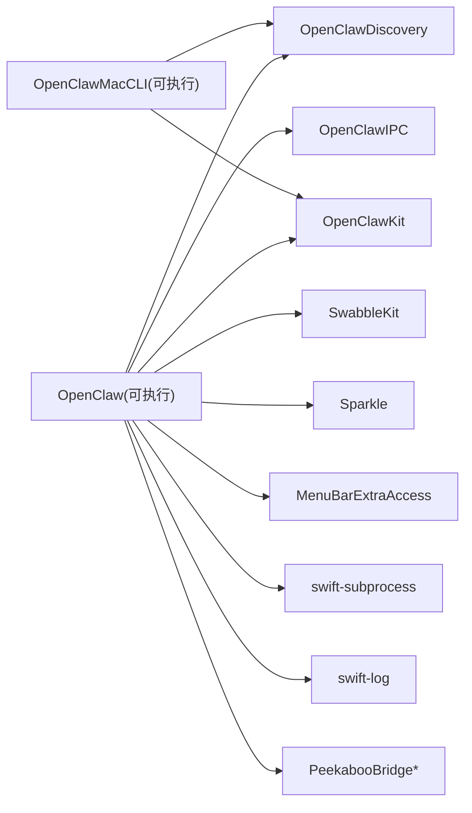

# macOS 应用

<cite>
**本文引用的文件**
- [apps/macos/Package.swift](file://apps/macos/Package.swift)
- [apps/macos/README.md](file://apps/macos/README.md)
- [apps/macos/Sources/OpenClaw/MenuBar.swift](file://apps/macos/Sources/OpenClaw/MenuBar.swift)
- [apps/macos/Sources/OpenClaw/GatewayDiscoveryMenu.swift](file://apps/macos/Sources/OpenClaw/GatewayDiscoveryMenu.swift)
- [apps/macos/Sources/OpenClaw/NodesMenu.swift](file://apps/macos/Sources/OpenClaw/NodesMenu.swift)
- [apps/macos/Sources/OpenClaw/PermissionManager.swift](file://apps/macos/Sources/OpenClaw/PermissionManager.swift)
- [apps/macos/Sources/OpenClaw/GatewayLaunchAgentManager.swift](file://apps/macos/Sources/OpenClaw/GatewayLaunchAgentManager.swift)
- [apps/macos/Sources/OpenClaw/DeepLinks.swift](file://apps/macos/Sources/OpenClaw/DeepLinks.swift)
- [apps/macos/Sources/OpenClaw/CanvasManager.swift](file://apps/macos/Sources/OpenClaw/CanvasManager.swift)
- [apps/macos/Sources/OpenClaw/CanvasWindowController.swift](file://apps/macos/Sources/OpenClaw/CanvasWindowController.swift)
- [apps/macos/Sources/OpenClaw/CanvasSchemeHandler.swift](file://apps/macos/Sources/OpenClaw/CanvasSchemeHandler.swift)
- [apps/macos/Sources/OpenClaw/CanvasScheme.swift](file://apps/macos/Sources/OpenClaw/CanvasScheme.swift)
- [apps/macos/Sources/OpenClaw/ExecApprovals.swift](file://apps/macos/Sources/OpenClaw/ExecApprovals.swift)
- [apps/macos/Sources/OpenClaw/ExecApprovalsGatewayPrompter.swift](file://apps/macos/Sources/OpenClaw/ExecApprovalsGatewayPrompter.swift)
- [apps/macos/Sources/OpenClaw/ExecSystemRunCommandValidator.swift](file://apps/macos/Sources/OpenClaw/ExecSystemRunCommandValidator.swift)
- [apps/macos/Sources/OpenClaw/ExecHostRequestEvaluator.swift](file://apps/macos/Sources/OpenClaw/ExecHostRequestEvaluator.swift)
- [apps/macos/Sources/OpenClaw/ShellExecutor.swift](file://apps/macos/Sources/OpenClaw/ShellExecutor.swift)
- [apps/macos/Sources/OpenClaw/LaunchAgentManager.swift](file://apps/macos/Sources/OpenClaw/LaunchAgentManager.swift)
</cite>

## 目录
1. [简介](#简介)
2. [项目结构](#项目结构)
3. [核心组件](#核心组件)
4. [架构总览](#架构总览)
5. [详细组件分析](#详细组件分析)
6. [依赖关系分析](#依赖关系分析)
7. [性能考虑](#性能考虑)
8. [故障排除指南](#故障排除指南)
9. [结论](#结论)
10. [附录](#附录)

## 简介
本文件面向 OpenClaw 的 macOS 菜单栏伴侣应用，系统性阐述其核心功能与实现：菜单栏通知与交互、系统权限管理（TCC）、网关连接与本地节点宿主服务、本地/远程模式差异、LaunchAgent 管理机制、节点能力暴露（Canvas、Camera、Screen Recording、system.run）、系统运行命令的执行审批机制、深度链接处理、构建与开发流程、安全策略、性能优化与故障排除。

## 项目结构
OpenClaw macOS 应用位于 apps/macos，采用 Swift Package Manager 组织多目标产物：
- 可执行目标 OpenClaw：菜单栏应用主体
- 库目标 OpenClawIPC、OpenClawDiscovery：跨进程通信与发现能力
- 命令行工具 OpenClawMacCLI：辅助 CLI 工具
- 测试目标 OpenClawIPCTests：覆盖 IPC、权限、网关、Canvas、执行审批等模块

图表来源
- [apps/macos/Package.swift:1-93](file://apps/macos/Package.swift#L1-L93)

章节来源
- [apps/macos/Package.swift:1-93](file://apps/macos/Package.swift#L1-L93)
- [apps/macos/README.md:1-65](file://apps/macos/README.md#L1-L65)

## 核心组件
- 菜单栏入口与状态管理：MenuBar.swift 提供菜单栏图标、悬停 HUD、左右键交互、面板可见性控制、睡眠态判定与图标状态映射。
- 网关发现与选择：GatewayDiscoveryMenu.swift 提供局域网网关发现列表与选择逻辑。
- 节点信息展示：NodesMenu.swift 提供节点列表格式化、角色/平台/版本标签、设备类型图标等。
- 权限管理（TCC）：PermissionManager.swift 封装通知、AppleScript、辅助功能、屏幕录制、麦克风、语音识别、相机、位置等权限检查与请求。
- 网关与本地节点宿主：GatewayLaunchAgentManager.swift 管理 LaunchAgent 安装/卸载/重启；LaunchAgentManager.swift 提供通用 LaunchAgent 操作封装。
- Canvas 能力与窗口：CanvasManager.swift、CanvasWindowController.swift、CanvasSchemeHandler.swift、CanvasScheme.swift 协同提供 Canvas 能力暴露与窗口管理。
- 执行审批与系统命令：ExecApprovals.swift、ExecApprovalsGatewayPrompter.swift、ExecSystemRunCommandValidator.swift、ExecHostRequestEvaluator.swift、ShellExecutor.swift 实现系统运行命令审批、策略校验与执行。
- 深度链接：DeepLinks.swift 处理应用内深度链接解析与路由。

章节来源
- [apps/macos/Sources/OpenClaw/MenuBar.swift:1-465](file://apps/macos/Sources/OpenClaw/MenuBar.swift#L1-L465)
- [apps/macos/Sources/OpenClaw/GatewayDiscoveryMenu.swift:1-118](file://apps/macos/Sources/OpenClaw/GatewayDiscoveryMenu.swift#L1-L118)
- [apps/macos/Sources/OpenClaw/NodesMenu.swift:1-298](file://apps/macos/Sources/OpenClaw/NodesMenu.swift#L1-L298)
- [apps/macos/Sources/OpenClaw/PermissionManager.swift:1-483](file://apps/macos/Sources/OpenClaw/PermissionManager.swift#L1-L483)
- [apps/macos/Sources/OpenClaw/GatewayLaunchAgentManager.swift:1-191](file://apps/macos/Sources/OpenClaw/GatewayLaunchAgentManager.swift#L1-L191)
- [apps/macos/Sources/OpenClaw/LaunchAgentManager.swift](file://apps/macos/Sources/OpenClaw/LaunchAgentManager.swift)
- [apps/macos/Sources/OpenClaw/CanvasManager.swift](file://apps/macos/Sources/OpenClaw/CanvasManager.swift)
- [apps/macos/Sources/OpenClaw/CanvasWindowController.swift](file://apps/macos/Sources/OpenClaw/CanvasWindowController.swift)
- [apps/macos/Sources/OpenClaw/CanvasSchemeHandler.swift](file://apps/macos/Sources/OpenClaw/CanvasSchemeHandler.swift)
- [apps/macos/Sources/OpenClaw/CanvasScheme.swift](file://apps/macos/Sources/OpenClaw/CanvasScheme.swift)
- [apps/macos/Sources/OpenClaw/ExecApprovals.swift](file://apps/macos/Sources/OpenClaw/ExecApprovals.swift)
- [apps/macos/Sources/OpenClaw/ExecApprovalsGatewayPrompter.swift](file://apps/macos/Sources/OpenClaw/ExecApprovalsGatewayPrompter.swift)
- [apps/macos/Sources/OpenClaw/ExecSystemRunCommandValidator.swift](file://apps/macos/Sources/OpenClaw/ExecSystemRunCommandValidator.swift)
- [apps/macos/Sources/OpenClaw/ExecHostRequestEvaluator.swift](file://apps/macos/Sources/OpenClaw/ExecHostRequestEvaluator.swift)
- [apps/macos/Sources/OpenClaw/ShellExecutor.swift](file://apps/macos/Sources/OpenClaw/ShellExecutor.swift)
- [apps/macos/Sources/OpenClaw/DeepLinks.swift](file://apps/macos/Sources/OpenClaw/DeepLinks.swift)

## 架构总览
OpenClaw macOS 应用以 SwiftUI 菜单栏入口为核心，通过 IPC 与本地/远程网关交互，结合权限管理、Canvas 能力、执行审批与深度链接处理，形成完整的本地模式与远程模式双栈架构。

图表来源
- [apps/macos/Sources/OpenClaw/MenuBar.swift:1-465](file://apps/macos/Sources/OpenClaw/MenuBar.swift#L1-L465)
- [apps/macos/Sources/OpenClaw/GatewayDiscoveryMenu.swift:1-118](file://apps/macos/Sources/OpenClaw/GatewayDiscoveryMenu.swift#L1-L118)
- [apps/macos/Sources/OpenClaw/NodesMenu.swift:1-298](file://apps/macos/Sources/OpenClaw/NodesMenu.swift#L1-L298)
- [apps/macos/Sources/OpenClaw/PermissionManager.swift:1-483](file://apps/macos/Sources/OpenClaw/PermissionManager.swift#L1-L483)
- [apps/macos/Sources/OpenClaw/GatewayLaunchAgentManager.swift:1-191](file://apps/macos/Sources/OpenClaw/GatewayLaunchAgentManager.swift#L1-L191)
- [apps/macos/Sources/OpenClaw/CanvasManager.swift](file://apps/macos/Sources/OpenClaw/CanvasManager.swift)
- [apps/macos/Sources/OpenClaw/CanvasWindowController.swift](file://apps/macos/Sources/OpenClaw/CanvasWindowController.swift)
- [apps/macos/Sources/OpenClaw/DeepLinks.swift](file://apps/macos/Sources/OpenClaw/DeepLinks.swift)
- [apps/macos/Sources/OpenClaw/ExecApprovals.swift](file://apps/macos/Sources/OpenClaw/ExecApprovals.swift)
- [apps/macos/Sources/OpenClaw/ShellExecutor.swift](file://apps/macos/Sources/OpenClaw/ShellExecutor.swift)

## 详细组件分析

### 菜单栏通知与交互
- 菜单栏图标状态：根据暂停、睡眠、工作、耳部提示、闪烁节拍、网关状态与动画开关综合决定。
- 鼠标交互：左键打开/切换聊天面板；右键弹出菜单；悬停触发 HUD 控制。
- 面板可见性：面板显示时抑制 Hover HUD，并更新状态按钮高亮。
- 连接模式变更：切换本地/远程时联动 GatewayProcessManager 与 Updater 控制器。

图表来源
- [apps/macos/Sources/OpenClaw/MenuBar.swift:134-192](file://apps/macos/Sources/OpenClaw/MenuBar.swift#L134-L192)
- [apps/macos/Sources/OpenClaw/MenuBar.swift:176-185](file://apps/macos/Sources/OpenClaw/MenuBar.swift#L176-L185)

章节来源
- [apps/macos/Sources/OpenClaw/MenuBar.swift:1-465](file://apps/macos/Sources/OpenClaw/MenuBar.swift#L1-L465)

### 系统权限管理（TCC）
- 支持权限：通知、AppleScript、辅助功能、屏幕录制、麦克风、语音识别、相机、位置。
- 行为：非交互式仅返回当前状态；交互式在未授权时触发系统授权对话或引导至系统设置。
- 监控：PermissionMonitor 定期轮询并缓存权限状态，避免频繁 UI 刷新。

图表来源
- [apps/macos/Sources/OpenClaw/PermissionManager.swift:25-31](file://apps/macos/Sources/OpenClaw/PermissionManager.swift#L25-L31)
- [apps/macos/Sources/OpenClaw/PermissionManager.swift:54-75](file://apps/macos/Sources/OpenClaw/PermissionManager.swift#L54-L75)
- [apps/macos/Sources/OpenClaw/PermissionManager.swift:399-466](file://apps/macos/Sources/OpenClaw/PermissionManager.swift#L399-L466)

章节来源
- [apps/macos/Sources/OpenClaw/PermissionManager.swift:1-483](file://apps/macos/Sources/OpenClaw/PermissionManager.swift#L1-L483)

### 网关连接与本地节点宿主服务
- 本地模式：通过 GatewayLaunchAgentManager 管理 LaunchAgent，安装/卸载/重启本地网关守护进程；支持 attach-only 模式禁写 LaunchAgent。
- 远程模式：不写入 LaunchAgent，直接通过控制通道连接远端网关。
- 睡眠态判定：根据暂停标志、连接模式与网关状态综合判断，影响菜单栏图标与交互行为。

图表来源
- [apps/macos/Sources/OpenClaw/GatewayLaunchAgentManager.swift:53-78](file://apps/macos/Sources/OpenClaw/GatewayLaunchAgentManager.swift#L53-L78)
- [apps/macos/Sources/OpenClaw/GatewayLaunchAgentManager.swift:132-175](file://apps/macos/Sources/OpenClaw/GatewayLaunchAgentManager.swift#L132-L175)
- [apps/macos/Sources/OpenClaw/ShellExecutor.swift](file://apps/macos/Sources/OpenClaw/ShellExecutor.swift)

章节来源
- [apps/macos/Sources/OpenClaw/GatewayLaunchAgentManager.swift:1-191](file://apps/macos/Sources/OpenClaw/GatewayLaunchAgentManager.swift#L1-L191)
- [apps/macos/Sources/OpenClaw/LaunchAgentManager.swift](file://apps/macos/Sources/OpenClaw/LaunchAgentManager.swift)

### 本地模式与远程模式区别
- 本地模式：写入并管理 LaunchAgent，启动本地网关；暂停时停止本地网关；睡眠态由网关状态与控制通道状态共同决定。
- 远程模式：不写入 LaunchAgent，直接连接远端网关；睡眠态取决于控制通道连接状态。

章节来源
- [apps/macos/Sources/OpenClaw/MenuBar.swift:62-79](file://apps/macos/Sources/OpenClaw/MenuBar.swift#L62-L79)
- [apps/macos/Sources/OpenClaw/MenuBar.swift:114-131](file://apps/macos/Sources/OpenClaw/MenuBar.swift#L114-L131)

### 节点能力暴露（Canvas、Camera、Screen Recording、system.run）
- Canvas：CanvasManager/CanvasWindowController 管理 Canvas 能力窗口与渲染；CanvasScheme/CanvasSchemeHandler 提供协议与处理；CanvasFileWatcher 监听文件变化。
- Camera：通过 PermissionManager 管理相机权限；节点侧能力通过网关暴露。
- Screen Recording：通过 PermissionManager 管理屏幕录制权限；节点侧能力通过网关暴露。
- system.run：通过执行审批链路（ExecApprovals、ExecApprovalsGatewayPrompter、ExecSystemRunCommandValidator、ExecHostRequestEvaluator、ShellExecutor）进行策略校验与执行。

图表来源
- [apps/macos/Sources/OpenClaw/CanvasManager.swift](file://apps/macos/Sources/OpenClaw/CanvasManager.swift)
- [apps/macos/Sources/OpenClaw/CanvasWindowController.swift](file://apps/macos/Sources/OpenClaw/CanvasWindowController.swift)
- [apps/macos/Sources/OpenClaw/CanvasSchemeHandler.swift](file://apps/macos/Sources/OpenClaw/CanvasSchemeHandler.swift)
- [apps/macos/Sources/OpenClaw/CanvasScheme.swift](file://apps/macos/Sources/OpenClaw/CanvasScheme.swift)

章节来源
- [apps/macos/Sources/OpenClaw/CanvasManager.swift](file://apps/macos/Sources/OpenClaw/CanvasManager.swift)
- [apps/macos/Sources/OpenClaw/CanvasWindowController.swift](file://apps/macos/Sources/OpenClaw/CanvasWindowController.swift)
- [apps/macos/Sources/OpenClaw/CanvasSchemeHandler.swift](file://apps/macos/Sources/OpenClaw/CanvasSchemeHandler.swift)
- [apps/macos/Sources/OpenClaw/CanvasScheme.swift](file://apps/macos/Sources/OpenClaw/CanvasScheme.swift)

### 系统运行命令的执行审批机制
- 审批入口：ExecApprovals.swift 定义审批模型与存储；ExecApprovalsGatewayPrompter.swift 与网关交互进行审批提示。
- 策略校验：ExecSystemRunCommandValidator.swift 校验命令合法性；ExecHostRequestEvaluator.swift 评估请求上下文。
- 执行：ShellExecutor.swift 调用系统 shell 执行命令，支持超时与错误汇总。

图表来源
- [apps/macos/Sources/OpenClaw/ExecApprovals.swift](file://apps/macos/Sources/OpenClaw/ExecApprovals.swift)
- [apps/macos/Sources/OpenClaw/ExecApprovalsGatewayPrompter.swift](file://apps/macos/Sources/OpenClaw/ExecApprovalsGatewayPrompter.swift)
- [apps/macos/Sources/OpenClaw/ExecSystemRunCommandValidator.swift](file://apps/macos/Sources/OpenClaw/ExecSystemRunCommandValidator.swift)
- [apps/macos/Sources/OpenClaw/ExecHostRequestEvaluator.swift](file://apps/macos/Sources/OpenClaw/ExecHostRequestEvaluator.swift)
- [apps/macos/Sources/OpenClaw/ShellExecutor.swift](file://apps/macos/Sources/OpenClaw/ShellExecutor.swift)

章节来源
- [apps/macos/Sources/OpenClaw/ExecApprovals.swift](file://apps/macos/Sources/OpenClaw/ExecApprovals.swift)
- [apps/macos/Sources/OpenClaw/ExecApprovalsGatewayPrompter.swift](file://apps/macos/Sources/OpenClaw/ExecApprovalsGatewayPrompter.swift)
- [apps/macos/Sources/OpenClaw/ExecSystemRunCommandValidator.swift](file://apps/macos/Sources/OpenClaw/ExecSystemRunCommandValidator.swift)
- [apps/macos/Sources/OpenClaw/ExecHostRequestEvaluator.swift](file://apps/macos/Sources/OpenClaw/ExecHostRequestEvaluator.swift)
- [apps/macos/Sources/OpenClaw/ShellExecutor.swift](file://apps/macos/Sources/OpenClaw/ShellExecutor.swift)

### 深度链接处理
- AppDelegate 在应用启动时注册 open URLs 回调，统一交由 DeepLinkHandler 处理。
- DeepLinks.swift 定义深度链接解析与路由逻辑，支持代理/分享等场景。

章节来源
- [apps/macos/Sources/OpenClaw/MenuBar.swift:249-255](file://apps/macos/Sources/OpenClaw/MenuBar.swift#L249-L255)
- [apps/macos/Sources/OpenClaw/DeepLinks.swift](file://apps/macos/Sources/OpenClaw/DeepLinks.swift)

### 网关发现与节点菜单
- GatewayDiscoveryMenu.swift 提供局域网网关发现列表，支持直连/SSH 两种传输方式，自动计算显示标签与选中态。
- NodesMenu.swift 提供节点信息格式化，包括名称、角色、平台、版本、IP 等，用于菜单展示与帮助信息。

章节来源
- [apps/macos/Sources/OpenClaw/GatewayDiscoveryMenu.swift:1-118](file://apps/macos/Sources/OpenClaw/GatewayDiscoveryMenu.swift#L1-L118)
- [apps/macos/Sources/OpenClaw/NodesMenu.swift:1-298](file://apps/macos/Sources/OpenClaw/NodesMenu.swift#L1-L298)

## 依赖关系分析
- 包级依赖：MenuBarExtraAccess、swift-subprocess、swift-log、Sparkle、Peekaboo、OpenClawKit、Swabble。
- 目标间依赖：OpenClaw 可执行目标依赖 IPC、Discovery、Kit、Swabble、Sparkle、Peekaboo；CLI 依赖 Discovery 与 Kit；测试依赖 IPC、App 与 Kit。

图表来源
- [apps/macos/Package.swift:42-57](file://apps/macos/Package.swift#L42-L57)
- [apps/macos/Package.swift:68-78](file://apps/macos/Package.swift#L68-L78)

章节来源
- [apps/macos/Package.swift:1-93](file://apps/macos/Package.swift#L1-L93)

## 性能考虑
- 菜单栏状态更新：通过状态绑定与条件渲染减少不必要的重绘；悬停 HUD 抑制与高亮更新在面板可见性变化时批量处理。
- 权限监控：PermissionMonitor 使用定时器与最小检查间隔，避免频繁系统查询；仅在首次注册时启动监控。
- 执行审批：审批链路按需校验，优先短路拒绝；ShellExecutor 设置超时，避免阻塞 UI。
- Canvas：窗口锚定与可见性回调降低重排成本；文件监听按需启用。

章节来源
- [apps/macos/Sources/OpenClaw/MenuBar.swift:24-32](file://apps/macos/Sources/OpenClaw/MenuBar.swift#L24-L32)
- [apps/macos/Sources/OpenClaw/PermissionManager.swift:409-441](file://apps/macos/Sources/OpenClaw/PermissionManager.swift#L409-L441)
- [apps/macos/Sources/OpenClaw/ShellExecutor.swift](file://apps/macos/Sources/OpenClaw/ShellExecutor.swift)

## 故障排除指南
- 开发运行与签名
  - 快速开发：使用脚本一键重启应用，支持无签名与强制签名选项。
  - 签名行为：自动选择开发者 ID/Apple 分发/Apple 开发证书，或允许自签；Sparkle 团队 ID 不匹配时可临时放宽库验证（仅开发）。
  - 团队 ID 审计：打包后对应用内所有 Mach-O 校验团队 ID，不一致则失败；可跳过审计（谨慎使用）。
- LaunchAgent 管理
  - attach-only 模式：禁写 LaunchAgent 并停止其运行；适用于调试/容器环境。
  - 日志路径：若 LaunchAgent 配置中未指定日志路径，回退到默认日志定位器。
- 权限问题
  - TCC 权限被拒：交互式调用会打开系统设置对应页面；建议在设置中确认授权状态。
  - 屏幕录制/麦克风/相机：部分系统版本下需要先请求一次授权再进行状态检查。
- 执行审批
  - 审批未响应：检查 ExecApprovalsGatewayPrompter 是否正常启动；确认网关连接与控制通道状态。
  - 命令执行失败：查看 ShellExecutor 输出与错误摘要；核对命令合法性与策略配置。

章节来源
- [apps/macos/README.md:17-65](file://apps/macos/README.md#L17-L65)
- [apps/macos/Sources/OpenClaw/GatewayLaunchAgentManager.swift:17-46](file://apps/macos/Sources/OpenClaw/GatewayLaunchAgentManager.swift#L17-L46)
- [apps/macos/Sources/OpenClaw/GatewayLaunchAgentManager.swift:84-101](file://apps/macos/Sources/OpenClaw/GatewayLaunchAgentManager.swift#L84-L101)
- [apps/macos/Sources/OpenClaw/PermissionManager.swift:230-264](file://apps/macos/Sources/OpenClaw/PermissionManager.swift#L230-L264)
- [apps/macos/Sources/OpenClaw/ExecApprovalsGatewayPrompter.swift](file://apps/macos/Sources/OpenClaw/ExecApprovalsGatewayPrompter.swift)

## 结论
OpenClaw macOS 应用通过菜单栏入口统一接入网关与节点能力，结合严格的 TCC 权限管理、可靠的 LaunchAgent 生命周期控制、完善的 Canvas 能力暴露以及严谨的系统运行命令审批机制，实现了本地与远程双模式下的安全、稳定与易用体验。开发与打包流程清晰，具备良好的可观测性与可维护性。

## 附录
- 构建与开发
  - 使用 Swift Package Manager 构建；开发脚本支持快速重启与签名选项。
  - 打包脚本生成签名后的 .app 并进行团队 ID 审计与库验证控制。
- 版本与兼容
  - 最低系统版本要求在 Package.swift 中声明；严格并发特性启用以提升安全性。

章节来源
- [apps/macos/Package.swift:8-10](file://apps/macos/Package.swift#L8-L10)
- [apps/macos/README.md:1-65](file://apps/macos/README.md#L1-L65)