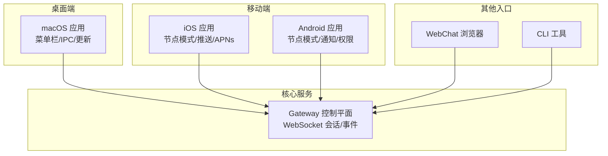
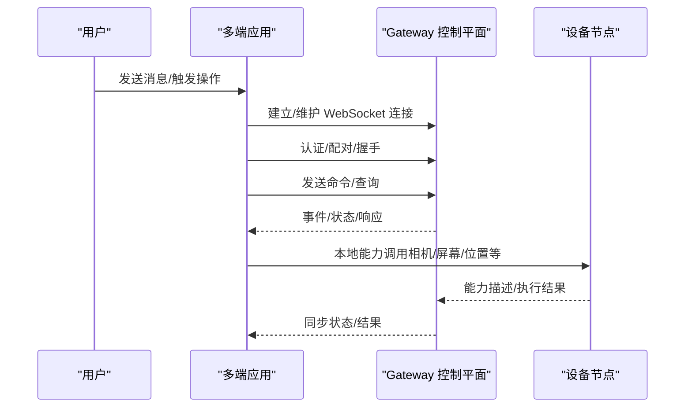
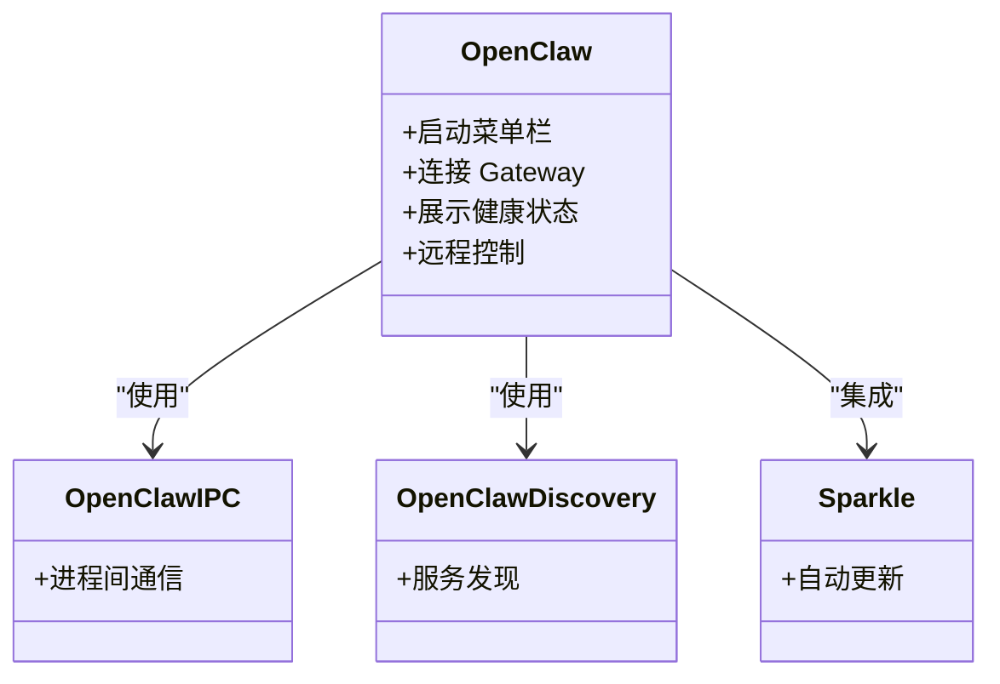
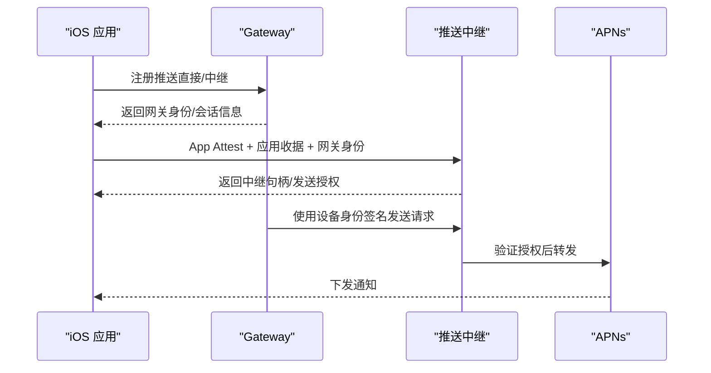
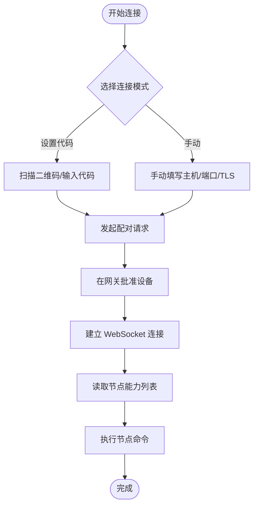
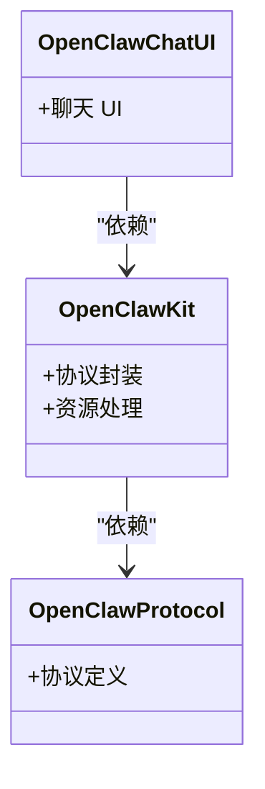
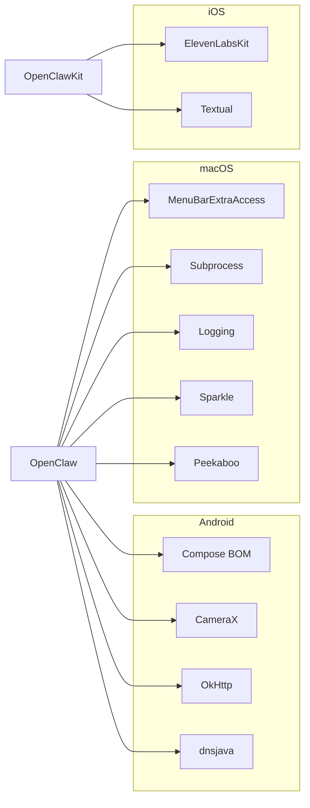

# 跨平台应用

<cite>
**本文引用的文件**
- [README.md](file://README.md)
- [apps/macos/README.md](file://apps/macos/README.md)
- [apps/ios/README.md](file://apps/ios/README.md)
- [apps/android/README.md](file://apps/android/README.md)
- [apps/macos/Package.swift](file://apps/macos/Package.swift)
- [apps/shared/OpenClawKit/Package.swift](file://apps/shared/OpenClawKit/Package.swift)
- [apps/android/app/build.gradle.kts](file://apps/android/app/build.gradle.kts)
- [apps/ios/Sources/OpenClaw.entitlements](file://apps/ios/Sources/OpenClaw.entitlements)
- [apps/ios/Signing.xcconfig](file://apps/ios/Signing.xcconfig)
- [src/gateway/client.ts](file://src/gateway/client.ts)
- [src/gateway/node-command-policy.ts](file://src/gateway/node-command-policy.ts)
- [apps/macos/Sources/OpenClaw/NodesMenu.swift](file://apps/macos/Sources/OpenClaw/NodesMenu.swift)
- [apps/macos/Sources/OpenClaw/PlatformLabelFormatter.swift](file://apps/macos/Sources/OpenClaw/PlatformLabelFormatter.swift)
- [apps/ios/Sources/Device/DeviceInfoHelper.swift](file://apps/ios/Sources/Device/DeviceInfoHelper.swift)
- [ui/src/ui/gateway.ts](file://ui/src/ui/gateway.ts)
</cite>

## 目录
1. [简介](#简介)
2. [项目结构](#项目结构)
3. [核心组件](#核心组件)
4. [架构总览](#架构总览)
5. [详细组件分析](#详细组件分析)
6. [依赖关系分析](#依赖关系分析)
7. [性能考虑](#性能考虑)
8. [故障排除指南](#故障排除指南)
9. [结论](#结论)
10. [附录](#附录)

## 简介
本文件面向 OpenClaw 跨平台应用系统，围绕 macOS、iOS、Android、Windows 与 Linux 平台的应用实现与集成进行深入技术说明。内容涵盖平台特性与权限管理、系统集成与用户体验优化、应用架构与数据同步、远程访问与安全控制、平台特定开发环境与构建部署流程，以及跨平台兼容性处理、性能优化与故障排除建议。目标是帮助开发者与运维人员快速理解并高效交付稳定、安全、可扩展的跨平台客户端体验。

## 项目结构
OpenClaw 采用“核心服务 + 多端客户端”的分层架构：Gateway（控制平面）通过 WebSocket 提供统一的连接与事件通道；多端应用（macOS、iOS、Android）作为节点或客户端接入；共享库（OpenClawKit）在多端复用协议与 UI 组件；浏览器端（WebChat）与 CLI 作为补充入口。

图示来源
- [README.md: 185-202:185-202](file://README.md#L185-L202)
- [apps/macos/Package.swift: 6-16:6-16](file://apps/macos/Package.swift#L6-L16)
- [apps/shared/OpenClawKit/Package.swift: 5-15:5-15](file://apps/shared/OpenClawKit/Package.swift#L5-L15)

章节来源
- [README.md: 185-202:185-202](file://README.md#L185-L202)
- [apps/macos/Package.swift: 6-16:6-16](file://apps/macos/Package.swift#L6-L16)
- [apps/shared/OpenClawKit/Package.swift: 5-15:5-15](file://apps/shared/OpenClawKit/Package.swift#L5-L15)

## 核心组件
- Gateway 客户端（多端通用）
  - 支持 WebSocket 连接、重连退避、序列号校验、超时与错误码提示、TLS 指纹信任等。
  - 在不同运行环境（Node、浏览器、原生）提供一致的连接语义与事件处理。
- OpenClawKit（共享库）
  - 提供协议、聊天 UI、跨平台资源与基础能力封装，支撑 macOS 与 iOS 的 UI 与交互一致性。
- 平台特定实现
  - macOS：菜单栏控制、自动更新（Sparkle）、IPC、发现与打包签名。
  - iOS：节点模式、推送与 APNs 集成、Beta 分发与中继信任模型。
  - Android：节点模式、权限请求、通知、宏基准测试与性能工具链。
- 平台命令策略
  - 基于平台前缀与设备家族解析节点命令白名单，确保安全与可用性。

章节来源
- [src/gateway/client.ts: 78-165:78-165](file://src/gateway/client.ts#L78-L165)
- [apps/shared/OpenClawKit/Package.swift: 21-52:21-52](file://apps/shared/OpenClawKit/Package.swift#L21-L52)
- [apps/macos/Package.swift: 26-78:26-78](file://apps/macos/Package.swift#L26-L78)
- [apps/ios/README.md: 138-186:138-186](file://apps/ios/README.md#L138-L186)
- [apps/android/README.md: 169-178:169-178](file://apps/android/README.md#L169-L178)
- [src/gateway/node-command-policy.ts: 76-163:76-163](file://src/gateway/node-command-policy.ts#L76-L163)

## 架构总览
OpenClaw 的应用架构以 Gateway 为中心，通过 WebSocket 协议承载会话、事件与命令流。多端应用以“节点”或“客户端”角色接入，节点负责本地能力调用（如摄像头、屏幕录制、位置），客户端负责用户交互与远程控制。

图示来源
- [README.md: 185-202:185-202](file://README.md#L185-L202)
- [src/gateway/client.ts: 157-165:157-165](file://src/gateway/client.ts#L157-L165)
- [ui/src/ui/gateway.ts: 164-177:164-177](file://ui/src/ui/gateway.ts#L164-L177)

章节来源
- [README.md: 185-202:185-202](file://README.md#L185-L202)
- [src/gateway/client.ts: 157-165:157-165](file://src/gateway/client.ts#L157-L165)
- [ui/src/ui/gateway.ts: 164-177:164-177](file://ui/src/ui/gateway.ts#L164-L177)

## 详细组件分析

### macOS 应用
- 功能与集成
  - 菜单栏控制、健康状态显示、WebChat 与调试工具、远程 Gateway 控制（SSH）。
  - 通过 IPC 库与 Discovery 组件实现与 Gateway 的可靠连接与能力发现。
  - 自动更新使用 Sparkle，支持签名与 Team ID 校验。
- 开发与打包
  - 快速开发脚本与打包脚本，支持强制签名与临时签名选项。
  - 团队 ID 审计与库验证绕过仅限开发场景。
- 权限与体验
  - 通过节点模式暴露系统能力（如屏幕录制、通知），结合 TCC 权限管理。
  - 节点图标与平台识别在菜单中直观呈现。

图示来源
- [apps/macos/Package.swift: 26-78:26-78](file://apps/macos/Package.swift#L26-L78)
- [apps/macos/README.md: 3-23:3-23](file://apps/macos/README.md#L3-L23)

章节来源
- [apps/macos/Package.swift: 26-78:26-78](file://apps/macos/Package.swift#L26-L78)
- [apps/macos/README.md: 3-23:3-23](file://apps/macos/README.md#L3-L23)
- [apps/macos/Sources/OpenClaw/NodesMenu.swift: 131-156:131-156](file://apps/macos/Sources/OpenClaw/NodesMenu.swift#L131-L156)
- [apps/macos/Sources/OpenClaw/PlatformLabelFormatter.swift: 1-31:1-31](file://apps/macos/Sources/OpenClaw/PlatformLabelFormatter.swift#L1-L31)

### iOS 应用
- 角色与能力
  - 以“节点”角色连接 Gateway，支持配对、聊天与语音唤醒，前台行为更稳定。
  - 支持相机、画布、屏幕录制、位置、联系人、日历、提醒事项、照片、运动与本地通知等命令。
- 推送与 APNs
  - 默认使用直接推送（Development），官方构建通过中继（Relay）与 App Attest 实现可信发送。
  - 中继注册绑定 Gateway 身份，确保仅被该网关授权的设备可接收推送。
- 分发与 Beta 流程
  - 本地开发使用唯一 Bundle ID；Beta 使用官方 Bundle ID，支持 TestFlight 归档与上传。
- 已知限制
  - 背景命令受限；后台定位需“始终允许”；前台优先策略减少死连接与重连开销。

图示来源
- [apps/ios/README.md: 105-136:105-136](file://apps/ios/README.md#L105-L136)
- [apps/ios/Sources/OpenClaw.entitlements: 5-6:5-6](file://apps/ios/Sources/OpenClaw.entitlements#L5-L6)
- [apps/ios/Signing.xcconfig: 7-14:7-14](file://apps/ios/Signing.xcconfig#L7-L14)

章节来源
- [apps/ios/README.md: 138-186:138-186](file://apps/ios/README.md#L138-L186)
- [apps/ios/Sources/OpenClaw.entitlements: 5-6:5-6](file://apps/ios/Sources/OpenClaw.entitlements#L5-L6)
- [apps/ios/Signing.xcconfig: 7-14:7-14](file://apps/ios/Signing.xcconfig#L7-L14)
- [apps/ios/Sources/Device/DeviceInfoHelper.swift: 1-40:1-40](file://apps/ios/Sources/Device/DeviceInfoHelper.swift#L1-L40)

### Android 应用
- 节点模式与权限
  - 支持“设置代码/手动”连接方式；前台服务通知、相机、录音、位置等权限在引导与设置中申请。
  - 通过 DNS-SD（dnsjava）实现广域 Bonjour 发现，便于局域网内连接。
- 性能与测试
  - 提供宏基准（Startup + 帧时间）与低噪声性能 CLI，支持热点提取与基线对比。
  - 集成 CameraX 与扫码能力，提升节点命令一致性。
- 连接与配对
  - 通过 CLI 列出并批准设备配对请求，确保首次连接安全可控。

图示来源
- [apps/android/README.md: 147-167:147-167](file://apps/android/README.md#L147-L167)
- [apps/android/app/build.gradle.kts: 206-207:206-207](file://apps/android/app/build.gradle.kts#L206-L207)

章节来源
- [apps/android/README.md: 169-178:169-178](file://apps/android/README.md#L169-L178)
- [apps/android/app/build.gradle.kts: 206-207:206-207](file://apps/android/app/build.gradle.kts#L206-L207)

### 共享库 OpenClawKit
- 结构与职责
  - OpenClawProtocol：跨端协议定义。
  - OpenClawKit：协议与 UI 资源封装，iOS/macOS 双端复用。
  - OpenClawChatUI：基于 Textual 的聊天 UI，适配 macOS/iOS。
- 版本与平台
  - iOS 最低版本 18，macOS 最低版本 15，确保新特性与并发安全。

图示来源
- [apps/shared/OpenClawKit/Package.swift: 21-52:21-52](file://apps/shared/OpenClawKit/Package.swift#L21-L52)

章节来源
- [apps/shared/OpenClawKit/Package.swift: 21-52:21-52](file://apps/shared/OpenClawKit/Package.swift#L21-L52)

### 节点命令策略与平台解析
- 平台默认命令集
  - iOS：画布、相机、位置、设备命令、联系人、日历、提醒、照片、运动、系统命令等。
  - Android：画布、相机、位置、通知、系统通知、设备命令、联系人、日历、通话记录、提醒、照片、运动等。
  - macOS：与 Android 类似，但包含更多系统级命令。
  - Linux/Windows：主要为系统命令。
- 解析规则
  - 基于平台前缀（如 ios/android/mac/linux/win）与设备家族关键词（如 iphone/ipad/mac/windows/linux）解析平台 ID，决定默认命令白名单。

章节来源
- [src/gateway/node-command-policy.ts: 76-163:76-163](file://src/gateway/node-command-policy.ts#L76-L163)

## 依赖关系分析
- 多端依赖
  - macOS：MenuBarExtraAccess、Subprocess、Logging、Sparkle、Peekaboo 等。
  - iOS：ElevenLabsKit、Textual（条件引入）。
  - Android：Compose BOM、CameraX、OkHttp、BCProv、CommonMark、dnsjava 等。
- 构建与打包
  - macOS：SwiftPM 包管理，Sparkle 更新，签名与团队 ID 审计。
  - iOS：XcodeGen 生成工程，xcconfig 管理签名与版本，Fastlane 支持 Beta。
  - Android：Gradle 插件与 Kotlin DSL，Compose、Kotlinx Serialization、安全加密、网络栈等。

图示来源
- [apps/macos/Package.swift: 17-25:17-25](file://apps/macos/Package.swift#L17-L25)
- [apps/shared/OpenClawKit/Package.swift: 16-19:16-19](file://apps/shared/OpenClawKit/Package.swift#L16-L19)
- [apps/android/app/build.gradle.kts: 164-216:164-216](file://apps/android/app/build.gradle.kts#L164-L216)

章节来源
- [apps/macos/Package.swift: 17-25:17-25](file://apps/macos/Package.swift#L17-L25)
- [apps/shared/OpenClawKit/Package.swift: 16-19:16-19](file://apps/shared/OpenClawKit/Package.swift#L16-L19)
- [apps/android/app/build.gradle.kts: 164-216:164-216](file://apps/android/app/build.gradle.kts#L164-L216)

## 性能考虑
- 启动与帧时间
  - Android 提供宏基准与低噪声性能 CLI，支持冷启动测量、热点提取与基线对比，便于持续优化。
- UI 与渲染
  - iOS/macOS 使用现代 UI 框架（Compose、Textual、菜单栏），注意在低端设备上的资源占用与布局复杂度。
- 网络与连接
  - Gateway 客户端内置指数退避与心跳检测，避免长连接空闲导致的资源浪费。
- 资源与包体
  - Android 通过 R8 混淆与资源排除减少包体；macOS iOS 使用 SwiftPM 管理依赖，避免重复引入。

章节来源
- [apps/android/README.md: 63-96:63-96](file://apps/android/README.md#L63-L96)
- [apps/android/app/build.gradle.kts: 81-86:81-86](file://apps/android/app/build.gradle.kts#L81-L86)
- [src/gateway/client.ts: 124-155:124-155](file://src/gateway/client.ts#L124-L155)

## 故障排除指南
- 连接问题
  - 检查 URL 与 TLS 指纹要求（wss:// 才支持指纹校验）；确认防火墙与隧道配置。
  - 浏览器端遇到“策略违规”类关闭码时，检查认证参数与网关策略。
- iOS 推送
  - 确认推送能力与配置文件匹配；本地构建默认使用沙盒环境；官方构建需通过中继与 App Attest。
- macOS 签名与权限
  - 团队 ID 不一致会导致签名失败；开发阶段可使用库验证绕过，但不建议用于发布。
- Android 权限
  - 前台服务通知、相机、录音、位置等权限需在设置或引导流程中授予；无权限将导致命令失败。
- 节点能力
  - 通过 node.describe 获取能力清单；若 A2UI 主机不可达，保持应用前台并重新连接以刷新能力。

章节来源
- [src/gateway/client.ts: 162-165:162-165](file://src/gateway/client.ts#L162-L165)
- [ui/src/ui/gateway.ts: 146-147:146-147](file://ui/src/ui/gateway.ts#L146-L147)
- [apps/ios/README.md: 95-114:95-114](file://apps/ios/README.md#L95-L114)
- [apps/macos/README.md: 37-56:37-56](file://apps/macos/README.md#L37-L56)
- [apps/android/README.md: 169-178:169-178](file://apps/android/README.md#L169-L178)

## 结论
OpenClaw 的跨平台应用体系以 Gateway 为核心，通过标准化的 WebSocket 协议与节点命令策略实现多端协同。macOS、iOS、Android 三端在权限、推送、UI 与构建流程上各有侧重，同时通过 OpenClawKit 实现协议与 UI 的复用。配合完善的开发与测试工具链，可在保证安全性与用户体验的前提下，实现高性能、可维护的跨平台客户端生态。

## 附录
- 平台最低版本与特性
  - iOS：18；macOS：15；Android：minSdk 31。
- 关键构建与运行要点
  - macOS：SwiftPM、Sparkle、签名与团队 ID 审计。
  - iOS：XcodeGen、xcconfig、Fastlane、APNs 与中继信任。
  - Android：Gradle、Compose、CameraX、dnsjava、宏基准与性能 CLI。

章节来源
- [apps/shared/OpenClawKit/Package.swift: 7-10:7-10](file://apps/shared/OpenClawKit/Package.swift#L7-L10)
- [apps/android/app/build.gradle.kts: 64-74:64-74](file://apps/android/app/build.gradle.kts#L64-L74)
- [apps/macos/Package.swift: 8-9:8-9](file://apps/macos/Package.swift#L8-L9)
- [apps/ios/README.md: 18-48:18-48](file://apps/ios/README.md#L18-L48)
- [apps/android/README.md: 22-35:22-35](file://apps/android/README.md#L22-L35)