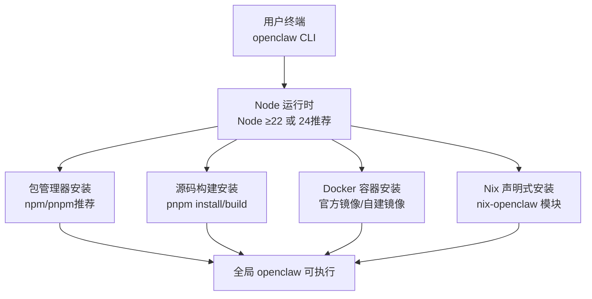
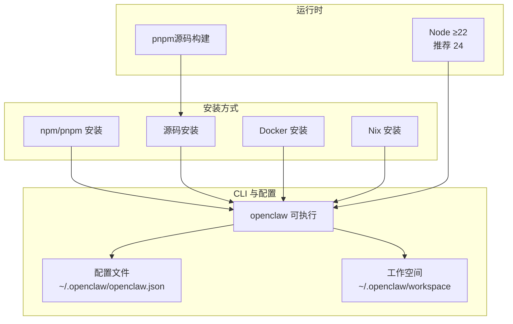
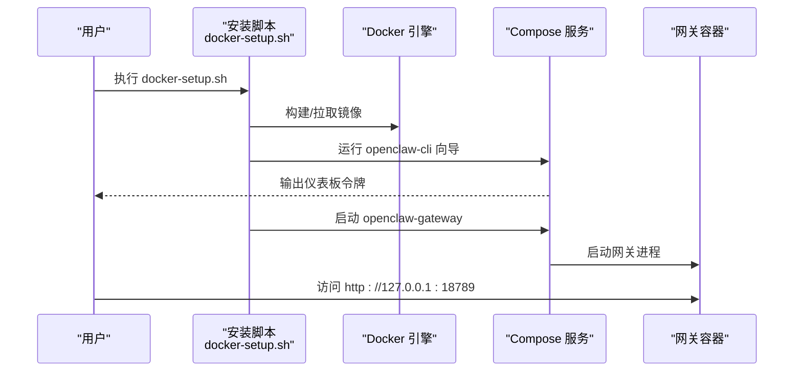
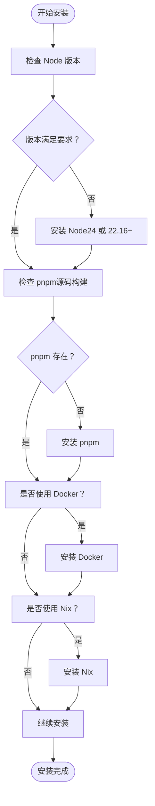

# 安装概览

<cite>
**本文档引用的文件**
- [README.md](file://README.md)
- [package.json](file://package.json)
- [docs/install/index.md](file://docs/install/index.md)
- [docs/install/docker.md](file://docs/install/docker.md)
- [docs/install/nix.md](file://docs/install/nix.md)
- [docs/install/node.md](file://docs/install/node.md)
- [docs/install/installer.md](file://docs/install/installer.md)
- [Dockerfile](file://Dockerfile)
</cite>

## 目录
1. [简介](#简介)
2. [项目结构](#项目结构)
3. [核心组件](#核心组件)
4. [架构总览](#架构总览)
5. [详细组件分析](#详细组件分析)
6. [依赖分析](#依赖分析)
7. [性能考虑](#性能考虑)
8. [故障排除指南](#故障排除指南)
9. [结论](#结论)
10. [附录](#附录)

## 简介
本安装概览面向希望在本地或生产环境中部署 OpenClaw 的用户，提供多种安装方式的总体介绍与对比，涵盖推荐的 npm 安装、从源码编译安装、Docker 容器化安装、Nix 包管理器安装等。文档同时给出安装前的系统要求检查清单、常见问题与解决方案，并按开发环境、生产环境、测试环境等不同需求场景进行适用性说明。

## 项目结构
OpenClaw 提供统一的 CLI 命令入口 openclaw，支持通过包管理器安装（npm/pnpm），也支持直接从源码构建运行。仓库内包含完整的安装文档与脚本，覆盖 macOS、Linux、Windows（WSL2）平台，以及容器化与声明式安装方案。

图示来源
- [README.md:50-82](file://README.md#L50-L82)
- [package.json:16-18](file://package.json#L16-L18)
- [docs/install/index.md:24-171](file://docs/install/index.md#L24-L171)

章节来源
- [README.md:50-82](file://README.md#L50-L82)
- [package.json:16-18](file://package.json#L16-L18)
- [docs/install/index.md:24-171](file://docs/install/index.md#L24-L171)

## 核心组件
- CLI 入口：openclaw 命令由包管理器安装后提供，或通过源码构建生成。
- 运行时要求：Node ≥22；推荐使用 Node 24。
- 安装介质：npm/pnpm 包、源码仓库、Docker 镜像、Nix 表达式。
- 辅助工具：安装脚本（install.sh/install-cli.sh/install.ps1）、Docker Compose 脚本、Nix Home Manager 模块。

章节来源
- [README.md:50-82](file://README.md#L50-L82)
- [package.json:16-18](file://package.json#L16-L18)
- [docs/install/index.md:24-171](file://docs/install/index.md#L24-L171)

## 架构总览
下图展示了不同安装方式如何将 openclaw CLI 与运行时、配置、工作空间关联起来：

图示来源
- [README.md:50-82](file://README.md#L50-L82)
- [package.json:16-18](file://package.json#L16-L18)
- [docs/install/index.md:24-171](file://docs/install/index.md#L24-L171)

## 详细组件分析

### 推荐安装方式：npm/pnpm 安装
- 适用场景
  - 开发环境快速起步
  - 生产环境（服务器/桌面）
  - 测试环境（CI/自动化）
- 优点
  - 安装简单、生态成熟
  - 支持自动升级与频道切换
  - 与 Node 版本管理器配合良好
- 缺点
  - 需要系统已安装 Node（≥22，推荐 24）
  - 某些系统可能需要处理权限与 PATH 问题
- 使用建议
  - 优先选择 Node 24；如需兼容 LTS，可使用 Node 22.16+
  - 如 sharp 构建失败，参考文档中的环境变量处理

章节来源
- [docs/install/index.md:72-114](file://docs/install/index.md#L72-L114)
- [docs/install/node.md:12-21](file://docs/install/node.md#L12-L21)

### 从源码编译安装
- 适用场景
  - 贡献者或需要本地修改版本
  - 需要最小化依赖或特定构建流程
- 步骤要点
  - pnpm install → pnpm ui:build → pnpm build
  - 可通过 pnpm link --global 将 CLI 全局可用
- 注意事项
  - 需要 pnpm（构建时依赖）
  - 首次构建时间较长，后续增量构建更快

章节来源
- [docs/install/index.md:117-149](file://docs/install/index.md#L117-L149)
- [README.md:92-111](file://README.md#L92-L111)

### Docker 安装
- 适用场景
  - 容器化部署、隔离环境
  - 验证安装流程或一次性试用
  - 需要浏览器/Playwright 等依赖的预置
- 优点
  - 一键构建/拉取镜像、内置健康检查
  - 支持代理/扩展依赖预装、持久化卷
  - 支持沙箱（per-session agent 工具隔离）
- 缺点
  - 需要 Docker 环境与一定磁盘空间
  - 默认以非 root 用户运行，部分系统权限需调整
- 使用建议
  - 使用 docker-setup.sh 快速完成构建、向导与启动
  - 如需浏览器功能，可在镜像中预装 Chromium
  - 在 VPS 上暴露端口时注意网络安全策略

图示来源
- [docs/install/docker.md:35-84](file://docs/install/docker.md#L35-L84)
- [Dockerfile:224-250](file://Dockerfile#L224-L250)

章节来源
- [docs/install/docker.md:9-25](file://docs/install/docker.md#L9-L25)
- [docs/install/docker.md:35-84](file://docs/install/docker.md#L35-L84)
- [Dockerfile:224-250](file://Dockerfile#L224-L250)

### Nix 包管理器安装
- 适用场景
  - NixOS / Home Manager 用户
  - 需要可复现、可回滚的安装
  - 对依赖版本有严格约束
- 优点
  - 依赖完全固定、可复现
  - 支持自动服务管理（launchd 等）
  - 支持 Nix Mode 下禁用自动安装与自我更新
- 缺点
  - 需要对 Nix 生态有一定了解
  - 首次设置成本较高
- 使用建议
  - 使用 nix-openclaw 模块，按模板初始化
  - 在 Nix Mode 下显式设置 OPENCLAW_CONFIG_PATH 与 OPENCLAW_STATE_DIR

章节来源
- [docs/install/nix.md:10-99](file://docs/install/nix.md#L10-L99)

### 安装脚本（install.sh/install-cli.sh/install.ps1）
- 适用场景
  - 自动化安装（CI/CD）
  - 非交互式安装（无 TTY）
  - Windows 环境快速安装
- 功能特性
  - install.sh：检测 OS、安装 Node（默认 24）、可选 Git、npm/git 安装 OpenClaw、可选运行向导
  - install-cli.sh：在本地前缀（默认 ~/.openclaw）安装 Node 与 OpenClaw，无需系统 Node
  - install.ps1：Windows 平台安装 Node（winget/Chocolatey/Scoop）、npm/git 安装、自动 PATH 配置
- 使用建议
  - CI 环境使用 --no-prompt/--no-onboard 等非交互参数
  - 遇到 sharp/libvips 构建问题，可设置 SHARP_IGNORE_GLOBAL_LIBVIPS=1

章节来源
- [docs/install/installer.md:10-58](file://docs/install/installer.md#L10-L58)
- [docs/install/installer.md:61-169](file://docs/install/installer.md#L61-L169)
- [docs/install/installer.md:173-247](file://docs/install/installer.md#L173-L247)
- [docs/install/installer.md:251-334](file://docs/install/installer.md#L251-L334)

## 依赖分析
- 运行时依赖
  - Node ≥22（推荐 24）
  - pnpm（源码构建）
  - Docker（可选，用于容器化安装）
  - Nix（可选，用于声明式安装）
- 外部工具
  - Git（安装脚本会检查/安装）
  - sharp/libvips（图像处理，必要时需控制其行为）

图示来源
- [docs/install/node.md:12-21](file://docs/install/node.md#L12-L21)
- [docs/install/index.md:14-22](file://docs/install/index.md#L14-L22)
- [docs/install/docker.md:26-34](file://docs/install/docker.md#L26-L34)
- [docs/install/nix.md:10-13](file://docs/install/nix.md#L10-L13)

章节来源
- [docs/install/node.md:12-21](file://docs/install/node.md#L12-L21)
- [docs/install/index.md:14-22](file://docs/install/index.md#L14-L22)
- [docs/install/docker.md:26-34](file://docs/install/docker.md#L26-L34)
- [docs/install/nix.md:10-13](file://docs/install/nix.md#L10-L13)

## 性能考虑
- 源码构建
  - 首次构建耗时较长，建议在缓存友好的目录进行
  - pnpm install 时启用缓存可显著提升速度
- Docker
  - 预装 Chromium 可避免容器启动时的下载延迟
  - 使用持久化卷减少重复下载与缓存重建
- Nix
  - 依赖固定，避免“一次构建、多次失败”的问题
  - 可通过分层缓存与增量构建优化

## 故障排除指南
- openclaw 命令找不到
  - 检查 npm prefix -g 输出是否在 PATH 中
  - macOS/Linux：将 $(npm prefix -g)/bin 追加到 PATH
  - Windows：将 npm prefix -g 添加到系统 PATH
- 权限错误（EACCES）
  - 将 npm prefix 设为用户可写目录并追加到 PATH
- sharp/libvips 构建失败
  - 设置 SHARP_IGNORE_GLOBAL_LIBVIPS=1
  - 或安装 build 工具链（macOS：Xcode CLT + node-gyp）
- Docker 权限与 EACCES
  - 确保宿主挂载目录属主为 uid 1000（容器 node 用户）
- Windows 安装问题
  - 安装 Git for Windows 并重启终端
  - 若提示 openclaw 不被识别，添加 npm prefix 目录到 PATH

章节来源
- [docs/install/index.md:191-214](file://docs/install/index.md#L191-L214)
- [docs/install/node.md:89-139](file://docs/install/node.md#L89-L139)
- [docs/install/installer.md:372-415](file://docs/install/installer.md#L372-L415)

## 结论
- 开发环境：推荐 npm/pnpm 安装，快速体验与调试
- 生产环境：Docker 或 Nix 更适合标准化与可复现部署
- 测试环境：安装脚本（install.sh/install-cli.sh/install.ps1）支持非交互式与自动化
- 无论哪种方式，均需满足 Node 版本要求，并根据平台调整 PATH 与权限

## 附录

### 安装前系统要求检查清单
- 操作系统
  - macOS、Linux、Windows（WSL2 推荐）
- 运行时
  - Node ≥22（推荐 24）
  - pnpm（源码构建时需要）
- 网络与安全
  - Docker 环境（如使用容器化安装）
  - Nix 环境（如使用 Nix 安装）
- 磁盘与内存
  - Docker 构建建议至少 2GB 内存，避免 pnpm install OOM
- 权限
  - 非 root 用户运行（Docker 默认）或正确设置宿主挂载目录属主

章节来源
- [docs/install/index.md:14-22](file://docs/install/index.md#L14-L22)
- [docs/install/docker.md:26-34](file://docs/install/docker.md#L26-L34)
- [docs/install/node.md:12-21](file://docs/install/node.md#L12-L21)