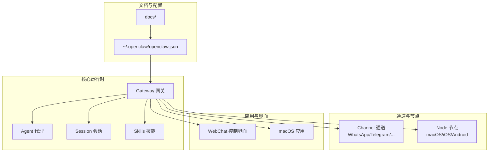
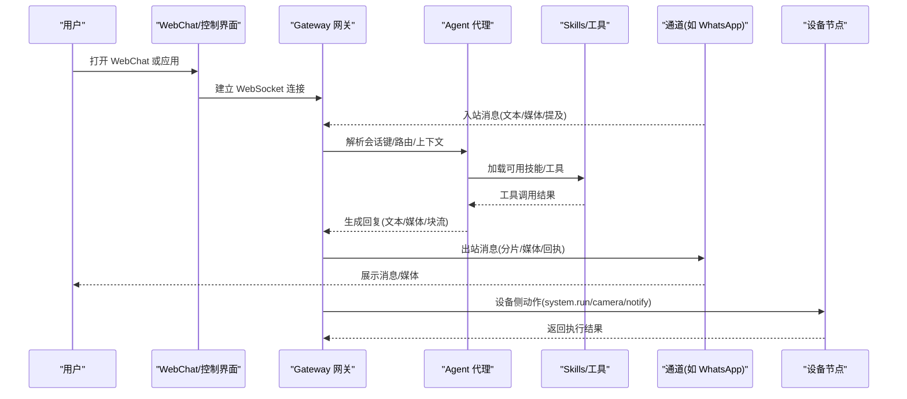
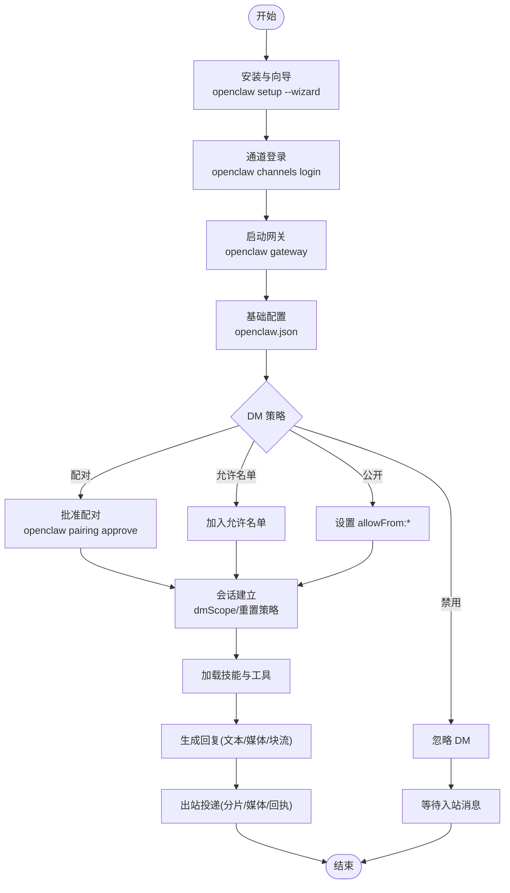
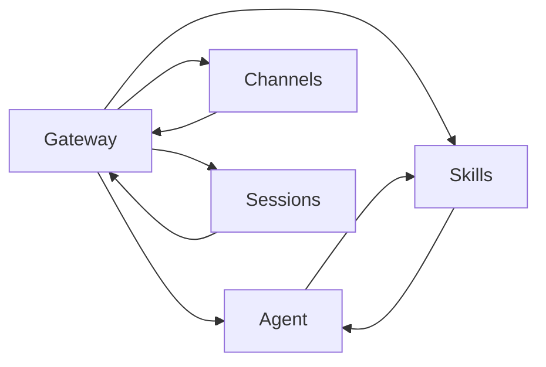

# 个人助理场景

<cite>
**本文引用的文件**
- [README.md](file://README.md)
- [openclaw.md](file://docs/start/openclaw.md)
- [agent.md](file://docs/concepts/agent.md)
- [configuration.md](file://docs/gateway/configuration.md)
- [skills.md](file://docs/tools/skills.md)
- [session.md](file://docs/concepts/session.md)
- [whatsapp.md](file://docs/channels/whatsapp.md)
- [index.md](file://docs/channels/index.md)
- [getting-started.md](file://docs/start/getting-started.md)
</cite>

## 目录
1. [简介](#简介)
2. [项目结构](#项目结构)
3. [核心组件](#核心组件)
4. [架构总览](#架构总览)
5. [详细组件分析](#详细组件分析)
6. [依赖关系分析](#依赖关系分析)
7. [性能考量](#性能考量)
8. [故障排查指南](#故障排查指南)
9. [结论](#结论)
10. [附录](#附录)

## 简介
本文件面向“个人助理场景”的落地实践，基于 OpenClaw 的能力与配置，系统阐述如何将其部署为本地化、可扩展、安全可控的个人 AI 助手。OpenClaw 支持多通道接入（WhatsApp、Telegram、Discord、Slack、Google Chat、Signal、iMessage、BlueBubbles、IRC、Microsoft Teams、Matrix、Feishu、LINE、Mattermost、Nextcloud Talk、Nostr、Synology Chat、Tlon、Twitch、Zalo、Zalo Personal、WebChat），并提供多代理路由、会话管理、工具与技能体系、媒体处理、语音唤醒与通话、Canvas 可视化工作区等能力。

在个人助理场景中，OpenClaw 的核心价值体现在：
- 本地优先：网关作为控制平面，助手运行在你的设备上，确保数据隐私与低延迟
- 多通道统一入口：一个助手账号，覆盖你常用的即时通讯平台
- 可定制的人设与工作流：通过工作空间（AGENTS/SOUL/TOOLS）注入指令、边界与工具
- 安全与可控：默认 DM 配对模式、允许名单、分身沙箱、心跳与会话重置策略
- 可扩展技能：内置与自定义技能，按需加载与权限控制

## 项目结构
OpenClaw 采用模块化设计，核心目录与职责概览如下：
- docs：官方文档，涵盖概念、配置参考、频道接入、安装与运维
- src：核心源码（CLI、命令、网关、通道适配、工具、会话、内存、插件等）
- extensions：第三方通道与技能插件（如 Discord、Telegram、Feishu、Signal、BlueBubbles 等）
- skills：内置技能与工作空间技能目录
- apps：配套应用（macOS 菜单栏、iOS/Android 节点）
- scripts：构建、测试、发布、运维脚本

图表来源
- [configuration.md:10-634](file://docs/gateway/configuration.md#L10-L634)
- [agent.md:1-124](file://docs/concepts/agent.md#L1-L124)
- [index.md:1-48](file://docs/channels/index.md#L1-L48)

章节来源
- [README.md:21-27](file://README.md#L21-L27)
- [index.md:14-48](file://docs/channels/index.md#L14-L48)

## 核心组件
- 网关（Gateway）：WebSocket 控制平面，负责会话、通道、工具、事件与远程访问
- 代理（Agent）：嵌入式 Pi 运行时，读取工作空间文件（AGENTS/SOUL/TOOLS），执行工具与技能
- 会话（Session）：对话上下文持久化与生命周期管理，支持按发送者/通道/账户隔离
- 技能（Skills）：以 AgentSkills 规范编写的技能包，按环境与配置动态加载
- 通道（Channels）：多平台即时通讯接入，支持配对、允许名单、提及门控与分组路由
- 节点（Nodes）：设备侧能力（系统命令、相机、屏幕录制、通知、位置等）

章节来源
- [agent.md:12-124](file://docs/concepts/agent.md#L12-L124)
- [session.md:1-311](file://docs/concepts/session.md#L1-L311)
- [skills.md:1-303](file://docs/tools/skills.md#L1-L303)
- [index.md:14-48](file://docs/channels/index.md#L14-L48)

## 架构总览
下图展示从消息入口到代理执行再到通道回传的整体链路，以及 WebChat 与 macOS 应用的控制面交互。

图表来源
- [configuration.md:10-634](file://docs/gateway/configuration.md#L10-L634)
- [agent.md:1-124](file://docs/concepts/agent.md#L1-L124)
- [session.md:1-311](file://docs/concepts/session.md#L1-L311)
- [whatsapp.md:1-446](file://docs/channels/whatsapp.md#L1-L446)

## 详细组件分析

### 个人助理配置与代理策略
- 默认模型与思考层级
  - 在配置中设置主模型与可选回退模型，并可为不同代理设定别名与优先级
  - 思考层级（thinking）可在代理层或会话层调整，影响推理深度与成本
- 会话与记忆
  - 使用 session.dmScope 控制 DM 隔离级别，避免多用户上下文泄露
  - 通过 reset 机制（每日/空闲）与 /new、/reset 触发器管理会话生命周期
  - 心跳（heartbeat）用于主动检查与汇报，可按需开启与目标通道配置
- 工作空间与注入
  - AGENTS/SOUL/TOOLS/IDENTITY/USER 等文件注入到代理上下文，形成“人设+边界+工具清单”
  - 可禁用首次引导文件创建，直接使用私有仓库中的工作空间

章节来源
- [configuration.md:107-132](file://docs/gateway/configuration.md#L107-L132)
- [session.md:12-56](file://docs/concepts/session.md#L12-L56)
- [agent.md:24-48](file://docs/concepts/agent.md#L24-L48)

### 渠道集成与门控策略
- WhatsApp
  - 推荐使用独立号码；默认 DM 策略为配对模式，未知发件人需批准
  - 支持允许名单、公开 DM（需显式开启）、禁用 DM
  - 分组消息默认需要提及，可通过 mentionPatterns 与 requireMention 控制
  - 文本分片、媒体大小限制、已读回执与 ACK 表情等行为可配置
- Telegram/Discord/Slack/Google Chat/Signal/BlueBubbles/IRC/Microsoft Teams/Matrix/Feishu/LINE/Mattermost/Nextcloud Talk/Nostr/Synology Chat/Tlon/Twitch/Zalo/Zalo Personal/WebChat
  - 各通道均遵循一致的 DM 策略与分组路由模式，支持允许名单、提及门控与健康监控重启
  - 通道登录与凭证存储路径各不相同，详见对应频道文档

章节来源
- [whatsapp.md:24-81](file://docs/channels/whatsapp.md#L24-L81)
- [whatsapp.md:134-200](file://docs/channels/whatsapp.md#L134-L200)
- [whatsapp.md:292-342](file://docs/channels/whatsapp.md#L292-L342)
- [index.md:14-48](file://docs/channels/index.md#L14-L48)

### 对话体验优化
- 媒体与块流
  - 支持图片/视频/音频/文档/贴纸等媒体；发送时自动尺寸压缩与格式转换
  - 块流（block streaming）可按段落/换行合并，减少长文本碎片
- 会话重置与上下文压缩
  - 提供 /compact 指令压缩历史上下文，释放窗口空间
  - 会话维护策略（清理、轮转、磁盘预算）保障长期运行稳定性
- 语音与 Canvas
  - macOS/iOS/Android 支持语音唤醒与连续语音，Canvas 提供可视化工作区

章节来源
- [whatsapp.md:292-342](file://docs/channels/whatsapp.md#L292-L342)
- [session.md:177-245](file://docs/concepts/session.md#L177-L245)
- [agent.md:94-104](file://docs/concepts/agent.md#L94-L104)

### 实际使用流程图（个人助理）
以下流程图展示了从“两号”设置到“日常助理”的端到端使用路径，包括配对、会话隔离、技能加载与回复投递。

图表来源
- [getting-started.md:28-102](file://docs/start/getting-started.md#L28-L102)
- [openclaw.md:32-83](file://docs/start/openclaw.md#L32-L83)
- [configuration.md:135-147](file://docs/gateway/configuration.md#L135-L147)
- [session.md:12-56](file://docs/concepts/session.md#L12-L56)
- [whatsapp.md:134-200](file://docs/channels/whatsapp.md#L134-L200)

## 依赖关系分析
- 组件耦合
  - Gateway 是控制平面，集中管理会话、通道、工具与事件
  - Agent 仅依赖工作空间注入与工具策略，降低外部耦合
  - Skills 通过元数据与 gating 规则在加载期筛选，避免运行期误用
- 外部依赖
  - 模型提供商（OpenAI、Anthropic、自托管等）通过配置与凭据管理
  - 通道插件（extensions/*）按需启用，遵循统一的配置与安全模型
- 循环依赖
  - 无直接循环；通道与技能通过 Gateway 的调度解耦

图表来源
- [configuration.md:10-634](file://docs/gateway/configuration.md#L10-L634)
- [skills.md:13-49](file://docs/tools/skills.md#L13-L49)

章节来源
- [configuration.md:10-634](file://docs/gateway/configuration.md#L10-L634)
- [skills.md:13-49](file://docs/tools/skills.md#L13-L49)

## 性能考量
- 会话维护
  - 合理设置 pruneAfter、maxEntries、rotateBytes、maxDiskBytes 与 highWaterBytes，避免大存储带来的写放大
  - 使用 enforce 模式并结合 dry-run 预览清理效果
- 块流与媒体
  - 块流合并与分片策略减少长文本拆分；媒体自动压缩与首项回退提升鲁棒性
- 模型与工具
  - 选择更稳健的模型与回退策略，避免频繁失败重试
  - 工具与技能按需加载，减少提示词长度与 token 消耗

章节来源
- [session.md:88-176](file://docs/concepts/session.md#L88-L176)
- [agent.md:94-104](file://docs/concepts/agent.md#L94-L104)
- [whatsapp.md:292-342](file://docs/channels/whatsapp.md#L292-L342)

## 故障排查指南
- 安全与权限
  - DM 默认配对模式，未知发件人需批准；可通过 doctor 检查风险配置
  - 多用户共享 DM 上下文存在泄露风险，建议 per-channel-peer 隔离
- 通道问题
  - 未链接/断连：重新登录二维码流程；查看 doctor 与日志
  - 分组消息被忽略：检查 groupPolicy/groupAllowFrom/groups 与提及门控
  - 媒体发送失败：启用首项回退警告，确认大小限制与格式
- 会话问题
  - 会话过多导致写入延迟：调整维护策略与磁盘预算
  - 上下文膨胀：使用 /compact 或调整重置策略

章节来源
- [configuration.md:135-147](file://docs/gateway/configuration.md#L135-L147)
- [session.md:20-56](file://docs/concepts/session.md#L20-L56)
- [whatsapp.md:374-424](file://docs/channels/whatsapp.md#L374-L424)

## 结论
通过合理的代理策略、渠道门控与会话管理，OpenClaw 能够稳定地支撑个人助理场景：在本地运行、多通道统一、可扩展技能、安全可控。建议从“两号”设置与最小配置起步，逐步引入工作空间指令、技能与自动化，最终形成贴合自身需求的个性化助理系统。

## 附录

### 快速开始（个人助理）
- 安装与向导
  - 使用安装脚本安装后，运行向导完成网关、认证与通道配置
- 通道登录
  - 以 WhatsApp 为例，使用 channels login 扫码绑定第二部手机
- 启动网关
  - 前台运行或安装为系统服务，保持常驻
- 基础配置
  - 设置 channels.<provider>.dmPolicy 与 allowFrom，开启 per-channel-peer 隔离
  - 配置 agents.defaults.thinkingDefault、heartbeat、session.reset 等

章节来源
- [getting-started.md:28-102](file://docs/start/getting-started.md#L28-L102)
- [openclaw.md:32-83](file://docs/start/openclaw.md#L32-L83)
- [configuration.md:135-147](file://docs/gateway/configuration.md#L135-L147)

### 配置示例（节选）
- 最小配置（工作空间与 WhatsApp 允许名单）
  - 参考：[最小配置:26-35](file://docs/gateway/configuration.md#L26-L35)
- 个人助理增强配置（模型、思考层级、心跳、分组提及、会话重置）
  - 参考：[个人助理配置示例:105-149](file://docs/start/openclaw.md#L105-L149)
- 会话与记忆（会话文件位置、重置触发、紧凑上下文）
  - 参考：[会话与记忆:151-157](file://docs/start/openclaw.md#L151-L157)
- 心跳（周期与目标）
  - 参考：[心跳配置:158-177](file://docs/start/openclaw.md#L158-L177)

章节来源
- [configuration.md:26-35](file://docs/gateway/configuration.md#L26-L35)
- [openclaw.md:105-177](file://docs/start/openclaw.md#L105-L177)

### 通道接入要点
- WhatsApp
  - 配对/允许名单/公开 DM/禁用 DM 四种 DM 策略
  - 分组消息默认需要提及，支持 mentionPatterns 与 requireMention
  - 文本分片、媒体大小限制、已读回执与 ACK 表情
  - 参考：[WhatsApp 文档:134-200](file://docs/channels/whatsapp.md#L134-L200)
- 其他通道
  - Telegram/Discord/Slack/Google Chat/Signal/BlueBubbles/IRC/Microsoft Teams/Matrix/Feishu/LINE/Mattermost/Nextcloud Talk/Nostr/Synology Chat/Tlon/Twitch/Zalo/Zalo Personal/WebChat
  - 参考：[通道索引:14-48](file://docs/channels/index.md#L14-L48)

章节来源
- [whatsapp.md:134-200](file://docs/channels/whatsapp.md#L134-L200)
- [index.md:14-48](file://docs/channels/index.md#L14-L48)