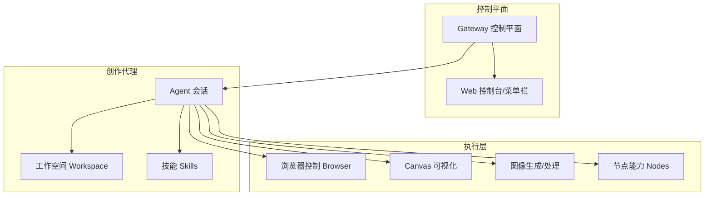
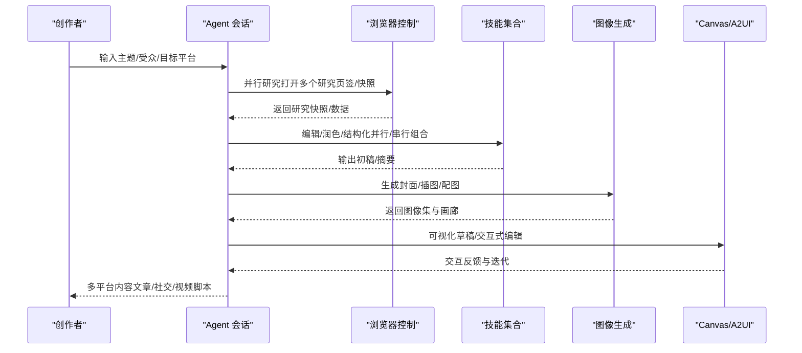
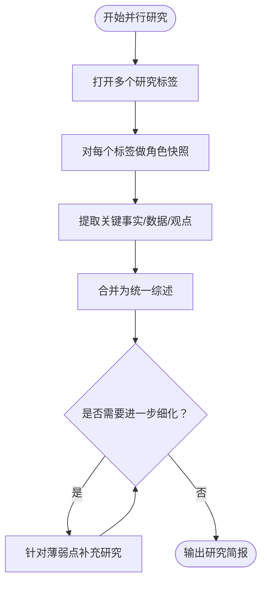
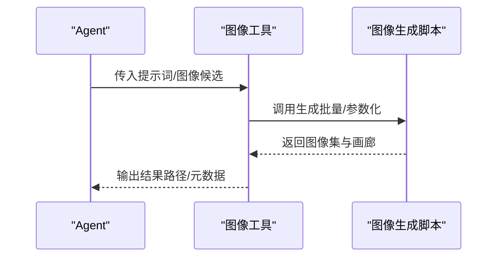
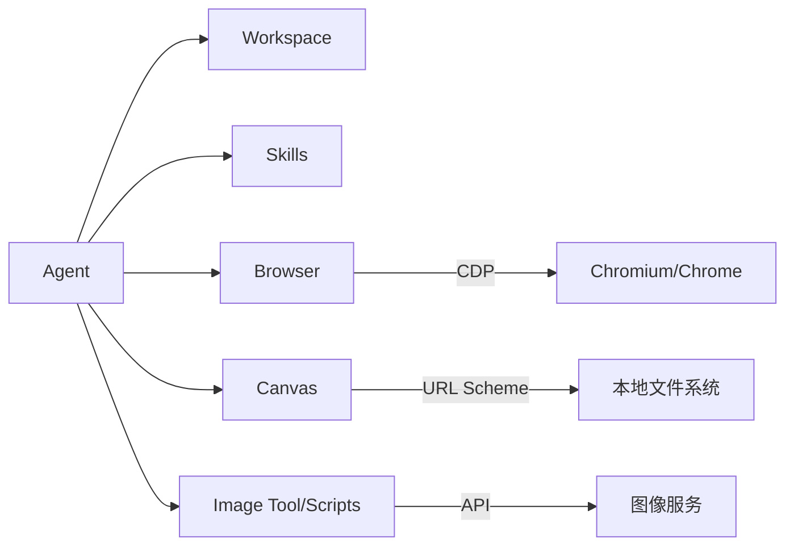

# 内容创作场景

<cite>
**本文引用的文件**   
- [README.md](file://README.md)
- [VISION.md](file://VISION.md)
- [browser.md](file://docs/tools/browser.md)
- [canvas.md](file://docs/platforms/mac/canvas.md)
- [skills.md](file://docs/tools/skills.md)
- [agent-workspace.md](file://docs/concepts/agent-workspace.md)
- [skills-config.md](file://docs/tools/skills-config.md)
- [chrome-extension.md](file://docs/tools/chrome-extension.md)
- [34-content-pipeline.prose](file://extensions/open-prose/skills/prose/examples/34-content-pipeline.prose)
- [17-parallel-research.prose](file://extensions/open-prose/skills/prose/examples/17-parallel-research.prose)
- [gen.py](file://skills/openai-image-gen/scripts/gen.py)
- [image-tool.ts](file://src/agents/tools/image-tool.ts)
</cite>

## 目录
1. [简介](#简介)
2. [项目结构](#项目结构)
3. [核心组件](#核心组件)
4. [架构总览](#架构总览)
5. [详细组件分析](#详细组件分析)
6. [依赖关系分析](#依赖关系分析)
7. [性能考量](#性能考量)
8. [故障排查指南](#故障排查指南)
9. [结论](#结论)
10. [附录](#附录)

## 简介
本文件面向内容创作者，系统化阐述 OpenClaw 在内容创作领域的应用价值与实现路径，覆盖从“选题研究—创意策划—素材采集—视觉设计—多模态生成—发布分发”的全流程。重点包括：
- 如何配置创作代理（Agent）与工作空间（Workspace）
- 如何设置创意工具链（Skills）与浏览器控制（Browser）
- 如何使用 Canvas 进行可视化协作与 A2UI 推送
- 面向不同内容形态（文章、短视频脚本、社交媒体内容）的配置范式与流程图
- 实战建议：如何通过并行研究、多轮编辑、图像生成与社交分发策略提升内容生产效率

## 项目结构
OpenClaw 的内容创作能力由“代理 + 工作空间 + 技能 + 浏览器 + Canvas + 多模态工具”构成，核心要点如下：
- 代理与会话：通过 Gateway 控制平面驱动多代理路由与会话生命周期
- 工作空间：私有、可备份的创作根目录，注入 AGENTS/SOUL/TOOLS 等模板文件
- 技能体系：以 SKILL.md 为载体，按环境/配置/二进制条件进行加载与权限控制
- 浏览器控制：隔离或现有会话接管，支持快照、截图、动作与下载
- Canvas/A2UI：本地可视化工作区，支持推送界面与触发新代理运行
- 多模态工具：图像生成与处理、节点能力（相机、屏幕录制等）

图表来源
- [README.md:185-212](file://README.md#L185-L212)
- [agent-workspace.md:9-23](file://docs/concepts/agent-workspace.md#L9-L23)
- [skills.md:9-27](file://docs/tools/skills.md#L9-L27)
- [browser.md:10-33](file://docs/tools/browser.md#L10-L33)
- [canvas.md:10-43](file://docs/platforms/mac/canvas.md#L10-L43)

章节来源
- [README.md:185-212](file://README.md#L185-L212)
- [agent-workspace.md:9-23](file://docs/concepts/agent-workspace.md#L9-L23)
- [skills.md:9-27](file://docs/tools/skills.md#L9-L27)

## 核心组件
- 创作代理（Agent）
  - 通过会话工具协调跨会话协作，支持思考层级、日志历史检索与消息转发
  - 建议在主会话中启用更强模型与更高思考层级，用于复杂内容编排
- 工作空间（Workspace）
  - 默认位于用户目录下的专用路径，包含 AGENTS/SOUL/TOOLS 等引导文件
  - 支持 Git 私有仓库备份，避免敏感信息进入版本控制
- 技能（Skills）
  - 以 SKILL.md 描述意图、前置条件与调用方式；支持按环境变量/配置/二进制进行加载过滤
  - 支持 ClawHub 注册表安装与同步，便于团队共享
- 浏览器控制（Browser）
  - 提供隔离的 openclaw 专属浏览器、现有会话复用、扩展中继三种模式
  - 支持快照、截图、动作、等待、下载、Cookie/Storage 设置等
- Canvas/A2UI
  - 通过自定义 URL Scheme 挂载本地资源，支持 A2UI v0.8 消息推送
  - 可作为可视化草稿板、交互式编辑器或触发新代理运行的入口
- 多模态工具
  - 图像生成：通过图像工具与脚本生成高质量图片，支持批量与画廊输出
  - 节点能力：相机、屏幕录制、通知等，辅助视频/图文素材采集

章节来源
- [README.md:450-478](file://README.md#L450-L478)
- [agent-workspace.md:64-125](file://docs/concepts/agent-workspace.md#L64-L125)
- [skills.md:106-187](file://docs/tools/skills.md#L106-L187)
- [browser.md:470-531](file://docs/tools/browser.md#L470-L531)
- [canvas.md:44-106](file://docs/platforms/mac/canvas.md#L44-L106)
- [image-tool.ts:301-331](file://src/agents/tools/image-tool.ts#L301-L331)
- [gen.py:243-328](file://skills/openai-image-gen/scripts/gen.py#L243-L328)

## 架构总览
下图展示内容创作从“输入主题”到“产出内容”的端到端流程，强调浏览器研究、并行研究、多轮编辑、图像生成与社交分发的关键步骤。

图表来源
- [browser.md:570-634](file://docs/tools/browser.md#L570-L634)
- [17-parallel-research.prose:1-19](file://extensions/open-prose/skills/prose/examples/17-parallel-research.prose#L1-L19)
- [34-content-pipeline.prose:1-104](file://extensions/open-prose/skills/prose/examples/34-content-pipeline.prose#L1-L104)
- [gen.py:243-328](file://skills/openai-image-gen/scripts/gen.py#L243-L328)
- [canvas.md:107-126](file://docs/platforms/mac/canvas.md#L107-L126)

## 详细组件分析

### 组件一：创作代理与工作空间
- 工作空间布局与文件职责
  - AGENTS/SOUL/TOOLS/USER/IDENTITY 等模板文件在每次会话注入，形成稳定的上下文
  - 支持每日记忆文件与可选长期记忆，便于连续创作
- 会话工具与跨会话协作
  - 使用 sessions_list/history/send 协调多会话任务，减少跨表面切换成本
- 配置建议
  - 将工作空间设为私有 Git 仓库，仅存放非敏感文件
  - 在主会话启用更高思考层级与更强模型，确保复杂内容的连贯性

章节来源
- [agent-workspace.md:64-125](file://docs/concepts/agent-workspace.md#L64-L125)
- [agent-workspace.md:138-201](file://docs/concepts/agent-workspace.md#L138-L201)

### 组件二：技能体系与创意工具链
- 技能加载与过滤
  - 通过 metadata.openclaw 的 requires.bins/env/config 控制是否加载
  - 支持 per-agent env/apiKey 注入，避免全局污染
- 典型内容创作相关技能
  - 网络搜索、摘要、图像生成、Whisper（语音转文字）、PDF/Doc 处理等
- 配置与安装
  - 通过 skills.entries 覆盖默认行为；支持额外扫描目录与自动刷新
  - 安装器优先 brew，也可指定 node 管理器

章节来源
- [skills.md:106-187](file://docs/tools/skills.md#L106-L187)
- [skills-config.md:13-78](file://docs/tools/skills-config.md#L13-L78)

### 组件三：浏览器控制与并行研究
- 模式选择
  - openclaw：隔离、安全、适合自动化验证
  - user/existing-session：复用已登录状态，适合需要登录态的研究
  - chrome-relay：扩展中继，适合现有 Chrome 窗口接管
- 快照与动作
  - 支持 AI 角色快照与交互式快照，结合 ref 执行点击/输入/滚动等操作
  - 支持等待 URL/加载状态/JS 断言，提升稳定性
- 并行研究范式
  - 使用 OpenProse 的 parallel 语法并行获取历史、现状、未来趋势，再统一合成

图表来源
- [browser.md:635-775](file://docs/tools/browser.md#L635-L775)
- [17-parallel-research.prose:1-19](file://extensions/open-prose/skills/prose/examples/17-parallel-research.prose#L1-L19)

章节来源
- [browser.md:46-127](file://docs/tools/browser.md#L46-L127)
- [browser.md:570-634](file://docs/tools/browser.md#L570-L634)
- [17-parallel-research.prose:1-19](file://extensions/open-prose/skills/prose/examples/17-parallel-research.prose#L1-L19)

### 组件四：Canvas 与 A2UI 可视化协作
- Canvas 行为
  - 本地会话级面板，自动重载，支持自定义 URL Scheme 访问
  - 可承载 HTML/CSS/JS 与 A2UI 主机页面，作为草稿板与交互编辑器
- A2UI 推送
  - 支持 beginRendering/surfaceUpdate/dataModelUpdate/deleteSurface 等消息
  - 可通过 Canvas 触发新的代理运行，实现“所见即所得”的创作闭环

章节来源
- [canvas.md:16-43](file://docs/platforms/mac/canvas.md#L16-L43)
- [canvas.md:67-106](file://docs/platforms/mac/canvas.md#L67-L106)
- [canvas.md:107-126](file://docs/platforms/mac/canvas.md#L107-L126)

### 组件五：多模态内容生成（图像）
- 图像工具
  - 支持单图/多图输入，自动去重与大小限制
  - 可与图像生成脚本配合，批量生成并输出画廊
- 图像生成脚本
  - 支持多种参数（尺寸、质量、风格、背景透明度等）
  - 自动生成索引页与提示词清单，便于归档与复用

图表来源
- [image-tool.ts:301-331](file://src/agents/tools/image-tool.ts#L301-L331)
- [gen.py:243-328](file://skills/openai-image-gen/scripts/gen.py#L243-L328)

章节来源
- [image-tool.ts:301-331](file://src/agents/tools/image-tool.ts#L301-L331)
- [gen.py:243-328](file://skills/openai-image-gen/scripts/gen.py#L243-L328)

### 组件六：内容创作流程范式
- 文章写作
  - 输入：主题、受众、平台偏好
  - 步骤：并行研究 → 综合提炼 → 初稿 → 多轮编辑 → 图像补全 → 发布
- 社交媒体内容
  - 输入：主题、平台（Twitter/X、LinkedIn、Hacker News）
  - 步骤：平台适配研究 → 钩子与语气定制 → 分平台草稿 → 交叉校验 → 发布
- 视频脚本
  - 输入：时长、风格、素材清单
  - 步骤：大纲 → 分镜 → 对白 → 配图/音效 → 导出

章节来源
- [34-content-pipeline.prose:1-104](file://extensions/open-prose/skills/prose/examples/34-content-pipeline.prose#L1-L104)
- [browser.md:655-677](file://docs/tools/browser.md#L655-L677)

## 依赖关系分析
- 组件耦合
  - Agent 依赖 Workspace/Skills/Browser/Canvas/Image 工具
  - Browser 与 Canvas/A2UI 通过 Gateway 通信，受安全策略与沙箱模式影响
- 外部依赖
  - 浏览器驱动（Chromium/Chrome）、Playwright（部分高级能力）、节点主机（远程设备能力）
- 安全与权限
  - 浏览器扩展中继涉及现有会话接管，需严格网络隔离与令牌认证
  - 沙箱模式下，host 控制需显式允许，否则默认走 sandbox 浏览器

图表来源
- [browser.md:519-531](file://docs/tools/browser.md#L519-L531)
- [canvas.md:22-33](file://docs/platforms/mac/canvas.md#L22-L33)
- [image-tool.ts:301-331](file://src/agents/tools/image-tool.ts#L301-L331)

章节来源
- [browser.md:519-531](file://docs/tools/browser.md#L519-L531)
- [canvas.md:22-33](file://docs/platforms/mac/canvas.md#L22-L33)
- [image-tool.ts:301-331](file://src/agents/tools/image-tool.ts#L301-L331)

## 性能考量
- 并行研究与多轮编辑
  - 使用 parallel 语法与会话工具减少串行等待，提高吞吐
- 快照与动作
  - 优先使用角色快照（interactive/compact/depth）降低 payload 体积
  - 合理设置等待条件，避免无谓重试
- 图像生成
  - 批量生成前先评估提示词与数量，控制输出目录与缓存
- 沙箱与远程
  - 沙箱内二进制需预置；远程节点需稳定网络与认证

## 故障排查指南
- 浏览器扩展中继
  - 现象：徽章显示“!”
  - 排查：确认 Gateway 令牌一致、本地 relay 可达、扩展选项页验证
- 现有会话复用
  - 现象：无法连接/被拒绝
  - 排查：确认 Chrome DevTools MCP 开启、同意连接提示、版本满足要求
- 沙箱模式
  - 现象：无法接管 host 浏览器
  - 排查：开启 allowHostControl 或在工具调用时显式 target="host"
- Canvas 权限
  - 现象：Canvas 面板不可用
  - 排查：检查设置中的“允许 Canvas”，或禁用后重新启用

章节来源
- [chrome-extension.md:112-122](file://docs/tools/chrome-extension.md#L112-L122)
- [browser.md:402-433](file://docs/tools/browser.md#L402-L433)
- [browser.md:318-325](file://docs/tools/browser.md#L318-L325)
- [canvas.md:41-43](file://docs/platforms/mac/canvas.md#L41-L43)

## 结论
OpenClaw 通过“代理 + 工作空间 + 技能 + 浏览器 + Canvas + 多模态工具”的组合，为内容创作提供了从研究、策划、素材到生成与发布的全链路自动化支撑。借助并行研究、多轮编辑、图像生成与可视化协作，创作者可以显著提升内容生产的效率与一致性。建议在主会话中启用更强模型与更高思考层级，并通过私有工作空间与 Git 备份保障创作资产的安全与可追溯。

## 附录
- 快速上手
  - 使用向导完成网关、通道与技能的初始化
  - 在工作空间中维护 AGENTS/SOUL/TOOLS 等模板文件
- 最佳实践
  - 将敏感信息保留在凭据管理器或环境变量中，不在工作空间中存储明文密钥
  - 使用 Canvas 作为可视化草稿板，结合 A2UI 推送实现交互式编辑
  - 通过 ClawHub 安装与同步团队常用技能，保持工具链一致

章节来源
- [README.md:28-31](file://README.md#L28-L31)
- [agent-workspace.md:202-222](file://docs/concepts/agent-workspace.md#L202-L222)
- [canvas.md:67-106](file://docs/platforms/mac/canvas.md#L67-L106)
- [skills.md:50-68](file://docs/tools/skills.md#L50-L68)