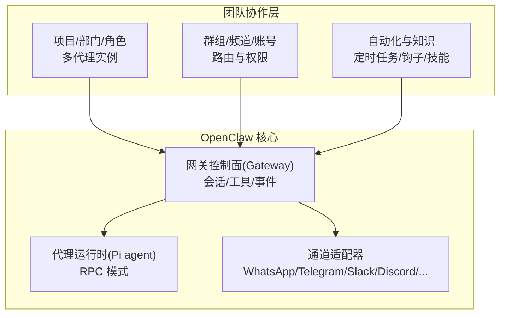
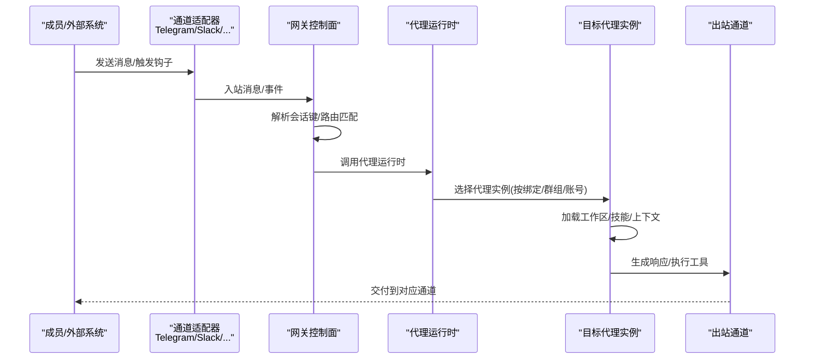
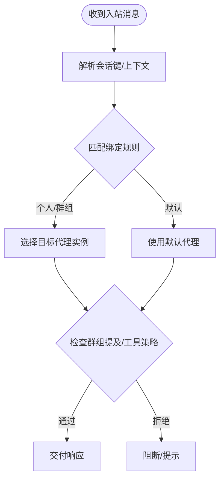
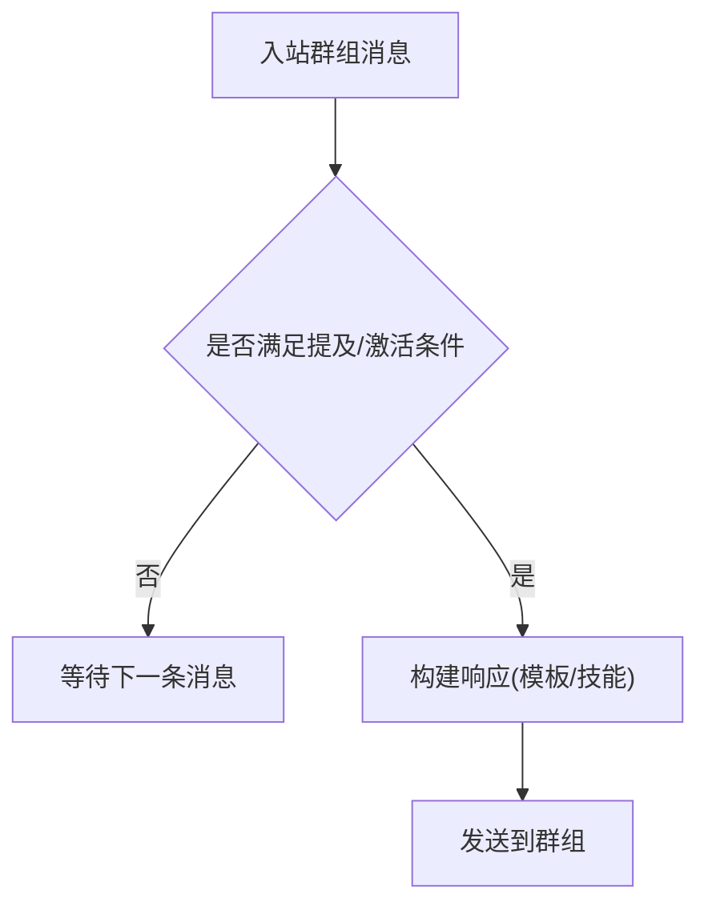
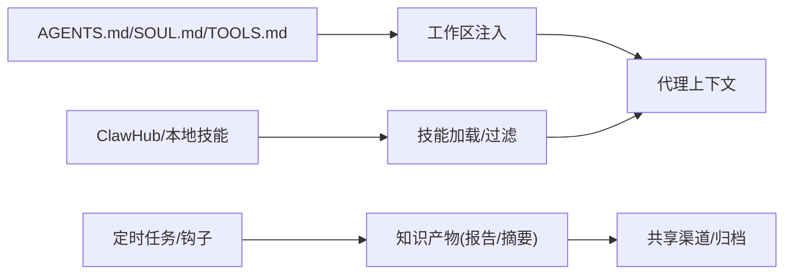
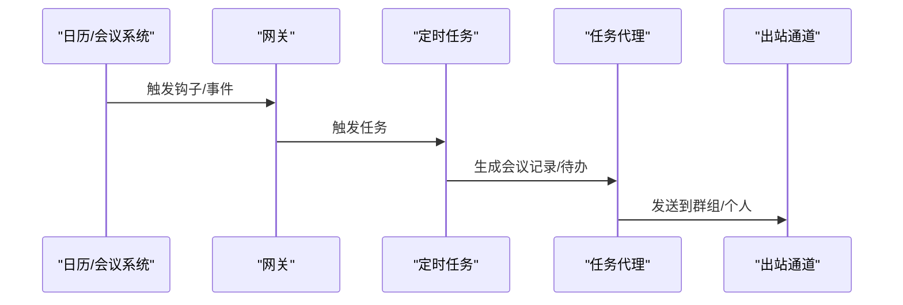
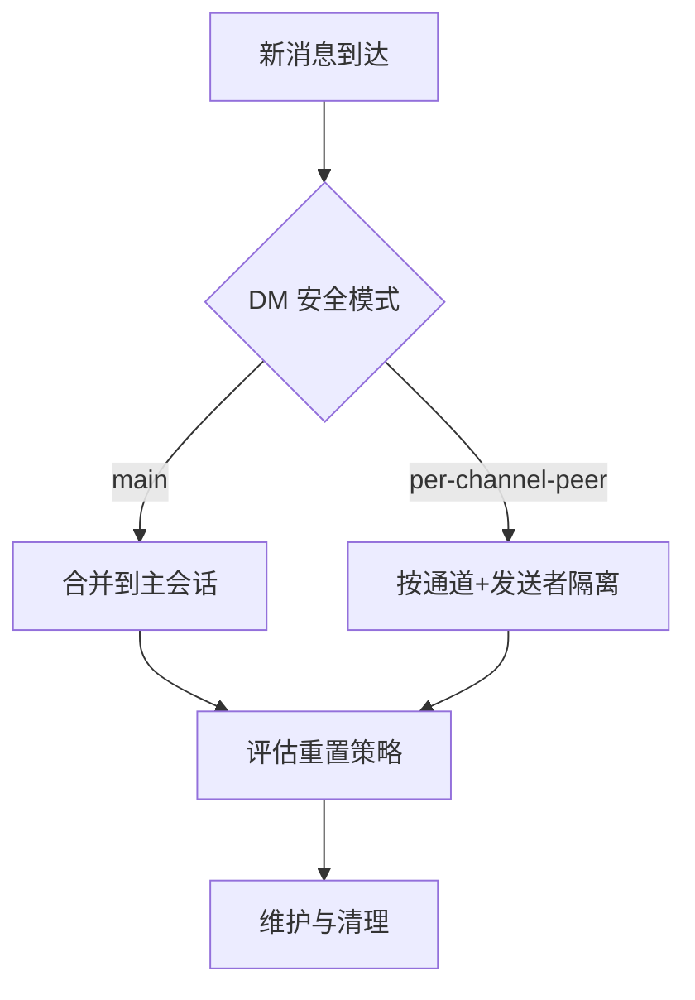
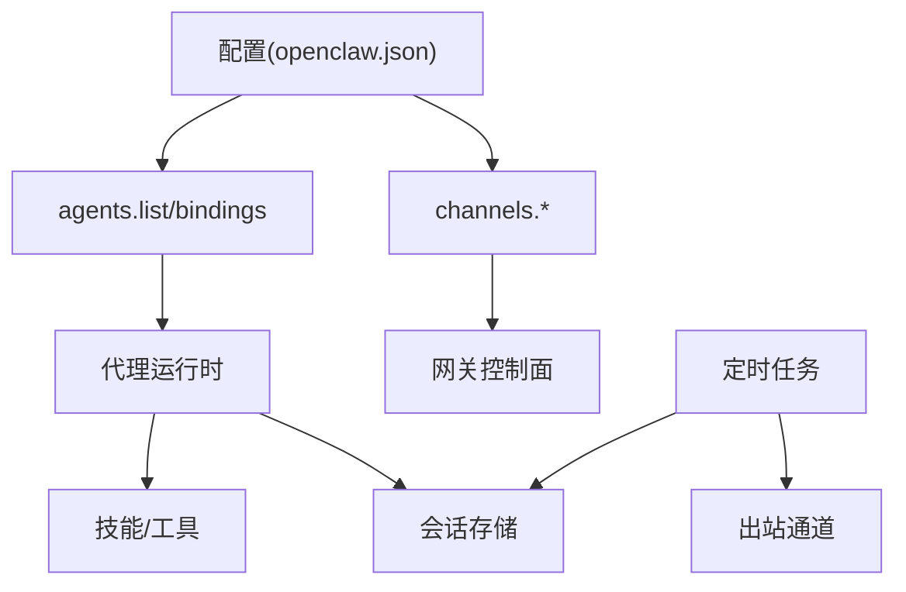
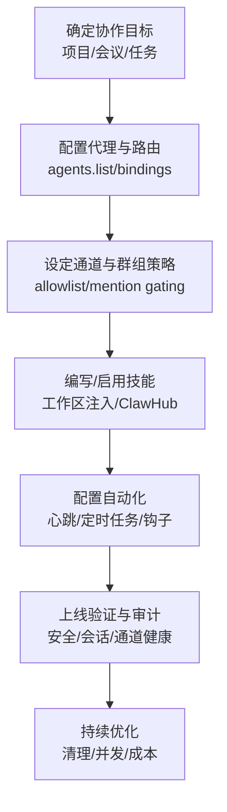

# 团队协作场景

<cite>
**本文档引用的文件**
- [README.md](file://README.md)
- [AGENTS.md](file://AGENTS.md)
- [docs/gateway/configuration.md](file://docs/gateway/configuration.md)
- [docs/channels/channel-routing.md](file://docs/channels/channel-routing.md)
- [docs/concepts/multi-agent.md](file://docs/concepts/multi-agent.md)
- [docs/concepts/agent.md](file://docs/concepts/agent.md)
- [docs/tools/skills.md](file://docs/tools/skills.md)
- [docs/automation/cron-jobs.md](file://docs/automation/cron-jobs.md)
- [docs/concepts/session.md](file://docs/concepts/session.md)
</cite>

## 目录
1. [简介](#简介)
2. [项目结构](#项目结构)
3. [核心组件](#核心组件)
4. [架构总览](#架构总览)
5. [详细组件分析](#详细组件分析)
6. [依赖关系分析](#依赖关系分析)
7. [性能考量](#性能考量)
8. [故障排查指南](#故障排查指南)
9. [结论](#结论)
10. [附录](#附录)

## 简介
本文件面向团队协作场景，系统化阐述 OpenClaw 在多用户、多渠道、多代理环境下的应用价值与落地方式。围绕项目管理、会议记录、任务分配、知识共享等典型需求，给出可操作的配置方案与流程图，帮助团队通过多代理路由、群组激活模式、权限与安全策略、自动化调度等能力，显著提升协作效率与信息一致性。

## 项目结构
OpenClaw 提供统一的网关控制面（Gateway）与多通道接入能力，支持跨平台设备与插件生态。团队协作的关键在于：
- 多代理路由：按项目/角色/部门隔离工作空间与会话
- 渠道路由与群组激活：确保消息只在授权范围内流转
- 自动化与知识沉淀：通过定时任务、钩子与技能体系沉淀经验
- 安全与权限：基于配对、白名单与沙箱的访问控制

章节来源
- [README.md: 126-176:126-176](file://README.md#L126-L176)
- [docs/concepts/multi-agent.md: 8-40:8-40](file://docs/concepts/multi-agent.md#L8-L40)

## 核心组件
- 多代理路由与工作区隔离：每个代理拥有独立工作区、状态目录与会话存储，适合按项目/部门/角色划分
- 通道路由与群组激活：支持提及门禁、线程绑定、主 DM 路由固定等，保障信息精准触达
- 自动化与知识沉淀：通过心跳、定时任务、钩子与技能体系，形成例行检查、知识库与可复用工具
- 安全与权限：默认 DM 配对、允许列表、开放 DM 的显式开关、群组策略与工具策略

章节来源
- [docs/concepts/multi-agent.md: 48-120:48-120](file://docs/concepts/multi-agent.md#L48-L120)
- [docs/channels/channel-routing.md: 58-92:58-92](file://docs/channels/channel-routing.md#L58-L92)
- [docs/gateway/configuration.md: 390-410:390-410](file://docs/gateway/configuration.md#L390-L410)
- [docs/concepts/session.md: 20-56:20-56](file://docs/concepts/session.md#L20-L56)

## 架构总览
下图展示团队协作中“消息入口—路由—代理—通道—交付”的闭环，强调多代理与群组激活模式的协同：

图表来源
- [docs/channels/channel-routing.md: 58-92:58-92](file://docs/channels/channel-routing.md#L58-L92)
- [docs/concepts/multi-agent.md: 172-194:172-194](file://docs/concepts/multi-agent.md#L172-L194)

章节来源
- [docs/channels/channel-routing.md: 14-44:14-44](file://docs/channels/channel-routing.md#L14-L44)
- [docs/concepts/multi-agent.md: 172-216:172-216](file://docs/concepts/multi-agent.md#L172-L216)

## 详细组件分析

### 多代理路由与团队权限管理
- 多代理实例：为不同项目/部门/角色创建独立代理，分别配置工作区、模型与工具策略
- 绑定规则：按通道、账号、群组/个人进行精确路由，避免跨域信息泄露
- 权限与安全：默认 DM 配对、允许列表、开放 DM 的显式开关；群组要求提及；工具策略按代理细化

图表来源
- [docs/channels/channel-routing.md: 58-92:58-92](file://docs/channels/channel-routing.md#L58-L92)
- [docs/concepts/multi-agent.md: 172-194:172-194](file://docs/concepts/multi-agent.md#L172-L194)

章节来源
- [docs/concepts/multi-agent.md: 48-120:48-120](file://docs/concepts/multi-agent.md#L48-L120)
- [docs/gateway/configuration.md: 390-410:390-410](file://docs/gateway/configuration.md#L390-L410)

### 群组激活模式与自动回复模板
- 群组激活：支持“提及激活”“始终激活”，结合群组允许列表与提及模式，确保只有授权人员触发响应
- 自动回复模板：通过技能与工作区注入文件实现，结合定时任务定期生成摘要/提醒

图表来源
- [docs/channels/channel-routing.md: 149-176:149-176](file://docs/channels/channel-routing.md#L149-L176)
- [docs/concepts/agent.md: 24-42:24-42](file://docs/concepts/agent.md#L24-L42)

章节来源
- [docs/channels/channel-routing.md: 149-176:149-176](file://docs/channels/channel-routing.md#L149-L176)
- [docs/concepts/agent.md: 24-42:24-42](file://docs/concepts/agent.md#L24-L42)

### 项目管理与知识共享
- 工作区注入：AGENTS.md/SOUL.md/TOOLS.md 等文件作为“记忆与边界”，统一团队规范与工具使用约定
- 技能体系：通过技能注册表与本地/共享技能目录，沉淀可复用工具与流程
- 知识沉淀：通过定时任务生成日报/周报，或通过钩子对接外部系统（如邮件/日历）

图表来源
- [docs/concepts/agent.md: 24-42:24-42](file://docs/concepts/agent.md#L24-L42)
- [docs/tools/skills.md: 13-40:13-40](file://docs/tools/skills.md#L13-L40)

章节来源
- [docs/concepts/agent.md: 24-42:24-42](file://docs/concepts/agent.md#L24-L42)
- [docs/tools/skills.md: 13-40:13-40](file://docs/tools/skills.md#L13-L40)

### 会议记录与任务分配
- 会议记录：通过定时任务或钩子触发，将会议纪要/待办项写入共享工作区或知识库
- 任务分配：结合群组激活与工具策略，将任务分派至对应代理/角色，并通过通道回传进度

图表来源
- [docs/automation/cron-jobs.md: 107-178:107-178](file://docs/automation/cron-jobs.md#L107-L178)
- [docs/gateway/configuration.md: 357-388:357-388](file://docs/gateway/configuration.md#L357-L388)

章节来源
- [docs/automation/cron-jobs.md: 107-178:107-178](file://docs/automation/cron-jobs.md#L107-L178)
- [docs/gateway/configuration.md: 357-388:357-388](file://docs/gateway/configuration.md#L357-L388)

### 会话生命周期与安全隔离
- DM 安全模式：在多用户共享入口场景下，建议启用 per-channel-peer 或 per-account-channel-peer，避免上下文交叉
- 会话重置策略：按类型/通道/每日/空闲重置，结合清理策略控制存储规模
- 身份链接：同一人跨通道时合并会话，提升连续性

图表来源
- [docs/concepts/session.md: 20-56:20-56](file://docs/concepts/session.md#L20-L56)
- [docs/concepts/session.md: 177-217:177-217](file://docs/concepts/session.md#L177-L217)

章节来源
- [docs/concepts/session.md: 20-56:20-56](file://docs/concepts/session.md#L20-L56)
- [docs/concepts/session.md: 177-217:177-217](file://docs/concepts/session.md#L177-L217)

## 依赖关系分析
- 多代理与通道路由：通过 agents.list/bindings 与 channels.* 配置耦合，决定消息流向与执行主体
- 技能与工具策略：技能加载与工具策略共同影响代理行为，需与安全策略协同
- 自动化与会话：定时任务与会话键绑定，确保产出可追溯且不污染主会话

图表来源
- [docs/gateway/configuration.md: 390-410:390-410](file://docs/gateway/configuration.md#L390-L410)
- [docs/concepts/multi-agent.md: 172-216:172-216](file://docs/concepts/multi-agent.md#L172-L216)

章节来源
- [docs/gateway/configuration.md: 390-410:390-410](file://docs/gateway/configuration.md#L390-L410)
- [docs/concepts/multi-agent.md: 172-216:172-216](file://docs/concepts/multi-agent.md#L172-L216)

## 性能考量
- 多代理与会话存储：合理设置会话维护策略（条目上限、保留期、磁盘预算），避免大存储带来的写放大
- 定时任务与并发：限制并发运行数、合理设置会话保留与运行日志裁剪，降低 IO 压力
- 工作区与技能：按需加载技能，减少系统提示词长度带来的 token 成本

章节来源
- [docs/concepts/session.md: 74-120:74-120](file://docs/concepts/session.md#L74-L120)
- [docs/automation/cron-jobs.md: 487-521:487-521](file://docs/automation/cron-jobs.md#L487-L521)
- [docs/tools/skills.md: 242-247:242-247](file://docs/tools/skills.md#L242-L247)

## 故障排查指南
- 配置校验与修复：严格模式下未知键/类型错误会导致网关停机，应使用诊断命令定位并修复
- 通道健康监控：针对异常停滞的通道，可调整健康检查参数与重启阈值
- 会话与清理：使用清理命令预演或强制执行，确保会话存储在可控范围内
- 安全审计：通过安全审计命令检查 DM 策略与群组策略是否符合预期

章节来源
- [docs/gateway/configuration.md: 61-73:61-73](file://docs/gateway/configuration.md#L61-L73)
- [docs/concepts/session.md: 170-176:170-176](file://docs/concepts/session.md#L170-L176)
- [AGENTS.md: 201-204:201-204](file://AGENTS.md#L201-L204)

## 结论
通过多代理路由、群组激活模式、权限与安全策略、自动化与知识沉淀，OpenClaw 能够有效支撑团队在多渠道、多角色场景下的协作。建议从“最小可用”开始：先建立项目/角色代理、配置通道与群组策略，再逐步引入定时任务与技能体系，最终形成稳定的知识与流程闭环。

## 附录

### 团队协作流程图（概念）

[此图为概念流程，无需图表来源]

### 配置示例（路径指引）
- 多代理路由与绑定
  - 参考：[docs/gateway/configuration.md: 390-410:390-410](file://docs/gateway/configuration.md#L390-L410)
  - 参考：[docs/concepts/multi-agent.md: 172-216:172-216](file://docs/concepts/multi-agent.md#L172-L216)
- 群组激活与提及门禁
  - 参考：[docs/channels/channel-routing.md: 149-176:149-176](file://docs/channels/channel-routing.md#L149-L176)
- 会话安全与重置策略
  - 参考：[docs/concepts/session.md: 20-56:20-56](file://docs/concepts/session.md#L20-L56)
  - 参考：[docs/concepts/session.md: 177-217:177-217](file://docs/concepts/session.md#L177-L217)
- 自动化与钩子
  - 参考：[docs/gateway/configuration.md: 357-388:357-388](file://docs/gateway/configuration.md#L357-L388)
  - 参考：[docs/automation/cron-jobs.md: 107-178:107-178](file://docs/automation/cron-jobs.md#L107-L178)
- 技能与知识沉淀
  - 参考：[docs/concepts/agent.md: 24-42:24-42](file://docs/concepts/agent.md#L24-L42)
  - 参考：[docs/tools/skills.md: 13-40:13-40](file://docs/tools/skills.md#L13-L40)