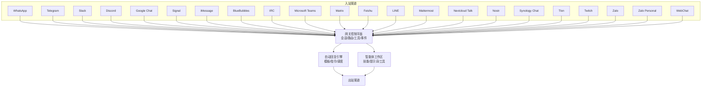
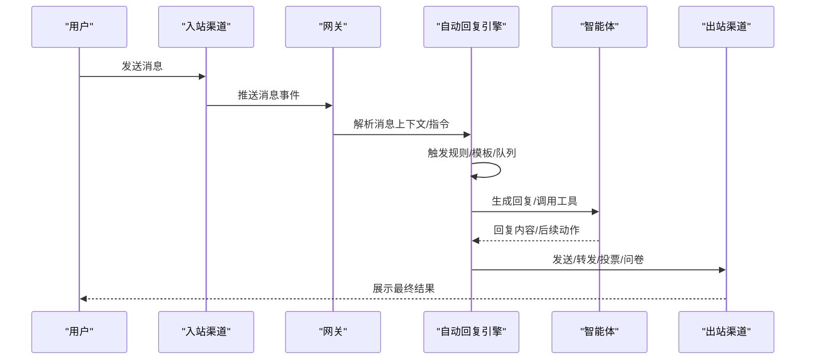
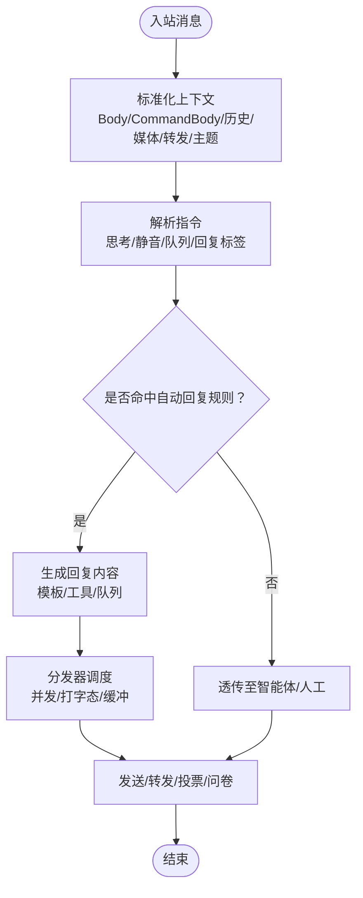
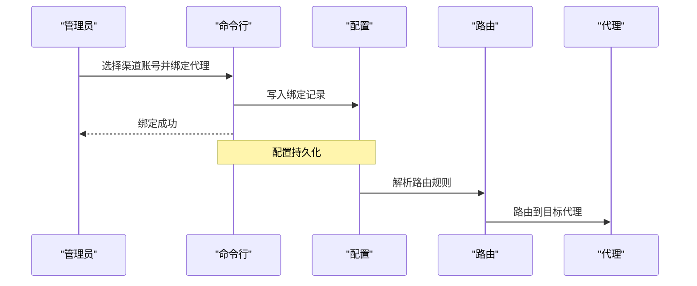
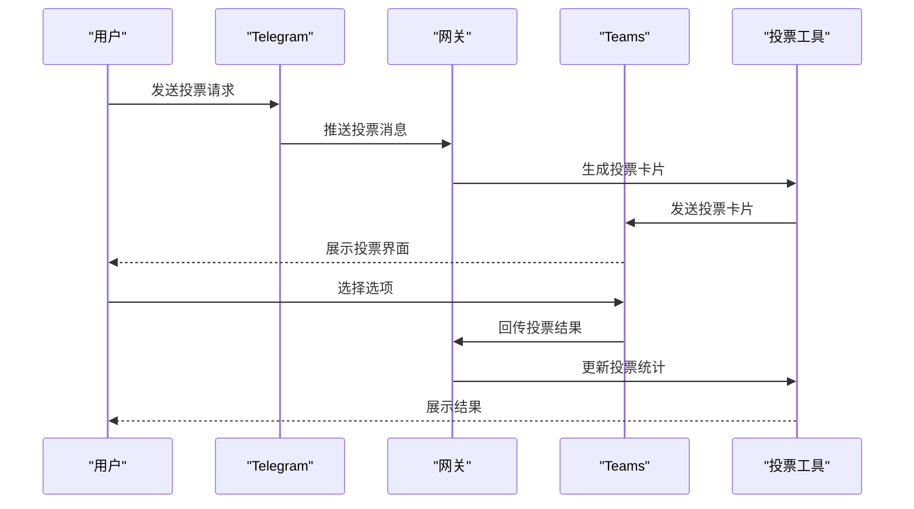
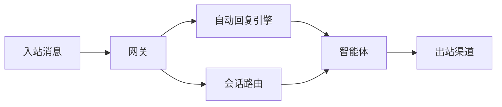
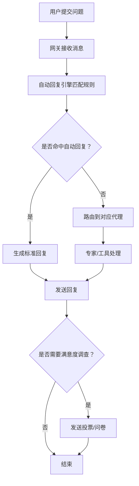

# 客户服务场景

<cite>
**本文引用的文件**
- [README.md](file://README.md)
- [AGENTS.md](file://AGENTS.md)
- [src/auto-reply/dispatch.ts](file://src/auto-reply/dispatch.ts)
- [src/auto-reply/reply.ts](file://src/auto-reply/reply.ts)
- [src/auto-reply/templating.ts](file://src/auto-reply/templating.ts)
- [src/commands/channels/add.ts](file://src/commands/channels/add.ts)
- [src/config/legacy.shared.ts](file://src/config/legacy.shared.ts)
- [src/routing/resolve-route.ts](file://src/routing/resolve-route.ts)
- [src/routing/bindings.ts](file://src/routing/bindings.ts)
- [src/config/types.queue.ts](file://src/config/types.queue.ts)
- [src/agents/tools/session-status-tool.ts](file://src/agents/tools/session-status-tool.ts)
- [extensions/telegram/src/bot/reply-threading.ts](file://extensions/telegram/src/bot/reply-threading.ts)
- [extensions/msteams/src/polls.ts](file://extensions/msteams/src/polls.ts)
- [extensions/msteams/src/outbound.ts](file://extensions/msteams/src/outbound.ts)
- [docs/zh-CN/automation/poll.md](file://docs/zh-CN/automation/poll.md)
</cite>

## 目录
1. [引言](#引言)
2. [项目结构](#项目结构)
3. [核心组件](#核心组件)
4. [架构总览](#架构总览)
5. [详细组件分析](#详细组件分析)
6. [依赖关系分析](#依赖关系分析)
7. [性能考量](#性能考量)
8. [故障排查指南](#故障排查指南)
9. [结论](#结论)
10. [附录](#附录)

## 引言
本文件面向“客户服务场景”的落地实践，基于 OpenClaw 的多通道接入、多智能体路由与自动回复能力，为企业构建“智能客服机器人 + 工单管理 + 客户问题分类 + 服务流程自动化”的完整体系提供可操作的配置方案与流程图。读者将学会：
- 如何配置客户服务代理与会话路由
- 如何设置自动回复规则与触发条件
- 如何为不同产品线配置专门的客服代理
- 如何设置优先级处理流程与满意度调查
- 如何通过渠道能力实现服务流程自动化（如投票/问卷）

## 项目结构
OpenClaw 提供统一的网关控制平面与多通道接入层，结合自动回复引擎与会话路由机制，形成“入站消息—智能体决策—自动回复/转人工—后续流程”的闭环。

图表来源
- [README.md:151-154](file://README.md#L151-L154)
- [README.md:188-202](file://README.md#L188-L202)

章节来源
- [README.md:151-154](file://README.md#L151-L154)
- [README.md:188-202](file://README.md#L188-L202)

## 核心组件
- 自动回复引擎：负责解析入站消息、提取指令、生成回复、执行队列与打字态等。
- 会话与路由：根据渠道账号、会话键、主题/话题等信息，将消息路由至指定智能体或会话。
- 智能体工作区：承载提示词、技能与工具，支持按产品线/业务域拆分代理。
- 多渠道适配：针对不同渠道的特性（如 Telegram 的回复到原消息、Teams 的投票卡片）进行差异化处理。

章节来源
- [src/auto-reply/dispatch.ts:35-98](file://src/auto-reply/dispatch.ts#L35-L98)
- [src/auto-reply/templating.ts:14-182](file://src/auto-reply/templating.ts#L14-L182)
- [src/routing/resolve-route.ts](file://src/routing/resolve-route.ts)
- [src/routing/bindings.ts](file://src/routing/bindings.ts)

## 架构总览
下图展示从入站消息到自动回复与后续流程的关键交互：

图表来源
- [src/auto-reply/dispatch.ts:35-98](file://src/auto-reply/dispatch.ts#L35-L98)
- [src/auto-reply/reply.ts:1-12](file://src/auto-reply/reply.ts#L1-L12)
- [src/auto-reply/templating.ts:14-182](file://src/auto-reply/templating.ts#L14-L182)

## 详细组件分析

### 组件A：自动回复与消息分发
- 功能要点
  - 入站消息上下文标准化：统一 Body/CommandBody/历史/媒体/转发/主题等字段，便于模板与规则匹配。
  - 指令解析：支持思考级别、静音级别、队列指令、回复标签等。
  - 分发器：在并发/打字态/缓冲场景中安全地调度回复。
- 关键路径
  - dispatchInboundMessage：完成上下文归一化后，委托给配置驱动的回复生成器。
  - getReplyFromConfig：依据配置与模板生成最终回复。
  - applyTemplate：对模板字符串进行占位符替换。

图表来源
- [src/auto-reply/dispatch.ts:35-98](file://src/auto-reply/dispatch.ts#L35-L98)
- [src/auto-reply/reply.ts:1-12](file://src/auto-reply/reply.ts#L1-L12)
- [src/auto-reply/templating.ts:14-182](file://src/auto-reply/templating.ts#L14-L182)

章节来源
- [src/auto-reply/dispatch.ts:35-98](file://src/auto-reply/dispatch.ts#L35-L98)
- [src/auto-reply/reply.ts:1-12](file://src/auto-reply/reply.ts#L1-L12)
- [src/auto-reply/templating.ts:14-182](file://src/auto-reply/templating.ts#L14-L182)

### 组件B：会话路由与代理绑定
- 功能要点
  - 基于渠道与账号的绑定：将特定账号路由到指定代理（如产品线专属客服）。
  - 默认代理解析：当未显式绑定时，回退到默认代理或首个代理。
  - 会话键连续性：确保同一对话在不同轮次保持同一会话键。
- 关键路径
  - applyAgentBindings：将渠道账号与代理绑定写入配置。
  - resolveDefaultAgentIdFromRaw：解析默认代理ID。
  - resolve-route：根据上下文计算目标代理与会话键。

图表来源
- [src/commands/channels/add.ts:110-146](file://src/commands/channels/add.ts#L110-L146)
- [src/config/legacy.shared.ts:92-119](file://src/config/legacy.shared.ts#L92-L119)
- [src/routing/resolve-route.ts](file://src/routing/resolve-route.ts)
- [src/routing/bindings.ts](file://src/routing/bindings.ts)

章节来源
- [src/commands/channels/add.ts:110-146](file://src/commands/channels/add.ts#L110-L146)
- [src/config/legacy.shared.ts:92-119](file://src/config/legacy.shared.ts#L92-L119)
- [src/routing/resolve-route.ts](file://src/routing/resolve-route.ts)
- [src/routing/bindings.ts](file://src/routing/bindings.ts)

### 组件C：渠道特性与流程自动化
- Telegram：支持回复到原消息、避免重复回复、标记已回复/已投递。
- Microsoft Teams：支持投票卡片（Adaptive Cards），记录投票结果并持久化。
- 投票工具：跨渠道统一的投票能力，支持多选/时长/渠道差异。

图表来源
- [extensions/telegram/src/bot/reply-threading.ts:15-33](file://extensions/telegram/src/bot/reply-threading.ts#L15-L33)
- [extensions/msteams/src/outbound.ts:41-65](file://extensions/msteams/src/outbound.ts#L41-L65)
- [extensions/msteams/src/polls.ts:136-155](file://extensions/msteams/src/polls.ts#L136-L155)
- [docs/zh-CN/automation/poll.md:54-77](file://docs/zh-CN/automation/poll.md#L54-L77)

章节来源
- [extensions/telegram/src/bot/reply-threading.ts:15-33](file://extensions/telegram/src/bot/reply-threading.ts#L15-L33)
- [extensions/msteams/src/outbound.ts:41-65](file://extensions/msteams/src/outbound.ts#L41-L65)
- [extensions/msteams/src/polls.ts:136-155](file://extensions/msteams/src/polls.ts#L136-L155)
- [docs/zh-CN/automation/poll.md:54-77](file://docs/zh-CN/automation/poll.md#L54-L77)

### 组件D：队列与优先级处理
- 功能要点
  - 支持多种队列模式：引导/跟进/收集/中断/队列等。
  - 队列丢弃策略：旧消息/新消息/摘要。
  - 会话状态工具：显示当前时间、队列深度、队列覆盖项等。
- 应用场景
  - 高峰期自动排队，按优先级处理。
  - 对复杂问题自动分流至专家代理。

章节来源
- [src/config/types.queue.ts:1-22](file://src/config/types.queue.ts#L1-L22)
- [src/agents/tools/session-status-tool.ts:403-419](file://src/agents/tools/session-status-tool.ts#L403-L419)

## 依赖关系分析
- 入站消息经由网关进入自动回复引擎，再由智能体决定是否调用工具或直接回复。
- 会话路由依赖配置中的代理绑定与默认代理解析逻辑。
- 渠道适配器（Telegram/Teams 等）提供差异化能力（回复到原消息、投票卡片）。

图表来源
- [src/auto-reply/dispatch.ts:35-98](file://src/auto-reply/dispatch.ts#L35-L98)
- [src/routing/resolve-route.ts](file://src/routing/resolve-route.ts)
- [src/routing/bindings.ts](file://src/routing/bindings.ts)

章节来源
- [src/auto-reply/dispatch.ts:35-98](file://src/auto-reply/dispatch.ts#L35-L98)
- [src/routing/resolve-route.ts](file://src/routing/resolve-route.ts)
- [src/routing/bindings.ts](file://src/routing/bindings.ts)

## 性能考量
- 并发与资源释放：分发器在所有退出路径均释放保留资源，避免阻塞。
- 打字态与缓冲：在高并发场景启用打字态与缓冲，提升用户体验。
- 队列深度与丢弃策略：合理设置队列容量与丢弃策略，平衡吞吐与公平性。
- 会话状态可视化：通过会话状态工具输出队列深度与时区信息，辅助运维监控。

章节来源
- [src/auto-reply/dispatch.ts:17-33](file://src/auto-reply/dispatch.ts#L17-L33)
- [src/agents/tools/session-status-tool.ts:403-419](file://src/agents/tools/session-status-tool.ts#L403-L419)

## 故障排查指南
- 渠道配对与允许列表
  - 默认 DM 策略：未知发件人需先配对，批准后方可接收消息。
  - 开放 DM 需显式开启允许列表与配对策略。
- 代理绑定确认
  - 使用命令行将渠道账号绑定到目标代理，并验证默认代理解析。
- 投票/问卷异常
  - Teams 投票依赖网关在线并将结果持久化；检查网关健康与存储。
  - 不同渠道的投票参数与限制存在差异，需按文档校验。

章节来源
- [README.md:118-124](file://README.md#L118-L124)
- [src/commands/channels/add.ts:110-146](file://src/commands/channels/add.ts#L110-L146)
- [extensions/msteams/src/outbound.ts:41-65](file://extensions/msteams/src/outbound.ts#L41-L65)
- [docs/zh-CN/automation/poll.md:54-77](file://docs/zh-CN/automation/poll.md#L54-L77)

## 结论
通过将“自动回复引擎 + 会话路由 + 渠道适配 + 队列与优先级”整合，OpenClaw 可以支撑企业构建高效、可扩展的客户服务系统。建议以产品线/业务域划分代理，结合渠道特性（如投票/问卷）完善服务流程自动化，并通过队列与优先级策略保障高峰期的服务质量。

## 附录

### A. 客户服务场景配置清单（步骤化）
- 步骤1：配置渠道与账号
  - 在各渠道完成认证与允许列表配置。
  - 参考：[README.md:340-403](file://README.md#L340-L403)
- 步骤2：创建/选择代理
  - 在配置中定义多个代理，区分产品线或业务域。
  - 参考：[src/config/legacy.shared.ts:92-119](file://src/config/legacy.shared.ts#L92-L119)
- 步骤3：绑定渠道账号到代理
  - 使用命令行将具体账号绑定到对应代理。
  - 参考：[src/commands/channels/add.ts:110-146](file://src/commands/channels/add.ts#L110-L146)
- 步骤4：设置自动回复规则
  - 在代理提示词/模板中定义常见问题的自动回复与触发条件。
  - 参考：[src/auto-reply/reply.ts:1-12](file://src/auto-reply/reply.ts#L1-L12)
- 步骤5：配置队列与优先级
  - 设置队列模式与丢弃策略，必要时为高优问题设置优先通道。
  - 参考：[src/config/types.queue.ts:1-22](file://src/config/types.queue.ts#L1-L22)
- 步骤6：启用满意度调查/投票
  - 使用投票工具在服务结束时发起满意度调查。
  - 参考：[docs/zh-CN/automation/poll.md:54-77](file://docs/zh-CN/automation/poll.md#L54-L77)

### B. 客户服务流程图（概念示意）

[此图为概念流程，不直接映射具体源码文件]