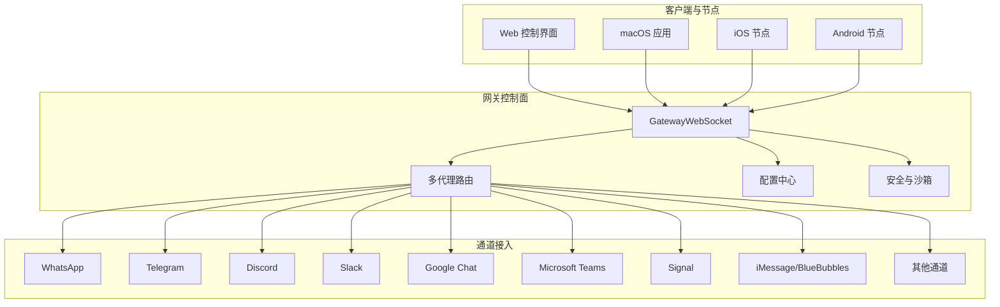
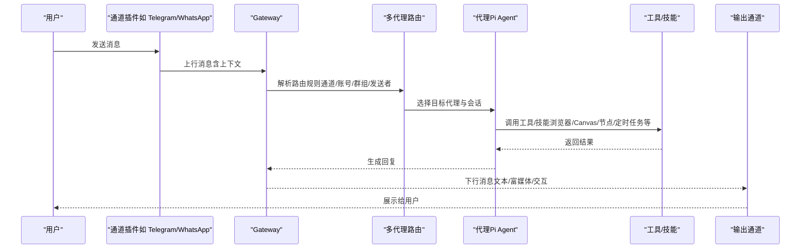
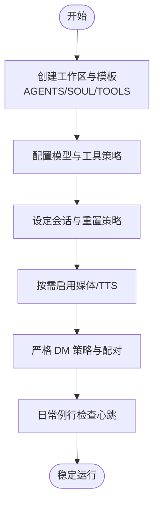
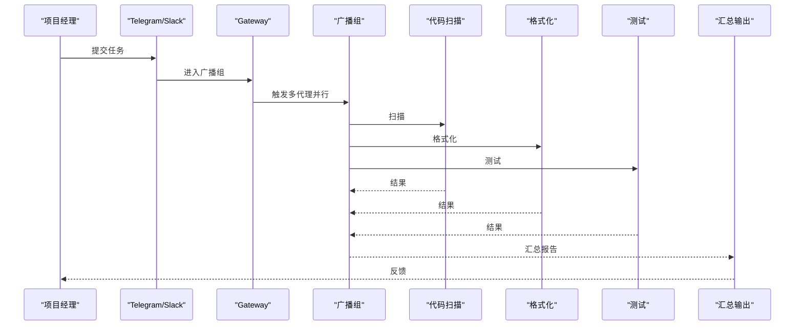
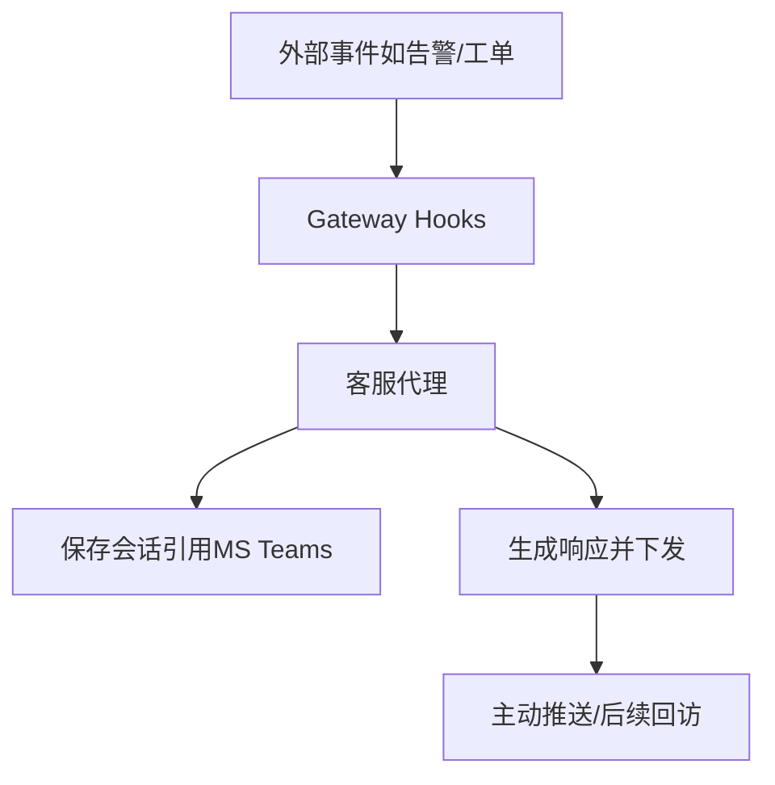
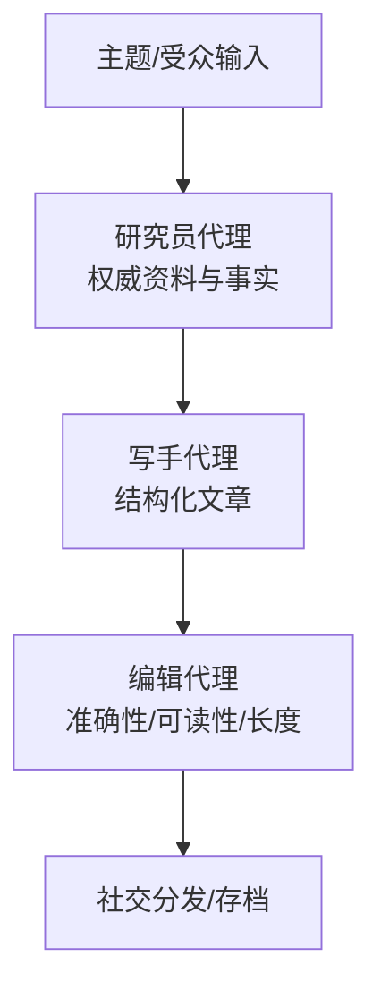
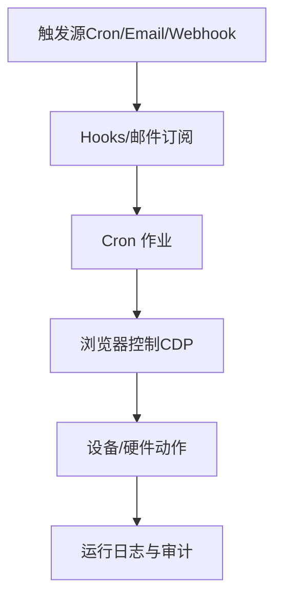
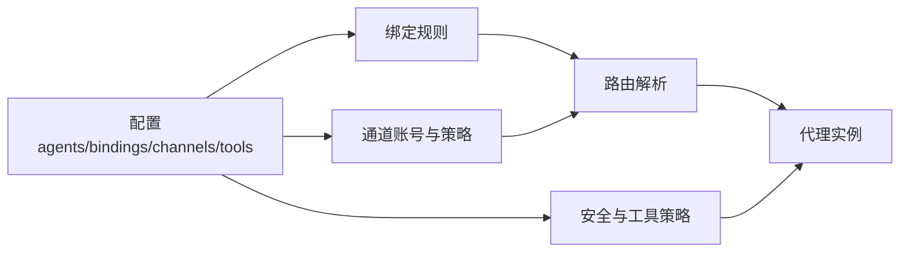

# 应用场景

<cite>
**本文引用的文件**
- [README.md](file://README.md)
- [docs/index.md](file://docs/index.md)
- [docs/start/showcase.md](file://docs/start/showcase.md)
- [docs/reference/AGENTS.default.md](file://docs/reference/AGENTS.default.md)
- [docs/gateway/configuration.md](file://docs/gateway/configuration.md)
- [docs/start/wizard.md](file://docs/start/wizard.md)
- [docs/concepts/multi-agent.md](file://docs/concepts/multi-agent.md)
- [extensions/open-prose/skills/prose/examples/34-content-pipeline.prose](file://extensions/open-prose/skills/prose/examples/34-content-pipeline.prose)
- [extensions/open-prose/skills/prose/examples/09-research-with-agents.prose](file://extensions/open-prose/skills/prose/examples/09-research-with-agents.prose)
- [docs/channels/broadcast-groups.md](file://docs/channels/broadcast-groups.md)
- [extensions/msteams/src/conversation-store.ts](file://extensions/msteams/src/conversation-store.ts)
- [src/agents/subagent-announce.ts](file://src/agents/subagent-announce.ts)
- [src/cli/exec-approvals-cli.ts](file://src/cli/exec-approvals-cli.ts)
- [src/routing/resolve-route.test.ts](file://src/routing/resolve-route.test.ts)
- [src/commands/agents.commands.bind.ts](file://src/commands/agents.commands.bind.ts)
- [src/commands/agents.bindings.ts](file://src/commands/agents.bindings.ts)
</cite>

## 目录
1. [引言](#引言)
2. [项目结构](#项目结构)
3. [核心组件](#核心组件)
4. [架构总览](#架构总览)
5. [详细场景分析](#详细场景分析)
6. [依赖关系分析](#依赖关系分析)
7. [性能考量](#性能考量)
8. [故障排查指南](#故障排查指南)
9. [结论](#结论)
10. [附录](#附录)

## 引言
本文件面向 OpenClaw 的典型应用场景，围绕个人助理、团队协作、客户服务、内容创作、自动化运维等方向，系统化梳理平台能力、配置要点与最佳实践，并提供可落地的配置方案与使用流程图，帮助用户基于自身需求快速定制专属解决方案。

## 项目结构
OpenClaw 采用“网关控制面 + 多通道接入 + 多代理路由 + 技能生态”的分层架构。核心能力包括：
- 网关（WebSocket 控制平面）：统一会话、路由、事件与工具调度
- 多通道接入：WhatsApp、Telegram、Discord、Slack、Google Chat、Microsoft Teams、Signal、iMessage、BlueBubbles、IRC、Matrix、Feishu、LINE、Mattermost、Nextcloud Talk、Nostr、Synology Chat、Tlon、Twitch、Zalo、Zalo Personal、WebChat 等
- 多代理路由：按发送者/群组/账号隔离会话，支持主会话与非主会话沙箱策略
- 技能与自动化：浏览器控制、Canvas、节点（相机/屏幕录制/位置/通知）、定时任务、钩子（webhook）、邮件订阅等
- 客户端与节点：macOS/iOS/Android 节点，菜单栏应用，Web 控制界面

图表来源
- [README.md:185-202](file://README.md#L185-L202)
- [docs/index.md:59-71](file://docs/index.md#L59-L71)

章节来源
- [README.md:21-26](file://README.md#L21-L26)
- [docs/index.md:44-71](file://docs/index.md#L44-L71)

## 核心组件
- 网关（Gateway）：单一路由与控制平面，承载会话、消息、工具与事件
- 通道插件：各 IM 平台适配器（Telegram、Discord、Slack、Microsoft Teams 等）
- 多代理路由：按通道/账号/群组/发送者进行路由，隔离会话与权限
- 安全与沙箱：非主会话/全部会话沙箱化执行，工具白名单/黑名单
- 技能与自动化：浏览器控制、Canvas、节点、定时任务、钩子、媒体理解
- 客户端与节点：Web 控制界面、macOS/iOS/Android 节点

章节来源
- [README.md:126-176](file://README.md#L126-L176)
- [docs/index.md:74-94](file://docs/index.md#L74-L94)

## 架构总览
下图展示从消息入口到代理响应的关键流转，以及与通道、多代理路由、工具与会话的关系。

图表来源
- [README.md:185-202](file://README.md#L185-L202)
- [docs/concepts/multi-agent.md:316-377](file://docs/concepts/multi-agent.md#L316-L377)

章节来源
- [README.md:185-202](file://README.md#L185-L202)
- [docs/concepts/multi-agent.md:316-377](file://docs/concepts/multi-agent.md#L316-L377)

## 详细场景分析

### 场景一：个人助理（Personal Assistant）
- 应用价值
  - 单人本地化、始终在线的 AI 助理，跨多通道统一入口
  - 通过默认工作区与技能清单，快速建立“自我认知”与“记忆系统”
- 关键配置
  - 工作区与默认模板：参考默认 AGENTS.md、SOUL.md、TOOLS.md
  - 模型与工具策略：优先强模型，严格工具策略
  - 会话与重置：按日/空闲重置，避免上下文污染
  - 媒体与 TTS：按需启用音频/视频理解与语音播报
- 最佳实践
  - 将工作区作为“记忆库”，建议纳入私有版本管理
  - 保持每日/每周例行检查（心跳），确保提醒与监控持续
  - 仅对可信来源开放 DM，必要时开启“配对”策略
- 成功案例
  - 社区展示中的“每日简报”“健康助手”“学习引擎”等场景

图表来源
- [docs/reference/AGENTS.default.md:13-41](file://docs/reference/AGENTS.default.md#L13-L41)
- [docs/gateway/configuration.md:208-233](file://docs/gateway/configuration.md#L208-L233)
- [docs/gateway/configuration.md:135-147](file://docs/gateway/configuration.md#L135-L147)

章节来源
- [docs/reference/AGENTS.default.md:11-127](file://docs/reference/AGENTS.default.md#L11-L127)
- [docs/gateway/configuration.md:26-59](file://docs/gateway/configuration.md#L26-L59)
- [docs/gateway/configuration.md:135-147](file://docs/gateway/configuration.md#L135-L147)
- [docs/gateway/configuration.md:208-233](file://docs/gateway/configuration.md#L208-L233)

### 场景二：团队协作（Team Collaboration）
- 应用价值
  - 多代理隔离：工作/家庭/项目等不同角色分离
  - 多通道并行：同一团队在不同平台协同
  - 广播与子代理：针对重复任务（代码扫描、格式化、测试）并行处理
- 关键配置
  - 多代理定义与绑定：按通道/账号/群组路由到不同代理
  - 广播组：将多个专用代理组合为广播组，统一触发与汇总
  - 子代理：限定子代理数量、模型与工具范围，避免越权
- 最佳实践
  - 为每个代理赋予清晰职责与命名
  - 限制工具访问，读写分离
  - 并发策略与失败隔离，避免单点阻塞
- 成功案例
  - 社区展示中的“PR 审查反馈”“Tesco 自动购物”“Wiener Linien 实时交通”等

图表来源
- [docs/channels/broadcast-groups.md:214-271](file://docs/channels/broadcast-groups.md#L214-L271)
- [docs/concepts/multi-agent.md:316-377](file://docs/concepts/multi-agent.md#L316-L377)
- [src/agents/subagent-announce.ts:954-964](file://src/agents/subagent-announce.ts#L954-L964)

章节来源
- [docs/channels/broadcast-groups.md:208-282](file://docs/channels/broadcast-groups.md#L208-L282)
- [docs/concepts/multi-agent.md:316-377](file://docs/concepts/multi-agent.md#L316-L377)
- [src/agents/subagent-announce.ts:954-964](file://src/agents/subagent-announce.ts#L954-L964)

### 场景三：客户服务（Customer Service）
- 应用价值
  - 企业级服务：通过 MS Teams 等平台实现主动消息与会话存储
  - 会话持久化：ConversationReference 存储，支持后续主动推送
  - 多通道统一：跨 Slack/Discord/Telegram 的客服入口
- 关键配置
  - MS Teams 会话存储：ConversationReference 结构化保存
  - Hooks/Webhook：外部事件触发客服代理
  - 组织内群组策略：提及门控、允许列表与公开 DM 策略
- 最佳实践
  - 主动消息前先建立会话引用，确保可回推
  - 对外输入（webhook/payload）视为不受信，严格校验与沙箱
  - 为不同业务线划分代理，避免交叉影响
- 成功案例
  - 社区展示中的“Slack 自动支持”“Auto-Support”等

图表来源
- [extensions/msteams/src/conversation-store.ts:8-41](file://extensions/msteams/src/conversation-store.ts#L8-L41)
- [docs/gateway/configuration.md:357-388](file://docs/gateway/configuration.md#L357-L388)

章节来源
- [extensions/msteams/src/conversation-store.ts:1-41](file://extensions/msteams/src/conversation-store.ts#L1-L41)
- [docs/gateway/configuration.md:357-388](file://docs/gateway/configuration.md#L357-L388)

### 场景四：内容创作（Content Creation）
- 应用价值
  - 端到端内容管线：研究、写作、编辑、社交分发一体化
  - 多代理流水线：研究员/写手/编辑各司其职，模型层级匹配任务复杂度
- 关键配置
  - 代理分工：研究员（sonnet/opus）、写手（opus）、编辑（sonnet/更强模型）
  - 会话覆盖：在关键步骤临时切换模型与提示词
  - 技能与工具：网络搜索、浏览器控制、截图/Markdown 转换
- 最佳实践
  - 为复杂任务设计阶段性提示词，避免一次性长上下文
  - 使用“会话覆盖”在需要时提升模型强度
  - 保留中间产物，便于复盘与迭代
- 成功案例
  - 社区展示中的“每周简报场景”“旅行/健康助手”等

图表来源
- [extensions/open-prose/skills/prose/examples/34-content-pipeline.prose:1-48](file://extensions/open-prose/skills/prose/examples/34-content-pipeline.prose#L1-L48)
- [extensions/open-prose/skills/prose/examples/09-research-with-agents.prose:1-25](file://extensions/open-prose/skills/prose/examples/09-research-with-agents.prose#L1-L25)

章节来源
- [extensions/open-prose/skills/prose/examples/34-content-pipeline.prose:1-48](file://extensions/open-prose/skills/prose/examples/34-content-pipeline.prose#L1-L48)
- [extensions/open-prose/skills/prose/examples/09-research-with-agents.prose:1-25](file://extensions/open-prose/skills/prose/examples/09-research-with-agents.prose#L1-L25)

### 场景五：自动化运维（Automation & Ops）
- 应用价值
  - 无头浏览器自动化：无需打开终端即可完成网站操作
  - 设备与硬件控制：相机/屏幕录制/打印/空气净化器等
  - 定时任务与钩子：周期性巡检、邮件/订阅事件触发
- 关键配置
  - Cron 作业：并发数、会话保留、运行日志裁剪
  - 钩子（Hooks）：共享密钥、路径映射、默认会话键
  - 浏览器控制：启用、颜色标记、CDP 连接
- 最佳实践
  - 对外输入（webhook/email）严格校验与沙箱
  - 为高风险动作设置“执行审批”与白名单
  - 通过心跳维持后台任务活跃度
- 成功案例
  - 社区展示中的“Winix 空气净化器控制”“Roof Camera 拍摄”“Padel 场地预订”等

图表来源
- [docs/gateway/configuration.md:336-355](file://docs/gateway/configuration.md#L336-L355)
- [docs/gateway/configuration.md:357-388](file://docs/gateway/configuration.md#L357-L388)
- [src/cli/exec-approvals-cli.ts:156-185](file://src/cli/exec-approvals-cli.ts#L156-L185)

章节来源
- [docs/gateway/configuration.md:336-355](file://docs/gateway/configuration.md#L336-L355)
- [docs/gateway/configuration.md:357-388](file://docs/gateway/configuration.md#L357-L388)
- [src/cli/exec-approvals-cli.ts:156-185](file://src/cli/exec-approvals-cli.ts#L156-L185)

## 依赖关系分析
- 多代理路由与绑定
  - 通过 bindings 明确“通道/账号/群组/发送者”到代理的路由
  - 支持按服务器/团队/房间等维度进行更细粒度匹配
- 通道与账号
  - 不同通道具有独立的账号体系与策略（如 Telegram 的 accounts.*）
- 安全与工具策略
  - 工具白名单/黑名单、沙箱模式、执行审批
- 配置热重载
  - 大多数字段热生效，关键变更（如网关监听、发现/插件）需要重启

图表来源
- [docs/concepts/multi-agent.md:316-377](file://docs/concepts/multi-agent.md#L316-L377)
- [src/routing/resolve-route.test.ts:248-306](file://src/routing/resolve-route.test.ts#L248-L306)
- [src/commands/agents.commands.bind.ts:53-91](file://src/commands/agents.commands.bind.ts#L53-L91)
- [src/commands/agents.bindings.ts:161-175](file://src/commands/agents.bindings.ts#L161-L175)

章节来源
- [docs/concepts/multi-agent.md:316-377](file://docs/concepts/multi-agent.md#L316-L377)
- [src/routing/resolve-route.test.ts:248-306](file://src/routing/resolve-route.test.ts#L248-L306)
- [src/commands/agents.commands.bind.ts:53-91](file://src/commands/agents.commands.bind.ts#L53-L91)
- [src/commands/agents.bindings.ts:161-175](file://src/commands/agents.bindings.ts#L161-L175)

## 性能考量
- 模型与工具
  - 为复杂任务选择更强模型，但注意成本与延迟
  - 通过工具白名单减少不必要的系统调用
- 会话与内存
  - 合理设置会话重置策略，避免长期累积导致上下文膨胀
  - 使用媒体理解时控制尺寸与并发，降低视觉 token 消耗
- 并发与广播
  - 广播组并发建议控制在 5–10 个代理以内，避免资源争用
- 网络与暴露
  - Tailscale Serve/Funnel 仅在需要远程访问时启用，且需配合鉴权与密码策略

## 故障排查指南
- 常见问题定位
  - 配置验证失败：运行 doctor 检查并修复；严格模式下未知键/类型错误会导致启动拒绝
  - 通道健康监控：调整健康检查间隔与重启阈值，避免误重启
  - 执行审批与工具策略：对高风险动作启用审批白名单，定期审计
- 快速恢复
  - 使用配置热重载（hybrid 模式）即时应用安全变更
  - 对于网关监听/发现/插件等关键变更，按需重启并观察日志

章节来源
- [docs/gateway/configuration.md:61-73](file://docs/gateway/configuration.md#L61-L73)
- [docs/gateway/configuration.md:178-205](file://docs/gateway/configuration.md#L178-L205)
- [src/cli/exec-approvals-cli.ts:156-185](file://src/cli/exec-approvals-cli.ts#L156-L185)

## 结论
OpenClaw 通过“网关 + 多通道 + 多代理 + 技能生态”的架构，为个人助理、团队协作、客户服务、内容创作与自动化运维提供了高度可定制的解决方案。结合本文提供的配置要点、最佳实践与流程图，用户可按需选择渠道集成、代理策略与工具策略，在保证安全与性能的前提下，快速落地适合自身的应用场景。

## 附录
- 快速开始与向导
  - 使用向导完成模型/工作区/网关/通道/守护进程/健康检查/技能安装
- 配置参考
  - 通道接入、模型与工具、会话与重置、沙箱、心跳、Cron、Hooks、多代理路由、分片配置等
- 社区案例
  - 内容创作、自动化运维、客户服务、知识与记忆、语音与电话桥接、基础设施与部署、家庭与硬件控制等

章节来源
- [docs/start/wizard.md:17-126](file://docs/start/wizard.md#L17-L126)
- [docs/gateway/configuration.md:74-434](file://docs/gateway/configuration.md#L74-L434)
- [docs/start/showcase.md:18-420](file://docs/start/showcase.md#L18-L420)