# 教育学习场景

<cite>
**本文引用的文件**
- [README.md](file://README.md)
- [AGENTS.md](file://AGENTS.md)
- [docs/gateway/configuration-examples.md](file://docs/gateway/configuration-examples.md)
- [src/agents/workspace-templates.ts](file://src/agents/workspace-templates.ts)
- [docs/reference/templates/AGENTS.md](file://docs/reference/templates/AGENTS.md)
- [docs/reference/templates/SOUL.md](file://docs/reference/templates/SOUL.md)
- [apps/macos/Sources/OpenClaw/AgentWorkspace.swift](file://apps/macos/Sources/OpenClaw/AgentWorkspace.swift)
- [apps/macos/Sources/OpenClaw/SystemRunSettingsView.swift](file://apps/macos/Sources/OpenClaw/SystemRunSettingsView.swift)
- [apps/macos/Sources/OpenClaw/OpenClawConfigFile.swift](file://apps/macos/Sources/OpenClaw/OpenClawConfigFile.swift)
- [src/commands/agents.ts](file://src/commands/agents.ts)
- [src/agents/system-prompt.ts](file://src/agents/system-prompt.ts)
- [src/agents/skills/workspace.ts](file://src/agents/skills/workspace.ts)
- [src/commands/onboard-skills.ts](file://src/commands/onboard-skills.ts)
- [extensions/open-prose/skills/prose/lib/user-memory.prose](file://extensions/open-prose/skills/prose/lib/user-memory.prose)
- [extensions/open-prose/skills/prose/lib/README.md](file://extensions/open-prose/skills/prose/lib/README.md)
- [extensions/open-prose/skills/prose/lib/calibrator.prose](file://extensions/open-prose/skills/prose/lib/calibrator.prose)
- [extensions/open-prose/skills/prose/lib/profiler.prose](file://extensions/open-prose/skills/prose/lib/profiler.prose)
- [extensions/open-prose/skills/prose/examples/34-content-pipeline.prose](file://extensions/open-prose/skills/prose/examples/34-content-pipeline.prose)
- [src/gateway/agent-event-assistant-text.ts](file://src/gateway/agent-event-assistant-text.ts)
- [src/tts/tts.test.ts](file://src/tts/tts.test.ts)
- [apps/android/app/src/main/java/ai/openclaw/app/voice/TalkModeManager.kt](file://apps/android/app/src/main/java/ai/openclaw/app/voice/TalkModeManager.kt)
</cite>

## 目录
1. [简介](#简介)
2. [项目结构](#项目结构)
3. [核心组件](#核心组件)
4. [架构总览](#架构总览)
5. [详细组件分析](#详细组件分析)
6. [依赖关系分析](#依赖关系分析)
7. [性能考量](#性能考量)
8. [故障排查指南](#故障排查指南)
9. [结论](#结论)
10. [附录](#附录)

## 简介
本文件面向教育学习场景，系统化阐述 OpenClaw 在课堂内外的可落地应用：在线教学辅助、作业批改、学习进度跟踪、个性化辅导等。我们将结合仓库中的配置示例、工作空间模板、技能体系与多平台节点能力，给出可操作的“教育代理”搭建与使用方案，并提供典型流程图与配置示例路径，帮助教师与学生高效利用 OpenClaw 提升教学与学习效果。

## 项目结构
OpenClaw 是一个“个人 AI 助手”，可在多通道（如 WhatsApp、Telegram、Discord、Slack、Google Chat、Signal、iMessage、BlueBubbles、IRC、Microsoft Teams、Matrix、Feishu、LINE、Mattermost、Nextcloud Talk、Nostr、Synology Chat、Tlon、Twitch、Zalo、Zalo Personal、WebChat）上运行，支持语音唤醒、Canvas 可视化、浏览器控制、节点设备能力等。其核心由“网关（Gateway）+ 多通道 + 多代理 + 技能（Skills）+ 工作空间（Workspace）”构成。

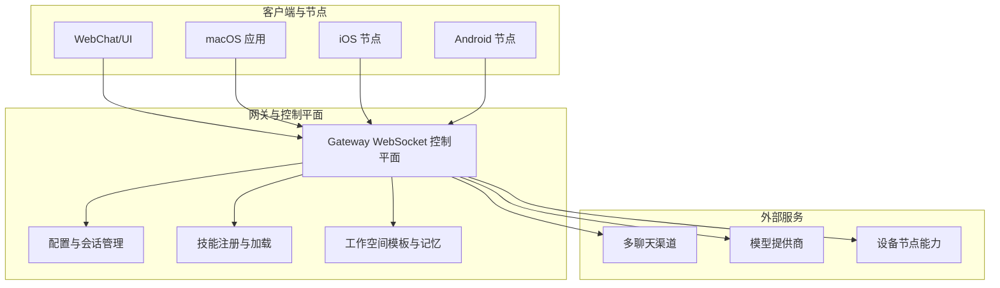

图表来源
- [README.md: 185-239:185-239](file://README.md#L185-L239)
- [docs/gateway/configuration-examples.md: 411-426:411-426](file://docs/gateway/configuration-examples.md#L411-L426)

章节来源
- [README.md: 185-239:185-239](file://README.md#L185-L239)
- [docs/gateway/configuration-examples.md: 411-426:411-426](file://docs/gateway/configuration-examples.md#L411-L426)

## 核心组件
- 网关（Gateway）：统一的 WebSocket 控制平面，承载会话、路由、工具、事件与远程访问。
- 多通道（Channels）：跨平台消息入口，支持群组路由、提及触发、Webhook 触发等。
- 多代理（Agents）：按发送者/群组隔离的会话与身份，支持思维级别、日志级别、模型切换等。
- 技能（Skills）：模块化能力包，可按需加载与权限控制，支持工作空间与内置技能。
- 工作空间（Workspace）：包含 AGENTS.md、SOUL.md、USER.md、每日记忆与长期记忆等模板与约定。
- 节点（Nodes）：设备侧能力（系统命令、相机、屏幕录制、位置、通知等），通过网关安全调用。

章节来源
- [README.md: 144-176:144-176](file://README.md#L144-L176)
- [docs/reference/templates/AGENTS.md: 8-44:8-44](file://docs/reference/templates/AGENTS.md#L8-L44)
- [docs/reference/templates/SOUL.md: 8-44:8-44](file://docs/reference/templates/SOUL.md#L8-L44)

## 架构总览
下图展示教育场景中“教学辅助代理”的典型交互：教师或学生通过任一已接入的聊天渠道发起请求，网关根据路由规则选择对应代理，代理加载工作空间与技能，结合模型与工具完成任务（如讲解、批改、生成学习计划等），并通过节点能力进行可视化或语音反馈。

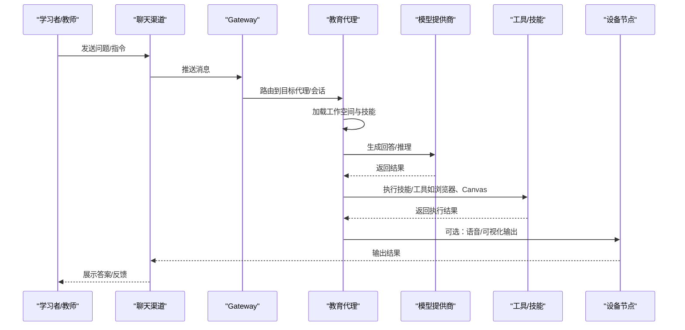

图表来源
- [README.md: 185-239:185-239](file://README.md#L185-L239)
- [src/agents/system-prompt.ts: 20-36:20-36](file://src/agents/system-prompt.ts#L20-L36)
- [src/agents/skills/workspace.ts: 567-584:567-584](file://src/agents/skills/workspace.ts#L567-L584)

章节来源
- [README.md: 185-239:185-239](file://README.md#L185-L239)
- [src/agents/system-prompt.ts: 20-36:20-36](file://src/agents/system-prompt.ts#L20-L36)
- [src/agents/skills/workspace.ts: 567-584:567-584](file://src/agents/skills/workspace.ts#L567-L584)

## 详细组件分析

### 教育代理配置与工作空间
- 工作空间模板：AGENTS.md、SOUL.md、USER.md、BOOTSTRAP.md 等模板定义了“每日记忆”“长期记忆”“身份边界”等，便于构建稳定且可演进的“学习记忆”。
- 代理默认工作区：可通过配置项设定工作区根目录，确保教育代理的“记忆”持久化与可备份。
- macOS 应用侧：提供工作区与代理列表的读取与选择，便于在本地快速切换与加载。

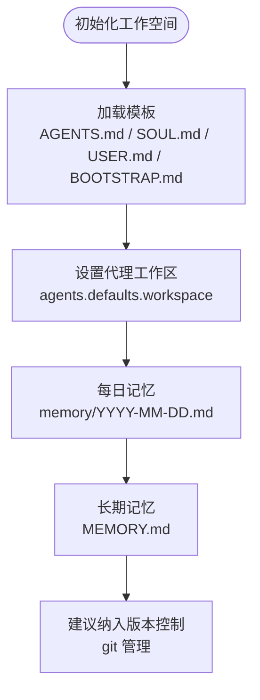

图表来源
- [docs/reference/templates/AGENTS.md: 8-44:8-44](file://docs/reference/templates/AGENTS.md#L8-L44)
- [docs/reference/templates/SOUL.md: 8-44:8-44](file://docs/reference/templates/SOUL.md#L8-L44)
- [apps/macos/Sources/OpenClaw/AgentWorkspace.swift: 158-244:158-244](file://apps/macos/Sources/OpenClaw/AgentWorkspace.swift#L158-L244)
- [apps/macos/Sources/OpenClaw/OpenClawConfigFile.swift: 129-139:129-139](file://apps/macos/Sources/OpenClaw/OpenClawConfigFile.swift#L129-L139)

章节来源
- [docs/reference/templates/AGENTS.md: 8-44:8-44](file://docs/reference/templates/AGENTS.md#L8-L44)
- [docs/reference/templates/SOUL.md: 8-44:8-44](file://docs/reference/templates/SOUL.md#L8-L44)
- [apps/macos/Sources/OpenClaw/AgentWorkspace.swift: 158-244:158-244](file://apps/macos/Sources/OpenClaw/AgentWorkspace.swift#L158-L244)
- [apps/macos/Sources/OpenClaw/OpenClawConfigFile.swift: 129-139:129-139](file://apps/macos/Sources/OpenClaw/OpenClawConfigFile.swift#L129-L139)

### 多通道与群组教学
- 支持在多个渠道上建立“教学群组”，通过提及触发、群组路由与队列策略，实现课堂问答、作业提交与讨论。
- 配置示例涵盖 WhatsApp、Telegram、Discord、Slack 等，可按需启用并设置允许名单与提及要求。

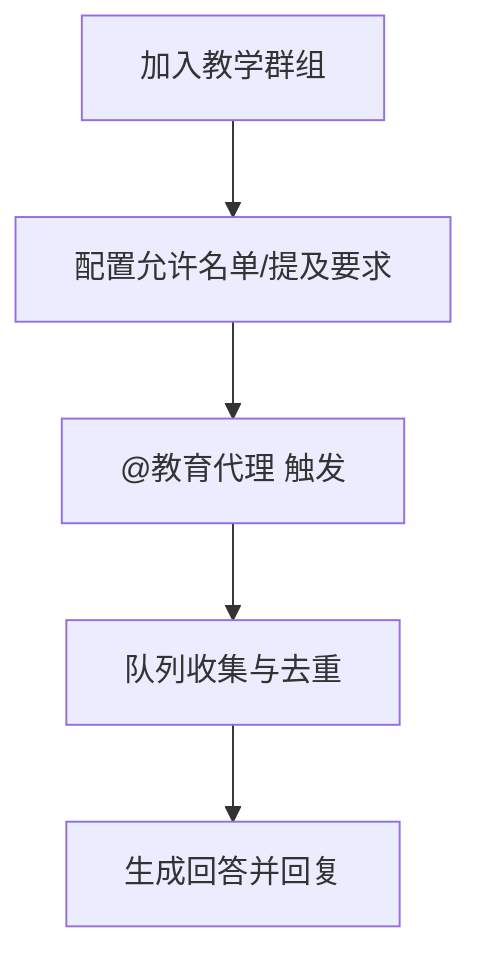

图表来源
- [docs/gateway/configuration-examples.md: 184-233:184-233](file://docs/gateway/configuration-examples.md#L184-L233)
- [README.md: 151-155:151-155](file://README.md#L151-L155)

章节来源
- [docs/gateway/configuration-examples.md: 184-233:184-233](file://docs/gateway/configuration-examples.md#L184-L233)
- [README.md: 151-155:151-155](file://README.md#L151-L155)

### 技能体系与教学工具
- 技能是可插拔的能力单元，教育场景可引入“内容创作”“知识检索”“评测与反馈”等技能。
- 系统提示中明确“扫描可用技能并按需读取 SKILL.md”，确保代理在合适时机调用专业技能。
- 工作空间技能构建与过滤遵循字符预算与数量上限，保证上下文效率。

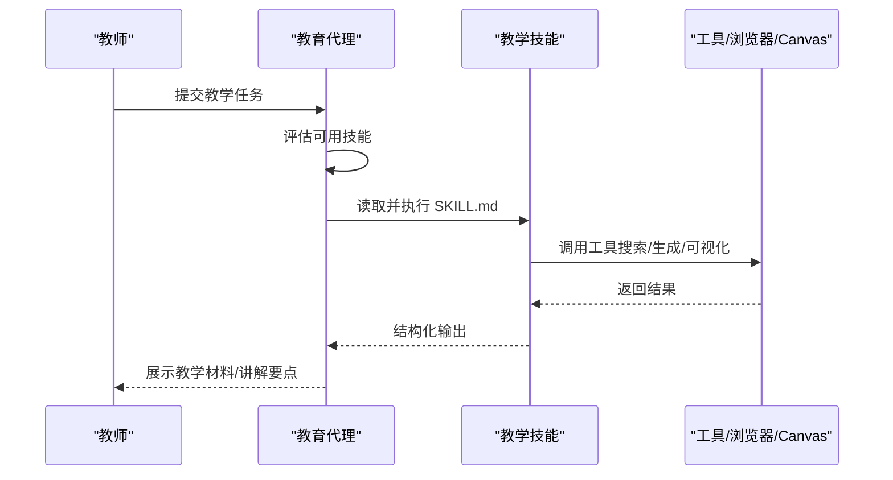

图表来源
- [src/agents/system-prompt.ts: 20-36:20-36](file://src/agents/system-prompt.ts#L20-L36)
- [src/agents/skills/workspace.ts: 538-565:538-565](file://src/agents/skills/workspace.ts#L538-L565)
- [src/commands/onboard-skills.ts: 50-82:50-82](file://src/commands/onboard-skills.ts#L50-L82)

章节来源
- [src/agents/system-prompt.ts: 20-36:20-36](file://src/agents/system-prompt.ts#L20-L36)
- [src/agents/skills/workspace.ts: 538-565:538-565](file://src/agents/skills/workspace.ts#L538-L565)
- [src/commands/onboard-skills.ts: 50-82:50-82](file://src/commands/onboard-skills.ts#L50-L82)

### 个性化学习路径与记忆
- 使用“用户记忆”技能，持续记录学习偏好、错误与反思，形成“用户记忆”与“项目记忆”，支持查询与反思模式。
- 可结合“成本分析/性能分析”技能对学习过程进行追踪与优化。

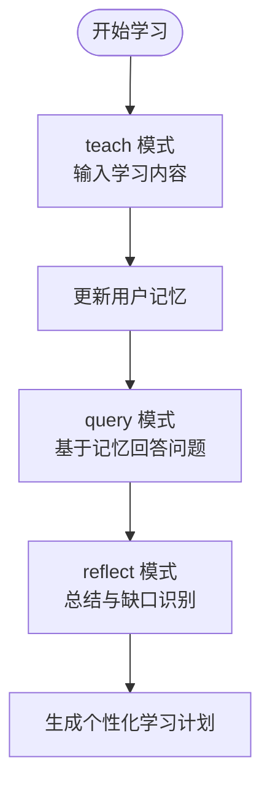

图表来源
- [extensions/open-prose/skills/prose/lib/user-memory.prose: 53-93:53-93](file://extensions/open-prose/skills/prose/lib/user-memory.prose#L53-L93)
- [extensions/open-prose/skills/prose/lib/profiler.prose: 354-400:354-400](file://extensions/open-prose/skills/prose/lib/profiler.prose#L354-L400)

章节来源
- [extensions/open-prose/skills/prose/lib/user-memory.prose: 53-93:53-93](file://extensions/open-prose/skills/prose/lib/user-memory.prose#L53-L93)
- [extensions/open-prose/skills/prose/lib/profiler.prose: 354-400:354-400](file://extensions/open-prose/skills/prose/lib/profiler.prose#L354-L400)

### 语音与可视化教学
- 语音：支持 ElevenLabs 流式 TTS，Android 节点可直接播放，macOS/iOS 节点可配合语音唤醒与通话模式。
- 可视化：Canvas/A2UI 支持可视化工作区，便于演示与协作。

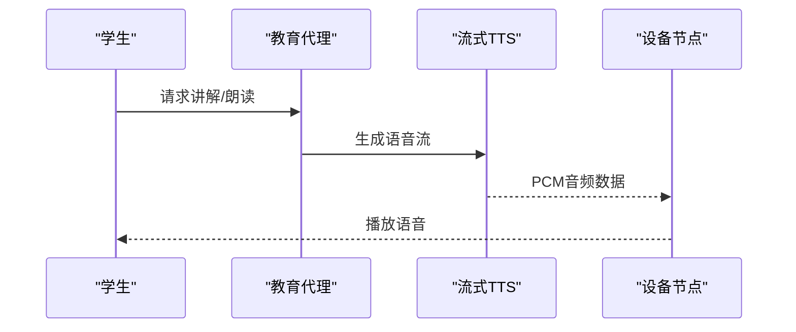

图表来源
- [apps/android/app/src/main/java/ai/openclaw/app/voice/TalkModeManager.kt: 249-279:249-279](file://apps/android/app/src/main/java/ai/openclaw/app/voice/TalkModeManager.kt#L249-L279)
- [src/gateway/agent-event-assistant-text.ts: 1-7:1-7](file://src/gateway/agent-event-assistant-text.ts#L1-L7)
- [src/tts/tts.test.ts: 495-499:495-499](file://src/tts/tts.test.ts#L495-L499)

章节来源
- [apps/android/app/src/main/java/ai/openclaw/app/voice/TalkModeManager.kt: 249-279:249-279](file://apps/android/app/src/main/java/ai/openclaw/app/voice/TalkModeManager.kt#L249-L279)
- [src/gateway/agent-event-assistant-text.ts: 1-7:1-7](file://src/gateway/agent-event-assistant-text.ts#L1-L7)
- [src/tts/tts.test.ts: 495-499:495-499](file://src/tts/tts.test.ts#L495-L499)

### 典型教育应用场景流程

#### 场景一：在线教学辅助（课堂讲解 + 互动问答）
- 配置：在配置中启用目标渠道（如 Discord/Slack/Telegram），设置群组路由与提及触发；为代理设置合适的模型与思维级别。
- 流程：教师在群组中 @代理发起提问，代理根据工作空间与技能生成讲解内容，必要时调用浏览器/Canvas 进行可视化演示。

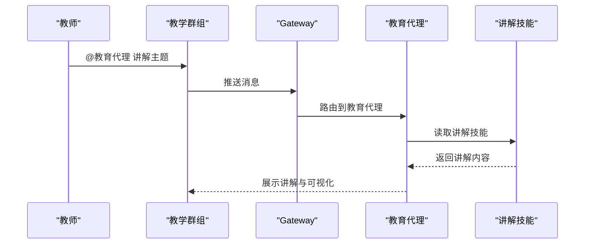

图表来源
- [docs/gateway/configuration-examples.md: 202-233:202-233](file://docs/gateway/configuration-examples.md#L202-L233)
- [src/agents/system-prompt.ts: 20-36:20-36](file://src/agents/system-prompt.ts#L20-L36)

章节来源
- [docs/gateway/configuration-examples.md: 202-233:202-233](file://docs/gateway/configuration-examples.md#L202-L233)
- [src/agents/system-prompt.ts: 20-36:20-36](file://src/agents/system-prompt.ts#L20-L36)

#### 场景二：作业批改与反馈（自动评测 + 个性化建议）
- 配置：启用 Webhook 或聊天指令，将作业内容投递至代理；代理调用评测技能与知识检索技能，生成评分与建议。
- 流程：学生提交作业 → 代理读取评测技能 → 结合历史学习记录给出个性化建议 → 回复到原渠道。

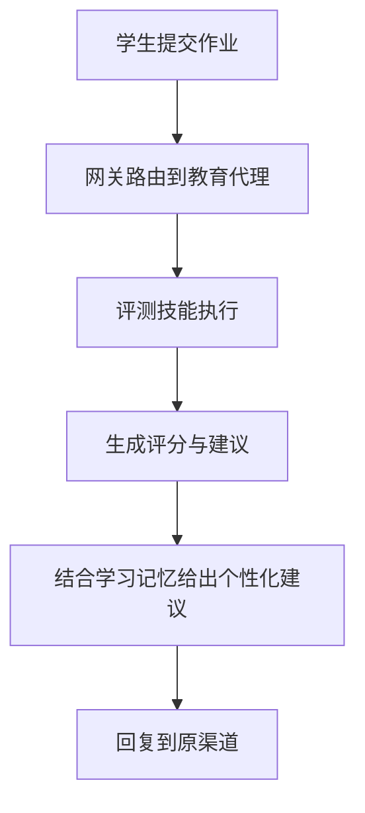

图表来源
- [docs/gateway/configuration-examples.md: 368-409:368-409](file://docs/gateway/configuration-examples.md#L368-L409)
- [src/agents/system-prompt.ts: 20-36:20-36](file://src/agents/system-prompt.ts#L20-L36)

章节来源
- [docs/gateway/configuration-examples.md: 368-409:368-409](file://docs/gateway/configuration-examples.md#L368-L409)
- [src/agents/system-prompt.ts: 20-36:20-36](file://src/agents/system-prompt.ts#L20-L36)

#### 场景三：学习进度跟踪与个性化学习计划
- 配置：每日在工作空间记录学习日志，启用“用户记忆”技能，定期进行反思与总结；使用“成本分析/性能分析”技能评估学习效率。
- 流程：每日阅读记忆 → 反思总结 → 生成学习计划 → 下一步行动清单。

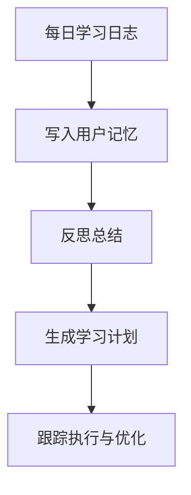

图表来源
- [docs/reference/templates/AGENTS.md: 28-44:28-44](file://docs/reference/templates/AGENTS.md#L28-L44)
- [extensions/open-prose/skills/prose/lib/user-memory.prose: 78-93:78-93](file://extensions/open-prose/skills/prose/lib/user-memory.prose#L78-L93)
- [extensions/open-prose/skills/prose/lib/profiler.prose: 354-400:354-400](file://extensions/open-prose/skills/prose/lib/profiler.prose#L354-L400)

章节来源
- [docs/reference/templates/AGENTS.md: 28-44:28-44](file://docs/reference/templates/AGENTS.md#L28-L44)
- [extensions/open-prose/skills/prose/lib/user-memory.prose: 78-93:78-93](file://extensions/open-prose/skills/prose/lib/user-memory.prose#L78-L93)
- [extensions/open-prose/skills/prose/lib/profiler.prose: 354-400:354-400](file://extensions/open-prose/skills/prose/lib/profiler.prose#L354-L400)

## 依赖关系分析
- 组件耦合：网关作为控制平面，聚合多通道与多代理；代理依赖工作空间与技能；技能依赖工具与模型；节点提供设备侧能力。
- 外部依赖：模型提供商、聊天渠道、设备节点；通过配置与认证策略进行集成。
- 安全性：默认主会话具备较高权限，群组/频道会话可启用沙箱与工具白名单以降低风险。

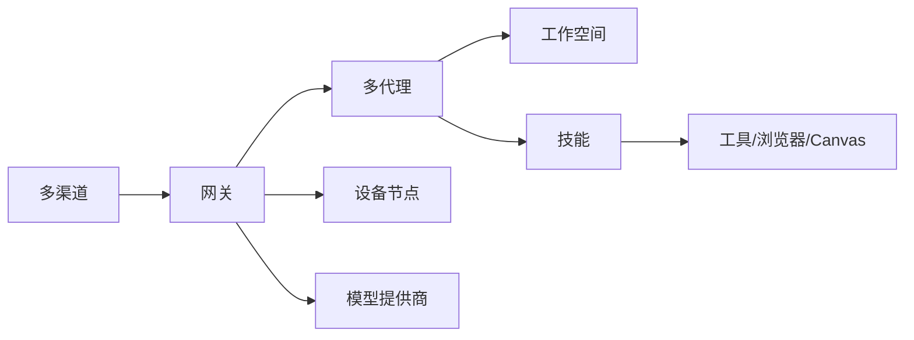

图表来源
- [README.md: 144-176:144-176](file://README.md#L144-L176)
- [docs/gateway/configuration-examples.md: 411-426:411-426](file://docs/gateway/configuration-examples.md#L411-L426)

章节来源
- [README.md: 144-176:144-176](file://README.md#L144-L176)
- [docs/gateway/configuration-examples.md: 411-426:411-426](file://docs/gateway/configuration-examples.md#L411-L426)

## 性能考量
- 上下文窗口与技能加载：工作空间技能构建采用二分搜索裁剪，避免超出字符预算；合理设置“技能提示”长度与数量上限。
- 工具调用与并发：限制并发数、设置超时与清理周期，避免资源争用。
- 语音与媒体：音频转写、流式 TTS 设置合理的超时与缓冲，避免卡顿。

章节来源
- [src/agents/skills/workspace.ts: 542-565:542-565](file://src/agents/skills/workspace.ts#L542-L565)
- [src/tts/tts.test.ts: 495-499:495-499](file://src/tts/tts.test.ts#L495-L499)

## 故障排查指南
- 网关健康与远程访问：通过健康检查与远程隧道验证连通性与鉴权。
- 渠道配对与权限：确认 DM 策略、允许名单与 Webhook 配置是否正确。
- 代理与会话：检查代理列表、默认代理与会话存储路径，确保工作空间可读写。
- 技能安装与状态：使用向导配置技能，查看缺失依赖与不支持平台提示。

章节来源
- [README.md: 112-125:112-125](file://README.md#L112-L125)
- [apps/macos/Sources/OpenClaw/SystemRunSettingsView.swift: 266-304:266-304](file://apps/macos/Sources/OpenClaw/SystemRunSettingsView.swift#L266-L304)
- [src/commands/onboard-skills.ts: 50-82:50-82](file://src/commands/onboard-skills.ts#L50-L82)

## 结论
OpenClaw 通过“网关 + 多通道 + 多代理 + 技能 + 工作空间 + 节点”的架构，为教育学习提供了强大的可扩展基础。结合配置示例、工作空间模板与技能体系，教师与学生可以快速搭建“教育代理”，覆盖在线教学辅助、作业批改、学习进度跟踪与个性化辅导等典型场景。建议从最小可用配置入手，逐步引入技能与节点能力，持续优化学习记忆与反馈闭环。

## 附录
- 快速开始与入门参考：[README.md: 28-82:28-82](file://README.md#L28-L82)
- 配置示例与最佳实践：[docs/gateway/configuration-examples.md: 14-638:14-638](file://docs/gateway/configuration-examples.md#L14-L638)
- 工作空间模板：[docs/reference/templates/AGENTS.md](file://docs/reference/templates/AGENTS.md)、[docs/reference/templates/SOUL.md](file://docs/reference/templates/SOUL.md)
- 技能与评测：[extensions/open-prose/skills/prose/lib/README.md: 48-99:48-99](file://extensions/open-prose/skills/prose/lib/README.md#L48-L99)
- 内容创作流水线示例：[extensions/open-prose/skills/prose/examples/34-content-pipeline.prose: 1-48:1-48](file://extensions/open-prose/skills/prose/examples/34-content-pipeline.prose#L1-L48)