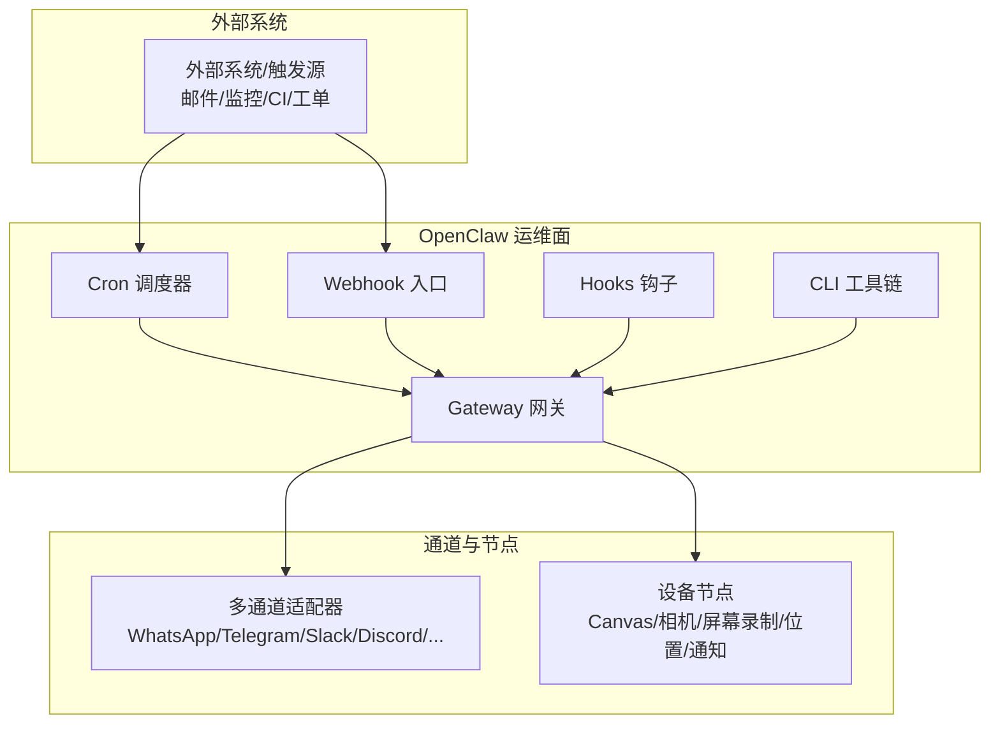
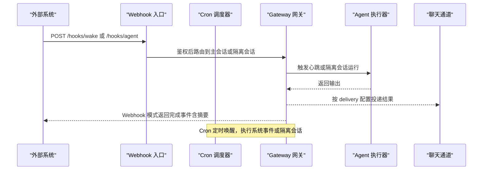
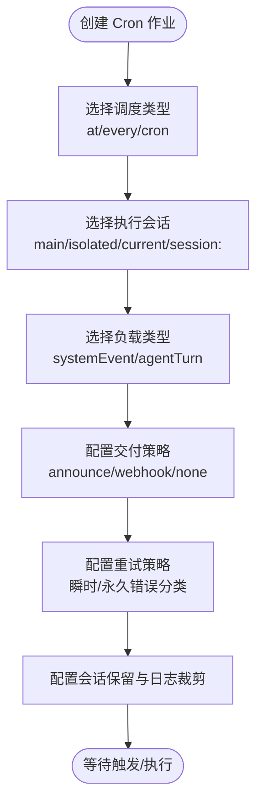
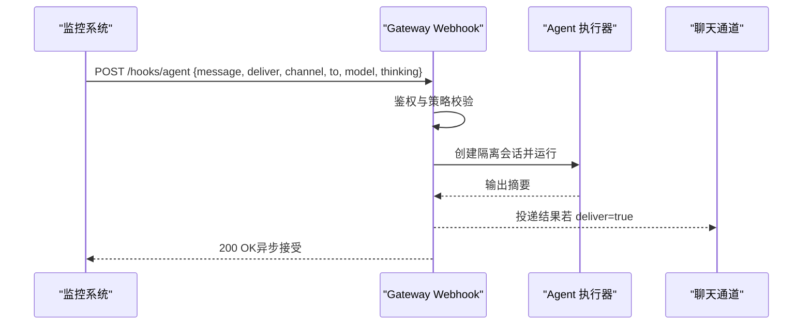
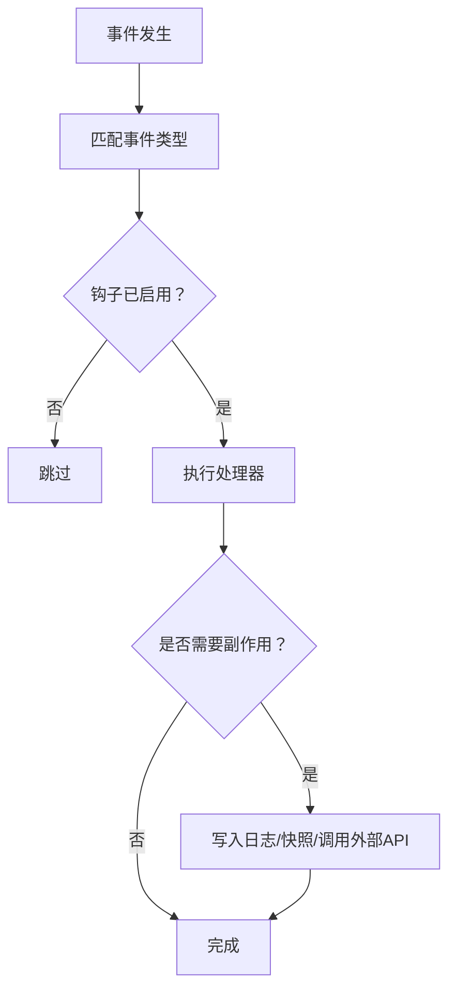
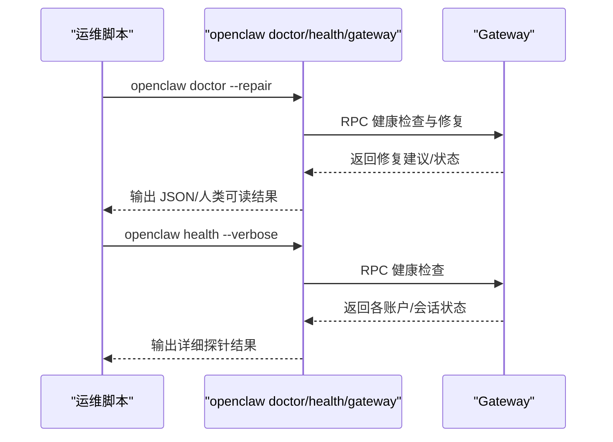
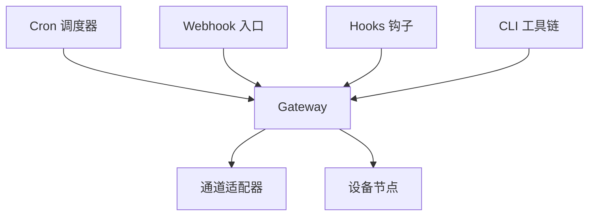

# 自动化运维场景

<cite>
**本文引用的文件**
- [README.md](file://README.md)
- [docs/index.md](file://docs/index.md)
- [docs/automation/cron-jobs.md](file://docs/automation/cron-jobs.md)
- [docs/automation/webhook.md](file://docs/automation/webhook.md)
- [docs/automation/hooks.md](file://docs/automation/hooks.md)
- [docs/automation/poll.md](file://docs/automation/poll.md)
- [docs/automation/auth-monitoring.md](file://docs/automation/auth-monitoring.md)
- [docs/cli/cron.md](file://docs/cli/cron.md)
- [docs/cli/daemon.md](file://docs/cli/daemon.md)
- [docs/cli/health.md](file://docs/cli/health.md)
- [docs/cli/doctor.md](file://docs/cli/doctor.md)
- [docs/cli/gateway.md](file://docs/cli/gateway.md)
</cite>

## 目录
1. [简介](#简介)
2. [项目结构](#项目结构)
3. [核心组件](#核心组件)
4. [架构总览](#架构总览)
5. [详细组件分析](#详细组件分析)
6. [依赖关系分析](#依赖关系分析)
7. [性能考量](#性能考量)
8. [故障排查指南](#故障排查指南)
9. [结论](#结论)
10. [附录](#附录)

## 简介
本文件面向自动化运维场景，系统性阐述 OpenClaw 在系统监控、故障告警、批量任务执行、日志分析等典型运维工作中的应用价值与实现方式。OpenClaw 提供统一的网关（Gateway）控制平面，通过 Cron 调度器、Webhook 入口、事件钩子（Hooks）、健康检查与诊断工具等能力，构建可扩展、可观测、可恢复的自动化闭环。

## 项目结构
OpenClaw 的自动化运维能力主要由以下模块构成：
- 网关（Gateway）：WebSocket 控制平面，承载会话、通道、节点、钩子与事件。
- Cron 调度器：内置计划任务引擎，支持一次性与周期性任务、隔离会话运行、交付到聊天或 Webhook。
- Webhook 入口：HTTP 接口用于外部触发主会话或隔离会话运行，并可选择交付结果。
- Hooks 钩子：事件驱动的自动化脚本，监听命令、消息、会话、网关生命周期等事件，实现审计、快照、联动等。
- 健康与诊断：健康检查、医生命令、服务状态查询、远程探测等，保障系统稳定与可维护性。
- CLI 工具链：cron、daemon、gateway、health、doctor 等命令行工具，支撑运维日常操作与自动化集成。

图表来源
- [docs/index.md:59-71](file://docs/index.md#L59-L71)
- [docs/automation/cron-jobs.md:10-21](file://docs/automation/cron-jobs.md#L10-L21)
- [docs/automation/webhook.md:9-27](file://docs/automation/webhook.md#L9-L27)
- [docs/automation/hooks.md:9-21](file://docs/automation/hooks.md#L9-L21)

章节来源
- [README.md:185-254](file://README.md#L185-L254)
- [docs/index.md:44-94](file://docs/index.md#L44-L94)

## 核心组件
- Cron 调度器：持久化作业、按时间唤醒、隔离会话执行、可选交付到聊天或 Webhook；支持重试策略与会话保留策略。
- Webhook 入口：提供 /hooks/wake 与 /hooks/agent 两个端点，支持令牌鉴权、会话键策略、模型与思考层级覆盖、超时控制等。
- Hooks 钩子：自动发现、启用/禁用、事件过滤、错误处理、安全边界；支持命令审计、会话快照、启动引导等。
- 健康与诊断：健康检查、医生命令、服务状态查询、远程探测、认证与权限校验。
- CLI 工具链：cron、daemon、gateway、health、doctor 等，便于脚本化与 CI/CD 集成。

章节来源
- [docs/automation/cron-jobs.md:10-78](file://docs/automation/cron-jobs.md#L10-L78)
- [docs/automation/webhook.md:9-96](file://docs/automation/webhook.md#L9-L96)
- [docs/automation/hooks.md:9-74](file://docs/automation/hooks.md#L9-L74)
- [docs/cli/cron.md:9-78](file://docs/cli/cron.md#L9-L78)
- [docs/cli/daemon.md:9-54](file://docs/cli/daemon.md#L9-L54)
- [docs/cli/gateway.md:10-236](file://docs/cli/gateway.md#L10-L236)
- [docs/cli/health.md:8-22](file://docs/cli/health.md#L8-L22)
- [docs/cli/doctor.md:9-47](file://docs/cli/doctor.md#L9-L47)

## 架构总览
下图展示 OpenClaw 在自动化运维中的关键交互路径：外部系统通过 Webhook 或 Cron 触发，Gateway 执行主会话或隔离会话任务，并将结果交付至聊天通道或回调 Webhook；同时 Hooks 钩子对命令、消息、会话等事件进行审计与联动。

图表来源
- [docs/automation/webhook.md:44-96](file://docs/automation/webhook.md#L44-L96)
- [docs/automation/cron-jobs.md:145-178](file://docs/automation/cron-jobs.md#L145-L178)

## 详细组件分析

### 组件一：Cron 调度器（系统监控与批量任务）
- 适用场景
  - 系统监控：定时拉取指标、生成摘要并投递到 Slack/Telegram。
  - 批量任务：周期性巡检、清理、备份、补丁扫描等。
  - 告警联动：定时检查健康状态，失败时触发修复流程。
- 关键特性
  - 支持 at（一次性）、every（固定间隔）、cron（标准表达式）三种调度。
  - 主会话（systemEvent）与隔离会话（agentTurn）两种执行模式。
  - delivery 支持 announce（聊天通道投递）、webhook（HTTP 回调）、none（内部不投递）。
  - 重试策略：瞬时错误指数退避，永久错误直接禁用；一次性任务默认最多重试 3 次。
  - 会话保留与运行日志裁剪：可配置隔离会话保留窗口与日志大小/行数限制。
- 配置要点
  - cron.enabled、store、maxConcurrentRuns、retry、webhook、webhookToken、sessionRetention、runLog。
  - delivery.mode、channel、to、bestEffort、wakeMode。
- CLI 快速上手
  - 添加一次性提醒、添加周期性隔离任务、编辑 delivery、强制运行、查看历史。

图表来源
- [docs/automation/cron-jobs.md:123-178](file://docs/automation/cron-jobs.md#L123-L178)
- [docs/automation/cron-jobs.md:442-564](file://docs/automation/cron-jobs.md#L442-L564)
- [docs/cli/cron.md:39-78](file://docs/cli/cron.md#L39-L78)

章节来源
- [docs/automation/cron-jobs.md:10-728](file://docs/automation/cron-jobs.md#L10-L728)
- [docs/cli/cron.md:9-78](file://docs/cli/cron.md#L9-L78)

### 组件二：Webhook 入口（外部触发与告警回路）
- 适用场景
  - 外部监控系统（Prometheus/Grafana/自研平台）通过 Webhook 触发 OpenClaw 执行。
  - 事件映射：将任意外部事件转换为 wake 或 agent 行为，支持模板与转换逻辑。
  - 安全策略：共享密钥鉴权、允许的 agentId 白名单、会话键前缀限制。
- 关键接口
  - POST /hooks/wake：向主会话注入系统事件，可立即或下次心跳触发。
  - POST /hooks/agent：隔离会话运行，支持模型/思考层级覆盖、交付到聊天通道。
  - POST /hooks/<name>：基于映射表的自定义入口，支持匹配、动作与模板。
- 安全与合规
  - 仅支持 Bearer 头或 x-openclaw-token，拒绝查询串参数。
  - 默认禁止请求携带的 sessionKey，建议使用 defaultSessionKey 并限制前缀。
  - 可开启 allowUnsafeExternalContent 以放宽安全包装（仅限可信内部来源）。

图表来源
- [docs/automation/webhook.md:44-96](file://docs/automation/webhook.md#L44-L96)
- [docs/automation/webhook.md:132-157](file://docs/automation/webhook.md#L132-L157)

章节来源
- [docs/automation/webhook.md:9-216](file://docs/automation/webhook.md#L9-L216)

### 组件三：Hooks 钩子（事件驱动的审计与联动）
- 适用场景
  - 命令审计：记录 /new、/reset、/stop 等命令事件，便于合规与排障。
  - 会话快照：在会话重置前保存上下文到工作区，便于回溯。
  - 启动引导：网关启动时执行 BOOT.md 指令。
  - 消息审计：记录收发消息的上下文（渠道、会话、转录、链接摘要等）。
- 结构与发现
  - 自动发现顺序：工作区 hooks > 用户托管 hooks > 内置 hooks。
  - 每个钩子目录包含 HOOK.md（元数据/文档）与 handler.ts（处理器）。
  - 支持包形式安装（npm 包），通过 openclaw.hooks 字段导出钩子路径。
- 事件类型
  - 命令事件：command:new、command:reset、command:stop 等。
  - 会话事件：session:compact:before、session:compact:after。
  - Agent 事件：agent:bootstrap。
  - 网关事件：gateway:startup。
  - 消息事件：message:received、message:transcribed、message:preprocessed、message:sent。
- 最佳实践
  - 保持处理器轻量，避免阻塞命令处理。
  - 明确事件过滤，减少无关处理开销。
  - 错误处理与日志记录，确保钩子自身可观测。

图表来源
- [docs/automation/hooks.md:240-340](file://docs/automation/hooks.md#L240-L340)
- [docs/automation/hooks.md:570-714](file://docs/automation/hooks.md#L570-L714)

章节来源
- [docs/automation/hooks.md:9-800](file://docs/automation/hooks.md#L9-L800)

### 组件四：健康与诊断（系统稳定性保障）
- 健康检查
  - openclaw health：快速检查运行中 Gateway 的健康状态，支持 JSON 与详细探针。
- 医生命令
  - openclaw doctor：健康检查 + 引导修复，支持深度检查、修复、清理无效配置、检测孤儿会话文件等。
- 服务管理
  - openclaw daemon（兼容）/ openclaw gateway：服务安装、启动、停止、重启、状态查询。
- 远程探测
  - openclaw gateway probe：探测本地与远程 Gateway，支持 SSH 隧道与 Wide-Area Bonjour 发现。

图表来源
- [docs/cli/health.md:8-22](file://docs/cli/health.md#L8-L22)
- [docs/cli/doctor.md:9-47](file://docs/cli/doctor.md#L9-L47)
- [docs/cli/gateway.md:85-178](file://docs/cli/gateway.md#L85-L178)

章节来源
- [docs/cli/health.md:8-22](file://docs/cli/health.md#L8-L22)
- [docs/cli/doctor.md:9-47](file://docs/cli/doctor.md#L9-L47)
- [docs/cli/daemon.md:9-54](file://docs/cli/daemon.md#L9-L54)
- [docs/cli/gateway.md:85-178](file://docs/cli/gateway.md#L85-L178)

### 组件五：认证与授权监控（自动化修复流程）
- 场景：定期检查模型提供商 OAuth 凭证有效期，到期或即将到期时触发修复流程。
- 方法
  - 使用 openclaw models status --check 获取退出码（0 正常、1 缺失/过期、2 即将过期）。
  - 结合脚本（如 auth-monitor.sh、systemd timer）实现自动告警与一键重认证。
- 优势
  - 无需额外脚本即可在 Cron/Systemd 中使用，降低运维复杂度。
  - 与手机/Termux 流程结合，支持一键 Widget 打开认证页面。

章节来源
- [docs/automation/auth-monitoring.md:9-45](file://docs/automation/auth-monitoring.md#L9-L45)

### 组件六：轮询发送（投票/调查自动化）
- 场景：在 WhatsApp/Telegram/Discord/MS Teams 上发送轮询，收集多方意见并统计结果。
- 特性
  - 支持匿名/公开轮询（Telegram）。
  - 支持多选与持续时间配置。
  - Gateway RPC 与 CLI 均支持轮询发送。
- 应用：自动化需求调研、排班投票、变更确认等。

章节来源
- [docs/automation/poll.md:9-87](file://docs/automation/poll.md#L9-L87)

## 依赖关系分析
- 组件耦合
  - Cron 与 Webhook 均依赖 Gateway 的 RPC 与会话管理。
  - Hooks 与 Gateway 事件流强耦合，需注意处理器的性能与错误处理。
  - CLI 工具链为运维自动化提供统一入口，与 Gateway 的 RPC/服务管理紧密关联。
- 外部依赖
  - 认证与授权：模型提供商 OAuth、Gateway Token/Password。
  - 通道适配器：各聊天平台 SDK/协议。
  - 远程访问：Tailscale/SSH 隧道、Bonjour/Wide-Area Bonjour 发现。

图表来源
- [docs/index.md:59-71](file://docs/index.md#L59-L71)
- [docs/automation/cron-jobs.md:10-21](file://docs/automation/cron-jobs.md#L10-L21)
- [docs/automation/webhook.md:9-27](file://docs/automation/webhook.md#L9-L27)
- [docs/automation/hooks.md:9-21](file://docs/automation/hooks.md#L9-L21)

## 性能考量
- 高频 Cron 设置
  - 会话保留窗口与运行日志裁剪需合理配置，避免 IO 压力与磁盘占用膨胀。
  - 对噪声较大的后台任务采用隔离会话并限制 delivery，减少主会话干扰。
- 重试策略
  - 一次性任务瞬时错误指数退避，永久错误立即禁用；周期性任务连续失败后指数退避，成功后重置。
- 事件钩子
  - 处理器应轻量、非阻塞，异常捕获与日志记录，避免影响命令处理时延。
- 远程探测与服务管理
  - 使用 --require-rpc 与 --deep 选项在自动化脚本中确保网关 RPC 可用与系统级服务状态正确。

章节来源
- [docs/automation/cron-jobs.md:505-521](file://docs/automation/cron-jobs.md#L505-L521)
- [docs/automation/cron-jobs.md:409-441](file://docs/automation/cron-jobs.md#L409-L441)
- [docs/automation/hooks.md:715-732](file://docs/automation/hooks.md#L715-L732)
- [docs/cli/gateway.md:111-118](file://docs/cli/gateway.md#L111-L118)

## 故障排查指南
- “没有任务运行”
  - 检查 cron.enabled 与环境变量 OPENCLAW_SKIP_CRON；确认 Gateway 连续运行；核对时区与主机时区。
- “周期性任务不断延迟”
  - 观察指数退避行为，成功一次后自动重置；检查瞬时错误（429/5xx/网络/过载）与永久错误（认证/配置）。
- “Telegram 投递到错误目标”
  - 使用明确的 forum topic 格式（-100…:topic:<id>）；避免歧义前缀。
- “钩子重复投递”
  - 检查 announceRetryCount，确认请求会话忙或超时导致的重试；必要时调整重试策略或会话键。
- 健康检查与医生命令
  - 使用 openclaw health --verbose 查看账户/会话状态；openclaw doctor --repair 自动修复常见问题。
- 服务状态与远程探测
  - openclaw gateway status --require-rpc 确保 RPC 可用；openclaw gateway probe 支持 SSH 隧道与 Wide-Area Bonjour。

章节来源
- [docs/automation/cron-jobs.md:701-728](file://docs/automation/cron-jobs.md#L701-L728)
- [docs/automation/webhook.md:204-216](file://docs/automation/webhook.md#L204-L216)
- [docs/cli/health.md:8-22](file://docs/cli/health.md#L8-L22)
- [docs/cli/doctor.md:18-35](file://docs/cli/doctor.md#L18-L35)
- [docs/cli/gateway.md:119-178](file://docs/cli/gateway.md#L119-L178)

## 结论
OpenClaw 将网关、调度、事件与通道有机整合，形成可扩展的自动化运维底座。通过 Cron、Webhook、Hooks、健康与诊断工具链，运维团队可以快速构建系统监控、故障告警、批量任务与日志分析等场景的自动化闭环，显著提升系统管理效率与稳定性。

## 附录
- 快速开始（Cron）
  - 创建一次性提醒并立即运行：参考 [docs/automation/cron-jobs.md:36-52](file://docs/automation/cron-jobs.md#L36-L52)
  - 添加周期性隔离任务并投递到 Slack：参考 [docs/automation/cron-jobs.md:54-66](file://docs/automation/cron-jobs.md#L54-L66)
- 快速开始（Webhook）
  - /hooks/wake 示例：参考 [docs/automation/webhook.md:44-59](file://docs/automation/webhook.md#L44-L59)
  - /hooks/agent 示例：参考 [docs/automation/webhook.md:60-96](file://docs/automation/webhook.md#L60-L96)
- 快速开始（Hooks）
  - 列表/启用/检查/信息：参考 [docs/automation/hooks.md:51-74](file://docs/automation/hooks.md#L51-L74)
  - 命令审计与会话快照：参考 [docs/automation/hooks.md:570-714](file://docs/automation/hooks.md#L570-L714)
- 快速开始（健康与诊断）
  - 健康检查：参考 [docs/cli/health.md:12-16](file://docs/cli/health.md#L12-L16)
  - 医生命令：参考 [docs/cli/doctor.md:20-24](file://docs/cli/doctor.md#L20-L24)
- 快速开始（服务管理）
  - 服务安装/启动/停止/重启/状态：参考 [docs/cli/gateway.md:180-188](file://docs/cli/gateway.md#L180-L188)
  - 服务状态与远程探测：参考 [docs/cli/gateway.md:91-178](file://docs/cli/gateway.md#L91-L178)