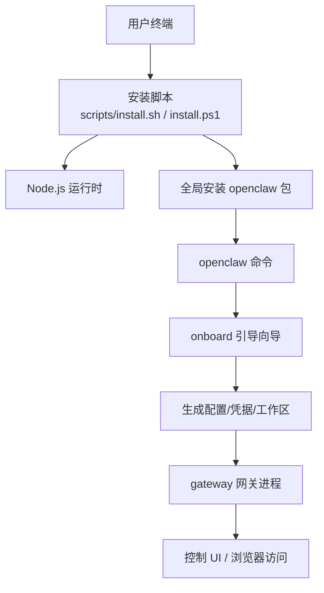
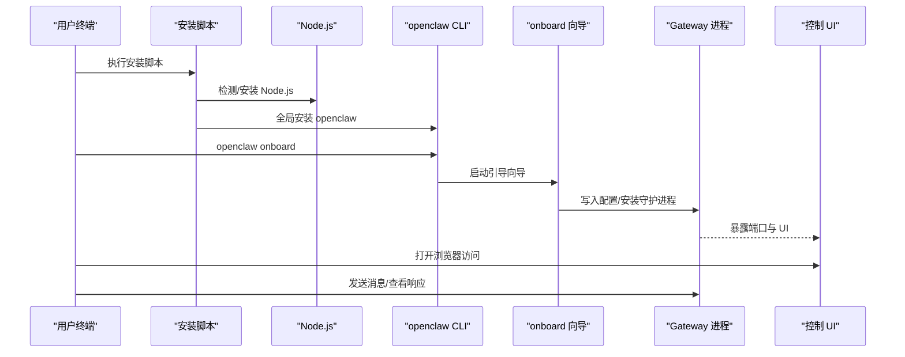

# 快速开始

<cite>
**本文引用的文件**   
- [README.md](file://README.md)
- [getting-started.md](file://docs/start/getting-started.md)
- [wizard.md](file://docs/start/wizard.md)
- [onboard.md](file://docs/cli/onboard.md)
- [node.md](file://docs/install/node.md)
- [linux.md](file://docs/platforms/linux.md)
- [windows.md](file://docs/platforms/windows.md)
- [macos.md](file://docs/platforms/macos.md)
- [troubleshooting.md](file://docs/help/troubleshooting.md)
- [install.sh](file://scripts/install.sh)
- [install.ps1](file://scripts/install.ps1)
</cite>

## 目录
1. [简介](#简介)
2. [项目结构](#项目结构)
3. [核心组件](#核心组件)
4. [架构总览](#架构总览)
5. [详细组件分析](#详细组件分析)
6. [依赖关系分析](#依赖关系分析)
7. [性能与可用性建议](#性能与可用性建议)
8. [故障排查指南](#故障排查指南)
9. [结论](#结论)
10. [附录：平台安装要点](#附录平台安装要点)

## 简介
本指南面向首次接触 OpenClaw 的用户，目标是在约 30 分钟内完成从零到“能用”的全流程：安装运行时、安装 OpenClaw、运行引导向导、启动网关、打开控制界面并进行一次对话。文档覆盖 macOS、Linux、Windows（WSL2）三大平台，并对常见问题提供快速定位与修复路径。

## 项目结构
- 安装与入门文档集中在 docs/start 下，包含“Getting Started”“Wizard”等关键页面。
- 平台说明在 docs/platforms 下，分别给出 macOS、Linux、Windows 的安装与服务管理要点。
- CLI 参考在 docs/cli 下，onboard 子页是引导向导的权威参考。
- 故障排查在 docs/help/troubleshooting.md 中提供症状树与快速诊断清单。
- 安装脚本位于 scripts/，提供跨平台自动安装逻辑与提示。

图表来源
- [install.sh](file://scripts/install.sh#L1-L120)
- [install.ps1](file://scripts/install.ps1#L1-L120)
- [getting-started.md](file://docs/start/getting-started.md#L28-L77)

章节来源
- [README.md](file://README.md#L50-L81)
- [getting-started.md](file://docs/start/getting-started.md#L1-L136)

## 核心组件
- 运行时要求：Node.js ≥ 22（推荐使用 LTS）。安装脚本会检测并尝试自动安装。
- 安装方式：推荐使用官方安装脚本一键安装；也可通过 npm/pnpm/bun 全局安装。
- 引导向导：openclaw onboard 提供交互式设置，涵盖模型/认证、工作区、网关、通道、守护进程与技能。
- 网关：本地或远程均可，支持 Token 认证、系统服务（launchd/systemd 用户服务）。
- 控制界面：无需通道配置即可直接访问，最快体验核心功能。

章节来源
- [README.md](file://README.md#L50-L81)
- [node.md](file://docs/install/node.md#L12-L21)
- [getting-started.md](file://docs/start/getting-started.md#L20-L81)
- [wizard.md](file://docs/start/wizard.md#L10-L35)

## 架构总览
下图展示从安装到首次聊天的关键路径：安装脚本 → 运行时 → CLI → 引导向导 → 网关 → 控制 UI。

图表来源
- [install.sh](file://scripts/install.sh#L1-L120)
- [install.ps1](file://scripts/install.ps1#L1-L120)
- [onboard.md](file://docs/cli/onboard.md#L8-L27)
- [wizard.md](file://docs/start/wizard.md#L10-L35)

## 详细组件分析

### 1) 安装与运行时准备
- macOS/Linux：推荐使用 curl 脚本安装，自动检测 Node 版本并提示升级或安装。
- Windows：推荐使用 PowerShell 脚本安装，自动处理执行策略、Node/Git 安装与 PATH 注册。
- Node 版本要求：≥ 22；若版本过低，按脚本提示升级。

章节来源
- [node.md](file://docs/install/node.md#L12-L21)
- [install.sh](file://scripts/install.sh#L1-L120)
- [install.ps1](file://scripts/install.ps1#L1-L120)

### 2) 引导向导 onboard（重点）
- 作用：一次性完成模型/认证、工作区、网关、通道、守护进程与技能的配置。
- 两种模式：
  - QuickStart：默认选项，适合快速上手。
  - Advanced：逐项可选，适合精细控制。
- 关键行为：
  - 本地模式：写入本地凭据、生成网关 Token、安装 launchd/systemd 用户服务。
  - 远程模式：仅配置本地客户端连接远程网关，不改动远端。
  - 支持非交互模式（如 CI），可指定认证方式、自定义 Provider、SecretRef 等。
- 建议：首次运行选择 QuickStart，后续可通过 openclaw configure 或 agents add 进行增量调整。

章节来源
- [wizard.md](file://docs/start/wizard.md#L44-L94)
- [onboard.md](file://docs/cli/onboard.md#L8-L27)
- [onboard.md](file://docs/cli/onboard.md#L120-L139)

### 3) 网关与服务
- 本地网关：默认绑定 loopback，启用 Token 认证（即使本地也强制）。
- 守护进程：macOS 使用 launchd，Linux/WSL 使用 systemd 用户服务；可由 onboard 自动安装。
- 远程访问：可通过 SSH 隧道或 Tailscale 将本地 UI 与远程网关打通。

章节来源
- [wizard.md](file://docs/start/wizard.md#L64-L94)
- [linux.md](file://docs/platforms/linux.md#L37-L58)
- [macos.md](file://docs/platforms/macos.md#L26-L49)

### 4) 首次体验：控制 UI 与基础命令
- 最快路径：openclaw dashboard 打开浏览器控制界面，无需通道配置。
- 基础命令示例（来自仓库 README）：
  - openclaw onboard --install-daemon
  - openclaw gateway --port 18789 --verbose
  - openclaw message send --to +1234567890 --message "Hello from OpenClaw"
  - openclaw agent --message "Ship checklist" --thinking high

章节来源
- [README.md](file://README.md#L63-L79)
- [getting-started.md](file://docs/start/getting-started.md#L72-L77)

## 依赖关系分析
- 安装脚本依赖 Node.js 与包管理器（npm/pnpm），并在必要时自动安装构建工具（make/cmake/gcc 等）。
- 引导向导依赖 CLI 工具链与系统服务管理器（launchd/systemd）。
- 网关依赖 Node 运行时与系统权限（macOS 上的 TCC 权限）。

图表来源
- [node.md](file://docs/install/node.md#L12-L21)
- [wizard.md](file://docs/start/wizard.md#L64-L94)
- [linux.md](file://docs/platforms/linux.md#L65-L94)

章节来源
- [node.md](file://docs/install/node.md#L12-L21)
- [install.sh](file://scripts/install.sh#L568-L672)
- [install.ps1](file://scripts/install.ps1#L102-L200)

## 性能与可用性建议
- 使用现代模型与严格工具策略，降低提示注入风险。
- 在多用户/共享环境下，启用分层信任边界与最小化工具权限。
- 通过 SecretRef 管理密钥，避免明文存储。
- 在 Linux/WSL 上优先使用 systemd 用户服务，确保开机自启与稳定运行。

章节来源
- [wizard.md](file://docs/start/wizard.md#L68-L73)
- [linux.md](file://docs/platforms/linux.md#L65-L94)

## 故障排查指南
- 三分钟快速诊断清单（按顺序执行）：
  - openclaw status
  - openclaw status --all
  - openclaw gateway probe
  - openclaw gateway status
  - openclaw doctor
  - openclaw channels status --probe
  - openclaw logs --follow
- 常见问题定位：
  - Dashboard/控制 UI 无法连接：检查网关地址/端口、认证模式与 Token 是否正确。
  - 网关未启动或服务未运行：确认服务已安装并加载，端口未被占用。
  - 通道已连接但消息不流动：检查 mention gating、DM 策略与允许列表。
  - Node 工具失败：检查权限状态、前台可见性与执行审批。
  - 浏览器工具失败：检查浏览器二进制路径、扩展附加状态与 CDP 可达性。

章节来源
- [troubleshooting.md](file://docs/help/troubleshooting.md#L13-L36)
- [troubleshooting.md](file://docs/help/troubleshooting.md#L121-L147)
- [troubleshooting.md](file://docs/help/troubleshooting.md#L150-L176)
- [troubleshooting.md](file://docs/help/troubleshooting.md#L179-L204)
- [troubleshooting.md](file://docs/help/troubleshooting.md#L238-L265)
- [troubleshooting.md](file://docs/help/troubleshooting.md#L268-L295)

## 结论
通过本指南，您可以在 30 分钟内完成 OpenClaw 的安装与首次配置，体验核心功能。建议优先使用 QuickStart 引导向导，随后根据需要逐步完善通道、技能与安全策略。遇到问题时，先用“快速诊断清单”定位根因，再查阅对应子页的深入说明。

## 附录：平台安装要点
- macOS
  - 推荐使用安装脚本；如需 macOS 应用配合，可参考应用说明与权限管理。
  - 本地/远程模式切换与服务管理详见平台文档。
- Linux
  - 使用 npm 全局安装后，通过 onboard 安装 systemd 用户服务。
  - VPS 快速路径：安装 Node → npm i -g openclaw → onboard --install-daemon → SSH 隧道访问 UI。
- Windows（WSL2）
  - 强烈推荐在 WSL2（Ubuntu）中安装，保持与 Linux 一致的运行环境。
  - 完成 WSL 系统引导与 systemd 后，按 Linux 步骤安装与启动。

章节来源
- [macos.md](file://docs/platforms/macos.md#L9-L34)
- [linux.md](file://docs/platforms/linux.md#L16-L58)
- [windows.md](file://docs/platforms/windows.md#L9-L51)
- [windows.md](file://docs/platforms/windows.md#L147-L198)