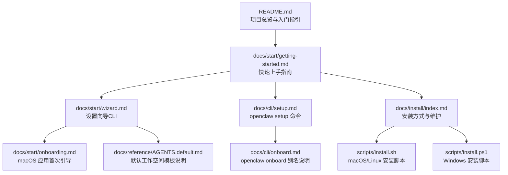
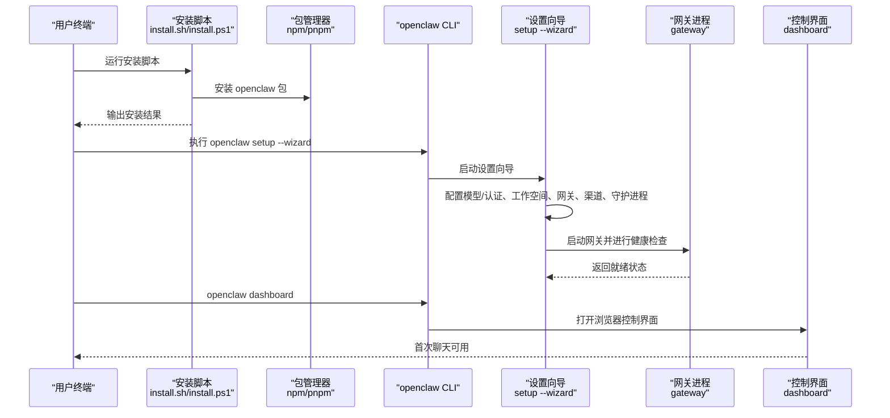

# 快速开始

<cite>
**本文引用的文件**
- [README.md](file://README.md)
- [getting-started.md](file://docs/start/getting-started.md)
- [quickstart.md](file://docs/start/quickstart.md)
- [onboarding.md](file://docs/start/onboarding.md)
- [wizard.md](file://docs/start/wizard.md)
- [install/index.md](file://docs/install/index.md)
- [cli/setup.md](file://docs/cli/setup.md)
- [cli/onboard.md](file://docs/cli/onboard.md)
- [AGENTS.default.md](file://docs/reference/AGENTS.default.md)
- [install.sh](file://scripts/install.sh)
- [install.ps1](file://scripts/install.ps1)
</cite>

## 目录
1. [简介](#简介)
2. [项目结构](#项目结构)
3. [核心组件](#核心组件)
4. [架构总览](#架构总览)
5. [详细组件分析](#详细组件分析)
6. [依赖关系分析](#依赖关系分析)
7. [性能与安全建议](#性能与安全建议)
8. [故障排查指南](#故障排查指南)
9. [结论](#结论)
10. [附录：命令与配置参考](#附录命令与配置参考)

## 简介
本指南面向首次接触 OpenClaw 的用户，带你从零完成环境准备、安装、基础配置与首次运行，并系统讲解“设置向导（Setup Wizard）”的使用方法，覆盖网关设置、工作空间配置、渠道连接、技能安装等核心步骤。文末提供常见问题排查与最佳实践，帮助你在最短时间内体验平台核心能力。

## 项目结构
为便于理解，以下图示展示与“快速开始”直接相关的文档与脚本位置：

```mermaid
graph TB
A["README.md<br/>项目总览与入门指引"] --> B["docs/start/getting-started.md<br/>快速上手指南"]
B --> C["docs/start/wizard.md<br/>设置向导CLI"]
B --> D["docs/cli/setup.md<br/>openclaw setup 命令"]
B --> E["docs/install/index.md<br/>安装方式与维护"]
E --> F["scripts/install.sh<br/>macOS/Linux 安装脚本"]
E --> G["scripts/install.ps1<br/>Windows 安装脚本"]
C --> H["docs/start/onboarding.md<br/>macOS 应用首次引导"]
C --> I["docs/reference/AGENTS.default.md<br/>默认工作空间模板说明"]
D --> J["docs/cli/onboard.md<br/>openclaw onboard 别名说明"]
```

图表来源
- [README.md](file://README.md)
- [getting-started.md](file://docs/start/getting-started.md)
- [wizard.md](file://docs/start/wizard.md)
- [install/index.md](file://docs/install/index.md)
- [cli/setup.md](file://docs/cli/setup.md)
- [cli/onboard.md](file://docs/cli/onboard.md)
- [onboarding.md](file://docs/start/onboarding.md)
- [AGENTS.default.md](file://docs/reference/AGENTS.default.md)
- [install.sh](file://scripts/install.sh)
- [install.ps1](file://scripts/install.ps1)

章节来源
- [README.md](file://README.md)
- [getting-started.md](file://docs/start/getting-started.md)
- [wizard.md](file://docs/start/wizard.md)
- [install/index.md](file://docs/install/index.md)
- [cli/setup.md](file://docs/cli/setup.md)
- [cli/onboard.md](file://docs/cli/onboard.md)
- [onboarding.md](file://docs/start/onboarding.md)
- [AGENTS.default.md](file://docs/reference/AGENTS.default.md)
- [install.sh](file://scripts/install.sh)
- [install.ps1](file://scripts/install.ps1)

## 核心组件
- 安装与初始化
  - 推荐使用安装脚本一键完成 Node 检测/安装与首次引导；或通过包管理器安装后运行设置向导。
  - Windows 用户可使用 PowerShell 脚本，自动处理执行策略与依赖。
- 设置向导（CLI）
  - 交互式引导你完成模型/认证、工作空间、网关、渠道、守护进程与健康检查、技能安装等步骤。
- 工作空间与模板
  - 默认工作空间位于用户目录下，内置 AGENTS.md、SOUL.md、TOOLS.md 等模板，支持复制与替换。
- macOS 首次引导（应用）
  - 引导选择网关运行位置、权限授予、本地/远程模式、CLI 安装等，确保首次体验顺畅。

章节来源
- [install/index.md](file://docs/install/index.md)
- [install.sh](file://scripts/install.sh)
- [install.ps1](file://scripts/install.ps1)
- [wizard.md](file://docs/start/wizard.md)
- [AGENTS.default.md](file://docs/reference/AGENTS.default.md)
- [onboarding.md](file://docs/start/onboarding.md)

## 架构总览
下图展示了“从安装到首次运行”的端到端流程，以及与向导相关的控制面与数据面交互：

```mermaid
sequenceDiagram
participant U as "用户终端"
participant SH as "安装脚本<br/>install.sh/install.ps1"
participant NPM as "包管理器<br/>npm/pnpm"
participant CLI as "openclaw CLI"
participant WZ as "设置向导<br/>setup --wizard"
participant GW as "网关进程<br/>gateway"
participant UI as "控制界面<br/>dashboard"
U->>SH : 运行安装脚本
SH->>NPM : 安装 openclaw 包
SH-->>U : 输出安装结果
U->>CLI : 执行 openclaw setup --wizard
CLI->>WZ : 启动设置向导
WZ->>WZ : 配置模型/认证、工作空间、网关、渠道、守护进程
WZ->>GW : 启动网关并进行健康检查
GW-->>WZ : 返回就绪状态
U->>CLI : openclaw dashboard
CLI->>UI : 打开浏览器控制界面
UI-->>U : 首次聊天可用
```

图表来源
- [install.sh](file://scripts/install.sh)
- [install.ps1](file://scripts/install.ps1)
- [cli/setup.md](file://docs/cli/setup.md)
- [wizard.md](file://docs/start/wizard.md)
- [getting-started.md](file://docs/start/getting-started.md)

## 详细组件分析

### 组件一：安装与初始化（跨平台）
- macOS/Linux
  - 使用官方安装脚本，自动检测/安装 Node 并全局安装 openclaw，随后可直接运行设置向导。
  - 支持跳过首次引导仅安装二进制。
- Windows
  - PowerShell 脚本自动处理执行策略、Node/Git 检测与安装，最终输出 openclaw 可用提示。
- 包管理器安装
  - npm/pnpm 安装后，同样可直接运行设置向导；如遇到构建依赖问题，脚本会尝试自动安装必要工具。

章节来源
- [install/index.md](file://docs/install/index.md)
- [install.sh](file://scripts/install.sh)
- [install.ps1](file://scripts/install.ps1)

### 组件二：设置向导（CLI）
- 交互式流程
  - 模型/认证：支持多种提供商与认证方式，可选择自定义提供商。
  - 工作空间：默认路径与模板种子，可按需调整。
  - 网关：端口、绑定地址、鉴权模式、TailScale 暴露等。
  - 渠道：可选 WhatsApp、Telegram、Discord、Google Chat、Mattermost、Signal、BlueBubbles、iMessage 等。
  - 守护进程：在 macOS 或 Linux/WSL2 上安装用户级服务，开机自启。
  - 健康检查：启动网关并验证运行状态。
  - 技能：安装推荐技能与可选依赖。
- 非交互模式
  - 提供非交互参数，适合自动化部署与 CI 场景。

章节来源
- [wizard.md](file://docs/start/wizard.md)
- [cli/setup.md](file://docs/cli/setup.md)

### 组件三：工作空间与模板
- 默认工作空间
  - 默认位于用户目录下的工作区，包含 AGENTS.md、SOUL.md、TOOLS.md 等模板文件。
- 模板使用
  - 可复制模板至工作区，或直接替换为默认个人助理模板。
- 安全与备份建议
  - 建议将工作区作为“记忆库”纳入版本控制（私有仓库），定期备份重要文件。

章节来源
- [AGENTS.default.md](file://docs/reference/AGENTS.default.md)

### 组件四：macOS 应用首次引导
- 本地/远程网关选择
  - 本地：可写入本地凭据与配置。
  - 远程：不修改本地凭据，要求目标主机已存在有效凭据。
- 权限授予
  - 请求通知、辅助功能、屏幕录制、麦克风、语音识别、相机、定位等权限。
- CLI 安装（可选）
  - 在应用内安装全局 openclaw CLI，便于终端与任务集成。
- 引导聊天
  - 首次运行后打开专用引导会话，由代理介绍下一步操作。

章节来源
- [onboarding.md](file://docs/start/onboarding.md)

## 依赖关系分析
- 安装阶段
  - 安装脚本依赖 Node 与包管理器；Windows 脚本还处理执行策略与 Git。
- 运行阶段
  - openclaw CLI 依赖 Node 运行时；设置向导负责生成配置与工作区文件；网关进程承载控制平面与会话管理。
- 平台差异
  - macOS/Linux：守护进程安装与权限模型更完善。
  - Windows：强烈建议使用 WSL2 运行以获得最佳兼容性。

```mermaid
graph LR
subgraph "安装层"
IS["install.sh/install.ps1"]
PM["npm/pnpm"]
end
subgraph "运行层"
CLI["openclaw CLI"]
WZ["设置向导"]
GW["网关进程"]
UI["控制界面"]
end
IS --> PM
PM --> CLI
CLI --> WZ
WZ --> GW
GW --> UI
```

图表来源
- [install.sh](file://scripts/install.sh)
- [install.ps1](file://scripts/install.ps1)
- [cli/setup.md](file://docs/cli/setup.md)
- [wizard.md](file://docs/start/wizard.md)

章节来源
- [install/index.md](file://docs/install/index.md)
- [cli/setup.md](file://docs/cli/setup.md)
- [wizard.md](file://docs/start/wizard.md)

## 性能与安全建议
- 性能
  - 使用 Node 24（推荐）以获得最新性能与稳定性；若使用较老版本，仍可兼容。
  - 在 Linux/WSL2 上运行可显著提升通道与工具链的响应速度。
- 安全
  - 默认情况下，工具在主会话中运行；在群组/频道场景中建议启用沙箱策略，限制工具集。
  - 对于处理 webhook/钩子内容的场景，优先选用更强的模型，并严格限制工具策略与沙箱。
- 网络暴露
  - 如需远程访问，可通过 TailScale Serve/Funnel 暴露网关，但需正确配置鉴权与密码策略。

章节来源
- [README.md](file://README.md)
- [install/index.md](file://docs/install/index.md)

## 故障排查指南
- openclaw 命令找不到
  - 检查全局 npm bin 是否在 PATH 中；在 macOS/Linux 下通常为 $(npm prefix -g)/bin；Windows 为 $(npm prefix -g)。
  - 新建终端或刷新缓存后再试。
- 安装失败（npm）
  - 若出现构建工具缺失错误，脚本会尝试自动安装；也可手动安装编译工具链（make、cmake、gcc 等）。
- Windows 执行策略限制
  - PowerShell 执行策略可能阻止脚本运行；可在当前进程临时放宽或以管理员身份设置策略。
- 网关无法启动或端口占用
  - 检查端口占用情况，或调整网关监听端口；确认防火墙放行。
- 渠道连接失败
  - 确认渠道所需的令牌/密钥已正确配置；对 Telegram/WhatsApp 等渠道，注意允许列表与分组策略。

章节来源
- [install/index.md](file://docs/install/index.md)
- [install.sh](file://scripts/install.sh)
- [install.ps1](file://scripts/install.ps1)

## 结论
通过本指南，你已完成从环境准备、安装、设置向导到首次运行的全流程。建议在本地先以“控制界面”完成基础验证，再逐步接入常用渠道与技能。后续可深入阅读各模块文档，按需启用高级特性与安全策略。

## 附录：命令与配置参考
- 快速开始命令（macOS/Linux）
  - 安装并运行设置向导：参考安装页面与脚本说明。
  - 启动网关并打开控制界面：参考快速上手文档。
- Windows 快速开始
  - 使用 PowerShell 脚本安装并运行设置向导。
- 设置向导（CLI）
  - openclaw setup --wizard：交互式引导。
  - openclaw setup --wizard --non-interactive：非交互模式（适合自动化）。
  - openclaw onboard：旧版别名，等价于 setup --wizard。
- 工作空间与模板
  - 复制模板文件至工作区，或替换为默认个人助理模板。
- 环境变量
  - OPENCLAW_HOME、OPENCLAW_STATE_DIR、OPENCLAW_CONFIG_PATH：用于自定义路径解析与状态目录。

章节来源
- [getting-started.md](file://docs/start/getting-started.md)
- [install/index.md](file://docs/install/index.md)
- [cli/setup.md](file://docs/cli/setup.md)
- [cli/onboard.md](file://docs/cli/onboard.md)
- [AGENTS.default.md](file://docs/reference/AGENTS.default.md)