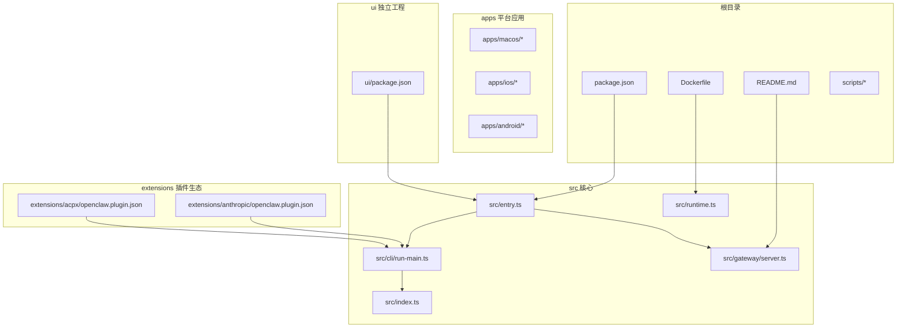
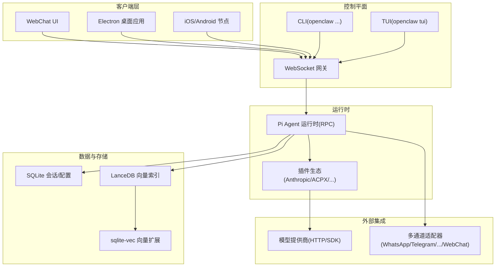
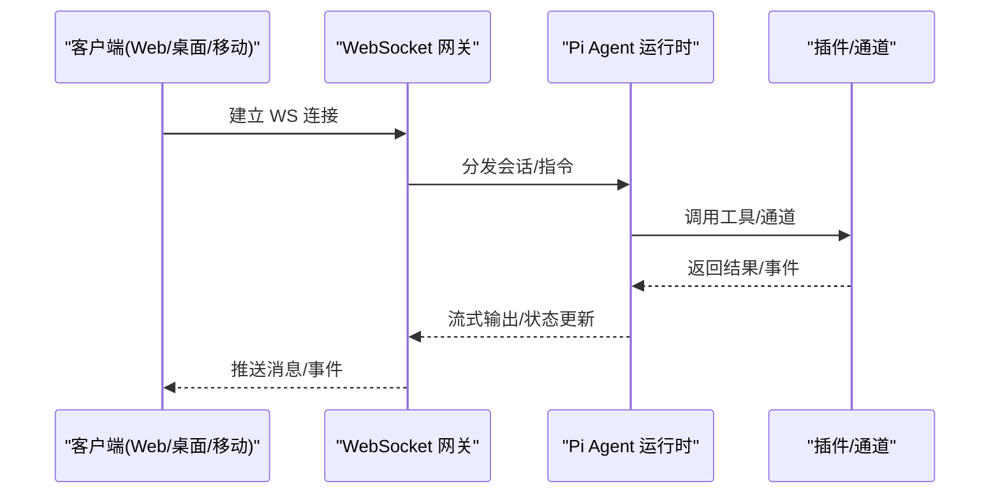
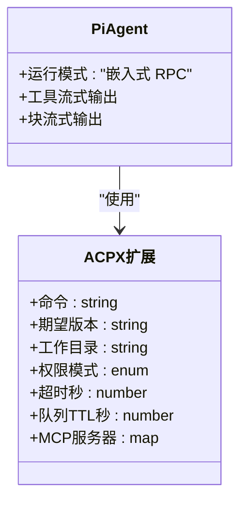
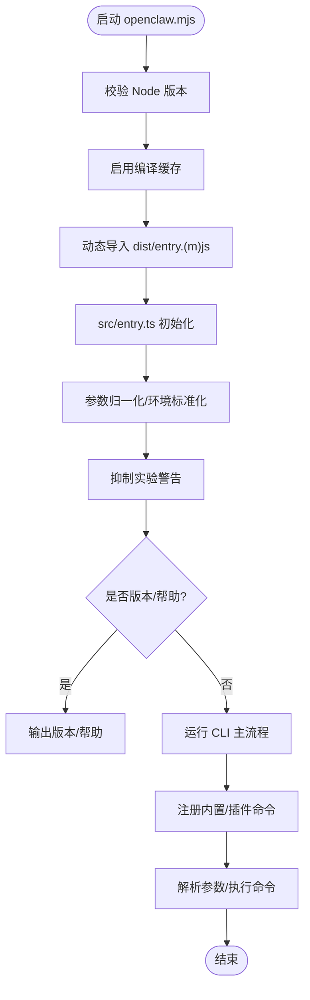
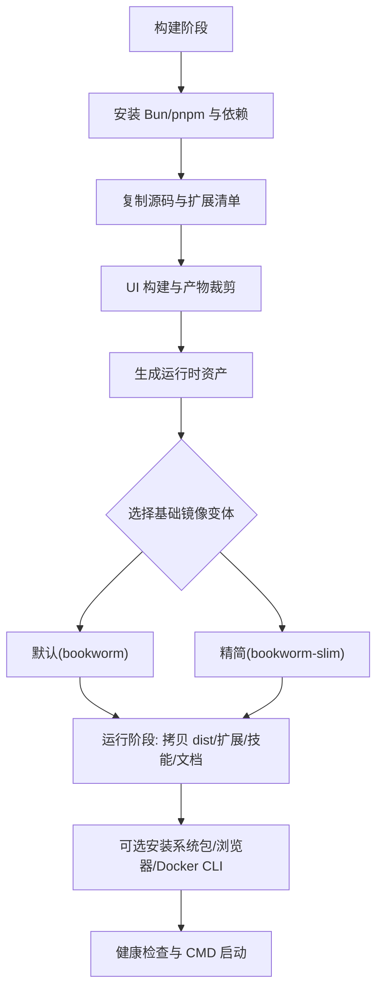
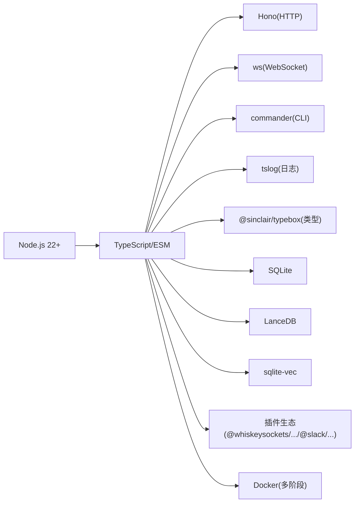

# 技术栈

<cite>
**本文引用的文件**
- [package.json](file://package.json)
- [README.md](file://README.md)
- [Dockerfile](file://Dockerfile)
- [openclaw.mjs](file://openclaw.mjs)
- [src/index.ts](file://src/index.ts)
- [src/runtime.ts](file://src/runtime.ts)
- [src/entry.ts](file://src/entry.ts)
- [src/cli/run-main.ts](file://src/cli/run-main.ts)
- [src/gateway/server.ts](file://src/gateway/server.ts)
- [src/gateway/client.watchdog.test.ts](file://src/gateway/client.watchdog.test.ts)
- [extensions/acpx/openclaw.plugin.json](file://extensions/acpx/openclaw.plugin.json)
- [extensions/anthropic/openclaw.plugin.json](file://extensions/anthropic/openclaw.plugin.json)
</cite>

## 目录
1. [简介](#简介)
2. [项目结构](#项目结构)
3. [核心组件](#核心组件)
4. [架构总览](#架构总览)
5. [详细组件分析](#详细组件分析)
6. [依赖分析](#依赖分析)
7. [性能考量](#性能考量)
8. [故障排查指南](#故障排查指南)
9. [结论](#结论)
10. [附录](#附录)

## 简介
本文件系统化梳理 OpenClaw 的技术架构与技术选型，重点覆盖以下方面：
- 开发语言与运行时：TypeScript/JavaScript 与 Node.js 22+
- 后端控制平面：基于 WebSocket 的网关（Gateway）控制平面
- 运行时：Pi Agent 运行时（嵌入式 RPC 模式）
- 容器化：Docker 多阶段构建与运行时镜像
- 前端与桌面：Electron（macOS 应用）、React（UI 子项目）
- 数据库与存储：SQLite、LanceDB、向量扩展 sqlite-vec
- 网络与通信：WebSocket、HTTP（Hono）、REST 风格的 CLI
- 插件与扩展：插件 SDK 与插件生态（如 Anthropic、ACPX）

这些技术选型在性能、可维护性与扩展性之间取得平衡，并通过容器化与多平台打包实现一致的部署体验。

## 项目结构
OpenClaw 采用多包工作区组织方式，核心目录与职责概览如下：
- 根目录：包管理与脚本、Docker 构建与运行、文档与国际化资源
- src：核心运行时、CLI、网关服务器、通道适配器、工具与自动化
- extensions：插件生态（按功能模块拆分），每个插件包含 openclaw.plugin.json 与入口
- apps：多平台应用（macOS、iOS、Android）与共享库
- ui：独立的 UI 工程（Vite 驱动）
- skills：技能仓库（可由插件或工作区注入）
- scripts：构建、测试、发布与运维脚本

**图表来源**
- [package.json](file://package.json)
- [Dockerfile](file://Dockerfile)
- [src/entry.ts](file://src/entry.ts)
- [src/runtime.ts](file://src/runtime.ts)
- [src/cli/run-main.ts](file://src/cli/run-main.ts)
- [src/gateway/server.ts](file://src/gateway/server.ts)
- [extensions/acpx/openclaw.plugin.json](file://extensions/acpx/openclaw.plugin.json)
- [extensions/anthropic/openclaw.plugin.json](file://extensions/anthropic/openclaw.plugin.json)

**章节来源**
- [package.json](file://package.json)
- [README.md](file://README.md)

## 核心组件
- 运行时与入口
  - openclaw.mjs：启动器，校验 Node 版本、启用编译缓存、动态导入分发入口
  - src/entry.ts：CLI 入口，处理参数归一化、实验警告抑制、快速路径（版本/帮助）、子进程桥接
  - src/runtime.ts：运行时日志与退出策略抽象，支持非退出模式用于测试
  - src/index.ts：导出库函数与类型，兼容旧版直接入口
- CLI 与命令路由
  - src/cli/run-main.ts：加载 .env、路径检查、注册内置与插件命令、解析参数、捕获未处理异常
- 网关控制平面
  - src/gateway/server.ts：导出网关服务器工厂与选项类型，负责 WebSocket 控制面
- 插件与认证
  - extensions/*/openclaw.plugin.json：定义插件 ID、能力、配置模式与 UI 提示，如 Anthropic 插件声明认证变量

**章节来源**
- [openclaw.mjs](file://openclaw.mjs)
- [src/entry.ts](file://src/entry.ts)
- [src/runtime.ts](file://src/runtime.ts)
- [src/index.ts](file://src/index.ts)
- [src/cli/run-main.ts](file://src/cli/run-main.ts)
- [src/gateway/server.ts](file://src/gateway/server.ts)
- [extensions/anthropic/openclaw.plugin.json](file://extensions/anthropic/openclaw.plugin.json)

## 架构总览
OpenClaw 的技术架构围绕“网关控制平面 + 多通道适配 + 插件生态 + 容器化运行”展开。下图展示从用户交互到模型推理与设备动作的整体流向：

**图表来源**
- [README.md](file://README.md)
- [src/gateway/server.ts](file://src/gateway/server.ts)
- [src/cli/run-main.ts](file://src/cli/run-main.ts)
- [extensions/acpx/openclaw.plugin.json](file://extensions/acpx/openclaw.plugin.json)
- [extensions/anthropic/openclaw.plugin.json](file://extensions/anthropic/openclaw.plugin.json)

## 详细组件分析

### 组件 A：WebSocket 网关控制平面
- 角色与职责
  - 单一 WS 控制平面，承载会话、存在性、配置、定时任务、Webhook、事件与远程控制
  - 支持健康检查端点（/healthz、/readyz），便于容器探针
- 关键行为
  - 通过 src/gateway/server.ts 导出的工厂方法启动
  - 测试中使用 ws/WebSocketServer 验证连接生命周期与心跳缺失关闭逻辑
- 与客户端的关系
  - Electron 桌面应用、WebChat、移动端节点均通过 WS 与网关交互

**图表来源**
- [src/gateway/server.ts](file://src/gateway/server.ts)
- [src/gateway/client.watchdog.test.ts](file://src/gateway/client.watchdog.test.ts)

**章节来源**
- [src/gateway/server.ts](file://src/gateway/server.ts)
- [src/gateway/client.watchdog.test.ts](file://src/gateway/client.watchdog.test.ts)

### 组件 B：Pi Agent 运行时（嵌入式 RPC）
- 角色与职责
  - 在网关内以嵌入式 RPC 模式运行，支持工具流式与块流式输出
  - 通过扩展（如 ACPX）接入 MCP 服务器与权限策略
- 配置与安全
  - 扩展配置包含命令路径、期望版本、工作目录、权限模式、超时、队列 TTL、MCP 服务器列表等
- 与网关协作
  - 通过 WS 方法调用与事件推送，实现会话编排与工具执行

**图表来源**
- [extensions/acpx/openclaw.plugin.json](file://extensions/acpx/openclaw.plugin.json)

**章节来源**
- [extensions/acpx/openclaw.plugin.json](file://extensions/acpx/openclaw.plugin.json)

### 组件 C：CLI 与命令路由
- 启动流程
  - openclaw.mjs 校验 Node 版本、启用编译缓存、动态导入分发入口
  - src/entry.ts 归一化参数、抑制实验警告、快速路径（版本/帮助）、子进程桥接
  - src/cli/run-main.ts 注册内置与插件命令、解析参数、捕获未处理异常
- 与运行时的关系
  - CLI 与网关同源，共享运行时日志与错误处理策略

**图表来源**
- [openclaw.mjs](file://openclaw.mjs)
- [src/entry.ts](file://src/entry.ts)
- [src/cli/run-main.ts](file://src/cli/run-main.ts)

**章节来源**
- [openclaw.mjs](file://openclaw.mjs)
- [src/entry.ts](file://src/entry.ts)
- [src/cli/run-main.ts](file://src/cli/run-main.ts)

### 组件 D：容器化与运行时镜像
- 多阶段构建
  - 提取扩展依赖清单，避免无关扩展变更导致缓存失效
  - 构建阶段安装 Bun 与 pnpm，执行 UI 构建与产物裁剪
  - 运行阶段仅拷贝生产依赖与构建产物，保留 pnpm 以支持容器内工作流
- 可选系统包与浏览器
  - 可选安装 Chromium/Xvfb 以减少容器启动时的 Playwright 下载等待
  - 可选安装 Docker CLI 以支持沙箱容器管理
- 健康检查与默认绑定
  - 内置 /healthz 与 /readyz 探针
  - 默认以 loopback 绑定，可通过网络模式或参数调整暴露策略

**图表来源**
- [Dockerfile](file://Dockerfile)

**章节来源**
- [Dockerfile](file://Dockerfile)

### 组件 E：插件与认证（以 Anthropic 为例）
- 插件声明
  - openclaw.plugin.json 声明插件 ID、提供商与认证环境变量
- 认证与配置
  - 通过环境变量注入密钥或令牌，遵循最小暴露原则
  - 配置模式与 UI 提示由 JSON Schema 与 uiHints 定义

**章节来源**
- [extensions/anthropic/openclaw.plugin.json](file://extensions/anthropic/openclaw.plugin.json)

## 依赖分析
- 运行时与语言
  - Node.js ≥ 22.12；TypeScript 模块化与 ES Module 导出
- 核心运行时依赖
  - WebSocket：ws（用于网关与测试）
  - HTTP：Hono（轻量 HTTP 框架，适合网关与探针）
  - CLI：commander（命令解析与帮助）
  - 日志：tslog（结构化日志）
  - 类型校验：@sinclair/typebox（配置与协议）
- 数据与存储
  - SQLite（会话与配置）
  - LanceDB（向量索引）
  - sqlite-vec（向量扩展）
- 插件与通道
  - 各通道适配器（如 @whiskeysockets/baileys、grammy、@slack/bolt 等）
  - 插件 SDK（多导出入口，面向不同平台与渠道）
- 容器与系统
  - Docker 多阶段构建与健康检查
  - 可选安装 Chromium/Xvfb、Docker CLI

**图表来源**
- [package.json](file://package.json)
- [Dockerfile](file://Dockerfile)

**章节来源**
- [package.json](file://package.json)
- [Dockerfile](file://Dockerfile)

## 性能考量
- 启动与编译
  - 启用 Node 编译缓存与 Bun/pnpm 快速安装，缩短冷启动时间
- 运行时优化
  - 多阶段裁剪产物，移除开发依赖与映射文件，降低镜像体积
  - 可选预装浏览器，减少首次启动下载开销
- I/O 与并发
  - WebSocket 控制平面单点聚合，结合队列与任务管理实现有序处理
  - 插件与通道适配器异步化，避免阻塞主循环
- 存储与检索
  - SQLite 本地持久化，LanceDB + sqlite-vec 提供高效向量检索

## 故障排查指南
- 版本不兼容
  - openclaw.mjs 会在 Node 版本不足时提示升级路径
- CLI 异常
  - src/cli/run-main.ts 安装未处理拒绝与未捕获异常处理器，确保错误可追踪
- 网关连接问题
  - 使用 src/gateway/client.watchdog.test.ts 中的 WS 连接辅助方法进行自测
- 容器健康
  - 通过 /healthz 与 /readyz 探针验证网关存活与就绪状态

**章节来源**
- [openclaw.mjs](file://openclaw.mjs)
- [src/cli/run-main.ts](file://src/cli/run-main.ts)
- [src/gateway/client.watchdog.test.ts](file://src/gateway/client.watchdog.test.ts)

## 结论
OpenClaw 的技术栈以 Node.js 22+ 为核心，结合 WebSocket 控制平面、Pi Agent 运行时、插件生态与容器化部署，形成高性能、可维护且可扩展的个人 AI 助手平台。通过严格的版本约束、多阶段构建与探针机制，确保在多平台与多场景下的稳定性与一致性。

## 附录
- 前端与桌面
  - Electron 桌面应用与 React UI 子项目通过独立工程管理，与核心运行时解耦
- 文档与国际化
  - docs 目录提供多语言文档与资源，配合脚本生成与链接审计

**章节来源**
- [README.md](file://README.md)