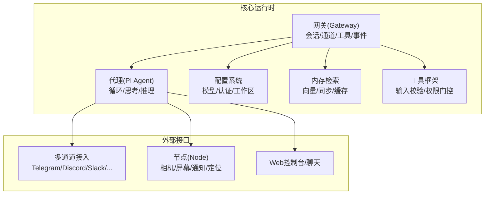
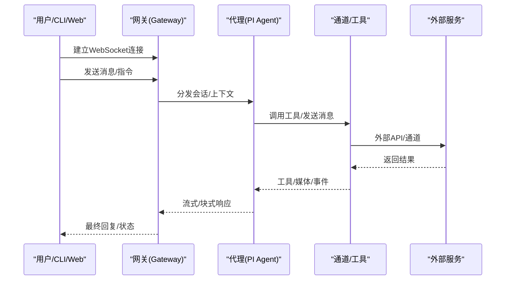
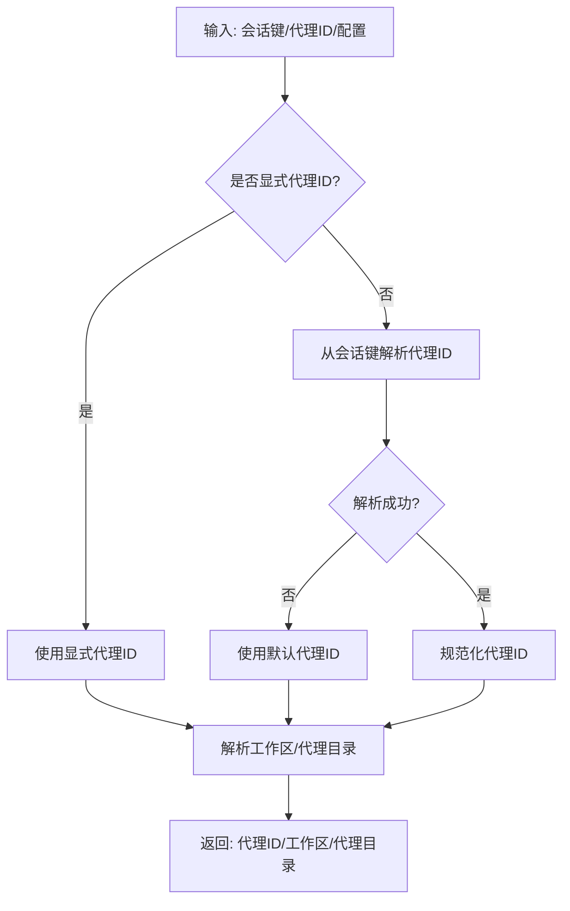
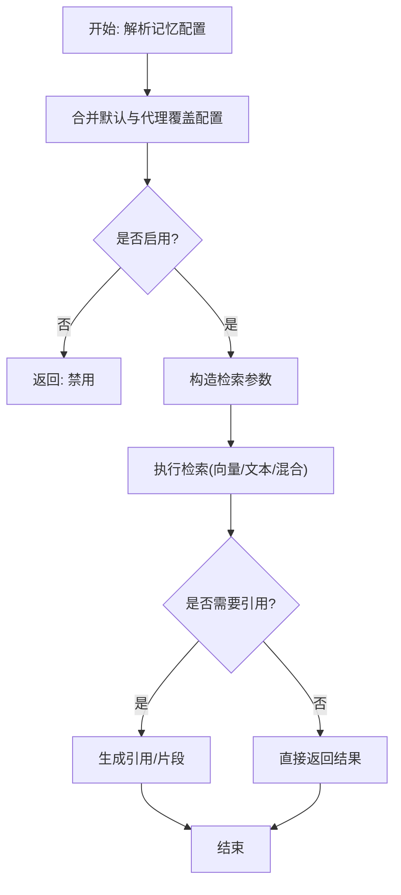
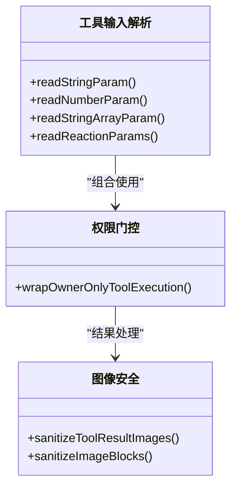
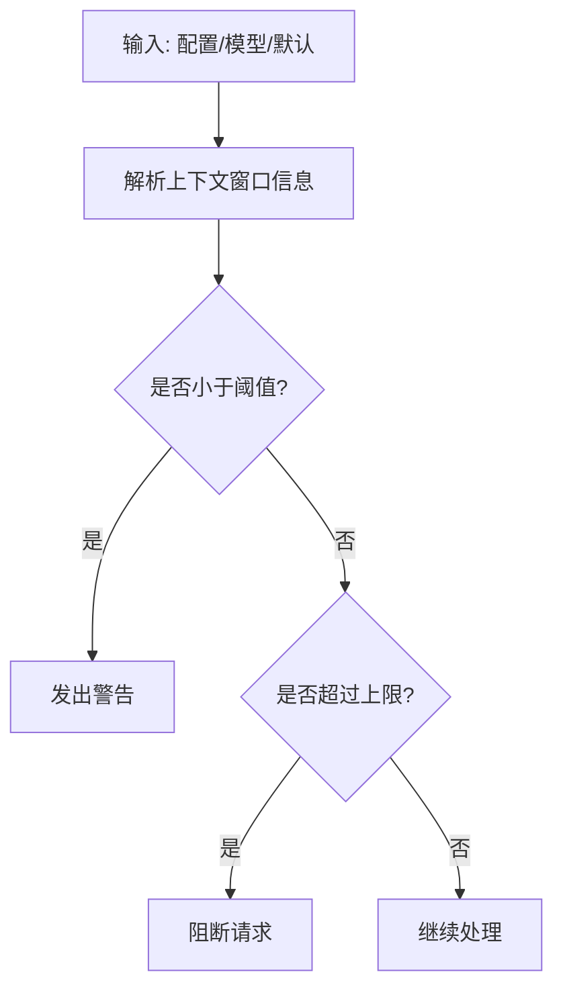
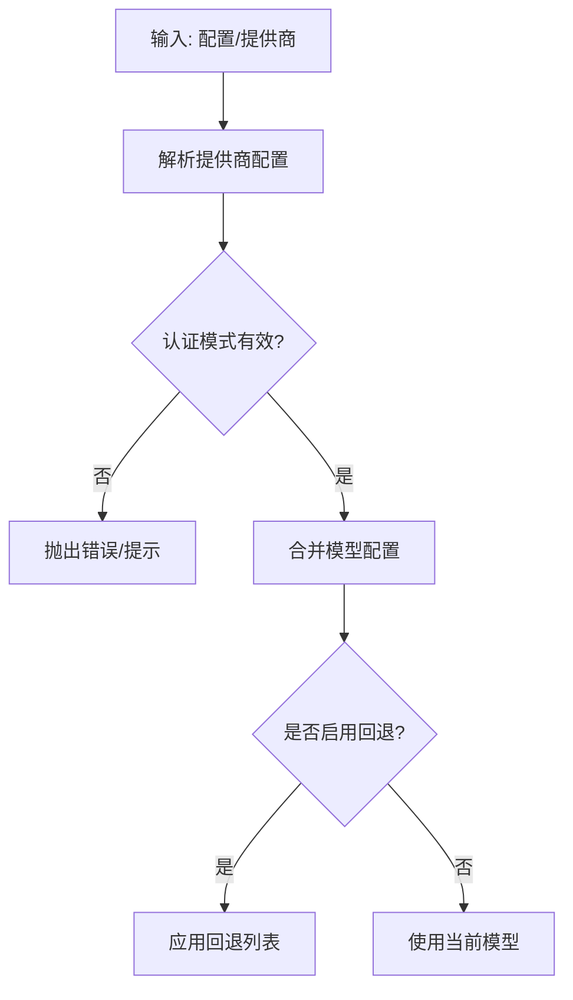
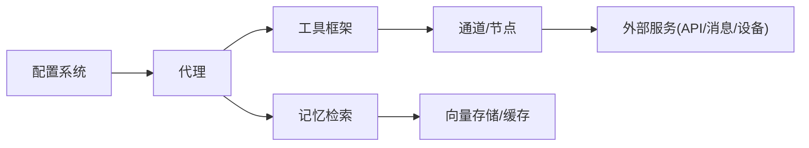

# AI代理平台

<cite>
**本文引用的文件**
- [README.md](file://README.md)
- [VISION.md](file://VISION.md)
- [AGENTS.md](file://AGENTS.md)
- [src/agents/memory-search.ts](file://src/agents/memory-search.ts)
- [src/agents/tools/memory-tool.ts](file://src/agents/tools/memory-tool.ts)
- [src/agents/tools/common.ts](file://src/agents/tools/common.ts)
- [src/agents/agent-scope.ts](file://src/agents/agent-scope.ts)
- [src/agents/context-window-guard.ts](file://src/agents/context-window-guard.ts)
- [src/agents/model-auth.ts](file://src/agents/model-auth.ts)
- [src/agents/models-config.merge.ts](file://src/agents/models-config.merge.ts)
- [src/agents/image-sanitization.ts](file://src/agents/image-sanitization.ts)
- [src/agents/tool-images.ts](file://src/agents/tool-images.ts)
- [src/config/plugin-auto-enable.ts](file://src/config/plugin-auto-enable.ts)
- [src/commands/onboard-auth.config-shared.test.ts](file://src/commands/onboard-auth.config-shared.test.ts)
- [docs/concepts/compaction.md](file://docs/concepts/compaction.md)
- [docs/concepts/agent-workspace.md](file://docs/concepts/agent-workspace.md)
- [docs/concepts/memory.md](file://docs/concepts/memory.md)
- [docs/concepts/session.md](file://docs/concepts/session.md)
- [docs/concepts/session-tool.md](file://docs/concepts/session-tool.md)
- [docs/concepts/model-providers.md](file://docs/concepts/model-providers.md)
- [docs/concepts/model-failover.md](file://docs/concepts/model-failover.md)
- [docs/concepts/session-pruning.md](file://docs/concepts/session-pruning.md)
- [docs/concepts/agent-loop.md](file://docs/concepts/agent-loop.md)
- [docs/concepts/queue.md](file://docs/concepts/queue.md)
- [docs/concepts/typing-indicators.md](file://docs/concepts/typing-indicators.md)
- [docs/concepts/usage-tracking.md](file://docs/concepts/usage-tracking.md)
- [docs/concepts/streaming.md](file://docs/concepts/streaming.md)
- [docs/concepts/system-prompt.md](file://docs/concepts/system-prompt.md)
- [docs/concepts/typebox.md](file://docs/concepts/typebox.md)
- [docs/concepts/presence.md](file://docs/concepts/presence.md)
- [docs/concepts/retry.md](file://docs/concepts/retry.md)
- [docs/concepts/architecture.md](file://docs/concepts/architecture.md)
- [docs/gateway/configuration.md](file://docs/gateway/configuration.md)
- [docs/gateway/configuration-reference.md](file://docs/gateway/configuration-reference.md)
- [docs/gateway/authentication.md](file://docs/gateway/authentication.md)
- [docs/gateway/remote.md](file://docs/gateway/remote.md)
- [docs/gateway/heartbeat.md](file://docs/gateway/heartbeat.md)
- [docs/gateway/doctor.md](file://docs/gateway/doctor.md)
- [docs/gateway/security.md](file://docs/gateway/security.md)
- [docs/gateway/sandboxing.md](file://docs/gateway/sandboxing.md)
- [docs/gateway/sandbox-vs-tool-policy-vs-elevated.md](file://docs/gateway/sandbox-vs-tool-policy-vs-elevated.md)
- [docs/gateway/tools-invoke-http-api.md](file://docs/gateway/tools-invoke-http-api.md)
- [docs/tools/skills.md](file://docs/tools/skills.md)
- [docs/tools/skills-config.md](file://docs/tools/skills-config.md)
- [docs/tools/agent-send.md](file://docs/tools/agent-send.md)
- [docs/tools/thinking.md](file://docs/tools/thinking.md)
- [docs/tools/browser.md](file://docs/tools/browser.md)
- [docs/tools/elevated.md](file://docs/tools/elevated.md)
- [docs/tools/creating-skills.md](file://docs/tools/creating-skills.md)
- [docs/tools/slash-commands.md](file://docs/tools/slash-commands.md)
- [docs/tools/subagents.md](file://docs/tools/subagents.md)
- [docs/tools/loop-detection.md](file://docs/tools/loop-detection.md)
- [docs/tools/multi-agent-sandbox-tools.md](file://docs/tools/multi-agent-sandbox-tools.md)
- [docs/tools/llm-task.md](file://docs/tools/llm-task.md)
- [docs/tools/exec.md](file://docs/tools/exec.md)
- [docs/tools/exec-approvals.md](file://docs/tools/exec-approvals.md)
- [docs/tools/pdf.md](file://docs/tools/pdf.md)
- [docs/tools/web.md](file://docs/tools/web.md)
- [docs/tools/firecrawl.md](file://docs/tools/firecrawl.md)
- [docs/tools/index.md](file://docs/tools/index.md)
- [docs/providers/index.md](file://docs/providers/index.md)
- [docs/providers/openai.md](file://docs/providers/openai.md)
- [docs/providers/anthropic.md](file://docs/providers/anthropic.md)
- [docs/providers/bedrock.md](file://docs/providers/bedrock.md)
- [docs/providers/qwen.md](file://docs/providers/qwen.md)
- [docs/providers/mistral.md](file://docs/providers/mistral.md)
- [docs/providers/ollama.md](file://docs/providers/ollama.md)
- [docs/providers/litellm.md](file://docs/providers/litellm.md)
- [docs/providers/huggingface.md](file://docs/providers/huggingface.md)
- [docs/providers/models.md](file://docs/providers/models.md)
- [docs/channels/index.md](file://docs/channels/index.md)
- [docs/channels/channel-routing.md](file://docs/channels/channel-routing.md)
- [docs/channels/groups.md](file://docs/channels/groups.md)
- [docs/channels/group-messages.md](file://docs/channels/group-messages.md)
- [docs/channels/imessage.md](file://docs/channels/imessage.md)
- [docs/channels/discord.md](file://docs/channels/discord.md)
- [docs/channels/telegram.md](file://docs/channels/telegram.md)
- [docs/channels/signal.md](file://docs/channels/signal.md)
- [docs/channels/whatsapp.md](file://docs/channels/whatsapp.md)
- [docs/channels/googlechat.md](file://docs/channels/googlechat.md)
- [docs/channels/teams.md](file://docs/channels/teams.md)
- [docs/channels/matrix.md](file://docs/channels/matrix.md)
- [docs/channels/line.md](file://docs/channels/line.md)
- [docs/channels/mattermost.md](file://docs/channels/mattermost.md)
- [docs/channels/nextcloud-talk.md](file://docs/channels/nextcloud-talk.md)
- [docs/channels/nostr.md](file://docs/channels/nostr.md)
- [docs/channels/synology-chat.md](file://docs/channels/synology-chat.md)
- [docs/channels/tlon.md](file://docs/channels/tlon.md)
- [docs/channels/twitch.md](file://docs/channels/twitch.md)
- [docs/channels/zalo.md](file://docs/channels/zalo.md)
- [docs/channels/zalouser.md](file://docs/channels/zalouser.md)
- [docs/channels/irc.md](file://docs/channels/irc.md)
- [docs/channels/webchat.md](file://docs/channels/webchat.md)
- [docs/nodes/index.md](file://docs/nodes/index.md)
- [docs/nodes/location-command.md](file://docs/nodes/location-command.md)
- [docs/nodes/media-understanding.md](file://docs/nodes/media-understanding.md)
- [docs/nodes/talk.md](file://docs/nodes/talk.md)
- [docs/nodes/voicewake.md](file://docs/nodes/voicewake.md)
- [docs/nodes/audio.md](file://docs/nodes/audio.md)
- [docs/nodes/camera.md](file://docs/nodes/camera.md)
- [docs/nodes/images.md](file://docs/nodes/images.md)
- [docs/platforms/macos.md](file://docs/platforms/macos.md)
- [docs/platforms/ios.md](file://docs/platforms/ios.md)
- [docs/platforms/android.md](file://docs/platforms/android.md)
- [docs/platforms/linux.md](file://docs/platforms/linux.md)
- [docs/platforms/windows.md](file://docs/platforms/windows.md)
- [docs/web/index.md](file://docs/web/index.md)
- [docs/web/webchat.md](file://docs/web/webchat.md)
- [docs/web/control-ui.md](file://docs/web/control-ui.md)
- [docs/web/dashboard.md](file://docs/web/dashboard.md)
- [docs/automation/cron-jobs.md](file://docs/automation/cron-jobs.md)
- [docs/automation/webhook.md](file://docs/automation/webhook.md)
- [docs/automation/gmail-pubsub.md](file://docs/automation/gmail-pubsub.md)
- [docs/automation/hooks.md](file://docs/automation/hooks.md)
- [docs/automation/poll.md](file://docs/automation/poll.md)
- [docs/automation/cron-vs-heartbeat.md](file://docs/automation/cron-vs-heartbeat.md)
- [docs/automation/auth-monitoring.md](file://docs/automation/auth-monitoring.md)
- [docs/automation/troubleshooting.md](file://docs/automation/troubleshooting.md)
- [docs/cli/agent.md](file://docs/cli/agent.md)
- [docs/cli/agents.md](file://docs/cli/agents.md)
- [docs/cli/sessions.md](file://docs/cli/sessions.md)
- [docs/cli/skills.md](file://docs/cli/skills.md)
- [docs/cli/models.md](file://docs/cli/models.md)
- [docs/cli/config.md](file://docs/cli/config.md)
- [docs/cli/configure.md](file://docs/cli/configure.md)
- [docs/cli/daemon.md](file://docs/cli/daemon.md)
- [docs/cli/dashboard.md](file://docs/cli/dashboard.md)
- [docs/cli/devices.md](file://docs/cli/devices.md)
- [docs/cli/directory.md](file://docs/cli/directory.md)
- [docs/cli/docs.md](file://docs/cli/docs.md)
- [docs/cli/doctor.md](file://docs/cli/doctor.md)
- [docs/cli/gateway.md](file://docs/cli/gateway.md)
- [docs/cli/health.md](file://docs/cli/health.md)
- [docs/cli/hooks.md](file://docs/cli/hooks.md)
- [docs/cli/memory.md](file://docs/cli/memory.md)
- [docs/cli/message.md](file://docs/cli/message.md)
- [docs/cli/node.md](file://docs/cli/node.md)
- [docs/cli/nodes.md](file://docs/cli/nodes.md)
- [docs/cli/onboard.md](file://docs/cli/onboard.md)
- [docs/cli/pairing.md](file://docs/cli/pairing.md)
- [docs/cli/plugins.md](file://docs/cli/plugins.md)
- [docs/cli/qr.md](file://docs/cli/qr.md)
- [docs/cli/reset.md](file://docs/cli/reset.md)
- [docs/cli/sandbox.md](file://docs/cli/sandbox.md)
- [docs/cli/secrets.md](file://docs/cli/secrets.md)
- [docs/cli/security.md](file://docs/cli/security.md)
- [docs/cli/setup.md](file://docs/cli/setup.md)
- [docs/cli/status.md](file://docs/cli/status.md)
- [docs/cli/system.md](file://docs/cli/system.md)
- [docs/cli/tui.md](file://docs/cli/tui.md)
- [docs/cli/uninstall.md](file://docs/cli/uninstall.md)
- [docs/cli/update.md](file://docs/cli/update.md)
- [docs/cli/voicecall.md](file://docs/cli/voicecall.md)
- [docs/cli/webhooks.md](file://docs/cli/webhooks.md)
- [docs/reference/AGENTS.default.md](file://docs/reference/AGENTS.default.md)
- [docs/reference/session-management-compaction.md](file://docs/reference/session-management-compaction.md)
- [docs/reference/prompt-caching.md](file://docs/reference/prompt-caching.md)
- [docs/reference/token-use.md](file://docs/reference/token-use.md)
- [docs/reference/transcript-hygiene.md](file://docs/reference/transcript-hygiene.md)
- [docs/reference/wizard.md](file://docs/reference/wizard.md)
- [docs/design/kilo-gateway-integration.md](file://docs/design/kilo-gateway-integration.md)
- [docs/refactor/clawnet.md](file://docs/refactor/clawnet.md)
- [docs/refactor/cluster.md](file://docs/refactor/cluster.md)
- [docs/refactor/exec-host.md](file://docs/refactor/exec-host.md)
- [docs/refactor/outbound-session-mirroring.md](file://docs/refactor/outbound-session-mirroring.md)
- [docs/refactor/plugin-sdk.md](file://docs/refactor/plugin-sdk.md)
- [docs/refactor/strict-config.md](file://docs/refactor/strict-config.md)
- [docs/refactor/plan.md](file://docs/refactor/plan.md)
- [docs/refactor/proposal.md](file://docs/refactor/proposal.md)
- [docs/refactor/research.md](file://docs/refactor/research.md)
- [docs/refactor/onboarding-config-protocol.md](file://docs/refactor/onboarding-config-protocol.md)
- [docs/security/README.md](file://docs/security/README.md)
- [docs/security/CONTRIBUTING-THREAT-MODEL.md](file://docs/security/CONTRIBUTING-THREAT-MODEL.md)
- [docs/security/THREAT-MODEL-ATLAS.md](file://docs/security/THREAT-MODEL-ATLAS.md)
- [docs/security/formal-verification.md](file://docs/security/formal-verification.md)
- [docs/help/debugging.md](file://docs/help/debugging.md)
- [docs/help/environment.md](file://docs/help/environment.md)
- [docs/help/faq.md](file://docs/help/faq.md)
- [docs/help/index.md](file://docs/help/index.md)
- [docs/help/scripts.md](file://docs/help/scripts.md)
- [docs/help/testing.md](file://docs/help/testing.md)
- [docs/help/troubleshooting.md](file://docs/help/troubleshooting.md)
- [docs/install/index.md](file://docs/install/index.md)
- [docs/install/docker.md](file://docs/install/docker.md)
- [docs/install/nix.md](file://docs/install/nix.md)
- [docs/install/migrating.md](file://docs/install/migrating.md)
- [docs/install/updating.md](file://docs/install/updating.md)
- [docs/install/exe-dev.md](file://docs/install/exe-dev.md)
- [docs/install/bun.md](file://docs/install/bun.md)
- [docs/install/development-channels.md](file://docs/install/development-channels.md)
- [docs/install/macOS-VM.md](file://docs/install/macOS-VM.md)
- [docs/install/fly.md](file://docs/install/fly.md)
- [docs/install/gcp.md](file://docs/install/gcp.md)
- [docs/install/hetzner.md](file://docs/install/hetzner.md)
- [docs/install/northflank.mdx](file://docs/install/northflank.mdx)
- [docs/install/podman.md](file://docs/install/podman.md)
- [docs/install/railway.mdx](file://docs/install/railway.mdx)
- [docs/install/uninstall.md](file://docs/install/uninstall.md)
- [docs/platforms/macos/dev-setup.md](file://docs/platforms/macos/dev-setup.md)
- [docs/platforms/macos/menu-bar.md](file://docs/platforms/macos/menu-bar.md)
- [docs/platforms/macos/voice-wake.md](file://docs/platforms/macos/voice-wake.md)
- [docs/platforms/ios/connect.md](file://docs/platforms/ios/connect.md)
- [docs/platforms/android/connect.md](file://docs/platforms/android/connect.md)
- [docs/platforms/windows/WSL2.md](file://docs/platforms/windows/WSL2.md)
- [docs/platforms/linux/install.md](file://docs/platforms/linux/install.md)
- [docs/platforms/android.md](file://docs/platforms/android.md)
- [docs/platforms/ios.md](file://docs/platforms/ios.md)
- [docs/platforms/macos.md](file://docs/platforms/macos.md)
- [docs/platforms/windows.md](file://docs/platforms/windows.md)
- [docs/platforms/linux.md](file://docs/platforms/linux.md)
- [docs/platforms/android.md](file://docs/platforms/android.md)
- [docs/platforms/ios.md](file://docs/platforms/ios.md)
- [docs/platforms/macos.md](file://docs/platforms/macos.md)
- [docs/platforms/windows.md](file://docs/platforms/windows.md)
- [docs/platforms/linux.md](file://docs/platforms/linux.md)
- [docs/platforms/android.md](file://docs/platforms/android.md)
- [docs/platforms/ios.md](file://docs/platforms/ios.md)
- [docs/platforms/macos.md](file://docs/platforms/macos.md)
- [docs/platforms/windows.md](file://docs/platforms/windows.md)
- [docs/platforms/linux.md](file://docs/platforms/linux.md)
- [docs/platforms/android.md](file://docs/platforms/android.md)
- [docs/platforms/ios.md](file://docs/platforms/ios.md)
- [docs/platforms/macos.md](file://docs/platforms/macos.md)
- [docs/platforms/windows.md](file://docs/platforms/windows.md)
- [docs/platforms/linux.md](file://docs/platforms/linux.md)
- [docs/platforms/android.md](file://docs/platforms/android.md)
- [docs/platforms/ios.md](file://docs/platforms/ios.md)
- [docs/platforms/macos.md](file://docs/platforms/macos.md)
- [docs/platforms/windows.md](file://docs/platforms/windows.md)
- [docs/platforms/linux.md](file://docs/platforms/linux.md)
- [docs/platforms/android.md](file://docs/platforms/android.md)
- [docs/platforms/ios.md](file://docs/platforms/ios.md)
- [docs/platforms/macos.md](file://docs/platforms/macos.md)
- [docs/platforms/windows.md](file://docs/platforms/windows.md)
- [docs/platforms/linux.md](file://docs/platforms/linux.md)
- [docs/platforms/android.md](file://docs/platforms/android.md)
- [docs/platforms/ios.md](file://docs/platforms/ios.md)
- [docs/platforms/macos.md](file://docs/platforms/macos.md)
- [docs/platforms/windows.md](file://docs/platforms......windows.md)
</cite>

## 目录
1. [简介](#简介)
2. [项目结构](#项目结构)
3. [核心组件](#核心组件)
4. [架构总览](#架构总览)
5. [详细组件分析](#详细组件分析)
6. [依赖关系分析](#依赖关系分析)
7. [性能考量](#性能考量)
8. [故障排查指南](#故障排查指南)
9. [结论](#结论)
10. [附录](#附录)

## 简介
OpenClaw 是一个可在本地设备上运行的个人 AI 助手平台，支持多通道消息接入（如 WhatsApp、Telegram、Discord、Slack、Google Chat、Signal、iMessage、BlueBubbles、IRC、Microsoft Teams、Matrix、飞书、LINE、Mattermost、Nextcloud Talk、Nostr、Synology Chat、Tlon、Twitch、Zalo、Zalo Personal、WebChat），并能在 macOS/iOS/Android 上进行语音唤醒与实时画布协作。其核心通过“网关（Gateway）”作为统一控制平面，协调会话、工具、事件与外部服务；同时提供 CLI、Web 控制台与配套应用，便于本地化部署与安全可控。

平台强调本地优先、安全默认与强大能力之间的平衡，并通过插件生态扩展技能与工具，支持模型提供商集成、认证配置、代理生命周期管理与性能优化策略。

## 项目结构
OpenClaw 采用模块化与分层设计：
- 核心运行时与协议：位于 src/ 下，包含网关协议、会话路由、工具与技能框架、模型与认证、内存检索等。
- 文档与参考：docs/ 提供概念、安装、CLI、网关、通道、工具、提供商、平台、自动化、安全等全面文档。
- 插件与扩展：extensions/ 与 skills/ 支持第三方与工作区技能扩展。
- 平台应用：apps/ 与 ui/ 提供 macOS/iOS/Android 的配套应用与 Web 控制台。
- 脚本与工具：scripts/ 与各种自动化脚本用于构建、测试、打包与运维。

图示来源
- [README.md](file://README.md#L185-L202)
- [docs/concepts/architecture.md](file://docs/concepts/architecture.md)

章节来源
- [README.md](file://README.md#L185-L202)
- [docs/concepts/architecture.md](file://docs/concepts/architecture.md)

## 核心组件
- 会话与路由：基于会话键解析代理 ID，支持默认代理与显式代理覆盖，实现多代理隔离与路由。
- 记忆与检索：支持本地/远程嵌入模型、向量存储、增量同步、混合检索与缓存，提供语义检索与引用模式。
- 工具与权限：统一工具输入参数解析、类型校验、权限门控与结果图像安全处理。
- 模型与认证：多提供商适配、API Key/OAuth/令牌轮换与降级策略，支持上下文窗口与令牌限制。
- 工作区与身份：代理工作区目录解析、默认工作区与按工作区路径反查代理 ID。
- 思考模式与推理：思考级别（adaptive/off/minimal/low/medium/high/xhigh）与推理级别配置，结合会话模式切换。
- 输出格式化：文本/图片/媒体块组合，自动图像尺寸与大小限制，避免外部通道 API 限制导致失败。

章节来源
- [src/agents/agent-scope.ts](file://src/agents/agent-scope.ts#L28-L145)
- [src/agents/memory-search.ts](file://src/agents/memory-search.ts#L9-L80)
- [src/agents/tools/common.ts](file://src/agents/tools/common.ts#L74-L201)
- [src/agents/tool-images.ts](file://src/agents/tool-images.ts#L21-L29)
- [src/agents/model-auth.ts](file://src/agents/model-auth.ts#L30-L70)
- [src/agents/models-config.merge.ts](file://src/agents/models-config.merge.ts#L36-L44)

## 架构总览
OpenClaw 的核心由“网关 WebSocket 控制平面”驱动，客户端（CLI、WebChat、macOS/移动端应用）与工具通过该平面交互。代理在网关内以 RPC 模式运行，具备工具流式与块流式能力。多通道接入与节点能力通过网关协议暴露，配合沙箱与权限控制保障安全。

图示来源
- [README.md](file://README.md#L185-L202)
- [docs/concepts/architecture.md](file://docs/concepts/architecture.md)

## 详细组件分析

### 会话管理与工作区
- 会话键解析与代理 ID 解析：支持从会话键提取代理 ID，或回退到默认代理；显式代理 ID 可覆盖。
- 工作区解析：优先使用代理配置的工作区，否则回退到默认工作区或状态目录下的工作区；支持按工作区路径反查代理 ID。
- 代理目录：默认位于状态目录下 agents/<id>/agent，可被代理配置覆盖。

图示来源
- [src/agents/agent-scope.ts](file://src/agents/agent-scope.ts#L86-L111)
- [src/agents/agent-scope.ts](file://src/agents/agent-scope.ts#L256-L272)
- [src/agents/agent-scope.ts](file://src/agents/agent-scope.ts#L323-L328)

章节来源
- [src/agents/agent-scope.ts](file://src/agents/agent-scope.ts#L86-L111)
- [src/agents/agent-scope.ts](file://src/agents/agent-scope.ts#L256-L272)
- [src/agents/agent-scope.ts](file://src/agents/agent-scope.ts#L323-L328)
- [docs/concepts/agent-workspace.md](file://docs/concepts/agent-workspace.md)

### 记忆机制与检索
- 配置合并：默认与代理覆盖配置合并，支持启用/禁用、源列表（memory/sessions）、额外路径、提供方（openai/local/gemini/voyage/mistral/ollama/auto）、回退策略、本地模型路径与缓存目录、向量存储驱动与扩展、分块与重叠、同步策略（启动/搜索/监听）、查询参数（最大结果数、最小分数、混合检索权重、MMR、时间衰减）、缓存条目上限。
- 检索工具：统一参数校验与执行流程，支持引用模式与不可用提示；根据配置决定是否启用记忆检索。

图示来源
- [src/agents/memory-search.ts](file://src/agents/memory-search.ts#L135-L353)
- [src/agents/tools/memory-tool.ts](file://src/agents/tools/memory-tool.ts#L40-L71)

章节来源
- [src/agents/memory-search.ts](file://src/agents/memory-search.ts#L9-L80)
- [src/agents/memory-search.ts](file://src/agents/memory-search.ts#L135-L353)
- [src/agents/tools/memory-tool.ts](file://src/agents/tools/memory-tool.ts#L40-L71)
- [docs/concepts/memory.md](file://docs/concepts/memory.md)

### 工具调用与权限控制
- 输入参数解析：字符串/数字/数组/反应参数等统一解析，支持必填、去空、严格解析与整数约束。
- 权限门控：支持“仅所有者可用”工具封装，非所有者调用抛出错误。
- 结果图像安全：对工具返回的图片进行 Base64 规范化、尺寸与大小限制、JPEG 压缩与降采样，避免外部通道 API 限制导致失败。

图示来源
- [src/agents/tools/common.ts](file://src/agents/tools/common.ts#L74-L201)
- [src/agents/tools/common.ts](file://src/agents/tools/common.ts#L242-L255)
- [src/agents/tool-images.ts](file://src/agents/tool-images.ts#L350-L362)

章节来源
- [src/agents/tools/common.ts](file://src/agents/tools/common.ts#L74-L201)
- [src/agents/tools/common.ts](file://src/agents/tools/common.ts#L242-L255)
- [src/agents/tool-images.ts](file://src/agents/tool-images.ts#L21-L29)
- [src/agents/tool-images.ts](file://src/agents/tool-images.ts#L350-L362)

### 技能系统与工作空间
- 技能过滤：支持对代理技能进行标准化过滤，确保只加载允许的技能集合。
- 工作空间：支持默认工作区、代理专属工作区与状态目录下的工作区；按工作区路径反查代理 ID，便于多代理隔离。

章节来源
- [src/agents/agent-scope.ts](file://src/agents/agent-scope.ts#L147-L152)
- [src/agents/agent-scope.ts](file://src/agents/agent-scope.ts#L256-L272)
- [src/agents/agent-scope.ts](file://src/agents/agent-scope.ts#L295-L328)
- [docs/tools/skills.md](file://docs/tools/skills.md)
- [docs/tools/skills-config.md](file://docs/tools/skills-config.md)

### 多轮对话与上下文窗口管理
- 上下文窗口解析：优先从模型配置获取，其次来自模型定义，最后使用默认值；支持代理级别的上下文令牌上限覆盖。
- 警告与阻断：当上下文低于阈值时发出警告，超过阈值可能阻断请求，防止资源耗尽。
- 会话压缩与清理：提供“紧凑”“重置”等命令，减少上下文膨胀与历史累积。

图示来源
- [src/agents/context-window-guard.ts](file://src/agents/context-window-guard.ts#L21-L50)
- [docs/concepts/context.md](file://docs/concepts/context.md)
- [docs/concepts/session-pruning.md](file://docs/concepts/session-pruning.md)
- [docs/concepts/compaction.md](file://docs/concepts/compaction.md)

章节来源
- [src/agents/context-window-guard.ts](file://src/agents/context-window-guard.ts#L1-L55)
- [docs/concepts/compaction.md](file://docs/concepts/compaction.md)

### 模型选择与切换、认证与降级
- 提供商解析：支持标准化提供商 ID，优先使用显式配置，其次匹配别名。
- 认证模式：支持 API Key、AWS SDK、OAuth、Token 等认证方式，必要时抛出错误提示。
- 模型合并：隐式与显式提供商配置合并，处理默认模型与令牌限制优先级。
- 降级策略：支持代理级模型回退列表覆盖与全局回退值解析，提升稳定性。

图示来源
- [src/agents/model-auth.ts](file://src/agents/model-auth.ts#L30-L70)
- [src/agents/models-config.merge.ts](file://src/agents/models-config.merge.ts#L36-L44)
- [src/agents/agent-scope.ts](file://src/agents/agent-scope.ts#L193-L254)
- [docs/concepts/model-failover.md](file://docs/concepts/model-failover.md)
- [docs/concepts/model-providers.md](file://docs/concepts/model-providers.md)

章节来源
- [src/agents/model-auth.ts](file://src/agents/model-auth.ts#L30-L70)
- [src/agents/models-config.merge.ts](file://src/agents/models-config.merge.ts#L36-L44)
- [src/agents/agent-scope.ts](file://src/agents/agent-scope.ts#L193-L254)
- [docs/concepts/model-failover.md](file://docs/concepts/model-failover.md)
- [docs/concepts/model-providers.md](file://docs/concepts/model-providers.md)

### 与外部工具与 API 的集成
- 插件自动启用：从模型引用与提供商配置中识别并自动启用所需插件。
- 工具调用 HTTP API：网关提供工具调用的 HTTP 接口，便于外部触发与集成。
- 通道与节点：通过通道插件与节点能力扩展外部系统与设备操作。

章节来源
- [src/config/plugin-auto-enable.ts](file://src/config/plugin-auto-enable.ts#L234-L280)
- [docs/gateway/tools-invoke-http-api.md](file://docs/gateway/tools-invoke-http-api.md)
- [docs/channels/index.md](file://docs/channels/index.md)
- [docs/nodes/index.md](file://docs/nodes/index.md)

### 代理生命周期管理与性能优化
- 生命周期：通过 CLI 与守护进程管理网关生命周期，支持健康检查、心跳与远程访问。
- 安全与沙箱：默认工具在主机执行，群组/频道场景可通过 Docker 沙箱隔离；支持“提升权限”开关与会话持久化。
- 性能优化：图像安全处理、上下文窗口保护、检索缓存、批量同步与混合检索权重调优。

章节来源
- [docs/gateway/heartbeat.md](file://docs/gateway/heartbeat.md)
- [docs/gateway/doctor.md](file://docs/gateway/doctor.md)
- [docs/gateway/security.md](file://docs/gateway/security.md)
- [docs/gateway/sandboxing.md](file://docs/gateway/sandboxing.md)
- [docs/gateway/sandbox-vs-tool-policy-vs-elevated.md](file://docs/gateway/sandbox-vs-tool-policy-vs-elevated.md)

## 依赖关系分析
OpenClaw 的核心依赖关系围绕“配置—代理—工具—通道/节点—外部服务”展开。配置系统为代理提供模型、认证、工作区与记忆检索等参数；代理在会话循环中调用工具与外部服务；工具通过输入解析与权限门控保证健壮性；通道与节点通过网关协议暴露能力。

图示来源
- [src/agents/agent-scope.ts](file://src/agents/agent-scope.ts#L118-L145)
- [src/agents/tools/common.ts](file://src/agents/tools/common.ts#L74-L201)
- [src/agents/memory-search.ts](file://src/agents/memory-search.ts#L135-L353)

章节来源
- [src/agents/agent-scope.ts](file://src/agents/agent-scope.ts#L118-L145)
- [src/agents/tools/common.ts](file://src/agents/tools/common.ts#L74-L201)
- [src/agents/memory-search.ts](file://src/agents/memory-search.ts#L135-L353)

## 性能考量
- 上下文窗口保护：通过解析与校验上下文令牌，避免超限导致的性能与稳定性问题。
- 检索优化：向量化与文本混合检索、候选集倍增、MMR 与时间衰减，提升检索质量与效率。
- 缓存与批处理：检索缓存与远程批处理配置，降低重复计算与网络往返。
- 图像安全处理：自动降采样与压缩，避免大图导致的传输与渲染开销。
- 同步策略：按会话增量同步与监听去抖，减少不必要的全量扫描。

章节来源
- [src/agents/context-window-guard.ts](file://src/agents/context-window-guard.ts#L1-L55)
- [src/agents/memory-search.ts](file://src/agents/memory-search.ts#L239-L352)
- [src/agents/tool-images.ts](file://src/agents/tool-images.ts#L148-L267)

## 故障排查指南
- 健康检查与诊断：使用 doctor 命令与心跳机制快速定位配置与运行问题。
- 安全与权限：检查沙箱模式、工具白名单/黑名单、提升权限开关与 TCC 权限。
- 通道与节点：验证通道令牌/密钥、Webhook 配置与节点可达性。
- 模型与认证：确认提供商配置、API Key/OAuth/令牌轮换与降级策略生效。
- 日志与追踪：通过子系统日志与会话转录定位问题根因。

章节来源
- [docs/gateway/doctor.md](file://docs/gateway/doctor.md)
- [docs/gateway/heartbeat.md](file://docs/gateway/heartbeat.md)
- [docs/gateway/security.md](file://docs/gateway/security.md)
- [docs/gateway/sandboxing.md](file://docs/gateway/sandboxing.md)
- [docs/tools/exec.md](file://docs/tools/exec.md)

## 结论
OpenClaw 通过“网关控制平面 + 代理循环 + 工具与记忆框架”的架构，实现了本地优先、安全可控且强大的 AI 代理平台。其在会话管理、记忆检索、工具调用、模型选择与认证、工作空间与身份、思考模式与推理、输出格式化等方面提供了完善的基础设施与扩展点。配合丰富的文档与 CLI/网关/通道/节点/平台能力，用户可在本地设备上构建高度定制化的智能助手体验。

## 附录
- 使用示例与配置指南可参考各模块文档与 CLI 参考：
  - 会话与代理：[docs/concepts/session.md](file://docs/concepts/session.md)
  - 工作区与身份：[docs/concepts/agent-workspace.md](file://docs/concepts/agent-workspace.md)
  - 记忆与检索：[docs/concepts/memory.md](file://docs/concepts/memory.md)
  - 工具与技能：[docs/tools/index.md](file://docs/tools/index.md)
  - 模型与提供商：[docs/concepts/model-providers.md](file://docs/concepts/model-providers.md)
  - 网关与通道：[docs/gateway/configuration.md](file://docs/gateway/configuration.md)
  - 平台与应用：[docs/platforms/macos.md](file://docs/platforms/macos.md)、[docs/platforms/ios.md](file://docs/platforms/ios.md)、[docs/platforms/android.md](file://docs/platforms/android.md)
  - 自动化与运维：[docs/automation/cron-jobs.md](file://docs/automation/cron-jobs.md)、[docs/install/docker.md](file://docs/install/docker.md)