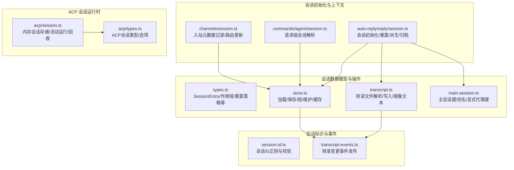
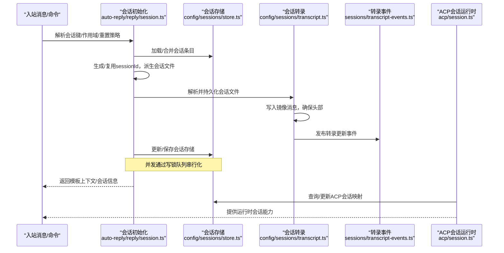
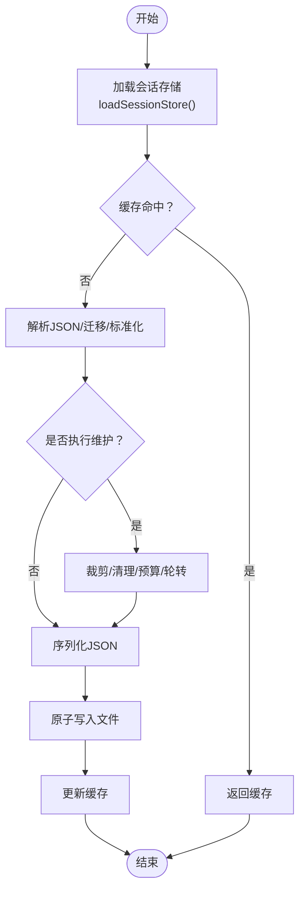
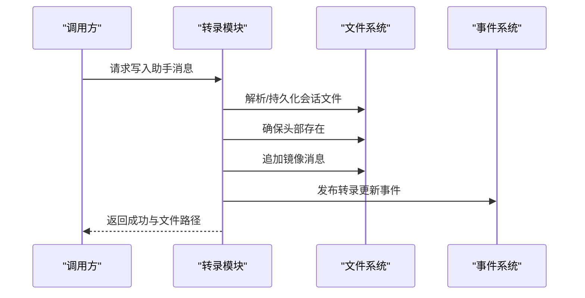
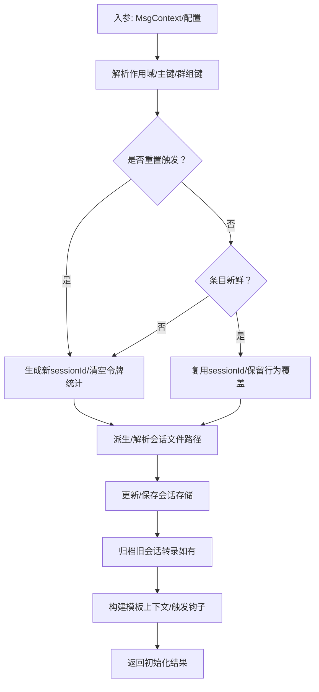
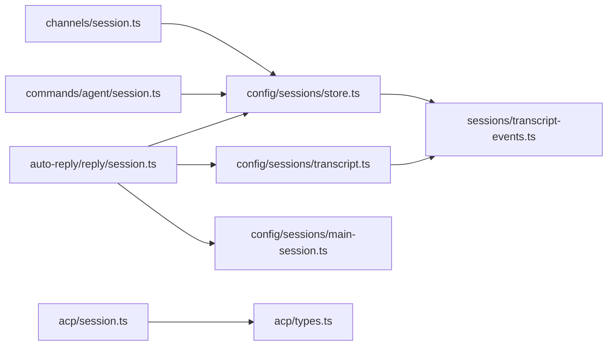

# 会话管理系统

<cite>
**本文引用的文件**
- [src/sessions/session-id.ts](file://src/sessions/session-id.ts)
- [src/sessions/transcript-events.ts](file://src/sessions/transcript-events.ts)
- [src/config/sessions/types.ts](file://src/config/sessions/types.ts)
- [src/config/sessions/transcript.ts](file://src/config/sessions/transcript.ts)
- [src/config/sessions/store.ts](file://src/config/sessions/store.ts)
- [src/config/sessions/main-session.ts](file://src/config/sessions/main-session.ts)
- [src/auto-reply/reply/session.ts](file://src/auto-reply/reply/session.ts)
- [src/commands/agent/session.ts](file://src/commands/agent/session.ts)
- [src/channels/session.ts](file://src/channels/session.ts)
- [src/acp/session.ts](file://src/acp/session.ts)
- [src/acp/types.ts](file://src/acp/types.ts)
</cite>

## 目录
1. [简介](#简介)
2. [项目结构](#项目结构)
3. [核心组件](#核心组件)
4. [架构总览](#架构总览)
5. [组件详解](#组件详解)
6. [依赖关系分析](#依赖关系分析)
7. [性能与稳定性](#性能与稳定性)
8. [故障排查指南](#故障排查指南)
9. [结论](#结论)
10. [附录：配置与最佳实践](#附录配置与最佳实践)

## 简介
本文件系统性阐述 OpenClaw 会话管理系统的设计与实现，覆盖会话创建、维护与销毁全流程，包括会话 ID 生成与校验、会话存储与持久化、会话转录（JSONL）格式与事件通知、消息历史管理、会话状态同步、会话工具结果保护、会话写锁与并发控制、会话文件修复与归档策略、会话作用域与上下文管理、会话配置项与清理策略，以及性能优化建议。

## 项目结构
围绕“会话”主题，相关代码主要分布在以下模块：
- 会话标识与事件：会话 ID 校验、转录更新事件发布
- 会话数据模型与操作：会话条目类型、会话存储读写、会话转录写入、会话键解析
- 会话初始化与上下文：自动回复路径中的会话初始化、命令路径中的会话解析、通道层元数据记录
- ACP 会话运行时：内存会话存储、活动运行跟踪、空闲回收与取消
- 配置与主会话键：会话作用域、主会话键别名与规范化

图表来源
- [src/sessions/session-id.ts](file://src/sessions/session-id.ts#L1-L6)
- [src/sessions/transcript-events.ts](file://src/sessions/transcript-events.ts#L1-L30)
- [src/config/sessions/types.ts](file://src/config/sessions/types.ts#L1-L376)
- [src/config/sessions/transcript.ts](file://src/config/sessions/transcript.ts#L1-L210)
- [src/config/sessions/store.ts](file://src/config/sessions/store.ts#L1-L884)
- [src/config/sessions/main-session.ts](file://src/config/sessions/main-session.ts#L1-L80)
- [src/auto-reply/reply/session.ts](file://src/auto-reply/reply/session.ts#L1-L642)
- [src/commands/agent/session.ts](file://src/commands/agent/session.ts#L1-L173)
- [src/channels/session.ts](file://src/channels/session.ts#L1-L82)
- [src/acp/session.ts](file://src/acp/session.ts#L1-L191)
- [src/acp/types.ts](file://src/acp/types.ts#L1-L52)

章节来源
- [src/sessions/session-id.ts](file://src/sessions/session-id.ts#L1-L6)
- [src/sessions/transcript-events.ts](file://src/sessions/transcript-events.ts#L1-L30)
- [src/config/sessions/types.ts](file://src/config/sessions/types.ts#L1-L376)
- [src/config/sessions/transcript.ts](file://src/config/sessions/transcript.ts#L1-L210)
- [src/config/sessions/store.ts](file://src/config/sessions/store.ts#L1-L884)
- [src/config/sessions/main-session.ts](file://src/config/sessions/main-session.ts#L1-L80)
- [src/auto-reply/reply/session.ts](file://src/auto-reply/reply/session.ts#L1-L642)
- [src/commands/agent/session.ts](file://src/commands/agent/session.ts#L1-L173)
- [src/channels/session.ts](file://src/channels/session.ts#L1-L82)
- [src/acp/session.ts](file://src/acp/session.ts#L1-L191)
- [src/acp/types.ts](file://src/acp/types.ts#L1-L52)

## 核心组件
- 会话 ID 与校验：提供 UUID 正则与校验函数，确保会话标识符格式正确。
- 会话事件系统：提供会话转录文件变更的监听与广播机制，便于外部订阅与响应。
- 会话数据模型：定义 SessionEntry 结构及合并策略、运行时模型字段规范化、新鲜度判定等。
- 会话存储：提供加载、缓存、写入、原子落盘、维护（裁剪、清理、磁盘预算）、并发写锁与队列化执行。
- 会话转录：解析/创建会话转录文件，写入镜像消息，保证头部存在，触发转录更新事件。
- 会话初始化与上下文：在自动回复与命令路径中解析会话键、作用域、重置策略，生成或复用会话 ID，并进行元数据与路由更新。
- ACP 会话运行时：内存会话存储、活动运行跟踪、空闲回收、最大会话数限制、取消与清理。

章节来源
- [src/sessions/session-id.ts](file://src/sessions/session-id.ts#L1-L6)
- [src/sessions/transcript-events.ts](file://src/sessions/transcript-events.ts#L1-L30)
- [src/config/sessions/types.ts](file://src/config/sessions/types.ts#L68-L167)
- [src/config/sessions/store.ts](file://src/config/sessions/store.ts#L195-L270)
- [src/config/sessions/transcript.ts](file://src/config/sessions/transcript.ts#L88-L131)
- [src/auto-reply/reply/session.ts](file://src/auto-reply/reply/session.ts#L190-L641)
- [src/commands/agent/session.ts](file://src/commands/agent/session.ts#L111-L173)
- [src/channels/session.ts](file://src/channels/session.ts#L41-L82)
- [src/acp/session.ts](file://src/acp/session.ts#L24-L191)

## 架构总览
下图展示从“入站消息/命令请求”到“会话初始化、转录写入、存储更新”的端到端流程，以及与 ACP 运行时的交互。

图表来源
- [src/auto-reply/reply/session.ts](file://src/auto-reply/reply/session.ts#L190-L641)
- [src/config/sessions/store.ts](file://src/config/sessions/store.ts#L511-L533)
- [src/config/sessions/transcript.ts](file://src/config/sessions/transcript.ts#L133-L210)
- [src/sessions/transcript-events.ts](file://src/sessions/transcript-events.ts#L16-L29)
- [src/acp/session.ts](file://src/acp/session.ts#L24-L191)

## 组件详解

### 会话 ID 生成与校验
- 会话 ID 使用标准 UUID v4 格式；提供正则校验函数，用于识别与验证字符串是否为合法会话 ID。
- 在会话初始化与命令解析路径中，若未提供 sessionId，则使用随机生成；若提供则优先复用以保持会话连续性。

章节来源
- [src/sessions/session-id.ts](file://src/sessions/session-id.ts#L1-L6)
- [src/auto-reply/reply/session.ts](file://src/auto-reply/reply/session.ts#L379-L395)
- [src/commands/agent/session.ts](file://src/commands/agent/session.ts#L144-L146)

### 会话存储与持久化
- 加载：支持缓存（TTL 可配置），Windows 下对空文件/锁定有重试读取；迁移应用后结构化克隆返回。
- 写入：标准化会话条目，维护活动时间戳；可选跳过维护（如一次性迁移）；原子写入（含 Windows 重试）。
- 并发控制：基于会话文件路径的队列化写锁，避免竞态；超时与过期检测。
- 维护：按配置裁剪条目数量、清理过期条目、磁盘预算检查、归档删除/重置相关的会话文件、轮转大文件。
- 缓存：序列化快照与对象缓存双层缓存，命中时直接返回，降低 IO。

图表来源
- [src/config/sessions/store.ts](file://src/config/sessions/store.ts#L195-L270)
- [src/config/sessions/store.ts](file://src/config/sessions/store.ts#L340-L509)
- [src/config/sessions/store.ts](file://src/config/sessions/store.ts#L511-L533)

章节来源
- [src/config/sessions/store.ts](file://src/config/sessions/store.ts#L195-L270)
- [src/config/sessions/store.ts](file://src/config/sessions/store.ts#L340-L509)
- [src/config/sessions/store.ts](file://src/config/sessions/store.ts#L511-L533)
- [src/config/sessions/store.ts](file://src/config/sessions/store.ts#L535-L727)

### 会话转录（JSONL）与事件
- 转录文件采用 JSONL 格式，首行包含会话头（版本、ID、时间戳、工作目录等），后续每行为一条消息记录。
- 支持“镜像文本”写入：将助手输出转换为镜像文本，避免重复计算 token，提升性能。
- 写入前确保头部存在；写入完成后发布转录更新事件，供外部监听器处理（如备份、索引、统计）。

图表来源
- [src/config/sessions/transcript.ts](file://src/config/sessions/transcript.ts#L133-L210)
- [src/sessions/transcript-events.ts](file://src/sessions/transcript-events.ts#L16-L29)

章节来源
- [src/config/sessions/transcript.ts](file://src/config/sessions/transcript.ts#L67-L86)
- [src/config/sessions/transcript.ts](file://src/config/sessions/transcript.ts#L133-L210)
- [src/sessions/transcript-events.ts](file://src/sessions/transcript-events.ts#L1-L30)

### 消息历史管理与会话状态同步
- 历史管理：会话条目包含多类计数与令牌统计字段，支持“新鲜度”判断与“保留策略”；可通过合并策略保留或触活动态。
- 元数据同步：入站消息触发会话元数据更新（渠道、账号、线程、最后投递上下文等），并可选择不刷新活动时间戳以避免误判空闲重置。
- 路由更新：支持按目标会话键更新最后投递上下文，避免将入站来源泄漏到其他会话。

章节来源
- [src/config/sessions/types.ts](file://src/config/sessions/types.ts#L246-L284)
- [src/config/sessions/types.ts](file://src/config/sessions/types.ts#L286-L303)
- [src/channels/session.ts](file://src/channels/session.ts#L41-L82)
- [src/config/sessions/store.ts](file://src/config/sessions/store.ts#L756-L800)

### 会话初始化与上下文管理
- 自动回复路径：解析会话作用域、主键、群组键、重置策略；根据重置触发器决定新建/复用会话；派生会话文件；归档旧会话转录；触发会话钩子。
- 命令路径：根据 to/sessionId/sessionKey 解析会话键，跨代理存储查找；评估新鲜度；生成新会话 ID 或复用现有 ID；保留用户行为覆盖项。
- 上下文：在模板上下文中注入 SessionId、IsNewSession、BodyStripped 等，供提示词与插件使用。

图表来源
- [src/auto-reply/reply/session.ts](file://src/auto-reply/reply/session.ts#L190-L641)
- [src/commands/agent/session.ts](file://src/commands/agent/session.ts#L111-L173)

章节来源
- [src/auto-reply/reply/session.ts](file://src/auto-reply/reply/session.ts#L190-L641)
- [src/commands/agent/session.ts](file://src/commands/agent/session.ts#L111-L173)

### 会话工具结果保护与会话级别上下文
- 工具结果保护：会话条目支持“停止回放边界”字段，避免在 /stop 后重放已过界的消息，保障会话一致性。
- 会话级别上下文：支持思维/详细/推理等级、TTS 自动模式、模型/提供商覆盖、发送策略、队列模式与容量等，均以会话为粒度持久化与继承。

章节来源
- [src/config/sessions/types.ts](file://src/config/sessions/types.ts#L88-L125)
- [src/config/sessions/types.ts](file://src/config/sessions/types.ts#L105-L125)

### 会话写锁机制与并发控制
- 写锁队列：同一会话存储文件路径共享一个队列，任务串行执行，避免并发写冲突。
- 锁获取：支持超时与过期检测；失败时抛出明确错误；成功后释放。
- 原子写入：失败重试（Windows 多次），ENOENT 场景下降级处理；写入后更新缓存。

章节来源
- [src/config/sessions/store.ts](file://src/config/sessions/store.ts#L535-L727)
- [src/config/sessions/store.ts](file://src/config/sessions/store.ts#L598-L609)

### 会话文件修复与归档策略
- 删除/重置归档：当会话被裁剪/删除或重置时，相关会话文件会被归档；可按原因（删除/重置）清理过期归档。
- 轮转与预算：超过阈值时轮转会话存储文件；磁盘预算不足时清理多余文件。
- 会话转录归档：在重置/删除时将旧会话转录移动到归档目录，避免磁盘膨胀。

章节来源
- [src/config/sessions/store.ts](file://src/config/sessions/store.ts#L389-L454)
- [src/config/sessions/store.ts](file://src/config/sessions/store.ts#L572-L596)

### 会话作用域与会话键
- 作用域：支持 per-sender（按发送者）与 global（全局）两种作用域；global 作用域下主键固定为 "global"。
- 主键与别名：支持自定义 mainKey 与代理主键别名；canoncialize 将别名规范化为主键。
- 显式代理键：CLI/命令可指定代理 ID，解析为显式代理主会话键。

章节来源
- [src/config/sessions/types.ts](file://src/config/sessions/types.ts#L8)
- [src/config/sessions/main-session.ts](file://src/config/sessions/main-session.ts#L11-L80)

### ACP 会话运行时
- 内存存储：Map 存储 ACP 会话，支持最大会话数限制、空闲 TTL 回收、最久未使用淘汰。
- 活动运行：记录 activeRunId 与 AbortController，支持取消当前运行并清理映射。
- 生命周期：创建/查询/清理/取消，提供默认内存会话存储实例。

章节来源
- [src/acp/session.ts](file://src/acp/session.ts#L24-L191)
- [src/acp/types.ts](file://src/acp/types.ts#L20-L28)

## 依赖关系分析
- 低耦合高内聚：会话存储与转录相互独立，通过事件解耦；初始化与上下文在不同路径（自动回复/命令）中复用存储与转录能力。
- 关键依赖链：
  - 初始化路径依赖存储加载/保存、转录解析/写入、主会话键解析。
  - 通道层依赖存储进行元数据与路由更新。
  - ACP 运行时依赖存储进行会话映射与活动运行跟踪。

图表来源
- [src/auto-reply/reply/session.ts](file://src/auto-reply/reply/session.ts#L1-L642)
- [src/commands/agent/session.ts](file://src/commands/agent/session.ts#L1-L173)
- [src/channels/session.ts](file://src/channels/session.ts#L1-L82)
- [src/config/sessions/store.ts](file://src/config/sessions/store.ts#L1-L884)
- [src/config/sessions/transcript.ts](file://src/config/sessions/transcript.ts#L1-L210)
- [src/config/sessions/main-session.ts](file://src/config/sessions/main-session.ts#L1-L80)
- [src/sessions/transcript-events.ts](file://src/sessions/transcript-events.ts#L1-L30)
- [src/acp/session.ts](file://src/acp/session.ts#L1-L191)
- [src/acp/types.ts](file://src/acp/types.ts#L1-L52)

## 性能与稳定性
- 缓存策略：会话存储支持 TTL 缓存与序列化快照，减少频繁 IO；缓存启用条件与 TTL 可通过环境变量配置。
- 原子写入与重试：Windows 平台多次重试与降级写入，保证落盘可靠性。
- 维护与预算：定期裁剪、清理过期、磁盘预算检查与轮转，避免无限增长。
- 并发控制：队列化写锁，避免竞态；超时与过期保护。
- 镜像文本：写入镜像消息避免重复 token 计算，提高吞吐。

章节来源
- [src/config/sessions/store.ts](file://src/config/sessions/store.ts#L52-L67)
- [src/config/sessions/store.ts](file://src/config/sessions/store.ts#L465-L485)
- [src/config/sessions/transcript.ts](file://src/config/sessions/transcript.ts#L180-L207)

## 故障排查指南
- 会话存储为空/解析失败：Windows 下可能出现短暂空文件，模块内置重试；若仍失败，检查文件权限与磁盘空间。
- 写入失败（ENOENT）：测试场景临时目录可能被删除，模块会尝试降级写入；若持续失败，确认路径存在且可写。
- 并发写入阻塞：若长时间等待锁，检查是否存在死锁或过期任务；适当调整超时参数。
- 会话转录未更新：确认事件监听器注册正常，且会话转录写入成功触发事件发布。
- ACP 会话上限：达到最大会话数时会抛出错误，需关闭空闲客户端或增大上限。

章节来源
- [src/config/sessions/store.ts](file://src/config/sessions/store.ts#L213-L249)
- [src/config/sessions/store.ts](file://src/config/sessions/store.ts#L465-L508)
- [src/config/sessions/store.ts](file://src/config/sessions/store.ts#L695-L727)
- [src/sessions/transcript-events.ts](file://src/sessions/transcript-events.ts#L16-L29)
- [src/acp/session.ts](file://src/acp/session.ts#L92-L95)

## 结论
OpenClaw 会话管理系统通过清晰的数据模型、可靠的存储与转录机制、完善的事件通知与并发控制，实现了稳定、可扩展的会话生命周期管理。结合会话作用域、主键别名、重置策略与维护机制，系统在复杂多渠道与多代理环境下仍能保持一致的用户体验与良好的性能表现。

## 附录：配置与最佳实践
- 会话作用域与主键
  - 作用域：per-sender 或 global；global 下主键固定为 "global"。
  - 主键别名：支持 main、自定义 mainKey 与代理主键别名；canoncialize 规范化为主键。
- 会话重置策略
  - 默认重置触发器：/new、/reset；可在配置中扩展；群组场景支持提及激活。
- 会话存储维护
  - 最大条目数、空闲清理时间、磁盘预算、文件轮转阈值；维护模式支持“警告模式”仅告警不强制执行。
- 性能优化建议
  - 启用缓存（合理 TTL）；批量更新时尽量合并写入；避免频繁重置导致转录归档压力。
  - 使用镜像文本写入；控制队列容量与去重策略；在高并发场景适当增加写锁超时。

章节来源
- [src/config/sessions/main-session.ts](file://src/config/sessions/main-session.ts#L11-L80)
- [src/config/sessions/types.ts](file://src/config/sessions/types.ts#L373-L376)
- [src/config/sessions/store.ts](file://src/config/sessions/store.ts#L289-L305)