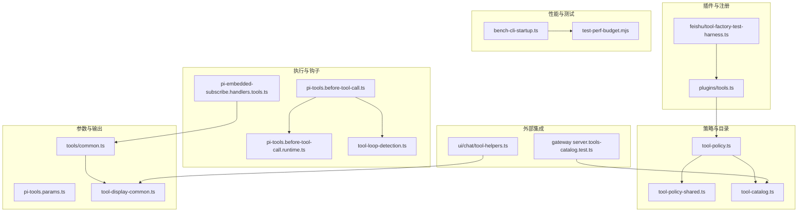
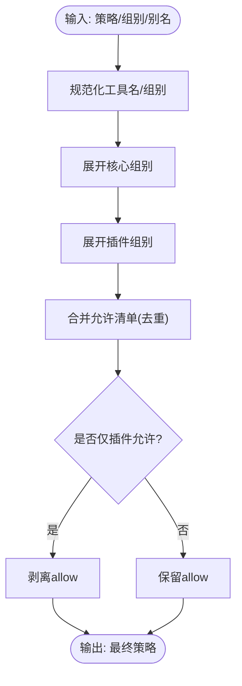
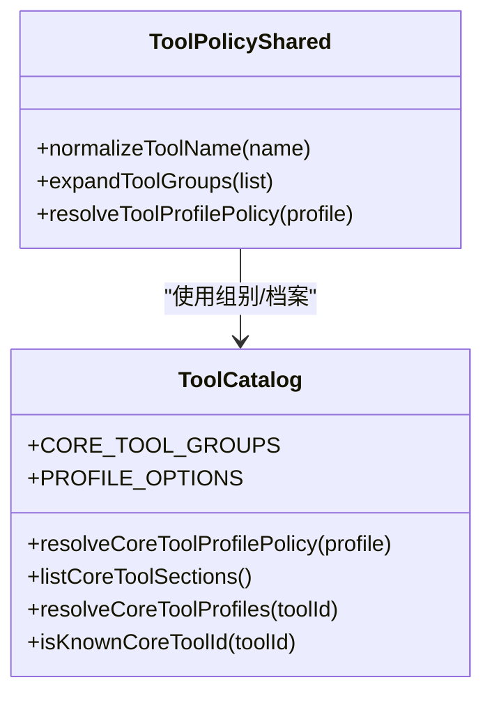
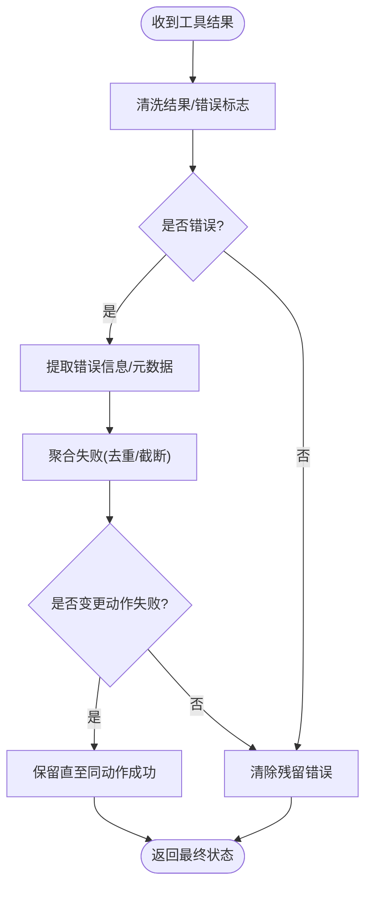
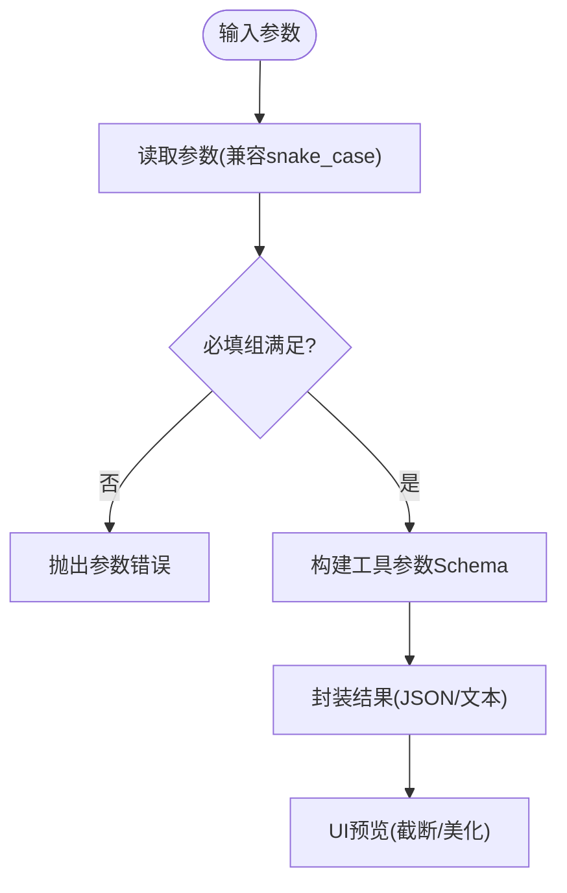
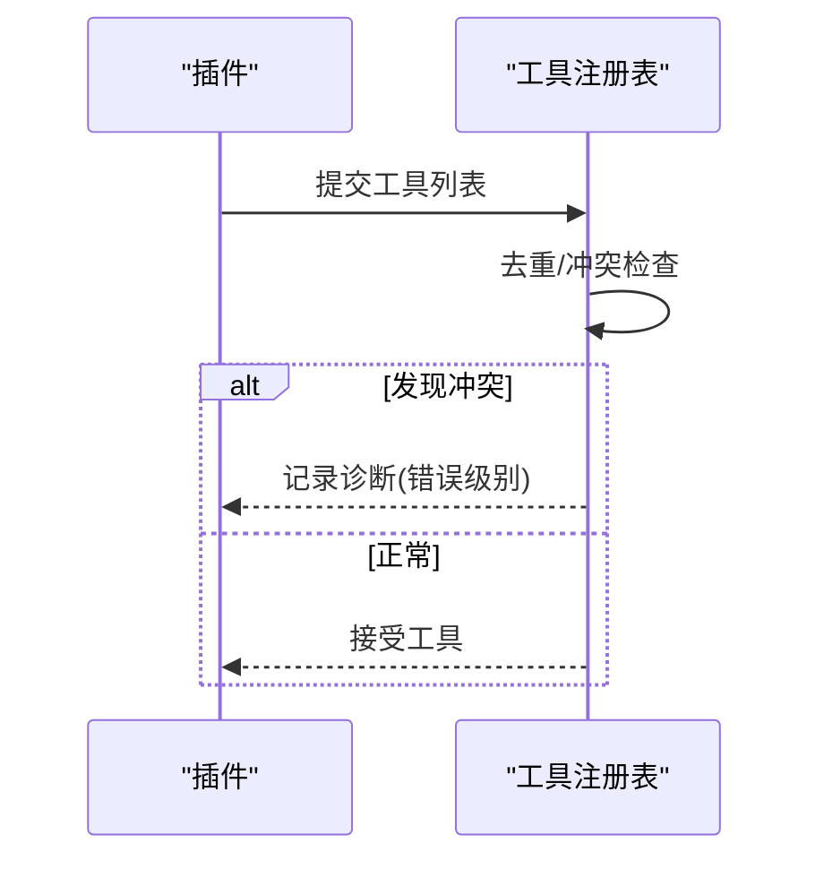
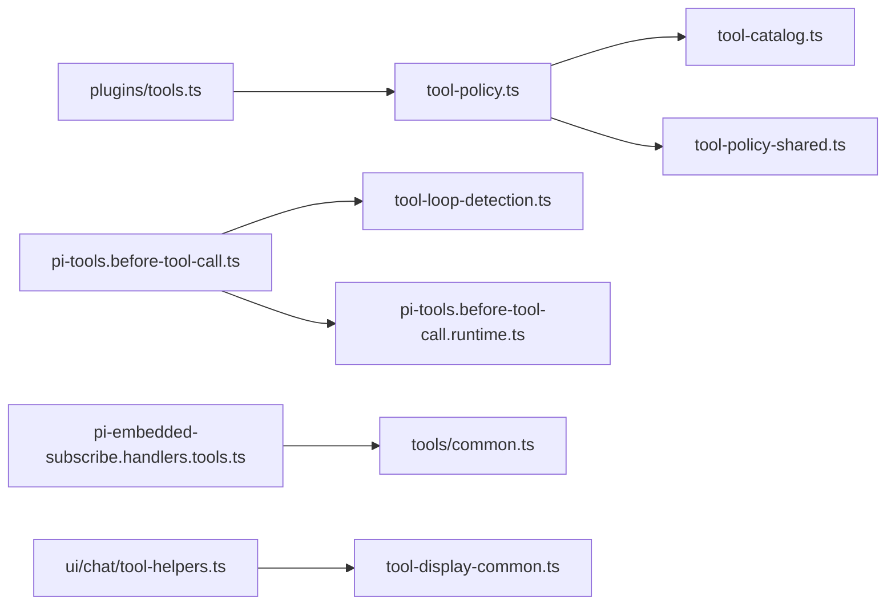

# 工具系统

<cite>
**本文引用的文件**
- [src/agents/tool-policy.ts](file://src/agents/tool-policy.ts)
- [src/agents/tool-policy-shared.ts](file://src/agents/tool-policy-shared.ts)
- [src/agents/tool-catalog.ts](file://src/agents/tool-catalog.ts)
- [src/agents/pi-tools.policy.ts](file://src/agents/pi-tools.policy.ts)
- [src/agents/tool-fs-policy.ts](file://src/agents/tool-fs-policy.ts)
- [src/agents/tools/common.ts](file://src/agents/tools/common.ts)
- [src/agents/pi-embedded-subscribe.handlers.tools.ts](file://src/agents/pi-embedded-subscribe.handlers.tools.ts)
- [src/agents/pi-tools.before-tool-call.ts](file://src/agents/pi-tools.before-tool-call.ts)
- [src/agents/pi-tools.before-tool-call.runtime.ts](file://src/agents/pi-tools.before-tool-call.runtime.ts)
- [src/agents/tool-loop-detection.ts](file://src/agents/tool-loop-detection.ts)
- [src/agents/tool-loop-detection.test.ts](file://src/agents/tool-loop-detection.test.ts)
- [src/agents/pi-extensions/compaction-safeguard.ts](file://src/agents/pi-extensions/compaction-safeguard.ts)
- [src/agents/pi-tools.params.ts](file://src/agents/pi-tools.params.ts)
- [src/agents/tool-display-common.ts](file://src/agents/tool-display-common.ts)
- [src/agents/tool-policy.conformance.ts](file://src/agents/tool-policy.conformance.ts)
- [src/agents/tool-policy.plugin-only-allowlist.test.ts](file://src/agents/tool-policy.plugin-only-allowlist.test.ts)
- [src/agents/tool-policy-pipeline.test.ts](file://src/agents/tool-policy-pipeline.test.ts)
- [src/agents/pi-embedded-runner/run/payloads.ts](file://src/agents/pi-embedded-runner/run/payloads.ts)
- [src/plugins/tools.ts](file://src/plugins/tools.ts)
- [extensions/feishu/src/tool-factory-test-harness.ts](file://extensions/feishu/src/tool-factory-test-harness.ts)
- [extensions/feishu/src/tool-result.ts](file://extensions/feishu/src/tool-result.ts)
- [src/gateway/server.tools-catalog.test.ts](file://src/gateway/server.tools-catalog.test.ts)
- [ui/src/ui/views/agents-panels-tools-skills.ts](file://ui/src/ui/views/agents-panels-tools-skills.ts)
- [ui/src/ui/chat/tool-helpers.ts](file://ui/src/ui/chat/tool-helpers.ts)
- [apps/macos/Sources/OpenClawProtocol/GatewayModels.swift](file://apps/macos/Sources/OpenClawProtocol/GatewayModels.swift)
- [apps/shared/OpenClawKit/Sources/OpenClawProtocol/GatewayModels.swift](file://apps/shared/OpenClawKit/Sources/OpenClawProtocol/GatewayModels.swift)
- [scripts/bench-cli-startup.ts](file://scripts/bench-cli-startup.ts)
- [scripts/test-perf-budget.mjs](file://scripts/test-perf-budget.mjs)
</cite>

## 目录
1. [简介](#简介)
2. [项目结构](#项目结构)
3. [核心组件](#核心组件)
4. [架构总览](#架构总览)
5. [详细组件分析](#详细组件分析)
6. [依赖关系分析](#依赖关系分析)
7. [性能考量](#性能考量)
8. [故障排查指南](#故障排查指南)
9. [结论](#结论)
10. [附录](#附录)

## 简介
本文件系统性阐述 OpenClaw 的工具系统：内置工具与自定义工具的架构设计、工具注册机制、工具执行策略、工具结果处理、策略配置与文件系统策略、权限管理、工具调用链与结果聚合、错误恢复机制、与外部 API 集成、参数验证与输出格式化，并提供开发指南、测试方法与性能优化策略，以及常用工具使用示例与配置模板。

## 项目结构
工具系统横跨多个子模块：
- 策略与目录：工具策略、工具目录、组别与别名解析
- 执行与钩子：工具执行前钩子、循环检测、结果处理与错误提取
- 参数与输出：参数校验、结果封装、输出格式化
- 插件与注册：插件侧工具注册与冲突处理
- 外部集成：网关工具目录 RPC、前端 UI 辅助
- 性能与测试：启动性能基准、测试性能预算



**图表来源**
- [src/agents/tool-policy.ts](file://src/agents/tool-policy.ts#L1-L206)
- [src/agents/tool-policy-shared.ts](file://src/agents/tool-policy-shared.ts#L1-L50)
- [src/agents/tool-catalog.ts](file://src/agents/tool-catalog.ts#L1-L327)
- [src/agents/pi-tools.before-tool-call.ts](file://src/agents/pi-tools.before-tool-call.ts#L61-L148)
- [src/agents/pi-tools.before-tool-call.runtime.ts](file://src/agents/pi-tools.before-tool-call.runtime.ts#L1-L7)
- [src/agents/tool-loop-detection.ts](file://src/agents/tool-loop-detection.ts)
- [src/agents/pi-embedded-subscribe.handlers.tools.ts](file://src/agents/pi-embedded-subscribe.handlers.tools.ts#L422-L470)
- [src/agents/tools/common.ts](file://src/agents/tools/common.ts#L1-L341)
- [src/agents/pi-tools.params.ts](file://src/agents/pi-tools.params.ts#L154-L204)
- [src/agents/tool-display-common.ts](file://src/agents/tool-display-common.ts#L1200-L1234)
- [src/plugins/tools.ts](file://src/plugins/tools.ts#L112-L139)
- [extensions/feishu/src/tool-factory-test-harness.ts](file://extensions/feishu/src/tool-factory-test-harness.ts#L37-L76)
- [src/gateway/server.tools-catalog.test.ts](file://src/gateway/server.tools-catalog.test.ts#L1-L46)
- [ui/src/ui/chat/tool-helpers.ts](file://ui/src/ui/chat/tool-helpers.ts#L1-L37)
- [scripts/bench-cli-startup.ts](file://scripts/bench-cli-startup.ts#L59-L111)
- [scripts/test-perf-budget.mjs](file://scripts/test-perf-budget.mjs#L1-L127)

**章节来源**
- [src/agents/tool-policy.ts](file://src/agents/tool-policy.ts#L1-L206)
- [src/agents/tool-catalog.ts](file://src/agents/tool-catalog.ts#L1-L327)
- [src/agents/tools/common.ts](file://src/agents/tools/common.ts#L1-L341)

## 核心组件
- 工具策略与组别
  - 工具别名与组展开、规范化工具名、策略合并与插件组扩展
  - 策略允许/拒绝列表、未知条目收集、仅插件允许清单剥离
- 工具目录与配置
  - 核心工具分组（按功能区段）、工具档案（最小/编码/消息/全量）映射
  - 工具 ID 到档案的解析、已知工具判定
- 执行前钩子与循环检测
  - 记录工具调用、检测循环并发出警告或阻断、记录结果与错误
- 结果处理与错误恢复
  - 统一结果封装、错误描述、失败元数据提取、清理残留错误状态
- 参数验证与输出格式化
  - 字符串/数字/数组参数读取、必填组校验、JSON 输出格式化
- 插件注册与冲突处理
  - 插件工具注册、名称冲突诊断、可选工具标记
- 外部集成与 UI 支持
  - 网关工具目录 RPC、前端工具输出预览与截断

**章节来源**
- [src/agents/tool-policy.ts](file://src/agents/tool-policy.ts#L1-L206)
- [src/agents/tool-policy-shared.ts](file://src/agents/tool-policy-shared.ts#L1-L50)
- [src/agents/tool-catalog.ts](file://src/agents/tool-catalog.ts#L1-L327)
- [src/agents/pi-tools.before-tool-call.ts](file://src/agents/pi-tools.before-tool-call.ts#L61-L148)
- [src/agents/tool-loop-detection.ts](file://src/agents/tool-loop-detection.ts)
- [src/agents/pi-embedded-subscribe.handlers.tools.ts](file://src/agents/pi-embedded-subscribe.handlers.tools.ts#L422-L470)
- [src/agents/tools/common.ts](file://src/agents/tools/common.ts#L1-L341)
- [src/agents/pi-tools.params.ts](file://src/agents/pi-tools.params.ts#L154-L204)
- [src/agents/tool-display-common.ts](file://src/agents/tool-display-common.ts#L1200-L1234)
- [src/plugins/tools.ts](file://src/plugins/tools.ts#L112-L139)
- [src/gateway/server.tools-catalog.test.ts](file://src/gateway/server.tools-catalog.test.ts#L1-L46)
- [ui/src/ui/chat/tool-helpers.ts](file://ui/src/ui/chat/tool-helpers.ts#L1-L37)

## 架构总览
工具系统围绕“策略—目录—执行—结果”闭环构建，策略层负责工具可见性与权限控制；目录层提供工具清单与档案；执行层在调用前后进行安全与稳定性保障；结果层统一输出与错误恢复。

```mermaid
sequenceDiagram
participant Agent as "代理"
participant Policy as "工具策略"
participant Catalog as "工具目录"
participant Runner as "执行器"
participant Hooks as "执行前钩子"
participant Loop as "循环检测"
participant Handler as "结果处理器"
Agent->>Policy : 解析全局/代理/档案策略
Policy-->>Agent : 合并后的允许/拒绝清单
Agent->>Catalog : 查询可用工具清单
Catalog-->>Agent : 工具定义与参数模式
Agent->>Runner : 调用工具(名称, 参数)
Runner->>Hooks : beforeToolCall(记录/检测)
Hooks->>Loop : 检测循环/记录调用
Runner-->>Handler : 返回结果/错误
Handler-->>Agent : 规范化输出/错误元数据
```

**图表来源**
- [src/agents/tool-policy.ts](file://src/agents/tool-policy.ts#L54-L206)
- [src/agents/tool-catalog.ts](file://src/agents/tool-catalog.ts#L248-L302)
- [src/agents/pi-tools.before-tool-call.ts](file://src/agents/pi-tools.before-tool-call.ts#L91-L148)
- [src/agents/tool-loop-detection.ts](file://src/agents/tool-loop-detection.ts)
- [src/agents/pi-embedded-subscribe.handlers.tools.ts](file://src/agents/pi-embedded-subscribe.handlers.tools.ts#L422-L470)

## 详细组件分析

### 工具策略与组别
- 工具别名与规范化：支持 bash→exec、apply-patch→apply_patch 等别名映射，统一小写与空白处理
- 组展开：group:fs、group:openclaw 等组别展开为核心工具集合
- 策略合并：允许/拒绝列表去重合并，支持 alsoAllow 追加
- 插件组扩展：group:plugins 展开为所有插件工具，按插件 ID 展开
- 仅插件允许清单剥离：当 allow 仅包含插件工具时自动剥离，避免误禁用核心工具



**图表来源**
- [src/agents/tool-policy-shared.ts](file://src/agents/tool-policy-shared.ts#L12-L47)
- [src/agents/tool-policy.ts](file://src/agents/tool-policy.ts#L110-L205)

**章节来源**
- [src/agents/tool-policy-shared.ts](file://src/agents/tool-policy-shared.ts#L1-L50)
- [src/agents/tool-policy.ts](file://src/agents/tool-policy.ts#L1-L206)
- [src/agents/tool-policy.conformance.ts](file://src/agents/tool-policy.conformance.ts#L1-L17)
- [src/agents/tool-policy.plugin-only-allowlist.test.ts](file://src/agents/tool-policy.plugin-only-allowlist.test.ts#L1-L27)
- [src/agents/tool-policy-pipeline.test.ts](file://src/agents/tool-policy-pipeline.test.ts#L1-L25)

### 工具目录与档案
- 工具分组：按 fs/runtime/web/memory/sessions/ui/messaging/automation/nodes/agents/media 等区段组织
- 工具档案：minimal/coding/messaging/full 四档，映射到允许/拒绝清单
- 工具 ID 到档案：查询工具归属档案，判断是否为已知核心工具



**图表来源**
- [src/agents/tool-catalog.ts](file://src/agents/tool-catalog.ts#L27-L327)
- [src/agents/tool-policy-shared.ts](file://src/agents/tool-policy-shared.ts#L17-L47)

**章节来源**
- [src/agents/tool-catalog.ts](file://src/agents/tool-catalog.ts#L1-L327)
- [src/agents/tool-policy-shared.ts](file://src/agents/tool-policy-shared.ts#L1-L50)

### 执行前钩子与循环检测
- beforeToolCall：记录会话状态、检测循环（警告/阻断）、记录调用与结果
- 循环检测：基于历史调用与结果摘要，识别无进展、配对交替等模式，触发全局断路器阈值

```mermaid
sequenceDiagram
participant Hook as "beforeToolCall"
participant Runtime as "诊断运行时"
participant Loop as "循环检测"
Hook->>Runtime : 获取会话状态
Hook->>Loop : detectToolCallLoop(state, toolName, params)
alt 循环严重
Loop-->>Hook : level=critical, message
Hook-->>Hook : 阻止调用并记录
else 正常
Hook->>Loop : recordToolCall(state, toolName, params)
Hook-->>Hook : 继续执行
end
```

**图表来源**
- [src/agents/pi-tools.before-tool-call.ts](file://src/agents/pi-tools.before-tool-call.ts#L91-L148)
- [src/agents/pi-tools.before-tool-call.runtime.ts](file://src/agents/pi-tools.before-tool-call.runtime.ts#L1-L7)
- [src/agents/tool-loop-detection.ts](file://src/agents/tool-loop-detection.ts)

**章节来源**
- [src/agents/pi-tools.before-tool-call.ts](file://src/agents/pi-tools.before-tool-call.ts#L61-L148)
- [src/agents/tool-loop-detection.ts](file://src/agents/tool-loop-detection.ts)
- [src/agents/tool-loop-detection.test.ts](file://src/agents/tool-loop-detection.test.ts#L1-L450)

### 结果处理与错误恢复
- 统一结果封装：jsonResult 将任意负载序列化为文本块与 details
- 错误提取与元数据：从 details 中提取 status/exitCode 等，格式化失败摘要
- 失败聚合：遍历消息块，收集工具错误，去重并截断
- 变更动作去留：保留未解决的变更型错误，直到相同动作成功



**图表来源**
- [src/agents/pi-embedded-subscribe.handlers.tools.ts](file://src/agents/pi-embedded-subscribe.handlers.tools.ts#L422-L470)
- [src/agents/pi-extensions/compaction-safeguard.ts](file://src/agents/pi-extensions/compaction-safeguard.ts#L95-L162)
- [src/agents/tools/common.ts](file://src/agents/tools/common.ts#L230-L240)

**章节来源**
- [src/agents/pi-embedded-subscribe.handlers.tools.ts](file://src/agents/pi-embedded-subscribe.handlers.tools.ts#L422-L470)
- [src/agents/pi-extensions/compaction-safeguard.ts](file://src/agents/pi-extensions/compaction-safeguard.ts#L95-L162)
- [src/agents/tools/common.ts](file://src/agents/tools/common.ts#L230-L240)

### 参数验证与输出格式化
- 参数读取：字符串/数字/数组/反应参数等，支持必填、空值、大小写兼容键
- 必填组校验：要求至少满足一组键（如 id 或 name）
- 输出格式化：JSON 自动美化包裹代码块；文本截断预览



**图表来源**
- [src/agents/tools/common.ts](file://src/agents/tools/common.ts#L74-L201)
- [src/agents/pi-tools.params.ts](file://src/agents/pi-tools.params.ts#L154-L204)
- [src/agents/tool-display-common.ts](file://src/agents/tool-display-common.ts#L1200-L1234)
- [ui/src/ui/chat/tool-helpers.ts](file://ui/src/ui/chat/tool-helpers.ts#L11-L37)

**章节来源**
- [src/agents/tools/common.ts](file://src/agents/tools/common.ts#L1-L341)
- [src/agents/pi-tools.params.ts](file://src/agents/pi-tools.params.ts#L154-L204)
- [src/agents/tool-display-common.ts](file://src/agents/tool-display-common.ts#L1200-L1234)
- [ui/src/ui/chat/tool-helpers.ts](file://ui/src/ui/chat/tool-helpers.ts#L1-L37)

### 插件注册与冲突处理
- 注册流程：插件提供工具列表，统一去重、冲突诊断、可选工具标记
- 冲突处理：重复名称记录错误并加入诊断日志，可选择抑制冲突告警



**图表来源**
- [src/plugins/tools.ts](file://src/plugins/tools.ts#L112-L139)

**章节来源**
- [src/plugins/tools.ts](file://src/plugins/tools.ts#L112-L139)

### 外部集成与 UI 支持
- 网关工具目录：RPC 返回核心与插件工具目录，支持 includePlugins 控制
- 前端工具输出：JSON 自动格式化、截断预览；UI 面板批量启用/禁用工具

**章节来源**
- [src/gateway/server.tools-catalog.test.ts](file://src/gateway/server.tools-catalog.test.ts#L1-L46)
- [ui/src/ui/views/agents-panels-tools-skills.ts](file://ui/src/ui/views/agents-panels-tools-skills.ts#L102-L123)
- [ui/src/ui/chat/tool-helpers.ts](file://ui/src/ui/chat/tool-helpers.ts#L1-L37)

## 依赖关系分析
- 策略依赖目录：策略通过目录组别与档案生成允许/拒绝清单
- 执行依赖钩子与循环检测：执行前钩子依赖诊断运行时与循环检测
- 结果处理依赖通用工具：统一结果封装与图片结果
- 插件注册依赖策略：插件工具纳入策略组别与剥离逻辑
- UI 依赖显示与工具输出：前端依赖输出格式化与预览



**图表来源**
- [src/agents/tool-policy.ts](file://src/agents/tool-policy.ts#L1-L206)
- [src/agents/tool-catalog.ts](file://src/agents/tool-catalog.ts#L1-L327)
- [src/agents/tool-policy-shared.ts](file://src/agents/tool-policy-shared.ts#L1-L50)
- [src/agents/pi-tools.before-tool-call.ts](file://src/agents/pi-tools.before-tool-call.ts#L91-L148)
- [src/agents/tool-loop-detection.ts](file://src/agents/tool-loop-detection.ts)
- [src/agents/pi-tools.before-tool-call.runtime.ts](file://src/agents/pi-tools.before-tool-call.runtime.ts#L1-L7)
- [src/agents/pi-embedded-subscribe.handlers.tools.ts](file://src/agents/pi-embedded-subscribe.handlers.tools.ts#L422-L470)
- [src/agents/tools/common.ts](file://src/agents/tools/common.ts#L230-L240)
- [src/plugins/tools.ts](file://src/plugins/tools.ts#L112-L139)
- [ui/src/ui/chat/tool-helpers.ts](file://ui/src/ui/chat/tool-helpers.ts#L1-L37)
- [src/agents/tool-display-common.ts](file://src/agents/tool-display-common.ts#L1200-L1234)

**章节来源**
- [src/agents/tool-policy.ts](file://src/agents/tool-policy.ts#L1-L206)
- [src/agents/tool-catalog.ts](file://src/agents/tool-catalog.ts#L1-L327)
- [src/agents/pi-tools.before-tool-call.ts](file://src/agents/pi-tools.before-tool-call.ts#L61-L148)
- [src/agents/pi-embedded-subscribe.handlers.tools.ts](file://src/agents/pi-embedded-subscribe.handlers.tools.ts#L422-L470)
- [src/plugins/tools.ts](file://src/plugins/tools.ts#L112-L139)
- [ui/src/ui/chat/tool-helpers.ts](file://ui/src/ui/chat/tool-helpers.ts#L1-L37)

## 性能考量
- 启动性能基准：多轮次测量 CLI 启动耗时，统计均值、中位数、95 分位与极值
- 测试性能预算：通过环境变量设置最大墙钟时间、基线与回归阈值，防止回归

**章节来源**
- [scripts/bench-cli-startup.ts](file://scripts/bench-cli-startup.ts#L59-L111)
- [scripts/test-perf-budget.mjs](file://scripts/test-perf-budget.mjs#L1-L127)

## 故障排查指南
- 循环检测告警与阻断：关注 beforeToolCall 中的循环检测日志，定位重复调用模式
- 结果错误聚合：查看工具错误消息块，提取 status/exitCode 等元数据，结合摘要定位问题
- 参数错误：确认必填组满足、键名大小写兼容、空值处理
- 插件冲突：检查注册表诊断日志，修正重复工具名

**章节来源**
- [src/agents/pi-tools.before-tool-call.ts](file://src/agents/pi-tools.before-tool-call.ts#L91-L148)
- [src/agents/pi-extensions/compaction-safeguard.ts](file://src/agents/pi-extensions/compaction-safeguard.ts#L119-L162)
- [src/agents/pi-tools.params.ts](file://src/agents/pi-tools.params.ts#L154-L204)
- [src/plugins/tools.ts](file://src/plugins/tools.ts#L112-L139)

## 结论
OpenClaw 工具系统以策略与目录为核心，配合执行前钩子与循环检测保障安全与稳定，通过统一结果封装与错误恢复提升可观测性与可维护性。插件注册与冲突处理确保生态扩展能力，UI 与网关集成提供良好用户体验。性能与测试工具保证系统健康演进。

## 附录

### 工具策略配置要点
- 全局/代理/档案策略合并：优先级与覆盖规则由策略管线决定
- 组别与别名：使用 group:xxx 与别名映射简化配置
- 仅插件允许清单剥离：避免误禁用核心工具

**章节来源**
- [src/agents/tool-policy.ts](file://src/agents/tool-policy.ts#L110-L205)
- [src/agents/tool-policy-shared.ts](file://src/agents/tool-policy-shared.ts#L12-L47)
- [src/agents/tool-policy-pipeline.test.ts](file://src/agents/tool-policy-pipeline.test.ts#L1-L25)

### 工具文件系统策略
- workspaceOnly：限制工具仅访问工作区路径
- 配置解析：支持全局与代理级配置合并

**章节来源**
- [src/agents/tool-fs-policy.ts](file://src/agents/tool-fs-policy.ts#L1-L31)

### 工具权限管理
- ownerOnly：部分工具仅限所有者发送者执行
- 策略应用：在工具执行前进行权限包装与过滤

**章节来源**
- [src/agents/tool-policy.ts](file://src/agents/tool-policy.ts#L18-L52)

### 工具调用链与结果聚合
- 调用链：策略→目录→执行前钩子→执行→结果处理
- 聚合：按工具名与摘要去重，保留变更动作失败直至修复

**章节来源**
- [src/agents/pi-tools.before-tool-call.ts](file://src/agents/pi-tools.before-tool-call.ts#L91-L148)
- [src/agents/pi-embedded-subscribe.handlers.tools.ts](file://src/agents/pi-embedded-subscribe.handlers.tools.ts#L422-L470)

### 工具与外部 API 集成
- 网关工具目录 RPC：返回核心与插件工具清单
- 客户端模型：Swift 数据模型映射工具目录结构

**章节来源**
- [src/gateway/server.tools-catalog.test.ts](file://src/gateway/server.tools-catalog.test.ts#L1-L46)
- [apps/macos/Sources/OpenClawProtocol/GatewayModels.swift](file://apps/macos/Sources/OpenClawProtocol/GatewayModels.swift#L2456-L2513)
- [apps/shared/OpenClawKit/Sources/OpenClawProtocol/GatewayModels.swift](file://apps/shared/OpenClawKit/Sources/OpenClawProtocol/GatewayModels.swift#L2456-L2513)

### 工具参数验证与输出格式化
- 参数读取：字符串/数字/数组/反应参数，支持必填与空值
- 必填组校验：至少满足一组键
- 输出格式化：JSON 自动美化、文本截断预览

**章节来源**
- [src/agents/tools/common.ts](file://src/agents/tools/common.ts#L74-L201)
- [src/agents/pi-tools.params.ts](file://src/agents/pi-tools.params.ts#L154-L204)
- [ui/src/ui/chat/tool-helpers.ts](file://ui/src/ui/chat/tool-helpers.ts#L1-L37)

### 工具开发指南
- 使用插件 API 注册工具，避免名称冲突
- 在工具执行前钩子中记录与检测循环
- 统一使用 jsonResult 封装结果，必要时返回错误对象
- 遵循参数读取与校验规范，确保健壮性

**章节来源**
- [src/plugins/tools.ts](file://src/plugins/tools.ts#L112-L139)
- [src/agents/pi-tools.before-tool-call.ts](file://src/agents/pi-tools.before-tool-call.ts#L91-L148)
- [src/agents/tools/common.ts](file://src/agents/tools/common.ts#L230-L240)
- [src/agents/pi-tools.params.ts](file://src/agents/pi-tools.params.ts#L154-L204)

### 工具测试方法
- 单元测试：策略管线、循环检测、参数校验
- 集成测试：网关工具目录 RPC
- 性能测试：启动基准与测试预算脚本

**章节来源**
- [src/agents/tool-policy-pipeline.test.ts](file://src/agents/tool-policy-pipeline.test.ts#L1-L25)
- [src/agents/tool-loop-detection.test.ts](file://src/agents/tool-loop-detection.test.ts#L1-L450)
- [src/gateway/server.tools-catalog.test.ts](file://src/gateway/server.tools-catalog.test.ts#L1-L46)
- [scripts/bench-cli-startup.ts](file://scripts/bench-cli-startup.ts#L59-L111)
- [scripts/test-perf-budget.mjs](file://scripts/test-perf-budget.mjs#L1-L127)

### 工具性能优化策略
- 减少不必要的组展开与策略合并
- 合理设置循环检测阈值与历史窗口
- 使用 JSON 输出缓存与 UI 截断预览降低渲染压力

**章节来源**
- [src/agents/tool-loop-detection.ts](file://src/agents/tool-loop-detection.ts)
- [ui/src/ui/chat/tool-helpers.ts](file://ui/src/ui/chat/tool-helpers.ts#L29-L37)

### 常用工具使用示例与配置模板
- 工具目录 RPC 示例：tools.catalog 返回核心与插件工具清单
- UI 工具面板：批量启用/禁用工具，基于基础允许状态叠加
- 插件工具工厂测试夹具：注册与解析工具，便于单元测试

**章节来源**
- [src/gateway/server.tools-catalog.test.ts](file://src/gateway/server.tools-catalog.test.ts#L1-L46)
- [ui/src/ui/views/agents-panels-tools-skills.ts](file://ui/src/ui/views/agents-panels-tools-skills.ts#L102-L123)
- [extensions/feishu/src/tool-factory-test-harness.ts](file://extensions/feishu/src/tool-factory-test-harness.ts#L37-L76)