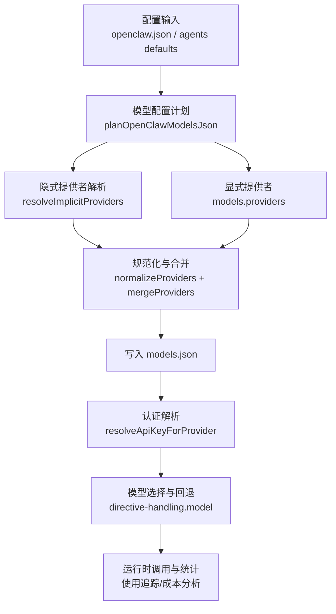
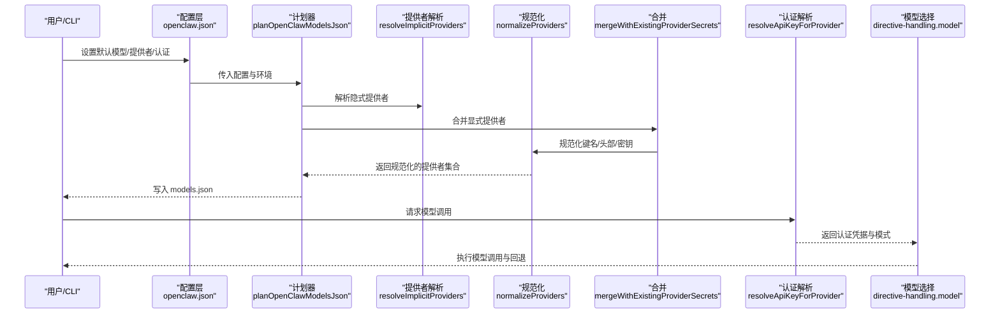
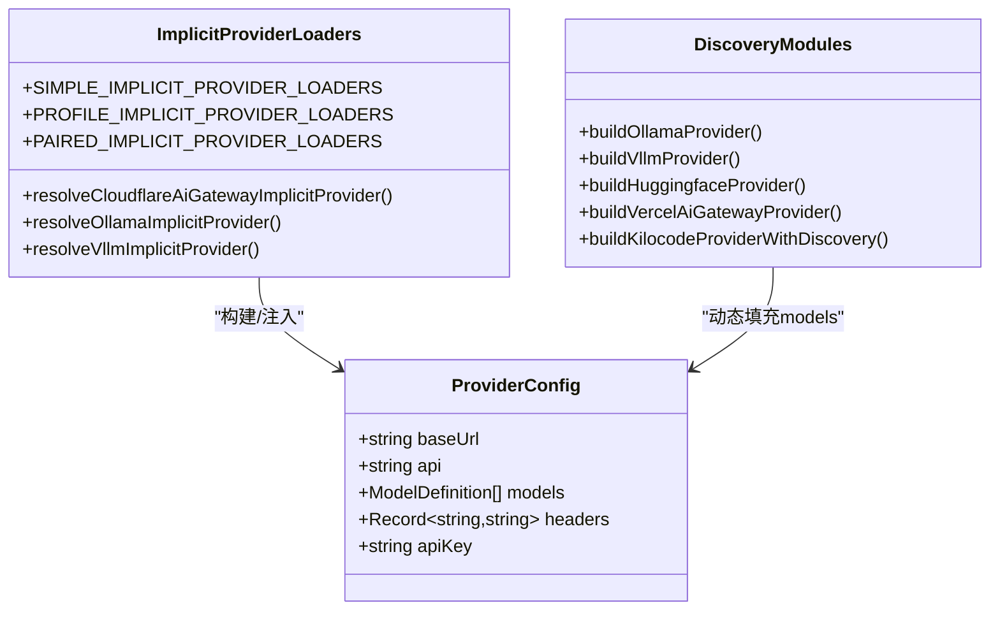
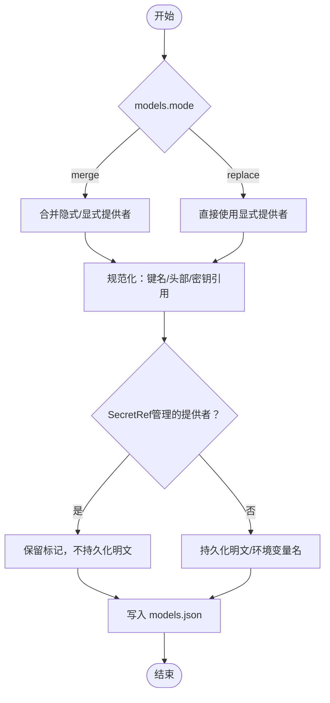
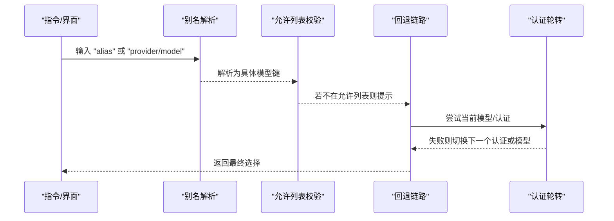
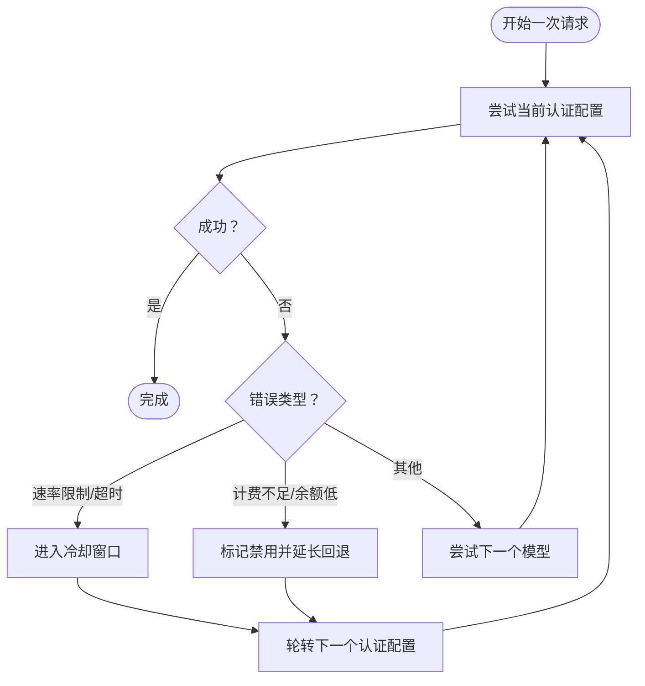
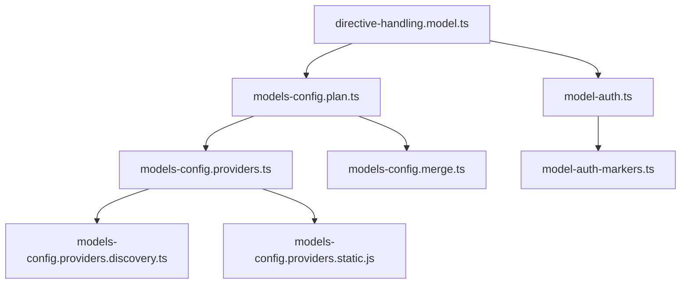

# 模型集成系统

<cite>
**本文引用的文件**
- [src/agents/models-config.providers.ts](file://src/agents/models-config.providers.ts)
- [src/agents/models-config.providers.discovery.ts](file://src/agents/models-config.providers.discovery.ts)
- [src/agents/models-config.merge.ts](file://src/agents/models-config.merge.ts)
- [src/agents/models-config.plan.ts](file://src/agents/models-config.plan.ts)
- [src/agents/model-auth.ts](file://src/agents/model-auth.ts)
- [src/agents/model-auth-markers.ts](file://src/agents/model-auth-markers.ts)
- [src/config/types.auth.ts](file://src/config/types.auth.ts)
- [src/commands/onboard-auth.config-shared.ts](file://src/commands/onboard-auth.config-shared.ts)
- [src/auto-reply/reply/directive-handling.model.ts](file://src/auto-reply/reply/directive-handling.model.ts)
- [src/agents/models-config.providers.static.js](file://src/agents/models-config.providers.static.js)
- [src/agents/models-config.providers.discovery.js](file://src/agents/models-config.providers.discovery.js)
- [docs/concepts/model-providers.md](file://docs/concepts/model-providers.md)
- [docs/concepts/models.md](file://docs/concepts/models.md)
- [docs/concepts/model-failover.md](file://docs/concepts/model-failover.md)
- [docs/concepts/usage-tracking.md](file://docs/concepts/usage-tracking.md)
- [skills/model-usage/scripts/model_usage.py](file://skills/model-usage/scripts/model_usage.py)
- [extensions/open-prose/skills/prose/lib/cost-analyzer.prose](file://extensions/open-prose/skills/prose/lib/cost-analyzer.prose)
- [extensions/open-prose/skills/prose/lib/profiler.prose](file://extensions/open-prose/skills/prose/lib/profiler.prose)
</cite>

## 目录
1. [简介](#简介)
2. [项目结构](#项目结构)
3. [核心组件](#核心组件)
4. [架构总览](#架构总览)
5. [详细组件分析](#详细组件分析)
6. [依赖关系分析](#依赖关系分析)
7. [性能考量](#性能考量)
8. [故障排查指南](#故障排查指南)
9. [结论](#结论)
10. [附录](#附录)

## 简介
本文件面向OpenClaw模型集成系统，系统化阐述AI模型提供商支持矩阵、模型发现与注册机制、模型配置管理、别名解析、认证与配额策略、模型选择与回退、兼容性与错误处理、性能监控与成本追踪，并给出多提供商配置示例与最佳实践。目标是帮助开发者与运维人员在不深入源码的前提下，理解并高效使用该系统。

## 项目结构
OpenClaw的模型集成由“配置生成计划（plan）→隐式/显式提供者解析→规范化→合并→持久化”的流水线驱动，配合认证解析、模型别名与回退策略、以及使用统计与成本追踪能力共同构成完整的模型运行时。

图表来源
- [src/agents/models-config.plan.ts](file://src/agents/models-config.plan.ts#L87-L129)
- [src/agents/models-config.providers.ts](file://src/agents/models-config.providers.ts#L661-L735)
- [src/agents/models-config.merge.ts](file://src/agents/models-config.merge.ts#L36-L44)
- [src/agents/model-auth.ts](file://src/agents/model-auth.ts#L166-L269)
- [src/auto-reply/reply/directive-handling.model.ts](file://src/auto-reply/reply/directive-handling.model.ts#L392-L444)

章节来源
- [src/agents/models-config.plan.ts](file://src/agents/models-config.plan.ts#L1-L129)
- [src/agents/models-config.providers.ts](file://src/agents/models-config.providers.ts#L1-L827)
- [src/agents/models-config.merge.ts](file://src/agents/models-config.merge.ts#L1-L44)
- [src/agents/model-auth.ts](file://src/agents/model-auth.ts#L1-L390)
- [src/auto-reply/reply/directive-handling.model.ts](file://src/auto-reply/reply/directive-handling.model.ts#L392-L444)

## 核心组件
- 模型配置计划与生成：根据配置与环境，决定是否需要生成/更新models.json，以及如何合并隐式与显式提供者。
- 提供者解析与发现：自动发现本地或远端提供者（如Ollama、vLLM、HuggingFace、Kilocode等），并按需注入模型清单。
- 规范化与合并：对提供者键名、头部值、密钥引用进行标准化；在“merge”模式下保留/刷新机密与基础URL。
- 认证解析：从配置、环境变量、OAuth/令牌存储中解析API Key/OAuth/Token/AWS SDK等认证信息。
- 模型选择与回退：基于默认主模型、回退列表、认证轮转与失败窗口实现两阶段回退。
- 使用统计与成本追踪：提供使用量查询、成本汇总与趋势分析能力。

章节来源
- [src/agents/models-config.plan.ts](file://src/agents/models-config.plan.ts#L1-L129)
- [src/agents/models-config.providers.ts](file://src/agents/models-config.providers.ts#L275-L430)
- [src/agents/models-config.merge.ts](file://src/agents/models-config.merge.ts#L36-L44)
- [src/agents/model-auth.ts](file://src/agents/model-auth.ts#L159-L269)
- [docs/concepts/model-failover.md](file://docs/concepts/model-failover.md#L1-L153)

## 架构总览
OpenClaw的模型集成采用“声明式配置 + 运行时解析”的架构。配置层定义默认模型、允许列表、提供者与认证；运行时通过解析器将隐式（内置/自动发现）与显式（用户自定义）提供者合并，再经认证解析与模型选择策略，最终驱动会话执行。

图表来源
- [src/agents/models-config.plan.ts](file://src/agents/models-config.plan.ts#L87-L129)
- [src/agents/models-config.providers.ts](file://src/agents/models-config.providers.ts#L661-L735)
- [src/agents/models-config.merge.ts](file://src/agents/models-config.merge.ts#L36-L44)
- [src/agents/model-auth.ts](file://src/agents/model-auth.ts#L166-L269)
- [src/auto-reply/reply/directive-handling.model.ts](file://src/auto-reply/reply/directive-handling.model.ts#L392-L444)

## 详细组件分析

### 支持的AI模型提供商与发现机制
- 内置提供者：OpenAI、Anthropic、OpenAI Code（Codex）、OpenCode Zen、Google系列（含Vertex、Antigravity、Gemini CLI）、Z.AI（GLM）、Kilo Gateway、OpenRouter、Mistral、Groq、Cerebras、GitHub Copilot、HuggingFace Inference等。
- 自定义/代理提供者：通过models.providers配置自定义baseUrl与api模式；OpenAI/Anthropic兼容端点可直接复用。
- 本地/自托管：Ollama、vLLM、LM Studio等本地服务通过自动发现获取模型清单。
- 动态发现：Kilocode、HuggingFace、Venice、Vercel AI Gateway等通过网关/远端API拉取模型清单。

图表来源
- [src/agents/models-config.providers.ts](file://src/agents/models-config.providers.ts#L498-L735)
- [src/agents/models-config.providers.discovery.ts](file://src/agents/models-config.providers.discovery.ts#L226-L293)

章节来源
- [docs/concepts/model-providers.md](file://docs/concepts/model-providers.md#L34-L460)
- [src/agents/models-config.providers.ts](file://src/agents/models-config.providers.ts#L498-L735)
- [src/agents/models-config.providers.discovery.ts](file://src/agents/models-config.providers.discovery.ts#L1-L293)

### 模型发现与注册
- Ollama：通过本地API枚举模型，推断推理类模型特征，填充上下文窗口与token上限。
- vLLM：调用/models端点获取可用模型ID，统一标注推理特性与成本参数。
- HuggingFace：有密钥时动态拉取模型清单，无密钥时使用静态目录。
- Venice/Vercel/Kilocode：从各自网关API拉取模型清单，统一映射到ProviderConfig。

章节来源
- [src/agents/models-config.providers.discovery.ts](file://src/agents/models-config.providers.discovery.ts#L114-L224)

### 模型配置管理与合并策略
- 合并模式：默认“merge”，将隐式/显式提供者合并；当设置为“replace”则完全覆盖。
- 密钥与基础URL优先级：显式baseUrl优先于现有models.json中的baseUrl；显式apiKey优先于现有models.json中的apiKey（除非被SecretRef管理且当前上下文非SecretRef管理）。
- SecretRef管理：对非环境引用的密钥/头值以标记形式持久化，避免明文泄露。

图表来源
- [src/agents/models-config.plan.ts](file://src/agents/models-config.plan.ts#L61-L85)
- [src/agents/models-config.merge.ts](file://src/agents/models-config.merge.ts#L36-L44)
- [src/agents/models-config.providers.ts](file://src/agents/models-config.providers.ts#L354-L396)

章节来源
- [src/agents/models-config.plan.ts](file://src/agents/models-config.plan.ts#L61-L129)
- [src/agents/models-config.merge.ts](file://src/agents/models-config.merge.ts#L1-L44)
- [src/agents/models-config.providers.ts](file://src/agents/models-config.providers.ts#L275-L430)

### 模型别名解析与选择策略
- 别名解析：支持将别名映射到具体provider/model，回退链路中优先解析别名。
- 选择顺序：主模型 → 回退列表 → 同一提供者内认证轮转 → 下一个模型。
- 允许列表：agents.defaults.models作为白名单，限制可选模型范围。

图表来源
- [src/auto-reply/reply/directive-handling.model.ts](file://src/auto-reply/reply/directive-handling.model.ts#L392-L444)
- [docs/concepts/models.md](file://docs/concepts/models.md#L16-L30)

章节来源
- [src/auto-reply/reply/directive-handling.model.ts](file://src/auto-reply/reply/directive-handling.model.ts#L392-L444)
- [docs/concepts/models.md](file://docs/concepts/models.md#L16-L30)

### 模型认证配置与配额管理
- 认证来源优先级：显式配置（models.providers）→ 环境变量 → OAuth/令牌存储 → 本地合成密钥（如Ollama本地）。
- AWS SDK认证：针对Amazon Bedrock等提供专用路径。
- 配额与用量：部分提供商支持直接从其用量接口查询额度；OAuth/API凭据缺失时隐藏用量。

章节来源
- [src/agents/model-auth.ts](file://src/agents/model-auth.ts#L159-L269)
- [src/agents/model-auth-markers.ts](file://src/agents/model-auth-markers.ts#L1-L81)
- [docs/concepts/usage-tracking.md](file://docs/concepts/usage-tracking.md#L1-L36)

### 模型兼容性检查与回退机制
- 两阶段回退：先在同一提供者内轮转认证（含冷却/禁用），再尝试下一个模型。
- 冷却与禁用：针对计费不足、速率限制、超时等错误触发指数回退与禁用策略。
- Billing回退：默认起始5小时，上限24小时，失败窗口24小时重置。

图表来源
- [docs/concepts/model-failover.md](file://docs/concepts/model-failover.md#L80-L137)
- [src/config/types.auth.ts](file://src/config/types.auth.ts#L16-L28)

章节来源
- [docs/concepts/model-failover.md](file://docs/concepts/model-failover.md#L1-L153)
- [src/config/types.auth.ts](file://src/config/types.auth.ts#L1-L29)

### 错误处理与诊断
- 缺失认证：当未找到对应提供者的API Key/OAuth/Token时抛出明确错误，包含认证存储路径与修复建议。
- 模型不允许：若模型不在允许列表，返回“模型不允许”提示，引导使用/模型列表或调整允许列表。
- 速率限制与配额：仅在速率限制场景自动轮换密钥/认证；非速率限制错误不进行密钥轮换。

章节来源
- [src/agents/model-auth.ts](file://src/agents/model-auth.ts#L260-L269)
- [docs/concepts/models.md](file://docs/concepts/models.md#L61-L77)

### 性能监控、使用统计与成本追踪
- 使用统计：在聊天状态与/usage命令中展示会话token数与估算成本（API Key模式）；部分OAuth提供商仅显示token。
- 成本分析：通过技能脚本与Prose分析器对运行成本、热点与趋势进行归因与优化建议。
- 趋势追踪：将分析结果记录至历史记录以便对比与趋势观察。

图表来源
- [skills/model-usage/scripts/model_usage.py](file://skills/model-usage/scripts/model_usage.py#L111-L164)
- [extensions/open-prose/skills/prose/lib/cost-analyzer.prose](file://extensions/open-prose/skills/prose/lib/cost-analyzer.prose#L96-L147)
- [extensions/open-prose/skills/prose/lib/profiler.prose](file://extensions/open-prose/skills/prose/lib/profiler.prose#L317-L400)

章节来源
- [docs/concepts/usage-tracking.md](file://docs/concepts/usage-tracking.md#L1-L36)
- [skills/model-usage/scripts/model_usage.py](file://skills/model-usage/scripts/model_usage.py#L96-L164)
- [extensions/open-prose/skills/prose/lib/cost-analyzer.prose](file://extensions/open-prose/skills/prose/lib/cost-analyzer.prose#L96-L147)
- [extensions/open-prose/skills/prose/lib/profiler.prose](file://extensions/open-prose/skills/prose/lib/profiler.prose#L317-L400)

## 依赖关系分析
- 组件耦合：模型配置计划依赖提供者解析与合并模块；认证解析依赖授权存储与环境变量；模型选择依赖别名与回退规则。
- 外部依赖：本地服务（Ollama/vLLM）、远端网关（HuggingFace/Kilocode/Vercel）、云厂商SDK（AWS）。
- 循环依赖：未见循环导入；各模块职责清晰，通过函数与类型接口交互。

图表来源
- [src/agents/models-config.plan.ts](file://src/agents/models-config.plan.ts#L1-L129)
- [src/agents/models-config.providers.ts](file://src/agents/models-config.providers.ts#L1-L827)
- [src/agents/models-config.providers.discovery.ts](file://src/agents/models-config.providers.discovery.ts#L1-L293)
- [src/agents/models-config.merge.ts](file://src/agents/models-config.merge.ts#L1-L44)
- [src/agents/model-auth.ts](file://src/agents/model-auth.ts#L1-L390)
- [src/agents/model-auth-markers.ts](file://src/agents/model-auth-markers.ts#L1-L81)
- [src/auto-reply/reply/directive-handling.model.ts](file://src/auto-reply/reply/directive-handling.model.ts#L392-L444)

章节来源
- [src/agents/models-config.plan.ts](file://src/agents/models-config.plan.ts#L1-L129)
- [src/agents/models-config.providers.ts](file://src/agents/models-config.providers.ts#L1-L827)
- [src/agents/model-auth.ts](file://src/agents/model-auth.ts#L1-L390)

## 性能考量
- 发现延迟：本地/远端模型发现可能带来启动开销，建议在本地部署时缓存或限制并发。
- 并发与批处理：批量探测模型时应控制并发度，避免阻塞。
- 本地代理：Ollama/vLLM等本地服务建议固定基础URL与模型上下文窗口，减少每次探测。
- 回退策略：合理设置失败窗口与回退上限，避免频繁冷却导致吞吐下降。

## 故障排查指南
- 无法解析模型：确认模型是否在允许列表；检查别名是否正确；查看/模型状态输出。
- 认证失败：核对环境变量/配置/授权存储；检查OAuth过期；查看认证轮转与冷却状态。
- 速率限制：启用密钥轮换（仅限速率限制场景）；优化并发与批处理；考虑升级配额。
- 用量不可见：确认对应提供商的API Key/OAuth是否存在；某些提供商仅支持特定凭据类型。

章节来源
- [docs/concepts/models.md](file://docs/concepts/models.md#L61-L161)
- [docs/concepts/model-failover.md](file://docs/concepts/model-failover.md#L80-L137)
- [docs/concepts/usage-tracking.md](file://docs/concepts/usage-tracking.md#L25-L36)

## 结论
OpenClaw的模型集成系统通过“声明式配置 + 运行时解析 + 动态发现 + 认证与回退”的组合，实现了对多提供商、多形态（本地/远端/云）模型的统一接入与治理。配合使用统计与成本分析工具，可有效提升稳定性、可观测性与成本效率。建议在生产环境中结合允许列表、合理的回退策略与配额管理，确保高可用与可控成本。

## 附录
- 配置示例与最佳实践参见概念文档与提供商子文档，涵盖OpenAI、Anthropic、Google、OpenCode Zen、Kilo Gateway、OpenRouter、Mistral、GitHub Copilot、HuggingFace、Ollama、vLLM、本地代理等。
- 命令参考：onboard、models list/status/set、扫描与别名/回退管理等。

章节来源
- [docs/concepts/model-providers.md](file://docs/concepts/model-providers.md#L1-L460)
- [docs/concepts/models.md](file://docs/concepts/models.md#L116-L222)
- [src/commands/onboard-auth.config-shared.ts](file://src/commands/onboard-auth.config-shared.ts#L194-L213)