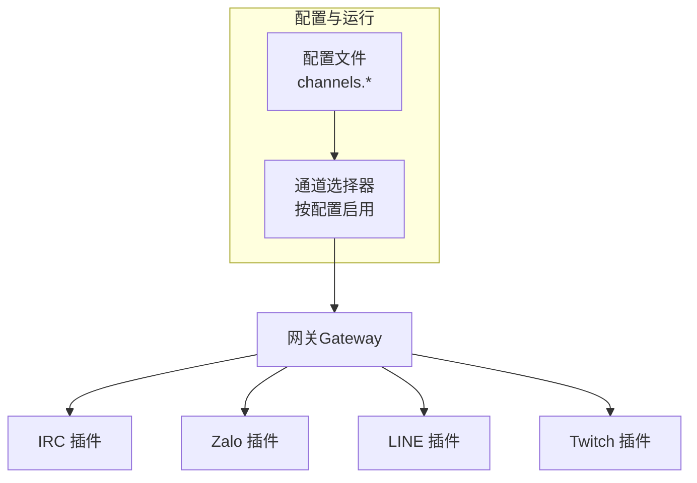
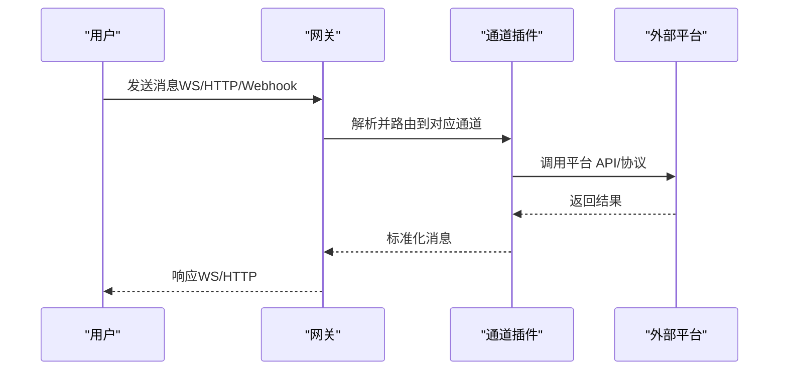
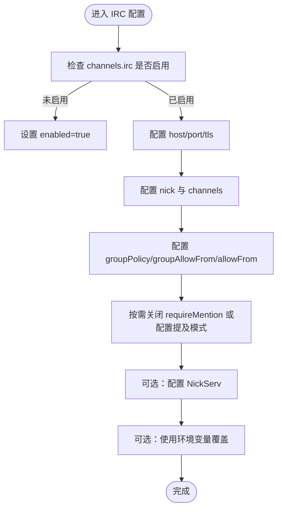
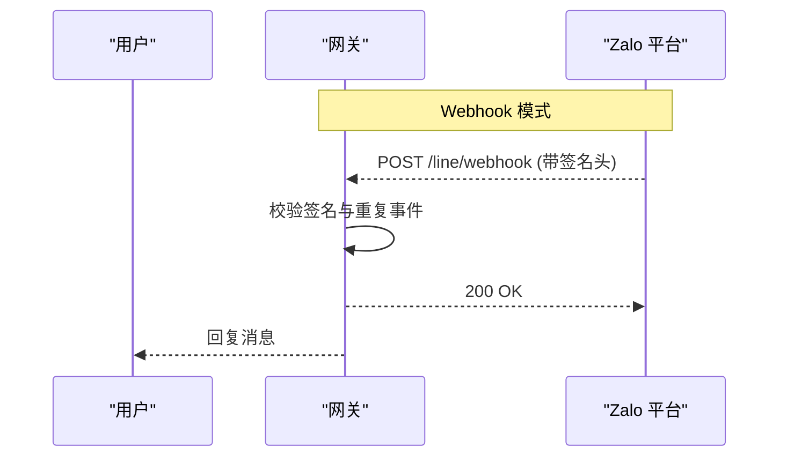
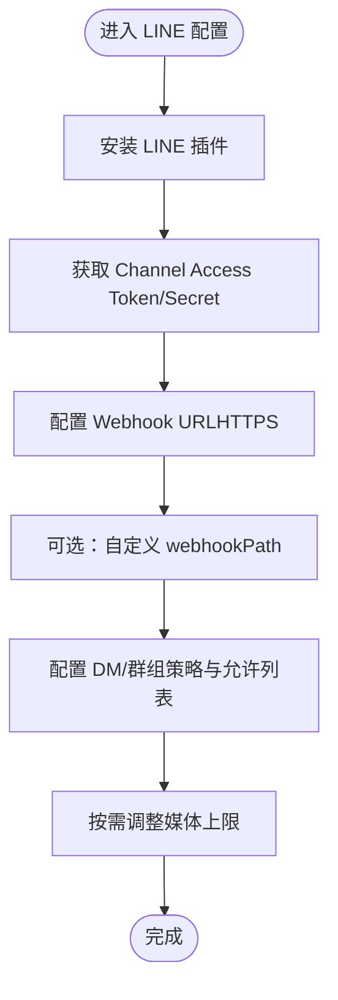
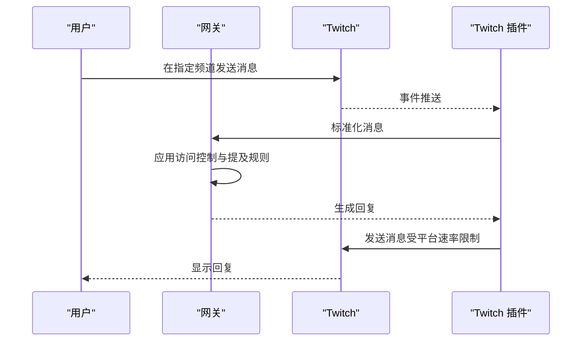

# 专业领域通讯平台

<cite>
**本文引用的文件**
- [irc.md](file://docs/channels/irc.md)
- [zalo.md](file://docs/channels/zalo.md)
- [line.md](file://docs/channels/line.md)
- [twitch.md](file://docs/channels/twitch.md)
- [groups.md](file://docs/channels/groups.md)
- [configuration.md](file://docs/gateway/configuration.md)
- [architecture.md](file://docs/concepts/architecture.md)
- [migrating.md](file://docs/install/migrating.md)
- [setup.md](file://docs/start/setup.md)
- [channel-selection.ts](file://src/infra/outbound/channel-selection.ts)
</cite>

## 目录
1. [引言](#引言)
2. [项目结构](#项目结构)
3. [核心组件](#核心组件)
4. [架构总览](#架构总览)
5. [详细组件分析](#详细组件分析)
6. [依赖关系分析](#依赖关系分析)
7. [性能考量](#性能考量)
8. [故障排查指南](#故障排查指南)
9. [结论](#结论)
10. [附录](#附录)

## 引言
本文件面向在专业领域（如技术社区、开发者生态、垂直行业）部署与运营 OpenClaw 的团队，系统化梳理其对 IRC、Zalo、LINE、Twitch 等专业平台的集成方式。内容覆盖平台特性、接入流程、访问控制与安全策略、内容审核与用户体验优化、平台特定配置参数、API 限制与性能注意事项，并提供专业部署与用户迁移方案，帮助实现稳定、可审计、可扩展的跨平台消息网关。

## 项目结构
OpenClaw 采用“网关 + 插件/扩展”的分层架构：单个长连接网关统一维护多通道连接；各平台以插件形式提供，通过统一配置模型接入。核心能力包括：
- 配置中心：集中管理通道、代理、会话、工具、自动化等
- 通道选择与启动：按配置自动发现并启用已配置的通道
- 安全与访问控制：基于策略的 DM 与群组访问、提及触发、工具限制
- 远程与本地联接：支持本地直连、SSH 隧道、Tailscale 等远程访问

图表来源
- [configuration.md](file://docs/gateway/configuration.md#L76-L104)
- [channel-selection.ts](file://src/infra/outbound/channel-selection.ts#L71-L84)

章节来源
- [configuration.md](file://docs/gateway/configuration.md#L76-L104)
- [channel-selection.ts](file://src/infra/outbound/channel-selection.ts#L71-L84)

## 核心组件
- 通道配置与策略
  - DM 策略：配对（pairing）、白名单（allowlist）、开放（open）、禁用（disabled）
  - 群组策略：开放（open）、白名单（allowlist）、禁用（disabled）
  - 提及触发：默认群组需 @提及或显式激活；支持按群组覆盖
- 会话与上下文
  - DM 使用主会话或按对端隔离；群组会话独立，支持心跳跳过与沙箱隔离
  - 支持线程绑定、会话重置策略
- 工具与媒体
  - 按通道/群组粒度限制工具集；媒体下载/上传大小限制
- 安全与审计
  - 访问控制严格遵循策略；日志与诊断命令辅助排障
  - 环境变量与密钥引用机制，支持文件/执行器注入

章节来源
- [groups.md](file://docs/channels/groups.md#L17-L37)
- [groups.md](file://docs/channels/groups.md#L128-L194)
- [groups.md](file://docs/channels/groups.md#L202-L251)
- [configuration.md](file://docs/gateway/configuration.md#L135-L147)
- [configuration.md](file://docs/gateway/configuration.md#L178-L204)

## 架构总览
OpenClaw 的网关负责：
- 维护各平台连接（IRC、Zalo、LINE、Twitch 等）
- 通过 WebSocket 对外暴露控制面 API
- 将入站消息标准化为统一信道信封，再路由到代理/智能体
- 出站消息经由各平台 SDK/HTTP 接口发送

图表来源
- [architecture.md](file://docs/concepts/architecture.md#L27-L58)

章节来源
- [architecture.md](file://docs/concepts/architecture.md#L27-L58)

## 详细组件分析

### IRC 集成
- 特色功能
  - 经典 IRC 通道与私聊支持；TLS 加密传输
  - 提及触发（mention-gating）默认开启，可按群组关闭
  - 支持 NickServ 身份认证与一次性注册
- 使用场景
  - 开源社区、技术讨论频道、IRC 生态内的自动化与知识问答
- 技术要求
  - 必填：服务器主机、端口、昵称、至少一个频道
  - 可选：TLS、NickServ 密码、通道白名单、发送者白名单
- 社区管理与内容审核
  - 群组策略与发送者白名单双层门禁
  - 提及触发降低误触发风险；对公开频道建议限制工具集
- 性能与限制
  - 默认提及触发减少无关回复；注意服务器带宽与连接稳定性
- 配置要点与示例路径
  - 最小配置与启动命令：见“快速开始”
  - 访问控制与提及触发：见“访问控制”与“回复触发（提及）”
  - NickServ 登录与一次性注册：见“NickServ”
  - 环境变量：见“环境变量”
  - 故障排查：见“故障排查”

图表来源
- [irc.md](file://docs/channels/irc.md#L13-L37)
- [irc.md](file://docs/channels/irc.md#L46-L127)
- [irc.md](file://docs/channels/irc.md#L187-L221)
- [irc.md](file://docs/channels/irc.md#L222-L242)

章节来源
- [irc.md](file://docs/channels/irc.md#L10-L37)
- [irc.md](file://docs/channels/irc.md#L46-L127)
- [irc.md](file://docs/channels/irc.md#L187-L242)

### Zalo 集成
- 特色功能
  - 1:1 私聊支持；群组支持带策略控制；默认配对 DM
  - 长轮询默认；支持 Webhook（HTTPS、签名头、去重窗口、限流）
  - 文本自动分片（2000 字符）、媒体上限（默认 5MB）、不支持流式
- 使用场景
  - 越南地区客服、通知与确定性回路
- 技术要求
  - 从 Zalo Bot 平台获取 Bot Token；可多账号
  - Webhook 需 HTTPS、固定长度密钥、路径与去重策略
- 社区管理与内容审核
  - DM 默认配对；群组默认白名单；可按用户 ID 限制触发者
  - 公开群组建议限制工具集，降低高危操作风险
- 性能与限制
  - 文本分片与媒体上限；长轮询与 Webhook 互斥
- 配置要点与示例路径
  - 快速设置与最小配置：见“快速设置（初学者）”与“最小配置”
  - 行为与能力矩阵：见“行为”与“能力”
  - 访问控制（DM/群组）：见“访问控制（DMs）”与“访问控制（Groups）”
  - Webhook 与长轮询：见“长轮询 vs webhook”
  - 限制与容量：见“限制”
  - 配置参考：见“配置参考（Zalo）”

图表来源
- [zalo.md](file://docs/channels/zalo.md#L120-L132)

章节来源
- [zalo.md](file://docs/channels/zalo.md#L20-L85)
- [zalo.md](file://docs/channels/zalo.md#L87-L153)
- [zalo.md](file://docs/channels/zalo.md#L159-L207)

### LINE 集成
- 特色功能
  - 支持私聊、群组、媒体、位置、Flex 卡片、模板消息、快捷回复
  - 文本分片（5000 字符）、Markdown 清理、流式响应缓冲动画
  - Webhook 签名验证（依赖原始请求体），严格预认证限制
- 使用场景
  - 日本/东南亚地区企业服务、富媒体交互
- 技术要求
  - LINE Developers 控制台创建 Messaging API 渠道，获取 Channel Access Token 与 Channel Secret
  - Webhook URL 必须 HTTPS；可自定义路径
- 社区管理与内容审核
  - DM 默认配对；群组默认白名单；ID 区分大小写
  - 建议限制工具集，避免高风险操作
- 性能与限制
  - 媒体上限（默认 10MB）；文本分片与流式缓冲
- 配置要点与示例路径
  - 插件安装与最小配置：见“插件所需”与“最小配置”
  - Webhook 与签名：见“设置”与“安全注意”
  - 访问控制与 ID 规范：见“访问控制”
  - 消息行为与富媒体：见“消息行为”与“通道数据（富消息）”
  - 故障排查：见“故障排查”

图表来源
- [line.md](file://docs/channels/line.md#L20-L50)
- [line.md](file://docs/channels/line.md#L55-L88)
- [line.md](file://docs/channels/line.md#L108-L132)
- [line.md](file://docs/channels/line.md#L133-L176)
- [line.md](file://docs/channels/line.md#L184-L192)

章节来源
- [line.md](file://docs/channels/line.md#L10-L50)
- [line.md](file://docs/channels/line.md#L108-L176)
- [line.md](file://docs/channels/line.md#L184-L192)

### Twitch 集成
- 特色功能
  - 基于 IRC 的 Twitch 聊天；确定性路由回 Twitch
  - 多账号支持；按账户隔离会话；支持角色与用户 ID 白名单
  - 提供令牌刷新（可选）；消息自动分片（500 字符）
- 使用场景
  - 直播互动、游戏社区、内容创作者与主播生态
- 技术要求
  - 使用 Twitch Token Generator 获取 Bot Token（含 chat:read 与 chat:write）
  - 配置用户名、客户端 ID、频道；建议添加访问控制
- 社区管理与内容审核
  - 默认需要 @提及；可通过 allowFrom 或 allowedRoles 控制
  - 建议使用永久用户 ID（而非易变用户名）进行白名单
- 性能与限制
  - 文本分片与平台内置速率限制；令牌过期需重新生成或启用刷新
- 配置要点与示例路径
  - 快速设置与最小配置：见“快速设置（初学者）”与“最小配置”
  - 令牌生成与刷新：见“生成凭据”与“令牌刷新（可选）”
  - 多账号与访问控制：见“多账号支持”与“访问控制”
  - 工具动作与安全运维：见“工具动作”与“安全与运维”
  - 限制：见“限制”
  - 配置参考：见“配置”

图表来源
- [twitch.md](file://docs/channels/twitch.md#L30-L61)
- [twitch.md](file://docs/channels/twitch.md#L178-L247)
- [twitch.md](file://docs/channels/twitch.md#L287-L346)
- [twitch.md](file://docs/channels/twitch.md#L375-L380)

章节来源
- [twitch.md](file://docs/channels/twitch.md#L30-L61)
- [twitch.md](file://docs/channels/twitch.md#L178-L247)
- [twitch.md](file://docs/channels/twitch.md#L287-L346)
- [twitch.md](file://docs/channels/twitch.md#L375-L380)

## 依赖关系分析
- 通道选择与启动
  - 通道是否启用与配置正确，决定其是否被网关加载
  - 启动时按配置扫描插件，满足条件即加入可用通道清单
- 策略与会话
  - DM 与群组策略影响消息处理路径；提及触发与工具限制叠加
  - 群组会话独立，支持沙箱隔离与非主会话执行模式
- 安全与审计
  - 环境变量与密钥引用；Webhook 签名验证；日志与诊断命令

图表来源
- [channel-selection.ts](file://src/infra/outbound/channel-selection.ts#L71-L84)
- [configuration.md](file://docs/gateway/configuration.md#L76-L104)

章节来源
- [channel-selection.ts](file://src/infra/outbound/channel-selection.ts#L71-L84)
- [configuration.md](file://docs/gateway/configuration.md#L76-L104)

## 性能考量
- 文本分片与媒体上限
  - IRC（2000 字符）、LINE（5000 字符）、Zalo（2000 字符）、Twitch（500 字符）
  - 媒体上限：Zalo 默认 5MB，LINE 默认 10MB
- 流式与缓冲
  - LINE 支持流式响应缓冲动画；Zalo 默认阻断流式（受字符限制）
- 网络与并发
  - Webhook 与长轮询互斥；Webhook 需 HTTPS、签名与限流
  - Twitch 使用平台内置速率限制；令牌过期需及时刷新
- 会话与资源
  - 群组会话独立，建议在非主会话模式下启用沙箱，隔离高风险工具

章节来源
- [irc.md](file://docs/channels/irc.md#L95-L126)
- [line.md](file://docs/channels/line.md#L133-L141)
- [zalo.md](file://docs/channels/zalo.md#L93-L107)
- [twitch.md](file://docs/channels/twitch.md#L375-L380)

## 故障排查指南
- 通用诊断
  - 使用诊断命令检查通道状态与连接健康
  - 查看网关日志定位错误
- IRC
  - 若无回复：确认 groupPolicy 与 groups 设置，检查是否因缺失 @提及被丢弃
  - 登录失败：核对昵称可用性与服务器密码
  - TLS 失败：校验主机/端口与证书
- Zalo
  - 机器人不回复：校验令牌有效性、发送者是否批准、查看日志
  - Webhook 不接收事件：确认 HTTPS、密钥长度、网关可达性、互斥模式
- LINE
  - Webhook 校验失败：确保 URL HTTPS 且 Channel Secret 正确
  - 媒体下载错误：提高 mediaMaxMb
- Twitch
  - 无响应：检查 allowFrom/allowedRoles、机器人是否已在频道
  - 令牌问题：确认令牌前缀与作用域；若使用刷新，核对 clientSecret 与 refreshToken

章节来源
- [irc.md](file://docs/channels/irc.md#L237-L242)
- [zalo.md](file://docs/channels/zalo.md#L159-L173)
- [line.md](file://docs/channels/line.md#L184-L192)
- [twitch.md](file://docs/channels/twitch.md#L249-L286)

## 结论
OpenClaw 在专业领域通讯平台集成方面提供了统一的配置模型与强大的安全与治理能力。通过通道插件化、策略化访问控制、提及触发与工具限制，以及针对不同平台的适配（如 LINE 的富媒体、Zalo 的 Webhook、Twitch 的角色与令牌刷新），可在复杂业务场景中实现稳定、可控、可审计的消息自动化。结合会话隔离与沙箱策略，可进一步提升生产环境的安全性与可靠性。

## 附录

### 专业部署指南
- 本地开发与调试
  - 使用 macOS 应用托管网关，或本地运行网关并让应用连接
  - 保持配置与工作空间分离，便于更新与备份
- 远程与多用户
  - 推荐 Tailscale 或 VPN；SSH 隧道作为备选
  - Linux 使用 systemd 用户服务，必要时启用持久化
- 通道启用与验证
  - 通过配置启用目标通道；使用诊断命令与状态检查确认
  - 通道选择器会根据配置自动发现并启动已配置通道

章节来源
- [setup.md](file://docs/start/setup.md#L59-L116)
- [setup.md](file://docs/start/setup.md#L146-L157)
- [configuration.md](file://docs/gateway/configuration.md#L76-L104)
- [channel-selection.ts](file://src/infra/outbound/channel-selection.ts#L71-L84)

### 用户迁移方案
- 迁移范围
  - 复制状态目录（包含配置、认证、会话、通道状态）与工作空间
  - 注意配置文件与通道登录状态均在状态目录内
- 迁移步骤
  - 停止旧机器网关，打包归档状态目录与工作空间
  - 新机器安装 OpenClaw，复制上述目录，运行诊断修复
  - 启动网关并验证通道连接与会话历史
- 常见陷阱
  - 配置文件不完整仅复制 openclaw.json
  - 权限与属主不正确导致无法读取凭据
  - 本地/远程模式混用导致状态未迁移

章节来源
- [migrating.md](file://docs/install/migrating.md#L68-L132)
- [migrating.md](file://docs/install/migrating.md#L133-L178)