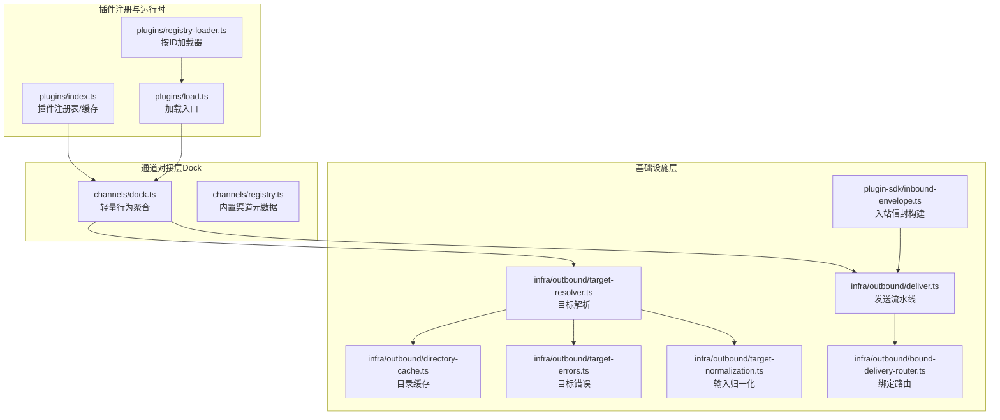
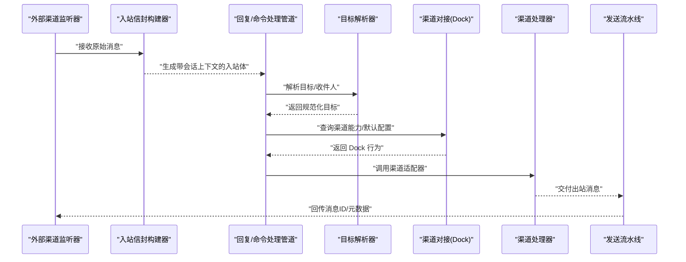
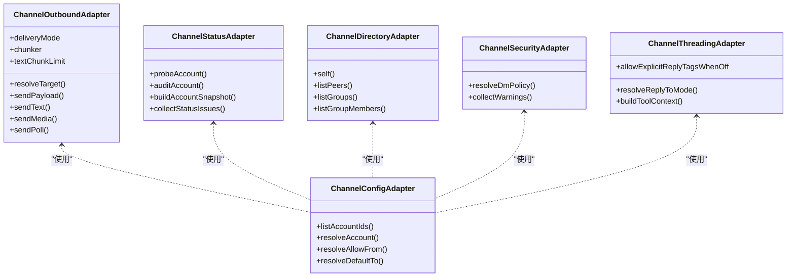
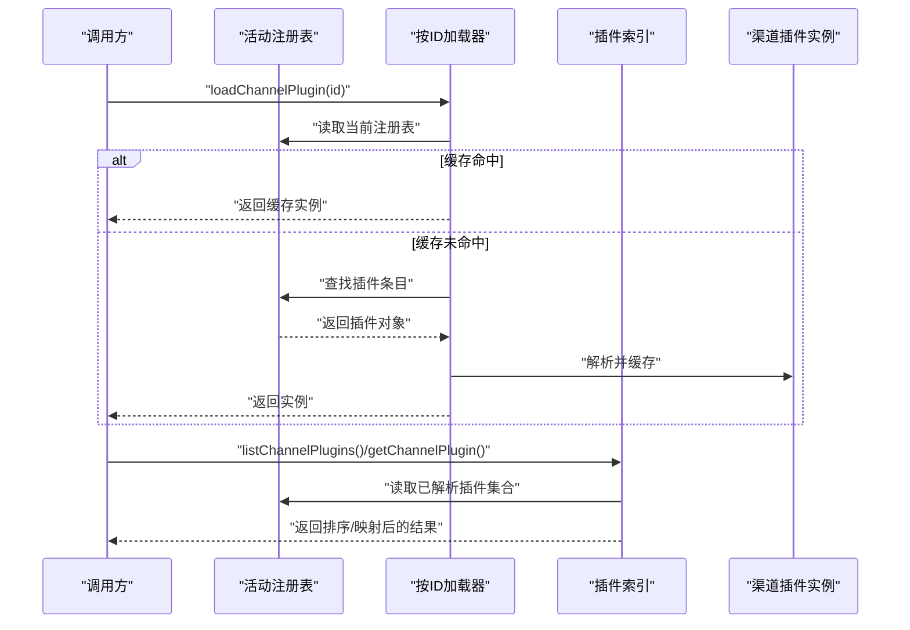
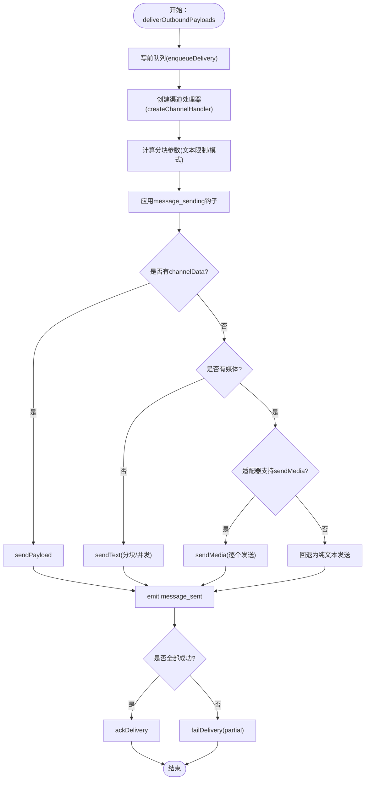
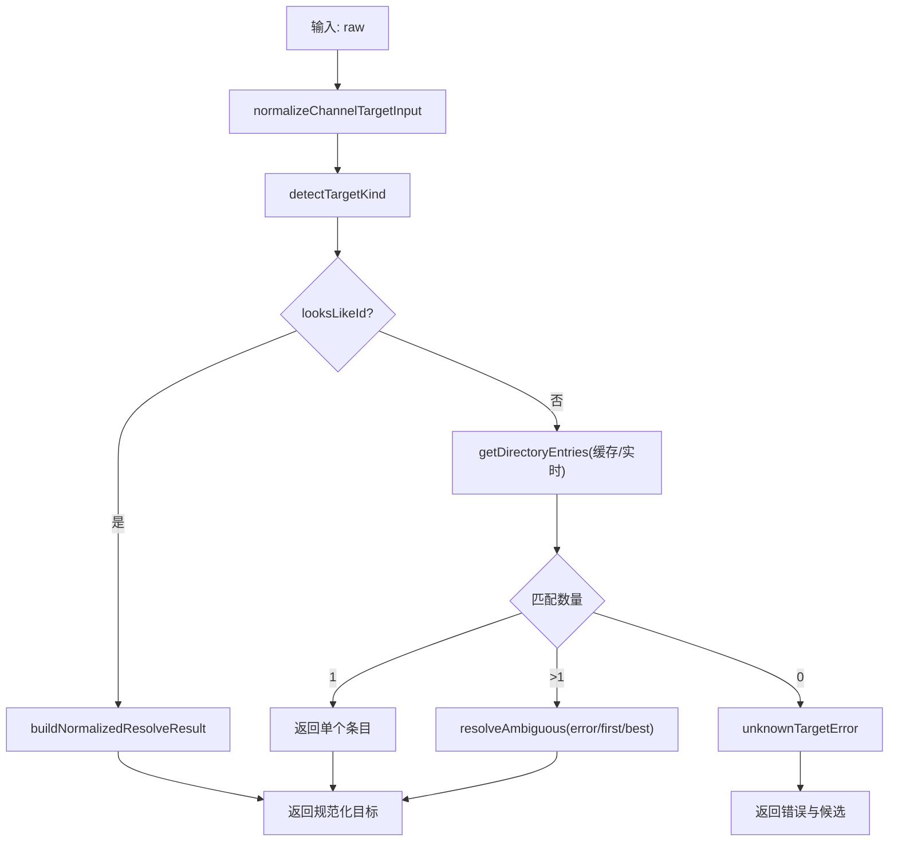
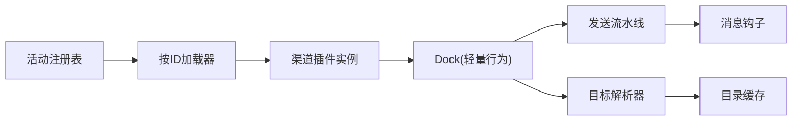

# 渠道适配器架构

<cite>
**本文引用的文件**
- [src/channels/plugins/index.ts](file://src/channels/plugins/index.ts)
- [src/channels/plugins/types.adapters.ts](file://src/channels/plugins/types.adapters.ts)
- [src/channels/plugins/types.core.ts](file://src/channels/plugins/types.core.ts)
- [src/channels/plugins/types.ts](file://src/channels/plugins/types.ts)
- [src/channels/plugins/load.ts](file://src/channels/plugins/load.ts)
- [src/channels/plugins/registry-loader.ts](file://src/channels/plugins/registry-loader.ts)
- [src/channels/registry.ts](file://src/channels/registry.ts)
- [src/channels/dock.ts](file://src/channels/dock.ts)
- [src/infra/outbound/deliver.ts](file://src/infra/outbound/deliver.ts)
- [src/infra/outbound/target-resolver.ts](file://src/infra/outbound/target-resolver.ts)
- [src/infra/outbound/bound-delivery-router.ts](file://src/infra/outbound/bound-delivery-router.ts)
- [src/infra/outbound/target-errors.ts](file://src/infra/outbound/target-errors.ts)
- [src/infra/outbound/target-normalization.ts](file://src/infra/outbound/target-normalization.ts)
- [src/infra/outbound/directory-cache.ts](file://src/infra/outbound/directory-cache.ts)
- [src/plugin-sdk/inbound-envelope.ts](file://src/plugin-sdk/inbound-envelope.ts)
- [src/web/auto-reply/monitor/process-message.ts](file://src/web/auto-reply/monitor/process-message.ts)
- [extensions/zalo/src/monitor.ts](file://extensions/zalo/src/monitor.ts)
- [scripts/check-channel-agnostic-boundaries.mjs](file://scripts/check-channel-agnostic-boundaries.mjs)
- [src/config/schema.ts](file://src/config/schema.ts)
</cite>

## 目录
1. [引言](#引言)
2. [项目结构](#项目结构)
3. [核心组件](#核心组件)
4. [架构总览](#架构总览)
5. [详细组件分析](#详细组件分析)
6. [依赖关系分析](#依赖关系分析)
7. [性能考量](#性能考量)
8. [故障排查指南](#故障排查指南)
9. [结论](#结论)
10. [附录：自定义渠道适配器开发指南](#附录自定义渠道适配器开发指南)

## 引言
本文件系统化阐述 OpenClaw 的“渠道适配器”（Channel Adapter）架构，聚焦其设计模式、统一接口抽象与消息路由机制。文档覆盖消息从接收、解析、转换到发送的标准化流程，解释跨渠道一致性保障、错误处理策略与性能优化方案，并给出生命周期管理、配置验证与动态加载机制的实践建议，最后提供自定义渠道适配器的开发指南与最佳实践。

## 项目结构
OpenClaw 将“渠道适配器”能力拆分为三层：
- 插件注册与运行时：负责渠道插件的发现、缓存与按需加载。
- 通道对接层（Dock）：对共享路径暴露轻量行为，屏蔽具体渠道实现细节。
- 基础设施层（Outbound/Inbound）：实现消息发送、目标解析、会话封装等通用能力。

图示来源
- [src/channels/plugins/index.ts](file://src/channels/plugins/index.ts#L1-L118)
- [src/channels/plugins/registry-loader.ts](file://src/channels/plugins/registry-loader.ts#L1-L36)
- [src/channels/plugins/load.ts](file://src/channels/plugins/load.ts#L1-L9)
- [src/channels/dock.ts](file://src/channels/dock.ts#L1-L637)
- [src/channels/registry.ts](file://src/channels/registry.ts#L1-L201)
- [src/infra/outbound/deliver.ts](file://src/infra/outbound/deliver.ts#L1-L829)
- [src/infra/outbound/target-resolver.ts](file://src/infra/outbound/target-resolver.ts#L1-L500)
- [src/infra/outbound/directory-cache.ts](file://src/infra/outbound/directory-cache.ts)
- [src/infra/outbound/target-errors.ts](file://src/infra/outbound/target-errors.ts)
- [src/infra/outbound/target-normalization.ts](file://src/infra/outbound/target-normalization.ts)
- [src/infra/outbound/bound-delivery-router.ts](file://src/infra/outbound/bound-delivery-router.ts#L49-L91)
- [src/plugin-sdk/inbound-envelope.ts](file://src/plugin-sdk/inbound-envelope.ts#L1-L55)

章节来源
- [src/channels/plugins/index.ts](file://src/channels/plugins/index.ts#L1-L118)
- [src/channels/dock.ts](file://src/channels/dock.ts#L1-L637)
- [src/infra/outbound/deliver.ts](file://src/infra/outbound/deliver.ts#L1-L829)
- [src/infra/outbound/target-resolver.ts](file://src/infra/outbound/target-resolver.ts#L1-L500)

## 核心组件
- 统一接口抽象
  - 适配器类型：配置、认证、网关、出站、状态、目录、解析、安全、命令、流式、线程等，均通过类型约束在适配器接口中声明，确保各渠道以一致方式暴露能力。
  - 核心类型：账户快照、目录条目、消息动作、线程上下文、能力集等，形成跨渠道的数据契约。
- 动态加载与缓存
  - 按ID加载器：基于活动插件注册表，按需加载并缓存渠道插件，避免重复初始化与循环依赖。
  - 插件索引：集中去重、排序与按ID映射，支持外部扩展渠道无缝接入。
- 轻量对接（Dock）
  - 对共享路径暴露能力：允许在不引入重型监控或登录逻辑的前提下，复用渠道能力（如 allowFrom 格式化、默认收件人解析、提及剥离、线程工具上下文构建等）。
- 发送流水线（Outbound）
  - 文本分块、Markdown 处理、媒体落盘与发送、钩子集成、写前队列与镜像回放、错误恢复与部分失败处理。
- 目标解析（Target Resolver）
  - 输入归一化、目录查询与缓存、歧义处理策略、显示名格式化、大小写与前缀保留规则。
- 入站信封（Inbound Envelope）
  - 构建带时间戳与会话上下文的入站消息体，确保跨渠道一致性与可追溯性。

章节来源
- [src/channels/plugins/types.adapters.ts](file://src/channels/plugins/types.adapters.ts#L1-L384)
- [src/channels/plugins/types.core.ts](file://src/channels/plugins/types.core.ts#L1-L391)
- [src/channels/plugins/types.ts](file://src/channels/plugins/types.ts#L1-L66)
- [src/channels/plugins/registry-loader.ts](file://src/channels/plugins/registry-loader.ts#L1-L36)
- [src/channels/plugins/index.ts](file://src/channels/plugins/index.ts#L1-L118)
- [src/channels/dock.ts](file://src/channels/dock.ts#L1-L637)
- [src/infra/outbound/deliver.ts](file://src/infra/outbound/deliver.ts#L1-L829)
- [src/infra/outbound/target-resolver.ts](file://src/infra/outbound/target-resolver.ts#L1-L500)
- [src/plugin-sdk/inbound-envelope.ts](file://src/plugin-sdk/inbound-envelope.ts#L1-L55)

## 架构总览
下图展示从入站到出站的关键交互，以及渠道适配器在其中的角色定位。

图示来源
- [src/plugin-sdk/inbound-envelope.ts](file://src/plugin-sdk/inbound-envelope.ts#L1-L55)
- [src/web/auto-reply/monitor/process-message.ts](file://src/web/auto-reply/monitor/process-message.ts#L126-L167)
- [src/infra/outbound/target-resolver.ts](file://src/infra/outbound/target-resolver.ts#L32-L461)
- [src/channels/dock.ts](file://src/channels/dock.ts#L65-L82)
- [src/infra/outbound/deliver.ts](file://src/infra/outbound/deliver.ts#L139-L202)

## 详细组件分析

### 组件A：渠道适配器统一接口与类型体系
- 设计要点
  - 通过适配器接口抽象渠道能力边界，例如：出站发送、目录查询、心跳检查、安全策略、命令授权等。
  - 核心数据模型（账户快照、目录条目、消息动作上下文、线程工具上下文）确保跨渠道一致性。
- 关键类型与职责
  - 出站适配器：定义文本/媒体/Poll 发送、分块策略与目标解析。
  - 状态适配器：账户探针、审计、快照生成与状态问题收集。
  - 目录适配器：自、用户/群组列表、实时列表与成员查询。
  - 安全适配器：私聊策略、警告收集。
  - 线程适配器：回复到模式、显式标签保留策略、工具上下文构建。
- 优势
  - 类型驱动的契约降低耦合；新增渠道只需实现必要适配器即可接入。

图示来源
- [src/channels/plugins/types.adapters.ts](file://src/channels/plugins/types.adapters.ts#L24-L384)
- [src/channels/plugins/types.core.ts](file://src/channels/plugins/types.core.ts#L19-L391)

章节来源
- [src/channels/plugins/types.adapters.ts](file://src/channels/plugins/types.adapters.ts#L1-L384)
- [src/channels/plugins/types.core.ts](file://src/channels/plugins/types.core.ts#L1-L391)

### 组件B：动态加载与插件注册表
- 设计要点
  - 使用“按ID加载器”在首次访问时从活动注册表中解析并缓存插件实例，后续直接命中缓存。
  - 插件索引模块负责去重、排序与按ID映射，支持内置渠道与外部扩展渠道共存。
- 生命周期
  - 注册表版本变更触发缓存失效与重建，确保热更新场景下的正确性。
- 依赖关系
  - 加载器依赖运行时注册表；索引依赖注册表与渠道元数据。

图示来源
- [src/channels/plugins/registry-loader.ts](file://src/channels/plugins/registry-loader.ts#L1-L36)
- [src/channels/plugins/load.ts](file://src/channels/plugins/load.ts#L1-L9)
- [src/channels/plugins/index.ts](file://src/channels/plugins/index.ts#L42-L84)

章节来源
- [src/channels/plugins/registry-loader.ts](file://src/channels/plugins/registry-loader.ts#L1-L36)
- [src/channels/plugins/load.ts](file://src/channels/plugins/load.ts#L1-L9)
- [src/channels/plugins/index.ts](file://src/channels/plugins/index.ts#L1-L118)

### 组件C：渠道对接（Dock）与轻量行为
- 设计要点
  - Dock 将各渠道的能力与默认行为以轻量形式暴露给共享路径，避免直接导入重型实现。
  - 内置渠道（如 Telegram、WhatsApp、Discord 等）在注册表中声明顺序与元信息，Dock 提供默认行为。
  - 外部渠道可通过插件注册表注入 Dock 或直接实现适配器。
- 关键能力
  - 配置：allowFrom 解析、默认收件人解析、显示格式化。
  - 群组策略：是否需要提及、工具策略。
  - 线程：回复到模式、工具上下文构建。
  - 流式输出：分块合并策略默认值。
- 与注册表的关系
  - Dock 优先从内置注册表获取元信息与默认行为，若插件提供自定义 Dock 则优先使用。

章节来源
- [src/channels/dock.ts](file://src/channels/dock.ts#L65-L637)
- [src/channels/registry.ts](file://src/channels/registry.ts#L1-L201)

### 组件D：发送流水线（Outbound）与标准化消息处理
- 设计要点
  - 统一出站接口委托给渠道插件的 Outbound 适配器，支持 Payload、文本、媒体三类发送路径。
  - 文本分块策略与 Markdown 处理由适配器与全局配置共同决定；不同渠道（如 Telegram、Signal）有差异化限制。
  - 媒体发送：支持本地根目录、最大字节限制、样式（Signal）等。
  - 钩子集成：message_sending（可修改/取消）、message_sent（内部与插件）。
  - 写前队列：持久化待发送消息，成功后确认，失败后记录或部分失败标记。
- 错误处理
  - 中止信号检测、部分失败追踪、失败清理与回退。
- 性能优化
  - 分块并发发送、缓存目录查询、最小化入站/出站转换成本。

图示来源
- [src/infra/outbound/deliver.ts](file://src/infra/outbound/deliver.ts#L470-L800)

章节来源
- [src/infra/outbound/deliver.ts](file://src/infra/outbound/deliver.ts#L1-L829)

### 组件E：目标解析与目录缓存
- 设计要点
  - 输入归一化：去除前缀、大小写、保留特定渠道的大小写（如 Slack）。
  - 目标识别：根据前缀、特殊字符、正则判断是否为ID直投。
  - 目录查询：优先缓存，缺失时可选择实时查询并回填缓存。
  - 歧义处理：error/first/best 三种策略；best 基于排名。
  - 显示格式化：自动添加 @/# 前缀或保留原样。
- 错误与边界
  - 未知目标与歧义目标抛出对应错误，携带候选列表便于交互提示。
- 性能优化
  - 目录缓存 TTL、按通道/账号维度清理、签名校验避免脏读。

图示来源
- [src/infra/outbound/target-resolver.ts](file://src/infra/outbound/target-resolver.ts#L341-L461)
- [src/infra/outbound/target-errors.ts](file://src/infra/outbound/target-errors.ts)
- [src/infra/outbound/target-normalization.ts](file://src/infra/outbound/target-normalization.ts)
- [src/infra/outbound/directory-cache.ts](file://src/infra/outbound/directory-cache.ts)

章节来源
- [src/infra/outbound/target-resolver.ts](file://src/infra/outbound/target-resolver.ts#L1-L500)
- [src/infra/outbound/target-errors.ts](file://src/infra/outbound/target-errors.ts)
- [src/infra/outbound/target-normalization.ts](file://src/infra/outbound/target-normalization.ts)
- [src/infra/outbound/directory-cache.ts](file://src/infra/outbound/directory-cache.ts)

### 组件F：绑定路由与会话绑定
- 设计要点
  - 在多账号/多绑定场景下，根据会话键解析目标绑定，支持“绑定/回退”两种模式与原因标注。
  - 当请求者为空且存在多个活跃绑定时，采用回退策略避免歧义。
- 一致性保障
  - 绑定解析与会话上下文强关联，确保跨渠道消息的来源与去向一致。

章节来源
- [src/infra/outbound/bound-delivery-router.ts](file://src/infra/outbound/bound-delivery-router.ts#L49-L91)

### 组件G：入站信封与会话上下文
- 设计要点
  - 构建入站消息体时注入时间戳、会话存储路径与先前时间戳，确保消息链路可追溯。
  - 支持多种渠道的信封格式化选项，保证跨渠道一致性。
- 应用场景
  - Web 入站消息处理、扩展渠道（如 Zalo）的消息管道均复用该能力。

章节来源
- [src/plugin-sdk/inbound-envelope.ts](file://src/plugin-sdk/inbound-envelope.ts#L1-L55)
- [src/web/auto-reply/monitor/process-message.ts](file://src/web/auto-reply/monitor/process-message.ts#L126-L167)
- [extensions/zalo/src/monitor.ts](file://extensions/zalo/src/monitor.ts#L234-L378)

## 依赖关系分析
- 耦合与内聚
  - Dock 与插件适配器高内聚、低耦合：Dock 仅聚合必要行为，不直接依赖重型实现。
  - Outbound 与适配器解耦：通过适配器接口实现渠道无关的发送逻辑。
- 直接与间接依赖
  - Outbound 依赖适配器与全局钩子；目标解析依赖目录适配器与缓存。
  - 加载器依赖运行时注册表；索引依赖加载器与注册表。
- 循环依赖规避
  - 通道注册表与 Dock 之间通过“轻量 Dock”与“插件适配器”分层，避免循环导入。
- 外部依赖与集成点
  - 各渠道的 HTTP/Webhook/SDK 作为外部集成点，通过适配器封装统一接入。

图示来源
- [src/channels/plugins/registry-loader.ts](file://src/channels/plugins/registry-loader.ts#L1-L36)
- [src/channels/plugins/index.ts](file://src/channels/plugins/index.ts#L42-L84)
- [src/channels/dock.ts](file://src/channels/dock.ts#L558-L637)
- [src/infra/outbound/deliver.ts](file://src/infra/outbound/deliver.ts#L1-L829)
- [src/infra/outbound/target-resolver.ts](file://src/infra/outbound/target-resolver.ts#L1-L500)

章节来源
- [src/channels/plugins/index.ts](file://src/channels/plugins/index.ts#L1-L118)
- [src/channels/dock.ts](file://src/channels/dock.ts#L1-L637)
- [src/infra/outbound/deliver.ts](file://src/infra/outbound/deliver.ts#L1-L829)
- [src/infra/outbound/target-resolver.ts](file://src/infra/outbound/target-resolver.ts#L1-L500)

## 性能考量
- 目标解析缓存
  - 目录缓存 TTL 与按通道/账号清理策略减少重复查询。
  - 归一化签名避免缓存污染。
- 发送流水线优化
  - 分块并发发送、最小化文本转换（Plain-text 表面过滤）、媒体本地根目录作用域控制。
  - 写前队列异步确认，失败快速回滚。
- 文本与 Markdown
  - 不同渠道的分块模式与限制（如 Telegram 文本上限）在处理器中统一处理。
- 线程与流式
  - 默认流式合并参数可按渠道定制，避免频繁小包导致的网络与平台限制。

[本节为通用指导，无需列出章节来源]

## 故障排查指南
- 目标解析失败
  - 未知目标：检查输入前缀、ID 规范与渠道前缀；查看候选列表。
  - 歧义目标：启用“best/first”策略或引导用户提供更精确标识。
  - 缓存异常：调用清理函数按通道/账号维度清空缓存。
- 发送失败
  - 部分失败：检查 bestEffort 模式下的 onError 回调与队列状态。
  - 中止信号：确认 AbortSignal 是否被正确传播。
  - 媒体发送：若适配器不支持 sendMedia，需提供文本回退或改用支持媒体的适配器。
- 钩子异常
  - message_sending 钩子失败不应阻断发送，但需关注日志；message_sent 钩子失败会被记录并忽略。
- 配置边界
  - 使用脚本检查通道无关边界，避免在共享路径中直接导入渠道模块或访问配置路径。

章节来源
- [src/infra/outbound/target-resolver.ts](file://src/infra/outbound/target-resolver.ts#L43-L62)
- [src/infra/outbound/target-errors.ts](file://src/infra/outbound/target-errors.ts)
- [src/infra/outbound/deliver.ts](file://src/infra/outbound/deliver.ts#L496-L528)
- [scripts/check-channel-agnostic-boundaries.mjs](file://scripts/check-channel-agnostic-boundaries.mjs#L140-L182)

## 结论
OpenClaw 的渠道适配器架构通过“统一接口抽象 + 动态加载 + 轻量对接 + 基础设施流水线”的分层设计，实现了跨渠道的一致性、可扩展性与可维护性。借助 Dock 与适配器类型体系，新渠道可以以最小成本接入；通过发送流水线与目标解析的标准化，确保消息处理的可靠性与性能。配合严格的配置边界检查与错误处理策略，整体系统具备良好的稳定性与可观测性。

[本节为总结，无需列出章节来源]

## 附录：自定义渠道适配器开发指南
- 开发步骤
  - 定义渠道元信息与别名：在注册表中登记渠道 ID、顺序与元数据。
  - 实现适配器接口：至少实现出站适配器（sendText/sendMedia/sendPayload），按需实现目录、状态、安全、线程等适配器。
  - 提供 Dock 行为（可选）：在 Dock 中声明默认行为（如 allowFrom、默认收件人、线程工具上下文）。
  - 配置与校验：通过配置 Schema 合并与校验脚本确保配置合法。
  - 动态加载：确保插件注册表中包含该渠道插件，以便按 ID 动态加载。
- 最佳实践
  - 保持适配器职责单一，避免在适配器中引入重型依赖。
  - 明确分块与媒体限制，遵循渠道 API 约束。
  - 使用入站信封与目标解析器，确保跨渠道一致性。
  - 通过钩子扩展非核心功能，避免侵入式修改。
  - 使用缓存与错误处理策略提升性能与稳定性。
  - 严格遵守通道无关边界检查，避免在共享路径中直接导入渠道模块。

章节来源
- [src/channels/registry.ts](file://src/channels/registry.ts#L1-L201)
- [src/channels/dock.ts](file://src/channels/dock.ts#L558-L637)
- [src/channels/plugins/types.adapters.ts](file://src/channels/plugins/types.adapters.ts#L24-L384)
- [src/config/schema.ts](file://src/config/schema.ts#L336-L354)
- [scripts/check-channel-agnostic-boundaries.mjs](file://scripts/check-channel-agnostic-boundaries.mjs#L140-L182)