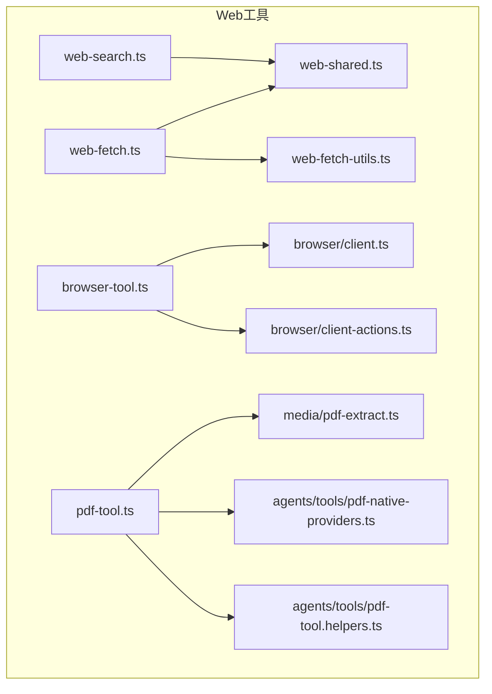
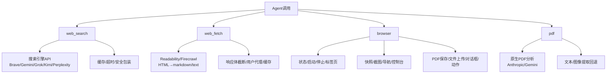
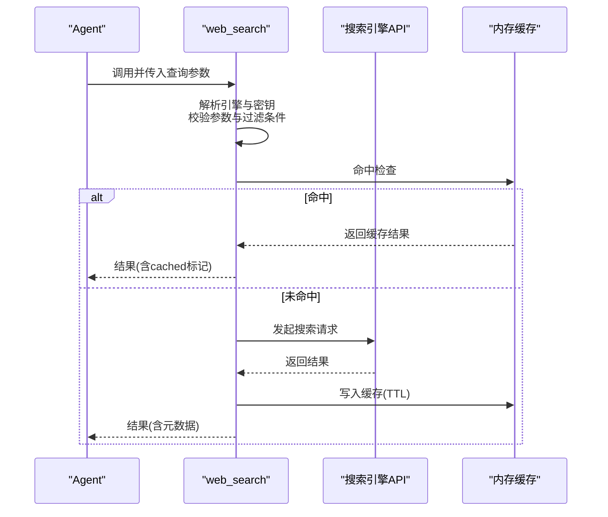
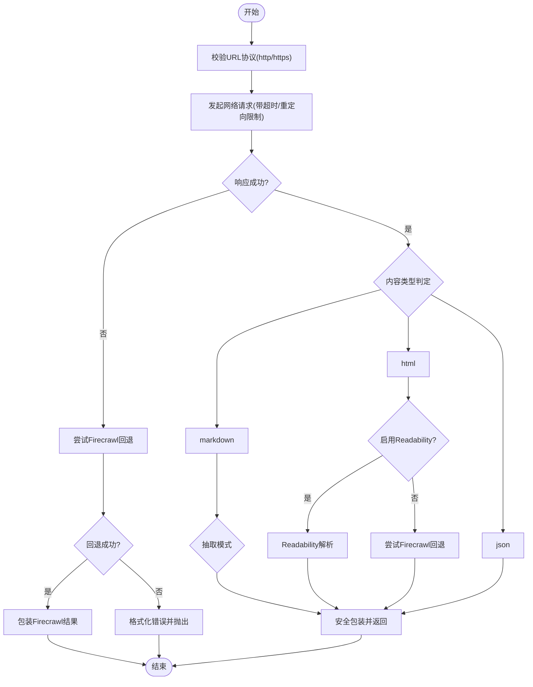
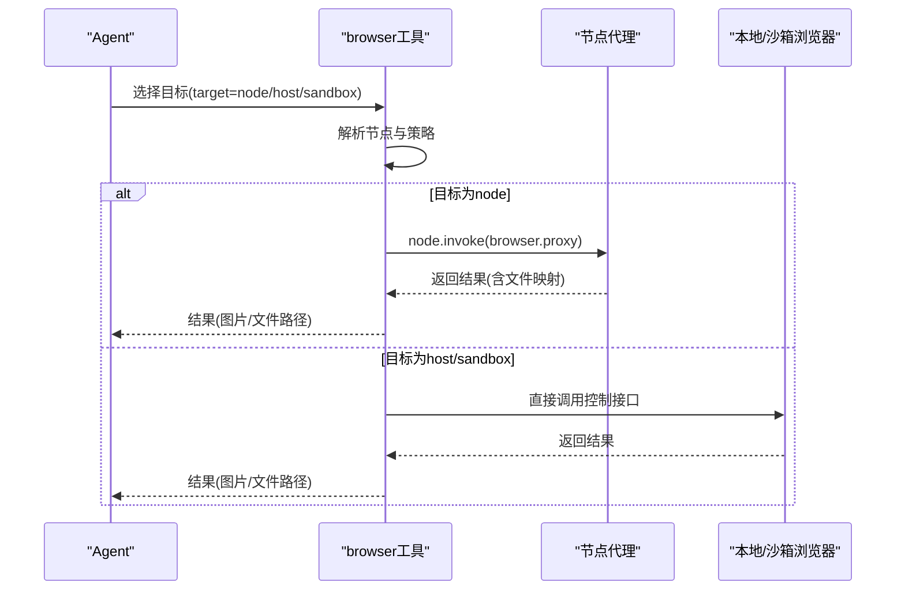
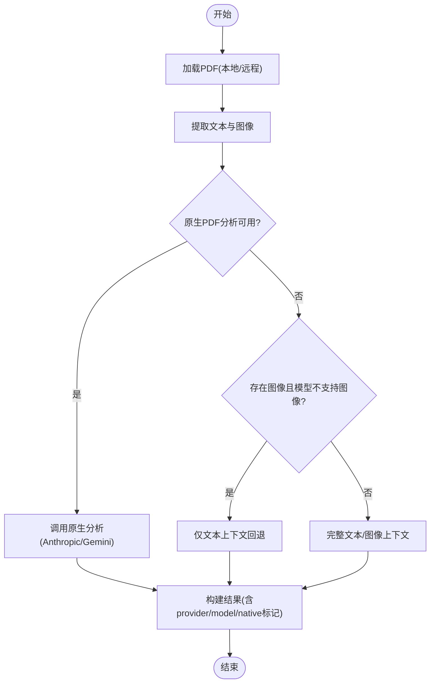
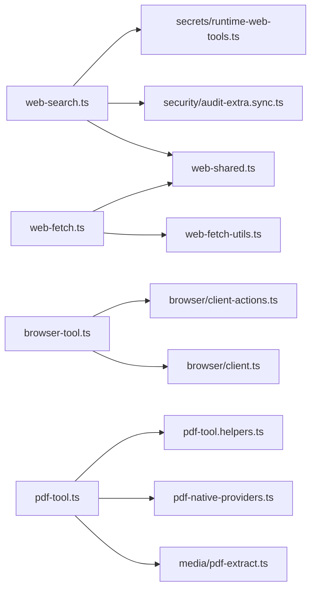

# Web工具

<cite>
**本文引用的文件**
- [src/agents/tools/web-search.ts](file://src/agents/tools/web-search.ts)
- [src/agents/tools/web-fetch.ts](file://src/agents/tools/web-fetch.ts)
- [src/agents/tools/web-fetch-utils.ts](file://src/agents/tools/web-fetch-utils.ts)
- [src/agents/tools/web-shared.ts](file://src/agents/tools/web-shared.ts)
- [src/agents/tools/browser-tool.ts](file://src/agents/tools/browser-tool.ts)
- [src/browser/client.ts](file://src/browser/client.ts)
- [src/browser/client-actions.ts](file://src/browser/client-actions.ts)
- [src/agents/tools/pdf-tool.ts](file://src/agents/tools/pdf-tool.ts)
- [src/media/pdf-extract.ts](file://src/media/pdf-extract.ts)
- [src/agents/tools/pdf-native-providers.ts](file://src/agents/tools/pdf-native-providers.ts)
- [src/agents/tools/pdf-tool.helpers.ts](file://src/agents/tools/pdf-tool.helpers.ts)
- [src/agents/tools/pdf-tool.test.ts](file://src/agents/tools/pdf-tool.test.ts)
- [src/agents/tools/pdf-tool.helpers.test.ts](file://src/agents/tools/pdf-tool.helpers.test.ts)
- [src/agents/tools/pdf-tool.test.ts](file://src/agents/tools/pdf-tool.test.ts)
- [src/agents/tools/pdf-tool.helpers.test.ts](file://src/agents/tools/pdf-tool.helpers.test.ts)
- [src/agents/tools/web-tools.enabled-defaults.test.ts](file://src/agents/tools/web-tools.enabled-defaults.test.ts)
- [src/security/audit-extra.sync.ts](file://src/security/audit-extra.sync.ts)
- [src/secrets/runtime-web-tools.ts](file://src/secrets/runtime-web-tools.ts)
- [docs/zh-CN/gateway/configuration.md](file://docs/zh-CN/gateway/configuration.md)
</cite>

## 目录
1. [简介](#简介)
2. [项目结构](#项目结构)
3. [核心组件](#核心组件)
4. [架构总览](#架构总览)
5. [详细组件分析](#详细组件分析)
6. [依赖关系分析](#依赖关系分析)
7. [性能考量](#性能考量)
8. [故障排查指南](#故障排查指南)
9. [结论](#结论)
10. [附录](#附录)

## 简介
本文件面向OpenClaw的Web工具体系，重点覆盖以下能力：
- web_search：多搜索引擎集成（Brave、Gemini、Grok/X.AI、Kimi/Moonshot、Perplexity），支持API密钥管理、结果缓存与安全防护。
- web_fetch：网页抓取与内容抽取（HTML→markdown/text），支持可选的Firecrawl解析器回退、响应体截断与安全包装。
- 浏览器工具：浏览器状态/启动/停止、标签页管理、快照/截图、导航、控制台、PDF保存、文件上传、对话框处理、动作执行等。
- PDF工具：文档解析、内容提取与格式转换，支持原生PDF分析（Anthropic/Gemini）与模型回退方案。

同时提供安全配置指南（反爬虫、限流、内容过滤）、代理系统集成与性能优化策略。

## 项目结构
Web工具相关代码主要位于src/agents/tools与src/browser目录下，并辅以通用共享模块与媒体处理模块：
- 搜索与抓取：web-search.ts、web-fetch.ts、web-fetch-utils.ts、web-shared.ts
- 浏览器控制：browser-tool.ts、browser/client.ts、browser/client-actions.ts
- PDF处理：pdf-tool.ts、pdf-extract.ts、pdf-native-providers.ts、pdf-tool.helpers.ts
- 安全与密钥：security/audit-extra.sync.ts、secrets/runtime-web-tools.ts
- 配置参考：docs/zh-CN/gateway/configuration.md

**图表来源**
- [src/agents/tools/web-search.ts](file://src/agents/tools/web-search.ts#L1-L800)
- [src/agents/tools/web-fetch.ts](file://src/agents/tools/web-fetch.ts#L1-L787)
- [src/agents/tools/web-fetch-utils.ts](file://src/agents/tools/web-fetch-utils.ts#L1-L255)
- [src/agents/tools/web-shared.ts](file://src/agents/tools/web-shared.ts#L1-L171)
- [src/agents/tools/browser-tool.ts](file://src/agents/tools/browser-tool.ts#L1-L660)
- [src/browser/client.ts](file://src/browser/client.ts#L1-L342)
- [src/browser/client-actions.ts](file://src/browser/client-actions.ts#L1-L5)
- [src/agents/tools/pdf-tool.ts](file://src/agents/tools/pdf-tool.ts#L1-L559)
- [src/media/pdf-extract.ts](file://src/media/pdf-extract.ts)
- [src/agents/tools/pdf-native-providers.ts](file://src/agents/tools/pdf-native-providers.ts)
- [src/agents/tools/pdf-tool.helpers.ts](file://src/agents/tools/pdf-tool.helpers.ts)

**章节来源**
- [src/agents/tools/web-search.ts](file://src/agents/tools/web-search.ts#L1-L800)
- [src/agents/tools/web-fetch.ts](file://src/agents/tools/web-fetch.ts#L1-L787)
- [src/agents/tools/web-fetch-utils.ts](file://src/agents/tools/web-fetch-utils.ts#L1-L255)
- [src/agents/tools/web-shared.ts](file://src/agents/tools/web-shared.ts#L1-L171)
- [src/agents/tools/browser-tool.ts](file://src/agents/tools/browser-tool.ts#L1-L660)
- [src/browser/client.ts](file://src/browser/client.ts#L1-L342)
- [src/browser/client-actions.ts](file://src/browser/client-actions.ts#L1-L5)
- [src/agents/tools/pdf-tool.ts](file://src/agents/tools/pdf-tool.ts#L1-L559)
- [src/media/pdf-extract.ts](file://src/media/pdf-extract.ts)
- [src/agents/tools/pdf-native-providers.ts](file://src/agents/tools/pdf-native-providers.ts)
- [src/agents/tools/pdf-tool.helpers.ts](file://src/agents/tools/pdf-tool.helpers.ts)

## 核心组件
- web_search：多引擎搜索、参数校验、时间过滤、语言区域、缓存与超时、安全包装与外部内容处理。
- web_fetch：URL抓取、内容抽取（Readability/Firecrawl）、错误回退、响应体截断、用户代理、缓存与超时。
- 浏览器工具：状态/启动/停止、标签页、快照/截图、导航、控制台、PDF保存、文件上传、对话框、动作执行。
- PDF工具：多PDF加载、分页范围、文本与图像提取、原生PDF分析（Anthropic/Gemini）与模型回退。

**章节来源**
- [src/agents/tools/web-search.ts](file://src/agents/tools/web-search.ts#L1-L800)
- [src/agents/tools/web-fetch.ts](file://src/agents/tools/web-fetch.ts#L1-L787)
- [src/agents/tools/browser-tool.ts](file://src/agents/tools/browser-tool.ts#L1-L660)
- [src/agents/tools/pdf-tool.ts](file://src/agents/tools/pdf-tool.ts#L1-L559)

## 架构总览
Web工具整体由“搜索/抓取/浏览器/PDF”四类工具构成，统一通过类型定义与共享模块（超时、缓存、网络守卫）进行约束与复用。浏览器工具支持本地宿主或节点代理两种目标，PDF工具在原生支持不足时采用文本/图像提取回退。

**图表来源**
- [src/agents/tools/web-search.ts](file://src/agents/tools/web-search.ts#L1-L800)
- [src/agents/tools/web-fetch.ts](file://src/agents/tools/web-fetch.ts#L1-L787)
- [src/agents/tools/browser-tool.ts](file://src/agents/tools/browser-tool.ts#L1-L660)
- [src/agents/tools/pdf-tool.ts](file://src/agents/tools/pdf-tool.ts#L1-L559)

## 详细组件分析

### web_search 组件分析
- 支持引擎：Brave、Gemini、Grok/X.AI、Kimi/Moonshot、Perplexity。
- 参数与过滤：查询、数量、国家/语言、新鲜度（day/week/month/year）、日期区间等；Brave支持搜索语言与UI语言。
- 认证与自动检测：优先从配置/环境变量解析API密钥；若未显式指定，按可用密钥自动选择引擎。
- 缓存与超时：基于内存Map的简单LRU缓存，支持TTL分钟级配置。
- 安全包装：对外部内容进行包装，避免直接注入风险。

**图表来源**
- [src/agents/tools/web-search.ts](file://src/agents/tools/web-search.ts#L1-L800)
- [src/agents/tools/web-shared.ts](file://src/agents/tools/web-shared.ts#L1-L171)

**章节来源**
- [src/agents/tools/web-search.ts](file://src/agents/tools/web-search.ts#L1-L800)
- [src/agents/tools/web-shared.ts](file://src/agents/tools/web-shared.ts#L1-L171)
- [src/security/audit-extra.sync.ts](file://src/security/audit-extra.sync.ts#L298-L345)
- [src/secrets/runtime-web-tools.ts](file://src/secrets/runtime-web-tools.ts#L358-L378)
- [docs/zh-CN/gateway/configuration.md](file://docs/zh-CN/gateway/configuration.md#L2000-L2018)

### web_fetch 组件分析
- 功能：抓取URL，识别内容类型（markdown/html/json），抽取正文（Readability/Firecrawl），安全包装输出。
- 可选增强：Firecrawl解析器（可配置onlyMainContent、maxAgeMs、timeoutSeconds、proxy模式等）。
- 错误处理：对非2xx响应进行格式化错误消息，必要时回退到Firecrawl；支持响应体最大字节限制与截断警告。
- 输出字段：包含原始URL、最终URL、状态码、内容类型、标题、抽取模式、抽取器、外部内容标记、长度统计、时间戳等。

**图表来源**
- [src/agents/tools/web-fetch.ts](file://src/agents/tools/web-fetch.ts#L508-L684)
- [src/agents/tools/web-fetch-utils.ts](file://src/agents/tools/web-fetch-utils.ts#L209-L255)
- [src/agents/tools/web-shared.ts](file://src/agents/tools/web-shared.ts#L1-L171)

**章节来源**
- [src/agents/tools/web-fetch.ts](file://src/agents/tools/web-fetch.ts#L1-L787)
- [src/agents/tools/web-fetch-utils.ts](file://src/agents/tools/web-fetch-utils.ts#L1-L255)
- [src/agents/tools/web-shared.ts](file://src/agents/tools/web-shared.ts#L1-L171)

### 浏览器工具组件分析
- 目标选择：支持本地宿主、沙箱桥接、节点代理三种目标；根据策略与节点能力自动路由。
- 行为动作：状态、启动、停止、配置文件列表、标签页管理、打开/聚焦/关闭、导航、快照、截图、控制台、PDF保存、文件上传、对话框、动作执行等。
- 安全与代理：通过网关节点代理访问远端浏览器，支持超时与文件持久化映射。

**图表来源**
- [src/agents/tools/browser-tool.ts](file://src/agents/tools/browser-tool.ts#L1-L660)
- [src/browser/client.ts](file://src/browser/client.ts#L1-L342)

**章节来源**
- [src/agents/tools/browser-tool.ts](file://src/agents/tools/browser-tool.ts#L1-L660)
- [src/browser/client.ts](file://src/browser/client.ts#L1-L342)
- [src/browser/client-actions.ts](file://src/browser/client-actions.ts#L1-L5)

### PDF工具组件分析
- 多PDF输入：单个或多个PDF路径/URL，支持本地路径、file://、http(s)、data:等。
- 提取与分析：默认先进行文本与图像提取，再根据模型能力决定是否走原生PDF分析（Anthropic/Gemini）。
- 模型回退：当模型不支持图像且无文本时给出明确错误；否则使用文本上下文进行分析。
- 分页与大小：支持页码范围解析与最大字节数限制。

**图表来源**
- [src/agents/tools/pdf-tool.ts](file://src/agents/tools/pdf-tool.ts#L168-L289)
- [src/media/pdf-extract.ts](file://src/media/pdf-extract.ts)
- [src/agents/tools/pdf-native-providers.ts](file://src/agents/tools/pdf-native-providers.ts)
- [src/agents/tools/pdf-tool.helpers.ts](file://src/agents/tools/pdf-tool.helpers.ts)

**章节来源**
- [src/agents/tools/pdf-tool.ts](file://src/agents/tools/pdf-tool.ts#L1-L559)
- [src/media/pdf-extract.ts](file://src/media/pdf-extract.ts)
- [src/agents/tools/pdf-native-providers.ts](file://src/agents/tools/pdf-native-providers.ts)
- [src/agents/tools/pdf-tool.helpers.ts](file://src/agents/tools/pdf-tool.helpers.ts)

## 依赖关系分析
- web_search依赖web-shared进行缓存与超时配置；运行时密钥解析与提供商选择逻辑来自安全与密钥模块。
- web_fetch依赖web-fetch-utils进行HTML→markdown/text转换与Readability解析；同样依赖web-shared进行缓存与超时。
- 浏览器工具通过网关节点代理访问远端浏览器，内部封装状态与动作调用。
- PDF工具依赖媒体提取模块与原生PDF分析提供者，结合模型回退策略。

**图表来源**
- [src/agents/tools/web-search.ts](file://src/agents/tools/web-search.ts#L1-L800)
- [src/agents/tools/web-shared.ts](file://src/agents/tools/web-shared.ts#L1-L171)
- [src/security/audit-extra.sync.ts](file://src/security/audit-extra.sync.ts#L298-L345)
- [src/secrets/runtime-web-tools.ts](file://src/secrets/runtime-web-tools.ts#L358-L378)
- [src/agents/tools/web-fetch.ts](file://src/agents/tools/web-fetch.ts#L1-L787)
- [src/agents/tools/web-fetch-utils.ts](file://src/agents/tools/web-fetch-utils.ts#L1-L255)
- [src/agents/tools/browser-tool.ts](file://src/agents/tools/browser-tool.ts#L1-L660)
- [src/browser/client.ts](file://src/browser/client.ts#L1-L342)
- [src/browser/client-actions.ts](file://src/browser/client-actions.ts#L1-L5)
- [src/agents/tools/pdf-tool.ts](file://src/agents/tools/pdf-tool.ts#L1-L559)
- [src/media/pdf-extract.ts](file://src/media/pdf-extract.ts)
- [src/agents/tools/pdf-native-providers.ts](file://src/agents/tools/pdf-native-providers.ts)
- [src/agents/tools/pdf-tool.helpers.ts](file://src/agents/tools/pdf-tool.helpers.ts)

**章节来源**
- [src/agents/tools/web-tools.enabled-defaults.test.ts](file://src/agents/tools/web-tools.enabled-defaults.test.ts#L153-L196)

## 性能考量
- 缓存策略：web_search与web_fetch均使用内存Map缓存，支持TTL分钟级配置；建议合理设置cacheTtlMinutes以平衡时效性与成本。
- 超时控制：默认超时30秒，可通过timeoutSeconds调整；过短可能导致不稳定，过长可能影响响应速度。
- 响应体限制：web_fetch对响应体最大字节数进行限制并支持截断警告，避免内存与带宽压力。
- Firecrawl回退：在Readability失败或禁用时自动回退，提升成功率但需关注第三方服务SLA。
- 浏览器代理：节点代理引入额外延迟，建议在可用时优先本地/沙箱直连；必要时设置合理超时与文件映射清理。

[本节为通用指导，无需特定文件引用]

## 故障排查指南
- web_search缺少API密钥：根据提示运行配置命令或设置环境变量；不同引擎对应不同密钥来源。
- web_fetch抓取失败：检查URL协议、响应状态码与内容类型；查看截断警告；确认Readability启用与Firecrawl可用。
- 浏览器工具无响应：确认目标策略与节点连接状态；检查代理超时与文件持久化；确保已附着Chrome扩展或正确选择profile。
- PDF工具报错：确认PDF类型与大小限制；当模型不支持图像且无文本时会拒绝；检查页码范围与原生分析可用性。

**章节来源**
- [src/agents/tools/web-search.ts](file://src/agents/tools/web-search.ts#L564-L602)
- [src/agents/tools/web-fetch.ts](file://src/agents/tools/web-fetch.ts#L555-L595)
- [src/agents/tools/browser-tool.ts](file://src/agents/tools/browser-tool.ts#L251-L279)
- [src/agents/tools/pdf-tool.ts](file://src/agents/tools/pdf-tool.ts#L210-L254)

## 结论
OpenClaw的Web工具体系通过统一的类型与共享模块实现了搜索、抓取、浏览器控制与PDF分析的高内聚低耦合设计。配合缓存、超时与安全包装，能够在保证安全性的同时提供灵活的网页与文档处理能力。建议在生产环境中合理配置密钥、缓存与超时参数，并根据业务场景选择合适的引擎与解析器回退策略。

[本节为总结性内容，无需特定文件引用]

## 附录
- 配置项参考（摘自官方文档）：
  - tools.web.search.enabled、apiKey、maxResults、timeoutSeconds、cacheTtlMinutes
  - tools.web.fetch.enabled、maxChars、timeoutSeconds、cacheTtlMinutes、userAgent、readability
  - tools.web.fetch.firecrawl.enabled、apiKey、baseUrl、onlyMainContent、maxAgeMs、timeoutSeconds

**章节来源**
- [docs/zh-CN/gateway/configuration.md](file://docs/zh-CN/gateway/configuration.md#L2000-L2018)